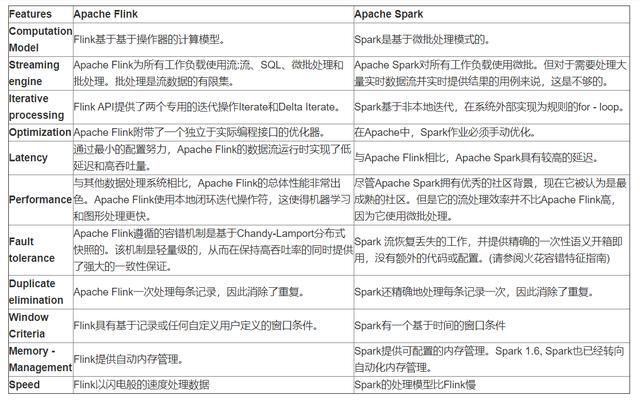

Spark streaming 是更快的批处理，而Flink Batch是有限数据的流式计算

[flink与Spark的对比分析](https://www.jianshu.com/p/905ca3a7edb9)
[Spark与Flink对比](https://blog.csdn.net/justlpf/article/details/104152719/)

当然，它们的不同点也是相当明显，我们可以从4个不同的角度来看。

- 从流处理的角度来讲，Spark基于微批量处理，把流数据看成是一个个小的批处理数据块分别处理，所以延迟性只能做到秒级。而Flink基于每个事件处理，每当有新的数据输入都会立刻处理，是真正的流式计算，支持毫秒级计算。由于相同的原因，**Spark只支持基于时间的窗口操作（处理时间或者事件时间），而Flink支持的窗口操作则非常灵活，不仅支持时间窗口，还支持基于数据本身的窗口**(另外还支持基于time、count、session，以及data-driven的窗口操作)，开发者可以自由定义想要的窗口操作。
- 从SQL 功能的角度来讲，Spark和Flink分别提供SparkSQL和Table APl提供SQL
- 交互支持。两者相比较，**Spark对SQL支持更好，相应的优化、扩展和性能更好，而Flink在SQL支持方面还有很大提升空间**。
- 从迭代计算的角度来讲，Spark对机器学习的支持很好，因为可以在内存中缓存中间计算结果来加速机器学习算法的运行。但是大部分机器学习算法其实是一个有环的数据流，在Spark中，却是用无环图来表示。而Flink支持在运行时间中的有环数据流，从而可以更有效的对机器学习算法进行运算。
- 从相应的生态系统角度来讲，Spark 的社区无疑更加活跃。Spark可以说有着Apache旗下最多的开源贡献者，而且有很多不同的库来用在不同场景。而Flink由于较新，现阶段的开源社区不如Spark活跃，各种库的功能也不如Spark全面。但是Flink还在不断发展，各种功能也在逐渐完善。

