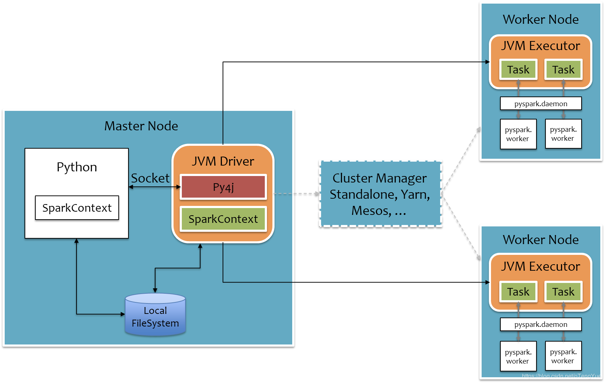
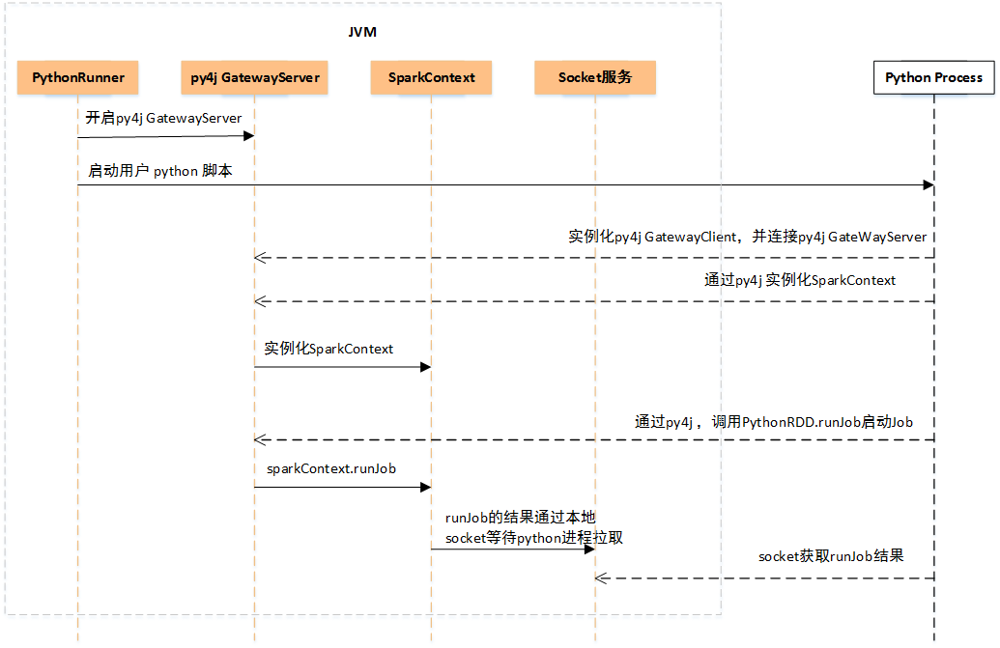
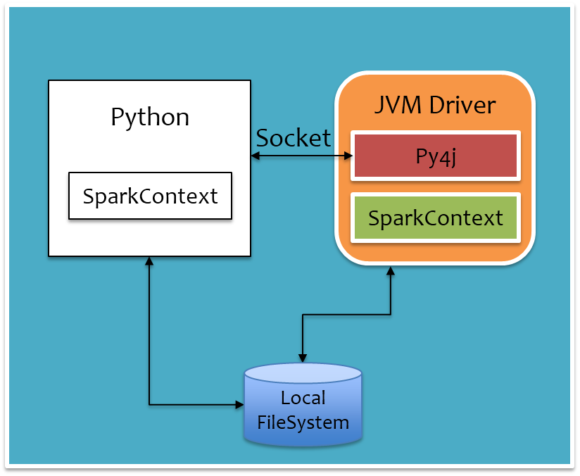
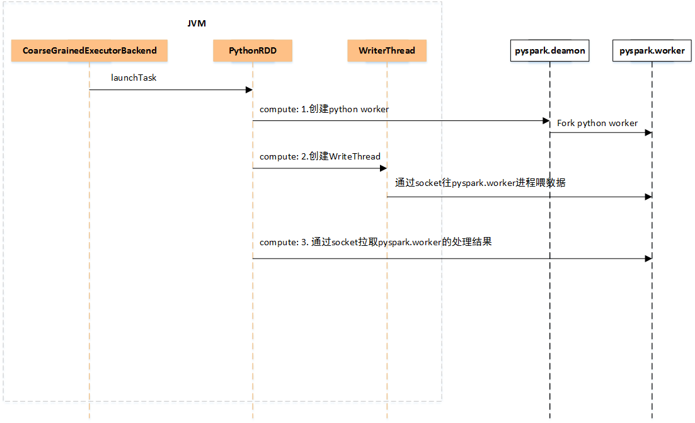
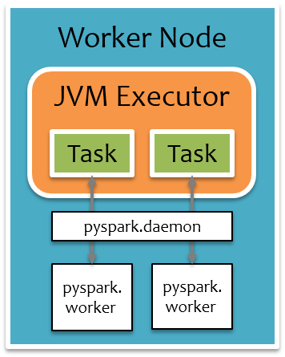

## PySpark_Cheat_Sheet_Python
[Cheat sheet PySpark SQL Python（PySpark 速查表）](https://www.cnblogs.com/sandy-t/p/8917938.html)

[PySpark Rdd Cheat Sheet Python](https://blog.csdn.net/dfciw9355481/article/details/101292262)

[PySpark Cheat Sheet: Spark in Python](https://www.datacamp.com/community/blog/pyspark-cheat-sheet-python)

[Python cheat sheet for data science](https://www.micronbot.com/Data-Science/Python-cheat-sheet-for-data-science.html)

## PySpark 的背后原理
https://blog.csdn.net/oTengYue/article/details/88417186
http://sharkdtu.com/posts/pyspark-internal.html
### PySpark运行时架构
为了不破坏Spark已有的运行时架构，Spark在外围包装一层Python API，借助[Py4j](https://www.py4j.org/)实现Python和Java的交互，进而实现通过Python编写Spark应用程序，其运行时架构如下图所示。

其中白色部分是新增的Python进程，在Driver端，通过Py4j实现在Python中调用Java的方法，即将用户写的PySpark程序”映射”到JVM中，例如，用户在PySpark中实例化一个Python的SparkContext对象，最终会在JVM中实例化Scala的SparkContext对象；在Executor端，则不需要借助Py4j，因为Executor端运行的Task逻辑是由Driver发过来的，那是序列化后的字节码，虽然里面可能包含有用户定义的Python函数或Lambda表达式，Py4j并不能实现在Java里调用Python的方法，为了能在Executor端运行用户定义的Python函数或Lambda表达式，则需要为每个Task单独启一个Python进程，通过socket通信方式将Python函数或Lambda表达式发给Python进程执行。语言层面的交互总体流程如下图所示，实线表示方法调用，虚线表示结果返回。

下面分别详细剖析PySpark的Driver是如何运行起来的以及Executor是如何运行Task的。

### Driver端运行原理
当我们通过spark-submmit提交pyspark程序，首先会上传python脚本及依赖，并申请Driver资源，当申请到Driver资源后，会通过PythonRunner(其中有main方法)拉起JVM，如下图所示。

PythonRunner入口main函数里主要做两件事：

- 开启Py4j GatewayServer
- 通过Java Process方式运行用户上传的Python脚本

用户Python脚本起来后，首先会实例化Python版的SparkContext对象，在实例化过程中会做两件事：

- 实例化Py4j GatewayClient，连接JVM中的Py4j GatewayServer，后续在Python中调用Java的方法都是借助这个Py4j Gateway
- 通过Py4j Gateway在JVM中实例化SparkContext对象

经过上面两步后，SparkContext对象初始化完毕，Driver已经起来了，开始申请Executor资源，同时开始调度任务。用户Python脚本中定义的一系列处理逻辑最终遇到action方法后会触发Job的提交，提交Job时是直接通过Py4j调用Java的PythonRDD.runJob方法完成，映射到JVM中，会转给sparkContext.runJob方法，Job运行完成后，JVM中会开启一个本地Socket等待Python进程拉取，对应地，Python进程在调用PythonRDD.runJob后就会通过Socket去拉取结果。

把前面运行时架构图中Driver部分单独拉出来，如下图所示，通过PythonRunner入口main函数拉起JVM和Python进程，JVM进程对应下图橙色部分，Python进程对应下图白色部分。Python进程通过Py4j调用Java方法提交Job，Job运行结果通过本地Socket被拉取到Python进程。还有一点是，对于大数据量，例如广播变量等，Python进程和JVM进程是通过本地文件系统来交互，以减少进程间的数据传输。

### Executor端运行原理

为了方便阐述，以Spark On Yarn为例，当Driver申请到Executor资源时，会通过CoarseGrainedExecutorBackend(其中有main方法)拉起JVM，启动一些必要的服务后等待Driver的Task下发，在还没有Task下发过来时，Executor端是没有Python进程的。当收到Driver下发过来的Task后，Executor的内部运行过程如下图所示。

Executor端收到Task后，会通过launchTask运行Task，最后会调用到PythonRDD的compute方法，来处理一个分区的数据，PythonRDD的compute方法的计算流程大致分三步走：

- 如果不存在pyspark.deamon后台Python进程，那么通过Java Process的方式启动pyspark.deamon后台进程，注意每个Executor上只会有一个pyspark.deamon后台进程，否则，直接通过Socket连接pyspark.deamon，请求开启一个pyspark.worker进程运行用户定义的Python函数或Lambda表达式。pyspark.deamon是一个典型的多进程服务器，来一个Socket请求，fork一个pyspark.worker进程处理，一个Executor上同时运行多少个Task，就会有多少个对应的pyspark.worker进程。
- 紧接着会单独开一个线程，给pyspark.worker进程喂数据，pyspark.worker则会调用用户定义的Python函数或Lambda表达式处理计算。
- 在一边喂数据的过程中，另一边则通过Socket去拉取pyspark.worker的计算结果。

把前面运行时架构图中Executor部分单独拉出来，如下图所示，橙色部分为JVM进程，白色部分为Python进程，每个Executor上有一个公共的pyspark.deamon进程，负责接收Task请求，并fork pyspark.worker进程单独处理每个Task，实际数据处理过程中，pyspark.worker进程和JVM Task会较频繁地进行本地Socket数据通信。

### PySpark 会比Scala或Java慢吗
[PySpark 会比Scala或Java慢吗](https://www.jianshu.com/p/b2119839a18a)
[Apache Spark一定要用Scala？PySpark的性能详解（译）](https://zhuanlan.zhihu.com/p/79543031)

### 总结

总体上来说，PySpark是借助Py4j实现Python调用Java，来驱动Spark应用程序，本质上主要还是JVM runtime，Java到Python的结果返回是通过本地Socket完成。虽然这种架构保证了Spark核心代码的独立性，但是在大数据场景下，JVM和Python进程间频繁的数据通信导致其性能损耗较多，恶劣时还可能会直接卡死，所以建议对于大规模机器学习或者Streaming应用场景还是慎用PySpark，尽量使用原生的Scala/Java编写应用程序，对于中小规模数据量下的简单离线任务，可以使用PySpark快速部署提交。

API设计

PySpark API的设计和Scala类似，并不那么Pythonic。 这意味着很容易地可以在两种语言之间切换，但同时，Python可能会变得难以理解

架构的复杂性

PySpark数据处理流程相当复杂比起纯粹的JVM执行来说。PySpark程序非常难去debug或找出出错原因。此外，至少在基本对Scala和JVM总体的理解上是必须要有的。

该用的时候你就去用吧，还犹豫什么？

