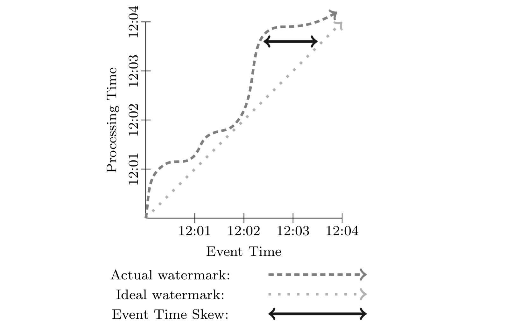

<!--toc-->
[TOC]

# BigData + AI

## hadoop

### hive与hbase的联系与区别
hive与hbase的联系与区别：
共同点：
1. hbase与hive都是架构在hadoop之上的。都是用hadoop作为底层存储。

他们的底层是要通过mapreduce分布式计算的，hbase、hive、pig底层都是这样的。但整体来说hadoop还是比较快的，因为它是进行海量数据存储和分布式计算，这个速度已经很不错了。

区别：

2. Hive是建立在Hadoop之上为了减少MapReduce jobs编写工作的批处理系统，HBase是为了支持弥补Hadoop对实时操作的缺陷的项目 。
3. 想象你在操作RMDB数据库，如果是全表扫描，就用Hive+Hadoop,如果是索引访问，就用HBase+Hadoop 。
4. Hive query就是MapReduce jobs可以从5分钟到数小时不止，HBase是非常高效的，肯定比Hive高效的多。
5. Hive本身不存储和计算数据，它完全依赖于HDFS和MapReduce，Hive中的表纯逻辑。hive需要用到hdfs存储文件，需要用到MapReduce计算框架。

6. hive借用hadoop的MapReduce来完成一些hive中的命令的执行
7. hbase是物理表，不是逻辑表，提供一个超大的内存hash表，搜索引擎通过它来存储索引，方便查询操作。
8. hbase是列存储。
9. hdfs作为底层存储，hdfs是存放文件的系统，而Hbase负责组织文件。

> 觉得在问区别之前，我应该显示说相同点，这么一想，又糊涂了，hive和hbase哪里像了，好像哪里都不像，既然哪里都不像，又何来的“区别是什么”这一问题，他俩所有的都算区别。
那么，hive是什么？
白话一点再加不严格一点，**hive可以认为是map-reduce的一个包装**。hive的意义就是把好写的hive的sql转换为复杂难写的map-reduce程序。
于是，hbase是什么？
同样白话一点加不严格一点，**hbase可以认为是hdfs的一个包装**。他的本质是数据存储，是个NoSql数据库；hbase部署于hdfs之上，并且克服了hdfs在随机读写方面的缺点。
所以要问hive和hbase的区别，就应该问问map-reduce和hdfs之间的区别，问区别，就要先说说他俩哪里像。
于是，你说map-reduce和hdfs哪里像了呢？

说点题外话：hive难在sql，habse难在表结构的设计

## Cassandra+Spark

简单来说 可以使用Cassandra+Spark代替Hbase+Hive

### SparkSQL

[Hive，Hive on Spark和SparkSQL区别](https://www.cnblogs.com/lixiaochun/p/9446350.html)

SparkSQL的前身是Shark，给熟悉RDBMS但又不理解MapReduce的技术人员提供快速上手的工具，hive应运而生，它是当时唯一运行在Hadoop上的SQL-on-hadoop工具。但是MapReduce计算过程中大量的中间磁盘落地过程消耗了大量的I/O，降低的运行效率，为了提高SQL-on-Hadoop的效率，Shark应运而生，但又因为Shark对于Hive的太多依赖（如采用Hive的语法解析器、查询优化器等等),2014年spark团队停止对Shark的开发，将所有资源放SparkSQL项目上，其中SparkSQL作为Spark生态的一员继续发展，而不再受限于Hive，只是兼容Hive；而Hive on Spark是一个Hive的发展计划，该计划将Spark作为Hive的底层引擎之一，也就是说，Hive将不再受限于一个引擎，可以采用Map-Reduce、Tez、Spark等引擎。

SparkSQL的两个组件：

- SQLContext：Spark SQL提供SQLContext封装Spark中的所有关系型功能。可以用之前的示例中的现有SparkContext创建SQLContext。 
- DataFrame：DataFrame是一个分布式的，按照命名列的形式组织的数据集合。DataFrame基于R语言中的data frame概念，与关系型数据库中的数据库表类似。通过调用将DataFrame的内容作为行RDD（RDD of Rows）返回的rdd方法，可以将DataFrame转换成RDD。可以通过如下数据源创建DataFrame：已有的RDD、结构化数据文件、JSON数据集、Hive表、外部数据库。

Hive on Spark

hive on Spark是由Cloudera发起，由Intel、MapR等公司共同参与的开源项目，其目的是把Spark作为Hive的一个计算引擎，将Hive的查询作为Spark的任务提交到Spark集群上进行计算。通过该项目，可以提高Hive查询的性能，同时为已经部署了Hive或者Spark的用户提供了更加灵活的选择，从而进一步提高Hive和Spark的普及率。

Hive on Spark与SparkSql的区别

hive on spark大体与SparkSQL结构类似，只是SQL引擎不同，但是计算引擎都是spark！

## [现代流式计算的基石：Google DataFlow](https://yq.aliyun.com/articles/688767)

### 2. 核心概念
#### 2.1 Unbounded/Bounded vs Streaming/Batch
在 Dataflow 之前，对于有限/无限数据集合的描述，一般使用批/流 （Batch/Streaming），总有一种暗示底层两套引擎（批处理引擎和流处理引擎）。对于批处理和流处理，一般情况下是可以互相转化的，比如 Spark 用微批来模拟流。而 Dataflow 模型一般将有限/无限数据集合称为 Bounded/Unbounded Dataset，而 Streaming/Batch 用来特指执行引擎。

#### 2.2 Window
Window，也就是窗口，将一部分数据集合组合起操作。在处理无限数据集的时候有限操作需要窗口，比如 aggregation，outer join，time-bounded 操作。窗口大部分都是基于时间来划分，但是也有基于其他存在逻辑上有序关系的数据来划分的。窗口模型主要由三种：Fixed Window，Sliding Window，Session Window。

##### 1. Fixed Window
Fixed Window ，有时候也叫 Tumbling Window。Tumble 的中文翻译有“翻筋斗”，我们可以将 Fixed Window 是特定的时间长度在无限数据集合上翻滚形成的，核心是每个 Window 没有重叠。比如小时窗口就是 12:00:00 ~ 13:00:00 一个窗口，13:00:00 ~ 14:00:00 一个窗口。从例子也可以看出来 Fixed Window 的另外一个特征：aligned，中文一般称为对齐。可能有些人还是不太明白。那么我举一个在编程语言中一个例子：address alignment，内存地址a被称为n字节对齐，当a是n的倍数（n应是2的幂）。但是有时候处于某些目的，窗口也可以是不对齐的。

##### 2. Sliding Window
Sliding Window，中文可以叫滑动窗口，由两个参数确定，窗口大小和滑动间隔。比如每分钟开始一个小时窗口对应的就是窗口大小为一小时，滑动间隔为一分钟。滑动间隔一般小于窗口大小，也就是说窗口之间会有重叠。滑动窗口在很多情况下都比较有用，比如检测机器的半小时负载，每分钟检测一次。Fixed Window 是 Sliding Window 的一种特例：窗口大小等于滑动间隔。

##### 3. Session Window
Session Window，中文可以叫会话窗口， 一般用来捕捉一段时间内的行为，比如 Web 中一段时间内的登录行为为一个 Session，当长时间没有登录，则 Session 失效，再次登录重启一个 Session。Session Window 也是用超时时间来衡量，只要在超时时间内发生的事件都认为是一个 Session Window。

#### 2.3 Time Domain
在流式处理中关于时间有两个概念需要注意：

- Event Time，事件发生的时间。
- Processing TIme，事件在系统中的处理时间。

这两个概念非常简单。比如在 IoT 中，传感器采集事件时对应的系统时间就是 Event Time，然后事件发送到流式系统进行处理，处理的时候对应的系统时间就是 Processing Time。虽然是两个很简单概念，但是在 Dataflow 模型之前，很多系统并没有显示区分，比如 Spark Streaming。

在现实中，由于通信延迟、调度延迟等，往往导致 Event Time 和 Processing Time 之间存在差值（skew），且动态变化。skew 一般使用 watermark 来进行可视化，如下图。

## [Apache Spark3.0什么样？一文读懂Apache Spark最新技术发展与展望](https://yq.aliyun.com/articles/712303)

### Databricks、Delta Lake

### 三、Spark与AI框架深度集成的最新进展
机器学习任务的完整链条非常长，包括数据的收集、落地、清理、准备，以及模型的训练、检验以及预测等。Spark比较擅长该链条比较靠前的部分，即数据的采集、落地、清理和准备。深度学习框架擅长链条靠后这部分，即模型的训练、验证和分析。用户在完成一个深度学习任务时，需要基于比如Spark和Tensorflow这两套系统，这就给用户带来了很多不便之处，比如两套系统的部署、运维、管理等。另外，这也使得整个任务的开发、Debug、Troubleshooting变得困难。

## [Spark入门实战系列--1.Spark及其生态圈简介](https://www.cnblogs.com/shishanyuan/p/4700615.html)

Spark常用术语

| 术语   | 描述      |
|--------------------|-----------|
| Application      | Spark的应用程序，包含一个Driver program和若干Executor  |
| SparkContext     | Spark应用程序的入口，负责调度各个运算资源，协调各个Worker Node上的Executor                                                 |
| Driver Program   | 运行Application的main()函数并且创建SparkContext   |
| Executor         | 是为Application运行在Worker node上的一个进程，该进程负责运行Task，并且负责将数据存在内存或者磁盘上。每个Application都会申请各自的Executor来处理任务 |
| Cluster Manager  | 在集群上获取资源的外部服务(例如：Standalone、Mesos、Yarn)  |
| Worker Node      | 集群中任何可以运行Application代码的节点，运行一个或多个Executor进程   |
| Task | 运行在Executor上的工作单元  |
| Job  | SparkContext提交的具体Action操作，常和Action对应  |
| Stage  | 每个Job会被拆分很多组task，每组任务被称为Stage，也称TaskSet  |
| RDD | 是Resilient distributed datasets的简称，中文为弹性分布式数据集;是Spark最核心的模块和类  |
| DAGScheduler     | 根据Job构建基于Stage的DAG，并提交Stage给TaskScheduler   |
| TaskScheduler    | 将Taskset提交给Worker node集群运行并返回结果   |
| Transformations  | 是Spark API的一种类型，Transformation返回值还是一个RDD，所有的Transformation采用的都是懒策略，如果只是将Transformation提交是不会执行计算的 |
| Action | 是Spark API的一种类型，Action返回值不是一个RDD，而是一个scala集合；计算只有在Action被提交的时候计算才被触发。  |

## [Spark核心技术原理透视一（Spark运行原理） ](https://www.sohu.com/a/217196727_100065429)

https://blog.csdn.net/zxc123e/article/details/79912343

http://spark.apache.org/faq.html

[Spark--Spark RDD与Dataframe/Datasets对比学习](https://www.jianshu.com/p/9e6482bcec99)