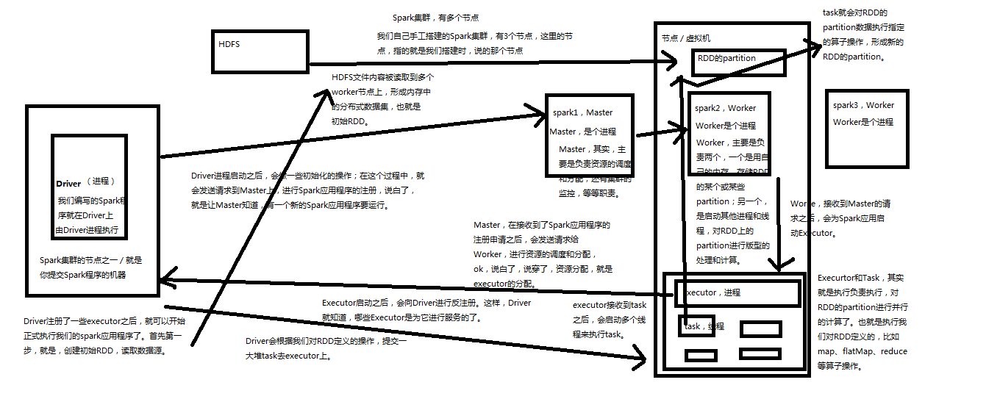
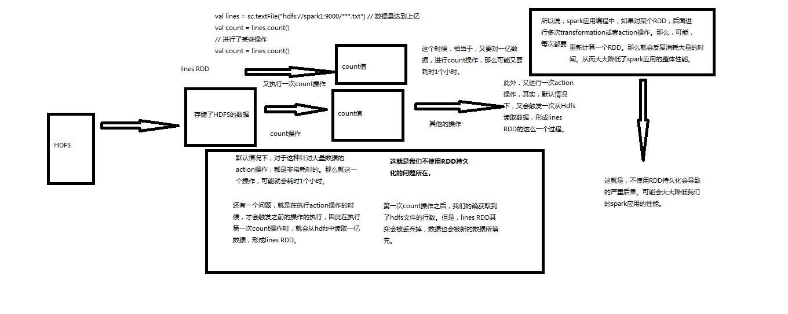
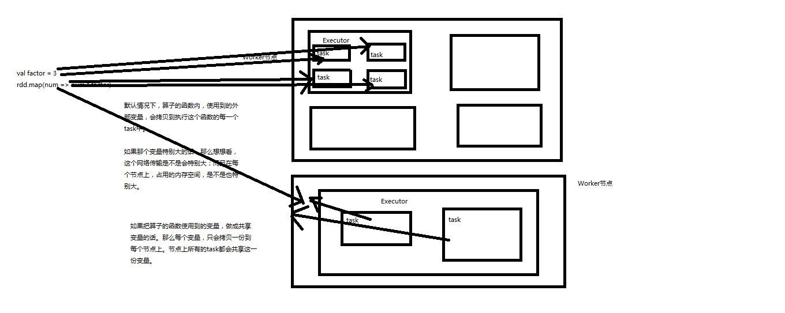

## spark架构原理

1、Driver，启动之后执行一些初始化操作，然后向Master进行注册，让master知道有一个spark应用程序要执行。在Executor反向注册以后，就可以开始正式执行spark程序，首先第一步创建初始RDD，读取数据源。从HDFS文件内容中读取数据，分布到work节点上，形成内存中的分布式数据集也就是初始RDD。Driver会根据我们对RDD定义的操作，提交一堆task去excecutor上去

2、Master，master主要复制资源调度和集群监控等功能。它收到Driver发送的请求后，发送请求给work，进行资源分配就是分配一些executor

3、Worker，主要负责存储rdd的一些和部分partition，另外一个就是启动其他进程和线程对partition进行版型处理和计算。Executor启动后会反向向Driver进行注册，这样Driver就知道那些executor为他进行服务

4、Executor，executor接收到多个task后会启动多个线程来执行task

5、Task task就会对RDD的partition数据执行指定的算子操作，形成新的RDD的partition



## spark-spark RDD的创建
进行Spark核心编程时，首先要做的第一件事，就是创建一个初始的RDD。该RDD中，通常就代表和包含了Spark应用程序的输入源数据。然后在创建了初始的RDD之后，才可以通过Spark Core提供的transformation算子，对该RDD进行转换，来获取其他的RDD。

Spark Core提供了三种创建RDD的方式，包括：使用程序中的集合创建RDD；使用本地文件创建RDD；使用HDFS文件创建RDD。

1、使用程序中的集合创建RDD，主要用于进行测试，可以在实际部署到集群运行之前，自己使用集合构造测试数据，来测试后面的spark应用的流程。`sc.parallelize(Arrays.asList(1, 2, 3, 4, 5, 6, 7, 8, 9, 10));`
2、使用本地文件创建RDD，主要用于临时性地处理一些存储了大量数据的文件。集群上运行时需要所有集群上都有该文件 `sc.textFile("C://Users//Administrator//Desktop//spark.txt");`
3、使用HDFS文件创建RDD，应该是最常用的生产环境处理方式，主要可以针对HDFS上存储的大数据，进行离线批处理操作。`sc.textFile("hdfs://spark1:9000/spark.txt");`

如果要通过并行化集合来创建RDD，需要针对程序中的集合，调用SparkContext的parallelize()方法。Spark会将集合中的数据拷贝到集群上去，形成一个分布式的数据集合，也就是一个RDD。相当于是，集合中的部分数据会到一个节点上，而另一部分数据会到其他节点上。然后就可以用并行的方式来操作这个分布式数据集合，即RDD。

调用parallelize()时，有一个重要的参数可以指定，就是要将集合切分成多少个partition。Spark会为每一个partition运行一个task来进行处理。Spark官方的建议是，为集群中的每个CPU创建2~4个partition。Spark默认会根据集群的情况来设置partition的数量。但是也可以在调用parallelize()方法时，传入第二个参数，来设置RDD的partition数量。比如parallelize(arr, 10)
Spark是支持使用任何Hadoop支持的存储系统上的文件创建RDD的，比如说HDFS、Cassandra、HBase以及本地文件。通过调用SparkContext的textFile()方法，可以针对本地文件或HDFS文件创建RDD。

有几个事项是需要注意的：
1、如果是针对本地文件的话，如果是在windows上本地测试，windows上有一份文件即可；如果是在spark集群上针对linux本地文件，那么需要将文件拷贝到所有worker节点上。
2、Spark的textFile()方法支持针对目录、压缩文件以及通配符进行RDD创建。
3、Spark默认会为hdfs文件的每一个block创建一个partition，但是也可以通过textFile()的第二个参数手动设置分区数量，只能比block数量多，不能比block数量少。

## Spark-Spark RDD操作
Spark只支持两种RDD操作，transformation和action操作，transformation针对已有的RDD创建一个新的RDD文件，action主要是对RDD进行最后操作，比如遍历和reduce、保存到文件等，并可以返回结果到Driver程序

transformation,都具有lazy特性，只定义transformation操作是不会执行，只有接着执行一个action操作后才会执行。通过lazy特性避免产生过多中间结果。

wordcount程序就是如下执行流程，如下这块都在driver节点执行。所有transformation都是lazy，不会立即执行，只有执行了action后，才会触发job，提交task到spark集群上，进行实际的执行


transformation介绍
操作 |	介绍
---|---
map	|将RDD中的每个元素传入自定义函数，获取一个新的元素，然后用新的元素组成新的RDD
filter	|对RDD中的元素进行判断，如果返回true则保留，返回false则剔除
flatMap	|与map类似，但是对每个元素都可以返回一个或多个新元素
groupByKey	|根据key进行分组，每个key对应一个Iterable<Value>
reduceByKey	|对每个key对应的value进行reduce操作
sortByKey	|对每个key对应的value进行排序操作
join|	对两个包含`<key,value>`对的RDD进行join操作，每个key join上的pair，都会传入自定义函数进行处理
co'group |	同join，但是每个可以对应的`Interable<value>`都会传入自定义函数进行处理
 

action介绍

操作|	介绍
---|---
reduce	|将RDD元素进行聚合操作，第一个和第二个聚合，然后值与第三个依次类推
collect	|将RDD中所有元素获取到本地客户端
count	|获取RDD元素总数
take(n)	|获取RDD前N个元素
saveAsTextFile	|将RDD元素保存到文件中，对每个元素调用toString方法
countByKey	|对每个Key进行count计数
foreach	|对RDD中元素进行遍历


## Spark-RDD持久化

多次对某个RDD进行transformation或者action，如果没有做RDD持久化，那么每次都要重新计算一个RDD，会消耗大量时间，降低Spark性能。

Spark非常重要的一个功能特性就是可以将RDD持久化在内存中。当对RDD执行持久化操作时，每个节点都会将自己操作的RDD的partition持久化到内存中，并且在之后对该RDD的反复使用中，直接使用内存缓存的partition。这样的话，对于针对一个RDD反复执行多个操作的场景，就只要对RDD计算一次即可，后面直接使用该RDD，而不需要反复计算多次该RDD。

巧妙使用RDD持久化，甚至在某些场景下，可以将spark应用程序的性能提升10倍。对于迭代式算法和快速交互式应用来说，RDD持久化，是非常重要的。

要持久化一个RDD，只要调用其cache()或者persist()方法即可。在该RDD第一次被计算出来时，就会直接缓存在每个节点中。而且Spark的持久化机制还是自动容错的，如果持久化的RDD的任何partition丢失了，那么Spark会自动通过其源RDD，使用transformation操作重新计算该partition。

cache()和persist()的区别在于，cache()是persist()的一种简化方式，cache()的底层就是调用的persist()的无参版本，同时就是调用persist(MEMORY_ONLY)，将数据持久化到内存中。如果需要从内存中清楚缓存，那么可以使用unpersist()方法。

Spark自己也会在shuffle操作时，进行数据的持久化，比如写入磁盘，主要是为了在节点失败时，避免需要重新计算整个过程。

RDD持久化是可以手动选择不同的策略的。比如可以将RDD持久化在内存中、持久化到磁盘上、使用序列化的方式持久化，多持久化的数据进行多路复用。只要在调用persist()时传入对应的StorageLevel即可。


持久化级别 |	含义
---|---
MEMORY_ONLY	|以非序列化的Java对象的方式持久化在JVM内存中。如果内存无法完全存储RDD所有的partition，那么那些没有持久化的partition就会在下一次需要使用它的时候，重新被计算
MEMORY_AND_DISK|同上，但是当某些partition无法存储在内存中时，会持久化到磁盘中。下次需要使用这些partition时，需要从磁盘上读取
MEMORY_ONLY_SER	|同MEMORY_ONLY，但是会使用Java序列化方式，将Java对象序列化后进行持久化。可以减少内存开销，但是需要进行反序列化，因此会加大CPU开销。
MEMORY_AND_DSK_SER	|同MEMORY_AND_DSK。但是使用序列化方式持久化Java对象
DISK_ONLY	|使用非序列化Java对象的方式持久化，完全存储到磁盘上
MEMORY_ONLY_2<br/>MEMORY_AND_DISK_2<br/>等等|如果是尾部加了2的持久化级别，表示会将持久化数据复用一份，保存到其他节点，从而在数据丢失时，不需要再次计算，只需要使用备份数据即可。

如何选择RDD持久化策略？
Spark提供的多种持久化级别，主要是为了在CPU和内存消耗之间进行取舍。下面是一些通用的持久化级别的选择建议：

1、优先使用MEMORY_ONLY，如果可以缓存所有数据的话，那么就使用这种策略。因为纯内存速度最快，而且没有序列化，不需要消耗CPU进行反序列化操作。
2、如果MEMORY_ONLY策略，无法存储的下所有数据的话，那么使用MEMORY_ONLY_SER，将数据进行序列化进行存储，纯内存操作还是非常快，只是要消耗CPU进行反序列化。
3、如果需要进行快速的失败恢复，那么就选择带后缀为_2的策略，进行数据的备份，这样在失败时，就不需要重新计算了。
4、能不使用DISK相关的策略，就不用使用，有的时候，从磁盘读取数据，还不如重新计算一次。


不使用RDD持久化


使用RDD持久化`sc.textFile("E:\\spark\\spark.txt").cache();`


## Spark-共享变量工作原理

Spark一个非常重要的特性就是共享变量。

默认情况下，如果在一个算子的函数中使用到了某个外部的变量，那么这个变量的值会被拷贝到每个task中。此时每个task只能操作自己的那份变量副本。如果多个task想要共享某个变量，那么这种方式是做不到的。

Spark为此提供了两种共享变量，一种是Broadcast Variable（广播变量），另一种是Accumulator（累加变量）。Broadcast Variable会将使用到的变量，仅仅为每个节点拷贝一份，更大的用处是优化性能，减少网络传输以及内存消耗。Accumulator则可以让多个task共同操作一份变量，主要可以进行累加操作。



broadcast示例
```java
package cn.spark.study.core;

import org.apache.spark.SparkConf;
import org.apache.spark.api.java.JavaRDD;
import org.apache.spark.api.java.JavaSparkContext;
import org.apache.spark.api.java.function.Function;
import org.apache.spark.api.java.function.VoidFunction;
import org.apache.spark.broadcast.Broadcast;

import java.util.Arrays;
import java.util.List;


public class BroadcastVariable {
    public static void main(String[] args) {
        SparkConf conf = new SparkConf().setAppName("WordCountLocal")
                .setMaster("local");
        JavaSparkContext sc = new JavaSparkContext(conf);
        final int factor =3;
        final Broadcast<Integer> factorBroadCast = sc.broadcast(factor);
        List<Integer> numberlist = Arrays.asList(1,2,3,4,5);
        JavaRDD<Integer> numbers = sc.parallelize(numberlist);
        JavaRDD<Integer> multipleNumbers = numbers.map(new Function<Integer, Integer>() {
            private static final long serialVersionUID =1l;
            @Override
            public Integer call(Integer integer) throws Exception {
                return integer * factorBroadCast.getValue();
            }
        });
        multipleNumbers.foreach(new VoidFunction<Integer>() {
            @Override
            public void call(Integer integer) throws Exception {
                System.out.println(integer);
            }
        });
        sc.close();
    }
}


package cn.spark.study.core

import org.apache.spark.{SparkConf, SparkContext}


object BroadcastVariable{
  def main(args: Array[String]): Unit = {
    val conf = new SparkConf().setAppName("Broadcast")
      .setMaster("local")
    val sparkContext = new SparkContext(conf)
    val factor =3
    val broadcast = sparkContext.broadcast(factor)
    val numberArray = Array(1,2,3,4,5)
    val numbers = sparkContext.parallelize(numberArray,1)
    val multipleNumbers = numbers.map{num => num * broadcast.value}
    multipleNumbers.foreach{num => println(num)}
  }
}

```
```python
import sys
from operator import add

from pyspark.sql import SparkSession

if __name__ == "__main__":
    spark = SparkSession \
        .builder \
        .appName("PythonWordCount") \
        .getOrCreate()
    sc = spark.sparkContext
    factor = 3
    b_f = sc.broadcast(factor)
    counts = sc.parallelize(range(1, 6)).map(lambda x: x * b_f.value)

    output = counts.collect()
    print(output)

    spark.stop()
```


accumulator示例
```java
package cn.spark.study.core;

import org.apache.spark.Accumulator;
import org.apache.spark.SparkConf;
import org.apache.spark.api.java.JavaRDD;
import org.apache.spark.api.java.JavaSparkContext;
import org.apache.spark.api.java.function.Function;
import org.apache.spark.api.java.function.VoidFunction;

import java.util.Arrays;
import java.util.List;

public class AccumulatorVariable {
    public static void main(String[] args) {
        SparkConf conf = new SparkConf().setAppName("WordCountLocal")
                .setMaster("local");
        JavaSparkContext sc = new JavaSparkContext(conf);
        final Accumulator<Integer> accumulator = sc.accumulator(0);
        List<Integer> numberlist = Arrays.asList(1,2,3,4,5);
        JavaRDD<Integer> numbers = sc.parallelize(numberlist);
        numbers.foreach(new VoidFunction<Integer>() {
            @Override
            public void call(Integer integer) throws Exception {
               accumulator.add(integer);
            }
        });
        System.out.println(accumulator);
        sc.close();
    }
}


package cn.spark.study.core

import org.apache.spark.{SparkConf, SparkContext}


object AccumulatorVariable {
  def main(args: Array[String]): Unit = {
    val conf = new SparkConf().setAppName("Broadcast")
      .setMaster("local")
    val sparkContext = new SparkContext(conf)
    val sum  = sparkContext.accumulator(0)
    val numberArray = Array(1,2,3,4,5)
    val numbers = sparkContext.parallelize(numberArray,1)
    numbers.foreach{sum +=_}
    println(sum)
  }
}
```