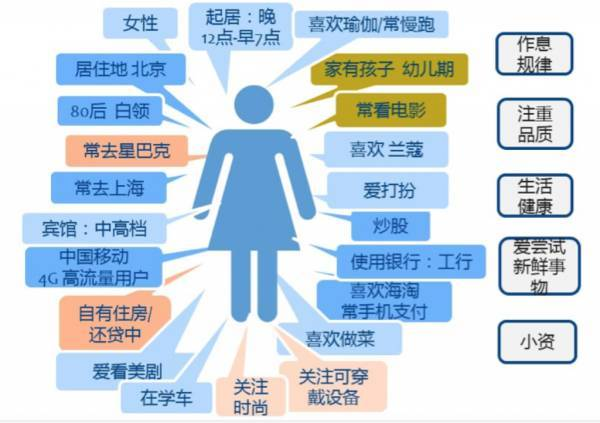

# 用户画像
叫做Profile，是和数据挖掘、大数据息息相关的应用。通过数据建立描绘用户的标签。

## 什么是用户画像
简而言之，用户画像是根据用户社会属性、生活习惯和消费行为等信息而抽象出的一个标签化用户模型。构建用户画像的核心工作即是给用户贴“标签”，而标签是通过对用户信息分析而来的高度精炼的特征标识。

> 举例来说，如果你经常购买一些玩偶玩具，那么电商网站即可根据玩具购买的情况替你打上标签“有孩子”，甚至还可以判断出你孩子大概的年龄，贴上“有5-10岁的孩子”这样更为具体的标签，而这些所有给你贴的标签统在一次，就成了你的用户画像，因此，也可以说用户画像就是判断一个人是什么样的人。

除去“标签化”，用户画像还具有的特点是“低交叉率”，当两组画像除了权重较小的标签外其余标签几乎一致，那就可以将二者合并，弱化低权重标签的差异。

## 新用户冷启动推荐
### 1. 一无所知
当系统对用户没有任何认识时，我们通常采用的策略为“保底内容池+兴趣试探”方法为用户进行内容推荐。由于对用户的认知为0，我们在构建保底内容池时通常要考虑内容的普适性和优质性，即：推荐能够满足各类用户需求的优质内容，而这一工作的策略指标就是迅速满足用户消费内容的需求。因此，常见的内容类型就包括时下最新的热点以及一些泛娱乐休闲类的内容，而内容的优质性不言而喻。

内容优质的标准通常为运营加精、基于后验数据（如：点赞、转发等）等。而在兴趣试探方面，更多的是采取“随机试探”的方式给用户推荐内容，这里的随机也可以结合平台老用户的兴趣倾向来做个偏置，比如说老用户更多的使用产品看娱乐类、热点类内容，那就可以尝试对这类内容做优先的召回用于试探。

不过，在兴趣试探之前构建“高度垂直”领域的内容池也是十分的关键，毕竟用户消费内容的垂直度在某种意义上决定了用户画像的清晰度。例如，如果给一个爱好时尚的用户推荐一篇有点时尚，又有点娱乐领域的内容（系统的标签是娱乐），而用户产生消费行为后，系统会认为该用户的兴趣偏娱乐类。

### 2. 粗粒度认识

当系统获取了用户安装的App List、进入App后选择的兴趣领域、位置、机型信息等(选择自己感兴趣的标签)，我们通常采用“保底内容池+粗个性化分发+兴趣试探”的策略。此时，通过获取用户安装的App信息，我们可以对用户有一个粗粒度理解，而这些理解也可以直接写入用户画像。例如，手机端安装了“汽车之家”App，那其实对应该用户的人群属性是一个“有车人”，且通常为男性。那么，我们就可以构建一个区分有车的人和无车的人之间内容消费差异化的试探内容池，从而对该类用户做粗粒度的个性化分发。

不过，这里有个难点在于如何区分无车和有车人之间的消费内容差异性呢？通常，我们可以对有车人的消费内容（根据点击、阅读等后验数据）进行打分，根据得分可以该类内容的Top N，同样也可以获得无车人的消费内容Top N。

同样，在进行兴趣试探时，由于判定该用户是一个有车的人，系统也可以推荐这类用户可能感兴趣的其他内容，比如，这类人群往往也对科技感兴趣，就可以推荐科技领域的相关内容试探。除了安装的App信息之外，还有开屏兴趣选择，可以直接用来完善用户画像，根据所选择的兴趣进行内容分发；位置信息，可以用来推送本地相关的内容；机型信息可以映射出价格和消费水平用来推送相应的机型及其他内容

### 3. 产生用户行为

当用户产生内容消费行为后，比如：点击、订阅、搜索。此时就可以根据这些反馈行为进行内容更细粒度的分发，我们通常采用“保底内容池+细粒度分发+反馈+兴趣试探”，这里的细粒度分发会与系统反馈相结合，相比此前的粗粒度分发会更具有针对性和“大胆”。

例如，当用户点击“王源”相关内容，而在下几刷就会推荐如“王俊凯”相关内容；用户搜索了“都挺好”，系统将会直接推荐电视剧《都挺好》相关的内容；用户订阅了诗词栏目、就会给用户推荐诗词领域的内容等。同样，针对更加清晰的用户画像，兴趣试探内容池也会加入更多基于兴趣、人群属性以及后验数据的内容。

### 什么是兴趣试探

考虑到每个场景下，对新用户的推荐都会涉及到兴趣试探，有必要拎出来着重讲一下兴趣试探做了什么东西。兴趣试探之前，构建优质、高垂直的兴趣试探内容池是第一步，而我们通常会结合兴趣、人群、后验指标这3个维度构建。得到了内容池之后，就要设计相应的试探的逻辑。

在此之前，我们首先需要建立用户与内容池之间的试探状态，而每个用户与每个内容池之间的状态有四种：light（点亮）、awake（唤醒）、stable（稳定）、dead（死亡）。不过，由于用户与池子之间的状态会进行转换，因此，不同状态下的内容池试探优先级也会有所不同。

首先，简单介绍一下用户与内容池之间的四种试探状态：

- 点亮：用户与内容池的初始状态均为点亮状态；

- 唤醒：当试探捕捉到多次正向反馈，用户与该内容池的状态转为唤醒状态；

- 稳定：进入唤醒状态之后，继续试探依旧有正向点击行为则进入稳定状态；

- 死亡：继续试探，没有点击会进入点亮状态，直至死亡状态；

然后，内容试探的优先级：

- 对唤醒状态的用户与内容池做优先分发试探；

- 对死亡和稳定状态的用户与内容池，不进行试探；

- 对点亮状态的用户与内容池做正常试探；

最后，为了提升兴趣试探的效率，我们通常需要将不同调性的内容池进行组合，通过对比实验的方式得到试探效率最高的内容池，例如，系统针对新用户做电视剧、汽车、搞笑兴趣点的试探

