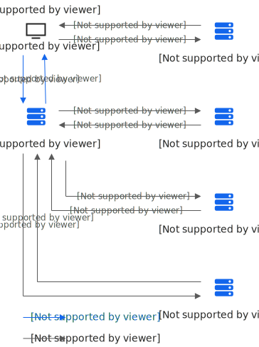
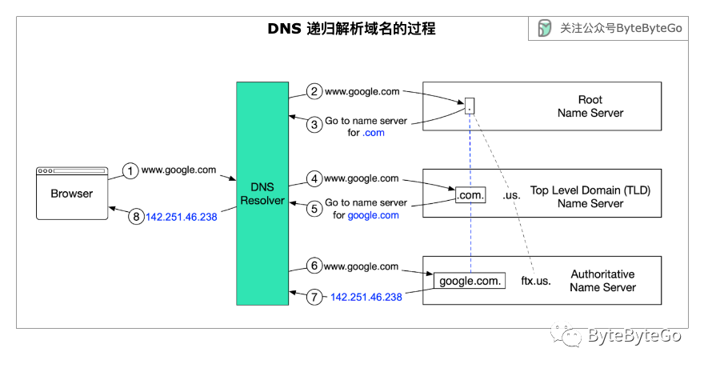
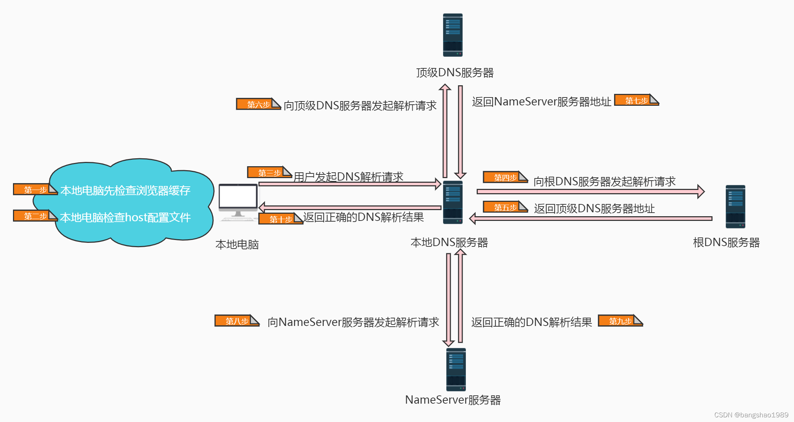

[TOC]

## 简介

[DNS解析详解](./DNS解析详解.md)

### 基本概念
域名由标号（label）序列组成，各标号之间用点（小数点）隔开


`.com`是顶级域名；
`aliyun.com`是主域名，也叫二级域名；
`example.aliyun.com`、`www.aliyun.com`是子域名，也叫三级域名；
`test.example.aliyun.com`是子域名的子域，也叫四级域名。

#### DNS服务器层级

服务器类型 | 作用 
---|---
根域名服务器| 英文全称：Root Name Server，简称Root Server。本地域名服务器在本地查询不到解析结果时，则第一步会向它进行查询，并获取顶级域名服务器的IP地址。
顶级域名服务器| 英文全称：Top-Level Domain Name Server，简称：TLD Server。负责管理在该顶级域名服务器下注册的主域名，例如“example.com”，.com则是顶级域名服务器，在向它查询时，可以返回主域名“example.com”所在的权威域名服务器地址。
权威域名服务器|英文全称：Authoritative Name Server，简称NS。在特定区域内具有唯一性，负责维护该区域内的域名与IP地址之间的对应关系。例如云解析DNS的公网权威解析，您可在此添加解析记录，最终它会将配置的ip记录返回给用户。
本地域名服务器|英文全称：Local DNS Server，简称Local DNS。本地域名服务器是响应来自客户端的递归请求，并最终跟踪直到获取到解析结果的DNS服务器。例如用户本机自动分配的DNS、运营商ISP分配的DNS、谷歌/223.5.5.5公共DNS等。

> 每个层级的域名都有其专属的域名服务器，最顶层是根域名服务器。每一层的域名服务器都存储着下级域名服务器的IP地址，从而能够逐级进行查询。

#### DNS解析过程
通过域名example.com访问网站的域名解析过程如下。

1. 用户在Web浏览器中输入example.com， 向本地域名服务器发起查询请求。若本地域名服务器存在缓存的解析数据，则直接将域名example.com对应的IP地址返回给Web浏览器，跳至步骤9。若本地域名服务器没有查到缓存的解析数据，则继续步骤2。

2. 本地域名服务器向根域名服务器进行查询。

3. 根域名服务器将.com顶级域名服务器的地址，返回给本地域名服务器。

4. 本地域名服务器向.com顶级域名服务器发起example.com的查询请求。

5. `.com`顶级域名服务器将为example.com提供权威解析的权威域名服务器地址，返回给本地域名服务器。

6. 本地域名服务器向权威域名服务器发起查询请求。

7. 权威域名服务器将域名example.com对应的IP地址，返回给本地域名服务器。

8. 本地域名服务器最后把查询的IP地址响应给Web浏览器。

9. Web浏览器通过IP地址访问网站服务器。

10. 网站服务器返回网页信息。



#### 递归解析（Recursive Query）
DNS服务器帮你把整个查询流程走到底，中间任何一步都由这台服务器去处理，最后直接把最终结果返回给你。如：

- 客户端将“请帮我查出www.example.com的IP”递交给本地DNS（递归服务器）。

- 递归服务器自己如果不知道答案，会去根DNS、TLD、权威DNS不断发问，并跟进每一步；直到获得最终答案。

- 用户只需要等递归服务器给出最后的解析结果即可。

特点

- 用户只需问一次、等一次。

- 递归服务器压力较大，需要走完整查询流程。

- 这是客户端和本地DNS之间最常见的方式。

常见应用

- 普通用户/PC/浏览器 ：只有递归查询，不处理迭代查询。

- 本地DNS服务器（如你的宽带运营商、公网8.8.8.8、公司内网DNS）：通常承担递归解析的角色，对外（向根、TLD、权威DNS）发起迭代查询。

- 公共DNS服务器：对用户递归，对更上级DNS迭代。

#### 迭代解析（Iterative Query）
DNS服务器只帮你查“它知道的下一步线索”，如果自己没有答案就告诉你下一步去哪问，用户必须自己去完成整个查询流程。如：

- 客户端问本地DNS：“www.example.com的IP是多少？”

- 本地DNS不知道，查问根DNS。根DNS不直接回答IP，而是答：“你去问TLD服务器”，这里的根DNS则在进行迭代解析。

- 本地DNS问TLD服务器，TLD告诉你“去找这个权威DNS”，这里的TLD服务器则在做迭代解析。

- 直到找到权威服务器，获取最终结果。

特点

- 每一步都需要客户端自己去问。

- 服务器压力较小，但客户端负担大（通常不这样用）。

常见应用

- 根DNS服务器、TLD服务器、权威DNS服务器。

- 企业、学校等自建的DNS服务器。

- 公共DNS服务器：对用户递归，对更上级DNS迭代。

#### TTL
英文全称Time To Live ，这个值是告诉本地域名服务器，域名解析结果可缓存的最长时间，缓存时间到期后本地域名服务器则会删除该解析记录的数据，删除之后，如有用户请求域名，则会重新进行递归查询/迭代查询的过程。

#### IPV4、IPV6双栈技术
双栈英文Dual IP Stack，就是在一个系统中可同时使用IPv6/ IPv4这两个可以并行工作的协议栈。

#### DNS Query Flood Attack
指域名查询攻击，攻击方法是通过操纵大量傀儡机器，发送海量的域名查询请求，当每秒域名查询请求次数超过DNS服务器可承载的能力时，则会造成解析域名超时从而直接影响业务的可用性。

#### URL转发
英文 Url Forwarding，也可称地址转向，它是通过服务器的特殊设置，将一个域名指向到另外一个已存在的站点。

#### edns-client-subnet
google提交了一份DNS扩展协议，允许DNS resolver传递用户的IP地址给authoritative DNS server。

#### DNSSEC
域名系统安全扩展（DNS Security Extensions），简称DNSSEC。它是通过数字签名来保证DNS应答报文的真实性和完整性，可有效防止DNS欺骗和缓存污染等攻击，能够保护用户不被重定向到非预期地址，从而提高用户对互联网的信任。

#### 移动解析HTTPDNS相关概念
##### 应用终端
指专门用于网络接入的终端设备和应用服务，包括并不限于移动终端、物联网终端、APP应用等。

##### DoH（DNS-over-Https）
用来加密的DNS请求流量，阿里云公共DNS通过RFC 8484指定的经过TLS加密的HTTP连接提供DNS解析。

##### DoT（DNS-over-TLS）
用来加密的DNS请求流量，阿里云公共DNS通过RFC 7858指定的经过TLS加密的TCP连接提供DNS解析。


### Linux 的nameserver-域名服务器
DNS（Domain Name System）是域名解析服务器的意思，它在互联网的作用是把域名转换成为网络可以识别的IP地址。当用户在浏览器中输入网址域名时，首先就会访问系统设置的DNS域名解析服务器（通常由ISP运营商如电信、网通提供）。如果该服务器内保存着该域名对应的IP信息，则直接返回该信息供用户访问网站。否则，就会向上级DNS逐层查找该域名的对应数据。

目前国内上网用户普遍使用的是默认DNS服务器，即电信运营商的DNS服务，这带来一个巨大的风险，就是DNS劫持。目前国内电信运营商普遍采用DNS劫持的方法，干扰用户正常上网，例如，当用户访问一个不存在（或者被封）的网站，电信运营商就会把用户劫持到一个满屏都是广告的页面：电信114网站，这个114网站不仅搜索质量低劣，而且广告众多，极大的影响了用户上网的安全性和浏览体验。后来，电信运营商的胆子越来越大，甚至连Google的网站电信都敢劫持，这进一步证明了电信运营商的DNS服务可靠性是多么糟糕。

普通用户要使用Google DNS非常简单，因为Google为他们的DNS服务器选择了两个非常简单易记的IP地址：“8.8.8.8”和“8.8.4.4”。用户只要在系统的网络设置中选择这两个地址为DNS服务器即可。
Google提供的公共DNS服务与电信网通的不同，当用户输入一个错误的或者不存在的网址的时候，不会像中国电信一般直接弹出一个满屏都是广告的页面，Google公司承诺绝不会重定向或者过滤用户所访问的地址，而且绝无广告。

Linux下设置：
```
echo nameserver 8.8.8.8 > /etc/resolv.conf
echo nameserver 8.8.4.4 > /etc/resolv.conf
```
这两行命令直接将8.8.8.8与8.8.4.4写入 Linux 的DNS客户端解析文件resolv.conf里。

阿里云:223.5.5.5
114DNS(南京信风): 114.114.114.114

> 114DNS在其官网上标榜纯净无劫持，背后却向广告主提供了多达几十项的劫持插入广告服务。https://www.114dns.com/
> 信风精确广告营销系统

### DNS 递归查找的流程
DNS 服务器有 3 个基本层次：

1. 根域名服务器（Root Name Server）
它存储顶级域（TLD）名称服务器的 IP 地址。全球有 13 个逻辑根名称服务器。

2. TLD 名称服务器（Top Level Domain Name Server）
它存储权威名称服务器的 IP 地址。顶级域名有几种类型。例如，通用 TLD（.com、.org）、国家代码 TLD（.us）、测试 TLD（.test）。

3. 权威域名服务器（Authoritative Name Server）
它为 DNS 查询提供最终答案。我们可以在 GoDaddy、Namecheap 等域名注册商处注册购买权威域名服务器。


DNS 递归查询的工作原理：




1. 在浏览器中输入 google.com，浏览器会将域名发送到 DNS 解析器（DNS Resolver）。
2. 解析器查询 DNS 根域名服务器。
3. 根服务器向解析器回复一个顶级域名 DNS 服务器的地址。本例中为 .com。
4. 然后，解析器向 .com TLD 发出请求。
5. TLD 服务器返回 google.com 域名服务器的 IP 地址。这个一般是由各个公司自己维护的权威域名服务器。
6. DNS 解析器向 google.com 域名服务器发送查询。
7. 域名服务器会向解析器返回 google.com 的 IP 地址。
8. DNS 解析器返回最初请求的域名的 IP 地址 (142.251.46.238)。

> 根据 YSlow 数据，DNS 查询平均需要 20-120 毫秒才能完成。超过几十毫秒的时延就会影响到用户体验，所以这个映射关系会保存在多级的缓存中，比如浏览器缓存、操作系统缓存、本地缓存和 ISP 缓存。

### 生效时间相关
解析记录变更后，将实时同步至 DNS 服务器，但可能不会立即生效。
因为各地网络运营商存在缓存，需要等待运营商刷新本地缓存之后，解析才会实际生效。这个过程不会太长，最快在 30 分钟内生效，一般需要 24~48 小时

[生效时间相关](https://docs.dnspod.cn/dns/faq-effective-time/?source=DNSPod&page=console&from=toast)

域名解析生效时间取决于什么因素？
DNSpod 域名的解析生效，首先DNSPod DNS 必须生效，然后等待世界各地 Local DNS 生效（可以通俗的理解为各大电信运营管理的 DNS 需要及时同步DNSpod DNS 解析记录），才能最终生效。 网站能否访问直接相关的是 Local DNS，DNSPod 的解析都是实时生效的，一般只需几秒即可同步到各地 Local DNS 上，但各地 Local DNS 均有缓存机制，解析的最终生效取决于各运营商刷新时间。

新增解析记录生效需要多长时间？
使用 DNSpod DNS 解析新增解析记录，在 DNSPod 服务器上实时生效。若在您本地的计算机上不存在的该记录的 localDNS 可以实时查询生效结果，若有该记录需 localDNS 缓存更新才可成功查询生效结果。localDNS 缓存更新时间理论上是您域名记录之前设置的 TTL 时间。

修改解析记录生效需要多长时间？
修改域名记录，各地生效时间理论上是您域名记录之前设置的 TTL 时间，不过也存在地方运营商有强制延长域名记录的情况，导致未按照 TTL 时间生效。

修改域名 DNS 生效需要多长时间？
修改域名 DNS 指向 DNSPod 的域名，虽然 DNSPod 服务器的生效时间是实时的，但因各地 ISP 服务商刷新域名 DNS 的时间不一致，所以导致解析在全球生效一般需要0 - 72小时，请您耐心等待。

> 缓存可能在 Windows（只要是 Windows 都会缓存, ipconfig /flushdns清空缓存）、路由器（通过路由上网）、当地 ISP 的 DNS 服务器（DNS 服务器采用递归方式）。
 Linux、Unix 系统不会缓存 DNS 记录，Mac OS X 系统可以通过执行 killall lookupd 命令来清空 DNS 缓存。

### 其它DNS
BIND，Knot，PowerDNS 和 Unbound


### 中文域名/国际化域名
国际化域名（英语：Internationalized Domain Name，缩写：IDN）又称特殊字符域名
应用程序中的国际化域名IDNA(英语：Internationalized Domain Name in Applications)
在IDNA中，“国际化域名”特指可以成功将IDNA转化为 ASCII 编码的域名。

国际化域名编码（英语：Punycode）是一种表示Unicode码和ASCII码的有限的字符集。
Punycode是一个根据[RFC 3492](https://datatracker.ietf.org/doc/html/rfc3492)标准而制定的编码系统，主要用于把域名从地方语言所采用的Unicode编码转换成为可用于DNS系统的编码。

IETF RFC 1034 域名的概念与应用
IETF RFC 1035 域名的实现与规范
IETF RFC 1122 互联网主机传输层要求
IETF RFC 1123 互联网主机的应用与支持要求
IETF RFC 3454 国际化字符串预处理
IETF RFC 3490 国际化域名与应用
IETF RFC 3491 国际化域名预处理
IETF RFC 3492 一种适用于国际化域名应用的对统一码的编码方法：Punycode

RFC 3492 — 编码方案 (Punycode)
RFC 5890 – IDNA 框架
RFC 5891 – IDNA 协议
RFC 5892 – IDNA Unicode
RFC 5893 – IDNA 脚本（从右至左）
RFC 5894 – IDNA 基本原理

CDL ：中文域名字段(Chinese Domain Label)
CDN：中文域名 (Chinese Domain Name)
CDNA：中文域名与应用 (Chinese Domain Names in Applications)
DNS：域名系统 (Domain Name System)
LDH ：字母、数字、连接符(Letters Digits Hyphen )

> golang.org/x/net/idna
idna提供了“对 [RFC 5891](https://datatracker.ietf.org/doc/html/rfc5891) 中指定的应用程序中国际化域名（IDNA）协议的支持。”
```go
func main() {

	if len(os.Args) != 2 {
		fmt.Println(usage)
		os.Exit(1)
	}

	domain := os.Args[1]
	var re = regexp.MustCompile(`^xn--`)

	switch {
	case domain == "-h", domain == "--help":
		fmt.Println(usage)
	case re.Match([]byte(domain)):
		//punycode was provided, convert to Unicode
		unidomain, _ := idna.ToUnicode(domain)
		fmt.Printf("%s\n", unidomain)
	default:
		//convert to ASCII punycode
		asciidomain, _ := idna.ToASCII(domain)
		fmt.Printf("%s\n", asciidomain)
	}

}
```


## CoreDNS
使用CoreDNS作为内网DNS服务器
CoreDNS是Golang编写的一个插件式DNS服务器，是Kubernetes 1.13 后所内置的默认DNS服务器
采用的开源协议为Apache License Version 2
CoreDNS也是CNCF孵化项目，目前已经从CNCF毕业。
CoreDNS 的目标是成为 Cloud Native（云原生）环境下的 DNS 服务器和服务发现解决方案。

CoreDNS 插件编写目前有两种方式：
1. 深度耦合 CoreDNS，使用 Go 编写插件，直接编译进 CoreDNS 二进制文件
2. 通过 GRPC 解耦(实际上grpc就是一个插件)，任意语言编写 GRPC 接口实现，CoreDNS 通过 GRPC 与插件交互


> 由于 GRPC 链接实际上借助于 CoreDNS 的 GRPC 插件，同时 GRPC 会有网络开销，TCP 链接不稳定可能造成 DNS 响应过慢等问题。


[基于etcd插件(自带的)的CoreDNS动态域名添加](https://www.cnblogs.com/boshen-hzb/p/7541901.html)
https://coredns.io/plugins/etcd/

### 本地编译
```
git clone https://github.com/coredns/coredns
cd coredns/
make


$ file coredns
coredns: PE32+ executable (console) x86-64 (stripped to external PDB), for MS Windows, 6 sections

$ ./coredns -version
CoreDNS-1.10.1
windows/amd64, go1.20.5, 5b5a6ac6-dirty

```
> windows编译出来的也是不带exe后缀的可执行文件

#### 插件
coredns官方对于插件的分类基本可以分为三种：[Plugins](https://coredns.io/plugins/)、[External Plugins](https://coredns.io/explugins/)和其他。
其中Plugins一般都会被默认编译到coredns的预编译版本中，而External Plugins则不会。
[Corefile](https://coredns.io/2017/07/23/corefile-explained/)

查看编译的插件` ./coredns -plugins`

编译插件基本可以分为:修改源码和修改编译的配置文件这两种方式
源码根目录下有个文件: `plugin.cfg`
> 编译后会自动在`core/plugin/zplugin.go`文件中引用该插件, 从而调用init函数
> 以及把名字添加到`core/dnsserver/zdirectives.go` 
> directives 里插件的顺序非常的重要，这个顺序，决定了CoreDNS处理DNS请求时所执行的插件顺序(实际上是`plugin.cfg`的顺序编译出来的)
> 所以Corefile中定义顺序是没有关系的

> 执行 `go generate coredns.go` 即可自动生成上面说的文件。然后执行`go build -o coredns coredns.go`构建即可。
> 当然也可以直接执行`make`

部分内容如下
```
...
forward:forward
grpc:grpc
erratic:erratic
whoami:whoami
on:github.com/coredns/caddy/onevent
...
```

例如这里我们需要额外多添加一个dump插件到coredns中，只需要在plugin.cfg中加入插件的名称和地址

```
dump:github.com/miekg/dump
```
对于在plugin目录下已经存在的插件，则可以直接写成plugin中的目录名：
```
forward:forward
```

**开始编译**
```
go get github.com/miekg/dump
go generate
go build
make
```

**代码测试**
```go
// go get github.com/miekg/dns
func main() {
	c := dns.Client{
		Timeout: 5 * time.Second,
	}

	m := dns.Msg{}
	m.SetQuestion("www.baidu.com.", dns.TypeA)
	r, _, err := c.Exchange(&m, "127.0.0.1:53") // 192.168.220.2:53
	if err != nil {
		fmt.Println("dns error", err)
		return
	}

	var dst []string
	for _, ans := range r.Answer {
		record, isType := ans.(*dns.A)
		if isType {
			fmt.Println("type A:", record.A)
			dst = append(dst, record.A.String())
		}

		record1, isType := ans.(*dns.CNAME)
		if isType {
			fmt.Println("type cname:", record1.Target)
		}
	}

	for _, v := range dst {
		fmt.Println("ok:", v)
	}
}
```

**命令行**

```
doggo www.baidu.com @127.0.0.1

dig www.baidu.com @192.168.1.5
```

##### hosts插件

```
.{
	hosts {
		49.16.5.28     host.wcoder.com
		fallthrough
	}
}

```

https://coredns.io/plugins/hosts/

此处配置不能遗漏fallthrough字段，fallthrough表示当在hosts找不到要解析的域名时，会将解析任务传递给CoreDNS的下一个插件。如果不写fallthrough的话，任务就此结束，不会继续解析，会导致集群内部域名解析失败的情况。

#### 获取配置的Tracer(调用链)

```
func setup(c *caddy.Controller) error {
	c.OnStartup(func() error {
		conf := dnsserver.GetConfig(c)
		for _, h := range conf.Handlers() {
			if h.Name() == "trace" {
				// we have to stash away the plugin, not the
				// Tracer object, because the Tracer won't be initialized yet
				if t, ok := h.(trace.Trace); ok {
					print(t) // t就是当前server的Tracer
				}
			}
		}
		return nil
	})
	dnsserver.GetConfig(c).AddPlugin(func(next plugin.Handler) plugin.Handler {
		r.Next = next
		return r
	})

	return nil
}
```

> sql driver wrapper(OpenTelemetry):  https://github.com/nhatthm/otelsql
> sql driver wrapper: https://github.com/inkbe/opentracing-sql
> sql driver wrapper: https://kgithub.com/luna-duclos/instrumentedsql/


```
import (
	"context"
	"go.opentelemetry.io/contrib/instrumentation/net/http/httptrace/otelhttptrace"
	"go.opentelemetry.io/contrib/instrumentation/net/http/otelhttp"
	"net/http"
	"net/http/httptrace"
)

var DefaultClient = &http.Client{
	Transport: otelhttp.NewTransport(
		http.DefaultTransport,
		otelhttp.WithClientTrace(func(ctx context.Context) *httptrace.ClientTrace {
			return otelhttptrace.NewClientTrace(ctx)
		}),
	),
}

func DoRequest(ctx context.Context, req *http.Request) (*http.Response, error) {
	req = req.WithContext(ctx)
	return DefaultClient.Do(req)
}
```


##### gorm mysql 报错 driver skip fast-path; continue as if unimplemented

自己实现OpenTelemetry标准: https://github.com/nhatthm/otelsql

目前我们使用v1.9.16的gorm（github.com/jinzhu/gorm v1.9.16），不支持在初始化配置中设置开启[prepared statement](https://gorm.io/docs/performance.html#Caches-Prepared-Statement)。

这样在我们使用sql hook替换默认mysql driver的时候，经常会有报错driver skip fast-path; continue as if unimplemented。

解决方案
可以查看[interpolateparams的官方文档](https://github.com/go-sql-driver/mysql#interpolateparams)，只需要在创建数据库连接时，连接dsn中添加`interpolateParams=true`作为参数。

> 注意interpolateParams, Params的P是大写的

参考: [Go: go-sql-driver interpolateparams参数优化](https://wklken.me/posts/2021/01/22/golang-sql-driver-interpolateparams.html)


> 也可以使用otelsql.DisableErrSkip(),忽略错误

### 在docker环境中安装coredns
`docker pull coredns/coredns:1.10.1`
创建配置文件
```
mkdir -p /etc/coredns

vi /etc/coredns/Corefile

.:53 {
    hosts {
        10.0.0.1 my.host.com // 你域名和ip
        fallthrough
    }
    forward . 114.114.114.114:53 //你的备用 dns 
    log
}

也可以将 hosts 放在单独一个文件中

.:53 {
    hosts /etc/coredns/hostsfile {
        fallthrough
    }
    forward . 8.8.8.8:53
    log
}

# cat hostsfile
10.0.0.1 example1.org
```
启动服务
`docker run -it -d --name coredns --net=host -v /e/dockerv/coredns/:/etc/coredns/ coredns/coredns:1.10.1 -conf /etc/coredns/Corefile`


```
mkdir -p /etc/coredns

cat >/etc/coredns/Corefile<<EOF
.:53 {
    forward . 8.8.8.8:53
    log
}
EOF

docker run -d --name coredns \
  --restart=always \
  -v /e/dockerv/coredns/:/etc/coredns/ \
  -p 53:53/udp \
  coredns/coredns:1.10.1 -conf /etc/coredns/Corefile
```

测试
`dig @127.0.0.1 -p 53 my.host.com`


全部一起执行的命令
```
rm -rf /etc/coredns && mkdir -p /etc/coredns && echo "
.:53 {
    hosts {
        # ip host
        127.0.0.1 host.com 
        fallthrough
    }
    # forward . dns-1 dns-2
    forward . 114.114.114.114
    log
}
">> /etc/coredns/corefile && docker run -it -d --name dns --net=host -v /etc/coredns:/etc/coredns/ coredns/coredns:latest -conf /etc/coredns/corefile
```

### server

server 以什么协议监听在哪个端口（可以同时定义多个 server 监听不同端口）
也就是说有多少个端口就有多少个server

如Corefile:
```
coredns.io:5300 {
    file db.coredns.io
}

example.io:53 {
    log
    errors
    file db.example.io
}

example.net:53 {
    file db.example.net
}

.:53 {
    kubernetes
    proxy . 8.8.8.8
    log
    health
    errors
    cache
}
```
从配置文件来看，我们定义了两个 server（尽管有 4 个区块），分别监听在 5300 和 53 端口。其逻辑图可如下所示：


### zone
如： `www.allen.ayunw.cn.` (而通常最后的点可以不写)，其中最后的点被称为 根域(TLD)，cn被称为顶级域(一级域名)，ayunw被称为二级域名，allen被称为三级域名，www被称为主机名。

所以配置文件Corefile中的zone, `.`表示根域, 也可以`wcoder.com` 或者`com` 来定义这个zone的解析

### Reverse Zone
Reverse Zone（反向解析 IP 地址对应的域名）
```
10.0.0.0/24 {
    whoami
}

0.0.10.in-addr.arpa {
    whoami
}
```
可以通过 dig 进行反向查询：`dig -x 10.0.0.1`


### 协议支持
CoreDNS 除了支持 DNS 协议，也支持 TLS 和 gRPC，即 DNS-over-TLS 和 DNS-over-gRPC 模式：
```
tls://example.org:1443 {
...
}
```

### 参考

[别看 DNS 污染闹得欢，现在我用 CoreDNS 将它拉清单](https://cloud.tencent.com/developer/article/1766299)


- dnsmasq反DNS劫持、DNS污染、去广告
DNS反劫持：
bogus-nxdomain=x.x.x.x
x.x.x.x是劫持域名的服务器地址，可以通过ping一个不存在的域名得到。如ping fanjiechixxxxxx.com。
DNS反污染：
将会被污染的域名发送到不会污染的域名服务器
server=/talk.google.com/8.8.4.4
番羽蔷：
将被蔷的域名本地解析
address=/google.cn/103.1.139.227
如果蔷的是ip就没办法了
去广告：
把广告域名解析为空：
address=/yx.guanggao.com/0.0.0.0

> 改善DNS解析速度: https://github.com/felixonmars/dnsmasq-china-list
> https://gitee.com/felixonmars/dnsmasq-china-list
> google.china.conf

## tool

### DNS client

更多可以在这里找到: https://www.isc.org/dns-tools/

#### nslookup
安装`yum install -y bind-utils`

`nslookup www.baidu.com`

> windows下, 直接nslookup可以查看默认dns解析


#### host
`host www.baidu.com`
> host,nslookup,dig,named 作为 bind 的一部分,windows 下载: https://www.isc.org/bind/

#### dig
Dig 工具全称为域名信息搜索器（Domain Information Groper）
> dig 作为 bind 的一部分
> win版本下载: https://www.isc.org/bind/
> win版本下载2：ttp://www.bind9.net/download
> ftp地址: ftp://ftp.nominum.com/pub/isc/bind9/
> ftp地址: ftp://ftp.isc.org/isc/
> https://downloads.isc.org/isc/bind9/9.16.42/BIND9.16.42.x64.zip

安装`yum install -y bind-utils`
`dig www.wcoder.com`

我们可以使用 dig 命令追踪 www.wcoder.com 域名对应 IP 地址是如何被解析出来的，首先会向预置的 13 组根域名服务器发出请求获取顶级域名的地址：
`dig -t A www.wcoder.com +trace`

一般格式：
`dig [@global-server] [domain] [q-type] [q-class] {q-opt} {d-opt}`
参数说明：
@global-server：默认是以/etc/resolv.conf作为DNS查询的主机，这里可以填入其它DNS主机IP。
domain：要查询的域名。
q-type：查询记录的类型，例如a、any、mx、ns、soa、hinfo、axfr、txt等，默认查询a。
q-class：查询的类别，相当于nslookup中的set class。默认值为in（Internet）。
q-opt：查询选项，可以有好几种方式，比如：-f file为通过批处理文件解析多个地址；-p port指定另一个端口（缺省的DNS端口为53），等等。
d-opt：dig特有的选项。使用时要在参数前加上一个“+”号。

d-opt常用选项：
+vc：使用TCP协议查询。
+time=###：设置超时时间。
+trace：从根域开始跟踪查询结果。

> [详解 DNS 与 CoreDNS 的实现原理](https://juejin.cn/post/6844903709512564750)

#### dog 
https://kgithub.com/ogham/dog/
#### doggo
https://github.com/mr-karan/doggo


```sh
$ cd "$(mktemp -d)"
$ curl -sL "https://github.com/mr-karan/doggo/releases/download/v0.5.5/doggo_0.5.5_linux_amd64.tar.gz" | tar xz
$ mv doggo /usr/local/bin
```

`doggo www.wcoder.com`

#### tcpdump
`tcpdump` 是一个网络协议分析工具，可以用于捕获和分析网络数据包。它可以用于检查 DNS 查询和响应数据包，以及其他网络流量。
抓包命令: `tcpdump -i any -vvvvnnA dst port 8899`
可以`tcpdump -i any -vvvvnnA dst port 8899 -w file.cap` 保存文件中, 然后使用wireshark来查看数据包

`tcpdump -i eth0 udp port 53` 命令来捕获通过 eth0 网卡发送到 UDP 端口 53 的 DNS 数据包。

#### kyanos
Kyanos 是一个网络流量采集和分析工具
https://github.com/hengyoush/kyanos

#### wireshark
`wireshark` 是一个网络协议分析器，可以用于分析网络数据包的详细信息。它可以用于检查 DNS 查询和响应数据包，以及其他网络流量。例如，使用 `wireshark` 命令来打开捕获的 DNS 数据包文件并进行分析。

Sniffer(嗅探器)就是利用计算机的网络接口截获目的地为其他计算机的数据报文的一种技术。
> sniffnet

#### NetLimiter
NetLimiter是专为Windows设计的终极Internet 流量控制和监视工具。您可以使用NetLimiter设置应用程序甚至单个连接的下载/上传传输速率限制，并监视其Internet流量。除了此独特功能外，Netlimiter还提供了全面的Internet统计工具集。它包括实时流量测量和按应用程序的长期互联网流量统计。为任何应用程序设置确切的下载/上传速度限制，或为它们指定更高的优先级，以确保它们始终获得所需的足够带宽。您将不会错过任何一个连接到互联网的应用程序。
您还将监视其从Internet传输或向Internet传输的数据量。所有这些都还显示在可自定义的图表中。使用这个简单且互动的规则系统，您将可以指定哪些应用程序可以连接到互联网以及在哪些条件下连接。使您可以设置所选应用程序/过滤器的数据传输配额。如果达到配额-限制，则可以启用阻止程序规则或其他规则。

也可以禁止一个dns的解析

#### 网络监控工具/网络工具
- GlassWire
- Nutty
- Portmaster
- sniffnet
https://github.com/GyulyVGC/sniffnet

- iperf3 网络性能测试工具
https://github.com/esnet/iperf

#### 路由跟踪工具
https://github.com/nxtrace/NTrace-core

```
go install github.com/nxtrace/NTrace-core@latest
```


#### named
named（也称为BIND）： 
named是一个功能强大的、广泛使用的DNS服务器软件。它是Internet上最常用的DNS软件之一，被用于管理大型网络和互联网域名解析。 
named支持完整的DNS功能，包括支持区域传输、反向解析、安全扩展（如DNSSEC）等。 
named可以作为一个权威DNS服务器，用于管理和提供域名解析服务，也可以作为一个递归DNS服务器，用于向客户端提供域名解析查询。

> yum -y install bind

#### dnsmasq
dnsmasq是一个轻量级的DNS服务器和DHCP服务器软件，它主要用于小型网络和家庭网络环境中。 
dnsmasq具有简单易用的特点，配置简单且占用资源较少。 
dnsmasq不支持权威DNS功能，主要用于提供本地区域网络（LAN）内的域名解析服务，为局域网上的设备提供DNS解析和DHCP服务。

> sudo yum install dnsmasq
> sudo systemctl status dnsmasq
> systemctl restart dnsmasq -- 缓存存储在内存中，所有现有的 DNS 条目将从缓存中删除。

- chrome dns缓存
您经常使用的 Web 浏览器也会缓存 DNS 记录。输入 URL 时，系统会在本地浏览器缓存中搜索缓存条目。如果未找到，它将检查本地系统缓存中的记录。清除 Web 浏览器的 DNS 缓存至关重要，因为它的优先级高于系统范围的缓存。
> chrome://net-internals/#dns

#### systemd-resolve

`systemd-resolve` 是一个 systemd 系统服务,是 Ubuntu下 DNS 解析相关的命令，可用于解析 DNS 名称。它可以用于查询本地 DNS 缓存和配置文件中指定的 DNS 服务器。例如，使用 `systemd-resolve www.baidu.com` 命令来查询 www.baidu.com 的 DNS 记录。帮助`systemd-resolve --help`

systemd-resolve 命令可以用来设置指定网卡的 DNS Server，如下
```
sudo systemd-resolve --set-dns '8.8.8.8' --interface ens3

# 查看
systemd-resolve --status | grep 'DNS Servers'
         DNS Servers: 8.8.8.8

# 重置网卡的 DNS 设置
systemd-resolve --revert --interface {ITERFACE_NAME}

# 刷新本地 DNS 缓存
systemd-resolve --flush-caches
```

> resolvectl是一个用于管理系统DNS解析配置的命令行工具，它通常与systemd-resolved服务一起使用。
> resolvectl query www.baidu.com

#### systemd-resolved
https://cloud-atlas.readthedocs.io/zh_CN/latest/linux/redhat_linux/systemd/systemd_resolved.html

yum -y install systemd-resolved systemd-networkd

systemctl status systemd-resolved
systemctl enable systemd-resolved
systemctl start systemd-resolved

> Ubuntu 、centos 8以上

#### dns缓存
- chrome
`chrome://net-internals/#dns` -> Clear host cache
`chrome://net-internals/#sockets` -> Plush socket pools

- Windows
查看DNS缓存：`ipconfig /displaydns`
清除DNS缓存：`ipconfig /flushdns`

- Linux:
查看DNS缓存：`sudo systemd-resolve --statistics`
清除DNS缓存：`sudo systemd-resolve --flush-caches`

https://root-servers.org/

### EDNS Client Subnet 协议简介

DNS系统默认使用明文UDP协议通信，所以用户的查询内容很容易受到监控，而服务器返回的解析结果是可以被轻易篡改。为了解决这个问题，人们引入了 DNS over HTTPS/TLS/QUIC 之类的技术，希望通过加密的方式传输DNS查询。但使用公共的 DoH 递归解析服务器后，权威DNS服务器只能获取递归解析服务器的地址，但无法获取用户的地址。所以于地理位置的智能解析就无法工作了。为了解决这个问题，人们制定了 EDNS Client Subnet (ECS) 协议，也就是[RFC7871](https://datatracker.ietf.org/doc/html/rfc7871)。本文就简单介绍一下 ECS 的工作原理和使用效果。

我们日常都使用运营商的递归服务器，它们跟用户的机器地理距离都很近，就不会产生大问题。但如果中国的用户使用了美国的 DNS over HTTPS 服务，那解析出来的可能是美国的IP，会严重影响用户访问。

我之前并不知道 ECS 协议。那时候只能采用域名白名单来解决这个问题。简单来说，我们在路由器上配置 dnsmasq 做递归解析。Dnsmasq 支持根据域名前缀设置不同的 DNS 解析服务器，比如下面是一条针对苹果的配置：
```
server=/apps.apple.com/114.114.114.114
```
dnsmasq 会从114.114.114.114查询域名apps.apple.com的DNS记录，所以就能拿到苹果在国内的CDN节点地址，从而实现「加速」效果。

为此，网友维护[dnsmasq-china-list](https://github.com/felixonmars/dnsmasq-china-list)项目，基本把国内域名以及谷歌和苹果的的国内域名都加上去了。

这种白名单只能说是笨办法。有了 ECS 我们就不需要维护这么复杂的白名单。

ECS 简单说就是把用户的IP信息暴露给权威DNS服务器。但为了保护用户隐私，递归服务器并不直接把用户的IP发给权威服务器。相反，只把用户IP所在的网段发给权威DNS服务器。如果客户使用 IPv4，那发送的网络前缀为 24，如果是 IP6，那网络前缀为56。一般来说，同网段的客户地址位置相近。这里的网段就叫 client subnet。


ECS 具体是怎么发送 client subnet 的本文就不细说了，大家可以阅读 RFC7871。接下来我们以www.qq.com为例说一下使用效果。

在使用之前，请确保可以直连 Google Public DNS (8.8.8.8)。

我用电信的网络查询www.qq.com的A记录：


```
dig www.qq.com +short

ins-r23tsuuf.ias.tencent-cloud.net.
101.91.22.57
101.91.42.232
```
这是腾讯在国内的节点地址。如果我去海外的 VPS 执行同样的查询：
```
dig +short www.qq.com @8.8.8.8

news.qq.com.edgekey.net.
e6156.dscf.akamaiedge.net.
104.94.212.210
```

这里返回的是 akamai 在美国的地址。如果我加上了 ECS 信息：
```
dig www.qq.com +short +subnet=x.x.x.0/24 @8.8.8.8

ins-r23tsuuf.ias.tencent-cloud.net.
101.91.42.232
101.91.22.57
```

我们看到虽然是在国外的 VPS，但还是返回了国内的节点。也就是说，不管你在那里执行查询，只要 subnet 不变，返回的一定是离你比较近的节点。

如果是用 dnsmasq 执行 DNS 解析，需要添加如下配置：
```
add-subnet=24,56
server=8.8.8.8
```

ECS 有一个小缺点，就是不同 subnet 的 DNS 缓存不能共用。这也容易理解，因为不同的网段可能对应不同的地理位置，解析结果可能不同，自然不能共享缓存。这虽然会降低缓存的命中率，但对于 Google Public DNS 这种用量很大的场景来说不是什么大问题。Google Public DNS 对 ECS 的支持情况可以参考这个[链接](https://groups.google.com/g/public-dns-announce/c/h4XLjnWvAp8)。

有了 ECS，我们在国内只需要设置IP隧道和IP分流，再也不需要搞DNS解析分流了。

[使用公共 DNS 上网的弊端（二）](https://ephen.me/2017/PublicDns_2/)

### DoT 和 DoH 

DoT 和 DoH都是加密DNS的一种方式，区别在于它们采用不同的协议和端口，两个都是域名解析安全扩展协议的一种。
概念：
DoT 全称 DNS over TLS，它使用 TLS 来传输 DNS 协议。
DoH 全称 DNS over HTTPS，它使用 HTTPS 来传输 DNS 协议。
两个协议原理是相同的，都是通过加密传输用户和 DNS 服务器之间的 DNS 消息，起到防止中间用户窃听和域名查询隐私泄漏的作用。相对来说 DoH 更通用一些。

> Edge 和 Chrome 浏览器设置 DoH 的方法: 隐私设置和安全性 -> 安全 -> 使用安全 DNS - > 下拉框里选择自定义，然后在下面 文本框 中输入自己找到的 DoH 服务器。
> https://dns.alidns.com/dns-query
> https://223.5.5.5/dns-query

coredns可以通过[TLS插件](https://coredns.io/plugins/tls/)进行支持
```
Start a DNS-over-TLS server that picks up incoming DNS-over-TLS queries on port 5553 and uses the nameservers defined in /etc/resolv.conf to resolve the query. This proxy path uses plain old DNS.
tls://.:5553 {
	tls cert.pem key.pem ca.pem
	forward . /etc/resolv.conf
}

Start a DNS-over-gRPC server that is similar to the previous example, but using DNS-over-gRPC for incoming queries.
grpc://. {
	tls cert.pem key.pem ca.pem
	forward . /etc/resolv.conf
}

Start a DoH server on port 443 that is similar to the previous example, but using DoH for incoming queries.
https://. {
	tls cert.pem key.pem ca.pem
	forward . /etc/resolv.conf
}
```
> tls 插件让 CoreDNS 监听 853 端口（默认 DoT 端口），并使用你指定的证书和私钥。
> DoH使用443端口

#### DoQ
[RFC 9250](https://datatracker.ietf.org/doc/rfc9250)

DNS-over-QUIC（DoQ）：DoQ是一种新兴的安全协议，通过QUIC传输协议发送DNS查询和响应。QUIC结合了TCP和UDP的特点，同时还集成了类似于TLS的内置加密

"doq" - DNS over QUIC (DoQ)
含义：通过 QUIC 协议直接传输 DNS 查询
端口：853
协议：基于 UDP 的 QUIC
特点：低延迟、高可靠性、内置加密
用途：下一代 DNS 传输协议

端口冲突：DoQ 和 DoT 都使用端口 853，但使用不同的传输协议（UDP vs TCP）

#### DoT
[RFC 7858](https://datatracker.ietf.org/doc/rfc7858)

"dot" - DNS over TLS (DoT)
含义：通过 TLS 加密传输 DNS 查询
端口：853
特点：使用专用端口，提供加密的 DNS 解析
用途：防止 DNS 查询被窃听或篡改

端口冲突：DoQ 和 DoT 都使用端口 853，但使用不同的传输协议（UDP vs TCP）

#### DoH3
"doh3" - DNS over HTTP/3 (DoH3)
含义：基于 HTTP/3 协议的 DNS over HTTPS
端口：443
协议：使用 QUIC 传输层
特点：结合了 HTTP/3 的性能优势和 DoH 的隐私保护
用途：更快的 DNS 解析速度

#### DoH
[RFC 8484](https://datatracker.ietf.org/doc/rfc8484)

"doh" - DNS over HTTPS (DoH)
含义：通过 HTTPS 协议传输 DNS 查询
端口：443（与普通 HTTPS 流量共享）
特点：将 DNS 流量伪装成普通 HTTPS 流量
用途：绕过网络限制，增强隐私保护

开发者使用DoH服务
```
package main

import (
        "encoding/base64"
        "fmt"
        "github.com/miekg/dns"
        "io/ioutil"
        "net/http"
        "os"
)

func main() {
       query := dns.Msg{}
       query.SetQuestion("www.taobao.com.", dns.TypeA)
       msg, _ := query.Pack()
       b64 := base64.RawURLEncoding.EncodeToString(msg)
       resp, err := http.Get("https://5***4-2h*****ynx3tls.alidns.com/dns-query?dns=" + b64)
       if err != nil {
            fmt.Printf("Send query error, err:%v\n", err)
            os.Exit(1)
       }
       defer resp.Body.Close()
       bodyBytes, _ := ioutil.ReadAll(resp.Body)
       response := dns.Msg{}
       response.Unpack(bodyBytes)
       fmt.Printf("Dns answer is :%v\n", response.String())
}
```
运行结果如下：
```
Sent Get query https://dns.alidns.com/dns-query?dns=xzEBAAABAAAAAAAAA3d3dwZ0YW9iYW8DY29tAAABAAE
Dns answer is :;; opcode: QUERY, status: NOERROR, id: 5***3
;; flags: qr rd ra; QUERY: 1, ANSWER: 3, AUTHORITY: 0, ADDITIONAL: 1

;; QUESTION SECTION:
;www.taobao.com.        IN       A

;; ANSWER SECTION:
www.taobao.com. 15      IN      CNAME   www.taobao.com.danuoyi.tbcache.com.
www.taobao.com.danuoyi.tbcache.com.     15      IN      A       221.229.XXX.XXX
www.taobao.com.danuoyi.tbcache.com.     15      IN      A       221.229.XXX.XXX

;; ADDITIONAL SECTION:

;; OPT PSEUDOSECTION:
; EDNS: version 0; flags: ; udp: 4096
```

### 其它

[免费公共 DNS 服务器大全](https://dns.icoa.cn/#china)