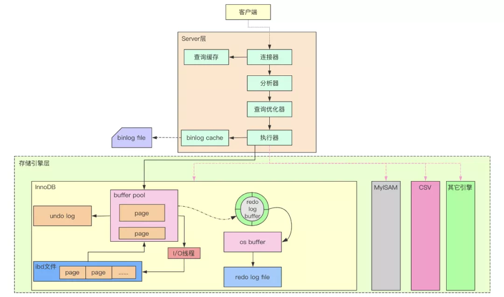
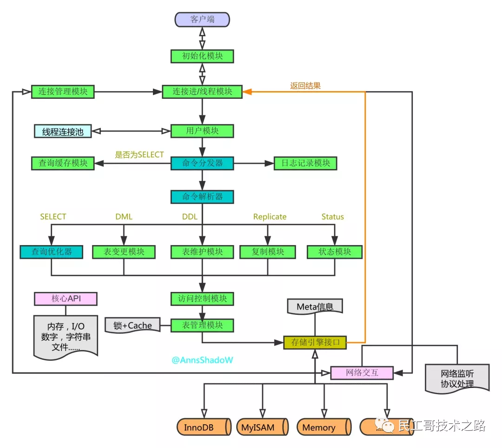
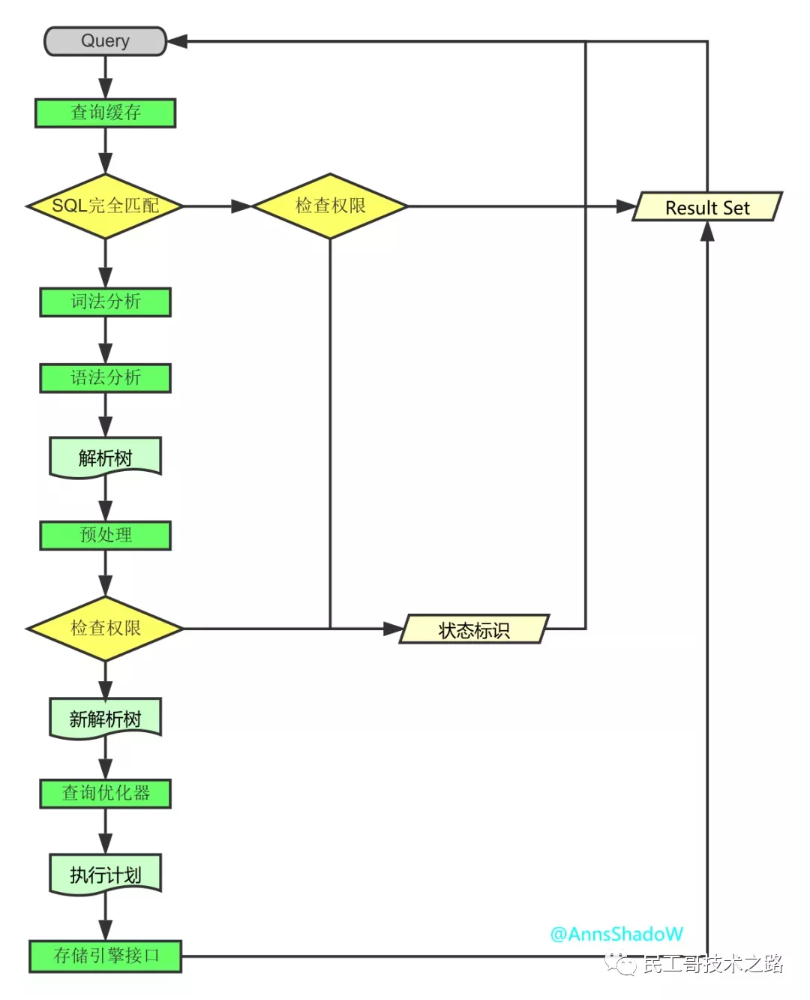
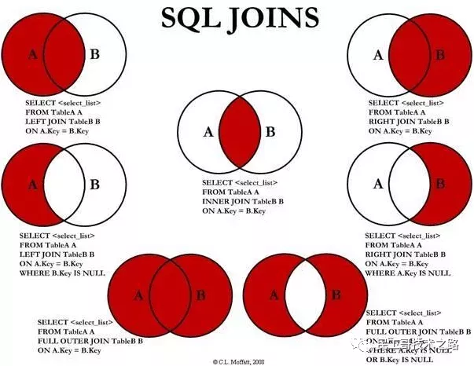

## ACID
1. 原子性（Atomicity）
事务包含的所有数据库操作要么全部成功，要不全部失败回滚。

2. 一致性（Consistency）
一致性是指事务必须使数据库从一个一致性状态变换到另一个一致性状态，也就是说一个事务执行之前和执行之后都必须处于一致性状态。一致性规定事务提交前后只存在两个状态，提交前的状态和提交后的状态，绝对不会出现中间的状态。最典型的例子就是银行转账，A和B之间互相转账，账面加起来总和5000元，无论A和B之间怎么转，转几次，成功与否，事务结束后A和B账面总和还是5000元。

3. 隔离性（Isolation）
隔离性是当多个用户并发访问数据库时，比如操作同一张表时，数据库为每一个用户开启的事务，不能被其他事务的操作所干扰，多个并发事务之间要相互隔离。即要达到这么一种效果：对于任意两个并发的事务T1和T2，在事务T1看来，T2要么在T1开始之前就已经结束，要么在T1结束之后才开始，这样每个事务都感觉不到有其他事务在并发地执行。

4. 持久性（Durability）
持久性是指一个事务一旦被提交了，那么对数据库中的数据的改变就是永久性的，即便是在数据库系统遇到故障的情况下也不会丢失提交事务的操作。

## 隔离级别
### 事务并发时存在的问题
1. 脏读（Dirty Read）
脏数据所指的就是未提交的数据，而脏读是指在一个事务处理过程里读取了另一个未提交的事务中的数据。比如，一个事务正在对一条记录做修改，在这个事务完成并提交之前，这条数据是处于待定状态的（可能提交也可能回滚），这时，第二个事务来读取这条没有提交的数据，并据此做进一步的处理，就会产生未提交的数据依赖关系。这种现象被称为脏读。

2. 不可重复读（Non-repeatable Read）
一个事务先后读取同一条记录，而事务在两次读取之间该数据被其它事务所修改，则两次读取的数据不同，我们称之为不可重复读。例如事务T1在读取某一数据，而事务T2立马修改了这个数据并且提交事务给数据库，事务T1再次读取该数据就得到了不同的结果，发送了不可重复读。
不可重复读和脏读的区别：脏读是某一事务读取了另一个事务未提交的脏数据，而不可重复读则是在同一事务内读取了前一事务提交的数据，即前一次读到的数据是另一个事务提交前，后一次读到的数据是提交后的。

3. 幻读（Phantom Read）
一个事务按相同的查询条件重新读取以前检索过的数据，却发现其他事务插入了满足其查询条件的新数据，这种现象就称为幻读。幻读是指当事务不是独立执行时发生的一种现象，例如第一个事务对一个表中的数据进行了修改，比如这种修改涉及到表中的“全部数据行”。同时，第二个事务也修改这个表中的数据，这种修改是向表中插入“一行新数据”。那么，以后就会发生操作第一个事务的用户发现表中还存在没有修改的数据行，就好象发生了幻觉一样。
> 幻读和不可重复读都是读取了另一条已经提交的事务（这点就脏读不同），所不同的是不可重复读查询的都是同一个数据项，而幻读针对的是一批数据整体（比如数据的个数）。
在实际开发和使用中，其实幻读问题是可以接受也符合用户的心理预期，比如在淘宝双十一抢东西，点击“购买”，成功进入 **“下单页面”，结果到“付款页面”** 却提示已经被抢完，这是可以接受的。

### 四个隔离级别
1. 读未提交（Read uncommitted）
所有事务都可以看到其他未提交事务的执行结果。本隔离级别是最低的隔离级别，虽然拥有超高的并发处理能力及很低的系统开销，但很少用于实际应用。因为采用这种隔离级别只能防止更新丢失问题（这个问题现代关系型数据库已经不会发生），不能解决脏读，不可重复读及幻读问题。

2. 读已提交（Read committed）
这是大多数数据库系统的默认隔离级别（但不是MySQL默认的）。它满足了隔离的简单定义：一个事务只能看见已经提交事务所做的改变。这种隔离级别可以防止脏读问题，但会出现不可重复读及幻读问题。

3. 可重复读（Repeatable read）
这是MySQL的默认事务隔离级别，它确保同一事务的多个实例在并发读取数据时，会看到同样的数据行。这种隔离级别可以防止除幻读外的其他问题。

4. 串行化（Serializable ）
这是最高的隔离级别，它通过强制事务排序，使之不可能相互冲突，从而解决幻读、第二类更新丢失问题。在这个级别，可以解决上面提到的所有并发问题，但可能导致大量的超时现象和锁竞争，通常数据库不会用这个隔离级别，我们需要其他的机制来解决这些问题:乐观锁和悲观锁。

隔离级别| 脏读| 不可重复读 |幻读
---|---|---|---
Read uncommitted (读未提交) | ✓|✓|✓
Read committed (读已提交) | x|✓|✓
Repeatable read (可重复读)| x|x|✓
Serializable (串行化)| x|x|x


## mysql参数
```
默认值:
read_buffer_size 128kb
sort_buffer_size 256kb
innodb_sort_buffer_size 1M
read_rnd_buffer_size 256kb
join_buffer_size 256kb
tmp_table_size 16M
table_open_cache 4000

innodb_buffer_pool_size 128M
key_buffer_size 8M

innodb_page_size 16kb

show global status;
show global variables  like '%query_cache%'; -- global   like '%s%';
SET GLOBAL innodb_buffer_pool_size = 3221225472

8G内存建议配置：

每个链接的：
read_buffer_size 4M
sort_buffer_size 4M
read_rnd_buffer_size 4M # 但MySql会为每个客户连接发放该缓冲空间，所以应尽量适当设置该值，以避免内存开销过大。 

全局的
innodb_buffer_pool_size 4G 改成db服务器总内存的60% 到80%
key_buffer_size 512M

# 5.7 key_buffer_size, innodb_buffer_pool_size, innodb_additional_mem_pool_size（8.0无），innodb_log_buffer_size, query_cache_size （8.0无）

范围索引 有限制，当区间大了可能不会使用索引：
（range_optimizer_max_mem_size默认8388608即8M。0表示不限制。
show variables like 'range_optimizer_max_mem_size';）

join_buffer_size 262144 256KB
其它
innodb_page_size 16kb
tmp_table_size 512M
table_open_cache 4000
max_allowed_packet = 16M：服务端最大允许接收的数据包大小。在没有调整该配置项的时候，服务端默认是4M。
max_allowed_packet =976kb

innodb_buffer_pool_chunk_size 默认 128MB
innodb_buffer_pool_chunk_size 的最大值估算如下：
MAX(innodb_buffer_pool_chunk_size) = innodb_buffer_pool_size / innodb_buffer_pool_instances
https://dev.mysql.com/doc/refman/5.7/en/innodb-buffer-pool-resize.html
```
和内存相关的几个参数
```

innodb_buffer_pool_instances
join_buffer_size
tmp_table_size
```
和IO相关的几个参数
```
sync_binlog
innodb_flush_logs_at_trx_commit
innodb_io_capacity
innodb_io_capacity_max
```
和连接相关的几个参数
```
back_log
table_open_cache
thread_cache_size
loose_thread_pool_enabled
```
## sql
- 对于给定的查询，使用优化器提示：
SELECT /*+ SET_VAR(optimizer_switch = 'condition_fanout_filter=off') */ ...


- 查看优化sql
explain SELECT * FROM t1 WHERE 1 ;
show warnings;

## MySQL新增用户及赋予权限

创建用户
```
USE mysql; #创建用户需要操作 mysql 表
# 语法格式为 [@'host']  host 为 'localhost' 表示本地登录用户，host 为 IP地址或 IP 地址区间，表示指定IP地址的主机可登录，host 为 "%"，表示所有主机都可登录，省略代表所有主机
CREATE USER 'username'[@'host'] IDENTIFIED BY 'password';
# eg. 常见 local_user 用户可以在所有主机登录，密码为 123456
CREATE USER 'local_user' IDENTIFIED BY '123456';
# eg. 创建 local_user 只允许在本地登录
CREATE USER 'local_user'@'localhost' IDENTIFIED BY '123456';
```
查看用户权限
```
# 可以通过查询 user 表获取 语法格式为
SELECT  privileges|* FROM user WHERE `user` = 'username';
# eg. 查看 local_user 的权限
SELECT * FROM user WHERE `user` = 'local_user';
# 也可以用 SHOW GRANTS 查看
SHOW GRANTS FOR 'username' [@host];
# eg.
SHOW GRANTS FOR local_user;
```
赋予用户权限
```
# 语法格式
GRANT privileges ON database.table TO 'username'@'host' [IDENTIFIED BY 'password'];
# eg. 赋予 local_user 在所有主机的所有权限，但不包含给其他账号赋予权限的权限
GRANT all ON *.* TO 'local_user'@'%';
# 刷新权限 权限更新后刷新才会起作用
FLUSH PRIVILEGES;
```

- GRANT命令说明：
    - priveleges (权限列表),可以是all, 表示所有权限，也可以是select,update等权限，多个权限的名词,相互之间用逗号分开。
    - ON 用来指定权限针对哪些库和表。格式为数据库 .表名 ，点号前面用来指定数据库名，点号后面用来指定表名，*.* 表示所有数据库所有表。
    - TO 表示将权限赋予某个用户, 格式为username@host，@前面为用户名，@后面接限制的主机，可以是IP、IP段、域名以及%，%表示任何地方。注意：这里%有的版本不包括本地，以前碰到过给某个用户设置了%允许任何地方登录，但是在本地登录不了，这个和版本有关系，遇到这个问题再加一个localhost的用户就可以了。
    - IDENTIFIED BY 指定用户的登录密码,该项可以省略(某些版本下回报错，必须省略)。
    - WITH GRANT OPTION 这个选项表示该用户可以将自己拥有的权限授权给别人。注意：经常有人在创建操作用户的时候不指定WITH GRANT OPTION选项导致后来该用户不能使用GRANT命令创建用户或者给其它用户授权。
    备注：可以使用GRANT重复给用户添加权限，权限叠加，比如你先给用户添加一个select权限，然后又给用户添加一个insert权限，那么该用户就同时拥有了select和insert权限。
- 授权原则说明：
    - 只授予能满足需要的最小权限，防止用户干坏事。比如用户只是需要查询，那就只给select权限就可以了，不要给用户赋予update、insert或者delete权限。
    - 创建用户的时候限制用户的登录主机，一般是限制成指定IP或者内网IP段。
    - 初始化数据库的时候删除没有密码的用户。安装完数据库的时候会自动创建一些用户，这些用户默认没有密码。
    - 为每个用户设置满足密码复杂度的密码。
    - 定期清理不需要的用户。回收权限或者删除用户。

收回用户权限
```
# 语法格式
REVOKE privileges ON database.table FROM 'username'@'host';
# eg. 收回 local_user 的写入和更新权限
REVOKE insert,update ON *.* FROM 'local_user'@'%';
```
删除用户
```
# 语法格式
DROP USER 'username'@'host';
# eg. 删除本地用户 local_user
DROP USER 'local_user'@'localhost';
```

# MySQL 架构总览->查询执行流程->SQL 解析顺序
## MySQL 架构总览



从上图中我们可以看到，整个架构分为两层，上层是 MySQLD 的被称为的‘SQL Layer’，下层是各种各样对上提供接口的存储引擎，被称为‘Storage Engine Layer’。

## 查询执行流程
### 连接
- 客户端发起一条 Query 请求，监听客户端的‘连接管理模块’接收请求；
- 将请求转发到‘连接进/线程模块’；
- 调用‘用户模块’来进行授权检查；
- 通过检查后，‘连接进/线程模块’从‘线程连接池’中取出空闲的被缓存的连接线程和客户端请求对接，如果失败则创建一个新的连接请求。
### 处理
- 先查询缓存，检查 Query 语句是否完全匹配，接着再检查是否具有权限，都成功则直接取数据返回；
- 上一步有失败则转交给‘命令解析器’，经过词法分析，语法分析后生成解析树；
- 接下来是预处理阶段，处理解析器无法解决的语义，检查权限等，生成新的解析树；
- 再转交给对应的模块处理；
- 如果是 SELECT 查询还会经由‘查询优化器’做大量的优化，生成执行计划；
- 模块收到请求后，通过‘访问控制模块’检查所连接的用户是否有访问目标表和目标字段的权限；
- 有则调用‘表管理模块’，先是查看 table cache 中是否存在，有则直接对应的表和获取锁，否则重新打开表文件；
- 根据表的 meta 数据，获取表的存储引擎类型等信息，通过接口调用对应的存储引擎处理；
- 上述过程中产生数据变化的时候，若打开日志功能，则会记录到相应二进制日志文件中。
### 结果
- Query 请求完成后，将结果集返回给‘连接进/线程模块’；
- 返回的也可以是相应的状态标识，如成功或失败等；
- ‘连接进/线程模块’进行后续的清理工作，并继续等待请求或断开与客户端的连接。



## SQL解析顺序
首先看一下示例语句：
```sql
SELECT DISTINCT
    < select_list >
FROM
    < left_table > < join_type >
JOIN < right_table > ON < join_condition >
WHERE
    < where_condition >
GROUP BY
    < group_by_list >
HAVING
    < having_condition >
ORDER BY
    < order_by_condition >
LIMIT < limit_number >
```
然而它的执行顺序是这样的：
```sql
FROM <left_table>
ON <join_condition>
<join_type> JOIN <right_table>
WHERE <where_condition>
GROUP BY <group_by_list>
HAVING <having_condition>
SELECT 
DISTINCT <select_list>
ORDER BY <order_by_condition>
LIMIT <limit_number>
```
从哪里获取，不断的过滤条件，要选择一样或不一样的，排好序，那才知道要取前几条

### 准备工作
创建测试数据库
```sql
create database testQuery
```
创建测试表
```sql
CREATE TABLE table1
(
    uid VARCHAR(10) NOT NULL,
    name VARCHAR(10) NOT NULL,
    PRIMARY KEY(uid)
)ENGINE=INNODB DEFAULT CHARSET=UTF8;

CREATE TABLE table2
(
    oid INT NOT NULL auto_increment,
    uid VARCHAR(10),
    PRIMARY KEY(oid)
)ENGINE=INNODB DEFAULT CHARSET=UTF8;
```
插入数据
```sql
INSERT INTO table1(uid,name) VALUES('aaa','mike'),('bbb','jack'),('ccc','mike'),('ddd','mike');

INSERT INTO table2(uid) VALUES('aaa'),('aaa'),('bbb'),('bbb'),('bbb'),('ccc'),(NULL);
```
最后想要的结果
```sql
SELECT
    a.uid,
    count(b.oid) AS total
FROM
    table1 AS a
LEFT JOIN table2 AS b ON a.uid = b.uid
WHERE
    a. NAME = 'mike'
GROUP BY
    a.uid
HAVING
    count(b.oid) < 2
ORDER BY
    total DESC
LIMIT 1;
```

### SQL解析
#### FROM
当涉及多个表的时候，左边表的输出会作为右边表的输入，之后会生成一个虚拟表 VT1。

- (1-J1)笛卡尔积
计算两个相关联表的笛卡尔积 (CROSS JOIN) ，生成虚拟表 VT1-J1。
```
mysql> select * from table1,table2;
+-----+------+-----+------+
| uid | name | oid | uid  |
+-----+------+-----+------+
| aaa | mike |   1 | aaa  |
| bbb | jack |   1 | aaa  |
| ccc | mike |   1 | aaa  |
| ddd | mike |   1 | aaa  |
| aaa | mike |   2 | aaa  |
| bbb | jack |   2 | aaa  |
| ccc | mike |   2 | aaa  |
| ddd | mike |   2 | aaa  |
| aaa | mike |   3 | bbb  |
| bbb | jack |   3 | bbb  |
| ccc | mike |   3 | bbb  |
| ddd | mike |   3 | bbb  |
| aaa | mike |   4 | bbb  |
| bbb | jack |   4 | bbb  |
| ccc | mike |   4 | bbb  |
| ddd | mike |   4 | bbb  |
| aaa | mike |   5 | bbb  |
| bbb | jack |   5 | bbb  |
| ccc | mike |   5 | bbb  |
| ddd | mike |   5 | bbb  |
| aaa | mike |   6 | ccc  |
| bbb | jack |   6 | ccc  |
| ccc | mike |   6 | ccc  |
| ddd | mike |   6 | ccc  |
| aaa | mike |   7 | NULL |
| bbb | jack |   7 | NULL |
| ccc | mike |   7 | NULL |
| ddd | mike |   7 | NULL |
+-----+------+-----+------+
28 rows in set (0.00 sec)
```
- (1-J2) ON过滤

基于虚拟表 VT1-J1 这一个虚拟表进行过滤，过滤出所有满足 ON 谓词条件的列，生成虚拟表 VT1-J2。

注意：这里因为语法限制，使用了 'WHERE' 代替，从中读者也可以感受到两者之间微妙的关系。
```
mysql> SELECT
    -> *
    -> FROM
    -> table1,
    -> table2
    -> WHERE
    -> table1.uid = table2.uid
    -> ;
+-----+------+-----+------+
| uid | name | oid | uid  |
+-----+------+-----+------+
| aaa | mike |   1 | aaa  |
| aaa | mike |   2 | aaa  |
| bbb | jack |   3 | bbb  |
| bbb | jack |   4 | bbb  |
| bbb | jack |   5 | bbb  |
| ccc | mike |   6 | ccc  |
+-----+------+-----+------+
6 rows in set (0.00 sec)
```

- (1-J3) 添加外部列

如果使用了外连接 (LEFT,RIGHT,FULL)，主表（保留表）中的不符合ON条件的列也会被加入到 VT1-J2中，作为外部行，生成虚拟表 VT1-J3。

```
mysql> SELECT
    -> *
    -> FROM
    -> table1 AS a
    -> LEFT OUTER JOIN table2 AS b ON a.uid = b.uid;
+-----+------+------+------+
| uid | name | oid  | uid  |
+-----+------+------+------+
| aaa | mike |    1 | aaa  |
| aaa | mike |    2 | aaa  |
| bbb | jack |    3 | bbb  |
| bbb | jack |    4 | bbb  |
| bbb | jack |    5 | bbb  |
| ccc | mike |    6 | ccc  |
| ddd | mike | NULL | NULL |
+-----+------+------+------+
7 rows in set (0.00 sec)
```


#### WHERE
对 VT1 过程中生成的临时表进行过滤，满足 WHERE 子句的列被插入到 VT2 表中。

注意：此时因为分组，不能使用聚合运算；也不能使用 SELECT 中创建的别名；

与 ON 的区别：
- 如果有外部列，ON针对过滤的是关联表，主表（保留表）会返回所有的列；
- 如果没有添加外部列，两者的效果是一样的。

应用：

- 对主表的过滤应该放在 WHERE；
- 对于关联表，先条件查询后连接则用ON，先连接后条件查询则用 WHERE。
```
mysql> SELECT
    -> *
    -> FROM
    -> table1 AS a
    -> LEFT OUTER JOIN table2 AS b ON a.uid = b.uid
    -> WHERE
    -> a. NAME = 'mike';
+-----+------+------+------+
| uid | name | oid  | uid  |
+-----+------+------+------+
| aaa | mike |    1 | aaa  |
| aaa | mike |    2 | aaa  |
| ccc | mike |    6 | ccc  |
| ddd | mike | NULL | NULL |
+-----+------+------+------+
4 rows in set (0.00 sec)
```

#### GROUP BY
这个子句会把 VT2 中生成的表按照 GROUP BY 中的列进行分组，生成 VT3 表。

注意：其后处理过程的语句，如 SELECT、HAVING，所用到的列必须包含在 GROUP BY 中，对于没有出现的，得用聚合函数；

原因：GROUP BY 改变了对表的引用，将其转换为新的引用方式，能够对其进行下一级逻辑操作的列会减少。

我的理解是：根据分组字段，将具有相同分组字段的记录归并成一条记录，因为每一个分组只能返回一条记录，除非是被过滤掉了，而不在分组字段里面的字段可能会有多个值，多个值是无法放进一条记录的，所以必须通过聚合函数将这些具有多值的列转换成单值；

```
mysql> SELECT
    -> *
    -> FROM
    -> table1 AS a
    -> LEFT OUTER JOIN table2 AS b ON a.uid = b.uid
    -> WHERE
    -> a. NAME = 'mike'
    -> GROUP BY
    -> a.uid;
+-----+------+------+------+
| uid | name | oid  | uid  |
+-----+------+------+------+
| aaa | mike |    1 | aaa  |
| ccc | mike |    6 | ccc  |
| ddd | mike | NULL | NULL |
+-----+------+------+------+
3 rows in set (0.00 sec)
```

#### HAVING
这个子句对 VT3 表中的不同的组进行过滤，只作用于分组后的数据，满足 HAVING 条件的子句被加入到 VT4 表中。
```
mysql> SELECT
    -> *
    -> FROM
    -> table1 AS a
    -> LEFT OUTER JOIN table2 AS b ON a.uid = b.uid
    -> WHERE
    -> a. NAME = 'mike'
    -> GROUP BY
    -> a.uid
    -> HAVING
    -> count(b.oid) < 2;
+-----+------+------+------+
| uid | name | oid  | uid  |
+-----+------+------+------+
| ccc | mike |    6 | ccc  |
| ddd | mike | NULL | NULL |
+-----+------+------+------+
2 rows in set (0.00 sec)
```

#### SELECT
这个子句对 SELECT 子句中的元素进行处理，生成 VT5 表。

(5-J1) 计算表达式 计算 SELECT 子句中的表达式，生成 VT5-J1。

(5-J2) DISTINCT

寻找 VT5-1 中的重复列，并删掉，生成 VT5-J2。

如果在查询中指定了 DISTINCT 子句，则会创建一张内存临时表（如果内存放不下，就需要存放在硬盘了）。这张临时表的表结构和上一步产生的虚拟表 VT5 是一样的，不同的是对进行 DISTINCT 操作的列增加了一个唯一索引，以此来除重复数据。
```
mysql> SELECT
    -> a.uid,
    -> count(b.oid) AS total
    -> FROM
    -> table1 AS a
    -> LEFT OUTER JOIN table2 AS b ON a.uid = b.uid
    -> WHERE
    -> a. NAME = 'mike'
    -> GROUP BY
    -> a.uid
    -> HAVING
    -> count(b.oid) < 2;
+-----+-------+
| uid | total |
+-----+-------+
| ccc |     1 |
| ddd |     0 |
+-----+-------+
2 rows in set (0.00 sec)
```
#### ORDER BY
从 VT5-J2 中的表中，根据 ORDER BY 子句的条件对结果进行排序，生成 VT6 表。

注意：唯一可使用 SELECT 中别名的地方。
```
mysql> SELECT
    -> a.uid,
    -> count(b.oid) AS total
    -> FROM
    -> table1 AS a
    -> LEFT OUTER JOIN table2 AS b ON a.uid = b.uid
    -> WHERE
    -> a. NAME = 'mike'
    -> GROUP BY
    -> a.uid
    -> HAVING
    -> count(b.oid) < 2
    -> ORDER BY
    -> total DESC;
+-----+-------+
| uid | total |
+-----+-------+
| ccc |     1 |
| ddd |     0 |
+-----+-------+
2 rows in set (0.00 sec)
```
#### LIMIT
LIMIT 子句从上一步得到的 VT6 虚拟表中选出从指定位置开始的指定行数据。

注意：

- offset 和 rows 的正负带来的影响；
- 当偏移量很大时效率是很低的，可以这么做；
- 采用子查询的方式优化，在子查询里先从索引获取到最大 id，然后倒序排，再取 N 行结果集；
- 采用 INNER JOIN 优化，JOIN 子句里也优先从索引获取 ID 列表，然后直接关联查询获得最终结果。

```
mysql> SELECT
    -> a.uid,
    -> count(b.oid) AS total
    -> FROM
    -> table1 AS a
    -> LEFT JOIN table2 AS b ON a.uid = b.uid
    -> WHERE
    -> a. NAME = 'mike'
    -> GROUP BY
    -> a.uid
    -> HAVING
    -> count(b.oid) < 2
    -> ORDER BY
    -> total DESC
    -> LIMIT 1;
+-----+-------+
| uid | total |
+-----+-------+
| ccc |     1 |
+-----+-------+
1 row in set (0.00 sec)
```
## 总结

