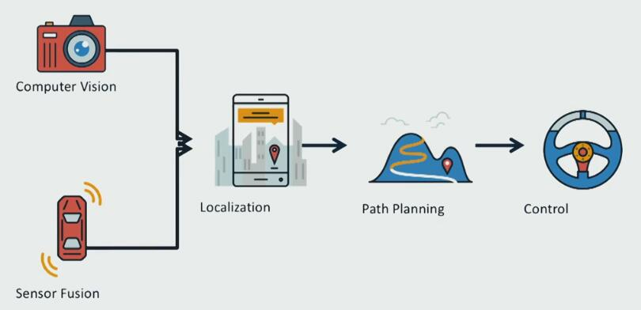
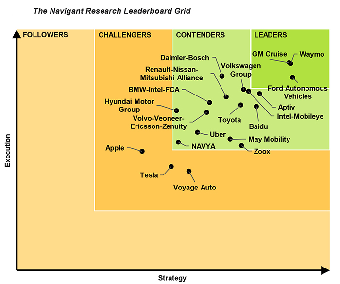

[最佳实践,为计算机视觉代码示例和文档。微软出品](https://github.com/microsoft/computervision-recipes)
## 图片处理

- OpenCV 
 [LearnOpenCV](https://github.com/spmallick/learnopencv)
- Kornia 
Kornia 是一个基于 PyTorch 的可微分的计算机视觉 （differentiable computer vision） 开源库，
最常用图像处理库就是 OpenCV 和 PIL 了。然而，因为 OpenCV 和 PIL 都是不可微的，所以这些处理都只可以作为图像的预处理而无法通过观察梯度的变化来对这些算子进行优化 （gradient-based optimization）。因此，Kornia 便应运而生。
论文链接：https://arxiv.org/pdf/2009.10521.pdf
项目链接：https://github.com/kornia/kornia
文档链接：https://kornia.readthedocs.io/en/latest/index.html
examples: https://github.com/kornia/kornia-examples

### 卡通化
[卡通化](https://github.com/SystemErrorWang/White-box-Cartoonization)
使用了GAN
[在线图片或视频来进行卡通化](https://cartoonize-lkqov62dia-de.a.run.app/cartoonize)
[论文链接](https://systemerrorwang.github.io/White-box-Cartoonization/paper/06791.pdf)

### 图片转3D人体模型
https://github.com/facebookresearch/pifuhd

### 人脸识别
- face-api.js
https://github.com/justadudewhohacks/face-api.js

#### BlazeFace
https://arxiv.org/abs/1907.05047
https://google.github.io/mediapipe/solutions/face_detection

#### 口罩检测
数据
https://www.kaggle.com/andrewmvd/face-mask-detection

https://www.cnblogs.com/zkweb/p/14078501.html

### 目标检测
- 旷视提出MegDetV2：目标检测/实例分割系统 论文：https://arxiv.org/abs/2010.02475

## Action Recognition
https://github.com/jinwchoi/awesome-action-recognition

https://github.com/kenshohara/3D-ResNets-PyTorch

### OpenPose
https://github.com/felixchenfy/Realtime-Action-Recognition

[OpenPose：实现抖音很火的人体骨架和视频动态舞](https://www.toutiao.com/i6894794634640392712/)
[人体骨架舞：OpenPose用python-opencv实现](https://www.toutiao.com/i6894970259586056711/)

### BlazePose
谷歌研究人员提出全新神经网络BlazePose，可健身跟踪、手语识别
https://arxiv.org/pdf/2006.10204.pdf
https://arxiv.org/abs/2006.10204
https://www.arxiv-vanity.com/papers/2006.10204/

[推出 BlazePose：实现设备端实时人体姿态追踪](https://blog.csdn.net/jILRvRTrc/article/details/108590889)

### 安全帽佩戴检测
https://github.com/PeterH0323/Smart_Construction
数据集链接：https://github.com/njvisionpower/Safety-Helmet-Wearing-Dataset

### BlazePalm
https://google.github.io/mediapipe/solutions/hands

## OpenMMLab
https://github.com/open-mmlab
https://open-mmlab.github.io/
http://openmmlab.org/

2020年7月10 号 OpenMMLab 在 WAIC 2020 世界人工智能大会上发布了重磅升级，给大家带来了更丰富的 OpenMMLab 大礼包，1 个架构，10+ 个研究方向，100+ 种算法，600+ 预训练模型，是深度学习时代最完整的计算机视觉算法开源体系。

[MMDetection（物体检测）](https://github.com/open-mmlab/mmdetection)：在一个统一而灵活的架构上，高效实现了20多种典型检测算法。

[MMAction（行为理解）](https://github.com/open-mmlab/mmaction)：支持视频行为理解中的动作识别、时序检测、和时空检测等多种基本任务，复现了多种流行的算法，并支持常见的各种数据集。

[MMSkeleton（基于人体骨骼的理解）](https://github.com/open-mmlab/mmskeleton)：以人体骨骼为核心的视频理解框架，基于时空图模型（ST-GCN）支持行为理解、姿态估计、动作生成等任务。

[MMSR（图像与视频超分辨率）](https://github.com/open-mmlab/mmediting)：在统一的架构上，实现了一系列先进的超分辨率算法。

[MMFashion（时尚分析）](https://github.com/open-mmlab/mmfashion)：专注于时尚服饰领域的视觉分析，覆盖识别、检索、属性预测、检测、分割、推荐等主流任务。

### MMCV (基础支持)
Computer Vision 计算机视觉
https://github.com/open-mmlab/mmcv

新特性

- 增加 build_runner 方法，方便下游代码库的 runner 定制化
- 支持对 DCN 中 offset 层学习率的调整
- 增加 EMAHook，支持指数移动平均方法
- 为 Adaptive Average Pooling 提供 ONNX 的支持
- 增加新的算子，如 TINShift，Conv2dAdaptivePadding
- 增加新模块，如 DepthwiseSeparableConvModule，Swish activation
- 增加新的数据处理模块，如 imshear，imtranslate，adjust_brightness 等

代码改进

- JsonHandler 增加对 unserializable 的值与更多默认类型的支持
- 图像处理模块支持对角线翻转
- 优化 batched_nms 以处理框数量过多的情况，自动根据框的类别标签进行序列处理
- 增加了 wrap_fp16_model 的接口
- 改进 train/val_step 接口
- 添加 deconv 的注册器
- 支持在 fp16 optimizer hook 中记录梯度大小
- 允许 imshow_det_bboxes() 同时返回框和图片

### MMClassification 分类

https://github.com/open-mmlab/mmclassification

新特性

- 增加 inference 的相关代码
- 支持 PyTorch 到 ONNX 的转换
- 增加新的 transform，包括基于 PIL 的 transform 和 albumentations
- 增加新模型，包括 ResNeSt，VGG 等
- 支持新更多数据集
- 增加结果可视化模块

代码改进和 BUG 修复

- 更新了 ShuffleNet 的配置文件，更新多个模型的预训练权重，包括 ShuffleNet 系列与 SE-ResNet 系列
- 解决多个 transform 中存在的错误 
- 改进多个模型的参数和初始化问题

### MMSegmentation
Semantic Segmentation 计算机视觉 - 语义分割
https://github.com/open-mmlab/mmsegmentation

新算法/模型

- MobileNet V2
- EMANet
- DNL
- PointRend
- Semantic FPN
- Fast SCNN
- ResNeSt
- ORNet ResNet
- DeepLabV3/DeepLabV3+ Dilate 16

新数据集

- Pascal Context

代码改进

- 支持 ONNX 导出上采样
- 支持 Windows 环境下的安装
- 迁移 DepthwiseSeparableConv，collect_env 到 MMCV
- 支持用户自定义数据集类别和调色板

### MMEditing
图像和视频编辑
https://github.com/open-mmlab/mmediting

新特性

- 支持 NIQE，一种常用的图像质量评价指标，帮助大家更好地测试自己的模型
- 支持 pip install mmedit
- 加入 FP16 训练所需模块，支持 FP16 的训练，降低资源开销

### MMDetection
目标检测
https://github.com/open-mmlab/mmdetection

支持新算法/模型

- YOLACT
- CentripetalNet
- SABL
- YOLOv3
- PAA Assign
- CornerNet
- DIOU/CIOU loss
- 支持新数据集 LVIS V1

文档完善

- 新的colab tutorial：增加了训练教程，教程中包括将新的数据集转为MMDet的格式并对预训练模型进行微调和推理，方便新手了解目标检测中从数据预处理到模型训练和推理的全过程
- 增加trouble shooting页面：总结了mmdet使用过程中的常见issue和解决方案
- 完善了自定义数据集、自定义模型相关的教程

新特性

- 支持batch inference：支持在推理过程单卡 batch size >1的情况，提高模型推理的并行度
- 支持pip install mmdet：从此支持一行命令安装mmdet了
- 支持 RetinaNet 从 Pytorch 到 ONNX的转换：支持和完善了PyTorch2ONNX的功能，后续还会继续支持双阶段和多阶段检测器的Pytorch2ONNX
- 支持了PyTorch 1.6 Dockerfile：更新了Dockerfile，用户可以使用基于PyTorch1.6的docker来使用MMDetection，注意，Pytorch 1.3 - Pytorch 1.5的docker仍然可以使用，用户只需要在Dockerfile中修改PyTorch相应版本即可。

代码改进

- 将所有的CUDA/C++ 算子迁移到了MMCV，统一管理 OpenMMLab 项目对 CUDA 算子依赖。
- 对自定义数据集的灵活支持，支持根据类别自动筛选数据：之前对自定义数据集和自定义类别的数据使用不够友好，在指定训练类别的情况下无法控制剔除无GT图像的行为。最新版使得只有在 filter_empty_gt=True 和 test_mode=True 的情况下才会剔除无 GT 的图像，消除了数据筛选的歧义。
- 统一了代码中的负样本标签定义，RPN head 中 0 代表正样本（第一正类），1 代表负样本，使得 v2.5 以后所有的 head 都使用 self.num_classes 来定义背景框的标签，不再有特殊情况。

### MMDetection3D
通用3D对象检测平台。
https://github.com/open-mmlab/mmdetection3d

支持新算法/模型

- H3DNet
- 3DSSD
- CenterPoint

支持新数据集

- Waymo：支持 Waymo 数据集，开放了 PointPillars 和 SECOND 的预训练模型和模型性能，为研究和开发提供性能基准
- nuImages：支持使用 nuImages 数据集进行目标检测、实例分割任务。包含 Mask R-CNN and Cascade Mask R-CNN 预训练模型和模型性能，提供性能基准的同时也为多模态检测提供了预训练模型。

新特性

- 支持 Batch Inference：支持在推理过程单卡 batch size >1 的情况，提高模型推理的并行度
- 支持 Pytorch 1.6：支持了 Pytorch1.6，清理了 Pytorch1.6 （如 torch.nonzero）相关的warning
- 支持 pip install mmdet3d：支持一行命令安装 mmdetection3d，方便开发者将 mmdet3d 作为基础代码库开发新的项目
- 支持混合精度训练：对 PointPillars/SECOND 等基于 voxel 的模型支持混合精度训练，在 KITTI 和 nuScenes 数据集上显存减半但是精度不掉。
### MMPose
姿态估计
https://github.com/open-mmlab/MMPose

### MMAction2
行动理解
https://github.com/open-mmlab/MMAction2

### mmfashion
visual fashion analysis 视觉时尚分析
https://github.com/open-mmlab/mmfashion
### mmskeleton
human pose estimation, skeleton-based action recognition, and action synthesis.
人体姿态估计，基于骨架的动作识别，动作合成。
https://github.com/open-mmlab/mmskeleton

### OpenSelfSup（自监督学习）

https://github.com/open-mmlab/OpenSelfSup

以统一的框架支持基于分类、聚类、memory bank、contrastive learning 的多种自监督学习算法，支持最前沿的 SimCLR, MoCo, BYOL 等算法，在多个 benchmark 上支持标准化的评测方案。

### OpenPCDet（点云 3D 目标检测）

https://github.com/open-mmlab/OpenPCDet

清晰简洁的代码框架设计，基于统一规范化的 3D 坐标系，方便地支持各种数据集，代码采用模块化设计，集成各种 3D 检测模型，包含 PV-RCNN 等多个排行榜 top 排名的高性能3D检测方法。

### OpenUnReID（无监督目标重识别）

https://github.com/open-mmlab/OpenUnReID

第一个针对无监督及领域自适应的目标重识别框架，同时支持基于伪标签和域转换的算法，速度和精度相对其他框架均更优，且具有较强的可拓展性。

## 自动驾驶
[百度apollo](https://github.com/ApolloAuto/apollo)
[基于apollo](https://github.com/lgsvl)
[waymo](https://github.com/waymo-research/waymo-open-dataset)

Navigant Research自动驾驶排行榜 2020

竖坐标为执行能力（Execution），横坐标为策略能力（Strategy），将他们划分为「领导者」、「竞争者」、「挑战者」以及「跟随者」四个等级

[自动驾驶汽车成熟度指数报告](files/2020-autonomous-vehicles-readiness-index.pdf)
毕马威《自动驾驶汽车成熟度指数报告》(Autonomous Vehicles Readiness Index)(AVRI)
https://home.kpmg/au/en/home/insights/2020/07/autonomous-vehicles-readiness-index-2020.html
 