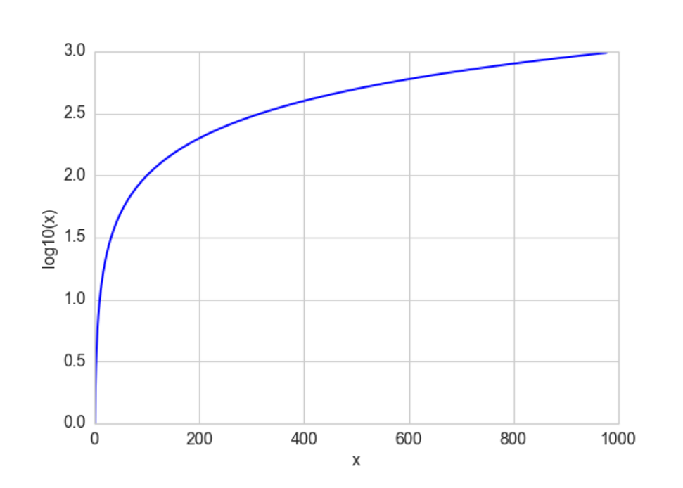
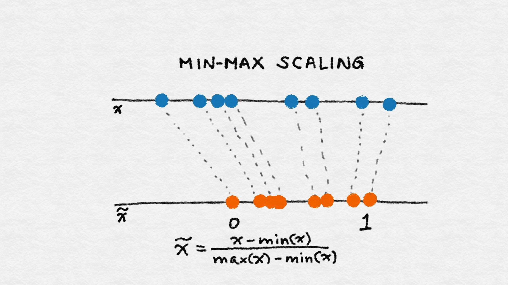
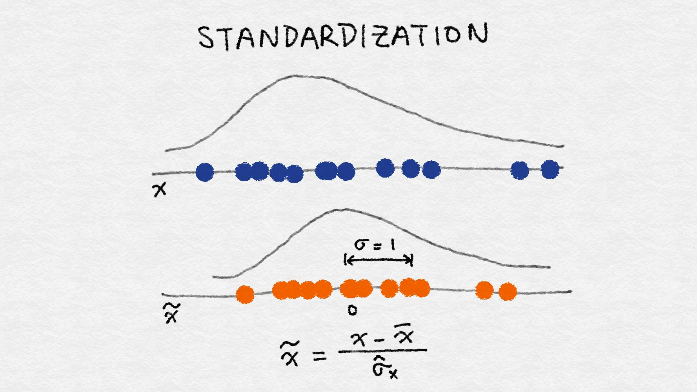
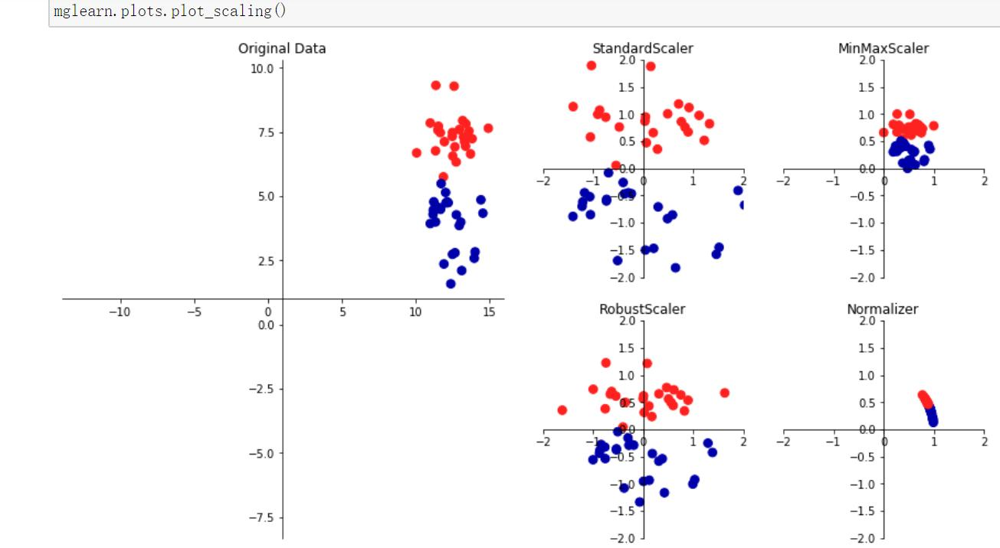
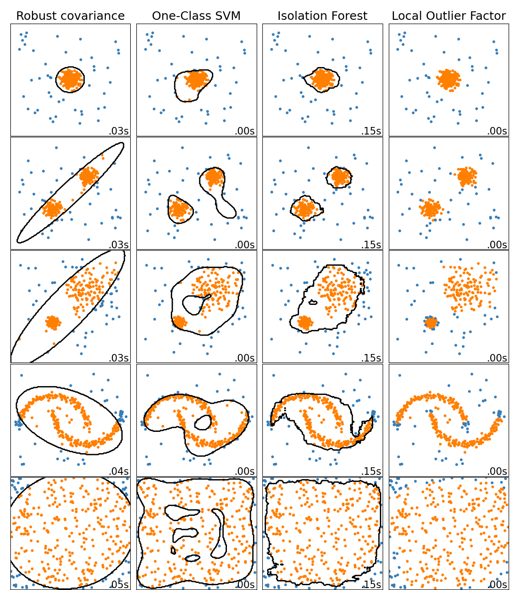
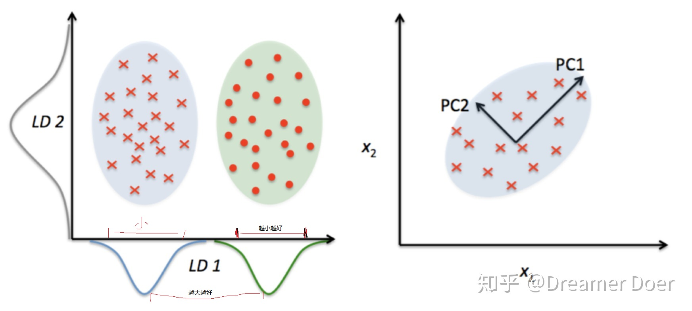
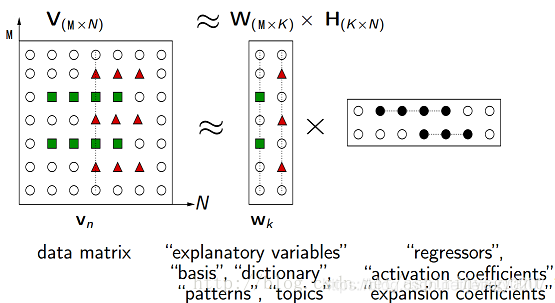

<!--toc-->
[TOC]
# 特征工程 - 数据预处理
> https://github.com/scikit-learn/scikit-learn/
> https://github.com/rasbt/mlxtend

特征是原始数据的数学表示。有很多方法可以将原始数据转换为数学测量值，这也是为什么特征最终看起来与许多事情相似。自然的，特征必须来自可用数据的类型。可能它们与模型相关联的事实也没那么明显；**一些模型更适合某些类型的特征，反之亦然**。正确的特征应该与手头的任务相关并且容易被模型摄取。**特征工程是指给定数据、模型和任务是制定最佳特征的过程**。

特征的数量也是很重要的。如果没有足够的信息特征，模型就无法完成最终的任务。如果存在太多的特征，或者如果它们大多数是无关紧要的，那么训练这个模型会更加的棘手并且代价更多。在训练过程中可能会出现一些错误影响模型的表现。

良好的特征使后续的建模步骤变得简单，并且所得到的模型能更容易实现所需的任务。糟糕的特征可能需要更复杂的模型才能达到相同的性能水平。

如果特征已经是数字数据也并不意味着不再需要特征工程。好的特征不仅代表数据的显著方面，而且符合模型的假设。


> 不包括《自动特征学习》

## 特征选择

特征选择技术会删除非有用的特征，以降低最终模型的复杂性。最终目标是快速计算的简约模型，预测准确性降低很小或不会降低。为了得到这样的模型，一些特征选择技术需要训练多个候选模型。换句话说，特征选择并不是减少训练时间，实际上有些技巧增加了整体训练时间，但是减少了模型评分时间。

粗略地说，特征选择技术分为三类。

- Filtering（过滤）: 预处理可以删除那些不太可能对模型有用的特征。例如，可以计算每个特征与响应变量之间的相关或相互信息，并筛除相关信息或相互信息低于阈值的特征。第3章讨论了文本特征的过滤技术的例子。过滤比下面的包装（wrapper）技术便宜得多，但是他们没有考虑到正在使用的模型。因此他们可能无法为模型选择正确的特征。最好先保守地进行预过滤，以免在进行模型训练步骤之前无意中消除有用的特征。

- Wrapper methods（包装方法）：这些技术是昂贵的，但它们允许您尝试特征子集，这意味着你不会意外删除自身无法提供信息但在组合使用时非常有用的特征。包装方法将模型视为提供特征子集质量分数的黑盒子。shi一个独立的方法迭代地改进子集。

- Embedded methods（嵌入式方法）：嵌入式方法执行特征选择作为模型训练过程的一部分。 例如，决策树固有地执行特征选择，因为它在每个训练步骤选择一个要在其上进行树分裂的特征。另一个例子是$L1$正则，它可以添加到任何线性模型的训练目标中。$L1$鼓励模型使用一些特征而不是许多特征。因此它也被称为模型的稀疏约束。嵌入式方法将特征选择作为模型训练过程的一部分。它们不如包装方法那么强大，但也远不如包装方法那么昂贵。与过滤相比，嵌入式方法会选择特定于模型的特征。从这个意义上讲，嵌入式方法在计算费用和结果质量之间取得平衡。


许多常见的数字特征工程技术：量化，缩放（又称规范化），对数变换（一种功率变换），交互特征以及处理大量交互特征所需的特征选择技术。
## 内核近似 Kernel Approximation
[sklearn.kernel_approximation](https://scikit-learn.org/stable/modules/kernel_approximation.html#kernel-approximation)

属于非线性变换，一般是升维，可以使海量数据进行非线性转换，从而可以使用线性方法进行训练，由于内核近似没有可解释性（无道理无经验的转换），所以建议将结果和使用精确的内核方法的结果进行比较。

## 非线性变换
### QuantileTransformer
使用百分位教转换特征，通过缩小边缘异常值和非异常值之间的距离来提供特征的非线性变换。映射到均匀分布output_distribution = "uniform"

> 也可以使用参数output_distribution = "normal"来将数据映射到标准正态分布。


### PowerTransformer
映射到高斯分布。在许多建模场景中，数据集中的特性是正常的。幂变换是一类参数的单调变换，其目的是将数据从任意分布映射到尽可能接近高斯分布，以稳定方差和最小化偏度。

PowerTransformer目前提供了两个这样的幂变换，Yeo-Johnson变换和Box-Cox变换，利用极大似然估计了稳定方差和最小偏度的最优参数。并且，box-Cox要求输入数据严格为正数据，而Yeo-Johnson支持正负数据。


### 生产多项式特征 PolynomialFeatures 
增加一些输入数据的非线性特征来增加模型的复杂度，最直接的办法是给数据添加多项式特征。

比如数据[2,3] ->degree=2时 `[2,3,2*2,2*3,3*3]`

> 参数degree ：多项式的维度 ；当使用多项的 Kernel functions 时 ，多项式特征被隐式地在核函数中被调用(比如， sklearn.svm.SVC ， sklearn.decomposition.KernelPCA)

## 离散值处理（一般是对类别特征进行编码）
分类变量的类别通常不是数字。例如，眼睛的颜色可以是“黑色”，“蓝色”，“棕色”等。因此，需要使用编码方法将这些非数字类别变为数字。

### LabelEncoder 标签编码
有些算法不支持文本特征，所以需要将标签转换为数字，Label encoding在某些情况下很有用，但是场景限制很多。再举一例：比如有[dog,cat,dog,mouse,cat]，我们把其转换为[1,2,1,3,2]。这里就产生了一个奇怪的现象：dog和mouse的平均值是cat。所以目前还没有发现标签编码的广泛使用。

> sklearn.preprocessing.LabelEncoder中解释：使用0到n_classes-1之间的值对目标标签进行编码。该转换器应用于编码目标值，即y，而不是输入X.
### LabelBinarizer
对标签进行二值化处理

### MultiLabelBinarizer 多分类标签

比如将['红色'],['绿色'],['红色','绿色'] 变成[1, 0],  [0, 1],  [1, 1]

### OrdinalEncoder 顺序编码
例如输入`X = [['Male', 1], ['Female', 3], ['Female', 2]]`，这里输入数据中含有两列，说明有两类特征，第一列取值范围为：`[ 'Female'，'Male']`，按照顺序编码为`[0,1]`，第二列取值范围为：`[1,2,3]`,编码结果为`[0,1,2]`。按照这个思路，`['Female', 3], ['Male', 1]`的顺序编码分别为`[0,2]和[1,0]`。

> 这样的整数特征表示一般并不能在scikit-learn的估计器中直接使用，因为这样的连续输入，估计器会认为类别之间是有序的，但实际却是无序的。

### OneHotEncoder 独热编码
该离散特征有多少取值，就用多少维来表示该特征。


- 优点：独热编码解决了分类器不好处理属性数据的问题，在一定程度上也起到了扩充特征的作用。它的值只有0和1，不同的类型存储在垂直的空间。
- 缺点：当类别的数量很多时，特征空间会变得非常大。在这种情况下，一般可以用PCA来减少维度。而且one hot encoding+PCA这种组合在实际中也非常有用。

独热编码用来解决类别型数据的离散值问题，将离散型特征进行one-hot编码的作用，是为了让**距离计算更合理**，但如果特征是离散的，并且不用one-hot编码就可以很合理的计算出距离，那么就没必要进行one-hot编码。 有些基于树的算法在处理变量时，并不是基于向量空间度量，数值只是个类别符号，即没有偏序关系，所以不用进行独热编码。  Tree Model不太需要one-hot编码： 对于决策树来说，one-hot的本质是增加树的深度。

> 否则如果特征是字符串，就需要先使用 sklearn.preprocessing.LabelEncoder 将离散特征值转换为数字。
> 比如训练数据只有3类(可以指定类别)，当预测数据出现第四类时就会有问题（可以设置处理或者忽略也可以指定类别）

#### 哑编码dummy
当OneHotEncoder(drop='first')时就是哑编码（哑变量 dummy variable）（一般无序多分类时可以使用）
> 总结：我们使用one-hot编码时，通常我们的模型不加bias项 或者 加上bias项然后使用正则化手段去约束参数；当我们使用哑变量编码时，通常我们的模型都会加bias项，因为不加bias项会导致固有属性的丢失。

> 选择建议：我感觉最好是选择正则化 + one-hot编码；哑变量编码也可以使用，不过最好选择前者。虽然哑变量可以去除one-hot编码的冗余信息，但是因为每个离散型特征各个取值的地位都是对等的，随意取舍未免来的太随意。

> https://www.cnblogs.com/lianyingteng/p/7792693.html

## 离散化 (Discretization) 或 量化(quantization) 或 装箱(binning))
将连续特征划分为离散特征值。其目的就是把具有连续属性的数据集变换成只有名义属性(nominal attributes)的数据集。

- 固定宽度装箱

对于固定宽度装箱, 每个 bin 都包含一个特定的数值范围。范围可以是定制设计或自动分割, 它们可以线性缩放或指数缩放。例如, 我们可以将一个人的年龄分组为十年: 0-9 岁归纳到bin 1, 10-19 年归纳到 bin 2 等。要从计数映射到 bin, 只需除以 bin 的宽度并取整部分。

- 分位数装箱
固定宽度装箱很容易计算。但是如果计数有很大的差距, 那么将会有许多空的垃圾箱没有数据。该问题可以通过基于数据分布的垃圾箱自适应定位来解决。这可以使用分发的分位数来完成。

分位数是将数据划分为相等部分的值。例如, 中位数将数据分成一半;一半的数据是较小的, 一半大于中位数。分位数把数据分成几个部分, 十分位数把数据划分成十份。

- 对数变换

对数函数是指数函数的逆。它定义为$\log _{a}\left({a}^{x}\right)=X$
其中 $a$ 为正常数, $x$ 可以是任何正数。由于$a^0=1$,我们有$\log _{{a}}(1)=0$。这意味着对数函数将小范围的数字 (0、1) 映射到负数的整个范围$(-\infty, 0)$。函数$\log _{{a}}(10)=0$ 将 $[1、10]$ 映射到 $[0、1]$、将$[10、100]$ 映射到 $[1、2]$ 等等。换言之, 对数函数压缩大数的范围, 并扩展小数的范围。越大的 $x$ , $log(x)$的增量越慢。


log已10为底，将x 【0,1000】压缩到【0,3】

> 可以使用自定义函数来处理 sklearn.preprocessing.FunctionTransformer(np.log1p)


### KBinsDiscretizer 使用k个等宽的bins把特征离散化
> 参数strategy：‘uniform’：等宽分箱；‘quantile’：等位分箱；‘kmeans’：按聚类分箱

### Binarizer 二值化
比如计数：很难说听一首歌20次的人一定喜欢听10次的人的两倍。
用户偏好的更健壮表示是使计数二元化和修剪所有大于1（或者自定义阈值）的计数为1。

```
>>> from sklearn.preprocessing import Binarizer
>>> X = [[ 1., -1.,  2.],
...      [ 2.,  0.,  0.],
...      [ 0.,  1., -1.]]
>>> transformer = Binarizer().fit(X)  # fit does nothing.
>>> transformer
Binarizer()
>>> transformer.transform(X)
array([[1., 0., 1.],
       [1., 0., 0.],
       [0., 1., 0.]])
```
Binarizer参数threshold ，默认为0.0
小于或等于此值的特征值将替换为0，大于被1替换。对于稀疏矩阵的操作，阈值不得小于0。
> 当k=2时，当bin边处于值阈值时，Binarizer类似于KBinsDiscreizer。

> Binarizer都可以用在密集向量和稀疏矩阵上

## 特征缩放或归一化
基于参数的模型或基于距离的模型，都是要进行特征的归一化。
基于树的方法是不需要进行特征的归一化，例如随机森林，bagging 和 boosting等。

**规范化包括归一化标准化正则化，是一个统称**

### 中心化
平均值为0，对标准差无要求
### 标准化（standardization）又叫做Z-score normalization（也是一种归一化）：
数据标准化是将数据按比例缩放，使其落入到一个小的区间内，标准化后的数据可正可负，对不同特征维度的伸缩变换的目的是使其不同度量之间的特征具有可比性，同时**不改变原始数据的分布**。

标准化后会使每个特征中的数值平均变为0、标准差变为1

### 归一化（normalization）：
 1.把数据变为（0，1）之间的小数。主要是为了方便数据处理，因为将数据映射到0～1范围之内，可以使处理过程更加便捷、快速。

2.把有量纲表达式变换为无量纲表达式，成为纯量。经过归一化处理的数据，处于同一数量级，可以消除指标之间的量纲和量纲单位的影响，提高不同数据指标之间的可比性。

把数值放缩到0到1的小区间中（归到数字信号处理范畴之内），一般方法是最小最大规范的方法：min-max normalization

min-max normalization是线性归一化，还有非线性归一化，通过一些数学函数，将原始值进行映射。该方法包括log、指数、反正切等。需要根据数据分布的情况，决定非线性函数的曲线。

应用：

1.无量纲化
例如房子数量和收入，从业务层知道这两者的重要性一样，所以把它们全部归一化，这是从业务层面上作的处理。

2.避免数值问题
不同的数据在不同列数据的数量级相差过大的话，计算起来大数的变化会掩盖掉小数的变化。

3.一些模型求解的需要
例如梯度下降法，如果不归一化，当学习率较大时，求解过程会呈之字形下降。学习率较小，则会产生直角形路线，不管怎么样，都不会是好路线（路线解释看西面归一化和标准化的对比）。解释神经网络梯度下降的文章。

4.时间序列
进行log分析时，会将原本绝对化的时间序列归一化到某个基准时刻，形成相对时间序列，方便排查。

5.收敛速度
加快求解过程中参数的收敛速度。

特点：

对不同特征维度进行伸缩变换
改变原始数据的分布，使得各个特征维度对目标函数的影响权重归于一致（使得扁平分布的数据伸缩变换成类圆形）
对目标函数的影响体现在数值上
把有量纲表达式变为无量纲表达式
归一化可以消除量纲对最终结果的影响，使不同变量具有可比性。比如两个人体重差10KG，身高差0.02M，在衡量两个人的差别时体重的差距会把身高的差距完全掩盖，归一化之后就不会有这样的问题。

好处：
提高迭代求解的收敛速度
提高迭代求解的精度

缺点：
最大值与最小值非常容易受异常点影响
鲁棒性较差，只适合传统精确小数据场景


preprocessing.Normalizer

### MinMaxScaler (min-max归一化)
> 等比例缩放，可以指定范围，不一定是[0,1];也有一个严重的问题，当矩阵是稀疏矩阵时，会把以前为0的特征变成不是0
- 缩放压缩（或拉伸）所有特征值到 [0,1] 的范围内
$$
\widetilde{x}=\frac{x-\min (x)}{\max (x)-\min (x)}
$$


- 线性放缩到[-1,1]
$$
\widetilde{x}=\frac{2x-\max (x)-\min (x)}{\max (x)-\min (x)}
$$

### MaxAbsScaler
缩放到-1和1之间，为0的数据还是0，负数还是负数，正数还是正数，处理稀疏矩阵比MinMaxScaler好

### RobustScaler
如果你的数据包含许多异常值（离群值），使用均值和方差缩放可能并不是一个很好的选择。这种情况下，你可以使用 robust_scale 以及 RobustScaler 作为替代品。它们对你的数据的中心和范围使用更有鲁棒性的估计。

该缩放器删除中位数，并根据分位数范围（默认值为IQR：四分位间距）缩放数据。

其中v<sub>i</sub>表示样本的某个值。median是样本的中位数，IQR是样本的 四分位距

### 标准化 StandardScaler（方差缩放）(z-score归一化)
缩放到均值为0，方差为1

特征标准化的定义为：

$$
\widetilde{x}=\frac{x-\operatorname{mean}(x)}{\operatorname{var}(x)}
$$

减去特征 (所有数据点) 的平均值并除以方差。因此, 它也可以称为方差缩放。缩放后的特征的平均值为0, 方差为1。如果原始特征具有高斯分布, 则缩放特征为标准高斯。



### Normalizer 归一化

> Normalizer都既可以用在密集数组也可以用在稀疏矩阵（scipy.sparse)中对于稀疏的输入数据，它会被转变成维亚索的稀疏行表征

对每个数据点进行缩放，使得特征向量的欧式长度等于1。

归一化是缩放单个样本以具有单位范数的过程，这里的”范数”，可以使用L1或L2范数。
Normalizer的作用范围是每一行，使每一个行向量的范数变换为一个单位范数

> preprocessing.Normalizer(norm=’l2’, copy=True) 其中，norm : ‘l1’, ‘l2’, or ‘max’, optional (‘l2’ by default)




#### L2 normalization
这项技术通过所谓的 L2 范数 (也称为欧几里德范数) 正常化 (划分) 原始特征值。

$$
\widetilde{x}=\frac{x}{\|x\|_{2}}
$$

L2范数度量向量在坐标空间中的长度。这个定义可以从众所周知的勾股定理中得到，给出三角形两边的长度，可以得到斜边长度。

$$
\|x\|_{2}=\sqrt{x_{1}^{2}+x_{2}^{2}+\ldots+x_{m}^{2}}
$$

L2 范数将求特征的各数据点的平方和, 然后取平方根。L2 规范化后, 该特征列具有范数1。它也可以称为 L2 缩放。(不严谨的说, 缩放意味着和常量相乘, 而规范化可能涉及许多操作。）下图说明了 L2 规范化。


### 不要中心化稀疏数据
最小最大缩放和标准化都从原始特征值中减去一个数量。对于最小最大缩放, 移动量是当前特征的所有值中最小的。对于标准化, 移动的量是平均值。如果移动量不是零, 则这两种转换可以将稀疏特征（大部分值为零）的向量转换为一个稠密的向量。这反过来会给分类器带来巨大的计算负担, 取决于它是如何实现的。词袋是一种稀疏表示, 大多数分类库都对稀疏输入进行优化。如果现在的表示形式包含了文档中没有出现的每个单词, 那就太可怕了。请谨慎对稀疏特征执行最小最大缩放和标准化操作。

> 可以使用Normalizer或者MaxAbsScaler

### 核矩阵的中心化 KernelCenterer
KernelCenterer 类构造过程中不需要设定任何参数，只在 fit 过程中需要传入核矩阵，之后进行转换。实质上，KernelCenterer 中心化数据的过程就是将数据集转换为零均值的归一化过程。

## 离群值检测与处理

https://scikit-learn.org/stable/modules/outlier_detection.html

[比较](https://scikit-learn.org/stable/auto_examples/miscellaneous/plot_anomaly_comparison.html#sphx-glr-auto-examples-miscellaneous-plot-anomaly-comparison-py)


离群值 (outliers)
是指在一份数据中,与其他观察值具有明显不同特征的那些观察值。
然而，并没有一个明确的准则来判断哪些观察值属于“离群值”。这主要取决于多种因素。


大多数的参数统计数值，如均值、标准差、相关系数 等，以及基于这些参数的统计分析，均对离群值高度敏感。因此，离群值的存在会对数据分析造成极大影响。

[数据离群值的检验及处理方法讨论](http://www.dxhx.pku.edu.cn/article/2018/1000-8438/20180812.shtml)

离群值的处理方法（在实际操作中应该结合这些特点进行选择。）:
- [对数转换](#离散化-discretization-或-量化quantization-或-装箱binning)
对数转换后数据的分布会变得更加集中。（**对数转换对某变量的全部观察值均进行了处理，也就是对所有值进行了处理，其它方法只对离群值处理**）
- 缩尾
将超出变量特定百分位范围的数值替换为其特定百分位数值的方法。
比如：指定分别在第 2.5 百分位和第 97.5 百分位进行缩尾。即，将 wage 变量中小于其 2.5 百分位的数值替换为其 2.5 百分位数值；将变量中大于其 97.5 百分位的数值替换为其 97.5 百分位数值。（注：这一过程是双侧缩尾，也有单侧缩尾-左/右侧缩尾。）
> 缩尾后，对应于之前变量的2.5和97.5百分位上的数值变多了，这是由原来超过该范围的“离群值”转换而来的。
- 截尾
将超出变量特定百分位范围的数值予以删除的方法。（**截尾处理会减少数据中的样本量，其他方法则保留了原有数据的样本量。**）
- 插值
应用原有数据信息对离群值赋予一个相对合理的新值的方法。
对数据进行赋值的方法有很多。比如，随机赋值、最近点赋值、均值赋值、回归赋值等。插值法是对数据赋值的一种方法，一般指的是线性插值（ linear interpolation ）。
**插值法利用了原有数据中的相关性信息，其他方法则没有利用这些信息**

### RobustScaler-截尾
[RobustScaler](#robustscaler)

### svm.OneClassSVM  检测
无监督的离群值检测。
### neighbors.LocalOutlierFactor 检测
无监督离群检测 
### covariance.EllipticEnvelope 检测
用于检测高斯分布数据集中的异常值的对象。
### ensemble.IsolationForest 检测
在高维数据集中执行异常检测的一种有效方法是使用随机森林。

### linear_model.HuberRegressor 模型
对异常值具有鲁棒性的线性回归模型。

# 特征工程 - 缺失值处理

## 直接使用含有缺失值的特征
有一些模型，如随机森林，自身能够处理数据缺失的情况，在这种情况下不需要对缺失数据做任何的处理，这种做法的缺点是在模型的选择上有局限。

## 删除含有缺失值的特征
最简单最直接的方法，很多时候也是最有效的方法，这种做法的缺点是可能会导致信息丢失。

## 缺失值补全

用规则或模型将缺失数据补全，这种做法的缺点是可能会引入噪声。
- 平均数、中位数、众数、最大值、最小值、固定值、插值等等（均值插补、同类均值插补、建模预测、高维映射、多重插补、极大似然估计、压缩感知和矩阵补全。）当然也可以手工补全~
- 建立一个模型来“预测”缺失的数据。（KNN, Matrix completion等方法）
- 引入虚拟变量(dummy variable)来表征是否有缺失，是否有补全。

### SimpleImputer
可以使用mean均值，median中位数，most_frequent众数，constant固定值

> sklearn.impute

### KNNImputer
使用k最近邻来完成缺失值的插补。

### IterativeImputer
建模预测(estimator参数默认BayesianRidge()，estimator的predict方法必须支持return_std 参数)

### MissingIndicator
标记缺失值，用来判断是否有缺失值，返回bool矩阵

# 特征工程 - 降维

> [参考](https://blog.csdn.net/smart_shi/article/details/85646967)
scikit-learn中降维在sklearn.decomposition包中，特征提取在sklearn.feature_extraction包中，特征选择在sklearn.feature_selection包中

- 为什么降维

（1）数据的多重共线性（相关系数和线性组合）：特征属性之间存在着相互关联关系。多重共线性会导致解的空间不稳定， 从而导致模型的泛化能力弱；
（2）高纬空间样本具有稀疏性，导致模型比较难找到数据特征；
（3）过多的变量会妨碍模型查找规律；
（4） 仅仅考虑单个变量对于目标属性的影响可能忽略变量之间的潜在关系。

- 目的

减少特征属性的个数，确保特征属性之间的相互独立性，最终目的就是解决过拟合现象。

- 特征降维的方法

特征降维分为两种：特征选择和特征抽取

1、特征选择 （Feature Selection）
（1）本质： 选择有效的特征子集，即去掉不相关或冗余的特征。目的是减少特征个数，提高模型精度，减少运行时间。特征选择后留下的特征值的数值在选择前后没有变化。
（2）特征选择依据：
特征是否发散： 如果一个特征不发散，例如方差接近于0，也就是说样本在这个特征上基本上没有差异，这个特征对于样本的区分并没有什么用；
特征与目标的相关性：与目标相关性高的特征，应当优选选择。
（3）特征选择方法简介：
（过滤法）Filter：按照发散性或者相关性对各个特征进行评分，设定阈值或者待选择阈值的个数，选择特征。
（包装法）Wrapper：根据目标函数（通常是预测效果评分），每次选择若干特征，或者排除若干特征。
（嵌入法）Embedded：先使用机器学习的算法和模型进行训练，得到各个特征的权值系数，根据系数从大到小选择特征。

2、特征抽取（Feature Extraction）
（1）本质： 特征抽取是指改变原有的特征空间，并将其映射到一个新的特征空间。
（2）特征抽取算法
主成分分析（PCA）： 通过线性变换将原始数据变换为一组各维度线性无关的表示，本质就是找出数据里最主要的方面，用数据里最主要的方面来代替原始数据。（sklearn.decomposition）

线性判别式分析（LDA）：一种监督学习的降维方法，它的数据集的每个样本有类别输出。 其本质是将数据在低维度上进行投影，投影后希望每一种类别的数据的投影点 尽可能的接近，不同类别的数据的类别中心之间的距离尽可能的大。（sklearn.discriminant_analysis）

> Pearson相关系数,皮尔森相关系数反映变量之间相关关系密切程度的统计指标，结果取值的区间为[-1,1]。
> (1)当r>0时，表示两变量正相关，r<0时，两变量为负相关
> (2)当|r|=1时，表示两变量为完全相关，当r=0时，表示两变量间无相关关系
> (3)当0<|r|<1时，表示两变量存在一定程度的相关。且|r|越接近1，两变量间线性关系越密切；|r|越接近于0，表示两变量的线性相关越弱
> 一般可按三级划分：|r|<0.4为低度相关；0.4≤|r|<0.7为显著性相关；0.7≤|r|<1为高度线性相关
> 相关系数法缺陷：pearson相关系数的一个明显的缺陷是只对线性关系敏感，对于非线性的，可以采用接下来介绍的互信息。

> 互信息和最大信息系数,[互信息是用于评价离散特征对离散目标变量的相关性](https://www.cnblogs.com/gatherstars/p/6004075.html)。


## 特征工程 - 特征提取
feature_extraction
特征提取：将原特征转换为一组具有明显物理意义或统计意义或核的新特征。
### DictVectorizer(字典特征向量化)
将字典类型数据结构的样本，抽取特征，转化成向量形式

### FeatureHasher(特征哈希化)
将不同数据类型通过hash算法转换成特征向量。如String、bool、int，dic等等。
Features hashing是一个高速的，低存储的向量化的类。是DictVectorizer和CountVectorizer的低内存替代品，适用于大规模（在线）学习以及内存紧张的情况，例如：
在嵌入式设备上运行预测代码时。
> 可以升维和降维（n_features指定维度），哈希函数可能会导致本来不相关的特征之间发生冲突

### text.CountVectorizer
将文本中的词语转换为词频矩阵
### text.HashingVectorizer
普通的CountVectorizer存在但词库很大时，占用大内存，因此，使用hash技巧，并用稀疏矩阵存储编译后的矩阵


> 参数：如果norm ='l1'，则可能归一化为标记频率；如果norm ='l2'，则可能会投影在欧几里得单位球上。（不能不做归一化）

实现的伪代码为：
```
 function hashing_vectorizer(features : array of string, N : integer):
     x := new vector[N]
     for f in features:
         h := hash(f)
         x[h mod N] += 1
     return x
```
> 这里伪代码没有考虑到hash冲突的情况，实际实现会更加复杂。

### text.TfidfVectorizer 词频-逆向文件频率
等效于CountVectorizer，后跟TfidfTransformer。

TF-IDF（term frequency–inverse document frequency，词频-逆向文件频率）是一种用于信息检索（information retrieval）与文本挖掘（text mining）的常用加权技术。

TF-IDF是一种统计方法，用以评估一字词对于一个文件集或一个语料库中的其中一份文件的重要程度。字词的重要性随着它在文件中出现的次数成正比增加，但同时会随着它在语料库中出现的频率成反比下降。

TF-IDF的主要思想是：如果某个单词在一篇文章中出现的频率TF高，并且在其他文章中很少出现，则认为此词或者短语具有很好的类别区分能力，适合用来分类。

大白话：一个词在一个文章中出现的越多，那么这个词就越重要，但是在整个文章集合(数据集)出现的越多，那么重要程度会下降

- TF是词频(Term Frequency)
词频（TF）表示词条（关键字）在文本中出现的频率。**这个数字通常会被归一化(一般是词频除以文章总词数), 以防止它偏向长的文件。**


- IDF是逆向文件频率(Inverse Document Frequency)
逆向文件频率 (IDF) ：某一特定词语的IDF，可以由总文件数目除以包含该词语的文件的数目，再将得到的商取对数得到。如果包含词条t的文档越少, IDF越大，则说明词条具有很好的类别区分能力。


- TF-IDF实际上是：TF * IDF
### text.TfidfTransformer
将计数矩阵转换为标准化的tf或tf-idf表示形式

```
>>> from sklearn.feature_extraction.text import TfidfTransformer
>>> from sklearn.feature_extraction.text import CountVectorizer
>>> from sklearn.pipeline import Pipeline
>>> import numpy as np
>>> corpus = ['this is the first document',
...           'this document is the second document',
...           'and this is the third one',
...           'is this the first document']
>>> vocabulary = ['this', 'document', 'first', 'is', 'second', 'the',
...               'and', 'one']
>>> pipe = Pipeline([('count', CountVectorizer(vocabulary=vocabulary)),
...                  ('tfid', TfidfTransformer())]).fit(corpus)
>>> pipe['count'].transform(corpus).toarray()
array([[1, 1, 1, 1, 0, 1, 0, 0],
       [1, 2, 0, 1, 1, 1, 0, 0],
       [1, 0, 0, 1, 0, 1, 1, 1],
       [1, 1, 1, 1, 0, 1, 0, 0]])
>>> pipe['tfid'].idf_
array([1.        , 1.22314355, 1.51082562, 1.        , 1.91629073,
       1.        , 1.91629073, 1.91629073])
>>> pipe.transform(corpus).shape
(4, 8)
```

### image.PatchExtractor
- image.extract_patches_2d函数从存储为二维数组的灰度图像或三维数组的彩色图像中提取图像块(patches)。彩色图像的颜色信息在第三个维度中存放。如果要从所有的图像块(patches)中重建图像，请使用 image.reconstruct_from_patches_2d 函数。

PatchExtractor 类的工作方式与 extract_patches_2d 函数相同，只是它支持多幅图像作为输入。它被实现为一个估计器(estimator)，因此它可以在管道(pipelines)中使用。

> https://scikit-learn.org/stable/auto_examples/decomposition/plot_image_denoising.html

### image.grid_to_graph 和 image.img_to_graph
计算的是相邻像素点这之间的差（梯度）

scikit-learn中有几个估计器(estimators)可以使用特征或样本之间的连接信息(connectivity information)。例如Ward clustering ( 层次聚类(Hierarchical clustering) )可以只把相邻像素聚集在一起，从而形成连续的斑块，这些估计器使用一个连接性矩阵，给出哪些样本是连接着的。 函数 img_to_graph 从2D或3D图像返回这样的矩阵。同样， grid_to_graph 函数为给定形状的图像构建连接矩阵。 这些矩阵可用于在使用连接信息的估计器中强加连接，例如Ward clustering ( 层次聚类(Hierarchical clustering) )，而且还要构建预计算的内核或相似矩阵。

> https://scikit-learn.org/stable/modules/feature_extraction.html#connectivity-graph-of-an-image

## 特征工程 - 特征选择
feature_selection
特征选择：从特征集合中挑选一组最具统计意义的特征子集。


特征选择方法主要分为三种：

1. Filter：过滤式；按权重排序，不涉及到学习器，排序规则一般有方差法、相关系数法、互信息法、卡方检验法、缺失值比例法（注意受范围影响的方法需先归一化）<sup>[zhihu 机器学习中，有哪些特征选择的工程方法？](https://www.zhihu.com/question/28641663)</sup>。

    - 方差法：计算各个特征的方差，然后根据阈值，选择方差大于阈值的特征。可使用sklearn.feature_selection库的VarianceThreshold类来实现。
       
    - 缺失值比例法：计算各个特征的缺失值比例，将缺失值比例较大的特征过滤掉。
       
    - 相关系数法：计算特征与输出值的相关系数以及相关系数的 P值（常见的有：皮尔森相关系数用于数值特征的线性检验，秩相关系数用于类别特征的单调性检验）。

    - 互信息法：计算定性特征与输出值的相关性（运用了信息熵理论），决策树学习中的信息增益等价于训练数据集中类与特征的互信息。
　　 
    - 卡方检验法：对于每个特征与输出值，先假设独立，再观察实际值与理论值的偏差来确定假设的正确性，即是否相关。
> 过滤式特征选择的评价标准分为四种，即距离度量、信息度量、关联度度量以及一致性度量。
> python包：SelectKBest指定过滤个数、SelectPercentile指定过滤百分比。

2. Embedded：嵌入式；确定模型过程中自动完成重要特征挑选，基于惩罚项如岭回归(L2正则)、LASSO(L1正则)，基于树模型如GBDT、决策树，深度学习<sup>[cnblog 特征工程之特征选择](https://www.cnblogs.com/pinard/p/9032759.html)</sup>。

> 集成法，先使用某些机器学习的算法和模型进行训练，得到各个特征的权值系数，根据系数从大到小选择特征。类似于Filter方法，但是是通过训练来确定特征的优劣。

>在嵌入式特征选择中，特征选择算法本身作为组成部分嵌入到学习算法里。最典型的即决策树算法，如ID3、C4.5以及CART算法等，决策树算法在树增长过程的每个递归步都必须选择一个特征，将样本集划分成较小的子集，选择特征的依据通常是划分后子节点的纯度，划分后子节点越纯，则说明划分效果越好，可见决策树生成的过程也就是特征选择的过程。

>基于惩罚项的特征选择法：
>L1范数正则化通过向成本函数中添加L1范数，使得学习得到的结果满足稀疏化(sparsity)，从而方便人类提取特征。
实际上，L1惩罚项降维的原理在于保留多个对目标值具有同等相关性的特征中的一个，所以没选到的特征不代表不重要。故，可结合L2惩罚项来优化。
具体操作为：若一个特征在L1中的权值为1，选择在L2中权值差别不大且在L1中权值为0的特征构成同类集合，将这一集合中的特征平分L1中的权值，故需要构建一个新的逻辑回归模型。
>python包：feature_selection.SelectFromModel选出权重不为0的特征。

3. Wrapper：封装式；用学习器的性能评判不同特征子集的效果，特征子集生成方式：完全搜索（前向&后向）、启发式搜索、随机搜索<sup>[cnblog 特征工程之特征选择](https://www.cnblogs.com/pinard/p/9032759.html)</sup>。

**需要根据模型学习来筛选**

> 包装法，根据目标函数（通常是预测效果评分），每次选择若干特征，或者排除若干特征。

> 封装式特征选择是利用学习算法的性能来评价特征子集的优劣。因此，对于一个待评价的特征子集，Wrapper方法需要训练一个分类器，根据分类器的性能对该特征子集进行评价。Wrapper方法中用以评价特征的学习算法是多种多样的，例如决策树、神经网络、贝叶斯分类器、近邻法以及支持向量机等等。

> python包：RFE 


### VarianceThreshold 方差阈值 - （过滤法）Filter
删除所有低方差特征的特征选择器。
默认情况下，它将删除所有零方差特征，即在所有样本中具有相同值的特征。
> 注意：是方差不是百分比，[参考](https://scikit-learn.org/stable/modules/feature_selection.html#removing-features-with-low-variance)

> 当特征值都是离散型变量的时候这种方法才能用，如果是连续型变量，就需要将连续变量离散化之后才能用。

### GenericUnivariateSelect 通用的单变量特征选择 - （过滤法）Filter

单变量特征选择的原理是分别单独的计算每个变量的某个统计指标，根据该指标来判断哪些指标重要，剔除那些不重要的指标。（选择特征跟Y有关的特征；单变量的意思就是对某一特征来统计和分析）

GenericUnivariateSelect可以设置不同的策略来进行单变量特征选择。同时不同的选择策略也能够使用超参数寻优，从而让我们找到最佳的单变量特征选择策略。
GenericUnivariateSelect返回一个单变量的f_score(F检验的值)或p-values(P值，假设检验中的一个标准，P-value用来和显著性水平作比较)，注意SelectKBest 和 SelectPercentile只有得分，没有p-value。

**对于分类问题(y离散)，可采用：f_classif(F-检验), mutual_info_classif(估计离散目标变量的互信息),chi2(卡方检验)**

**对于回归问题(y连续)，可采用：f_regression(F-检验), mutual_info_regression(估计一个连续目标变量的互信息)**

**如果是稀疏数据可以用chi2，mutual_info_classif，mutual_info_regression来保持其稀疏性**

> F检验（F-test），最常用的别名叫做联合假设检验（英语：joint hypotheses test），此外也称方差比率检验、方差齐性检验。它是一种在零假设（null hypothesis, H0）之下，统计值服从F-分布的检验。

> GenericUnivariateSelect(chi2, mode='k_best')
> mode参数{‘percentile’, ‘k_best’, ‘fpr’, ‘fdr’, ‘fwe’}, default=’percentile’

**数据需要X和Y**

#### SelectPercentile
根据最高分数的百分位数选择特征。只保留用户指定前百分之多少的特征(默认百分之10)(取top k%)

> 分数的计算根据参数指定，如：chi2

#### SelectKBest
只保留k个最高得分的特征(取top k)

#### SelectFpr
假正率(false positive rate)   FPR
#### SelectFdr
错误发现率(false discovery rate) 
#### SelectFwe
族系误差率

### 递归特征消除 - 基于机器学习模型 Wrapper
**需要根据模型学习来筛选，也就是包装一个模型来学习每个特征对Y的权重**
递归消除特征法使用一个基模型来进行多轮训练，每轮训练后，移除若干权值系数的特征，再基于新的特征集进行下一轮训练。

sklearn官方解释：对特征含有权重的预测模型(例如，线性模型对应参数coefficients)，RFE通过递归减少考察的特征集规模来选择特征。首先，预测模型在原始特征上训练，每个特征指定一个权重。之后，那些拥有最小绝对值权重的特征被踢出特征集。如此往复递归，直至剩余的特征数量达到所需的特征数量。

RFECV（带交叉验证的递归特征移除） 通过交叉验证的方式执行RFE，以此来选择最佳数量的特征：对于一个数量为d的feature的集合，他的所有的子集的个数是2的d次方减1(包含空集)。指定一个外部的学习算法，比如SVM之类的。通过该算法计算所有子集的validation error。选择error最小的那个子集作为所挑选的特征。

> Estimator通过coef_属性或feature_importances_属性提供有关功能重要性的信息的方法。

#### feature_selection.RFE
Recursive feature elimination

该API接口是利用某个可以为特征赋权的外部估计器(Estimator),递归地删除特征,考查数目越来越少的特征集(如线性模型里的特征系数).
(1)首先,利用估计器对初始特征集训练,通过属性coef_和feature_importances_获得特征重要性;
(2)然后,从当前特征集中删除最不重要的若干特征;
(3)递归地重复以上操作,直至特征数目减少的预期结果

> 参数estimator为基模型
> 参数n_features_to_select为选择的特征个数

```
from sklearn.linear_model import LinearRegression

from sklearn.feature_selection import RFE

from sklearn import datasets

lreg = LinearRegression()

rfe = RFE(lreg, 10)

rfe = rfe.fit_transform(df, train.Item_Outlet_Sales)
```
我们需要指定算法和要选择的特征数量，然后返回反向特征消除输出的变量列表。此外，rfe.ranking_可以用来检查变量排名。

#### feature_selection.RFECV
Recursive feature elimination with cross-validation

### SelectFromModel - 基于机器学习模型 Embedded

**没有predict和score方法，是一个transformer，需要的模型（estimator）需要先对数据进行训练（fit），然后根据训练后的estimator的coef_ 或 feature_importances_ 属性进行筛选高于阈值的特征，所以是把一个模型嵌入到转换器中**

SelectFromModel 作为meta-transformer(元转换器)，能够用于拟合后任何拥有coef_或feature_importances_ 属性的预测模型。 如果特征对应的coef_ 或 feature_importances_ 值低于设定的阈值threshold，那么这些特征将被移除。除了手动设置阈值，也可通过字符串参数调用内置的启发式算法(heuristics)来设置阈值，包括：平均值(“mean”), 中位数(“median”)以及他们与浮点数的乘积，如”0.1*mean”。

#### 基于L1的特征选择 (L1-based feature selection)
使用L1范数作为惩罚项的线性模型(Linear models)会得到稀疏解：大部分特征对应的系数为0。当你希望减少特征的维度以用于其它分类器时，可以通过 feature_selection.SelectFromModel 来选择不为0的系数。**特别指出，常用于此目的的稀疏预测模型有 linear_model.Lasso（回归）， linear_model.LogisticRegression 和 svm.LinearSVC（分类）**:
https://scikit-learn.org/stable/modules/feature_selection.html#l1-based-feature-selection

#### 基于树的特征选择 (Tree-based feature selection)
基于树的预测模型（见 sklearn.tree 模块，森林见 sklearn.ensemble 模块）能够用来计算特征的重要程度，因此能用来去除不相关的特征（结合 sklearn.feature_selection.SelectFromModel）:

##### 随机森林（Random Forest）
ensemble.RandomForestClassifier
ensemble.RandomForestRegressor

feature_importances_ 属性返回重要特征，可以从中挑选

### SequentialFeatureSelector - 基于机器学习模型 Wrapper
顺序特征选择器（SequentialFeatureSelector (SFS)）是一种基于贪心机制的特征选择方法

循序特征选择。

循序向前特征选择：Sequential Forward Selection，SFS
循序向后特征选择：Sequential Backword Selection，SBS

> direction参数{‘forward’, ‘backward’}, default=’forward’

如果我们有10个特征并要求选择7个特征，则前向选择将需要执行7次迭代，而后向选择仅需要执行3次迭代。
SFS与RFE和SelectFromModel的不同之处在于，SFS不需要基础模型公开coef_或feature_importances_属性。

> 在mlxtend.feature_selection中还有 ExhaustiveFeatureSelector 穷举特征选择（Exhaustive feature selection），即封装器中搜索算法是将所有特征组合都实现一遍，然后通过比较各种特征组合后的模型表现，从中选择出最佳的特征子集

## 特征工程 - 降维
? 特征提取（投影or转换）

- 线性方法<sup>[csdn 数据降维方法小结](https://blog.csdn.net/yujianmin1990/article/details/48223001)</sup>：
    - PCA：主成分分析；理论：通过正交变换将原始的 n 维数据集变换到一个新的被称做主成分的数据集中，变换后的结果中第一个主成分具有最大的方差值；【特点：无监督，尽量少维度保留尽量多原始信息（均方误差最小），期望投影维度上方差最大，不考虑类别，去相关性，零均值化，丧失可解释性】
    - FA：因子分析
    - ICA：独立成分分析；将原特征转化为相互独立的分量的线性组合；PCA一般作为ICA的预处理步骤<sup>[zhihu](https://www.zhihu.com/search?type=content&q=PCA%20ICA)</sup>。
    - LDA：线性判别分析，有监督，尽可能容易被区分（高内聚、低耦合）<sup>[cnblog 机器学习中的数学(4)-线性判别分析（LDA）, 主成分分析(PCA)](https://www.cnblogs.com/LeftNotEasy/archive/2011/01/08/lda-and-pca-machine-learning.html)</sup>。
    - SVD：奇异值分解，可用于PCA、推荐、潜在语义索引LSI，可并行，可解释性不强
- 非线性方法：
    - Multi-dimensional Scaling (MDS)多维缩放（流行学习）
    - LLE（Locally Linear Embedding）：局部线性嵌入，非线性降维（基于图），保持原有流行结构（流行学习）
    - Isomap等度量映射（流行学习）
    - Spectral embedding谱嵌入（流行学习）
    - t-SNE：t分布随机临近嵌入，将欧几里得距离转为条件概率表达点与点之间的相似度<sup>[datakit t-SNE完整笔记](http://www.datakit.cn/blog/2017/02/05/t_sne_full.html)</sup>。（流行学习）
    - LE：拉普拉斯特征映射，非线性（基于图），相互有联系的点尽可能靠近
    - AE：自动编码器
    - 聚类

[降维技术](https://zhuanlan.zhihu.com/p/43225794)：
1. 缺失值比率（Missing Value Ratio）
如果数据集的缺失值太多，我们可以用这种方法减少变量数。
2. 低方差滤波（Low Variance Filter）
某列的数值基本一致，这个方法可以从数据集中识别和删除常量变量，方差小的变量对目标变量影响不大，所以可以放心删去。
3. 高相关滤波（High Correlation filter）
具有高相关性的一对变量会增加数据集中的多重共线性，所以用这种方法删去其中一个是有必要的。
4. 随机森林（Random Forest）
model.feature_importances_ 据特征的重要性，这是最常用的降维方法之一，它会明确算出数据集中每个特征的重要性。
5. 反向特征消除（Backward Feature Elimination）
6. 前向特征选择（Forward Feature Selection）
5和6这两种方法耗时较久，计算成本也都很高，所以只适用于输入变量较少的数据集。
7. 因子分析（Factor Analysis）
这种方法适合数据集中存在高度相关的变量集的情况。
8. 主成分分析（PCA）
这是处理线性数据最广泛使用的技术之一。
9. 独立分量分析（ICA）
我们可以用ICA将数据转换为独立的分量，使用更少的分量来描述数据。
10. IOSMAP
适合非线性数据处理。
11. t-SNE
也适合非线性数据处理，相较上一种方法，这种方法的可视化更直接。
12. UMAP
适用于高维数据，与t-SNE相比，这种方法速度更快。

### Manifold learning流行学习（非线性降维）-sklearn.manifold

[浅谈流形学习](https://blog.pluskid.org/?p=533)

#### sklearn.manifold
Multidimensional scaling
Isomap Embedding
Locally Linear Embedding
Spectral embedding
t-distributed Stochastic Neighbor Embedding

### Linear Discriminant Analysis,LDA
> Linear Discriminant Analysis,LDA  discriminant_analysis.**LinearDiscriminantAnalysis可以直接用来分类，transform用来获取降维后的数据**

> Quadratic Discriminant Analysis,QDA discriminant_analysis.QuadraticDiscriminantAnalysis不具有LDA和PCA的降维功能,只能用来做分类预测

LDA将数据在低维度上进行投影，投影后希望每一种类别数据的投影点尽可能的接近，而不同类别的数据的类别中心之间的距离尽可能的大。

LDA是一种监督学习的降维技术,PCA是无监督降维技术
LDA缺点有：
1）LDA不适合对非高斯分布样本进行降维，PCA也有这个问题。
2）LDA降维最多降到类别数k-1的维数，如果我们降维的维度大于k-1，则不能使用LDA。当然目前有一些LDA的进化版算法可以绕过这个问题。
3）LDA在样本分类信息依赖方差而不是均值的时候，降维效果不好。
4）LDA可能过度拟合数据。


> PCA 投影原则是保留高维向量（正交化后）方差大的信息，舍去方差小维度上的信息。如图上PC1 方向上的方差更大、数据更加分散，PC2方向上的方差更小、数据更集中，故投影到PC1方向上更合适。原因是投影会损失数据中的信息，方差大的方向包含差异化信息更多，用于分类问题更加准确。PCA并不需要类别标签。

> LDA 试图找到一个特征子空间（特征的线性组合）以最大划分类别空间，LDA使用类别标签作为分类依据，LD2试图采用x2的线性组合划分上图的蓝色和绿色两类并不合适（同一类投影距离大，不同类几乎重叠了-也就是小）。LD1就很合适，不同类间距大，同一类投影距离小。

### Principal Component Analysis,PCA

PCA的主要思想是将n维特征映射到k维上，这k维是全新的**正交特征**也被称为主成分，是在原有n维特征的基础上重新构造出来的k维特征。其中，第一个新坐标轴选择是原始数据中方差最大的方向，第二个新坐标轴选取是与第一个坐标轴正交的平面中使得方差最大的，第三个轴是与第1,2个轴正交的平面中方差最大的。依次类推，可以得到n个这样的坐标轴。通过这种方式获得的新的坐标轴，我们发现，大部分方差都包含在前面k个坐标轴中，后面的坐标轴所含的方差几乎为0。于是，我们可以忽略余下的坐标轴，只保留前面k个含有绝大部分方差的坐标轴。事实上，这相当于只保留包含绝大部分方差的维度特征，而忽略包含方差几乎为0的特征维度，实现对数据特征的降维处理。

通过计算数据矩阵的协方差矩阵，然后得到协方差矩阵的特征值特征向量，选择特征值最大(即**方差最大**)的k个特征所对应的特征向量组成的矩阵。

> 适用于样本数要远大于特征数
#### decomposition.PCA 主成分分析
> PCA是线性模型（主成分分析最终给出的主成分是原来的数据变量的线性组合）
> PCA可以看作是一个特征提取的过程，对 d 个特征进行线性加权，提取出 k 个特征

1）n_components：这个参数可以帮我们指定希望PCA降维后的特征维度数目。最常用的做法是直接指定降维到的维度数目，此时n_components是一个大于等于1的整数。当然，我们也可以指定主成分的方差和所占的最小比例阈值，让PCA类自己去根据样本特征方差来决定降维到的维度数，此时n_components是一个（0，1]之间的数。当然，我们还可以将参数设置为"mle", 此时PCA类会用MLE算法根据特征的方差分布情况自己去选择一定数量的主成分特征来降维。我们也可以用默认值，即不输入n_components，此时n_components=min(样本数，特征数)。

　　　　2）whiten ：判断是否进行白化。所谓白化，就是对降维后的数据的每个特征进行归一化，让方差都为1.对于PCA降维本身来说，一般不需要白化。如果你PCA降维后有后续的数据处理动作，可以考虑白化。默认值是False，即不进行白化。

　　　　3）svd_solver：即指定奇异值分解SVD的方法，由于特征分解是奇异值分解SVD的一个特例，一般的PCA库都是基于SVD实现的。有4个可以选择的值：{‘auto’, ‘full’, ‘arpack’, ‘randomized’}。randomized一般适用于数据量大，数据维度多同时主成分数目比例又较低的PCA降维，它使用了一些加快SVD的随机算法。 full则是传统意义上的SVD，使用了scipy库对应的实现。arpack和randomized的适用场景类似，区别是randomized使用的是scikit-learn自己的SVD实现，而arpack直接使用了scipy库的sparse SVD实现。默认是auto，即PCA类会自己去在前面讲到的三种算法里面去权衡，选择一个合适的SVD算法来降维。一般来说，使用默认值就够了。

　　　　除了这些输入参数外，有两个PCA类的成员值得关注。第一个是explained_variance_，它代表降维后的各主成分的方差值。方差值越大，则说明越是重要的主成分。第二个是explained_variance_ratio_，它代表降维后的各主成分的方差值占总方差值的比例，这个比例越大，则越是重要的主成分。

#### decomposition.IncrementalPCA 增量主成分分析
IncrementalPCA主要是为了解决单机内存限制的。有时候我们的样本量可能是上百万+，维度可能也是上千，直接去拟合数据可能会让内存爆掉， 此时我们可以用IncrementalPCA类来解决这个问题。IncrementalPCA先将数据分成多个batch，然后对每个batch依次递增调用partial_fit函数，这样一步步的得到最终的样本最优降维。
#### decomposition.SparsePCA 稀疏主成分分析
稀疏主成分分析 会把主成分系数（构成主成分时每个变量前面的系数）变的稀疏，也即是把大多数系数都变成零，通过这样一种方式，我们就可以把主成分的主要的部分凸现出来，这样主成分就会变得较为容易解释。

Sparse PCA要求主成分是稀疏向量，增强模型可解释性
Sparse PCA低维空间的特征可以仅仅由高维空间个别特征线性加权表示
Sparse PCA实际上是一种Dict Learning的问题，是稀疏编码问题

SparsePCA和MiniBatchSparsePCA。他们和上面讲到的PCA类的区别主要是使用了L1的正则化，这样可以将很多非主要成分的影响度降为0，这样在PCA降维的时候我们仅仅需要对那些相对比较主要的成分进行PCA降维，避免了一些噪声之类的因素对我们PCA降维的影响。SparsePCA和MiniBatchSparsePCA之间的区别则是MiniBatchSparsePCA通过使用一部分样本特征和给定的迭代次数来进行PCA降维，以解决在大样本时特征分解过慢的问题，当然，代价就是PCA降维的精确度可能会降低。使用SparsePCA和MiniBatchSparsePCA需要对L1正则化参数进行调参。

#### decomposition.MiniBatchSparsePCA 小批量稀疏主成分分析
#### decomposition.KernelPCA Kernel主成分分析
> 非线性模型

### decomposition.TruncatedSVD 截断奇异值分解
在做潜在语义分析 latent semantic analysis (LSA)时，TruncatedSVD 的 SVD 部分将 TF-IDF 矩阵分解为 3 个矩阵，其截断部分将丢弃包含 TF-IDF 矩阵最少信息的维度。这些被丢弃的维度表示文档集中变化最小的主题（词的线性组合），它们可能对语料库的总体语义没有意义

### decomposition.NMF 非负矩阵分解

> 类似SVD，是一种因子分解

NMF(Non-negative matrix factorization)，即对于任意给定的一个非负矩阵V，其能够寻找到一个非负矩阵W和一个非负矩阵H，满足条件V=W*H,从而将一个非负的矩阵分解为左右两个非负矩阵的乘积。**其中，V矩阵中每一列代表一个观测(observation)，每一行代表一个特征(feature)；W矩阵称为基矩阵，H矩阵称为系数矩阵或权重矩阵。这时用系数矩阵H代替原始矩阵，就可以实现对原始矩阵进行降维，得到数据特征的降维矩阵，从而减少存储空间。** 过程如下图所示：




### Dictionary Learning字典学习
https://scikit-learn.org/stable/modules/decomposition.html#dictionary-learning
#### decomposition.SparseCoder
稀疏编码算法是一种无监督学习方法，它用来寻找一组“超完备”基向量来更高效地表示样本数据。稀疏编码算法的目的就是找到一组基向量 ，使得我们能将输入向量表示为这些基向量的线性组合。

假设有一组基向量 $\phi_i$，将输入向量$X$表示为这些基向量的线性组合：
$$X = \sum_{i=1}^k a_i \phi_i  $$


稀疏编码（Sparse Coding）的思想是通过码本（Codebook）${\{\phi_i\}}_{i=1}^K ,\phi_i \in R^d$的线性组合来重构输入变量$x \in R^d$，而每个码本的权重系数构成一个向量$a \in R^m$。由于在重构时一般只会用到码本中少数的码字，因此向量$a$通常是稀疏的。稀疏编码可以通过最小化一下目标函数得到：

$$ \mathop{min} \limits_{a} ||x-\sum_{i=1}^K a_i \phi_i||^2 + \lambda ||a||_1$$

[Autoencoder ,Sparse Coding ,Sparse autoencoder 简介](https://blog.csdn.net/whiteinblue/article/details/34168517)

#### decomposition.DictionaryLearning
#### decomposition.MiniBatchDictionaryLearning

### decomposition.FactorAnalysis，FA：因子分析

### decomposition.FastICA 独立成分分析


### decomposition.LatentDirichletAllocation

> 在线变分贝叶斯算法的潜在狄利克雷分配
> Dirichlet分布
> 统计学习方法的第二十章

### random_projection 随机投影

数据集乘以一个随机矩阵，以减少其维度的数量

支持随机投影的理论：Johnson-Lindenstrauss Lemma，处于高维度空间的有N个点的数据集，乘以随机矩阵，就可以被就诊映射成很低维度的空间，即缩小的数据集。

> 随机矩阵（也称为概率矩阵、转移矩阵、 替代矩阵、或马尔可夫矩阵）

> 特征多，数据少


#### random_projection.GaussianRandomProjection
#### random_projection.SparseRandomProjection
### 随机森林（Random Forest）
ensemble.RandomForestClassifier
ensemble.RandomForestRegressor

feature_importances_ 属性返回重要特征，可以从中挑选

### neighbors.NeighborhoodComponentsAnalysis 近邻成分分析

[近邻成分分析（Neighbourhood Component Analysis，NCA）](https://zhuanlan.zhihu.com/p/48371593)是由Jacob Goldberger和Geoff Hinton等大佬们在2005年发表的一项工作，属于度量学习（Metric Learning）和降维（Dimension Reduction）领域。
### cluster.FeatureAgglomeration 聚集特征

> 对特征聚类

### Autoencoder
autoencoder是一种无监督的学习算法，主要用于数据的降维或者特征的抽取，在深度学习中，autoencoder可用于在训练阶段开始前，确定权重矩阵W的初始值。然而，受模型复杂度、训练集数据量以及数据噪音等问题的影响，通过Auto-encoder得到的初始模型往往存在过拟合的风险。关于Auto-encoder的介绍请参考：[自动编码器（Auto-encoder）](https://blog.csdn.net/n1007530194/article/details/78369429#%E8%87%AA%E5%8A%A8%E7%BC%96%E7%A0%81%E6%9C%BAauto-encoder-ae)。

[几种AutoEncoder原理](https://blog.csdn.net/leida_wt/article/details/85052299)

堆叠自动编编码器是深度学习领域常用的一个深度学习模型，
堆叠自编码（SAE）是堆叠的多个AE，
深度自编码器（DAE）是多层的AE

### sklearn.neural_network.BernoulliRBM
输入的特征必须是0-1分布

受限制玻尔兹曼机(Restricted Bolzmann Machine)以及自编码器(Autoencoder)
受限制玻尔兹曼机(Restricted Bolzmann Machine, RBM)与自编码器(Autoencoder, AE)是神经网络的两种基本结构，两个结构都能起到降维的作用，都可以用来对神经网络进行预训练（pre-training），这种预训练都是无监督的。