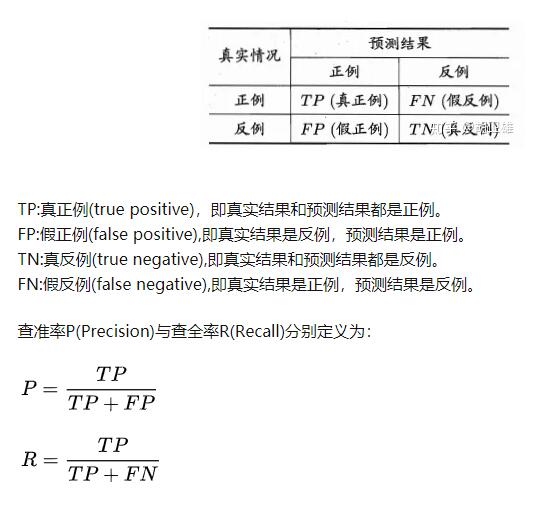
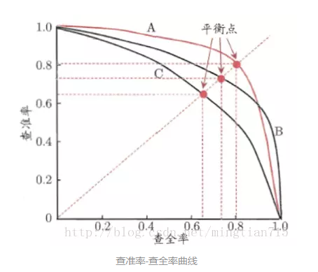
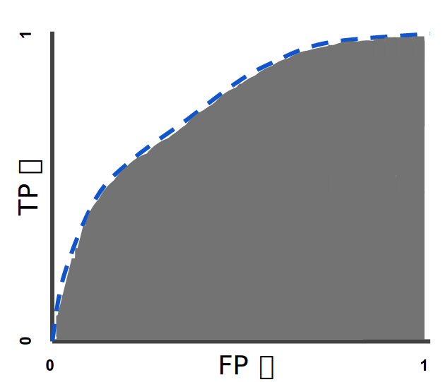
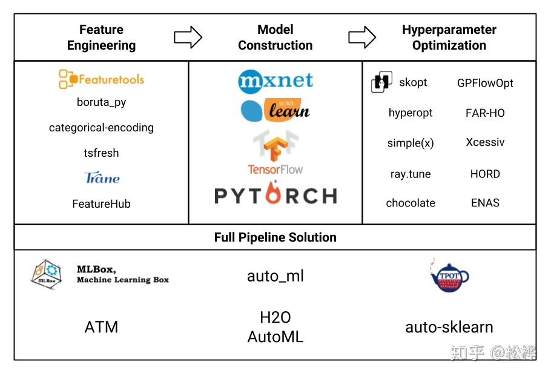
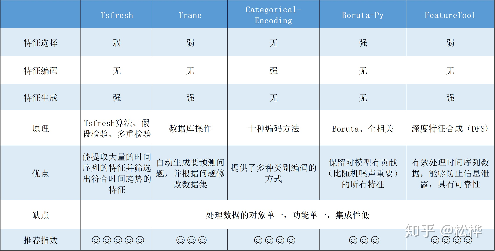
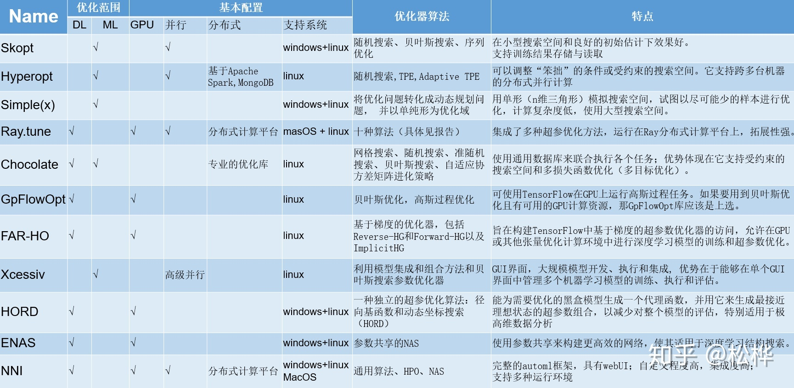
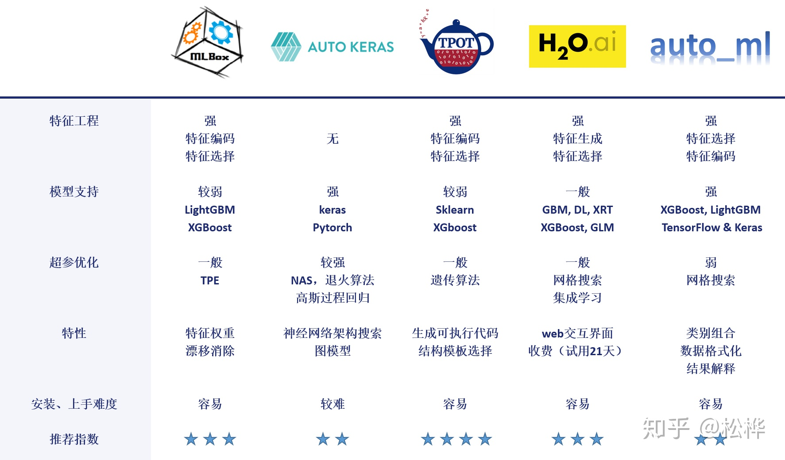

<!--toc-->
[TOC]
# 模型选择

> 一般针对过拟合的情况，我们可以在损失函数中增加正则项(L0、L1、L2范数，Dropout)来解决过拟合的问题
> [机器学习中常常提到的正则化到底是什么意思？](https://www.zhihu.com/question/20924039)

## 准确率、精确率、召回率
精确率是针对我们预测结果而言的，它表示的是预测为正的样本中有多少是真正的正样本。

召回率是针对我们原来的样本而言的，它表示的是样本中的正例有多少被预测正确了。

**demo1**
假设我们手上有60个正样本，40个负样本，我们要找出所有的正样本，系统查找出50个，其中只有40个是真正的正样本，计算上述各指标。
TP: 将正类预测为正类数 40(系统查找出40个是真正的正样本)
FN: 将正类预测为负类数 20(60个正样本 - 系统查找出40个是真正的正样本)
FP: 将负类预测为正类数 10(系统查找出50个 - 系统查找出40个是真正的正样本)
TN: 将负类预测为负类数 30(系统查找出50个正样本，那么就是预测了50个负样本，但是50个认为的负样本中实际上有20个正样本，所以30=50-20)

准确率(accuracy)(ACC) = 预测对的/所有 = (TP+TN)/(TP+FN+FP+TN) = 70%

精确率(precision)(PPV) = TP/(TP+FP) = 80%

召回率(recall) = TP/(TP+FN) = 2/3 

> 灵敏度（Sensitivity）（TPR）：就是召回率（Recall）召回率 = 提取出的正确信息条数 / 样本中的信息条数。通俗地说，就是所有准确的条目有多少被检索出来了

真正例率 (TPR) 是召回率的同义词 = TP/(TP+FN)

假正例率 (FPR) = FP/(FP+TN)

> 特异度(TNR)  Specificity = TN/(TN+FP)  

> 以上都是二级指标

> 三级指标 F1 Score = 2PR/(P+R)
> 其中，P代表Precision，R代表Recall。
> F1-Score指标综合了Precision与Recall的产出的结果。
> F1-Score的取值范围从0到1的，1代表模型的输出最好，0代表模型的输出结果最差

1）TP就是【True P】;FP就是【False P】。都是站在预测的角度来描述的。 
（2）P代表的是Positive【正类】; N表示的是Negative【负类】

Positive代表原始类别，而Negative代表其他所有的类别

FN：False Negative,被判定为负样本，但事实上是正样本。
FP：False Positive,被判定为正样本，但事实上是负样本。
TN：True Negative,被判定为负样本，事实上也是负样本。
TP：True Positive,被判定为正样本，事实上也是正样本。


**demo2**
分类阈值（也称为判定阈值）。如果值高于该阈值，则表示“垃圾邮件”；如果值低于该阈值，则表示“非垃圾邮件”。人们往往会认为分类阈值应始终为 0.5，但阈值取决于具体问题，因此您必须对其进行调整。

让我们以一种将电子邮件分为“垃圾邮件”或“非垃圾邮件”这两种类别的分类模型为例。
如果提高分类阈值，
**精确率可能会提高**:一般来说，提高分类阈值会减少假正例，从而提高精确率。
**召回率始终下降或保持不变**:提高分类阈值会导致真正例的数量减少或保持不变，而且会导致假负例的数量增加或保持不变。因此，召回率会保持不变或下降。

> 注意：“调整”逻辑回归的阈值不同于调整学习速率等超参数。在选择阈值时，需要评估您将因犯错而承担多大的后果。例如，将非垃圾邮件误标记为垃圾邮件会非常糟糕。不过，虽然将垃圾邮件误标记为非垃圾邮件会令人不快，但应该不会让您丢掉工作。反之将非垃圾邮件标记为垃圾邮件，那么你可以回家了。

<table border="1">
  <tbody><tr>
    <td style="background-color:#99FF99" width="50%">
      <b>真正例 (TP)：</b>
      <ul>
        <li>真实情况：受到狼的威胁。</li>
        <li>牧童说：“狼来了。”</li>
        <li>结果：牧童是个英雄。</li>
      </ul>
    </td>
    <td style="background-color:#FF9999">
      <b>假正例 (FP)：</b>
      <ul>
        <li>真实情况：没受到狼的威胁。</li>
        <li>牧童说：“狼来了。”</li>
        <li>结果：村民们因牧童吵醒他们而感到非常生气。</li>
    </ul></td>
  </tr>
  <tr>
    <td style="background-color:#FF9999">
      <b>假负例 (FN)：</b>
      <ul>
        <li>真实情况：受到狼的威胁。</li>
        <li>牧童说：“没有狼”。</li>
        <li>结果：狼吃掉了所有的羊。</li>
      </ul>
    </td>
    <td style="background-color:#99FF99">
      <b>真负例 (TN)：</b>
      <ul>
        <li>真实情况：没受到狼的威胁。</li>
        <li>牧童说：“没有狼”。</li>
        <li>结果：大家都没事。</li>
      </ul>
    </td>
  </tr>
</tbody></table>
**demo3**
在 100 个肿瘤样本中，91 个为良性（90 个 TN 和 1 个 FP），9 个为恶性（1 个 TP 和 8 个 FN）。
<table border="1">
  <tbody><tr>
    <td style="background-color:#99FF99" width="50%">
      <b>真正例 (TP)：</b>
      <ul>
        <li>真实情况：恶性</li>
        <li>机器学习模型预测的结果：恶性</li>
        <li><strong>TP 结果数：1</strong></li>
      </ul>
    </td>
    <td style="background-color:#FF9999">
      <b>假正例 (FP)：</b>
      <ul>
        <li>真实情况：良性</li>
        <li>机器学习模型预测的结果：恶性</li>
        <li><strong>FP 结果数：1</strong></li>
    </ul></td>
  </tr>
  <tr>
    <td style="background-color:#FF9999">
      <b>假负例 (FN)：</b>
      <ul>
        <li>真实情况：恶性</li>
        <li>机器学习模型预测的结果：良性</li>
        <li><strong>FN 结果数：8</strong></li>
      </ul>
    </td>
    <td style="background-color:#99FF99">
      <b>真负例 (TN)：</b>
      <ul>
        <li>真实情况：良性</li>
        <li>机器学习模型预测的结果：良性</li>
        <li><strong>TN 结果数：90</strong></li>
      </ul>
    </td>
  </tr>
</tbody></table>

准确率 = (TP+TN)/(TP+FN+FP+TN) = (1+90)/(1+90+1+8) = 0.91
精确率 =  TP/(TP+FP) = 1/(1+1) = 0.5 ，也就是说，该模型在预测恶性肿瘤方面的正确率是 50%。
召回率 =  TP/(TP+FN) = 1/(1+8) = 0.11，也就是说，该模型能够正确识别出所有恶性肿瘤的百分比是 11%。

以上数据说明：
1. 当您使用分类不平衡的数据集（比如正类别标签和负类别标签的数量之间存在明显差异）时，单单准确率一项并不能反映全面情况。
2. 判断模型的好坏需要通过 准确率和召回率两个指标来判断

**demo4**
> 在 roulette 游戏中，一只球会落在旋转轮上，并且最终落入 38 个槽的其中一个内。某个机器学习模型可以使用视觉特征（球的旋转方式、球落下时旋转轮所在的位置、球在旋转轮上方的高度）预测球会落入哪个槽中，准确率为 4%。
> 这个机器学习模型做出的预测比碰运气要好得多；随机猜测的正确率为 1/38，即准确率为 2.6%。尽管该模型的准确率“只有”4%，但成功预测获得的好处远远大于预测失败的损失。


[分类 (Classification)：检查您的理解情况（ROC 和 AUC）](https://developers.google.cn/machine-learning/crash-course/classification/check-your-understanding-roc-and-auc?hl=zh-cn)


## 性能评估
### 交叉验证
训练集上的损失值是无法衡量模型的好坏的。我们的办法就是增加交叉验证集，即将所有数据分为三部分：训练集、交叉验证集和测试集。交叉验证集不仅在选择模型时有用，在超参数选择、正则项参数 λ 和评价模型中也很有用。(也就是划分验证集用来模型选择和调参)

validation set method一般步骤如下：
1. 通过training set来训练不同的model
2. 由validation set来对model进行检验，并选择误差最小的model
3. 重新训练该模型用training set+validation set的数据（也就是最初的training data）
4. 使用test data来评估我们选择的model

Validation set method的缺点是如果数据集比较小的话我们可能就会没有足够多的数据来训练我们的model，所以model并不能够抓到一些核心的特征，因此validation set对模型的误差的估计也就没有什么意义。我们于是就引入了cross-validation：我们将training data划分为N个set，每个set轮流用来训练model/评估model。
**如果数据集够大，直接用validation set method就可以了，完全不需要用到cross-validation method**


> 验证集最终要参与训练得到最终模型，如5折交叉验证，需要的次数是 5m+1，m是超参组合

- 数据集划分方法——K折交叉验证：KFold，GroupKFold，StratifiedKFold
- 数据集划分方法——留一法：LeaveOneGroupOut，LeavePGroupsOut，LeaveOneOut，LeavePOut
- 数据集划分方法——随机划分法：ShuffleSplit，GroupShuffleSplit，StratifiedShuffleSplit

[参考-sklearn数据集划分](https://www.cnblogs.com/cmybky/p/11772655.html)

#### K-fold cross validation (model_selection.KFold)
#### 分层K-fold (model_selection.StratifiedKFold)
保持正例和负例的比例不变
#### GroupKFold
GroupKFold是KFold的变化形式
GroupKFold 会保证同一个group的数据不会同时出现在训练集和测试集上。因为如果训练集中包含了每个group的几个样例，可能训练得到的模型能够足够灵活地从这些样例中学习到特征，在测试集上也会表现很好。


#### 留一法 leave one out (model_selection.LeaveOneOut)
只用一个数据作为test集，其他的数据都作为训练集，并将此步骤重复N次（N为数据集的数据数量）。
#### 留P法验证 Leave-p-out （model_selection.LeavePOut）
有N个样本，将每P个样本作为测试样本，其它N-P个样本作为训练样本 排列组合，从N个选P个不同组合；当P=1的时候，就变成了留一法


### 模型评估 - 代价曲线

在分类型模型评判的指标中，常见的方法有如下三种：

1. 混淆矩阵（也称误差矩阵，Confusion Matrix）
2. ROC曲线
3. AUC面积
4. DET(Detection Error Tradeoff )

ROC曲线有个很好的特性：当测试集中的正负样本的分布变化时，ROC曲线能够保持不变。在实际的数据集中经常会出现不平衡(class imbalance)现象，即负样本比正样本多很多（或者相反），而且测试数据中的正负样本的分布也可能随着时间变化。下图是ROC曲线和P-R曲线的对比:


#### 查准率－查全率曲线（P-R曲线）

> metrics.plot_precision_recall_curve




#### ROC曲线
”真正例率“（True Positive Rate,简称TPR)和”假正例率“（False Positive Rate,简称FPR)


```
from sklearn.metrics import plot_roc_curve
svc_disp = plot_roc_curve(svc, X_test, y_test)
plt.show()
```

#### AUC值
> metrics.auc

就是ROC曲线下面积


#### 混淆矩阵（confusion_matrix）
https://blog.csdn.net/SmartShylyBoy/article/details/91360934

[混淆矩阵,ROC,AUC](https://www.bilibili.com/video/BV1qf4y1x7kB?p=18)

## 超参调优
[Optuna - 超参数自动化调优框架](https://github.com/optuna/optuna)

### model_selection.ParameterSampler 参数生成器
### model_selection.GridSearchCV 和RandomizedSearchCV 网格搜索
GridSearchCV，它存在的意义就是自动调参，只要把参数输进去，就能给出最优化的结果和参数。但是这个方法适合于小数据集，一旦数据的量级上去了，很难得出结果。
### HalvingGridSearchCV和 HalvingRandomSearchCV

## 模型可解释性 - 指标和评分
一般模型验证时需要用到各种指标：
model_selection.cross_validate 交叉验证
参数:scoring 就是评分指标（str, callable, list, tuple, or dict, default=None）
参数：groups:切分train/test数据集后的样本所在集合标号

[交叉验证迭代器](https://scikit-learn.org/stable/modules/cross_validation.html#cross-validation-iterators)

验证使用的验证指标可以是方法、字符串、以及字典,如：
```
scoring = {'accuracy': make_scorer(accuracy_score),
          'prec': 'precision'}
```
所有指标
```
from sklearn import metrics
metrics.SCORERS.keys()
```


指标表格

| Scoring                              | Function                               | Comment                        |
|--------------------------------------|----------------------------------------|--------------------------------|
| Classification                       |                                        |                                |
| ‘accuracy’                           | metrics.accuracy_score                 |                                |
| ‘balanced_accuracy’                  | metrics.balanced_accuracy_score        |                                |
| ‘top_k_accuracy’                     | metrics.top_k_accuracy_score           |                                |
| ‘average_precision’                  | metrics.average_precision_score        |                                |
| ‘neg_brier_score’                    | metrics.brier_score_loss               |                                |
| ‘f1’                                 | metrics.f1_score                       | for binary targets             |
| ‘f1_micro’                           | metrics.f1_score                       | micro-averaged                 |
| ‘f1_macro’                           | metrics.f1_score                       | macro-averaged                 |
| ‘f1_weighted’                        | metrics.f1_score                       | weighted average               |
| ‘f1_samples’                         | metrics.f1_score                       | by multilabel sample           |
| ‘neg_log_loss’                       | metrics.log_loss                       | requires predict_proba support |
| ‘precision’ etc.                     | metrics.precision_score                | suffixes apply as with ‘f1’    |
| ‘recall’ etc.                        | metrics.recall_score                   | suffixes apply as with ‘f1’    |
| ‘jaccard’ etc.                       | metrics.jaccard_score                  | suffixes apply as with ‘f1’    |
| ‘roc_auc’                            | metrics.roc_auc_score                  |                                |
| ‘roc_auc_ovr’                        | metrics.roc_auc_score                  |                                |
| ‘roc_auc_ovo’                        | metrics.roc_auc_score                  |                                |
| ‘roc_auc_ovr_weighted’               | metrics.roc_auc_score                  |                                |
| ‘roc_auc_ovo_weighted’               | metrics.roc_auc_score                  |                                |
| Clustering                           |                                        |                                |
| ‘adjusted_mutual_info_score’         | metrics.adjusted_mutual_info_score     |                                |
| ‘adjusted_rand_score’                | metrics.adjusted_rand_score            |                                |
| ‘completeness_score’                 | metrics.completeness_score             |                                |
| ‘fowlkes_mallows_score’              | metrics.fowlkes_mallows_score          |                                |
| ‘homogeneity_score’                  | metrics.homogeneity_score              |                                |
| ‘mutual_info_score’                  | metrics.mutual_info_score              |                                |
| ‘normalized_mutual_info_score’       | metrics.normalized_mutual_info_score   |                                |
| ‘rand_score’                         | metrics.rand_score                     |                                |
| ‘v_measure_score’                    | metrics.v_measure_score                |                                |
| Regression                           |                                        |                                |
| ‘explained_variance’                 | metrics.explained_variance_score       |                                |
| ‘max_error’                          | metrics.max_error                      |                                |
| ‘neg_mean_absolute_error’            | metrics.mean_absolute_error            |                                |
| ‘neg_mean_squared_error’             | metrics.mean_squared_error             |                                |
| ‘neg_root_mean_squared_error’        | metrics.mean_squared_error             |                                |
| ‘neg_mean_squared_log_error’         | metrics.mean_squared_log_error         |                                |
| ‘neg_median_absolute_error’          | metrics.median_absolute_error          |                                |
| ‘r2’                                 | metrics.r2_score                       |                                |
| ‘neg_mean_poisson_deviance’          | metrics.mean_poisson_deviance          |                                |
| ‘neg_mean_gamma_deviance’            | metrics.mean_gamma_deviance            |                                |
| ‘neg_mean_absolute_percentage_error’ | metrics.mean_absolute_percentage_error |                                |

## 模型可解释性
### 分类报告 metrics.classification_report
### 各种损失
- 分类
metrics.hamming_loss
metrics.brier_score_loss
metrics.hinge_loss
metrics.log_loss
metrics.zero_one_loss

- 回归
metrics.mean_absolute_error(y_true, y_pred, *)
metrics.mean_squared_error(y_true, y_pred, *) 均方误差
metrics.mean_squared_log_error(y_true, y_pred, *)
metrics.median_absolute_error(y_true, y_pred, *)
metrics.mean_absolute_percentage_error(…)
metrics.mean_poisson_deviance(y_true, y_pred, *)
metrics.mean_gamma_deviance(y_true, y_pred, *)
metrics.mean_tweedie_deviance(y_true, y_pred, *)

### 相关系数
jaccard_score 相关系数
matthews_corrcoef 相关系数
## 模型可解释性 - 绘图部分
### model_selection.learning_curve 学习曲线
[Plotting Learning Curves](https://scikit-learn.org/stable/auto_examples/model_selection/plot_learning_curve.html)

### model_selection.validation_curve 验证曲线
[Plotting Validation Curves](https://scikit-learn.org/stable/auto_examples/model_selection/plot_validation_curve.html)

### metrics.plot_precision_recall_curve PR曲线
> 就是metrics.precision_recall_curve + metrics.PrecisionRecallDisplay

### metrics.plot_roc_curve ROC曲线（直接绘制）
> 就是metrics.roc_curve + metrics.RocCurveDisplay

### metrics.plot_det_curve DET曲线（直接绘制）
> 就是metrics.det_curve +metrics.DetCurveDisplay

DET(Detection Error Tradeoff )曲线是对二元分类系统误码率的曲线图，绘制出错误拒绝率FRR（False Reject Rate）与错误接受率（False Accept Rate）之间随着判断阈值的变化而变化的曲线图。现在DET曲线扩展到用于模式识别分类器性能的评价的一个指标之一。


### metrics.plot_confusion_matrix 混淆矩阵
> 就是metrics.confusion_matrix + metrics.ConfusionMatrixDisplay
[模型评估之混淆矩阵（confusion_matrix）](https://blog.csdn.net/SmartShylyBoy/article/details/91360934)

### inspection.plot_partial_dependence 部分依赖图和个体条件期望图
https://zhuanlan.zhihu.com/p/364921771

https://scikit-learn.org/stable/modules/classes.html#module-sklearn.inspection

# AutoML


https://zhuanlan.zhihu.com/p/93109455

## 特征工程工具
- Tsfresh
- Trane
- Categorical Encoding
- boruta_py
- Featuretools


## 超参优化工具
- optuna
- Skopt
- Hyperopt
- Simple(x)
- Ray.tune
- Chocolate
- GpFlowOpt
- FAR-HO
- Xcessiv
- HORD
- ENAS
- NNI



评比规则：通用基础项（50%）+gihub评分（50%）+加分项（20%）


## AutoML开源框架

- MLBox
- Autokeras
- TPOT
- H2O
- Auto_ml



- [auto-sklearn](https://github.com/automl/auto-sklearn/) 自动机器学习工具包和scikit-learn估计器的直接替代品

- [autoviml](https://github.com/AutoViML/Auto_ViML/) 用单行代码自动构建多个机器学习模型。设计为使用scikit学习模型的更快方法，而无需预处理数据。

- [TPOT](https://github.com/rhiever/tpot) 一种自动化的机器学习工具包，可优化一系列scikit-learner操作员以设计机器学习管道，包括数据和功能预处理器以及估计器。可以替代scikit-learn估算器。

- [Featuretools](https://github.com/FeatureLabs/featuretools) 执行自动特征工程的框架。它可以用于将时间和关系数据集转换为用于机器学习的特征矩阵。

- [Neuraxle](https://github.com/Neuraxio/Neuraxle) 一个用于构建整洁管道的库，提供正确的抽象以简化机器学习应用程序的研究，开发和部署。它与深度学习框架和scikit-learn API兼容，可以流式处理迷你批处理，使用数据检查点，构建时髦的管道以及使用自定义逐步保存程序序列化模型。