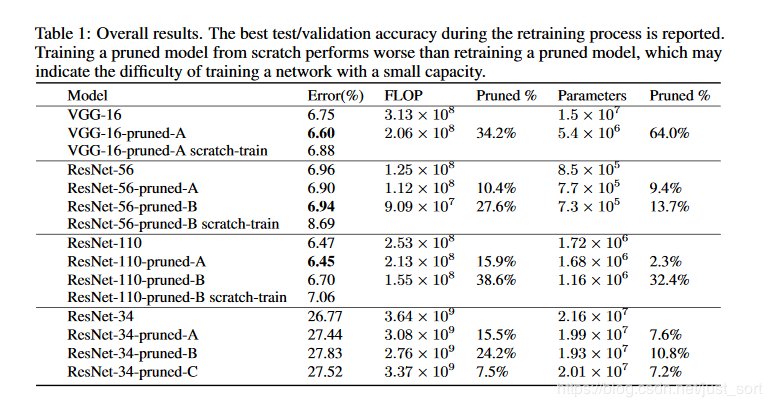
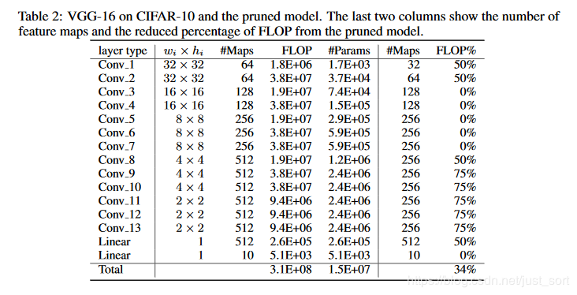

<!-- toc -->
[TOC]
# 深度学习算法优化系列一 | ICLR 2017《Pruning Filters for Efficient ConvNets》

## 前言

这篇文章是深度学习算法优化系列的第一篇文章，主要解读一篇 ICLR 2017 年的《Pruning Filters for Efficient ConvNets》，关于通道剪枝策略的一篇论文。论文原地址见附录。

## 背景

在模型压缩的方法中，包括剪枝，量化，多值网络，模型蒸馏等。这篇论文是模型剪枝当面的。剪枝最初应用应该是在决策树算法中，通过降低决策树的模型复杂度防止过拟合。在 CNN 中也是类似的思想，因为在大型的模型中，总是不可避免的存在大量的权重冗余，这种冗余甚至有可能降低模型的准确率。因此需要借助剪枝的方法压缩模型，在压缩率合适的条件下，可以提高模型的准确率的同时减少模型大小。同时，在往移动端部署模型的时候也会考虑牺牲一点精度换取时间和空间的节约。CNN 的剪枝主要分为两种，一种是基于幅值的剪枝，一种是基于通道的剪枝。基于幅值的剪枝主要思想是将小于一定阈值的权重抛弃，阈值用剪枝率来确定。而基于通道的剪枝主要思想史将不重要的整个权重通道剪掉，从而将模型变小。这篇论文就属于第二类。

## 1. 摘要

CNN 在各种应用中的成功伴随着计算量和参数量的显着增加。最近朝着减少这些开销的研究涉及到在不损伤精度的条件下剪枝和压缩不同层的权重。然而，基于幅值的权重剪枝主要是减少了全连接层的参数量，并且由于修剪的不规则性，并没有减少卷积层的计算成本。这篇论文展示了一种对于 CNN 的加速方法，即直接移除对于 CNN 精度影响很小的卷积核。通过将网络的这些卷积核以及它们的 feature map 移除掉，可以极大的减少计算成本。与权重剪枝相比，这个方法不会导致稀疏连接模式。因此，它不需要专门支持稀疏卷积库的支持，它可以使用针对密集矩阵乘法的 BLAS 库高效处理，我们展示了通过简单的卷积核剪枝可以推理成本，在 CIFAR10 上，VGG-16 的推理成本可降低高达 34％，ResNet-110 最高可降低 38％，同时通过重新训练网络恢复接近原始精度。

## 2. 卷积核和特征图剪枝

ni​是第i个卷积层的输入通道数，hi​和wi​是输入特征图的高和宽。卷积层将输入维度为Xi​∈Rni​×hi​×wi​的特征图转化为维度为Xi+1​∈Rni+1​×hi+1​×wi+1​的输出特征图作为下一层的输入。这里卷积核的维度为ni+1​×ni​×k×k，卷积层的乘加操作次数为ni+1​×ni​×k2×hi+1​×wi+1​。如下面的 Figure1 所示：  
  
当我们把一个卷积核剪掉后，对应的 feature map 也没了，减少了ni​×k2×hi+2​×wi+2​操作。这是因为当前一个卷积层的卷积核被剪掉后，该层保留的卷积核参数不仅仅在卷积核个数这个维度上缩减了，还和上一个卷积层剪掉的卷积核个数有关，其简介导致了该层卷积核在通道上的缩减。

## 3. 方法

### 3.1 确定在单层中需要剪枝的卷积核

论文用Fi,j​∈Rni​×k×k来表示第i层的一个卷积核，然后论文提出通过∑∣Fi,j​∣，即一个卷积核类所有权值绝对值之和（L1 范数）来表示每个层中该卷积核的重要程度。Figure2（a）展示了在 CIFAR-10 数据集上训练好的 VGG16 网络中每一个卷积层中每个卷积核权重绝对值之和的分布，可以看到每层的分布是不同的。

同时论文发现剪掉 L1 值最小的卷积核比随机剪枝或者剪掉最大的卷积核效果更好。从第i个卷积层剪掉m个卷积核的算法过程如下：

*   对每个卷积核Fi,j​，计算它的权重绝对值之和sj​\=∑l\=1ni​​∑∣Kl​∣。
*   根据sj​排序。
*   将m个权重绝对值之和最小的卷积核及对应的 feature map 剪掉。下一个卷积层中和剪掉的 feature ,ap 相关的卷积核也要移除。
*   一个对于第i层和第i+1层的新的权重矩阵被创建，并且剩下的权重参数被复制到新模型中。

### 3.2 确定卷积层对剪枝的敏感度

为了确定每个卷积层对剪枝的敏感度，论文对每一层独立剪枝并在验证集上对剪枝后的网络进行评估。Figure2(b)展示了这一结果。其中曲线的斜率就可以代表敏感度，斜率比较平缓的说明该层对剪枝的敏感度就更高。论文根据经验来决定对每一层的卷积核进行剪枝，对于深度网络（如 VGG-16 或 ResNets），观察到同一 stage 相同尺寸的特征图）对应的层对剪枝的敏感度相似，论文对于同一 stage 的所有层使用相同的剪枝比例。而对于那些敏感度高的层，剪枝时比例很小，甚至完全不进行剪枝。

### 3.3 跨多个卷积层剪枝

之前的工作是逐层剪枝然后重新训练来恢复进度。然而理解如何能一次性的对多层进行剪枝是有有必要的:（1）因为对于深层网络来说，逐层剪枝再训练太耗时。（2）整体剪枝的方法可以为网络鲁棒性提供一个全局视野，从而形成了一个更小的网络。（3）对于复杂的网络，一个整体的方法是有必要的。例如对于 ResNet，对恒等映射特征图或者每个残差模块的第二层剪枝会导致额外层的剪枝。为了对多层同时剪枝，论文考虑了两个策略。

*   每一层独立剪枝，即在计算(求权重绝对值之和)时不考虑上一层的剪枝情况，所以计算时 Figure3 中的黄色点权重仍然参与计算。
*   采用贪心策略，计算时不计算已经剪枝过的，即黄色点不参与计算。  
    实验证明采用贪心策略的计算方式精度会好一些。  
    对于简单的 CNN 网络如 AlexNet,VGGNet，可以简单的对任意卷积层进行剪枝。然而，对于 ResNet 这种复杂的网络，这是不可行的。ResNet 的结构对剪枝提出了限制条件，残差块中的第一个卷积层可以随意修剪，因为它不会改变残差块输出特征图的数目，然而第二个卷积层和特征映射的剪枝很困难。因此，为了残差模块的第二个卷积层进行剪枝，相关的 projected featured maps(就是xi​)必须也要剪掉，由于恒等特征映射要比添加的 residual maps 重要，对第二个层的剪枝应该由 shortcut 层的剪枝结果决定。为了决定那些恒等特征映射图被剪掉，我们对 shortcut 卷积层（1x1 卷积核）上采用相同的选择标准，即 residual block 中第二层修剪的 Filter index 与 shortcut layer 所选择的 Filter index 相同。这个过程结合 Figure4 比较容易懂。  
    

### 3.4 重新练网络恢复精度

在剪枝过后，通过重新训练可以补偿剪枝造成的精度损失，有两种策略：

*   一次剪枝和重新训练：一次性对多层的卷积核剪枝，然后重新训练直到原来的准确率恢复。
*   交替剪枝和训练：逐层或逐卷积核剪枝，然后再训练，重复多次。

## 4. 实验结论

从下面的 Table1 可以看到，对剪枝后的网络结构从头训练要比对重新训练剪枝后的网络（利用了未剪枝之前的权重）的结果差，这也说明了对小容量的网络训练很难。  
其中 Tabl2 表示了 VGG16 中各层的剪枝比例，如下：  
在 CIFAR10 上，VGG-16 的推理成本可降低高达 34％，ResNet-110 最高可降低 38％，同时通过重新训练网络恢复接近原始精度。

## 5. 附录

论文原文：[https://arxiv.org/abs/1608.08710](https://arxiv.org/abs/1608.08710)  
再记录一些剪枝相关的论文。  
**基于权重的剪枝**

*   Song Han： Deep Compression: Compressing Deep Neural Network with Pruning, Trained Quantization and Huffman Coding.
*   Michael Zhu and Suyog Gupta：To prune, or not to prune: exploring the efficacy of pruning for model compression  
    **基于通道的剪枝**
*   Channel Pruning for Accelerating Very Deep Neural Networks
*   Zhuang Liu：Learning Efficient Convolutional Networks through Network Slimming  
    **关于源码实现**  
    可以看看这个工程：[https://github.com/666DZY666/model-compression](https://github.com/666DZY666/model-compression)

## 6. 参考

*   [GitHub 项目推荐：用深度学习让你的照片变得美丽](https://github.com/aiff22/DPED)
*   [Github项目推荐 | Transformer-XL 的高效分布式训练](https://github.com/GaoPeng97/transformer-xl-chinese)
*   [Spark Streaming VS Flink](https://www.jianshu.com/p/96624553cf14)
* [写给程序员的机器学习入门 (五) - 递归模型 RNN，LSTM 与 GRU](https://www.cnblogs.com/zkweb/p/12982132.html) 