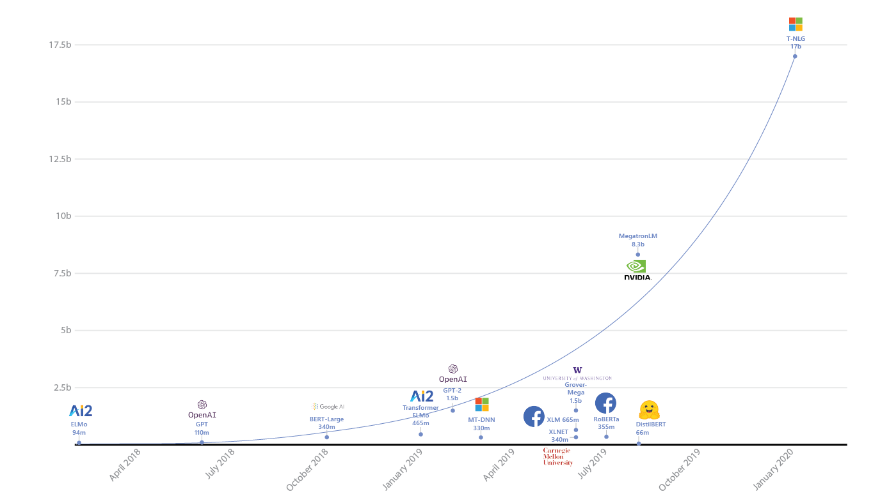

[TOC]
[nlp-roadmap](./nlp-roadmap/README.md)

[transformers](https://github.com/huggingface/transformers) 30k
AI界无人不知的最先进NLP模型Transformer

自然语言处理主要研究用计算机来处理、理解以及运用人类语言（又称自然语言）的各种理论和方法，属于人工智能领域的一个重要研究方向，是计算机科学与语言学的交叉学科，又常被称为计算语言学。随着互联网的快速发展，网络文本尤其是用户生成的文本成爆炸式增长，为自然语言处理带来了巨大的应用需求。同时，自然语言处理研究的进步，也为人们更深刻地理解语言的机理和社会的机制提供了一种新的途径，因此具有重要的科学意义。
然而，自然语言具有歧义性、动态性和非规范性，同时语言理解通常需要丰富的知识和一定的推理能力，这些都给自然语言处理带来了极大的挑战。目前，统计机器学习技术为以上问题提供了一种可行的解决方案，成为研究的主流，该研究领域又被称为统计自然语言处理。一个统计自然语言处理系统通常由两部分组成，即训练数据（也称样本）和统计模型（也称算法）。但是，传统的机器学习方法在数据获取和模型构建等诸多方面都存在严重的问题。首先，为获得大规模的标注数据，传统方法需要花费大量的人力、物力、财力，雇用语言学专家进行繁琐的标注工作。由于这种方法存在标注代价高、规范性差等问题，很难获得大规模、高质量的人工标注数据，由此带来严重的数据稀疏问题。其次，在传统的自然语言处理模型中，通常需要人工设计模型需要的特征和特征组合。这种人工设计特征的方式，需要开发人员对所面对的问题有深刻的理解和丰富的经验，这会消耗大量的人力和时间，即便如此也往往很难获得有效的特征。
近年来，如火如荼的深度学习技术为这两方面的问题提供了一种可能的解决思路，有效地推动了自然语言处理技术的发展。深度学习一般是指建立在含有多层非线性变换的神经网络结构之上，对数据的表示进行抽象和学习的一系列机器学习算法。该方法已对图像处理、语言识别等领域的进步起了极大的推动作用，同时也引起了自然语言处理领域学者的广泛关注。
深度学习主要为自然语言处理的研究带来了两方面的变化：一方面是使用统一的分布式（低维、稠密、连续）向量表示不同粒度的语言单元，如词、短语、句子和篇章等；另一方面是使用循环、卷积、递归等神经网络模型对不同的语言单元向量进行组合，获得更大语言单元的表示。除了不同粒度的单语语言单元外，不同种类的语言甚至不同模态（语言、图像等）的数据都可以通过类似的组合方式表示在相同的语义向量空间中，然后通过在向量空间中的运算来实现分类、推理、生成等各种任务并应用于各种相关的任务之中。

=======================================================================================================

自然语言处理这一术语指的是对人类语言进行自动的计算处理。它包括两类算法：将人类产生的文本作为输入；产生看上去很自然的文本作为输出。由于人类产生的文本每年都在不停增加，同时人们期望使用人类的语言与计算机进行交流，因此人们对该类算法的需求在不断增加。然而，由于人类语言固有的歧义、不断变化以及变态性（not well defined），导致自然语言处理极具挑战性。
自然语言本质上是符号化的，因此人们最开始也尝试使用符号化的方式处理语言，即基于逻辑、规则以及本体的方法。事实上，如今自然语言处理的主流方法都是基于统计机器学习的。过去十几年，核心的NLP技术都是以有监督学习的线性模型为主导，核心算法如感知机、线性支持向量机、逻辑回归等都是在非常高维和稀疏的特征向量上进行训练的。
2014年左右，该领域开始看到一些从基于稀疏向量的线性模型向基于稠密向量的非线性神经网络模型（Nonlinear Neural Network Model）切换的成功案例。一些神经网络技术是线性模型的简单推广，可用于替代线性分类器。另一些神经网络技术更进一步提出了新的建模方法，这需要改变现有的思维方式。特别是一系列基于循环神经网络（Recurrent Neural Network，RNN）的方法，减轻了对马尔科夫假设的依赖性，这曾普遍用于序列模型中。循环神经网络可以处理任意长度的序列数据，并生成有效的特征抽取器。这些进展导致了语言模型、自动机器翻译以及其他一些应用的突破。

注:文章内容摘自Yoav Goldberg所著《Neural Network Methods for Natural Language Processing》的中文版《基于深度学习的自然语言处理》译者序+前言

## 中文 数据集
https://ai.tencent.com/ailab/nlp/en/data/Tencent_AILab_ChineseEmbedding.tar.gz

https://chinesenlp.xyz/#/zh/

ChineseSemanticKB,chinese semantic knowledge base, 面向中文处理的12类、百万规模的语义常用词典，包括34万抽象语义库、34万反义语义库、43万同义语义库等，可支持句子扩展、转写、事件抽象与泛化等多种应用场景。
https://github.com/liuhuanyong/ChineseSemanticKB

## xx
http://rowanzellers.com/advice/
https://openai.com/blog/image-gpt/

ELMo:https://arxiv.org/abs/1802.05365
BERT:https://arxiv.org/abs/1810.04805
ERNIE:https://arxiv.org/abs/1904.09223
Grover:https://arxiv.org/abs/1905.12616
KERMIT:https://arxiv.org/abs/1906.01604
Big Bird:https://arxiv.org/abs/2007.14062

### BERT
[BERT Rediscovers the Classical NLP Pipeline](https://arxiv.org/abs/1905.05950)
https://openreview.net/pdf?id=SJzSgnRcKX

[BERT: Pre-training of Deep Bidirectional Transformers for Language Understanding](https://arxiv.org/abs/1810.04805)

### ERNIE
[中文任务全面超越BERT：百度正式发布NLP预训练模型ERNIE](https://zhuanlan.zhihu.com/p/59436589)
https://github.com/PaddlePaddle/ERNIE

### GPT

ELMO 有94M个参数（M 百万）
BERT 有340M个参数
GPT-2 有1542M个参数
T5 有11B个参数
Turing-NLG 有17000M个参数(17B)
GPT-3 有175000M个参数(175B)
（光训练好的model有700GB - GPT-2 才6GB）

https://lambdalabs.com/blog/demystifying-gpt-3/

ELMo paper  - 15 pages
BERT paper  - 16 pages
GPT-2 paper  - 24 pages
T5 paper  - 53 pages  https://arxiv.org/abs/1910.10683
GPT-3 paper  - 72 pages
[如何评价1700亿参数的GPT-3？](https://www.zhihu.com/question/398114261)

https://github.com/elyase/awesome-gpt3

### MT-NLG
2021-10-11
https://www.microsoft.com/en-us/research/blog/using-deepspeed-and-megatron-to-train-megatron-turing-nlg-530b-the-worlds-largest-and-most-powerful-generative-language-model/
https://developer.nvidia.com/blog/using-deepspeed-and-megatron-to-train-megatron-turing-nlg-530b-the-worlds-largest-and-most-powerful-generative-language-model/

微软和英伟达今天宣布了由 DeepSpeed 和 Megatron 驱动的 Megatron-Turing 自然语言生成模型（MT-NLG），这是迄今为止训练的最大和最强大的解码语言模型。这个模型包括 5300 亿个参数，与现有最大的模型 GPT-3 相比，参数数量是其 3 倍。
微软英伟达发布 5300 亿 NLP 模型“威震天-图灵”，花了 4480 块 A100
此模型简称 MT-NLG，是微软Turing NLG和英伟达Megatron-LM两者的“继任者”。
Turing NLG 由微软于 2020 年 2 月推出，参数为 170 亿；Megatron-LM 来自英伟达，2019 年 8 月推出，参数 83 亿。

### Turing Natural Language Generation (T-NLG)  （Turing-NLG）
https://www.microsoft.com/en-us/research/blog/turing-nlg-a-17-billion-parameter-language-model-by-microsoft/

## 翻译
Facebook开源了M2M-100源代码，这是首个可以不依赖英语数据而可以实现100个语言对互相翻译的机器翻译模型（如中文-法文互译为一个语言对）。在训练2200种语言对后，该单一多语言模型不仅与传统的双语模型性能相当，同时也比以英语为中心的多语模型在机器翻译评价指标BLEU上提高了10%。

论文主页：https://ai.facebook.com/research/publications/beyond-english-centric-multilingual-machine-translation

项目地址：https://github.com/pytorch/fairseq/tree/master/examples/m2m_100
