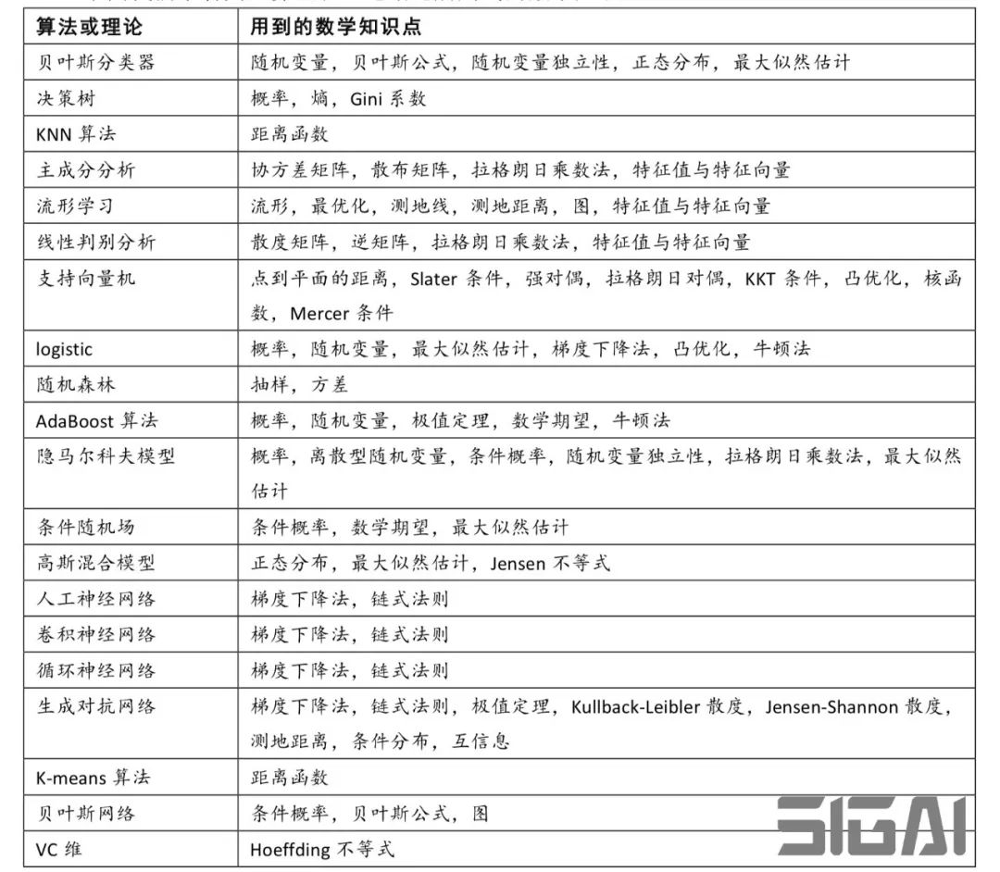

<!--toc-->
[TOC]
# 数学

## 高等数学
高等数学中两大入门课程：线性代数和微积分

- 线性代数
它的研究对象是向量，向量空间（或称线性空间），线性变换和有限维的线性方程组。
### 入门

#### 托马斯微积分
《托马斯微积分》：直观易读，强调建模应用和技巧训练，重要的是不失数学上的完整性，工科使用应该相当不错。作者：芬尼 / 韦尔 / 焦尔当诺
#### 普林斯顿微积分读本
《普林斯顿微积分读本》：没看过，据说评价很高。 作者：阿德里安·班纳

### 进阶
#### 微积分和数学分析引论
《微积分和数学分析引论》 ：数学经典之一。作者: Richard Courant / Fritz John
#### 数学分析原理
《数学分析原理》 ：分析学名著。作者：Walter Rudin
#### 数学分析八讲
《数学分析八讲》：据说数理学科看着都有点困难。作者：辛钦
#### 微积分学教程
《微积分学教程》（共三卷）：数学名著。作者：菲赫金哥尔茨
#### 微积分入门
《微积分入门》（共两卷）：世界级数学大师的优秀教材。作者：小平邦彦

## 线性代数

[The matrix cookbook - 线性代数索引](files/matrixcookbook.pdf)

### 入门
#### 线性代数及其应用
《线性代数及其应用》 ：侧重于应用。作者：David C. Lay
[MIT 教授 Gilbert Strang](http://math.mit.edu/~gs/) 的公开课 Linear Algebra，配合教材 《Introduction to Linear Algebra 》或《Linear Algebra and Its Applications》

#### 台大线性代数
[台大线性代数 PPT和视频](http://speech.ee.ntu.edu.tw/~tlkagk/courses_LA18.html)

### 进阶
#### 线性代数应该这样学
《线性代数应该这样学》 ：建立在普通线性代数基础上的，有泛函基础再看这本书会好些。作者：Sheldon Axler
#### 矩阵分析
《矩阵分析》 ：赫赫有名的一本书。作者：（美）合恩（Horn/R.A.）等/杨奇
#### 矩阵计算
《矩阵计算》 ：被称为数值线性代数圣经。作者：Gene H.Golub / Charles F.Van Loan

## 概率论与数理统计
### 概率论基础教程
《概率论基础教程》 ：入门级的好教材。作者：罗斯（Sheldon M. Ross）
### 概率论教程
《概率论教程》：看版本号就知道很经典。作者：钟开莱
### 概率论与数理统计
《概率论与数理统计》：用心写成的书，不光是教知识，更是教思维的方法。作者：陈希孺
### 数理统计学导论（原书第7版）
《数理统计学导论（原书第7版） 》 ：不太了解。作者：霍格
### 数理统计学教程
《数理统计学教程 》 ：堪称最好的中文数理统计教材，中国科学院院士的又一杰作。作者：陈希孺

## 俄罗斯数学教材选译系列
绿色封面
## 华章数学译丛
黄色封面

## 最优化方法
> 优化 = 数学规划
> 线性规划一定是凸规划

[最优化：建模、算法与理论/最优化计算方法](http://bicmr.pku.edu.cn/~wenzw/optbook.html)

凸优化

[Stephen Boyd的Convex Optimization](https://web.stanford.edu/~boyd/cvxbook/bv_cvxbook.pdf)

非线性规划

[Nonlinear Programming by Dimitri P. Bertsekas](http://www.athenasc.com/nonlinbook.html)

高等代数

# 机器学习

## 数学基础

### 数学之美
《数学之美（第二版）》 - 吴军。

### 统计学习方法
《统计学习方法》 - 李航。可以说是机器学习的入门宝典，许多机器学习培训班、互联网企业的面试、笔试题目，很多都参考这本书。

[《统计学习方法》第二版的代码实现](https://github.com/fengdu78/lihang-code)

### 托马斯微积分
《托马斯微积分》学好多元微积分也能更好地理解神经网络模型的优化过程。

### 线性代数及其应用
《线性代数及其应用（原书第 5 版）》线性代数是理解矩阵运算的基础。数据挖掘算法里的非负矩阵分解、奇异值分解，以及神经网络里的矩阵运算，都需要一定的线性代数知识。

### 概率论与数理统计
《概率论与数理统计》概率论与数理统计是最为重要的一门数学课。目前使用最广泛的交叉熵损失函数，源于统计中的极大似然估计；概率论中的贝叶斯公式衍生出了贝叶斯学派；大数定律则是很多主观实验的理论依据之一。

## 算法|编程基础
### 图解机器学习
《图解机器学习》
### 集体智慧编程
《集体智慧编程》

## 入门
### 机器学习
《机器学习》 周志华的西瓜书
[西瓜书）公式推导解析](https://github.com/datawhalechina/pumpkin-book)
### Python 深度学习
《Python 深度学习》
### 动手学深度学习
《动手学深度学习》
### Python 神经网络编程
《Python 神经网络编程》

## 进阶
### 机器学习实战
《机器学习实战》
### Pattern Recognition And Machine Learning（ 模式识别与机器学习）
《Pattern Recognition And Machine Learning》（ 模式识别与机器学习）
### Statistical Learning Theory
《Statistical Learning Theory》

# PDF
https://github.com/zhangbc/eBooks/tree/master/%E6%9C%BA%E5%99%A8%E5%AD%A6%E4%B9%A0%E7%B1%BB