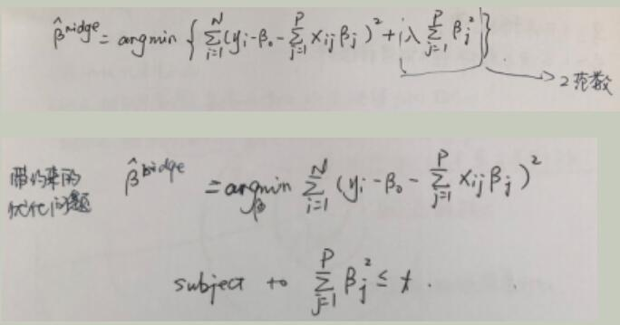
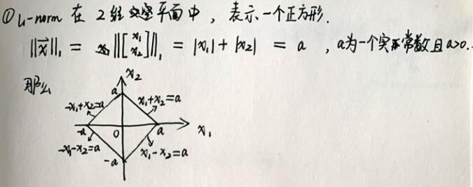
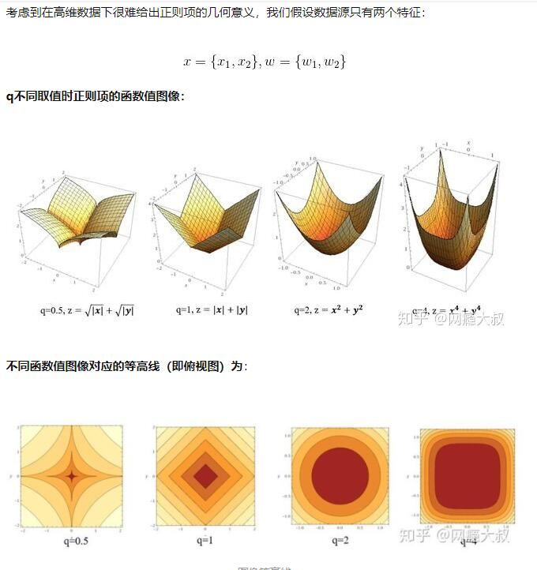
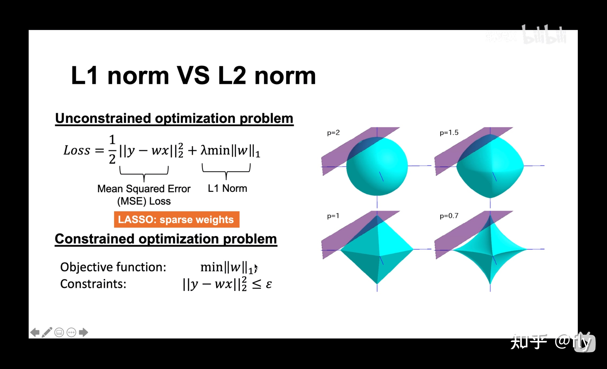
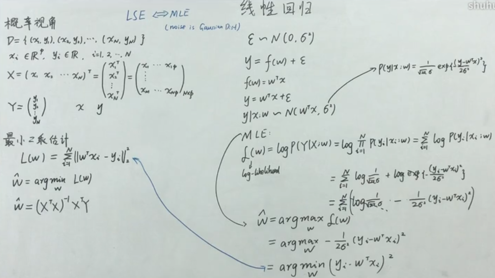
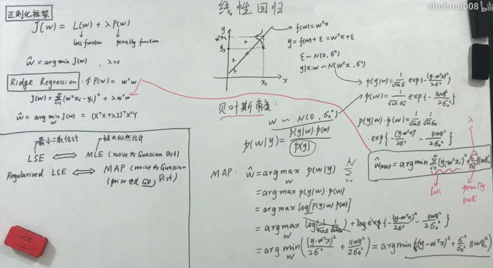
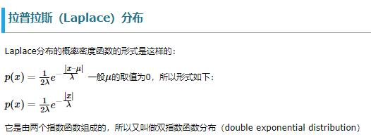
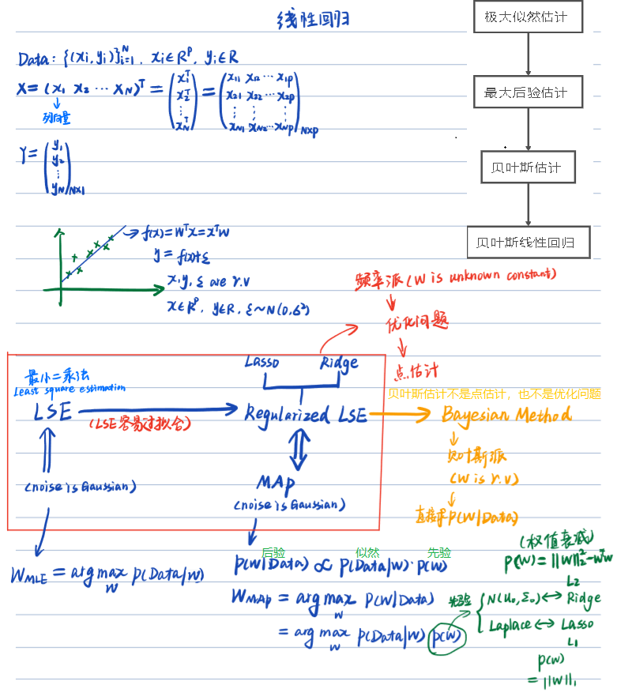
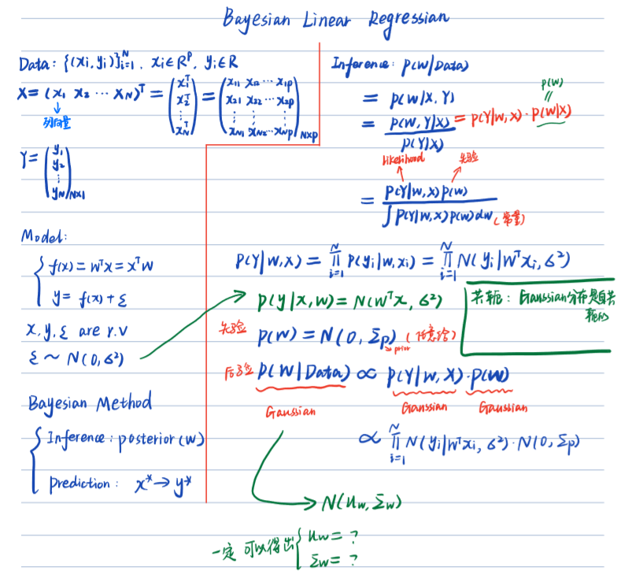

# 最小二乘法
## 如何理解最小二乘法？
https://blog.csdn.net/ccnt_2012/article/details/81127117

[经典的推导](https://www.bilibili.com/video/BV1aE411o7qd?p=9)
[一文让你彻底搞懂最小二乘法（超详细推导](https://blog.csdn.net/MoreAction_/article/details/106443383)

最小二乘法解中ATA不可逆时参考[最小二乘法（二）](https://blog.csdn.net/sjyttkl/article/details/80071664) 和 [最大似然估计推导最小二乘法以及解释矩阵不可逆的问题](https://blog.csdn.net/zzzz_123123/article/details/97617487) 和 [梯度下降法推导最小二乘法以及解释矩阵不可逆的问题](https://blog.csdn.net/plm199513100/article/details/102873681)

小二乘法的几何意义是高维空间的一个向量（由y数据决定）在低维子空间（由x数据以及多项式的次数决定）的投影。

> 线性回归（最小二乘法） 当ATA不可逆时(实际上我不需要求ATA的逆，w的解实际上就等于矩阵X的伪逆*Y)，添加L1或L2正则化 就变成了Lasso 回归和 Ridge回归,也可使用SGD（SGDRegressor）

> w的解实际上是Aw=y的近似的解（最优解）

> w的解也叫 解析解(analytical solution)也被称为闭式解（closed-form solution）或显式解

> 通常，当最小二乘估计方差很大时，岭回归效果更好。当样本数量不足时，最小二乘容易过拟合，所以岭回归效果更好

[线性代数之伪逆矩阵(pseudoinverse matrix)](https://www.qiujiawei.com/linear-algebra-16/)

> 伪逆具有**存在且唯一**的良好性质，可以用于解决最小二乘（Wx+B的部分）和最小范数问题(正则项部分)。最小二乘问题是对于一个超定矩阵而言的，最小二乘问题的解是能够最小化残差的解。而最小范数问题是针对欠定矩阵矩阵而言，对这类线性方程组不存在唯一解，伪逆给出的是所有的解2范数最小的。

> [正定、超定、欠定矩阵](https://blog.csdn.net/parker_1/article/details/99647370)

> sklearn.linear_model.LinearRegression在fit不加参数时是OLS(Ordinary Least Squares) 普通最小二乘，加上sample_weight参数时是WLS(Weighted Least Squares)加权最小二乘

# 正则化

## p范数

当 p>=1时，向量的Lp范数是凸的。(这也是为什么一般不用L0范数的原因之一)

## 正则化

> 正则化的目的：1. 使无解的目标函数变得有解 （+松弛变量的SVM中的软分类）；2. 目标函数有解，但解的性质不是我们想要的（Ridge和lasso回归）；

正则化项对b的更新没有影响，但是对于w的更新有影响。
L2正则（Ridge岭回归）和L1正则（Lasso回归）

> 因为范数影响了搜索空间（所以避免了w取所有值，就能一定程度上防止过拟合）。范数越小，也就是w (也有叫β的)越小，整个模型就越简单（w小，x变化时，y变化的小（抖动小），相当于模型就越好）见【[为什么L2范数可以防止过拟合？模型越简单？](https://blog.csdn.net/pipisorry/article/details/52108040)】

L2转换为优化问题

L1转换为优化问题

图解L2和L1正则最优化

以二维情况讨论，上图左边是 L2 正则化，右边是 L1 正则化。从另一个方面来看，满足正则化条件，实际上是求解蓝色区域与黄色区域的交点，即同时满足限定条件和 Ein 最小化。对于 L2 来说，限定区域是圆，这样，得到的解 w1 或 w2 为 0 的概率很小，很大概率是非零的。

对于 L1 来说，限定区域是正方形，方形与蓝色区域相交的交点是顶点的概率很大，这从视觉和常识上来看是很容易理解的。也就是说，方形的凸点会更接近 Ein 最优解对应的 wlin 位置，而凸点处必有 w1 或 w2 为 0。这样，得到的解 w1 或 w2 为零的概率就很大了。所以，L1 正则化的解具有稀疏性（某些特征会因此失去对y的影响，L1 真正要做的是执行特征选择）。

扩展到高维，同样的道理，L2 的限定区域是平滑的，与中心点等距；而 L1 的限定区域是包含凸点的，尖锐的。这些凸点更接近 Ein 的最优解位置，而在这些凸点上，很多 wj 为 0。

为什么L1是方的，是有四条直线组成的，x1+x2=a 等四条直线组成

图解

### 为什么L2范数可以防止过拟合？模型越简单？
L2范数是指向量各元素的平方和然后求平方根。我们让L2范数的规则项||W||2最小，可以使得W的每个元素都很小，都接近于0，但**与L1范数不同，它不会让它等于0，而是接近于0。而越小的参数说明模型越简单，越简单的模型则越不容易产生过拟合现象**。

为什么越小的参数说明模型越简单？奥卡姆剃刀(Occam's razor)原理？

限制了参数很小，实际上就限制了多项式某些分量的影响很小。

所以为什么参数越小，说明模型越简单呢？这是因为**越复杂的模型，越是会尝试对所有的样本进行拟合，甚至包括一些异常样本点，这就容易造成在较小的区间里预测值产生较大的波动，这种较大的波动也反映了在这个区间里的导数很大，而只有较大的参数值才能产生较大的导数。因此复杂的模型，其参数值会比较大**。

拟合函数求导后，不同feature的求导后参数就对应着这个feature的波动大小，而在此feature上只有取值变化剧烈才会有很大的波动，所以就会产生过拟合。

### 什么时候用L1
只有非常少数的特征是重要的，可以用L1
需要稀疏性就用L1

> L2正则有解析解，而L1正则没有解析解，所以时间复杂度上L2要优于L1.
> 解析解,是指通过严格的公式所求得的解
> 在交叉点除不可求导，所以在该模型上其只能使用坐标轴下降法来逼近最优值，其在速率上远远慢于L2正则项，其次还可能无法达到很好的效果，因此在使用正则项的时候首选L2正则。

## 正则化项为什么能够防止过拟合
避免过拟合的方法有很多：early stopping、数据集扩增（Data augmentation）、正则化（Regularization）包括L1、L2（L2 regularization也叫weight decay权重衰减），dropout。

[机器学习：正则化项为什么能够防止过拟合？防止过拟合的方法](https://blog.csdn.net/qq_40765537/article/details/105320462)

## [机器学习算法之岭回归、Lasso回归和ElasticNet回归](https://www.biaodianfu.com/ridge-lasso-elasticnet.html)

岭回归时。约束项为β12+β22≤t，对应着投影为β1，β2平面上的一个圆，即下图中的圆柱。

可见岭回归解与原先的最小二乘解是有一定距离的。

> 图中的p是p范数

## 从线性回归到贝叶斯线性回归

最小二乘法（Least Square） 
[最大似然估计（ Maximum Likelihood Estimation）（MLE）- 概率视角](https://www.bilibili.com/video/BV1aE411o7qd?p=10)
最大后验估计Maximum a posteriori estimation (MAP)

[贝叶斯线性回归(Bayesian Linear Regression)](https://www.cnblogs.com/nxf-rabbit75/p/10382368.html)
[回字的四种写法——从线性回归到贝叶斯线性回归](https://zhuanlan.zhihu.com/p/86009986)

最大似然估计来求解w(条件是噪音需要满足高斯分布),对应最小二乘

最大后验估计来求解w(条件是噪音和先验分布都满足高斯分布),先验分布 w～N(0,∑)，对应的是Ridge回归

最大后验估计来求解w(条件是噪音和先验分布都满足高斯分布),先验分布 w～拉普拉斯（Laplace）分布，对应的是Lasso回归

贝叶斯估计来求解w,后验也是服从高斯分布(并且要计算整个后验概率的概率分布)，贝叶斯线性回归

> 贝叶斯估计: 后验概率的分布的方差之类的值来供参考，比如计算出来方差太大的，我们可以认为分布不够好，从而把这个当做选择超参数的一个考虑因素
> likehood为高斯分布，prior为高斯分布，则posterior也为高斯分布。
> likehood为伯努利分布（二项式分布），prior为beta分布，则posterior也为beta分布。
> likehood为多项式分布，prior为Dirichlet分布（beta分布的一个扩展），则posterior也为Dirichlet（狄利克雷）分布。beta分布可以看作是dirichlet分布的特殊情况。
> 贝叶斯回归的学习过程开销很大

### 贝叶斯线性回归
y = wx + ε（噪音），

ε～N(0,σ²)

求期望E[y] = E[wx + ε] = E[wx]+E[ε] = wx + 0   (因为x是给定的， w虽然是未知的，但是也是固定的，所以wx是一个常量; ε的期望是0，方差是σ²)
求方差Var[y] = Var[wx + ε] = Var[wx]+Var[ε] = 0+σ²   (因为x是给定的， w虽然是未知的，但是也是固定的，所以wx是一个常量; ε的期望是0，方差是σ²)

y～N(wx,σ²) = p(y|x,w)
先验分布 w～N(0,∑) = p(w)，∑对角矩阵，代表每个参数相互独立（这个叫多维正态分布）

# 贝叶斯估计（Bayesian Estimation）

## 极大似然估计

## 最大后验估计（Maximum A Posteriori estimation，MAP）
参数 θ 的完整贝叶斯后验分布进行预测，有时候是很难的。所以用单点估计来近似。
采用极大似然估计的思想，考虑后验分布极大化而估计θ， 就变成了最大后验估计。

## 总结

统计学习方法18页：经验风险最小化、结构风险最小化分别对应最大似然估计、最大后验估计

贝叶斯估计最关键的点是可以利用贝叶斯定理结合新的证据及以前的先验机率，来得到新的机率（这和频率论推论相反，频率论推论只考虑证据，不考虑先验机率）

频率学派是目前深度学习中最常使用的指导思想，但是要想其效果好，必须基于数据量巨大的情况下，否则很难估计出一个好的参数。（因为其不引入任何先验假设，只能从大数据中学习得到。）

贝叶斯学派的方法可以应用在数据量小的情况下，而且方便引入各种专家知识和先验知识，有些场景中表现更为优越。

频率学派：认为概率是一个常数，是固定值，虽然未知但是是客观的，频率学派重点研究样本的分布。
贝叶斯学派：认为概率是人的主观概念，代表了对事件发生的相信程度，贝叶斯学派重点研究参数的分布。

实际上，频率学派和贝叶斯学派有着千丝万缕的关系，不可割裂看待，也没有孰优孰劣。

## 参考
[【笔记】贝叶斯估计（Bayesian Estimation）](https://blog.csdn.net/orangeOrangeRed/article/details/110844611)
[贝叶斯估计、最大似然估计、最大后验概率估计](https://www.jianshu.com/p/9c153d82ba2d)
[最大似然估计、最大后验估计、贝叶斯估计的对比](https://www.cnblogs.com/jiangxinyang/p/9378535.html)