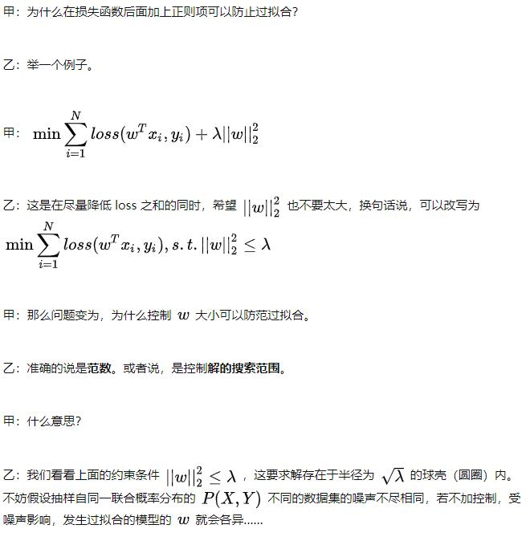

## p范数

当 p>=1时，向量的Lp范数是凸的。(这也是为什么一般不用L0范数的原因之一)

## 正则化
正则化项对b的更新没有影响，但是对于w的更新有影响。
L2正则（Ridge岭回归）和L1正则（Lasso回归）

> 因为范数影响了搜索空间。范数越小，说明w中越多项趋向于0，整个模型就越简单

L2转换为优化问题

L1转换为优化问题

图解L2和L1正则最优化

以二维情况讨论，上图左边是 L2 正则化，右边是 L1 正则化。从另一个方面来看，满足正则化条件，实际上是求解蓝色区域与黄色区域的交点，即同时满足限定条件和 Ein 最小化。对于 L2 来说，限定区域是圆，这样，得到的解 w1 或 w2 为 0 的概率很小，很大概率是非零的。

对于 L1 来说，限定区域是正方形，方形与蓝色区域相交的交点是顶点的概率很大，这从视觉和常识上来看是很容易理解的。也就是说，方形的凸点会更接近 Ein 最优解对应的 wlin 位置，而凸点处必有 w1 或 w2 为 0。这样，得到的解 w1 或 w2 为零的概率就很大了。所以，L1 正则化的解具有稀疏性。

扩展到高维，同样的道理，L2 的限定区域是平滑的，与中心点等距；而 L1 的限定区域是包含凸点的，尖锐的。这些凸点更接近 Ein 的最优解位置，而在这些凸点上，很多 wj 为 0。

为什么L1是方的，是有四条直线组成的，x1+x2=a 等四条直线组成

图解
