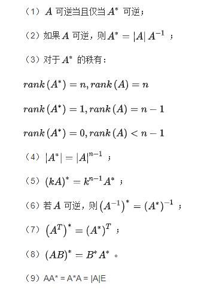
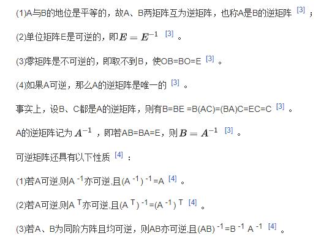
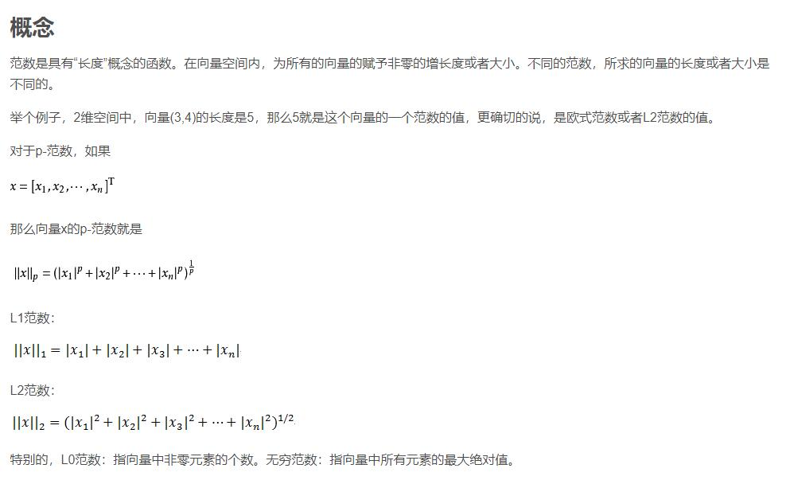

 
## 线性函数
【线性函数】的定义：
函数图像为直线的函数.在数学里,线性函数（包括一次函数）这名词主要是用于两种不同,但相关的领域.
【线性关系】
两个变量之间存在一次函数关系,就称它们之间存在线性关系.
正比例关系是线性关系中的特例,反比例关系不是线性关系.
更通俗一点讲,如果把这两个变量分别作为点的横坐标与纵坐标,其图象是平面上的一条直线,则这两个变量之间的关系就是线性关系.
综上所述：线性函数为一次函数.
因此,可知道：
y=a+bx²是二次函数,图像为抛物线； ———————非线性函数
y=a+bx是一次函数,图像为直线；—————————是线性函数

## 基向量

在线性代数中，基(basis)（也称为基底）是描述、刻画向量空间的基本工具。向量空间的基是它的一个特殊的子集，基的元素称为基向量。**向量空间中任意一个元素，都可以唯一地表示成基向量的线性组合（基向量的缩放）**。如果基中元素个数有限，就称向量空间为有限维向量空间，将元素的个数称作向量空间的维数。

> [为什么说是线性组合？ 3:20'](https://www.bilibili.com/video/BV1ys411472E?p=3)

## 线性变换 linear transformation
线性映射（ linear mapping）是从一个向量空间V到另一个向量空间W的映射且保持加法运算和数量乘法运算，而线性变换（linear transformation）是线性空间V到其自身的线性映射。

线性变换把一个向量空间里的向量映射到了另一个向量空间里的另一个向量，因此，我们可以把线性变换理解成输入一个向量，然后输出一个向量的特殊函数。

它可以看成一个动态的过程，比如旋转、伸缩或者投影之类的升降维的操作。

https://www.bilibili.com/video/BV1ys411472E?p=3

## 行列式 det
https://www.bilibili.com/video/BV1ys411472E?p=7

向量的面积

> A的逆矩阵记为A-1 ,如果 det(A) != 0 , 那么A就存在逆矩阵
> A* A的逆矩阵 = 单位矩阵E(对角线为1，其它为0；如同数的乘法中的1)

## 点积 dot
> np.dot(a, b) or a@b

https://www.bilibili.com/video/BV1ib411t7YR?p=10

当a和b是向量时，a@b = a在b上投影长度 * b
a = [3,1]
b = [2,-1]
叉积=向量a和b形成的四边形的面积 = 行列式

## 矩阵

非/奇异矩阵都是方阵
奇异矩阵 D=0

非奇异矩阵(满秩矩阵) D!=0(行列式！=0)
非奇异矩阵，即行列式不为0的矩阵，矩阵满秩，矩阵可逆，向量组线性无关。
非奇异矩阵可以找到逆矩阵，即可逆方阵就是非奇异方阵。

单位矩阵 E

伴随矩阵 A*

逆矩阵 A-1

投影矩阵 projection ma  trix

投影矩阵， P = A(ATA)-1AT, 这个公式的作用就是投影， 比如P*b就是将向量b投影到距离它的列空间最近的位置；

举两个极端的例子，

如果向量b位于它自己的列空间中， 那么向量b在其列空间中的投影就是它自己， 即：Pb = b。
如果向量b与它自己的列空间垂直， 那么向量b在其列空间中的投影就是0， 即：Pb = 0。

等价（只有秩相同）–>合同（秩和正负惯性指数相同）–>相似（秩，正负惯性指数，特征值均相同），矩阵亲密关系的一步步深化。

 
两矩阵等价的概念：设A、B是两个同型矩阵，若存在可逆矩阵P、Q，使得PAQ=B，则称矩阵A与B等价，记作 A≌B。

两矩阵合同的概念：设A、B是两个n阶方阵，若存在可逆矩阵C，使得C^TAC=B，则称方阵A与B合同，记作 A≃B。

两矩阵相似的概念：设A、B为n阶矩阵，如果有n阶可逆矩阵P存在，使得P^(-1)AP=B，则称矩阵A与B相似，记为A~B。（正交相似同时也是合同）

## 向量的长度/范数/模

向量α的点积开根号= 根号(α.α) = ||α||

||α|| = 1，则α是单位向量，也可以标准化（单位化）一个向量β = (1/||α||)α，使得这个向量的范数=1

## 范数（矩阵的范数，L0,L1,L2范数（双竖线，有下标））

更多参考：
[向量与矩阵的范数（比较1-范数、2-范数、无穷范数、p-范数、L0范数 和 L1范数等）](https://blog.csdn.net/zaishuiyifangxym/article/details/81673491)

## 微积分

我们通常所说的微积分，其实就是微分+积分，所谓微分，就是将图形分成若干个微小的矩形，所谓积分，就是将这些矩形的面积相加。

导数:是指函数在某一点处变化的快慢,是一种变化率。
微分：是指函数在某一点处（趋近于无穷小）的变化量，是一种变化的量。

## 导数

导数(derivative),最早被称为**微商**,即微小变化量之商,导数一名称是根据derivative的动词derive翻译而来,柯林斯上对derive的解释是：
> If you say that something such as a word or feeling derives or is derived from something else, you mean that it comes from that thing. 
翻译为衍生。以及derivative的解释是：
> A derivative is something which has been developed or obtained from something else.

即衍生物。最早将导数称作derivative,本意是因为它是由  这一式子所导出，是“导出来的数”。后来中文翻译借鉴英文称之为导数。

但是有趣的是，最早牛顿将导数称为流数，即fluxion.

