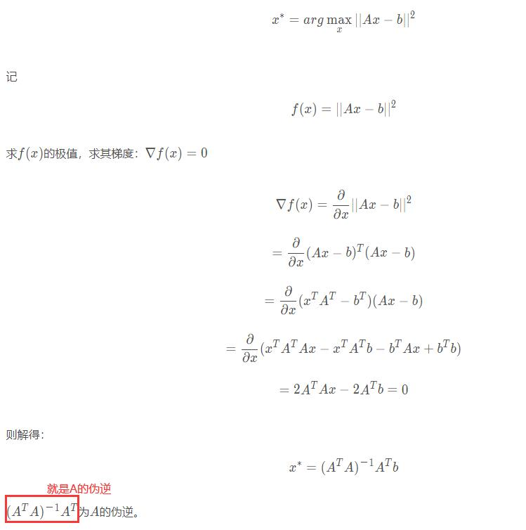
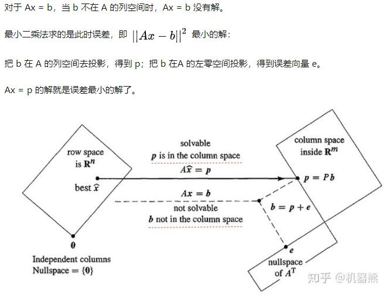

## 图解机器学习的数学直觉：线性代数，微积分，PCA
https://www.bilibili.com/video/BV1iW411T781

## 如何理解最小二乘法？
https://blog.csdn.net/ccnt_2012/article/details/81127117

[经典的推导](https://www.bilibili.com/video/BV1aE411o7qd?p=9)
[一文让你彻底搞懂最小二乘法（超详细推导](https://blog.csdn.net/MoreAction_/article/details/106443383)

最小二乘法解中ATA不可逆时参考[最小二乘法（二）](https://blog.csdn.net/sjyttkl/article/details/80071664) 和 [最大似然估计推导最小二乘法以及解释矩阵不可逆的问题](https://blog.csdn.net/zzzz_123123/article/details/97617487) 和 [梯度下降法推导最小二乘法以及解释矩阵不可逆的问题](https://blog.csdn.net/plm199513100/article/details/102873681)

小二乘法的几何意义是高维空间的一个向量（由y数据决定）在低维子空间（由x数据以及多项式的次数决定）的投影。

> 线性回归（最小二乘法） 当ATA不可逆时(实际上我不需要求ATA的逆，w的解实际上就等于矩阵X的伪逆*Y)，添加L1或L2正则化 就变成了Lasso 回归和 Ridge回归,也可使用SGD（SGDRegressor）

> 伪逆具有**存在且唯一**的良好性质，可以用于解决最小二乘（Wx+B的部分）和最小范数问题(正则项部分)。最小二乘问题是对于一个超定矩阵而言的，最小二乘问题的解是能够最小化残差的解。而最小范数问题是针对欠定矩阵矩阵而言，对这类线性方程组不存在唯一解，伪逆给出的是所有的解2范数最小的。

> [正定、超定、欠定矩阵](https://blog.csdn.net/parker_1/article/details/99647370)

## 如何理解主元分析（PCA）？
https://matongxue.blog.csdn.net/article/details/82254488
[PCA的数学原理](http://blog.codinglabs.org/articles/pca-tutorial.html)

[通俗易懂的PCA原理及代码实现(超详细推导)](https://blog.csdn.net/MoreAction_/article/details/107463336)

## SVM 支持向量机算法-原理篇
https://www.cnblogs.com/codeshell/p/14301569.html

## 奇异值分解SVD
[如何通俗地理解奇异值](https://www.matongxue.com/madocs/306)
[奇异值的物理意义是什么？](https://www.zhihu.com/question/22237507/answer/225371236)

## 降维
[白板推导系列(系列五) 降维1-背景 视频](https://www.bilibili.com/video/BV1aE411o7qd?p=22)

13分的时候就知道为什么在边缘了

[白板推导系列(系列五) 降维1-背景 文字](https://www.yuque.com/books/share/f4031f65-70c1-4909-ba01-c47c31398466/kg2npf)

## 逻辑回归
[逻辑回归（非常详细）](https://zhuanlan.zhihu.com/p/74874291)

## 综合
[难懂的数学】傅里叶、拉普拉斯、卷积、欧拉方程、梯度散度、拉格朗日方程、奈奎斯特采样、虚数等抽象难懂数学一网打尽](https://www.bilibili.com/video/BV1kX4y1u7GJ)