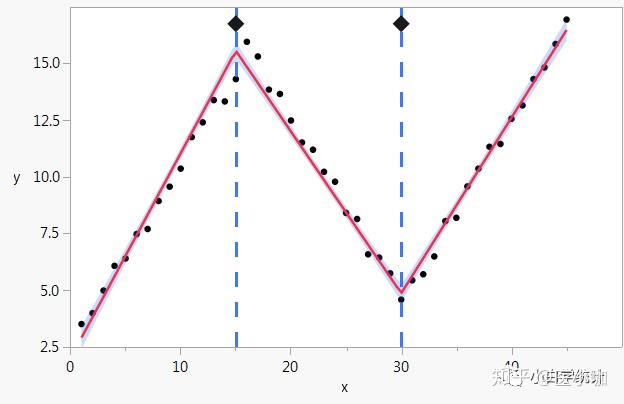
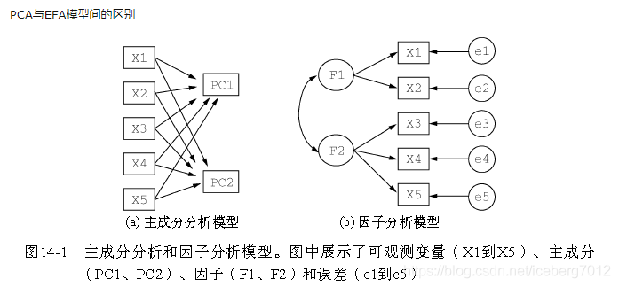
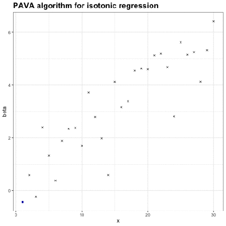
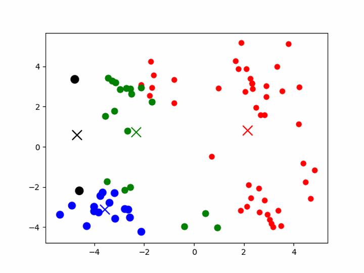
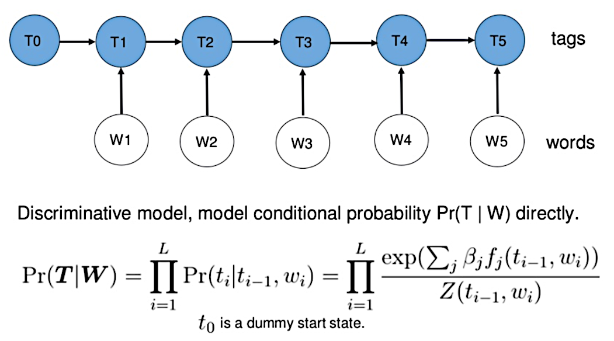
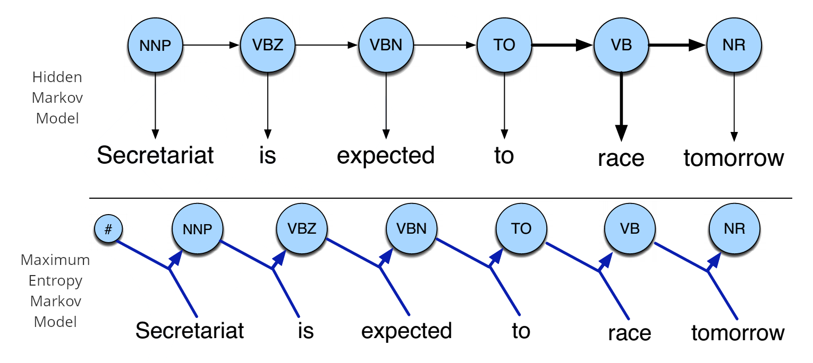
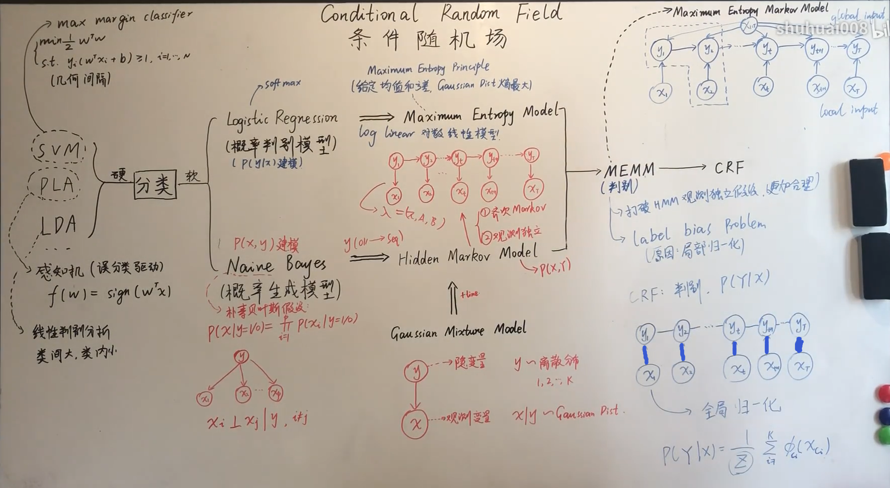
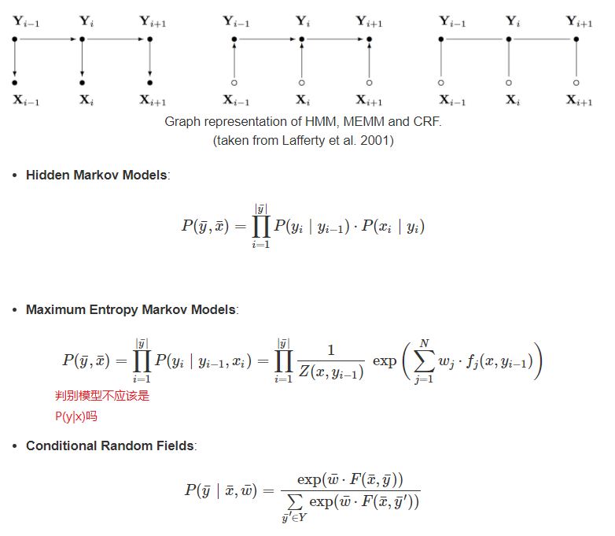

## Generalized Linear Regression 通用线性回归

[Generalized Linear Regression](https://scikit-learn.org/stable/modules/linear_model.html#generalized-linear-regression)

[Generalized Linear Models Explained with Examples](https://vitalflux.com/generalized-linear-models-explained-with-examples/)

[Generalized Linear Model Theory - 推荐](https://data.princeton.edu/wws509/notes/a2.pdf)

[Generalized Linear Models](https://www.stat.cmu.edu/~ryantibs/advmethods/notes/glm.pdf)

> 这一家族中的模型形式基本上都差不多，不同的就是因变量(Y)不同，如果是连续的，就是多重线性回归，如果是二项分布，就是logistic回归，如果是poisson分布，就是poisson回归，如果是负二项分布，就是负二项回归，等等。只要注意区分它们的因变量就可以了。logistic回归的因变量可以是二分类的(二项逻辑回归)，也可以是多分类的（多项逻辑回归或者softmax回归），但是二分类的更为常用，也更加容易解释。所以实际中最为常用的就是二分类的logistic回归。

### 逻辑回归(也是一种广义线性模型)
[逻辑回归（非常详细）](https://zhuanlan.zhihu.com/p/74874291)
[机器学习实现与分析之四（广义线性模型）](http://blog.sina.com.cn/s/blog_13ec1876a0102xb47.html)

[逻辑回归——Logistic的起源](https://www.bilibili.com/video/BV1W3411z71D)
[Logistic回归的起源（上）](https://zhuanlan.zhihu.com/p/146206709)
[Logistic回归的起源（中）](https://zhuanlan.zhihu.com/p/147708076)
[Logistic回归的起源（下）](https://zhuanlan.zhihu.com/p/155027693)

[6.2 Logistic Regression and the Cross Entropy Cost - Logistic regression sklearn中代价函数](https://jermwatt.github.io/machine_learning_refined/notes/6_Linear_twoclass_classification/6_2_Cross_entropy.html)

> y属于0或1 (我们假设样本是服从伯努利分布(0-1分布)的，然后求得满足该分布的似然函数，最终求该似然函数的极大值)

[6.3 Logistic Regression and the Softmax Cost-Logistic regression sklearn中代价函数](https://jermwatt.github.io/machine_learning_refined/notes/6_Linear_twoclass_classification/6_3_Softmax.html)

> [y属于-1或1](https://github.com/jermwatt/machine_learning_refined/blob/gh-pages/notes/6_Linear_twoclass_classification/6_3_Softmax.ipynb)

> Logistic回归的损失函数:负对数似然,negative log likelihood(NLL), 负的log似然

> Softmax回归是Logistic回归的多分类情况。
> LogisticRegression 就是一个被logistic方程归一化后的线性回归。将预测的输出映射到0,1之间。

> 逻辑斯蒂回归模型的思想跟线性回归模型思想不一样，线性回归模型思想是最小化真实值与模型预测值的误差，而逻辑斯蒂回归模型思想就比较狠了，预测值预测对了损失函数就是0，错了损失就是无穷大，我个人的理解(一般采用的是-log(h(x)) 这是一个凸函数,刚好满足要求)

## 线性样条回归分析(linear spline regression)

[Using splines in regression](http://nickreich.github.io/stat-modeling-2015/assets/lectures/lecture12-splines/lecture12-splines.pdf)

## Least Angle Regression 最小角回归
[Least Angle Regression](https://web.stanford.edu/~hastie/Papers/LARS/LeastAngle_2002.pdf)

[最小角回归法](https://www.cnblogs.com/pinard/p/6018889.html)

> 由于LARS的迭代方向是根据目标的残差而定，所以该算法**对样本的噪声极为敏感**。

## 图解机器学习的数学直觉：线性代数，微积分，PCA
https://www.bilibili.com/video/BV1iW411T781

## 如何理解主元分析（PCA）？
https://matongxue.blog.csdn.net/article/details/82254488
[PCA的数学原理](http://blog.codinglabs.org/articles/pca-tutorial.html)

[通俗易懂的PCA原理及代码实现(超详细推导)](https://blog.csdn.net/MoreAction_/article/details/107463336)

> 主成分分析，是分析维度属性的主要成分表示。
> 因子分析，是分析属性们的公共部分的表示。
> 二者均应用于高斯分布的数据，非高斯分布的数据采用独立成分分析ICA算法
> 如果做分类问题之前用PCA降维，效果可能会更差

## 因子分析Factor Analysis(FA)
> 可以应用于高维数据 维度m>>p

每个变量都可以表示成公共因子的线性函数与特殊因子之和

$$X_i = a_{i1}F_1 + a_{i2}F_2 +...++ a_{im}F_m  + \epsilon_i  ,(i=1,2,...,p) $$

式中的F1，F2，…，Fm称为公共因子，εi称为Xi的特殊因子。该模型可用矩阵表示为：`X = AF+ε`
X 表示原始数据，矩阵A称为因子载荷矩阵,F表示公共因子， ε是特殊因子
aij称为因子“载荷”，是第i个变量在第j个因子上的负荷，如果把变量Xi看成m维空间中的一个点，则aij表示它在坐标轴Fj上的投影。
$X = [X_1,X_2...X_p]^T$

$A= \begin{bmatrix}
a_{11} & a_{12} & ... & a_{1m} \\\\
a_{21} & a_{22} & ... & a_{2m} \\\\
... & ... & ... & ... \\\\
a_{p1} & a_{p2} & ... & a_{pm} \\\\
\end{bmatrix}$

$F = [F_1,F_2...F_m]^T$

$\epsilon = [\epsilon_1,\epsilon_2...\epsilon_p]^T$

`m<=p`

## Independent component analysis(ICA)，独立成分分析
[Independent component analysis](https://en.jinzhao.wiki/wiki/Independent_component_analysis)

`X=AS`
`Y=WX=WAS  ， A = inv(W)`
ICA(Independent Component Correlation Algorithm)是一种函数，X为n维观测信号矢量，S为独立的m（m<=n)维未知源信号矢量，矩阵A被称为混合矩阵。
ICA的目的就是寻找解混矩阵W（A的逆矩阵），然后对X进行线性变换，得到输出向量Y。

ICA是找出构成信号的相互独立部分(不需要正交)，对应高阶统计量分析。ICA理论认为用来观测的混合数据阵X是由独立元S经过A线性加权获得。
ICA理论的目标就是通过X求得一个分离矩阵W，使得W作用在X上所获得的信号Y是独立源S的最优逼近，

[独立成分分析 (ICA) 应用参考(Origin来做ICA分析)](https://www.bilibili.com/video/BV1w54y1G7bw)

[独立成分分析 - 讲解的原理](https://www.bilibili.com/video/BV1mQ4y1M7wB)

[Independent Component Analysis (ICA)](http://www.sci.utah.edu/~shireen/pdfs/tutorials/Elhabian_ICA09.pdf)

## SVM 支持向量机算法-原理篇
https://www.cnblogs.com/codeshell/p/14301569.html

[胡浩基教授SVM](files/胡浩基-机器学习笔记/1. 支持向量机的理论推导.pdf)

[支持向量机-完整版](files/支持向量机.pdf)

[李宏毅深度学习笔记-SVM支持向量机](https://www.cnblogs.com/wry789/p/13110305.html)
深度学习和SVM的区别:
深度学习的隐藏层可以看成是特征转换，输出层可以看成是线性分类器。

SVM也是做类似的事情，先用一个核函数，把特征转换到高维空间上，再在高维空间使用线性分类器，线性分类器的损失函数一般使用hinge loss。

## 奇异值分解SVD
[如何通俗地理解奇异值](https://www.matongxue.com/madocs/306)
[奇异值的物理意义是什么？](https://www.zhihu.com/question/22237507/answer/225371236)
[Singular value decomposition](https://en.jinzhao.wiki/wiki/Singular_value_decomposition)
[We Recommend a Singular Value Decomposition](http://www.ams.org/publicoutreach/feature-column/fcarc-svd)
## 降维
[白板推导系列(系列五) 降维1-背景 视频](https://www.bilibili.com/video/BV1aE411o7qd?p=22)

13分的时候就知道为什么在边缘了

[白板推导系列(系列五) 降维1-背景 文字](https://www.yuque.com/books/share/f4031f65-70c1-4909-ba01-c47c31398466/kg2npf)

## 线性判别分析LDA

[线性判别分析LDA原理总结](https://www.cnblogs.com/pinard/p/6244265.html)
[LDA](http://www.sci.utah.edu/~shireen/pdfs/tutorials/Elhabian_LDA09.pdf)
[Linear Discriminant Analysis (LDA)](https://dragonwarrior15.github.io/statistical-learning-notes/notes/machine_learning/chapters/classification/lda.html)

[线性判别分析（Linear Discriminant Analysis）](https://blog.csdn.net/daunxx/article/details/51881956)

- 线性判别分析（LDA）假设$f_k(x)$是均值不同，方差相同的高斯分布
- 二次判别分析（QDA）假设$f_k(x)$是均值不同，方差也不同的高斯分布
- 高斯混合模型（GMM）假设$f_k(x)$是不同的高斯分布的组合
- 很多非参数方法假设$f_k(x)$是参数的密度函数，比如直方图
- 朴素贝叶斯假设$f_k(x)$是$C_k$边缘密度函数，即类别之间是独立同分布的
- 如果在 QDA 模型中假设协方差矩阵是对角矩阵，则假设输入在每个类中条件独立，并且生成的分类器等效于高斯朴素贝叶斯分类器naive_bayes.GaussianNB

[机器学习-白板推导系列(四)-线性分类（Linear Classification）+ 推荐](https://www.bilibili.com/video/BV15W41127L2)
[线性判别分析（Linear Discriminant Analysis）（一）+ 推荐](https://www.cnblogs.com/jerrylead/archive/2011/04/21/2024384.html)

> [为什么叫线性判别分析和二次判别分析](https://scikit-learn.org/stable/modules/lda_qda.html#lda)
> 1. [The Elements of Statistical Learning](https://web.stanford.edu/~hastie/ElemStatLearn/printings/ESLII_print12_toc.pdf) 128页的(4.10)和129页的(4.12)
> 2. [R. O. Duda, P. E. Hart, D. G. Stork. Pattern Classification (Second Edition)](https://github.com/kingreatwill/files/blob/main/ebook/Pattern%20Classification%20by%20Richard%20O.%20Duda%2C%20David%20G.%20Stork%2C%20Peter%20E.Hart%20.pdf)59页2.6.2 Case 2: Σi = Σ  (大概的意思是展开后二次项与i无关，可以丢掉)

### 高斯视角
高斯判别分析（Gaussian discriminant analysis model, GDA）- 生成学习算法

[GDA（高斯判别分析）是 LDA（线性判别分析）和 QDA（二次判别分析）的通用术语，其中给定类别的每个观察的似然概率，即 P(x|y) 可以通过多变量建模高斯分布。](https://stats.stackexchange.com/questions/17614/gda-and-lda-terminology/269702#269702)

[LDA - QDA](http://personal.psu.edu/jol2/course/stat597e/notes2/lda.pdf)

[Linear and Quadratic Discriminant Analysis](https://scikit-learn.org/stable/modules/lda_qda.html)

[机器学习实现与分析之五（高斯判别分析）](http://blog.sina.com.cn/s/blog_13ec1876a0102xb48.html)

[【机器学习】高斯判别分析](https://zhuanlan.zhihu.com/p/95956492)

## 综合
[难懂的数学】傅里叶、拉普拉斯、卷积、欧拉方程、梯度散度、拉格朗日方程、奈奎斯特采样、虚数等抽象难懂数学一网打尽](https://www.bilibili.com/video/BV1kX4y1u7GJ)

[机器学习算法的动画可视化](https://davpinto.github.io/ml-simulations)

### 保序回归：单调不减
 

### K-means聚类

1. 给定一组样本，确定k值，即类别数目
1. 随机初始化k个聚类的中心（质心，下称中心）
1. 计算每个样本与每一个中心的相似的程度——距离
1. 考察每个样本，离哪一个中心更近，就将该样本分为哪一类
1. 所有样本划分完毕后，根据已分好的数据，重新计算聚类的中心
1. 重复3、4、5，直到中心不变或者变化很小

[可视化k-means](https://www.naftaliharris.com/blog/visualizing-k-means-clustering/)
[可视化Visualizing DBSCAN Clustering](https://www.naftaliharris.com/blog/visualizing-dbscan-clustering/)

### Gaussian mixture models
[Gaussian mixture models](https://mbernste.github.io/posts/gmm_em/)
[极大似然估计、EM算法及高斯混合模型](https://blog.csdn.net/chris_xy/article/details/88970322)
[EM算法与GMM（高斯混合聚类）Jensen不等式和变分法两种推导](https://zhuanlan.zhihu.com/p/50686800)

[Expectation-maximization algorithm EM算法](https://encyclopedia.thefreedictionary.com/Expectation-maximization+algorithm)
[Mixture model](https://encyclopedia.thefreedictionary.com/Mixture+model)
[Gaussian Mixture Model](https://brilliant.org/wiki/gaussian-mixture-model/)

### 概率潜在语义分析(Probabilistic Latent Semantic Analysis，PLSA)

[概率潜在语义分析(PLSA)解析 | 统计学习方法](https://zhuanlan.zhihu.com/p/270889121)

### Latent Dirichlet Allocation
[用scikit-learn学习LDA主题模型](https://www.cnblogs.com/pinard/p/6908150.html)
[2.5.7. Latent Dirichlet Allocation (LDA)](https://scikit-learn.org/stable/modules/decomposition.html#latent-dirichlet-allocation-lda)
[文本主题模型之LDA(三) LDA求解之变分推断EM算法](https://www.cnblogs.com/pinard/p/6873703.html)

scikit-learn除了标准的变分推断EM算法外，还实现了另一种在线变分推断EM算法，它在原理篇里的变分推断EM算法的基础上，为了避免文档内容太多太大而超过内存大小，而提供了分步训练(partial_fit函数)，即一次训练一小批样本文档，逐步更新模型，最终得到所有文档LDA模型的方法。这个改进算法我们没有讲，具体论文在这
[Online Learning for Latent Dirichlet Allocation](https://papers.nips.cc/paper/2010/file/71f6278d140af599e06ad9bf1ba03cb0-Paper.pdf) M. Hoffman, D. Blei, F. Bach, 2010

[Latent Dirichlet allocation](https://encyclopedia.thefreedictionary.com/Latent+Dirichlet+Allocation)

### Hidden Markov Models

[Hidden Markov model](https://encyclopedia.thefreedictionary.com/hidden+Markov+model)

[Hidden Markov Models and Gaussian Mixture Models](http://www.inf.ed.ac.uk/teaching/courses/asr/2012-13/asr03-hmmgmm-4up.pdf)

[hmmlearn](https://github.com/hmmlearn/hmmlearn)

### Maximum Entropy Markov Model

[Maximum-entropy Markov model](https://en.jinzhao.wiki/wiki/Maximum-entropy_Markov_model)

### Conditional random field
[Conditional random field](https://encyclopedia.thefreedictionary.com/Conditional+random+field)

隐马尔可夫模型（Hidden Markov Model，HMM），最大熵马尔可夫模型（Maximum Entropy Markov Model，MEMM）以及条件随机场（Conditional Random Field，CRF）是序列标注中最常用也是最基本的三个模型。
[HMM、CRF、MEMM区别](https://www.cnblogs.com/gczr/p/10248232.html)

> HMM -> MEMM： HMM模型中存在两个假设：一是输出观察值之间严格独立，二是状态的转移过程中当前状态只与前一状态有关。但实际上序列标注问题不仅和单个词相关，而且和观察序列的长度，单词的上下文，等等相关。MEMM解决了HMM输出独立性假设的问题。因为HMM只限定在了观测与状态之间的依赖，而MEMM引入自定义特征函数，不仅可以表达观测之间的依赖，还可表示当前观测与前后多个状态之间的复杂依赖。

> MEMM -> CRF:CRF不仅解决了HMM输出独立性假设的问题，还解决了MEMM的标注偏置问题，MEMM容易陷入局部最优是因为只在局部做归一化，而CRF统计了全局概率，在做归一化时考虑了数据在全局的分布，而不是仅仅在局部归一化，这样就解决了MEMM中的标记偏置的问题。使得序列标注的解码变得最优解。

> HMM、MEMM属于有向图，所以考虑了x与y的影响，但没讲x当做整体考虑进去（这点问题应该只有HMM）。CRF属于无向图，没有这种依赖性，克服此问题。

[Hidden Markov Model and Naive Bayes relationship](http://www.davidsbatista.net/blog/2017/11/11/HHM_and_Naive_Bayes/)
[Maximum Entropy Markov Models and Logistic Regression](http://www.davidsbatista.net/blog/2017/11/12/Maximum_Entropy_Markov_Model/)
[Conditional Random Fields for Sequence Prediction](http://www.davidsbatista.net/blog/2017/11/13/Conditional_Random_Fields/)

### Random projection
[Johnson–Lindenstrauss lemma](https://en.jinzhao.wiki/wiki/Johnson%E2%80%93Lindenstrauss_lemma)
[Random projection](https://en.jinzhao.wiki/wiki/Random_projection)

Gaussian random projection & Sparse random projection 区别在于生成random matrix的方式不同（Sparse指的也是random matrix是Sparse的），而random matrix用于投影的，维度是降维后的维度*降维前的维度（Sparse：transformer.components_.toarray()；Gaussian：transformer.components_）
