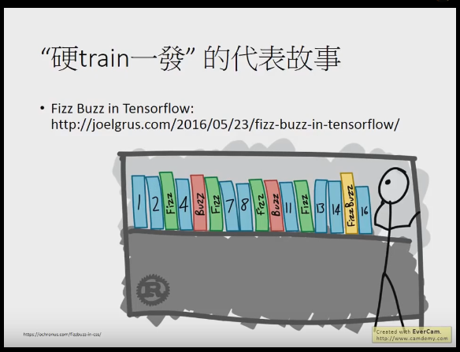

## 硬train一发

硬train一发 是从李宏毅老师的课程中看到的，感觉特别有意思，讲的是一个面试者被问编程输出Fizz Buzz的问题(其实类似yes/no的问题)，然后他的回答是用神经网络训练了，结果是最终的正确率不够。
这个硬train一发 意思就是不管什么问题，都可以用神经网络来解决。
按照李老师说的原话：
> 硬train一发是一种信念，是一种梦想，是一种浪漫，是人类最原始的冲动，是亘古以来人类的目标。—— 李宏毅

而且，硬train一发需要三个必要条件：

- 一个问题，不要想太多，直接用deep learning train
- 开始train之前，旁边必须有一个有很不屑的表情的人说，“这个应该train不起来吧”
- train后出了结果，还要有人说，“我靠，这样居然也能train起来”

最初的来源： https://joelgrus.com/2016/05/23/fizz-buzz-in-tensorflow/
github： https://github.com/joelgrus/fizz-buzz-tensorflow
李老师的视频： https://www.youtube.com/watch?v=F1vek6ULo9w&feature=youtu.be

其它同学的代码
``` python
import numpy as np
from keras.layers.core import Dense,Activation,Dropout
from keras.models import Sequential
from keras.layers import Conv2D,MaxPooling2D,Flatten
from keras.optimizers import SGD,Adam
from keras.utils import np_utils

x=np.zeros((5000,15),dtype=np.int)
y=np.zeros((5000,4),dtype=np.int)
for i in range(1,5001):
    fizz=buzz=0
    if not i%3:
        fizz=1
    if not i%5:
        buzz=1
    i-=1
    if fizz and buzz:
        y[i][2]=1
    elif fizz and not buzz:
        y[i][0]=1
    elif not fizz and buzz:
        y[i][1]=1
    else:
        y[i][3]=1
    temp=i+1
    for j in range(15):
        x[i,j]=temp%2
        temp //= 2
x_test=x[:1000]
y_test=y[:1000]
x_train=x[1000:]
y_train=y[1000:]

model=Sequential()
model.add(Dense(input_dim=15,units=1000))
model.add(Activation('relu'))
model.add(Dense(units=4))
model.add(Activation('softmax'))
model.compile(loss='categorical_crossentropy',optimizer='adam',metrics=['accuracy'])
model.fit(x_train,y_train,batch_size=20,epochs=100)
result=model.evaluate(x_test,y_test,batch_size=1000)
print(f'精确率{result[1]}')
```

## 鸡尾酒会效应

鸡尾酒会效应（英语：cocktail party effect）是指人的一种听力选择能力，在这种情况下，注意力集中在某一个人的谈话之中而忽略背景中其他的对话或噪音。该效应揭示了人类听觉系统中令人惊奇的能力，即我们可以在噪声中谈话。

