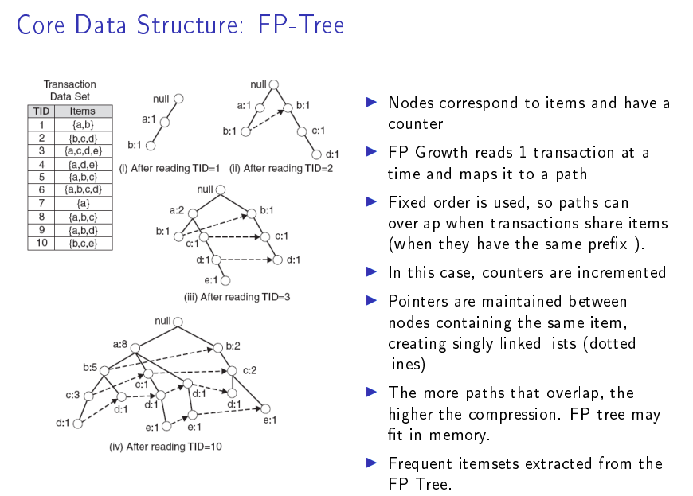

<!--  -->
# 数据挖掘
## 分析方法
### 关联分析
关联分析，也叫关联规则挖掘，属于无监督算法的一种，它用于从数据中挖掘出潜在的关联关系，例如经典的啤酒与尿布的关联关系。
[Association rule learning](https://en.jinzhao.wiki/wiki/Association_rule_learning)

#### 基本概念
**项集**：“属性-值”对的集合，一般情况下在实际操作中会省略属性。
**候选项集**：用来获取频繁项集的候选项集，候选项集中满足支持度条件的项集保留，不满足条件的舍弃。
**频繁项集**（Frequent Item Sets）：在所有训练元组中同时出现的次数超过人工定义的阈值的项集称为频繁项集。
**极大频繁项集**：不存在包含当前频繁项集的频繁超集，则当前频繁项集就是极大频繁项集。
**k项集**：项集中的每个项有k个“属性-值”对的组合。每个频繁项集都是一个k-项集

**关联分析**（Association Analysis）：在大规模数据集中寻找有趣的关系。
这些关系可以有两种形式：（前者是后者的抽象基础）
1. **代表共现关系的频繁项集：频繁项集（frequent item sets）** 是经常出现在一块儿的物品的集合，它暗示了某些事物之间总是结伴或成对出现。本质上来说，不管是因果关系还是相关关系，都是共现关系，所以从这点上来讲，频繁项集是覆盖量（coverage）这个指标的一种度量关系。
2. **代表因果/相关关系的关联规则：关联规则（association rules）** 暗示两种物品之间可能存在很强的关系，它更关注的是事物之间的互相依赖和条件先验关系。它暗示了组内某些属性间不仅共现，而且还存在明显的相关和因果关系，关联关系一种更强的共现关系。所以从这点上来将，关联规则是准确率（accuracy）这个指标的一种度量关系。

关联分析步骤：
1. 发现频繁项集，即计算所有可能组合数的支持度，找出不少于人为设定的最小支持度的集合。
2. 发现关联规则，即计算不小于人为设定的最小支持度的集合的置信度，找到不小于认为设定的最小置信度规则。

Transaction ID|商品
---|---
Transaction 0|豆奶，莴笋
Transaction 1|莴笋，尿布，啤酒，酸菜
Transaction 2|豆奶，尿布，啤酒，橙汁
Transaction 3|豆奶，莴笋，尿布，啤酒
Transaction 4|豆奶，莴笋，尿布，橙汁

> 当然还有一种稀疏矩阵的表示方式，用项集作为列，0和1表示有无


项集(Item Set)$I=\{豆奶，莴笋，尿布，啤酒，酸菜，橙汁\}$
数据$D = \{t_0,t_1,t_2,t_3,t_4\}$

$\{{\mathrm  {butter,bread}}\}\Rightarrow \{{\mathrm  {milk}}\}$ 表示买了butter,bread也会买milk


从表中可以看出：

频繁项集是指那些经常出现在一起的商品集合，图中的集合{啤酒,尿布,豆奶}就是频繁项集的一个例子；
从这个数据集中也可以找到诸如 $尿布\Rightarrow 啤酒$ 的关联规则，即如果有人买了尿布，那么他很可能也会买啤酒。

这里我们注意，为什么是说 $尿布\Rightarrow 啤酒$ 的关联规则，而不是 $啤酒\Rightarrow 尿布$ 的关联规则呢？因为我们注意到，在第4行，出现了尿布，但是没有出现啤酒，所以这个关联推导是不成立的，反之却成立（至少在这个样本数据集里是成立的）。

#### 频繁项集
**支持度**（support）- 定量评估频繁项集（k-项集）的频繁共现度（即覆盖度）的统计量
所以频繁项集的指标就是设置支持度的最小阈值
$$support(A\Rightarrow B) = P(A \cup B) = \frac{A和B同时出现的次数}{样本数量}$$

##### apriori算法
[mlxtend中的apriori实现](http://rasbt.github.io/mlxtend/api_subpackages/mlxtend.frequent_patterns/)
`apriori(df, min_support=0.5, use_colnames=False, max_len=None, verbose=0, low_memory=False)`

**两个定理**
Apriori定律1：如果一个集合是频繁项集，则它的所有子集都是频繁项集
Apriori定律2：如果一个集合不是频繁项集，则它的所有超集都不是频繁项集

**Apriori算法流程**
1. 扫描数据库，生成候选1项集和频繁1项集。
1. 从2项集开始循环，由频繁k-1项集生成频繁频繁k项集。
    1. 频繁k-1项集生成2项子集，这里的2项指的生成的子集中有两个k-1项集。
    例如有3个2项频繁集｛a, b｝｛b, c｝｛c, f｝，则它所有的2项子集为｛｛a, b｝｛b, c｝｝｛｛a, b｝｛e, f｝｝｛｛b, c｝｛c, f｝｝
    1. 对由2.1生成的2项子集中的两个项集根据上面所述的定理 i 进行连接，生成k项集。
    1. 对k项集中的每个项集根据如上所述的定理 ii 进行计算，舍弃掉子集不是频繁项集即不在频繁k-1项集中的项集。
    1. 扫描数据库，计算2.3步中过滤后的k项集的支持度，舍弃掉支持度小于阈值的项集，生成频繁k项集。
1.  当当前生成的频繁k项集中只有一个项集时循环结束。


##### FP-growth算法
`fpgrowth(df, min_support=0.5, use_colnames=False, max_len=None, verbose=0)`
FP代表频繁模式（Frequent Pattern）


树中的每一条路径代表一条数据

##### FP-max算法
`fpmax(df, min_support=0.5, use_colnames=False, max_len=None, verbose=0)`
FPMAX算法是目前较为高效与稳定的最大频繁项目集挖掘算法之一。

#### 关联规则
**关联规则**（Association Rules）：暗示两个物品之间可能存在很强的关系。
> 类关联规则(Class Based Association Rule): 用关联规则做的分类器
> 就是把每个特征当做“项”，把所有特征当做“项集”；如果是连续特征，将其定义域分割成若干个区间；

相关性度量：
- **支持度**（support）：数据集中包含该项集的记录所占的比例，是针对项集来说的。
$$support(A\Rightarrow B) = P(A \cup B) = \frac{A和B同时出现的次数}{样本数量}$$
同理
$$support(A) = P(A) = \frac{A出现的次数}{样本数量}$$

- **置信度**（confidence）：出现某些物品时，另外一些物品必定出现的概率，针对规则而言。
$$\text{confidence}(A\Rightarrow C) = \frac{\text{support}(A\Rightarrow C)}{\text{support}(A)}, \;\;\; \text{range: } [0, 1]$$
- **提升度**(lift)：
$$\text{lift}(A\Rightarrow C) = \frac{\text{confidence}(A\Rightarrow C)}{\text{support}(C)}, \;\;\; \text{range: } [0, \infty]$$
如果lift(A->C)>1，那么A->C是有关的
如果lift(A->C)=1，那么A和C是独立的(先决条件发生的概率和结果发生的概率是相互独立的)
证明：$\text{lift}(A\Rightarrow C) = \frac{P(A,C)}{P(A)P(C)} = 1 ,得到P(A,C)=P(A)P(C) = P(C|A)P(A)，得到P(C|A)=P(C)$
如果lift(A->C)<1，那么A->C是无关的

- **杠杆率**(leverage)：
$$\text{levarage}(A\Rightarrow C) = \text{support}(A\Rightarrow C) - \text{support}(A) \times \text{support}(C), \;\;\; \text{range: } [-1, 1]$$
levarage(A->C)>0，那么A->C是有关的
levarage(A->C)=0，那么A和C是独立的
levarage(A->C)<0，那么A->C是无关的

- **确信度**(conviction) ：
$$\text{conviction}(A\Rightarrow C) = \frac{1 - \text{support}(C)}{1 - \text{confidence}(A\Rightarrow C)}, \;\;\; \text{range: } [0, \infty]$$
conviction(A->C)>1，那么A->C是有关的
conviction(A->C)=1，那么A和C是独立的
conviction(A->C)<1，那么A->C是无关的

##### 关联规则算法
`association_rules(df, metric='confidence', min_threshold=0.8, support_only=False)`
```
import pandas as pd
from mlxtend.preprocessing import TransactionEncoder
from mlxtend.frequent_patterns import apriori, fpmax, fpgrowth
dataset = [['豆奶', '莴笋'],
           ['莴笋', '尿布', '啤酒', '酸菜'],
           ['豆奶', '尿布', '啤酒', '橙汁'],
           ['豆奶', '尿布', '莴笋', '啤酒'],
           ['豆奶', '莴笋', '尿布', '橙汁']]

te = TransactionEncoder()
te_ary = te.fit(dataset).transform(dataset)
df = pd.DataFrame(te_ary, columns=te.columns_)

frequent_itemsets = fpgrowth(df, min_support=0.6, use_colnames=True)
### alternatively:
#frequent_itemsets = apriori(df, min_support=0.6, use_colnames=True)
#frequent_itemsets = fpmax(df, min_support=0.6, use_colnames=True)

from mlxtend.frequent_patterns import association_rules

association_rules(frequent_itemsets, metric="confidence", min_threshold=0.7)

```
.|antecedents	|consequents	|antecedent support	|consequent support	|support	|confidence	|lift	|leverage	|conviction
---|---|---|---|---|---|---|---|---|---
解释	|k项集A|	k项集B|	support(A)|	support(B)|	support(A->B)|	confidence(A->B)|	lift(A->B)|	leverage(A->B)|	conviction(A->B)
0	|(豆奶)|	(莴笋)|	0.8|	0.8|	0.6|	0.75|	0.9375|	-0.04|	0.8
1	|(莴笋)|	(豆奶)|	0.8|	0.8|	0.6|	0.75|	0.9375|	-0.04|	0.8
2	|(莴笋)|	(尿布)|	0.8|	0.8|	0.6|	0.75|	0.9375|	-0.04|	0.8
3	|(尿布)|	(莴笋)|	0.8|	0.8|	0.6|	0.75|	0.9375|	-0.04|	0.8
4	|(豆奶)|	(尿布)|	0.8|	0.8|	0.6|	0.75|	0.9375|	-0.04|	0.8
5	|(尿布)|	(豆奶)|	0.8|	0.8|	0.6|	0.75|	0.9375|	-0.04|	0.8
6	|(尿布)|	(啤酒)|	0.8|	0.6|	0.6|	0.75|	1.2500|	0.12	|1.6
7	|(啤酒)|	(尿布)|	0.6|	0.8|	0.6|	1.00|	1.2500|	0.12	|inf

> 例子特殊，所以k项集都是1项，实际不一定

#### 参考
[关联规则与Apriori算法](https://www.cnblogs.com/liyuewdsgame/p/13264724.html)
[关联分析算法（Association Analysis）Apriori算法和FP-growth算法初探](https://www.cnblogs.com/LittleHann/p/9398219.html)

[从零实现机器学习算法（十四）FP-growth](https://zhuanlan.zhihu.com/p/67653006)
[Mining Frequent Patterns Without Candidate Generation](http://hanj.cs.illinois.edu/pdf/dami04_fptree.pdf)
[Frequent Pattern (FP) Growth Algorithm In Data Mining](https://www.softwaretestinghelp.com/fp-growth-algorithm-data-mining/)
[High Performance Mining of Maximal Frequent Itemsets](http://www.philippe-fournier-viger.com/spmf/fpmax.pdf)

[Introduction to Data Mining (Second Edition)](https://www-users.cse.umn.edu/~kumar001/dmbook/index.php)


[相关开源算法](http://rasbt.github.io/mlxtend/api_subpackages/mlxtend.frequent_patterns/)
[mlxtend](https://github.com/rasbt/mlxtend)是一款高级的机器学习扩展库，可用于日常机器学习任务的主要工具，也可以作为sklearn的一个补充和辅助工具。
mlxtend主要包括以下模块：
- 分类器
- 聚类器
- 数据
- 评估方法
- 特征提取
- 特征选择
- 文件读写
- 关联算法
- 图像
- 数学
- 绘图
- 预处理
- 回归器
- 文本


### RFM

[用户分析>RFM分析](https://help.aliyun.com/document_detail/135054.html)

[How to segment your customers and increase sales with RFM analysis](https://joaocorreia.io/blog/rfm-analysis-increase-sales-by-segmenting-your-customers.html)

[RFM模型](https://wiki.mbalib.com/wiki/RFM%E6%A8%A1%E5%9E%8B)

<!--  -->