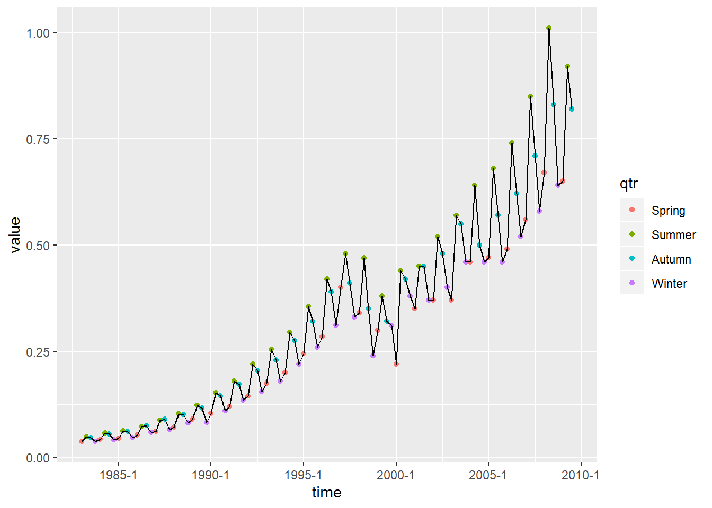

[TOC]
# Time Series

**时间序列分析**（[Time Series Analysis](https://en.jinzhao.wiki/wiki/Time_series)）包括分析时间序列数据以提取有意义的统计数据和数据的其他特征的方法。
按照时间的顺序把随机事件变化发展的过程记录下来就构成了一个时间序列。对时间序列进行观察、研究、找寻它变化发展的规律，预测它将来的走势就是时间序列分析。

**时间序列预测**（[Time series forecasting](https://en.jinzhao.wiki/wiki/Time_series)）是使用模型根据先前观察到的值来预测未来值。

## 简述
**按序列的统计特性**：平稳序列，非平稳序列 (平稳性stationary)
- **平稳序列**：时间序列的统计特性不随时间而变化。
- **非平稳序列**：时间序列的统计特性随时间而变化。

例如：平稳序列

标普500月收益率, 收益率在0上下波动，除了个别时候基本在某个波动范围之内。
这样的收益率数据基本呈现出在一个水平线（一般是0）上下波动， 且波动范围基本不变。 这样的表现是时间序列“**弱平稳序列**”的表现。 由弱平稳性， 可以对未来的标普500收益率预测如下： 均值在0左右，上下幅度在$\pm 0.2$之间。
弱平稳需要一阶矩和二阶矩有限。即$Ex_t = \mu$不变，$\gamma_0 = \text{Var}(x_t) = E(x_t - \mu)^2$基本不变。 某些分布是没有有限的二阶矩的，比如柯西分布， 这样的分布就不适用传统的线性时间序列理论。
平稳序列的平稳性主要体现在均值不变、方差有限，别的限制很弱。自协方差函数的不变性仍然允许周期性的出现。
平稳序列的周期性：可以体现在它的自协方差函数。

例如：非平稳序列

现在可以看出，每年一般冬季和春季最低， 夏季最高，秋季介于夏季和冬季之间。
这样的价格序列则呈现出水平的上下起伏， 如果分成几段平均的话， 各段的平均值差距较大。 这体现出**非平稳的特性**。

### 相关定义

**时域**(Time Domain)：时域分析方法主要从序列自相关的监督揭示时间序列的发展规律。相对于谱分析方法，它具有理论基础扎实，操作步骤规范、分析结果易于解释的优点。
时域分析方法具有相对固定的分析套路，通常都遵循如下分析步骤：
1. 考察观察值的特征。
1. 根据序列的特征选择适当的拟合模型。
1. 根据序列的观察数据确定模型的口径。
1. 检验模型，优化模型。
1. 利用拟合好的模型来推断序列其他的统计性质或预测序列将来的发展。

**频域**(Frequency domain)：频域分析方法也被称为“频谱分析”或“谱分析”（spectral Analysis）方法

**时间序列**: 设有随机变量序列$\{ x_t, t=\dots, -2, -1, 0, 1, 2, \dots \}$， 称其为一个时间序列。其中$x_t$是一个随机变量， 也可以写成大写的$X_t$。时间序列$\{ X_t \}$严格来说是一个二元的函数 $X(t, \omega) , t \in \mathbb Z$, ($\mathbb Z$表示所有整数组成的集合)，$\omega \in \Omega$ ， $\Omega$表示在一定的条件下所有可能的试验结果的集合。 经济和金融中的时间序列我们只能观察到其中某一个$\omega_0 \in \Omega$对应的结果， 称为一条“轨道”。 而针对随机变量的许多理论性质都是在$\omega \in \Omega$上讨论的， 比如$E X_t = \int X_t(\omega) P(d\omega)$是$X_t(\omega)$对$\omega\in \Omega$的平均。
为了能够用一条轨道的观测样本得到所有$\omega \in \Omega$的性质， 需要时间序列满足“遍历性”。
时间序列的样本： 设$\{x_t, t=1,2,\dots, T \}$是时间序列中的一段。 仍将$x_t$看成随机变量，也可以写成大写的$X_t$。 如果有了具体数值， 那么样本就是一条轨道中的一段。

> 时间序列定义: 按时间顺序排列的随机变量序列。记$\{ X_t \} , \{ x_t \}, X(t), x(t)$

**自协方差函数**: 时间序列$\{ X_t \}$中两个随机变量的协方差$\text{Cov}(X_s, X_t)$ 叫做自协方差。 如果$\text{Cov}(X_s, X_t) = \gamma_{|t-s|}$仅依赖于$t-s$， 则称$\gamma_k = \text{Cov}(X_{t-k}, X_t), k=0,1,2,\dots$为时间序列$\{ X_t \}$的自协方差函数。 因为$\text{Cov}(X_s, X_t) = \text{Cov}(X_t, X_s)$， 所以$\gamma_{-k} = \gamma_k$。 易见$\gamma_0 = \text{Var}(X_t)$。
由Cauchy-Schwartz不等式，
$$|\gamma_k | = \left| E[ (X_{t-k} - \mu) (X_t - \mu)] \right|\leq \left( E(X_{t-k} - \mu)^2 \; E(X_t - \mu)^2 \right)^{1/2} = \gamma_0$$

**弱平稳序列**(宽平稳序列，weakly stationary time series): 如果时间序列$\{ X_t \}$存在有限的二阶矩且满足：
 (1) $EX_t = \mu$与$t$无关；
 (2) $\text{Var}(X_t) = \gamma_0$与$t$无关;
 (3) $\gamma_k = \text{Cov}(X_{t-k}, X_t), k=1,2,...$ 与$t$无关，
则称$\{ X_t \}$为弱平稳序列。
适当条件下可以用时间序列的样本估计自协方差函数， 这是用一条轨道的信息推断所有实验结果$\Omega$， 估计公式为
$$\hat\gamma_k = \frac{1}{T} \sum_{t=k+1}^T (x_{t-k} - \bar x)(x_t - \bar x),k=0,1,\dots, T-1$$
称$\hat\gamma_k$为样本自协方差。 注意这里用了$1/T$而不是$1/(T-K)$， 用$1/(T-K)$在获得无偏性的同时会造成一些理论上的困难。

https://www.math.pku.edu.cn/teachers/lidf/course/atsa/atsanotes/html/_atsanotes/atsa-tsconcepts.html

https://www.math.pku.edu.cn/teachers/lidf/course/fts/ftsnotes/html/_ftsnotes/fts-tslin.html#tslin-stationary

https://blog.csdn.net/henicolas/article/details/52204052
https://blog.csdn.net/henicolas/article/details/52206699
https://blog.csdn.net/henicolas/article/details/52212611

时间序列依据其特征，有以下几种表现形式，并产生与之相适应的分析方法：
1. 长期趋势变化：受某种基本因素的影响，数据依时间变化时表现为一种确定倾向，它按某种规则稳步地增长或下降。使用的分析方法有：移动平均法、指数平滑法、模型拟和法等。
2. 季节性周期变化：受季节更替等因素影响，序列依一固定周期规则性的变化，又称商业循环。采用的方法：季节指数。
3. 循环变化：周期不固定的波动变化。
4. 随机性变化：由许多不确定因素引起的序列变化。

时间序列有三种基本模式：
- 平稳性 / 随机性(Stationarity)：
    1. 期望为常数
    $E(Z_t) = constant$
    2. 方差为常数
    $Var(Z_t) = constant$
    3. 只要K固定，任意两个相隔K个时间段的数据组的协方差相同的(也就是说协方差只依赖于K这个时间跨度，不依赖于时间点t本身)
    $Cov(Z_t,Z_{t+k}) \text{ depends on k}$
- 趋势性(Trend)：
- 季节性(Seasonarity)：

时间序列分析的基本思路：

1. 平稳性检验（单位根检验、自相关图ACF、偏自相关图PACF）
否：非平稳——差分变换——平稳
是：下一步

2. 白噪声检验
否：计算ACF、PACF（如果没有计算这些）
是：——停止，无分析价值

3. 模型识别（根据ACF、PACF等找到具体使用哪一种模型，也就是最优模型）
4. 参数估计
5. 模型检验
6. 模型优化
7. 模型预测

## 参考资料
https://www.jianshu.com/nb/47529965
https://www.jianshu.com/p/68016de16984

[应用时间序列分析备课笔记](https://www.math.pku.edu.cn/teachers/lidf/course/atsa/atsanotes/html/_atsanotes/index.html)
[金融时间序列分析讲义](https://www.math.pku.edu.cn/teachers/lidf/course/fts/ftsnotes/html/_ftsnotes/index.html)

## 相关模型
[Python 中11 种经典时间序列预测方法](https://zhuanlan.zhihu.com/p/407589768)
[11 Classical Time Series Forecasting Methods in Python (Cheat Sheet)](https://machinelearningmastery.com/time-series-forecasting-methods-in-python-cheat-sheet/)
[7 methods to perform Time Series forecasting (with Python codes)](https://www.analyticsvidhya.com/blog/2018/02/time-series-forecasting-methods)  [数据集](https://gitee.com/myles2019/dataset/raw/master/jetrail/jetrail_train.csv)

Seasonal Autoregressive Integrated Moving Average
SARIMA模型（Seasonal Autoregressive Integrated Moving Average），季节性差分自回归滑动平均模型，时间序列预测分析方法之一

ARIMA - Autoregressive Integrated Moving Average model
ARIMA模型（英语：Autoregressive Integrated Moving Average model），差分整合移动平均自回归模型，又称整合移动平均自回归模型（移动也可称作滑动），是时间序列预测分析方法之一
对应实现的库

VARIMA - Autoregressive integrated moving average
Prophet - Modeling Multiple Seasonality With Linear or Non-linear Growth
HWAAS - Exponential Smoothing With Additive Trend and Additive Seasonality
HWAMS - Exponential Smoothing with Additive Trend and Multiplicative Seasonality
Hidden Markov Models (HMM)

## 相关开源库

### statsmodels
[statmodels - 6.5k](https://github.com/statsmodels/statsmodels)：是一个Python包，提供了对scipy统计计算的补充，包括描述性统计和统计模型的估计和推断。

> 注重统计分析，[时间序列分析](https://www.statsmodels.org/stable/tsa.html)只是其中一小部分。
### tsfresh
[tsfresh - 5.9k](https://github.com/blue-yonder/tsfresh)：从时间序列中自动提取相关特征

> 注重特征提取和特征选择

### AutoTS
[AutoTS - 200](https://github.com/winedarksea/AutoTS)：自动时间序列预测（Automated Time Series Forecasting)
> 注重自动机器学习
> 支持: statsmodels,prophet[等](https://github.com/winedarksea/AutoTS/blob/master/extended_tutorial.md#optional-packages)

### Prophet
[Prophet - 13.2k](https://github.com/facebook/prophet)：为具有多重季节性的线性或非线性增长的时间序列数据生成高质量预测的工具。

Prophet是一种基于可加模型预测时间序列数据的程序，其中非线性趋势与年度、每周和每日的季节性以及节假日影响相匹配。它最适用于具有强烈季节性影响的时间序列和几个季节的历史数据。Prophet对于丢失的数据和趋势的变化是稳健的，并且通常能很好地处理异常值。

> 适用于具有强烈季节性影响的数据和多个季节的历史数据
> 遵循sklearn模型 API

### Kats
[Kats - 2.8k](https://github.com/facebookresearch/Kats/tree/master/tutorials)：Kats是一个用于分析时间序列数据的工具包，是一个轻量级的、易于使用的、可概括的和可扩展的框架，用于执行时间序列分析，从理解关键统计数据和特征，检测变化点和异常，到预测未来趋势。

> 时间序列分析
> 模式检测，包括季节性、异常值、趋势变化
> 对时间序列数据建立预测模型，包括 Prophet、ARIMA、Holt Winters 等。

### Darts
[Darts - 2.3k](https://github.com/unit8co/darts)：一个用于简单操作和预测时间序列的python库。

> 语法是“sklearn-friendly”

### AtsPy
[AtsPy - 370](https://github.com/firmai/atspy)：Python中的自动时间序列模型
> 自动时间序列模型

### Sktime
[Sktime - 4.4k](https://github.com/alan-turing-institute/sktime)：时间序列机器学习的统一框架

> 深度学习:[sktime-dl](https://github.com/sktime/sktime-dl)
> 遵循sklearn模型 API
