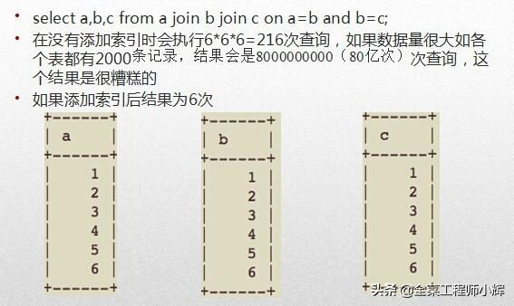

<!-- toc -->
[TOC]

# SQL查询优化
## SQL查询优化1

### 总结
操作：查询条件放到子查询中，子查询只查主键ID，然后使用子查询中确定的主键关联查询其他的属性字段；

原理：减少回表操作；

### 前提：（mysql5.7.17 ）id为自增主键，val为非唯一索引。
```
mysql> desc test;
+--------+---------------------+------+-----+---------+----------------+
| Field  | Type                | Null | Key | Default | Extra          |
+--------+---------------------+------+-----+---------+----------------+
| id     | bigint(20) unsigned | NO   | PRI | NULL    | auto_increment |
| val    | int(10) unsigned    | NO   | MUL | 0       |                |
| source | int(10) unsigned    | NO   |     | 0       |                |
+--------+---------------------+------+-----+---------+----------------+
3 rows in set (0.00 sec)
```
### 操作：
```
-- 优化前SQL
SELECT  各种字段
FROM `table_name`
WHERE 各种条件
LIMIT 0,10;

-- 优化后SQL
SELECT  各种字段
FROM `table_name` main_tale
RIGHT JOIN 
(
SELECT  子查询只查主键
FROM `table_name`
WHERE 各种条件
LIMIT 0,10;
) temp_table ON temp_table.主键 = main_table.主键

```
### 效果：
```
mysql> select * from test where val=4 limit 300000,5;
+---------+-----+--------+
| id      | val | source |
+---------+-----+--------+
| 3327622 |   4 |      4 |
| 3327632 |   4 |      4 |
| 3327642 |   4 |      4 |
| 3327652 |   4 |      4 |
| 3327662 |   4 |      4 |
+---------+-----+--------+
5 rows in set (15.98 sec)

mysql> select * from test a inner join (select id from test where val=4 limit 300000,5) b on a.id=b.id;
+---------+-----+--------+---------+
| id      | val | source | id      |
+---------+-----+--------+---------+
| 3327622 |   4 |      4 | 3327622 |
| 3327632 |   4 |      4 | 3327632 |
| 3327642 |   4 |      4 | 3327642 |
| 3327652 |   4 |      4 | 3327652 |
| 3327662 |   4 |      4 | 3327662 |
+---------+-----+--------+---------+
5 rows in set (0.38 sec)
```

### 原理:
为什么会出现上面的结果？我们看一下select * from test where val=4 limit 300000,5;的查询过程：

查询到索引叶子节点数据。
根据叶子节点上的主键值去聚簇索引上查询需要的全部字段值。


这样就需要查询300005次索引节点，查询300005次聚簇索引的数据，最后再将结果过滤掉前300000条，取出最后5条。MySQL耗费了大量随机I/O在查询聚簇索引的数据上，而有300000次随机I/O查询到的数据是不会出现在结果集当中的。


肯定会有人问：既然一开始是利用索引的，为什么不先沿着索引叶子节点查询到最后需要的5个节点，然后再去聚簇索引中查询实际数据。这样只需要5次随机I/O（这也是我们要优化的方向）


#### 证实

InnoDB中有[buffer pool](https://dev.mysql.com/doc/refman/5.7/en/innodb-information-schema-buffer-pool-tables.html)。里面存有最近访问过的数据页，包括数据页和索引页。所以我们需要运行两个sql，来比较buffer pool中的数据页的数量。预测结果是运行select * from test a inner join (select id from test where val=4 limit 300000,5); 之后，buffer pool中的数据页的数量远远少于select * from test where val=4 limit 300000,5;对应的数量，因为前一个sql只访问5次数据页，而后一个sql访问300005次数据页。

```
mysql> select * from test where val=4 limit 300000,5;
+---------+-----+--------+
| id      | val | source |
+---------+-----+--------+| 
3327622 |   4 |      4 |
| 3327632 |   4 |      4 |
| 3327642 |   4 |      4 |
| 3327652 |   4 |      4 |
| 3327662 |   4 |      4 |
+---------+-----+--------+
5 rows in set (26.19 sec)

mysql> select index_name,count(*) from information_schema.INNODB_BUFFER_PAGE where INDEX_NAME in('val','primary') and TABLE_NAME like '%test%' group by index_name;
+------------+----------+
| index_name | count(*) |
+------------+----------+
| PRIMARY    |     4098 |
| val        |      208 |
+------------+----------+2 rows in set (0.04 sec)
```

可以看出，此时buffer pool中关于test表有4098个数据页，208个索引页。


为了防止上次试验的影响，我们需要清空buffer pool，重启mysql。

```
mysqladmin shutdown
/usr/local/bin/mysqld_safe &

# 重启完成，查看是否清空

mysql> select index_name,count(*) from information_schema.INNODB_BUFFER_PAGE where INDEX_NAME in('val','primary') and TABLE_NAME like '%test%' group by index_name;

Empty set (0.03 sec)
```
开始第二次实验：
```
mysql> select * from test a inner join (select id from test where val=4 limit 300000,5) b on a.id=b.id;
+---------+-----+--------+---------+
| id      | val | source | id      |
+---------+-----+--------+---------+
| 3327622 |   4 |      4 | 3327622 |
| 3327632 |   4 |      4 | 3327632 |
| 3327642 |   4 |      4 | 3327642 |
| 3327652 |   4 |      4 | 3327652 |
| 3327662 |   4 |      4 | 3327662 |
+---------+-----+--------+---------+
5 rows in set (0.09 sec)

mysql> select index_name,count(*) from information_schema.INNODB_BUFFER_PAGE where INDEX_NAME in('val','primary') and TABLE_NAME like '%test%' group by index_name;
+------------+----------+
| index_name | count(*) |
+------------+----------+
| PRIMARY    |        5 |
| val        |      390 |
+------------+----------+
2 rows in set (0.03 sec)
```
我们可以看明显的看出两者的差别：第一个sql加载了4098个数据页到buffer pool，而第二个sql只加载了5个数据页到buffer pool。符合我们的预测。也证实了为什么第一个sql会慢：读取大量的无用数据行（300000），最后却抛弃掉。
而且这会造成一个问题：加载了很多热点不是很高的数据页到buffer pool，会造成buffer pool的污染，占用buffer pool的空间。


为了在每次重启时确保清空buffer pool，我们需要关闭innodb_buffer_pool_dump_at_shutdown和innodb_buffer_pool_load_at_startup，这两个选项能够控制数据库关闭时dump出buffer pool中的数据和在数据库开启时载入在磁盘上备份buffer pool的数据。

 
## SQL查询优化2 小表驱动大表

第一张表是全表索引(要以此关联其他表)，其余表的查询类型type为range(索引区间获得)，也就是6 * 1 * 1，共遍历查询6次即可;

建议使用left join时，以小表关联大表，因为使用join的话，第一张表是必须全扫描的，以少关联多就可以减少这个扫描次数.

> 这里所说的表的type，指的是explain执行计划中的结果字段。详情点击查看，explain的属性详解与提速百倍的优化示例

### 实时获取有性能问题的SQL

利用information_schema数据库的processlist表，实时查看执行时间过长的线程，定位需要优化的SQL。

例如下面的SQL的作用是查看正在执行的线程，并按Time倒排序，查看执行时间过长的线程。

select * from information_schema.processlist where Command != 'Sleep' order by Time desc;

### 拆分执行时间长的DELETE或INSERT语句 拆分大SQL
避免在生产环境上执行会锁表的DELETE或INSERT的操作。一定把其拆分，或者使用LIMIT条件也是一个好的方法。
```
while (1) {
 //每次只做1000条
 mysql_query("DELETE FROM logs WHERE log_date <= '2009-11-01' LIMIT 1000");
 if (mysql_affected_rows() == 0) {
 // 没得可删了，退出！
 break;
 }
 // 每次都要休息一会儿
 usleep(50000);
}
```
