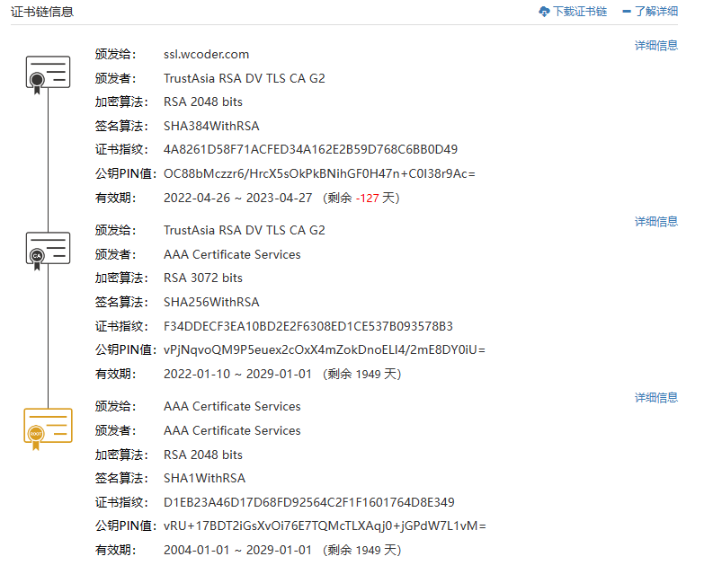

easyrsa openssl cfssl 

CA 证书签名请求（CSR） CertificateSigningRequest
server.csr则含有公钥、组织信息、个人信息(域名)
server.key 私钥

.pem可以是私钥 也可以是

ca.pem	CA根证书文件
ca-key.pem	服务端私钥，用于对客户端请求的解密和签名
ca.csr	证书签名请求，用于交叉签名或重新签名


Privacy Enhanced Mail Certificate


是服务端的私钥


CA, Certificate Authority 证书颁发机构

[证书](https://kubernetes.io/zh/docs/concepts/cluster-administration/certificates/)

[OpenSSL Windows下载地址](https://slproweb.com/products/Win32OpenSSL.html) 一般默认安装，但安装步骤中有一步，“Select Additional Tasks”，让选择OpenSSL的dll拷贝到什么地方.
设置环境变量,然后验证`openssl version`
<!--toc-->

[TOC]

# 一文读懂什么是CA证书

> 单纯使用公私钥进行加解密，会存在公钥被替换伪造的风险，无法判断公钥是否属于服务提供商。
> 所以，公钥需要通过CA机构的认证。
> CA机构用自己的私钥，对服务提供商的相关信息及公钥进行加密生成数字证书。在进行安全连接的时候，服务提供商将证书一同发给用户。
> 用户收到证书后，从他的CA认证机构下载证书/公钥，验证服务提供商证书的合法性。
> 最后，从证书中提取服务商提供的公钥，加、解密信息进行通信。

### 名词解释：

CA: Certificate Authority，证书中心/证书授权中心/电子认证服务机构，负责管理和签发证书的，受公众信任足够权威的第三方机构，检查证书持有者身份的合法性，并签发证书，以防证书被伪造或篡改。

CA证书: CA颁发的证书, 或数字证书，包含证书拥有者的身份信息，CA机构签名，公钥等。

### 证书编码：

DER编码，二进制DER编码。

PEM编码，用于ASCII(BASE64)编码，文件由 "-----BEGIN"开始，"-----END"结束。

### 证书文件后缀：

.pem(openssl默认，PEM编码的文件) 
.crt(Unix/Linux，DER或PEM编码都可以) 
.cer(windows，二进制)
.der(二进制)

### 秘钥文件：

.key

### 服务器证书申请文件/证书签名请求文件：

.req
.csr

### 使用openssl模拟秘钥证书的生成过程:

openssl x509工具主要用于输出证书信息, 签署证书请求文件、自签署、转换证书格式等。它就像是一个完整的小型的CA工具箱。

1. 生成服务器私钥:

    1.1. 需要经常输入密码：
    openssl genrsa -des3 -out server_private.key 2048 会有输入密码的要求

    1.2. 去除密码：
    openssl rsa -in server_private.key -out server_private.key

    1.3.无密码证书秘钥：
    openssl genrsa -out server_private.key 2048

    1.4. 生成公钥:
    openssl rsa -in server_private.key -pubout -out server_public.key

2. 生成 服务器证书申请文件/证书签名请求文件 .req:

    2.1. openssl req -new -key server_private.key -out server.req
    会让输入Country Name 填 CN; Common Name 填 ip 也可以不填。

    查看server.req
    2.2. openssl req -in server.req -text 

3. 生成CA私钥：

    3.1. openssl genrsa -out ca_private.key 2048

4. 生成 CA证书申请文件/证书签名请求文件 .req:

    4.1. openssl req -new -key ca_private.key-out ca_request.req

    查看ca_request.req
    4.2. openssl req -in ca_request.req -text

5. 创建CA证书，用来给服务器的证书签名:(这个证书请求本来应由更高级的CA用它的private key对这个证书请求进行签发，由于此时模拟的CA是 root CA，没有更高级的CA了，所以要进行自签发，用 自己的private key 对 自己的证书请求 进行签发。)

    5.1. openssl x509 -req -in ca_request.req -signkey ca_private.key -days 365 -out ca.pem

    查看证书
    5.2. openssl x509 -in ca.pem -noout -text

6. CA用自己的CA证书ca.pem 和 私钥ca_private.key 为 server.req 文件签名，生成服务器证书，：

    6.1. openssl x509 -req -in server.req -CA ca.pem -CAkey ca_private.key -days 365 -CAcreateserial -out server.pem

    查看证书
    6.2. openssl x509 -in server.pem -noout -text

    查看公钥
    6.3. openssl x509 -in server.pem -noout -pubkey

7. 查看服务器证书的modulus和服务器私钥的modulus，应该一样：

    7.1. openssl x509 -in server.pem -noout -modulus

    7.2. openssl rsa -in server_private.key -noout -modulus

8. 用户访问https网站，服务器会用private key加密数据传输，同时会把证书传给用户，里面有public key信息，用于解密数据。

用户使用公钥机密的时候，要确认此公钥是否是服务商的，是否是受信任的。

用户从服务商证书中发现，其证书是由某CA签发的，从CA官网下载他的证书，发现它由 更高级CA签发 或者 是root证书，自签发的。

这时就可以一级一级的验证证书的合法性，最终确认服务商的证书是否被信任。

验证后就可以使用公钥解密信息，进行通信。

openssl verify -CAfile ca.pem server.pem

9. ls 出现以下文件：

ca.pemca_private.keyca_request.reqca.srlserver.pemserver_private.keyserver.req

10. 从证书导出公钥:

openssl x509 -in server.pem -noout -pubkey -out server_public.key

11. 使用公钥加密，私钥解密:

openssl rsautl -encrypt -in test.txt -inkey server_public.key -pubin -out test_encrypt.txt

openssl rsautl -decrypt -in test_encrypt.txt -inkey server_private.key -out test_decrypt.txt

12. 不想浏览器发出警告，就导入ca.pem文件:

13. 查看证书内容：

    13.1. 打印出证书的内容：openssl x509 -in server.pem -noout -text

    13.2. 打印出证书的系列号：openssl x509 -in server.pem -noout -serial

    13.3. 打印出证书的拥有者名字：openssl x509 -in server.pem -noout -subject

    13.4. 以RFC2253规定的格式打印出证书的拥有者名字：openssl x509 -in server.pem -noout -subject -nameopt RFC2253

    13.5. 打印出证书的MD5特征参数：openssl x509 -in server.pem -noout -fingerprint

    13.6. 打印出证书有效期：openssl x509 -in server.pem -noout -dates

    13.7. 打印出证书公钥：openssl x509 -in server.pem -noout -pubkey

14. 证书秘钥要使用相同的编码格式

15. 证书格式转换:

PEM转DER格式：openssl x509 -inform pem -in server.pem -outform der -out server.der

DER转PEM格式：openssl x509 -inform der -in server.der -outform pem -out server.pem0

[原文](https://www.cnblogs.com/frisk/p/12628159.html)

[https 原理分析进阶-模拟https通信过程](https://www.cnblogs.com/hobbybear/p/17511245.html)


### 域名证书文件包含两段证书

- 证书内容(pem文件和crt文件内容是一样的)
```
cat 2048227_www.xxx.com.pem 
-----BEGIN CERTIFICATE-----
MIIFmDCCBICgAwIBAgIQCEZS6MCdneB/9dgvdbLKLDANBgkqhkiG9w0BAQsFADBu
......
q9kYr+G8Ga0ILktc0/kgDeEEYCiMj0GCdKfAdEBCWsmSo9LFMqcSCr+zUSw=
-----END CERTIFICATE-----
-----BEGIN CERTIFICATE-----
MIIEqjCCA5KgAwIBAgIQAnmsRYvBskWr+YBTzSybsTANBgkqhkiG9w0BAQsFADBh
......
rMKWaBFLmfK/AHNF4ZihwPGOc7w6UHczBZXH5RFzJNnww+WnKuTPI0HfnVH8lg==
-----END CERTIFICATE-----
```

- 将这两段证书分别写入到文件查看
第一段证书
这段证书是Encryption Everywhere DV TLS CA - G1颁发给www.xxx.com的
`openssl x509 -in ssl.wcoder.com_bundle_1.crt -text`

```
Certificate:
    Data:
        Version: 3 (0x2)
        Serial Number:
            ......
        Signature Algorithm: sha256WithRSAEncryption
        Issuer: C = US, O = DigiCert Inc, OU = www.digicert.com, CN = Encryption Everywhere DV TLS CA - G1
        Validity
            Not Before: Apr 11 00:00:00 2019 GMT
            Not After : Apr 10 12:00:00 2020 GMT
        Subject: CN = www.xxx.com.cn
        Subject Public Key Info:
            ......
        X509v3 extensions:
            ......
    Signature Algorithm: sha256WithRSAEncryption
         ......
```

第二段证书

这段证书是DigiCert Global Root CA颁发给Encryption Everywhere DV TLS CA - G1的
`openssl x509 -in 2.pem -text`
```
Certificate:
    Data:
        Version: 3 (0x2)
        Serial Number:
            02:79:ac:45:8b:c1:b2:45:ab:f9:80:53:cd:2c:9b:b1
        Signature Algorithm: sha256WithRSAEncryption
        Issuer: C = US, O = DigiCert Inc, OU = www.digicert.com, CN = DigiCert Global Root CA
        Validity
            Not Before: Nov 27 12:46:10 2017 GMT
            Not After : Nov 27 12:46:10 2027 GMT
        Subject: C = US, O = DigiCert Inc, OU = www.digicert.com, CN = Encryption Everywhere DV TLS CA - G1
        Subject Public Key Info:
             ......
        X509v3 extensions:
             ......
    Signature Algorithm: sha256WithRSAEncryption
         ......
```

所以DigiCert Global Root CA是根CA；Encryption Everywhere DV TLS CA - G1是小弟，中级CA；中级CA给www.xxx.com.cn域名办法域名证书



可以参考[gworg](https://www.gworg.com/)

[ssllabs](https://www.ssllabs.com/ssltest/)

[在线cdn检测网站](https://myssl.com/cdn_check.html)

或者命令`openssl s_client -connect ssl.wcoder.com:443`