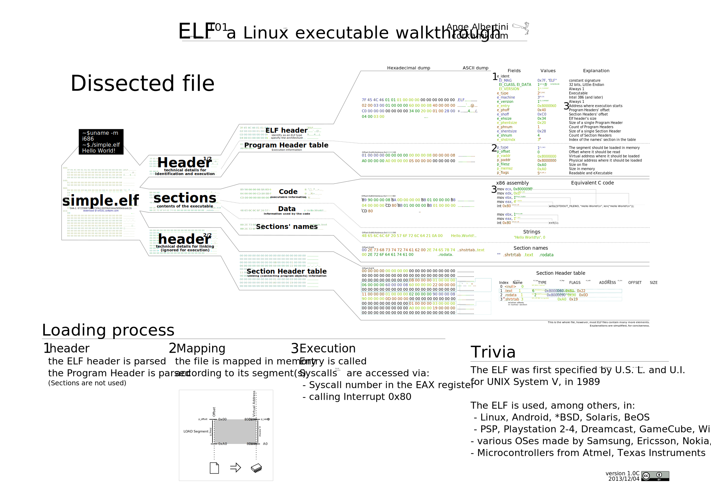

[计算机知识](https://github.com/ossu/computer-science)
[CPU Caches and Why You Care](../files/codedive-CPUCachesHandouts.pdf)

## Executable File
目标文件有三种类型：
1. 可重定位文件（Relocatable File） 包含适合于与其他目标文件链接来创建可执行文件或者共享目标文件的代码和数据。 (Linux的*.o 文件 Windows的 *.obj文件)
2. 可执行文件（Executable File） 包含适合于执行的一个程序，此文件规定了 exec() 如何创建一个程序的进程映像。（比如/bin/bash文件；Windows的*.exe）
3. 共享目标文件（Shared Object File） 包含可在两种上下文中链接的代码和数据。首先链接编辑器可以将它和其它可重定位文件和共享目标文件一起处理，生成另外一个目标文件。其次，动态链接器（Dynamic Linker）可能将它与某个可执行文件以及其它共享目标一起组合，创建进程映像。
目标文件全部是程序的二进制表示，目的是直接在某种处理器上直接执行（Linux的.so，如/lib/ glibc-2.5.so；Windows的DLL

现在PC平台流行的可执行文件格式（Executable）主要是Windows下的PE（Portable Executable）和Linux的ELF（Executable Linkable Format），它们都是COFF（Common file format）格式的变种。
不光是可执行文件（Windows的.exe和Linux下的ELF可执行文件）按照可执行文件格式存储。动态链接库（DLL，Dynamic Linking Library）（Windows的.dll和Linux的.so）及静态链接库（Static Linking Library）（Windows的.lib和Linux的.a）文件都按照可执行文件格式存储。它们在Windows下都按照PE-COFF格式存储，Linux下按照ELF格式存储。
什么又是COFF格式呢？
COFF是由Unix System V Release 3首先提出并且使用的格式规范，后来微软公司基于COFF格式，制定了PE格式标准，并将其用于当时的Windows NT系统。System V Release 4在COFF的基础上引入了ELF格式，目前流行的Linux系统也以ELF作为基本可执行文件格式。这也就是为什么目前PE和ELF如此相似的主要原因，因为它们都是源于同一种可执行文件格式COFF。

Unix最早的可执行文件格式为a.out格式，它的设计非常地简单，以至于后来共享库这个概念出现的时候，a.out格式就变得捉襟见肘了。于是人们设计了COFF格式来解决这些问题，这个设计非常通用，以至于COFF的继承者到目前还在被广泛地使用。

COFF的主要贡献是在目标文件里面引入了“段”的机制，不同的目标文件可以拥有不同数量及不同类型的“段”。另外，它还定义了调试数据格式。

> mac 的可执行文件：Mach-O为Mach Object文件格式的缩写，它是一种用于可执行文件，目标代码，动态库，内核转储的文件格式。

不同系统稍微有点区别
img/elf101-64.svg,img/elf101arm.svg,img/elf101p.svg,

