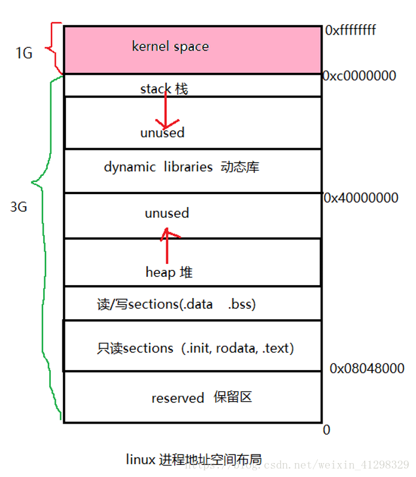
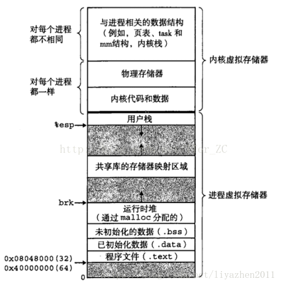
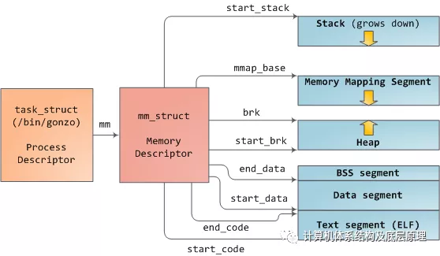
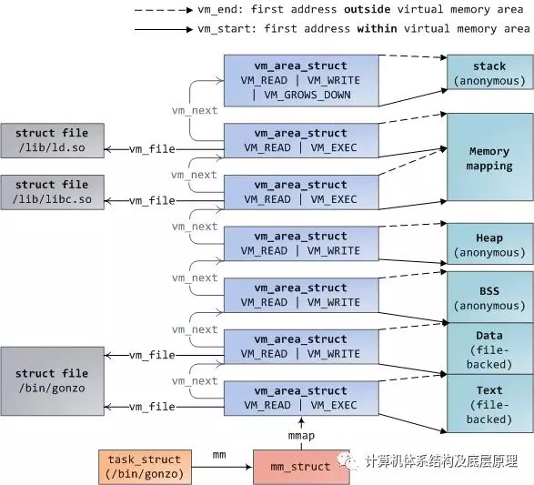
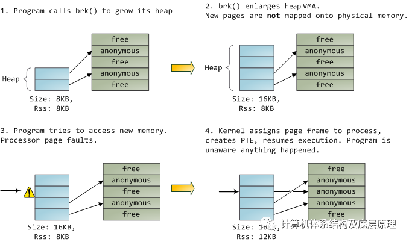
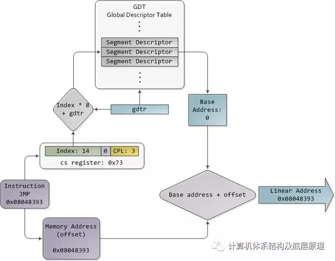
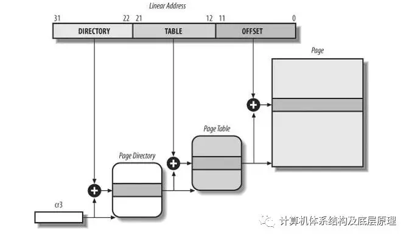
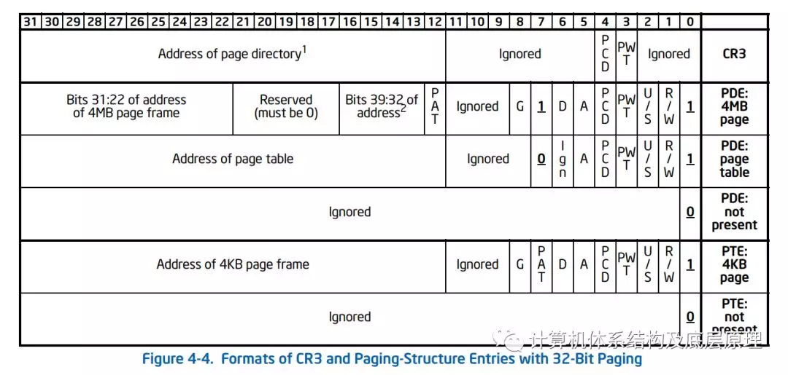

# 内存布局

- machine code  区域是我们的编译程序的二进制代码。当我们运行程序时，该代码将被加载到内存的“顶部”。
- Globals 区域是我们在程序中声明的全局变量或整个程序可以访问的其他共享变量。
- heap 区域是程序分配的（如：使用malloc ）.
- stack 区域方法调用，和local variables，main函数位于堆栈的最底部

[参考](https://cs50.harvard.edu/x/2020/notes/4/#memory-layout)

在 Linux 系统中，使用如下命令可查看一个运行中的进程的内存排布。
```
cat /prox/PID/maps
```

# 内存管理
https://www.toutiao.com/i6844780093961667084/
https://juejin.im/post/5efadf48f265da2304062e51

## golang mmap
https://github.com/edsrzf/mmap-go
https://pkg.go.dev/golang.org/x/exp/mmap
https://github.com/dilfish/awdb-golang/blob/master/awdb-golang/mmap_unix.go

## 云主机内存
最近购买了2G内存的腾讯云主机, 发现总内存只有1.7G (`free -h`)


```
# 查看真实内存
dmidecode -t memory
# 查看真实内存
lsmem
# 更准一点(以1000为单位)
free --mega

# 查看 kdump 占用的内存, 这个是为了防止系统崩溃而保留的内存
kdumpctl showmem
# 输出 kdump: Reserved 256MB memory for crash kernel


# 关闭 kdump(设置完参数后需要重启系统)
grubby --update-kernel ALL --args crashkernel=0M

# 也可以修改小一点
grubby --update-kernel ALL --args crashkernel=64M
```

如果系统内存总量为 512 MB 和 2 GB，则命令保留 64 MB 内存。如果内存量超过 2 GB，则内存保留为 128 MB。
```
grubby --update-kernel=ALL --args="crashkernel=512M-2G:64M,2G-:128M"
```

> [What is the difference between megabytes and mebibytes](https://www.gbmb.org/blog/what-is-the-difference-between-megabytes-and-mebibytes-32)

> 要让 kdump 捕获内核崩溃转储，并保存它以便进一步分析，应该为捕获内核永久保留系统内存的一部分。保留时，主内核无法使用系统内存的这一部分
> [配置 kdump 内存用量](https://access.redhat.com/documentation/zh-cn/red_hat_enterprise_linux/8/html/managing_monitoring_and_updating_the_kernel/configuring-kdump-memory-usage_configuring-kdump-on-the-command-line)

# Linux 内核如何管理内存
Windows在默认情况下，将高地址的2GB空间分配给内核（也可配置1GB），而Linux默认情况下，将高地址的1GB空间分配给内核。这些分配给内核的空间叫内和空间，用户使用剩下的空间称为用户空间。

 

在用户空间里，有许多地址区间有特殊地位，一般来讲，应用程序使用的内存空间里有如下“默认”的区域；

（1）栈：栈用于维护函数调用的上下文，离开了栈函数调用就没法实现；栈通常在用户空间的做高位处分配；

（2）堆：用来容纳应用程序动态分配的内存区域，当使用malloc或new分配内存时，得到的内存来自堆里；堆通常存在栈的下方，堆一般比栈大很多；

（3）可执行文件映像：这里存储可执行文件在内存里的映像；（由于可执行文件在装载时实际上是被映射的虚拟空间，所以可执行文件很多时候又被称为映像文件）

（4）保留区：保留区并不是一个单一的内存区域，而是对内存中受到保护而禁止访问的内训区域的总称。例如0地址，是始终不能读写的。




Linux的可执行文件格式elf与进程内存布局的区别：


在检查了进程的虚拟地址布局之后，我们转向内核及其管理用户内存的机制。


Linux进程在内核中实现为task_struct（进程描述符）的实例。变量mm中的task_struct指向场存储器描述符，结构体为的mm_struct，这是一个程序的存储器的执行摘要。它存储的开始和存储器段的端部如上述所示，数据结构包括 进程所使用的物理存储器页（RSS代表驻留集大小）， 进程使用使用的虚拟地址空间，以及其他。在内存描述符中，我们还找到了用于管理程序内存的两个核心要素：虚拟内存区域集VMA和页表page table。vm记忆区域如下所示：

每个虚拟内存区域（VMA）是一个连续的虚拟地址范围; 这些区域从不重叠。vm_area_struct的一个实例完整地描述了一个内存区域，包括其开始和结束地址，用于确定访问权限和行为的标志，以及用于指定该区域正在映射哪个文件的vm_file字段（如果有）。未映射文件的VMA是称之为匿名的。上面的每个存储器段（例如，堆，堆栈）对应于单个VMA，但存储器映射段除外。虽然在x86机器中很常见，但这不是必需的。VMA并不关心他们所属的segment

程序的VMA存储在其存储器描述符中，既作为mmap字段中的链接列表，又通过启动虚拟地址排序，以及作为以mm_rb字段为根的红黑树。红黑树允许内核快速搜索覆盖给定虚拟地址的内存区域。当你读取文件/ proc / pid_of_process / maps时，内核只是通过进程的VMA链接列表并打印每个进程。


在Windows中，EPROCESS块大致是task_struct和mm_struct的混合。与VMA模拟的Windows是虚拟地址描述符或VAD ; 它们存储在AVL树中。


4GB虚拟地址空间分为页面。32位模式的x86处理器支持4KB，2MB和4MB的页面大小。Linux和Windows都使用4KB页面映射虚拟地址空间的用户部分。字节0-4095落在第0页，字节4096-8191落在第1页，依此类推。VMA的大小必须是页面大小的倍数。这是4KB页面中3GB的用户空间：

处理器查询页表以将虚拟地址转换为物理存储器地址。每个进程都有自己的一组页表; 每当发生进程切换时，也切换用户空间的页表。Linux 在内存描述符的pgd字段中存储指向进程'页表的指针。对于每个虚拟页面，页面表中对应一个页表条目（PTE），在常规x86分页中是一个简单的4字节记录，如下所示：


Linux具有读取和设置 PTE中每个标志的功能。位P告诉处理器虚拟页面是否存在于物理内存中。如果清除（等于0），则访问该页面会触发页面错误。请记住，当此位为零时，内核可以使用其余字段执行任何操作。R / W标志代表读/写; 如果清除，页面是只读的。标志U / S代表用户/主管supervise; 如果清除，那么页面只能由内核访问。这些标志用于实现我们之前看到的只读内存和受保护的内核空间。

D和A位用于脏dirty和访问。脏页面有写入，而被访问页面有写入或读取。两个标志都是粘性的：处理器只设置它们，它们必须由内核清除。最后，PTE存储与该页面对应的起始物理地址，对齐到4KB。它将可寻址的物理内存限制为4 GB。其他PTE字段是其他的用途，这里不详细介绍，比如物理地址扩展

虚拟页面是内存保护的单位(比如4K) ，因为它的所有字节共享U / S和R / W标志。但是，相同的物理内存可以由不同的页面映射，可能具有不同的保护标志。请注意，在PTE中无处可见执行权限。这就是为什么经典的x86分页允许执行堆栈上的代码，从而更容易利用堆栈缓冲区溢出（仍然可以使用return-to-libc和其他技术来利用非可执行堆栈）。缺少PTE无执行标志说明了一个更广泛的事实：VMA中的权限标志可能会或可能不会干净地转换为硬件保护。内核尽其所能，但最终架构限制了可能的内容。

需要注意的是 虚拟内存不存储任何内容，它只是将程序的地址空间映射到底层物理内存，后者由处理器作为称为物理地址空间的大块访问。虽然总线上的内存操作有些牵连，但我们可以忽略这一点，并假设物理地址的范围从0到可用内存的顶部，以1字节为增量。该物理地址空间由内核分解为页面帧。处理器不知道或不关心帧，但它们对内核至关重要，因为页面帧是物理内存管理的单位。Linux和Windows在32位模式下都使用4KB页面帧; 这是一个具有2GB RAM的机器的示例：

在Linux中，每个页面帧由描述符和几个标志跟踪。这些描述符一起跟踪计算机中的整个物理内存; 每个页面框架的精确状态始终是已知的。使用伙伴内存分配技术管理物理内存，因此如果可以通过伙伴系统分配页面帧，则它是免费的。分配的页面框架可能是匿名的，保存程序数据，或者它可能位于页面缓存中，保存存储在文件或块设备中的数据。还有其他奇特的页面框架用途，但暂时不管它们。Windows有一个类似的页面帧号（PFN）数据库来跟踪物理内存。

让我们将虚拟内存区域，页表条目和页面框架放在一起，以了解这一切是如何工作的。以下是用户堆的示例：


蓝色矩形表示VMA范围内的页面，而箭头表示将页面映射到页面帧的页面表条目。有些虚拟页面没有箭头; 这意味着他们相应的PTE 清楚地显示Present标志。这可能是因为页面从未被触及或因为它们的内容已被换出。在任何一种情况下，访问这些页面都会导致页面错误，即使它们在VMA内。对于VMA和页面表不同意，这似乎很奇怪，但这种情况经常发生。

VMA就像是程序和内核之间的契约。您要求完成某些事情（分配内存，映射文件等），内核说“确定”，并创建或更新相应的VMA。但它实际上并没有立即兑现请求，而是等待页面错误发生才能真正起作用。内核是一个懒惰的，欺骗性的 这是虚拟内存的基本原理。他看似给你了物理内存，其实没有。它适用于大多数情况，有些是熟悉的，有些是令人惊讶的，但规则是VMA记录已达成一致的内容，而PTE则反映实际已完成的内容由懒惰的内核。这两个数据结构共同管理程序的内存; 两者都在解决页面错误，释放内存，交换内存等方面发挥作用。我们来看一下内存分配的简单情况：


当程序通过brk（）系统调用请求更多内存时，内核只是更新堆VMA并调用它。此时实际上没有分配页面帧，并且新页面不存在于物理内存中。程序尝试访问页面后，处理器页面出现故障并调用do_page_fault（）。它使用find_vma（）搜索覆盖故障虚拟地址的VMA 。如果找到，则还会针对尝试访问（读取或写入）检查VMA上的权限。 如果没有合适的VMA，该过程会受到Segmentation Fault的惩罚。

当发现 VMA时，内核必须通过查看PTE内容和VMA类型来处理故障。在我们的例子中，PTE显示页面不存在。事实上，我们的PTE是完全空白的（全为零），在Linux中意味着虚拟页面从未被映射过。由于这是一个匿名VMA，我们有一个纯粹的RAM事务，必须由do_anonymous_page（）处理，它分配一个页面框架并使PTE将故障虚拟页面映射到新分配的帧。

事情可能会有所不同。例如，换出页面的PTE在Present标志中为0，但不是空白。相反，它存储保存页面内容的交换位置，必须从磁盘读取并通过do_swap_page（）在所谓的主要故障中加载到页面框架中。

**可以看到，内核非常完美的给每个应用程序一个完整的虚拟地址空间，应用程序无需关心真正的物理地址的分配，就像上图第3步一样，如果它访问的内存地址（虚拟），没有对应的物理内存时候，硬件会自动tigger page fault ,然后内核的的page fault hanlder 自动把PTE 填好，应用程序毫无发觉。(其实有，就是会慢) ，可以通过一些工具来观察每个进程对memory 的管理情况 ，比如发生了多少次page fault 在Linux下面可以使用**
```
cat /proc/PID/stat
```
在windows 下 大家可以在windows 里面用

按住“Windows+R”打开命令行窗口，输入命令“resmon”，打开资源监视器

里面有个hard fault 列可以观察每个进程发生的page fault 。


# X86 体系结构内存 段和页，以及地址转换 -1
这里为了简单，这里都认为是32位物理总线，32 位操作系统

- **逻辑地址 logical address** 

包含在机器语言指令中，用于指定操作数或指令的地址。这种类型的地址体现了80 x 86分段体系结构，每个逻辑地址由一个段和一个偏移（或位移）组成，表示从段的起点到实际地址的距离。


- **线性地址（也称为虚拟地址）linear address/virtual address** 
一个32位无符号整数，可用于寻址最多4 GB，最多4,294,967,296个存储单元。线性地址通常用十六进制表示;它们的值范围从0x00000000到0xffffffff。

- **物理地址**
用于寻址存储器芯片中的存储器单元。它们对应于沿微处理器的地址引脚发送到存储器总线的电信号。物理地址表示为32位或36位无符号整数 ，

（这个当然和CPU有关，笔者是Intel公司做服务器产品的工程师，所以服务器的CPU为了支持更多的内存数量都可以达到58 位甚至更多）


在为英特尔主板供电的芯片组中，CPU通过前端总线访问内存，前端总线将其连接到北桥芯片。在前端总线中交换的存储器地址是物理存储器地址，从零到可用物理存储器顶部的原始数据。这些数字由北桥映射到物理RAM。物理地址是具体的，最终的 - 没有翻译，没有分页，没有权限检查 - 就是简单的电信号把它放在总线上就是这样。但是，在CPU中，程序使用逻辑内存地址，必须在发生内存访问之前将其转换为物理地址。从概念上讲，地址转换如下所示：

Memory address translation in x86 CPUs with paging enabled


可以理解了吧，还记得程序中著名的汇编代码调试器？

总有一个CS:EIP 的东西出现在左边，如果经常调试的人应该很清楚

CS 即代码段，EIP 表示在代码段中IP 指令指针，就是代表目前代码在跑的位置    所以如果你是在保护模式下的话，这CPU 看到的跑的这个地址是一个逻辑地址，然后通过CPU  内部的 ＭＭU 内存管理单元，先从逻辑地址通过分段单元转换位线性地址，线性地址通过分页单元转换位最终的物理地址。

注意上图不是物理实际的图，只是地址转换过程的简单的描述，特别是当CPU启用了分页时。如果关闭分页，分段单元的输出已经是物理地址; 在16位实模式中始终如此。当CPU执行引用存储器地址的指令时，转换开始。

第一步是将该逻辑地址转换为线性地址。
但为什么要经历这一步而不是让软件直接使用线性（或物理）地址？出于同样的原因，人类患有阑尾，其主要功能是感染。这是进化的过程。这个是个玩笑话了

> 大家可能要问为啥要怎么做，为啥不直接就让CPU 访问物理地址，这个主要是为了隔离和保护OS 下面各个进程相互不干涉打扰，应用软件的开发者无需关心物理内存的破坏，Kernel 通过虚拟内存，给应用程序提供了貌似完全独立的4GB空间(以32比特OS 为例） 这个部分就不展开了，留在以后细说。

为了真正理解x86分页分段，我们需要回到1978年。

原始8086具有16位寄存器，其指令主要用于8位或16位操作数。这允许代码使用2 16字节或64K内存，但英特尔工程师热衷于让CPU使用更多内存而不扩展寄存器和指令的大小。所以他们引入了段寄存器作为告诉CPU 哪个的手段一个程序的指令将会运行64K块内存。这是一个合理的解决方案：首先你加载一个段寄存器，有效地说“在这里，我想处理从X开始的内存块”; 之后，代码使用的16位内存地址将被解释为块或段中的偏移量。有四个段寄存器：一个用于堆栈（ss），一个用于程序代码（cs），两个用于数据（ds，es）。大多数程序都足够小，以便在64K段中分别适应它们的整个堆栈，代码和数据，因此分段通常是透明的。


直到现在，分段仍然存在，并且始终在x86处理器中启用（注意不可以关闭）。触发存储器的每条指令都隐含地使用段寄存器。例如，跳转指令使用代码段寄存器（cs），而堆栈推送指令使用堆栈段寄存器（ss）。在大多数情况下，您可以显式覆盖指令使用的段寄存器。段寄存器存储16位段选择器 ; 它们可以直接加载MOV等指令。唯一的例外是cs，它只能通过影响执行流程的指令来更改，例如CALL或JMP。尽管分段始终处于开启状态，但它在实模式与保护模式下的工作方式不同

在实模式下，例如在早期启动期间 ，段选择器是一个16位数字，用于指定段开始的物理内存地址。这个数字必须以某种方式缩放，否则它也将被限制为64K，从而破坏了分割的目的。例如，CPU可以使用段选择器作为物理存储器地址的16个最高有效位（通过将其向左移16位，相当于乘以2^16）。这个简单的规则将使段能够以64K块的形式处理4个内存，但是它会通过在处理器中需要更多的物理地址引脚来增加芯片封装成本。因此英特尔决定将段选择器乘以2^4（或16），下图 表示了了大约1MB的内存详细的翻译过程。这是一个显示跳转指令的示例，其中cs包含0x1000：

注意，X86 CPU有几种模式，实模式real mode ,保护模式，还有 SMM

这些不在这里细讲，记住X86 计算从1978年诞生到现在都是启动先进入实模式，在到后来有了CPU 支持保护模式，在进入到保护模式，现代的OS 都是在保护模式下包括 linux, windows. 

实模式段的起始范围从0一直到0xFFFF0（16个字节，短于1 MB），以16字节为增量。对于这些值，可以在0和0xFFFF之间添加一个16位偏移量（逻辑地址）。它如下有指向同一个存储位置的多个段/偏移的组合，以及物理地址落在1MB以上，如果你的段是足够高（参见臭名昭著A20线）。此外，在实模式下编写C代码时，far指针是一个包含段选择器和指针的指针逻辑地址，允许它处理1MB内存。确实如此。随着程序开始变得越来越大，超过64K的细分市场，细分及其奇怪的方式使x86平台的开发变得复杂。现在这听起来可能都很古怪，但它已经让程序员陷入疯狂的悲惨境地。

在32位保护模式下，段选择器不再是原始数字，而是包含段描述符表的索引。该表只是一个包含8字节记录的数组，其中每个记录描述一个段，因此看起来如下：


有三种类型的段：代码，数据和系统。为简洁起见，此处仅显示描述符中的常用功能。图中基地址是一个32位的线性地址指向段的开始，而 限制指定段有多大。将基址添加到逻辑存储器地址会产生线性地址。DPL是描述符权限级别; 它是一个从0（最高特权，内核模式）到3（最低特权，用户模式）的数字，用于控制对段的访问。

这些段描述符存储在两个表中：全局描述符表（GDT）和 本地描述符表（LDT）。计算机中的每个CPU（或核心）都包含一个名为gdtr的寄存器，它存储GDT中第一个字节的线性存储器地址。要选择段，必须使用以下格式加载带有段选择器的段寄存器：

段选择子

GDT的TI位为0，LDT的TI位为1，而索引指定表中所需的段选择器。我们将在稍后文章中介绍RPL，请求权限级别。现在，来想一想，当CPU处于32位模式寄存器时，指令无论如何都可以解决整个线性地址空间，所以真的没有必要给他们设置基地址为其他非零的值。那么为什么不将基地址设置为零并让逻辑地址与线性地址重合呢？其实就是这么做的，英特尔文档称之为“flat模型”，它正是现代x86内核所做的（具体来说，它们使用的平面模型）。基本上平坦flat 模型相当于在翻译内存地址时禁用分段（对于x86 CPU 来说段不可以disabled)。所谓的禁用就是把GDT　table 里面的 Base adress 都设置为0，limitation都设置为4G ,FFFFFFFF, 也就是逻辑地址offset 就是等于线性地址。我一直认为有些书上直接写OS是禁用段是不准确的。

这里是以32位保护模式运行的示例，Linux用户模式应用程序的真实值：

保护模式分段

段描述符的内容一旦被访问就被缓存，因此在后续访问中不需要实际读取GDT，这会破坏性能。每个段寄存器都有一个隐藏部分，用于存储与其段选择器对应的缓存描述符。有关更多详细信息，包括有关LDT的更多信息，请参阅“Intel系统编程指南”第3a卷第3章。涵盖每个x86指令的卷2a和2b也阐明了各种类型的x86寻址操作数 - 16位，带位段选择器的16位（可用于远指针），32位等。

在Linux中，在引导期间仅使用3个段描述符。它们使用GDT_ENTRY宏定义并存储在boot_gdt数组中。其中两个段是平坦的，对整个32位空间进行寻址：加载到cs中的代码段和加载到其他段寄存器中的数据段。第三个段是称为任务状态段的系统段。启动后，每个CPU都有自己的GDT副本。它们几乎完全相同，但是一些条目会根据运行过程而改变。您可以在segment.h中看到Linux GDT的布局，其代码就在这里http://lxr.linux.no/linux+v2.6.25.6/arch/x86/kernel/cpu/common.c#L24

有四个主要的GDT条目：两个flat mode 的内核代码段和数据段，另外两个用于用户模式。即用户代码段和数据段。也是flat mode

英特尔灵巧地解决了他们原有的段问题，为我们提供了一种灵活的方式来选择是分段还是平坦模式。由于重合的逻辑和线性地址更易于处理，因此它们成为标准，因此64位模式现在强制执行平坦线性地址空间。但即使在平坦flat模式下，段对于x86保护仍然至关重要，即保护内核免受用户模式进程和每个进程相互保护的机制。在下一篇文章中，我们将了解保护模式下的分页和如何实现它们


将到这里，基本上分段和分页的机制关于分段部分就介绍完了，具体关于分页和分段一个经典的图例是来在Intel SDM (software developmenet manual )  卷3的第三章


可以非常清晰的一目了然的了解从一个逻辑地址怎么一步步到物理地址的。


写到这里，笔者想起了多年前，去苹果面试的一个有趣的经历，当时苹果的工程师高傲坐在桌子对面问我逻辑地址到物理地址转换过程，然后我回答先分段在分页，然后他说不对的，是先分页在分段，我瞪大眼睛看他，说我非常确定是先分段在分页，他也瞪着我，然后把他的笔记本屏幕转过来给我看，指着就是这张图 ，说是先分页，我都快疯了，我说你在看看，他说你看啊，。。。。我无语也无法争辩，过了大概是10秒钟，他好像看明白了终于承认自己的错误。可以想象后面面试的尴尬。。。后来我想咋Apple 的工程师都这水平呢。。。吐槽一下，先声明绝对是真事，当然面试以其他原因没有通过.


# X86 体系结构内存 段和页，以及地址转换-2

好，接着说，上篇文章把分段基本介绍完了, 就是Segment Unit 即MMU 中的分段单元，原谅我的翻译不准确，我确实不知道该如何用中文描述这些东西 ， 分段单元出来的东西是一个线性地址，交给Page Unit ( 分页单元)  将将线性地址转换为物理地址。该单元中的一个关键任务是根据线性地址的访问权限检查所请求的访问类型。如果内存访问无效，则会生成Page Fault异常， 缺页异常，这个是个非常关键的异常，很多OS kernel 特性和他有关，我简单介绍一下，以后在详细展开

在Linux的缺页（Page Fault）异常处理程序必须区分以下两种情况：由编程错误所引起的异常，及由引用属于进程地址空间但还尚未分配物理页框的页所引起的异常。可以这么说，前面是非法的操作，后面是合法的，都叫Page fault 但处理方式不一样。如下图所示，但实际linux kernel对page fault 的处理要比这个复杂的多，先了解一下。


为了提高效率，线性地址按固定长度间隔分组，称为页面;页面中的连续线性地址被映射到连续的物理地址。通过这种方式，内核可以指定页面的物理地址和访问权限，而不是包含在其中的所有线性地址的访问权限。遵循惯例，我们将使用术语“页面”来指代一组线性地址和该组地址中包含的数据。


page unit 单元将所有RAM视为分区为固定长度的页面帧（有时称为物理页面）。每个页框包含一个页面，页框的长度与页面的长度一致。页框是主存储器的组成部分，因此它是存储区域。区分页面和页面框架很重要;前者只是一个数据块，可以存储在任何页面框架或磁盘上。


将线性映射到物理地址的数据结构称为页表;它们存储在主存储器中，在启用page unit 单元之前必须由内核正确初始化。


从80386开始，所有80 x 86处理器都支持分页;通过设置名为x86 寄存器cr0的控制寄存器的PG标志来启用它。当PG = 0时，线性地址被解释为物理地址

这个就是前面的实模式了，不过现代的OS 都enabled  PG的，Windows/Linux 都在启动过程中打开了分页功能，保护模式


因为分页的形式多种，

有一级页表，二级页表，64位操作系统还有4级甚至5级页表，页面大小也可以不一样4K 一个页面，2M , 4M , 1G ，

这里为了描述方便，我们使用经典Linux 32 位操作系统的2级页表


从80386开始，英特尔处理器的page unit 页面单元处理4 KB页面。

线性地址的32位分为三个字段

- Directory 页目录
The most significant 10 bits  高10位

- Table
The intermediate 10 bits  中间10位

- Offset
The least significant 12 bits  最后12bit 即2^12  4K 大小

线性地址的转换分两步完成，每一步都基于一种转换表。第一个转换表称为页面目录，第二个称为页表


这个两级方案的目的是减少每个进程页表所需的RAM量。如果使用简单的单级页表，则需要最多2^20个条目（即，每个条目4个字节，4 MB RAM）来表示每个进程的页表（如果进程使用完整的4 GB）线性地址空间），即使进程不使用该范围内的所有地址。两级方案通过仅针对进程实际使用的虚拟内存区域要求页表来减少内存。


每个活动进程都必须为其分配一个页面目录。但是，不需要一次为进程的所有页表分配RAM;仅当进程有效地需要时，为页表分配RAM。

这个就是我们上边提到的page fault . 

也就是说这些页表不是一次性全都建好的，是当我使用到这个线性地址的时候，会触发一个page fault ，异常，kernel 程序会跳到这个异常处理函数来把这个页表填好，页面分配出来。


生活中，比比皆是这个例子。就像买衣服，我没有必要把我所有一生都需要的衣服都买回来放在衣橱里，就是把一些常用的买回来就好了， 如果发现衣服不够了，在去商场去买，当然这个损失了一些时间(Page fault 的代价要重新load page ,建立页表，是有性能影响的），但是我节省了我家衣橱的空间，当然如果是土豪就除外了:-) 


正在使用的页面目录的物理地址存储在名为cr3的控制寄存器中。线性地址中的“目录”字段确定页面目录中指向正确页面表的条目。反过来，地址的“表”字段确定页面表中包含包含页面的页面框架的物理地址的条目。“偏移”字段确定页面框架内的相对位置（请参见下图）。因为它是12位长，每页包含4096字节的数据



CR3 中存放这第一级页目录的基地址的物理地址，注意是物理地址，然后取线性地址的 前10个bit 做 为页目录中的条目索引，页目录的构成是一个4K 的连续物理空间，每个条目4个byte, 一共10个bit 正好能索引1024个条目，4K 的页目录。比如前10bit 是200 ， 就在200个条目中读取他的值，这个值里面存放这下一级页表的基地址，这样一级级查下去


有点像黄页里面查邮政编码 ，先知道城市，在城市的页上查街道，在街道后对应相应的邮政编码 。


CR3 是个很重要的寄存器，想下啊，操作系统中很多进程在运行，但是一个时刻就有一个进程正在run , 因为只有一个物理的CPU ,但是因为CPU 速度非常快，他不断的轮转的run 各个进程，每次进场切换的时候内核就要更改该进程的页目录基地址到CR3 ,即页表基地址，正是这样，你会发现不同进程都有4G 的虚拟地址，但是即使他们都访问同一个地址，实际上访问的物理地址不同，不会相互打架，原因是他们的页表不一样，对应的物理地址由kernel 分配的不一样，即虽然线性地址一样，但物理地址不一样。这就是隔离了用户进程，而且应用开发无需关心这个，在自己的4GB 空间里访问不用担心任何越界。


目录和表字段都是10位长，因此页面目录和页表最多可包含1,024个条目。因此，页面目录可以寻址最多1024 x 1024 x 4096 = 2^32个存储单元，正如您在32位地址中所期望的那样。

页面目录和页表的条目具有相同的结构。每个条目包括以下字段


Present Flag 是否页存在的标志

如果设置，则引用的页面（或页面表）包含在主存储器中;如果该标志为0，则该页面不包含在主存储器中，并且操作系统可以为其自身目的使用剩余的条目位。如果执行地址转换所需的页表或页目录的条目清除了当前标志，则page unit 将线性地址存储在名为cr2的控制寄存器中，并生成异常14：页面错误异常。 


字段包含页面帧物理地址的20个最高有效位

Field containing the 20 most significant bits of a page frame physical address


物理页总是4K对齐的，所以我只要存32位物理地址中的前20个bit 在页表项就好了，其他的用作属性的表示

由于每个页面帧的容量为4 KB，因此其物理地址必须是4096的倍数，因此物理地址的12个最低有效位始终等于0.如果该字段指的是页面目录，则页面框架包含页表;如果它引用页面表，则页面框架包含一页数据。


页面是否已经dirty  

仅适用于Page Table条目。每次在页面框架上执行写入操作时都会设置它。与Accessed标志一样，操作系统在选择要换出的页面时可能会使用Dirty。Page unit 永远不会重置此标志;这必须由操作系统完成。

读/写标志

包含页面或页面表的访问权限（读/写或读取）


PCD和PWT标志

控制硬件缓存处理页面或页面表的方式（这个放到以后cache 的属性在细说），现在先理解这个标志位是用来标记页面的cache 属性的


页面大小标志

仅适用于页面目录条目。

全局flag

仅适用于页表条目。此标志是在Pentium Pro中引入的，以防止频繁使用的页面从TLB缓存中刷新（仅当寄存器cr4的页面全局使能（PGE）标志置位时，它才有效。


这张图的PTE 4KB Page 的情况，描述了页表项的32bit 的结构，可以参考下，具体可以看Intel SDM 卷三A 第四章


下面在顺便讲下TLB 

TLB

Translation Lookaside Buffers  


除了通用硬件高速缓存外，80 x 86处理器还包括另一个称为转换后备缓冲器（TLB）的高速缓存，以加速线性地址转换。实际就是页表的cache,

如果不这样做，想上面的地址转换，每次访问一个物理地址，都要经过三次物理地址访问，先查一级页表，然后在看二级页表，最后找到该物理页，所以一定要想办法把页表放在cache 里，即TLB


当第一次使用线性地址时，通过慢速访问RAM中的页表来计算相应的物理地址。然后将物理地址存储在TLB条目中，以便可以快速转换对相同线性地址的进一步引用。


在多处理器系统中，每个CPU都有自己的TLB，称为CPU的本地TLB。与硬件高速缓存相反，TLB的相应条目不需要同步，因为在现有CPU上运行的进程可以将相同的线性地址与不同的物理地址相关联。


当修改CPU的cr3控制寄存器时，硬件会自动使本地TLB的所有条目无效，因为正在使用一组新的页表并且TLB指向旧数据。

最后附上一张图（一般人我都不告诉他 :-)）　

清楚的表示 了TLB查找的过程　


所以大家以后要养成习惯，学习了分段和分页之后


可以闭上眼睛，想象一下，一条指令中的地址是怎么一步步的从逻辑地址到物理地址的，

可以考虑当CPU 执行一个加载操作是发生了什么

movl A, %eax 

这条汇编是把地址 A 的内容加载到寄存器%eax 中

假设A　 是0x1234567


现在是保护模式，就可以复习一下下，地址是怎么转换的，先过segment unit 逻辑地址变为线性地址，后线性地址过Page unit 根据CR3 ,一级页表，二级页表的设置一步步找到对应的物理页地址， 然后把他放到内存控制器的总线上，存贮器感觉到存储器总线上的地址信号，把数据写到存储器总线，CPU 从总线上读出数据，并将数据copy 到寄存器%eax.

# 进程虚拟内存空间
一个进程的虚拟内存可以划分为不同的内存区域，包含代码段、数据段、bss段、N个lib动态库的代码段、数据段、bss段、任何内存映射文件和任何共享内存段、进程栈stack和进程堆heap

如何查看？
cat /proc/pid/maps

进程的每段地址空间由struct vm_area_struct 描述。
- vm_start,第一列，此段虚拟地址空间的起始地址
- vm_end,第二列，此段虚拟地址空间的结束地址  
- vm_flags,第三列，此段虚拟地址空间的属性(如：r-xp)，每种属性用一个字段表示，r表示可读，w表示可写，x表示可执行，p和s共用一个字段，互斥关系（p表示私有段，s表示共享段），如果没有相应的权限，则用-代替

- vm_pgoff,第四列，对有名映射，表示此段虚拟内存起始地址在文件中以页为单位的偏移。对匿名映射，它等于0或者vm_start/PAGE_SIZE

- vm_file->f_dentry->d_inode->i_sb->s_dev，第五列，映射文件所属设备号。对匿名映射来说，因为没有文件在磁盘上，所以没有设备号，始终为0。对有名映射来说，是映射的文件所在设备的设备号
```
比如08:03
ls -l /dev/
brw-rw---- 1 root disk    8,   3 Oct  9 09:13 sda3
```


- vm_file->f_dentry->d_inode->i_ino，第六列，映射文件所属节点号。对匿名映射来说，因为没有文件在磁盘上，所以没有节点号，始终为00:00。对有名映射来说，是映射的文件的节点号

- 第七列，如/lib/ld-2.5.so，对有名来说，是映射的文件名。对匿名映射来说，是此段虚拟内存在进程中的角色。`[stack]`表示在进程中作为栈使用，`[heap]`表示堆。其余情况则无显示

```
[root@dev07 ~]# cat /proc/1160/maps
556463cae000-556463cd7000 r-xp 00000000 08:03 2892700                    /usr/sbin/xinetd
556463ed6000-556463ed8000 r--p 00028000 08:03 2892700                    /usr/sbin/xinetd
556463ed8000-556463ed9000 rw-p 0002a000 08:03 2892700                    /usr/sbin/xinetd
556463ed9000-556463eda000 rw-p 00000000 00:00 0 
556465e04000-556465e25000 rw-p 00000000 00:00 0                          [heap]
7f8c0c3da000-7f8c0c3f1000 r-xp 00000000 08:03 2884258                    /usr/lib64/libpthread-2.17.so
7f8c0c3f1000-7f8c0c5f0000 ---p 00017000 08:03 2884258                    /usr/lib64/libpthread-2.17.so
7f8c0c5f0000-7f8c0c5f1000 r--p 00016000 08:03 2884258                    /usr/lib64/libpthread-2.17.so
7f8c0c5f1000-7f8c0c5f2000 rw-p 00017000 08:03 2884258                    /usr/lib64/libpthread-2.17.so
7f8c0c5f2000-7f8c0c5f6000 rw-p 00000000 00:00 0 
7f8c0c5f6000-7f8c0c5f8000 r-xp 00000000 08:03 2884223                    /usr/lib64/libfreebl3.so
7f8c0c5f8000-7f8c0c7f7000 ---p 00002000 08:03 2884223                    /usr/lib64/libfreebl3.so
7f8c0c7f7000-7f8c0c7f8000 r--p 00001000 08:03 2884223                    /usr/lib64/libfreebl3.so
7f8c0c7f8000-7f8c0c7f9000 rw-p 00002000 08:03 2884223                    /usr/lib64/libfreebl3.so
7f8c0c7f9000-7f8c0c7fb000 r-xp 00000000 08:03 2884238                    /usr/lib64/libdl-2.17.so
7f8c0c7fb000-7f8c0c9fb000 ---p 00002000 08:03 2884238                    /usr/lib64/libdl-2.17.so
7f8c0c9fb000-7f8c0c9fc000 r--p 00002000 08:03 2884238                    /usr/lib64/libdl-2.17.so
7f8c0c9fc000-7f8c0c9fd000 rw-p 00003000 08:03 2884238                    /usr/lib64/libdl-2.17.so
7f8c0c9fd000-7f8c0ca5d000 r-xp 00000000 08:03 2884410                    /usr/lib64/libpcre.so.1.2.0
7f8c0ca5d000-7f8c0cc5d000 ---p 00060000 08:03 2884410                    /usr/lib64/libpcre.so.1.2.0
7f8c0cc5d000-7f8c0cc5e000 r--p 00060000 08:03 2884410                    /usr/lib64/libpcre.so.1.2.0
7f8c0cc5e000-7f8c0cc5f000 rw-p 00061000 08:03 2884410                    /usr/lib64/libpcre.so.1.2.0
7f8c0cc5f000-7f8c0ce22000 r-xp 00000000 08:03 2884232                    /usr/lib64/libc-2.17.so
7f8c0ce22000-7f8c0d022000 ---p 001c3000 08:03 2884232                    /usr/lib64/libc-2.17.so
7f8c0d022000-7f8c0d026000 r--p 001c3000 08:03 2884232                    /usr/lib64/libc-2.17.so
7f8c0d026000-7f8c0d028000 rw-p 001c7000 08:03 2884232                    /usr/lib64/libc-2.17.so
7f8c0d028000-7f8c0d02d000 rw-p 00000000 00:00 0 
7f8c0d02d000-7f8c0d035000 r-xp 00000000 08:03 2884236                    /usr/lib64/libcrypt-2.17.so
7f8c0d035000-7f8c0d234000 ---p 00008000 08:03 2884236                    /usr/lib64/libcrypt-2.17.so
7f8c0d234000-7f8c0d235000 r--p 00007000 08:03 2884236                    /usr/lib64/libcrypt-2.17.so
7f8c0d235000-7f8c0d236000 rw-p 00008000 08:03 2884236                    /usr/lib64/libcrypt-2.17.so
7f8c0d236000-7f8c0d264000 rw-p 00000000 00:00 0 
7f8c0d264000-7f8c0d365000 r-xp 00000000 08:03 2884240                    /usr/lib64/libm-2.17.so
7f8c0d365000-7f8c0d564000 ---p 00101000 08:03 2884240                    /usr/lib64/libm-2.17.so
7f8c0d564000-7f8c0d565000 r--p 00100000 08:03 2884240                    /usr/lib64/libm-2.17.so
7f8c0d565000-7f8c0d566000 rw-p 00101000 08:03 2884240                    /usr/lib64/libm-2.17.so
7f8c0d566000-7f8c0d57d000 r-xp 00000000 08:03 2884242                    /usr/lib64/libnsl-2.17.so
7f8c0d57d000-7f8c0d77c000 ---p 00017000 08:03 2884242                    /usr/lib64/libnsl-2.17.so
7f8c0d77c000-7f8c0d77d000 r--p 00016000 08:03 2884242                    /usr/lib64/libnsl-2.17.so
7f8c0d77d000-7f8c0d77e000 rw-p 00017000 08:03 2884242                    /usr/lib64/libnsl-2.17.so
7f8c0d77e000-7f8c0d780000 rw-p 00000000 00:00 0 
7f8c0d780000-7f8c0d789000 r-xp 00000000 08:03 2884931                    /usr/lib64/libwrap.so.0.7.6
7f8c0d789000-7f8c0d988000 ---p 00009000 08:03 2884931                    /usr/lib64/libwrap.so.0.7.6
7f8c0d988000-7f8c0d989000 r--p 00008000 08:03 2884931                    /usr/lib64/libwrap.so.0.7.6
7f8c0d989000-7f8c0d98a000 rw-p 00009000 08:03 2884931                    /usr/lib64/libwrap.so.0.7.6
7f8c0d98a000-7f8c0d98b000 rw-p 00000000 00:00 0 
7f8c0d98b000-7f8c0d9af000 r-xp 00000000 08:03 2884419                    /usr/lib64/libselinux.so.1
7f8c0d9af000-7f8c0dbae000 ---p 00024000 08:03 2884419                    /usr/lib64/libselinux.so.1
7f8c0dbae000-7f8c0dbaf000 r--p 00023000 08:03 2884419                    /usr/lib64/libselinux.so.1
7f8c0dbaf000-7f8c0dbb0000 rw-p 00024000 08:03 2884419                    /usr/lib64/libselinux.so.1
7f8c0dbb0000-7f8c0dbb2000 rw-p 00000000 00:00 0 
7f8c0dbb2000-7f8c0dbd4000 r-xp 00000000 08:03 2884221                    /usr/lib64/ld-2.17.so
7f8c0ddc1000-7f8c0ddc7000 rw-p 00000000 00:00 0 
7f8c0ddd2000-7f8c0ddd3000 rw-p 00000000 00:00 0 
7f8c0ddd3000-7f8c0ddd4000 r--p 00021000 08:03 2884221                    /usr/lib64/ld-2.17.so
7f8c0ddd4000-7f8c0ddd5000 rw-p 00022000 08:03 2884221                    /usr/lib64/ld-2.17.so
7f8c0ddd5000-7f8c0ddd6000 rw-p 00000000 00:00 0 
7ffe6aa8f000-7ffe6aab0000 rw-p 00000000 00:00 0                          [stack]
7ffe6aae3000-7ffe6aae5000 r-xp 00000000 00:00 0                          [vdso]
ffffffffff600000-ffffffffff601000 r-xp 00000000 00:00 0                  [vsyscall]

```

