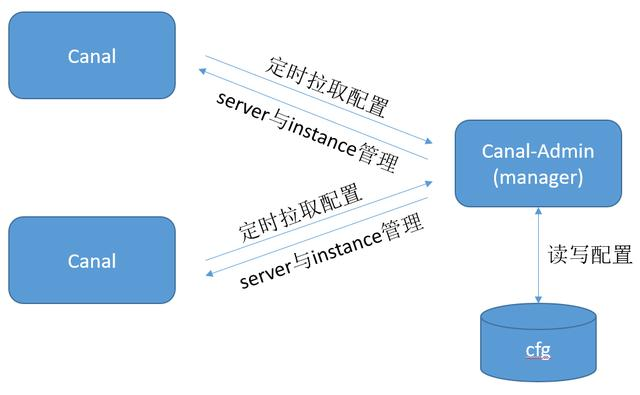
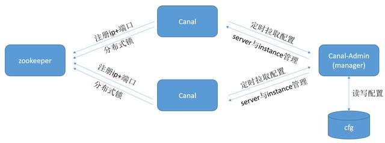
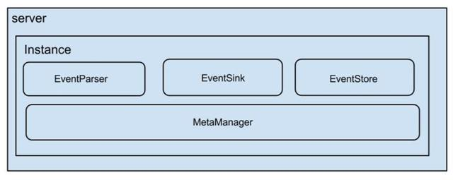
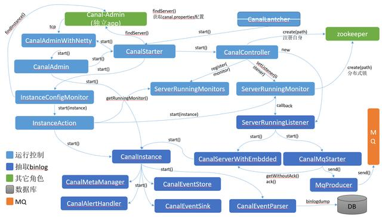

[TOC]
# Canal部署方案各角色如何协作
## Canal中的角色
Canal中包含三种角色，分别是：

- Canal server，通过canal-deployer部署，用于抽取binlog

- Canal manager，canal的管理控制台，在canal server中被称为manager，代码在canal-admin子工程中，提供webui，可选

- Zookeeper：用于存储元数据，canal instance的HA保障

## 相关源码简单阅读
### canal server 与canal admin
打开canal的启动类CanalLauncher，在其main方法中可看到如下代码段：
com.alibaba.otter.canal.deployer.CanalLauncher
```java
PlainCanal canalConfig = configClient.findServer(null);

executor.scheduleWithFixedDelay(new Runnable() {
    ...
    run
    ..
    PlainCanal newCanalConfig = configClient.findServer(lastCanalConfig.getMd5());
```
这里是canal server通过canal admin获取server配置，有两处获取配置的代码：

- 启动时先获取server的配置配置，参数为null

- 默认每5秒获取一次配置，参数为上一次获取的配置的md5

获取配置后，有canalServer.start()方法的调用，用于启动canal server。

从CanalStarter.start()的调用中可以看到创建了CanalController，而CanalController的构造器中有如下代码片断：
```java
  instanceConfigMonitors = MigrateMap.makeComputingMap(new Function<InstanceMode, InstanceConfigMonitor>() {

                public InstanceConfigMonitor apply(InstanceMode mode) {
                    int scanInterval = Integer.valueOf(getProperty(properties,
                        CanalConstants.CANAL_AUTO_SCAN_INTERVAL,
                        "5"));

                    if (mode.isSpring()) {
                        SpringInstanceConfigMonitor monitor = new SpringInstanceConfigMonitor();
                        monitor.setScanIntervalInSecond(scanInterval);
                        monitor.setDefaultAction(defaultAction);
                        // 设置conf目录，默认是user.dir + conf目录组成
                        String rootDir = getProperty(properties, CanalConstants.CANAL_CONF_DIR);
                        if (StringUtils.isEmpty(rootDir)) {
                            rootDir = "../conf";
                        }

                        if (StringUtils.equals("otter-canal", System.getProperty("appName"))) {
                            monitor.setRootConf(rootDir);
                        } else {
                            // eclipse debug模式
                            monitor.setRootConf("src/main/resources/");
                        }
                        return monitor;
                    } else if (mode.isManager()) {
                        ManagerInstanceConfigMonitor monitor = new ManagerInstanceConfigMonitor();
                        monitor.setScanIntervalInSecond(scanInterval);
                        monitor.setDefaultAction(defaultAction);
                        String managerAddress = getProperty(properties, CanalConstants.CANAL_ADMIN_MANAGER);
                        monitor.setConfigClient(getManagerClient(managerAddress));
                        return monitor;
                    } else {
                        throw new UnsupportedOperationException("unknow mode :" + mode + " for monitor");
                    }
                }
            });
```

在InstanceConfigMonitor中，会定时获取Instance配置。

打开canalServer.start()方法，在最后面有代码片断：
```java
// start canalAdmin
        String port = CanalController.getProperty(properties, CanalConstants.CANAL_ADMIN_PORT);
        if (canalAdmin == null && StringUtils.isNotEmpty(port)) {
            String user = CanalController.getProperty(properties, CanalConstants.CANAL_ADMIN_USER);
            String passwd = CanalController.getProperty(properties, CanalConstants.CANAL_ADMIN_PASSWD);
            CanalAdminController canalAdmin = new CanalAdminController(this);
            canalAdmin.setUser(user);
            canalAdmin.setPasswd(passwd);

            String ip = CanalController.getProperty(properties, CanalConstants.CANAL_IP);

            logger.debug("canal admin port:{}, canal admin user:{}, canal admin password: {}, canal ip:{}", port, user, passwd, ip);

            CanalAdminWithNetty canalAdminWithNetty = CanalAdminWithNetty.instance();
            canalAdminWithNetty.setCanalAdmin(canalAdmin);
            canalAdminWithNetty.setPort(Integer.valueOf(port));
            canalAdminWithNetty.setIp(ip);
            canalAdminWithNetty.start();
            this.canalAdmin = canalAdminWithNetty;
        }

        running = true;
```

此处有个canalAdminWithNetty.Start()，从类名和注解来看，这里用了netty并启动了canalAdmin，刚开始看到这里，我就有点懵逼了，这里有蹦出了个admin，manager所在的子工程也叫canal-admin，代码命名上不太友好，canal server中有与manager类似的概念，我们继续进入到canalAdminWithNetty.start()方法：
```java
this.bootstrap = new ServerBootstrap(new NioServerSocketChannelFactory(Executors.newCachedThreadPool(),
            Executors.newCachedThreadPool()));
        /*
         * enable keep-alive mechanism, handle abnormal network connection
         * scenarios on OS level. the threshold parameters are depended on OS.
         * e.g. On Linux: net.ipv4.tcp_keepalive_time = 300
         * net.ipv4.tcp_keepalive_probes = 2 net.ipv4.tcp_keepalive_intvl = 30
         */
        bootstrap.setOption("child.keepAlive", true);
        /*
         * optional parameter.
         */
        bootstrap.setOption("child.tcpNoDelay", true);

        // 构造对应的pipeline
        bootstrap.setPipelineFactory(new ChannelPipelineFactory() {

            public ChannelPipeline getPipeline() throws Exception {
                ChannelPipeline pipelines = Channels.pipeline();
                pipelines.addLast(FixedHeaderFrameDecoder.class.getName(), new FixedHeaderFrameDecoder());
                // support to maintain child socket channel.
                pipelines.addLast(HandshakeInitializationHandler.class.getName(),
                    new HandshakeInitializationHandler(childGroups));
                pipelines.addLast(ClientAuthenticationHandler.class.getName(),
                    new ClientAuthenticationHandler(canalAdmin));

                SessionHandler sessionHandler = new SessionHandler(canalAdmin);
                pipelines.addLast(SessionHandler.class.getName(), sessionHandler);
                return pipelines;
            }
        });

        // 启动
        if (StringUtils.isNotEmpty(ip)) {
            this.serverChannel = bootstrap.bind(new InetSocketAddress(this.ip, this.port));
        } else {
            this.serverChannel = bootstrap.bind(new InetSocketAddress(this.port));
        }
```

这里是使用了netty监听网络数据，端口则是canal.properties里配置的canal.admin.port，我们再来看看创建netty的Bootstrap所使用的ChannelPipeline，其中最重要的是SessionHandler，在SessionHandler中处理读取到的网络数据包：

```java
 public void messageReceived(ChannelHandlerContext ctx, MessageEvent e) throws Exception {
        logger.info("message receives in session handler...");
        ChannelBuffer buffer = (ChannelBuffer) e.getMessage();
        Packet packet = Packet.parseFrom(buffer.readBytes(buffer.readableBytes()).array());
        try {
            String action = null;
            String message = null;
            String destination = null;
            switch (packet.getType()) {
                case SERVER:
                    ServerAdmin serverAdmin = ServerAdmin.parseFrom(packet.getBody());
                    action = serverAdmin.getAction();
                    switch (action) {
                        case "check":
                            message = canalAdmin.check() ? "1" : "0";
                            break;
                        case "start":
                            message = canalAdmin.start() ? "1" : "0";
                            break;
                        case "stop":
                            message = canalAdmin.stop() ? "1" : "0";
                            break;
                        case "restart":
                            message = canalAdmin.restart() ? "1" : "0";
                            break;
                        case "list":
                            message = canalAdmin.getRunningInstances();
                            break;
                        default:
                            byte[] errorBytes = AdminNettyUtils.errorPacket(301,
                                MessageFormatter.format("ServerAdmin action={} is unknown", action).getMessage());
                            AdminNettyUtils.write(ctx.getChannel(), errorBytes);
                            break;
                    }
                    AdminNettyUtils.write(ctx.getChannel(), AdminNettyUtils.ackPacket(message));
                    break;
                case INSTANCE:
                    InstanceAdmin instanceAdmin = InstanceAdmin.parseFrom(packet.getBody());
                    destination = instanceAdmin.getDestination();
                    action = instanceAdmin.getAction();
                    switch (action) {
                        case "check":
                            message = canalAdmin.checkInstance(destination) ? "1" : "0";
                            break;
                        case "start":
                            message = canalAdmin.startInstance(destination) ? "1" : "0";
                            break;
                        case "stop":
                            message = canalAdmin.stopInstance(destination) ? "1" : "0";
                            break;
                        case "release":
                            message = canalAdmin.releaseInstance(destination) ? "1" : "0";
                            break;
                        case "restart":
                            message = canalAdmin.restartInstance(destination) ? "1" : "0";
                            break;
                        default:
                            byte[] errorBytes = AdminNettyUtils.errorPacket(301,
                                MessageFormatter.format("InstanceAdmin action={} is unknown", action).getMessage());
                            AdminNettyUtils.write(ctx.getChannel(), errorBytes);
                            break;
                    }
                    AdminNettyUtils.write(ctx.getChannel(), AdminNettyUtils.ackPacket(message));
                    break;
                case LOG:
                    LogAdmin logAdmin = LogAdmin.parseFrom(packet.getBody());
                    action = logAdmin.getAction();
                    destination = logAdmin.getDestination();
                    String type = logAdmin.getType();
                    String file = logAdmin.getFile();
                    int count = logAdmin.getCount();
                    switch (type) {
                        case "server":
                            if ("list".equalsIgnoreCase(action)) {
                                message = canalAdmin.listCanalLog();
                            } else {
                                message = canalAdmin.canalLog(count);
                            }
                            break;
                        case "instance":
                            if ("list".equalsIgnoreCase(action)) {
                                message = canalAdmin.listInstanceLog(destination);
                            } else {
                                message = canalAdmin.instanceLog(destination, file, count);
                            }
                            break;
                        default:
                            byte[] errorBytes = AdminNettyUtils.errorPacket(301,
                                MessageFormatter.format("LogAdmin type={} is unknown", type).getMessage());
                            AdminNettyUtils.write(ctx.getChannel(), errorBytes);
                            break;
                    }
                    AdminNettyUtils.write(ctx.getChannel(), AdminNettyUtils.ackPacket(message));
                    break;
                default:
                    byte[] errorBytes = AdminNettyUtils.errorPacket(300,
                        MessageFormatter.format("packet type={} is NOT supported!", packet.getType()).getMessage());
                    AdminNettyUtils.write(ctx.getChannel(), errorBytes);
                    break;
            }
        } catch (Throwable exception) {
            byte[] errorBytes = AdminNettyUtils.errorPacket(400,
                MessageFormatter.format("something goes wrong with channel:{}, exception={}",
                    ctx.getChannel(),
                    ExceptionUtils.getStackTrace(exception)).getMessage());
            AdminNettyUtils.write(ctx.getChannel(), errorBytes);
        }
    }
```
看到这里也就明白了，这个CanalAdminWithNetty实际上就是给manager调用的，用于对canal做管理，在manager的webui上可以看到对应的功能：


那么canal server与canal manager之间是一个双向调用的关系：


canal-admin有两个作用：

- 类似于配置中心，所有canal server从canal-admin定时摘取配置，包括server配置与instance配置，也就是canal.properties和instance.properties的内容

- 对canal server和canal instance的状态做管控，控制server/instance的启动停止等

canal server与canal-admin之间是双向调用，canal server即是canal-admin的客户端，同时也会响应canal admin的请求

### canal server与zookeeper
回到CanalController类，我们可以在start方法中看到，在启动时，会向zk注册一个临时节点，此目录包含当前机器的ip和端口（配置中的canal.registerIp, canal.port），当有新的session建议时，会重新注册该节点，很明显，这里类似于注册中心的作用，canal server启动时，先向zk注册自身的地址：
```java

    public void start() throws Throwable {
        logger.info("## start the canal server[{}({}):{}]", ip, registerIp, port);
        // 创建整个canal的工作节点
        final String path = ZookeeperPathUtils.getCanalClusterNode(registerIp + ":" + port);
        initCid(path);
        if (zkclientx != null) {
            // 向zk注册自身地址;
            this.zkclientx.subscribeStateChanges(new IZkStateListener() {

                public void handleStateChanged(KeeperState state) throws Exception {

                }

                public void handleNewSession() throws Exception {
                    initCid(path);
                }

                @Override
                public void handleSessionEstablishmentError(Throwable error) throws Exception {
                    logger.error("failed to connect to zookeeper", error);
                }
            });
        }
        // 优先启动embeded服务
        embededCanalServer.start();
        // 尝试启动一下非lazy状态的通道
        for (Map.Entry<String, InstanceConfig> entry : instanceConfigs.entrySet()) {
            final String destination = entry.getKey();
            InstanceConfig config = entry.getValue();
            // 创建destination的工作节点
            if (!embededCanalServer.isStart(destination)) {
                // HA机制启动
                ServerRunningMonitor runningMonitor = ServerRunningMonitors.getRunningMonitor(destination);
                if (!config.getLazy() && !runningMonitor.isStart()) {
                    runningMonitor.start();
                }
            }

            if (autoScan) {
                instanceConfigMonitors.get(config.getMode()).register(destination, defaultAction);
            }
        }

        if (autoScan) {
            instanceConfigMonitors.get(globalInstanceConfig.getMode()).start();
            for (InstanceConfigMonitor monitor : instanceConfigMonitors.values()) {
                if (!monitor.isStart()) {
                    monitor.start();
                }
            }
        }

        // 启动网络接口
        if (canalServer != null) {
            canalServer.start();
        }
    }
```
在CanalController中，我们可以看到ServerRunningMonitor对象的创建代码：
```java
 final ServerRunningData serverData = new ServerRunningData(registerIp + ":" + port);
        ServerRunningMonitors.setServerData(serverData);
        ServerRunningMonitors.setRunningMonitors(MigrateMap.makeComputingMap(new Function<String, ServerRunningMonitor>() {

            public ServerRunningMonitor apply(final String destination) {
                ServerRunningMonitor runningMonitor = new ServerRunningMonitor(serverData);
                runningMonitor.setDestination(destination);
                runningMonitor.setListener(new ServerRunningListener() {
                    ...
```

ServerRunningMonitor是针对每 一个destination的，即一个instance会创建一个ServerRunningMonitor，在ServerRunningMonitor.initRunning()方法中，会从zk上创建节点，成功则初始化instance，如果失败，则只从zk获取到运行instance的节点数据：
```java
    private void initRunning() {
        if (!isStart()) {
            return;
        }

        String path = ZookeeperPathUtils.getDestinationServerRunning(destination);
        // 序列化
        byte[] bytes = JsonUtils.marshalToByte(serverData);
        try {
            mutex.set(false);
            zkClient.create(path, bytes, CreateMode.EPHEMERAL);
            activeData = serverData;
            processActiveEnter();// 触发一下事件
            mutex.set(true);
            release = false;
        } catch (ZkNodeExistsException e) {
            bytes = zkClient.readData(path, true);
            if (bytes == null) {// 如果不存在节点，立即尝试一次
                initRunning();
            } else {
                activeData = JsonUtils.unmarshalFromByte(bytes, ServerRunningData.class);
            }
        } catch (ZkNoNodeException e) {
            zkClient.createPersistent(ZookeeperPathUtils.getDestinationPath(destination), true); // 尝试创建父节点
            initRunning();
        }
    }
```
## 角色之间的关系总览
从CanalController与ServerRunningMonitor中可以看到有两处zk交互点，一个是注册自身的ip+端口，一个是创建节点并初始化instance（分布式锁），总体上看，三角色之间有如下交互关系：


## Canal的内部组件
Canal使用了组件生命周期管理的方式管理管理各个组件，有点类似于Tomcat，github上的原图：


每一个组件都实现了CanalLifeCycle接口，该接口定义如下：
```java
public interface CanalLifeCycle {

    void start();

    void stop();

    boolean isStart();
}
```

## 内部组件之间的关系
Canal是一个多角色的分布式系统，除了binlog的抽取外，还有大量生命周期控制类的代码，以start()为例，主要组件之间的详细关系如下图：
