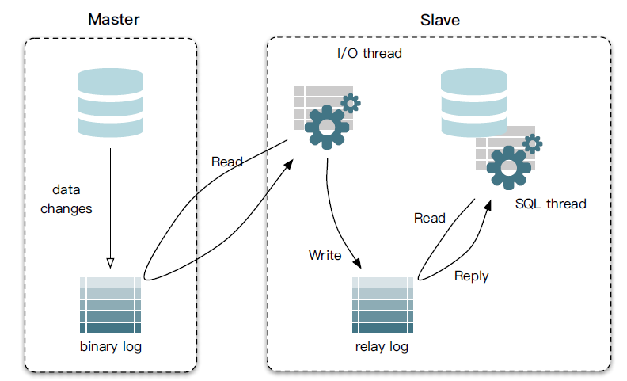
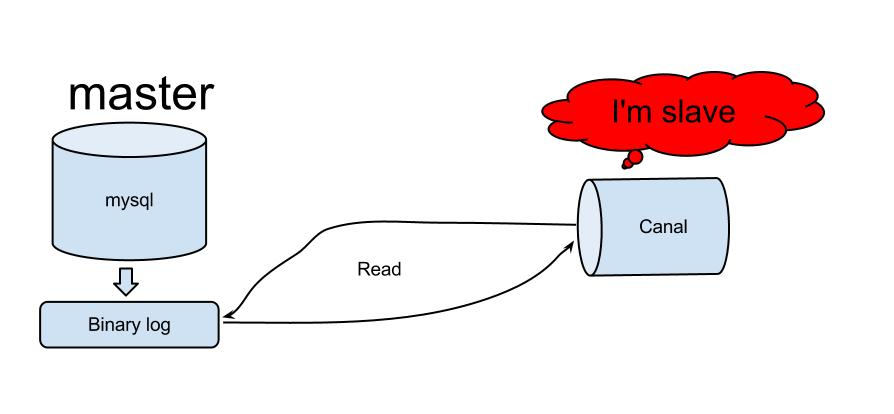
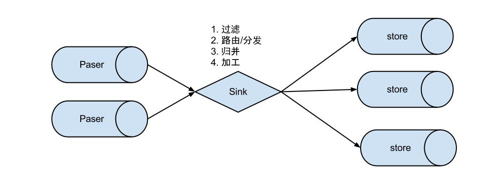
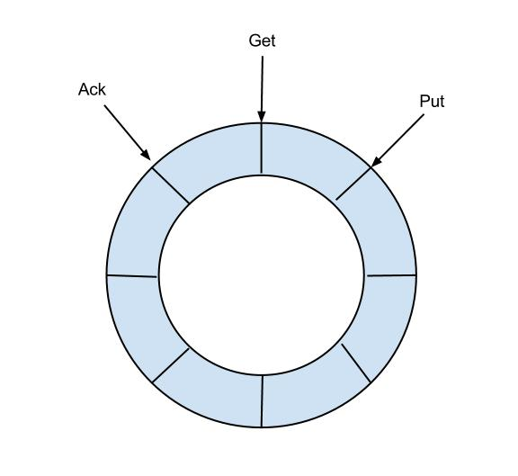
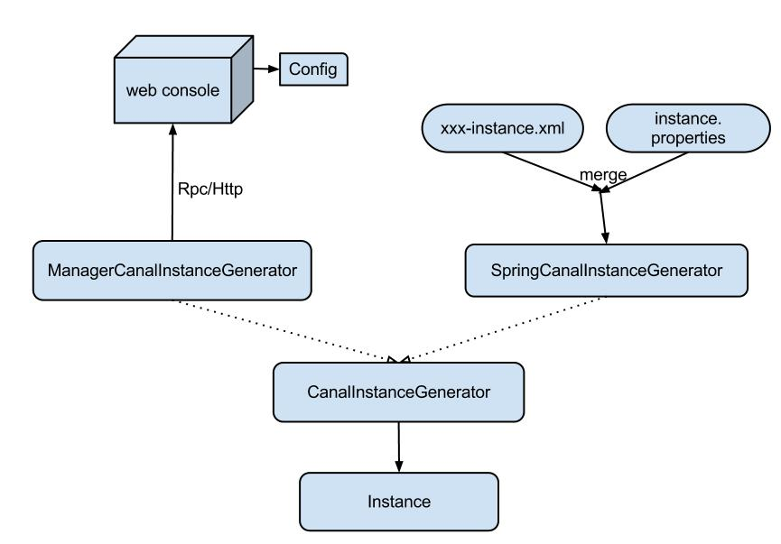
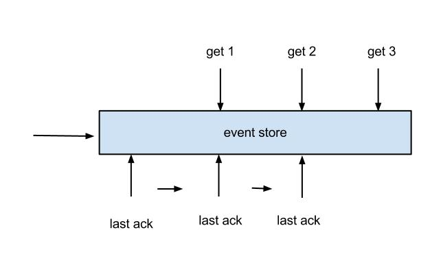
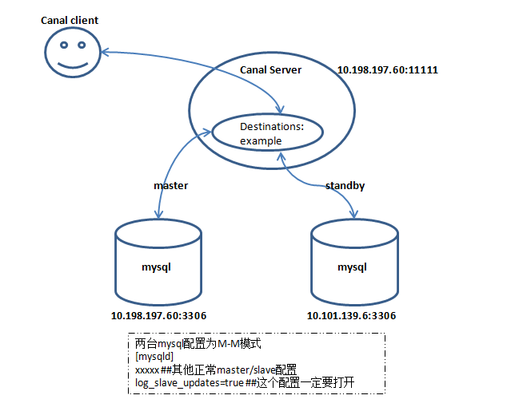
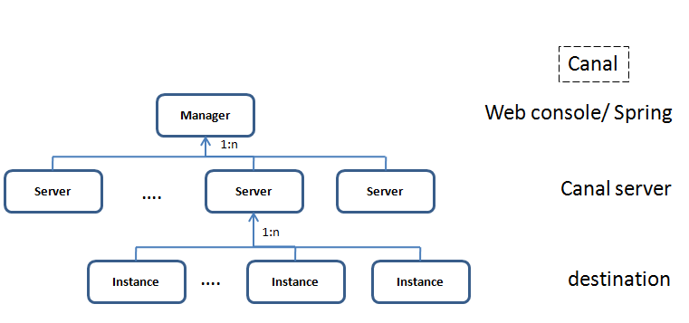
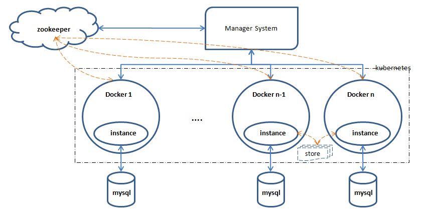

[TOC]
## 概述

canal是阿里巴巴旗下的一款开源项目，纯Java开发。基于数据库增量日志解析，提供增量数据订阅&消费，目前主要支持了mysql（也支持mariaDB）。

起源：早期，阿里巴巴B2B公司因为存在杭州和美国双机房部署，存在跨机房同步的业务需求。不过早期的数据库同步业务，主要是基于trigger的方式获取增量变更，不过从2010年开始，阿里系公司开始逐步的尝试基于数据库的日志解析，获取增量变更进行同步，由此衍生出了增量订阅&消费的业务，从此开启了一段新纪元。

基于日志增量订阅&消费支持的业务：

1.  数据库镜像
2.  数据库实时备份
3.  多级索引 (卖家和买家各自分库索引)
4.  search build
5.  业务cache刷新
6.  价格变化等重要业务消息

* * *

## 工作原理

### mysql主备复制实现：  
  
从上层来看，复制分成三步：

1.  master将改变记录到二进制日志(binary log)中（这些记录叫做二进制日志事件，binary log events，可以通过show binlog events进行查看）；
2.  slave将master的binary log events拷贝到它的中继日志(relay log)；
3.  slave重做中继日志中的事件，将改变反映它自己的数据。

### canal的工作原理 
  
原理相对比较简单：

1.  canal模拟mysql slave的交互协议，伪装自己为mysql slave，向mysql master发送dump协议
2.  mysql master收到dump请求，开始推送binary log给slave(也就是canal)
3.  canal解析binary log对象(原始为byte流)

* * *

## 架构设计

个人理解，数据增量订阅与消费应当有如下几个点：

*   增量订阅和消费模块应当包括binlog日志抓取，binlog日志解析，事件分发过滤（EventSink），存储（EventStore）等主要模块。
*   如果需要确保HA可以采用Zookeeper保存各个子模块的状态，让整个增量订阅和消费模块实现无状态化，当然作为consumer(客户端)的状态也可以保存在zk之中。
*   整体上通过一个Manager System进行集中管理，分配资源。  
    可以参考下图：

![[]](img/plus-k.jpg)

### canal架构设计

![[]](img/canal-k.jpg)  
说明：

*   server代表一个canal运行实例，对应于一个jvm
*   instance对应于一个数据队列 （1个server对应1…n个instance)

instance模块：

*   eventParser (数据源接入，模拟slave协议和master进行交互，协议解析)
*   eventSink (Parser和Store链接器，进行数据过滤，加工，分发的工作)
*   eventStore (数据存储)
*   metaManager (增量订阅&消费信息管理器)

### EventParser
  
整个parser过程大致可分为几部：

1.  Connection获取上一次解析成功的位置（如果第一次启动，则获取初始制定的位置或者是当前数据库的binlog位点）
2.  Connection建立连接，发生BINLOG_DUMP命令
3.  Mysql开始推送Binary Log
4.  接收到的Binary Log通过Binlog parser进行协议解析，补充一些特定信息
5.  传递给EventSink模块进行数据存储，是一个阻塞操作，直到存储成功
6.  存储成功后，定时记录Binary Log位置

### EventSink设计

说明：

*   数据过滤：支持通配符的过滤模式，表名，字段内容等
*   数据路由/分发：解决1:n (1个parser对应多个store的模式)
*   数据归并：解决n:1 (多个parser对应1个store)
*   数据加工：在进入store之前进行额外的处理，比如join

1 数据1:n业务 ：

为了合理的利用数据库资源， 一般常见的业务都是按照schema进行隔离，然后在mysql上层或者dao这一层面上，进行一个数据源路由，屏蔽数据库物理位置对开发的影响，阿里系主要是通过cobar/tddl来解决数据源路由问题。 所以，一般一个数据库实例上，会部署多个schema，每个schema会有由1个或者多个业务方关注。

2 数据n:1业务：

同样，当一个业务的数据规模达到一定的量级后，必然会涉及到水平拆分和垂直拆分的问题，针对这些拆分的数据需要处理时，就需要链接多个store进行处理，消费的位点就会变成多份，而且数据消费的进度无法得到尽可能有序的保证。 所以，在一定业务场景下，需要将拆分后的增量数据进行归并处理，比如按照时间戳/全局id进行排序归并.

### EventStore设计

目前实现了Memory内存、本地file存储以及持久化到zookeeper以保障数据集群共享。  
Memory内存的RingBuffer设计：  
  
定义了3个cursor

*   Put : Sink模块进行数据存储的最后一次写入位置
*   Get : 数据订阅获取的最后一次提取位置
*   Ack : 数据消费成功的最后一次消费位置

借鉴Disruptor的RingBuffer的实现，将RingBuffer拉直来看：  
  
实现说明：

*   Put/Get/Ack cursor用于递增，采用long型存储
*   buffer的get操作，通过取余或者与操作。(与操作： cusor & (size - 1) , size需要为2的指数，效率比较高)

### Instance设计

instance代表了一个实际运行的数据队列，包括了EventPaser,EventSink,EventStore等组件。  
抽象了CanalInstanceGenerator，主要是考虑配置的管理方式：

*   manager方式： 和你自己的内部web console/manager系统进行对接。(alibaba内部使用方式)
*   spring方式：基于spring xml + properties进行定义，构建spring配置.
*   spring/memory-instance.xml 所有的组件(parser , sink , store)都选择了内存版模式，记录位点的都选择了memory模式，重启后又会回到初始位点进行解析。特点：速度最快，依赖最少
*   spring/file-instance.xml 所有的组件(parser , sink , store)都选择了基于file持久化模式，注意，不支持HA机制.支持单机持久化
*   spring/default-instance.xml 所有的组件(parser , sink , store)都选择了持久化模式，目前持久化的方式主要是写入zookeeper，保证数据集群共享. 支持HA
*   spring/group-instance.xml 主要针对需要进行多库合并时，可以将多个物理instance合并为一个逻辑instance，提供客户端访问。场景：分库业务。 比如产品数据拆分了4个库，每个库会有一个instance，如果不用group，业务上要消费数据时，需要启动4个客户端，分别链接4个instance实例。使用group后，可以在canal server上合并为一个逻辑instance，只需要启动1个客户端，链接这个逻辑instance即可.

### Server设计

  
server代表了一个canal的运行实例，为了方便组件化使用，特意抽象了Embeded(嵌入式) / Netty(网络访问)的两种实现：

*   Embeded : 对latency和可用性都有比较高的要求，自己又能hold住分布式的相关技术(比如failover)
*   Netty : 基于netty封装了一层网络协议，由canal server保证其可用性，采用的pull模型，当然latency会稍微打点折扣，不过这个也视情况而定。

### 增量订阅/消费设计

  
具体的协议格式，可参见：[CanalProtocol.proto](https://github.com/alibaba/canal/blob/master/protocol/src/main/java/com/alibaba/otter/canal/protocol/CanalProtocol.proto)
get/ack/rollback协议介绍：

*   Message getWithoutAck(int batchSize)，允许指定batchSize，一次可以获取多条，每次返回的对象为Message，包含的内容为：  
    a. batch id 唯一标识  
    b. entries 具体的数据对象，对应的数据对象格式：EntryProtocol.proto
*   void rollback(long batchId)，顾命思议，回滚上次的get请求，重新获取数据。基于get获取的batchId进行提交，避免误操作
*   void ack(long batchId)，顾命思议，确认已经消费成功，通知server删除数据。基于get获取的batchId进行提交，避免误操作  
    canal的get/ack/rollback协议和常规的jms协议有所不同，允许get/ack异步处理，比如可以连续调用get多次，后续异步按顺序提交ack/rollback，项目中称之为流式api.  
    流式api设计的好处：
*   get/ack异步化，减少因ack带来的网络延迟和操作成本 (99%的状态都是处于正常状态，异常的rollback属于个别情况，没必要为个别的case牺牲整个性能)
*   get获取数据后，业务消费存在瓶颈或者需要多进程/多线程消费时，可以不停的轮询get数据，不停的往后发送任务，提高并行化. (作者在实际业务中的一个case：业务数据消费需要跨中美网络，所以一次操作基本在200ms以上，为了减少延迟，所以需要实施并行化)  
    流式api设计：  
    
*   每次get操作都会在meta中产生一个mark，mark标记会递增，保证运行过程中mark的唯一性
*   每次的get操作，都会在上一次的mark操作记录的cursor继续往后取，如果mark不存在，则在last ack cursor继续往后取
*   进行ack时，需要按照mark的顺序进行数序ack，不能跳跃ack. ack会删除当前的mark标记，并将对应的mark位置更新为last ack cusor
*   一旦出现异常情况，客户端可发起rollback情况，重新置位：删除所有的mark, 清理get请求位置，下次请求会从last ack cursor继续往后取

## 数据格式

canal采用protobuff:

    Entry
    	Header
    		logfileName [binlog文件名]
    		logfileOffset [binlog position]
    		executeTime [发生的变更]
    		schemaName 
    		tableName
    		eventType [insert/update/delete类型]
    	entryType 	[事务头BEGIN/事务尾END/数据ROWDATA]
    	storeValue 	[byte数据,可展开，对应的类型为RowChange]	
    RowChange
    	isDdl		[是否是ddl变更操作，比如create table/drop table]
    	sql		[具体的ddl sql]
    	rowDatas	[具体insert/update/delete的变更数据，可为多条，1个binlog event事件可对应多条变更，比如批处理]
    		beforeColumns [Column类型的数组]
    		afterColumns [Column类型的数组]		
    Column 
    	index		
    	sqlType		[jdbc type]
    	name		[column name]
    	isKey		[是否为主键]
    	updated		[是否发生过变更]
    	isNull		[值是否为null]
    	value		[具体的内容，注意为文本]
    

**canal-message example**:  
比如数据库中的表：

    mysql> select * from person;
    +----+------+------+------+
    | id | name | age  | sex  |
    +----+------+------+------+
    |  1 | zzh  |   10 | m    |
    |  3 | zzh3 |   12 | f    |
    |  4 | zzh4 |    5 | m    |
    +----+------+------+------+
    3 rows in set (0.00 sec)
    

更新一条数据（update person set age=15 where id=4）：

    ****************************************************
    * Batch Id: [2] ,count : [3] , memsize : [165] , Time : 2016-09-07 15:54:18
    * Start : [mysql-bin.000003:6354:1473234846000(2016-09-07 15:54:06)] 
    * End : [mysql-bin.000003:6550:1473234846000(2016-09-07 15:54:06)] 
    ****************************************************
    
    ================> binlog[mysql-bin.000003:6354] , executeTime : 1473234846000 , delay : 12225ms
     BEGIN ----> Thread id: 67
    ----------------> binlog[mysql-bin.000003:6486] , name[canal_test,person] , eventType : UPDATE , executeTime : 1473234846000 , delay : 12225ms
    id : 4    type=int(11)
    name : zzh4    type=varchar(100)
    age : 15    type=int(11)    update=true
    sex : m    type=char(1)
    ----------------
     END ----> transaction id: 308
    ================> binlog[mysql-bin.000003:6550] , executeTime : 1473234846000 , delay : 12240ms
    

## HA机制设计

canal的HA分为两部分，canal server和canal client分别有对应的ha实现：

*   canal server: 为了减少对mysql dump的请求，不同server上的instance要求同一时间只能有一个处于running，其他的处于standby状态.
*   canal client: 为了保证有序性，一份instance同一时间只能由一个canal client进行get/ack/rollback操作，否则客户端接收无法保证有序。  
    整个HA机制的控制主要是依赖了zookeeper的几个特性，watcher和EPHEMERAL节点(和session生命周期绑定)，可以看下我之前zookeeper的相关文章。

Canal Server:  

大致步骤：

1.  canal server要启动某个canal instance时都先向zookeeper进行一次尝试启动判断 (实现：创建EPHEMERAL节点，谁创建成功就允许谁启动)
2.  创建zookeeper节点成功后，对应的canal server就启动对应的canal instance，没有创建成功的canal instance就会处于standby状态
3.  一旦zookeeper发现canal server A创建的节点消失后，立即通知其他的canal server再次进行步骤1的操作，重新选出一个canal server启动instance.
4.  canal client每次进行connect时，会首先向zookeeper询问当前是谁启动了canal instance，然后和其建立链接，一旦链接不可用，会重新尝试connect.  
    Canal Client的方式和canal server方式类似，也是利用zokeeper的抢占EPHEMERAL节点的方式进行控制.

HA配置架构图（举例）如下所示：  

### canal其他链接方式

canal还有几种连接方式：

1.  单连  
    
2.  两个client+两个instance+1个mysql  
    当mysql变动时，两个client都能获取到变动  
    
3.  一个server+两个instance+两个mysql+两个client  
    
4.  instance的standby配置  
    

* * *

## 整体架构  
从整体架构上来说canal是这种架构的（canal中没有包含一个运维的console web来对接，但要运用于分布式环境中肯定需要一个Manager来管理）：  
  
一个总体的manager system对应于n个Canal Server（物理上来说是一台服务器）, 那么一个Canal Server对应于n个Canal Instance(destinations). 大体上是三层结构，第二层也需要Manager统筹运维管理。  
那么随着Docker技术的兴起，是否可以试一下下面的架构呢？  

*   一个docker中跑一个instance服务，相当于略去server这一层的概念。
*   Manager System中配置一个instance,直接调取一个docker发布这个instance,其中包括向这个instance发送配置信息，启动instance服务.
*   instance在运行过程中，定时刷新binlog filename+ binlog position的信息至zk。
*   如果一个instance出现故障，instance本身报错或者zk感知此node消失，则根据相应的信息，比如上一步保存的binlog filename+binlog position重新开启一个docker服务，当然这里可以适当的加一些重试机制。
*   当要更新时，类似AB test, 先关闭一个docker,然后开启新的已更新的替换，循序渐进的进行。
*   当涉及到分表分库时，多个物理表对应于一个逻辑表，可以将结果存于一个公共的模块（比如MQ），或者单独存取也可以，具体情况具体分析
*   存储可以参考canal的多样化：内存，文件，zk，或者加入至MQ中
*   docker由此之外的工具管理，比如kubernetes
*   也可以进一步添加HA的功能，两个docker对应一个mysql，互为主备，类似Canal的HA架构。如果时效性不是贴别强的场景，考虑到成本，此功能可以不采用。

* * *

## 总结

这里总结了一下Canal的一些点，仅供参考：

1.  原理：模拟mysql slave的交互协议，伪装自己为mysql slave，向mysql master发送dump协议；mysql master收到dump请求，开始推送binary log给slave(也就是canal)；解析binary log对象(原始为byte流)
2.  重复消费问题：在消费端解决。
3.  采用开源的open-replicator来解析binlog
4.  canal需要维护EventStore，可以存取在Memory, File, zk
5.  canal需要维护客户端的状态，同一时刻一个instance只能有一个消费端消费
6.  数据传输格式：protobuff
7.  支持binlog format 类型:statement, row, mixed. 多次附加功能只能在row下使用，比如otter
8.  binlog position可以支持保存在内存，文件，zk中
9.  instance启动方式：rpc/http; 内嵌
10.  有ACK机制
11.  无告警，无监控，这两个功能都需要对接外部系统
12.  方便快速部署。

* * *

参考资料
----

1.  [canal](https://github.com/alibaba/canal)
2.  [原文](https://blog.csdn.net/u013256816/article/details/52475190)