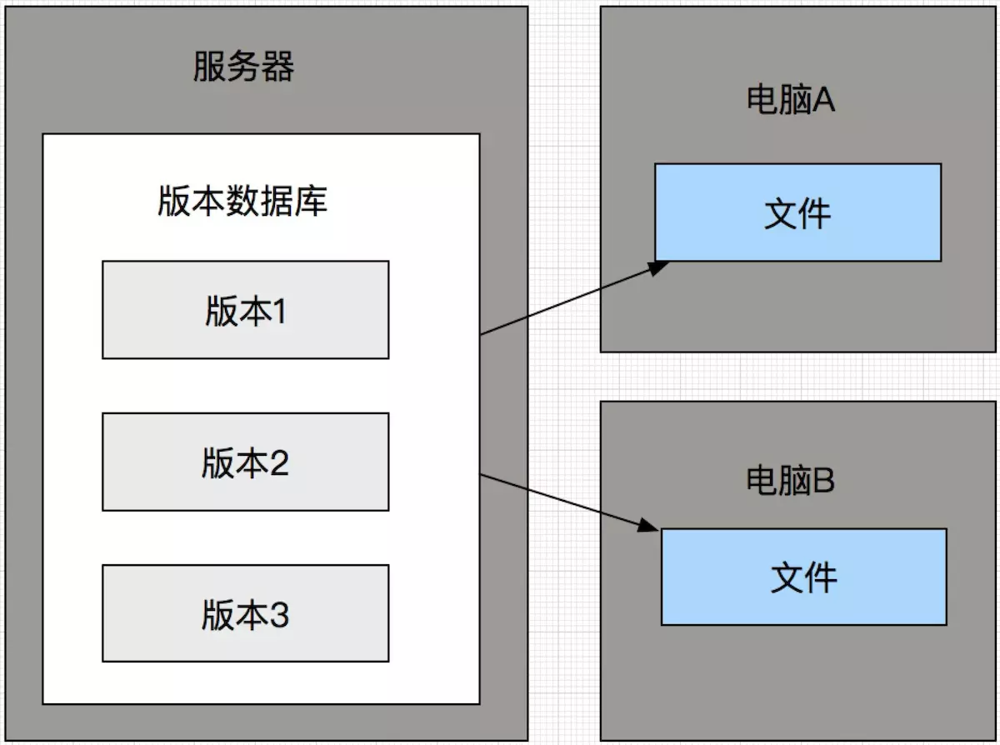
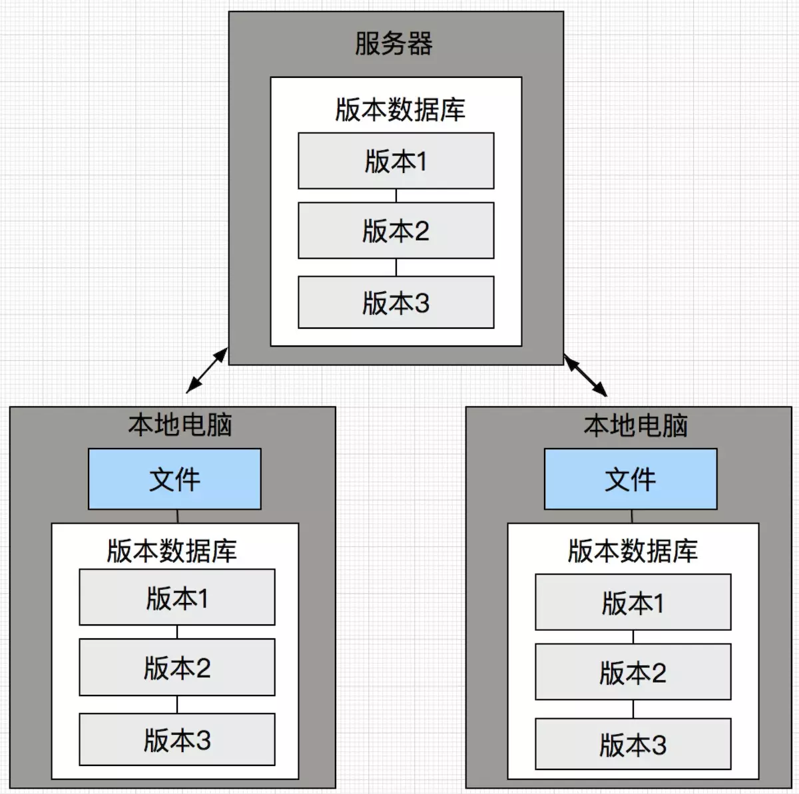
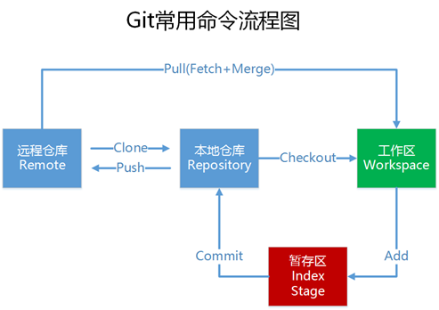

https://git-scm.com/book/zh/v2
# SVN 与 分布式版本控制系统git
 
 

主要优点:可以离线工作，分布式版本管理系统每个计算机都有一个完整的仓库，可本地提交，可以做到离线工作。没有了SVN令人抓狂的断网无法工作问题

1. GIT是分布式的，SVN为集中式的

这是常识，两者最重要的区别，也是后面所有区别的基石；

2. GIT随处都是版本库，SVN只有一个中央版本库

因为GIT是分布式的所以能做到到处都是版本库，而SVN是集中式的，所以只有一个中央仓库。因而GIT能够做到无需网络提交，到处到时版本库，压根不用担心提交速度问题，不用时刻依赖与网络工作，不用担心单点故障。当工作完成之后直接推送远程即可实现工作协作；

3. GIT没有全局版本号，SVN有全局版本号

GIT版本库到处都是，之间没有实时共享数据，所以无法确保版本号的唯一性，无法使用全局版本号，分布在各个机器上的版本库版本号使用40位的HASH值取代。重复的情况是存在的，从数学的角度考虑，可能性是2的63次方分之一，基本可忽略。而对于SVN，唯一版本，所以能够做到使用全局的版本号，版本号采用自增的方式；

4. GIT把内容按元数据存储，SVN按文件存储

GIT存储的不是实际的文件，而是指向性数据。SVN保存的是文件数据。当GIT切换版本的时候，实际上切换的是元数据，而且本地操作，快捷有效；

5. GIT记录文件快照，SVN记录文件差异

GIT的元数据，即指向性数据指向的是实际的文件快照，这也是GIT能够快速切换版本的一个原因。SVN保存的文件数据是各个版本之间的文件差异，所以切换版本的时候需要逐级的差异计算，速度比较慢，而且还需网络传输。当工程较大时，速度与GIT相比差异会相当的大。

# GIT架构
GIT的架构，可以分为几个部分：

- 本地工作区(working directory)
- 暂存区(stage area, 又称为索引区, index)
- 本地仓库(local repository,.git directory)
- 远程仓库(remote repository)

 

1. 工作区(working directory)

工作区，简言之就是你工作的区域。对于git而言，就是的本地工作目录。工作区的内容会包含提交到暂存区和版本库(当前提交点)的内容，同时也包含自己的修改内容。

2. 暂存区(stage area, 又称为索引区index)

暂存区是git中一个非常重要的概念。是我们把修改提交版本库前的一个过渡阶段。查看GIT自带帮助手册的时候，通常以index来表示暂存区。在工作目录下有一个.git的目录，里面有个index文件，存储着关于暂存区的内容。git add命令将工作区内容添加到暂存区。

3. 本地仓库(local repository)

版本控制系统的仓库，存在于本地。当执行git commit命令后，会将暂存区内容提交到仓库之中。在工作区下面有.git的目录，这个目录下的内容不属于工作区，里面便是仓库的数据信息，暂存区相关内容也在其中。Git 仓库目录是 Git 用来保存项目的元数据和对象数据库的地方。 这是 Git 中最重要的部分，从其它计算机克隆仓库时，拷贝的就是这里的数据。

4. 远程版本库(remote repository)

远程版本库与本地仓库概念基本一致，不同之处在于一个存在远程，可用于远程协作，一个却是存在于本地。通过push/pull可实现本地与远程的交互；

5. 其实还有个 远程仓库副本

可以理解为存在于本地的远程仓库缓存。如需更新，可通过git fetch/pull命令获取远程仓库内容。使用fech获取时，并未合并到本地仓库，此时可使用git merge实现远程仓库副本与本地仓库的合并。

# Git仓库.git文件夹目录介绍
https://blog.csdn.net/songyuequan/article/details/82933745
https://www.cnblogs.com/yelbosh/p/7471979.html
http://www.sohu.com/a/115137833_494937
https://www.jianshu.com/p/c18e472fbf19