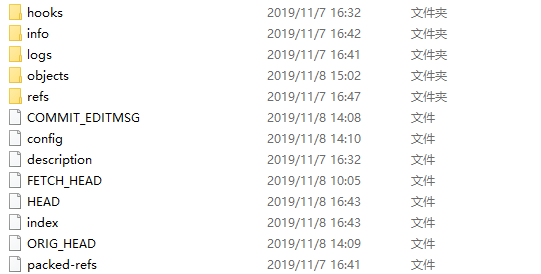
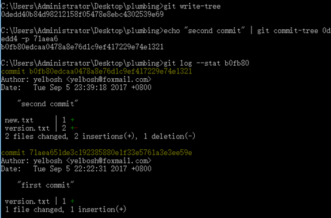
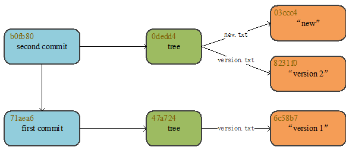
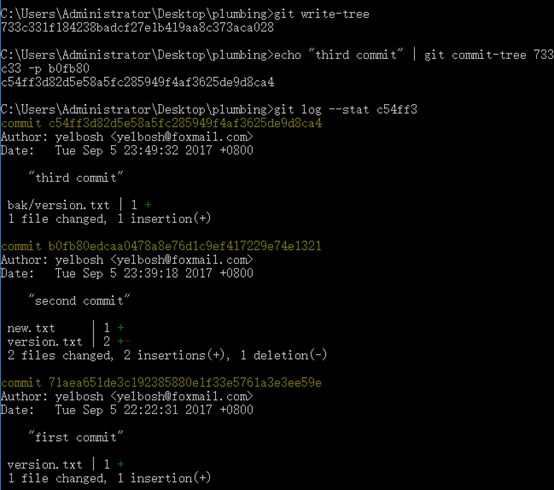
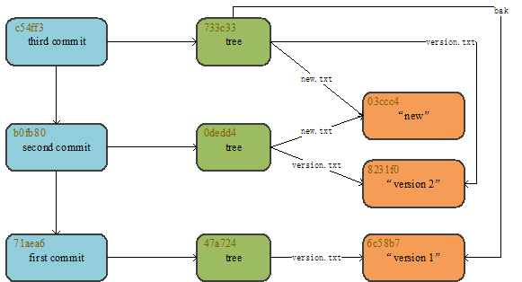

https://git-scm.com/book/zh/v2
# SVN 与 分布式版本控制系统git
 
 

主要优点:可以离线工作，分布式版本管理系统每个计算机都有一个完整的仓库，可本地提交，可以做到离线工作。没有了SVN令人抓狂的断网无法工作问题

1. GIT是分布式的，SVN为集中式的

这是常识，两者最重要的区别，也是后面所有区别的基石；

2. GIT随处都是版本库，SVN只有一个中央版本库

因为GIT是分布式的所以能做到到处都是版本库，而SVN是集中式的，所以只有一个中央仓库。因而GIT能够做到无需网络提交，到处到时版本库，压根不用担心提交速度问题，不用时刻依赖与网络工作，不用担心单点故障。当工作完成之后直接推送远程即可实现工作协作；

3. GIT没有全局版本号，SVN有全局版本号

GIT版本库到处都是，之间没有实时共享数据，所以无法确保版本号的唯一性，无法使用全局版本号，分布在各个机器上的版本库版本号使用40位的HASH值取代。重复的情况是存在的，从数学的角度考虑，可能性是2的63次方分之一，基本可忽略。而对于SVN，唯一版本，所以能够做到使用全局的版本号，版本号采用自增的方式；

4. GIT把内容按元数据存储，SVN按文件存储

GIT存储的不是实际的文件，而是指向性数据。SVN保存的是文件数据。当GIT切换版本的时候，实际上切换的是元数据，而且本地操作，快捷有效；

5. GIT记录文件快照，SVN记录文件差异

GIT的元数据，即指向性数据指向的是实际的文件快照，这也是GIT能够快速切换版本的一个原因。SVN保存的文件数据是各个版本之间的文件差异，所以切换版本的时候需要逐级的差异计算，速度比较慢，而且还需网络传输。当工程较大时，速度与GIT相比差异会相当的大。


# GIT架构
GIT的架构，可以分为几个部分：

- 本地工作区(working directory)
- 暂存区(stage area, 又称为索引区, index)
- 本地仓库(local repository,.git directory)
- 远程仓库(remote repository)

 


1. 工作区(working directory)

工作区，简言之就是你工作的区域。对于git而言，就是的本地工作目录。工作区的内容会包含提交到暂存区和版本库(当前提交点)的内容，同时也包含自己的修改内容。

2. 暂存区(stage area, 又称为索引区index)

暂存区是git中一个非常重要的概念。是我们把修改提交版本库前的一个过渡阶段。查看GIT自带帮助手册的时候，通常以index来表示暂存区。在工作目录下有一个.git的目录，里面有个index文件，存储着关于暂存区的内容。git add命令将工作区内容添加到暂存区。

3. 本地仓库(local repository)

版本控制系统的仓库，存在于本地。当执行git commit命令后，会将暂存区内容提交到仓库之中。在工作区下面有.git的目录，这个目录下的内容不属于工作区，里面便是仓库的数据信息，暂存区相关内容也在其中。Git 仓库目录是 Git 用来保存项目的元数据和对象数据库的地方。 这是 Git 中最重要的部分，从其它计算机克隆仓库时，拷贝的就是这里的数据。

4. 远程版本库(remote repository)

远程版本库与本地仓库概念基本一致，不同之处在于一个存在远程，可用于远程协作，一个却是存在于本地。通过push/pull可实现本地与远程的交互；

5. 其实还有个 远程仓库副本

可以理解为存在于本地的远程仓库缓存。如需更新，可通过git fetch/pull命令获取远程仓库内容。使用fech获取时，并未合并到本地仓库，此时可使用git merge实现远程仓库副本与本地仓库的合并。

# Git仓库.git文件夹目录介绍

- HEAD
 HEAD 指向当前所在的分支,文件内容：ref: refs/heads/tttt
 找到对应的文件，其实就是工作区的在版本库中的那个提交点，最终会指向一个40位的HASH值

- ORIG_HEAD
远程仓库 当前引用

- FETCH_HEAD
最后fetch引用

- packed-refs
clone仓库时所有的引用

- COMMIT_EDITMSG
本地最后一个提交的信息

- config
该文件主要记录针对该项目的一些配置信息，例如是否以bare方式初始化、remote的信息等，通过git remote add命令增加的远程分支的信息就保存在这里；如使用命令git config user.name poloxue便会记录在此文件；
- description
被gitweb (Github的原型)用来显示对repo的描述。

- index
该文件保存了暂存区域的信息。该文件某种程度就是缓冲区（staging area），内容包括它指向的文件的时间戳、文件名、sha1值等；

- hooks文件夹
hooks主要定义了客户端或服务端钩子脚本，这些脚本主要用于在特定的命令和操作(如commit/release/pull/push)之前或者之后进行特定的处理，比如：当你把本地仓库push到服务器的远程仓库时，可以在服务器仓库的hooks文件夹下定义post_update脚本，在该脚本中可以通过脚本代码将最新的代码部署到服务器的web服务器上，从而将版本控制和代码发布无缝连接起来；如pre-push可以用来强制进行代码检查。

- info文件夹
info文件夹保存了一份不希望在.gitignore 文件中管理的忽略模式的全局可执行文件，基本也用不上；
-- info/exclue
可以做到和.gitignore相同的事情，用于排除不要包含进版本库的文件。区别就是，此文件不会被共享。

- logs文件夹
记录了本地仓库和远程仓库的每一个分支的提交记录，即所有的commit对象（包括时间、作者等信息）都会被记录在这个文件夹中，因此这个文件夹中的内容是我们查看最频繁的，不管是Git log命令还是tortoiseGit的show log，都需要从该文件夹中获取提交日志

- refs文件夹
该文件夹存储指向数据（分支）的提交对象的指针。其中heads文件夹存储本地每一个分支最近一次commit的sha-1值（也就是commit对象的sha-1值），每个分支一个文件；remotes文件夹则记录你最后一次和每一个远程仓库的通信，Git会把你最后一次推送到这个remote的每个分支的值都记录在这个文件夹中；tag文件夹则是分支的别名，这里不需要对其有过多的了解；
-- refs/heads
目录下有关于本地仓库的所有分支；
-- refs/remote
目录下有关于远程仓库的所有分支；

- objects 文件夹
该文件夹主要包含git对象。关于什么是git对象，将会在下一节进行详细介绍。Git中的文件和一些操作都会以git对象来保存，git对象分为BLOB、tree和commit三种类型，例如git commit便是git中的commit对象，而各个版本之间是通过版本树来组织的，比如当前的HEAD会指向某个commit对象，而该commit对象又会指向几个BLOB对象或者tree对象。objects文件夹中会包含很多的子文件夹，其中Git对象保存在以其sha-1值的前两位为子文件夹、后38位位文件名的文件中；除此以外，Git为了节省存储对象所占用的磁盘空间，会定期对Git对象进行压缩和打包，其中pack文件夹用于存储打包压缩的对象，而info文件夹用于从打包的文件中查找git对象；


# 忽略文件
一般我们总会有些文件无需纳入 Git 的管理，也不希望它们总出现在未跟踪文件列表。 通常都是些自动生成的文
件，比如日志文件，或者编译过程中创建的临时文件等。 在这种情况下，我们可以创建一个名为 .gitignore
的文件，列出要忽略的文件模式。 来看一个实际的例子：
```
$ cat .gitignore
*.[oa]
*~
```
第一行告诉 Git 忽略所有以 .o 或 .a 结尾的文件。一般这类对象文件和存档文件都是编译过程中出现的。 第二
行告诉 Git 忽略所有以波浪符（~）结尾的文件，许多文本编辑软件（比如 Emacs）都用这样的文件名保存副
本。 此外，你可能还需要忽略 log，tmp 或者 pid 目录，以及自动生成的文档等等。 要养成一开始就设置好
.gitignore 文件的习惯，以免将来误提交这类无用的文件。

文件 .gitignore 的格式规范如下：
• 所有空行或者以 ＃ 开头的行都会被 Git 忽略。
• 可以使用标准的 glob 模式匹配。
• 匹配模式可以以（/）开头防止递归。
• 匹配模式可以以（/）结尾指定目录。
• 要忽略指定模式以外的文件或目录，可以在模式前加上惊叹号（!）取反。

所谓的 glob 模式是指 shell 所使用的简化了的正则表达式。 星号（* ）匹配零个或多个任意字符；[abc] 匹配任何一个列在方括号中的字符（这个例子要么匹配一个 a，要么匹配一个 b，要么匹配一个 c）；问号（?）只匹配一个任意字符；如果在方括号中使用短划线分隔两个字符，表示所有在这两个字符范围内的都可以匹配（比如 [0-9] 表示匹配所有 0 到 9 的数字）。 使用两个星号（* ) 表示匹配任意中间目录，比如 a/**/z 可以匹配 a/z , a/b/z 或 a/b/c/z 等。

[常用忽略文件](https://github.com/github/gitignore)

我们再看一个 .gitignore 文件的例子：
```
# no .a files
*.a
# but do track lib.a, even though you're ignoring .a files above
!lib.a
# only ignore the TODO file in the current directory, not subdir/TODO
/TODO
# ignore all files in the build/ directory
build/
# ignore doc/notes.txt, but not doc/server/arch.txt
doc/*.txt
# ignore all .pdf files in the doc/ directory
doc/**/*.pdf

```

#  从底层命令理解Git
#### Git的基本原理
本质上，Git是一套内容寻址（content-addressable）文件系统，而和我们直接接触的Git界面，只不过是封装在其之上的一个应用层。这个关系颇有点类似于计算机网络中应用层和下属层的关系。

在Git中，那些和应用层相关的命令（也就是我们最常用的命令，如git commit、 git push等），我们称之为porcelain命令（瓷器之意，意为成品、高级命令）；

而和底层相关的命令（几乎不会在日常中使用，如git hash-object、git update-index等），则称之为plumbing命令（管道之意，是连接git应用界面和git底层实现的一个管道，类似于shell，底层命令）。


而porcelain命令是基于plumbing来实现的。

要了解Git的底层原理，就需要了解Git是如何利用底层命令来实现高层命令的

#### Git对象
在之前我们提到过，Git是一套内容寻址（content-addressable）文件系统，那么Git是怎么进行寻址呢？其实，寻址无非就是查找，而Git采用HashTable的方式进行查找，也就是说，Git只是通过简单的存储键值对（key-value pair）的方式来实现内容寻址的，**而key就是文件（头+内容）的哈希值（采用sha-1的方式，40位），value就是经过压缩后的文件内容**。因此，在接下来的实践中，我们会经常通过40位的hash值来进行plumbing操作，几乎每一个plumbing命令都需要通过key来指定所要操作的对象。

Git对象的类型包括：**BLOB、tree对象、commit对象**。

- BLOB对象可以存储几乎所有的文件类型，全称为binary large object，顾名思义，就是大的二进制表示的对象，这种对象类型和数据库中的BLOB类型（经常用来在数据库中存储图片、视频等）是一样的，当作一种数据类型即可；

- tree对象是用来组织BLOB对象的一种数据类型，你完全可以把它想象成二叉树中的树节点，只不过Git中的树不是二叉树，而是"多叉树"；

- commit对象表示每一次的提交操作，由tree对象衍生，每一个commit对象表示一次提交，在创建的过程中可以指定该commit对象的父节点，这样所有的commit操作便可以连接在一起，而这些commit对象便组成了提交树，branch只不过是这个树中的某一个子树罢了。

如果你能理解commit树，那Git几乎就已经理解了一半了。

Git对象的存储方式也很简单，基本可以用如下表达式来表示：
```
Key = sha1(file_header + file_content)
Value = zlib(file_content)
```
简单来说，Git 将文件头与原始数据内容拼接起来，并计算拼接后的新内容的 40位的sha-1校验和，将该校验和的前2位作为object目录中的子目录的名称，后38位作为子目录中的文件名；然后，Git 用zlib的方式对数据内容进行压缩，最后将用 zlib 压缩后的内容写入磁盘。文件头的格式为 "blob #{content.length}\0"，例如"blob 16\000"，这种文件头格式也是经常采用的格式。
对于tree对象和commit对象，文件头的格式都是一样的，但是其文件数据却是有固定格式的，鉴于本次只是Git原理的基本介绍，这里不再详细描述，有兴趣的可以去Git的官网查找相关文档进行了解；
其实也可以自己按照理解构思一下，如果让你来设计这种格式，应该如何设计：tree对象类似于树中节点的定义，在tree对象中要包含对连接的BLOB对象的引用，而commit对象与tree对象类似，要包含提交的tree对象的引用，想到这里，我觉得文档的阅读大概也就可以省去了。

#### 对象暂存区
在procelain命令中，为了将修改的文件加入暂存区（也叫索引库，将修改的文件key-value化，.git根目录下的index文件记录该暂存区中的文件索引），我们会使用git add filename命令。那么在git add这个命令的背后，Git是如何使用plumbing命令来完成文件的索引操作呢？其实，git add命令对应着两个基本的plumbing命令：
```
git hash-object #获取指定文件的key，如果带上-w选项，则会将该对象的value进行存储
git update-index #将指定的object加入索引库，需要带上—add选项
```
因此，git add命令在plumbing命令中其实是分成了两步：首先，通过hash-object命令将需要暂存的文件进行key-value化转换成Git对象，并进行存储，拿到这些文件的key；然后，通过update-index命令将这些对象加入到索引库进行暂存，这样便完成了Git文件的暂存操作。

如果要根据Git对象的key来查看文件的信息，还需要涉及下面的一个plumbing命令：
```
git cat-file –p/-t key #获取指定key的对象信息，-p打印详细信息，-t打印对象的类型
```
利用该命令可以查看已经key-value化的Git对象的详细信息。

##### 实验：利用plumbing命令来进行git add的实践
- 首先，新建一个Git仓库，通过在新建的文件夹中利用git init命令来初始化
```cmd
git init
```
- 初始化之后，会在当前目录下生成.git目录，进入该目录，就会发现我们上述的目录结构。然后，我们新建一个version.txt文件并在文件中写入"version 1"字符串，这是version.txt的第一个版本，然后利用git hash-object –w命令将该文件转换为Git的对象并存储：
```cmd
echo "version 1" > version.txt
git hash-object –w version.txt # 输出：83baae61804e65cc73a7201a7252750c76066a30
```
这里hash-objec命令会返回该Git对象的key值，这时到.git目录的objects目录下会发现，多了一个83子目录，该目录中的文件名称为baae61804e65cc73a7201a7252750c76066a30，也就是该key值的后38位。

- 记下key值，因为我们要根据该key值将该对象加入索引库。接着，我们利用update-index命令进行索引化操作
```
git update-index --add --cacheinfo 100644 83baae61804e65cc73a7201a7252750c76066a30 version.txt
```
注意，这里一定要带上--dd选项，而--cacheinfo选项则指出该文件的文件类型，100644表示普通文件，与之相关的还有可执行文件等等；并且，除了指定key值，还需要指定文件名，表明要把哪个文件的哪个版本加入索引库。该命令执行完成后，可以发现.git目录下多了index文件，并且在以后每次update-index命令执行之后，该index文件的内容都会发生变化。

- 至此，git add的主要过程也便完成了。
index是一个索引文件，存放的是暂存区的整个目录树的信息，并且为目录树中的每个文件都保存了时间戳和长度。如果用UltraEdit打开使用过程中的index文件，可以发现index的格式为以下形式：
```
Index魔数（DIRC） + 版本号 + 暂存的文件个数 + 每个文件的时间戳和长度
```
Index索引库记录从项目初始化到目前为止，项目仓库中所有文件最后一次修改时刻的时间戳以及对应的长度信息，因此随着加入仓库中的文件不断增多，index文件也会不断增大。每次调用git add命令，都会把add的文件的索引信息（时间戳和大小）进行更新，而我们所使用的git status命令，则会把每一个文件的索引信息和上次提交的索引信息进行比较，如果发生了变化，就会显示出来。Pro git 中是这样描述暂存操作的：暂存操作会对每一个文件计算校验和（即第一章中提到的 SHA-1 哈希字串），然后把当前版本的文件快照保存到 Git 仓库中（Git 使用 blob 类型的对象存储这些快照），并将校验和加入暂存区域。意思很明确，也就是每个文件对应的当前版本的key也会加入到index文件中，这个我没有进行验证，不过理论上讲应该是正确的。

查看文件内容：
```
git ls-files --stage
```

##### 实验：创建树节点
在Git中，所有的内容以tree或者BLOB对象进行存储，如果把Git比作UNIX的文件系统，则tree对象对应于UNIX文件系统中的目录，而BLOB对象则对应于inodes或文件内容。在Git对象小节中，我们大致猜想了tree对象的存储格式。其实，一个单独的tree对象包含一条或多条tree记录，每一条记录含有一个指向BLOB对象或子tree对象的sha-1指针（也就是一个40位的key值），并附有该对象的权限模式 、类型和文件名信息，因此，我们的猜想也是八九不离十的。为什么要创建tree对象呢？我们都知道，在Git中，我们add完已修改的文件之后，一般就直接commit暂存区中的内容到本地仓库了，似乎并没有tree这个概念。其实，创建tree对象只是add和commit中间的一个缓冲步骤，因为commit对象要根据tree对象来创建。那么如何创建tree对象呢？只需要如下命令即可：
```
git write-tree #根据索引库中的信息创建tree对象,输出：02a6e226d025420f33e6ec18bf2cc1be5d275e9f
```
该命令返回所创建的tree对象的key值，通过git cat-file可以查看该对象的详细信息
```
git cat-file -p 02a6e226d025420f33e6ec18bf2cc1be5d275e9f

输出：
100644 blob e69de29bb2d1d6434b8b29ae775ad8c2e48c5391    222.txt
040000 tree 636d98efd76784b612a0f9651386464fea3ad952    xxx1目录
040000 tree 6bdba1067b6f0eb9f8f74d9249b6a040cc13a3b3    xxx2目录
040000 tree 113145f38e532570d0d3acac368ac2c885278217    xxx3目录
100644 blob d800886d9c86731ae5c4a62b0b77c437015e00d2    panda.txt
100644 blob 83baae61804e65cc73a7201a7252750c76066a30    version.txt

git cat-file -t 02a6e226d025420f33e6ec18bf2cc1be5d275e9f 输出：tree
```
cat-file –t显示该对象的类型为tree，表明该tree对象创建成功了，至此，树节点便创建完成了。

实际上，由于index暂存区包括了项目仓库中所有的文件，因此commit对象所对应的tree对象，永远都是工作目录的根tree对象。也就是说，**每次commit，都是把工作目录的根目录所对应的tree对象，链接给此次的commit对象；而且，在Git中，每个子目录都对应一个tree对象，每个文件对应一个BLOB对象，因此整个工作目录对应一棵Git对象树，根节点就是commit对象所引用的tree节点，而每个子文件夹又分别对应一棵子树。所以任何一个文件的更改，都会导致其上层所有父对象的更改和重新存储。这里不再进行演示，你可以通过git add和git commit进行多次提交，并在每次提交之后使用git log查看commit对象的key，使用cat-file获取对应的tree对象的key，并再次使用cat-file获取该tree对象下所有的子对象，这时你可以发现，子文件夹都对应一个tree节点，文件都对应一个BLOB节点。**


##### 实验：Commit对象
在Git中，每一次commit都对应一个commit对象，而一个commit对象对应一个tree对象。为了创建commit对象，需要使用如下命令：
```
git commit-tree key –p key2 #根据tree对象创建commit对象，-p表示前继commit对象
```
该方法有点类似于数据结构中树的增加节点操作：都是向父节点中增加子节点。其中，-p选项指明了前继commit对象的key值，也就是父节点的key值，这样，这两个commit节点便连接在了一起，而不断的连接便构成了一棵树，也就是我们接下来要讲的提交树。Commit对象的创建过程如下所示：
```cmd
echo "commit test" | git commit-tree 02a6e2 #输出：19ea8818f430568f6f26084a7431dd6558fd8452


```
```
git cat-file -p 19ea8818f430568f6f26084a7431dd6558fd8452
输出:
tree 02a6e226d025420f33e6ec18bf2cc1be5d275e9f
author kingreatwill <350840291@qq.com> 1573265481 +0800
committer kingreatwill <350840291@qq.com> 1573265481 +0800

"commit test"
```
```
git log --stat 19ea8818f430568f6f26084a7431dd6558fd8452
```
在该命令中，我们只需要指定key的前六位即可，由于这是第一次提交，因此不需要带上-p选项来指明父节点。通过cat-file命令可以看到，commit对象已创建成功，该commit对象中包含了与之关联的tree对象的key值，以及author和committer的信息。如果要查看完整的提交记录，可以通过git log –stat key命令，该命令会打印指定commit对象之前的所有提交记录。至此，commit对象已经创建完成，而我们也利用plumbing命令，完整的实现了Git的add和commit操作

到目前为止，所创建的所有对象的关系如下图所示：第一次提交后Git对象关系图


##### 实验：提交树Commit Tree
接下来，我们在第一次提交的基础上完成第二次提交和第三次提交。第二次提交我们会提交version.txt的第二个版本，并增加一个新的文件；第三次提交会演示在tree对象中构造子tree对象并提交。在下面的每一次提交中，我们还需要指定每一次提交的前继提交对象，这样commit对象便连接在一起，形成一棵提交树。首先，我们进行第二个版本的修改和提交。如下图，修改version.txt并添加一个new.txt文件，然后利用上面的方法进行key-value化和索引更新：
```
echo "version 2" > version.txt
echo "new" > new.txt

git hash-object -w version.txt  输出：823xxxxx
git hash-object -w new.txt  输出：03ccxxxxx
```
然后进行索引的更新：
```
git update-index --add --cacheinfo 100644 823xxx  version.txt

git update-index --add --cacheinfo 100644 03ccxxxxx  new.txt
```
然后我们利用暂存区创建tree对象，并根据该tree对象创建commit对象，如下图所示。注意，本次commit需要利用-p选项指定此次commit对象的前继commit对象，可以看到，通过git log命令打印出来的commit对象，连接在了一起。

本次提交完成后，Git中的对象关系如下图所示：第二次提交后Git对象关系图

紧接着，我们来进行第三次提交。首先，利用read-tree命令将第一个版本中的tree对象读入暂存区。如下图所示：

注意，在读取的过程中，需要加上—prefix选项，否则无法成功读取，这是因为在index中相同路径的文件只能出现一次，由于version.txt已经存在于index索引库了，因此如果想把第一个版本的tree对象读取进来，需要将该版本的version.txt放在文件夹bak中。然后创建tree对象并进行第三次提交，如下图所示：

通过git log可以查看所有的commit对象。这个时候，通过cat-file命令查看此次创建的tree对象所包含的内容：

可以看到，所创建的tree对象还不仅包括以上的两个BLOB对象，还包括刚才读取的子tree对象，这个时候如果把这个tree再导出成工作目录的话，则在根目录会多出一个bak子文件夹。经过第三次提交后，Git中的所有对象的关系如下图所示。

第三次提交后Git对象关系图

注意，这里加上这样的步骤只是为了让大家明白tree对象中的子tree对象的存在，正如上面上节所说的，整个工作目录对应一个tree对象，并且其下的每一个子文件夹都是一个tree对象，每次的commit对象都对应着根tree对象，而任何一个对象的改变都会导致其上层所有tree对象的重新存储。

以上，便是我们利用plumbing命令完成的三次提交的过程，希望通过这几个步骤，能让你简单的理解porcelain命令和plumbing命令之间的联系，为接下来的Git学习做铺垫。

[参考](https://www.cnblogs.com/yelbosh/p/7471979.html)
