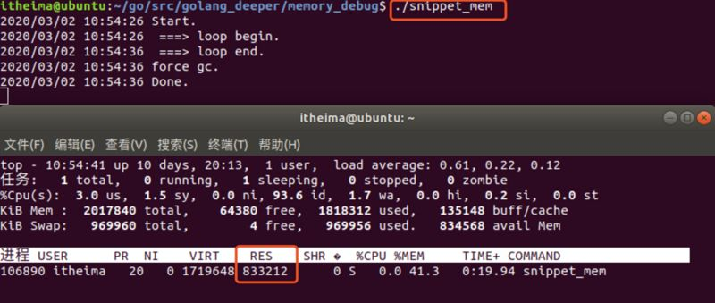
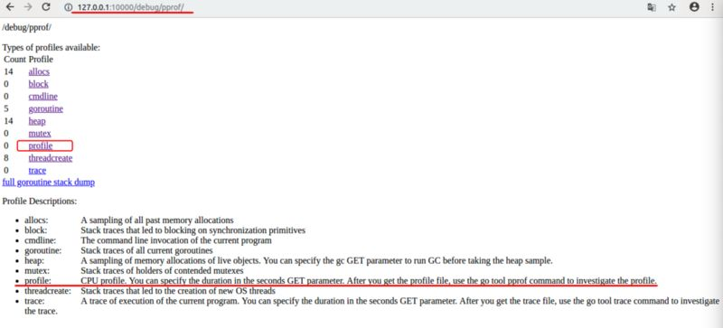
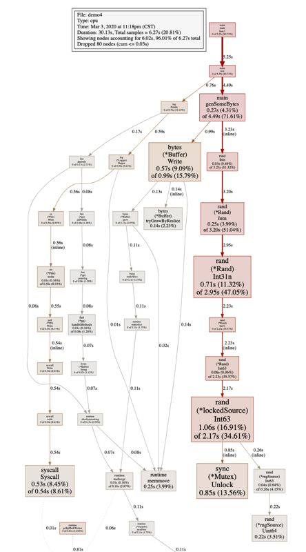

<!--toc-->
<!--  -->
[TOC]

####        本篇介绍Golang常用性能调试工具的应用场景，包括:

**场景1**

**如何分析程序的运行时间与CPU利用率情况？**

**场景2**

**如何分析Golang程序的内存使用情况？**

**场景3**

**如何分析Golang程序的CPU性能情况？**

* * *

场景1、如何分析程序的运行时间与CPU利用率情况？

01

shell内置time指令

#### **这个方法不算新颖，但是却很实用。** time是Unix/Linux内置多命令，使用时一般不用传过多参数，直接跟上需要调试多程序即可。

```
$ time go run test2.go&{{0 0} 张三 0}real    0m0.843suser    0m0.216ssys    0m0.389s
```

上面是使用time对 `go run test2.go`对执行程序做了性能分析，得到3个指标。

- `real`：从程序开始到结束，实际度过的时间；
    
- `user`：程序在用户态度过的时间；
    
- `sys`：程序在内核态度过的时间。
    

一般情况下 `real`>=`user` + `sys`，因为系统还有其它进程(切换其他进程中间对于本进程会有空白期)。

02

/usr/bin/time指令

##### 这个指令比内置的time更加详细一些，使用的时候需要用绝对路径，而且要加上参数`-v` 

```
$ /usr/bin/time -v go run test2.go    Command being timed: "go run test2.go"    User time (seconds): 0.12    System time (seconds): 0.06    Percent of CPU this job got: 115%    Elapsed (wall clock) time (h:mm:ss or m:ss): 0:00.16    Average shared text size (kbytes): 0    Average unshared data size (kbytes): 0    Average stack size (kbytes): 0    Average total size (kbytes): 0    Maximum resident set size (kbytes): 41172    Average resident set size (kbytes): 0    Major (requiring I/O) page faults: 1    Minor (reclaiming a frame) page faults: 15880    Voluntary context switches: 897    Involuntary context switches: 183    Swaps: 0    File system inputs: 256    File system outputs: 2664    Socket messages sent: 0    Socket messages received: 0    Signals delivered: 0    Page size (bytes): 4096    Exit status: 0
```

可以看到这里的功能要强大多了，除了之前的信息外，还包括了：

- CPU占用率；
    
- 内存使用情况；
    
- Page Fault 情况；
    
- 进程切换情况；
    
- 文件系统IO；
    
- Socket 使用情况；
    
- ……
    

场景2、如何分析Golang程序的内存使用情况?

01

内存占用情况查看

##### 我们先写一段demo例子代码 

```
package mainimport (    "log"    "runtime"    "time")func test() {    //slice 会动态扩容，用slice来做堆内存申请    container := make([]int, 8)    log.Println(" ===> loop begin.")    for i := 0; i < 32*1000*1000; i++ {        container = append(container, i)    }    log.Println(" ===> loop end.")}func main() {    log.Println("Start.")    test()    log.Println("force gc.")    runtime.GC() //强制调用gc回收    log.Println("Done.")    time.Sleep(3600 * time.Second) //睡眠，保持程序不退出}
```

编译

```
$go build -o snippet_mem && ./snippet_mem
```

然后在./snippet\_mem进程没有执行完，我们再开一个窗口，通过`top`命令查看进程的内存占用情况

```
$top -p $(pidof snippet_mem)
```

得到结果如下：



我们看出来，没有退出的snippet\_mem进程有约830m的内存被占用。直观上来说，这个程序在`test()`函数执行完后，切片`contaner`的内存应该被释放，不应该占用830M那么大。下面让我们使用GODEBUG来分析程序的内存使用情况。

* * *

02

GODEBUG与gctrace

用法执行`snippet\_mem`程序之前添加环境变量`GODEBUG='gctrace=1'`来跟踪打印垃圾回收器信息

```
$ GODEBUG='gctrace=1' ./snippet_mem
```

设置`gctrace=1`会使得垃圾回收器在每次回收时汇总所回收内存的大小以及耗时，
并将这些内容汇总成单行内容打印到标准错误输出中。格式

```
gc # @#s #%: #+#+# ms clock, #+#/#/#+# ms cpu, #->#-># MB, # MB goal, # P
```

**含义**

```
    gc #        GC次数的编号，每次GC时递增    @#s         距离程序开始执行时的时间    #%          GC占用的执行时间百分比    #+...+#     GC使用的时间    #->#-># MB  GC开始，结束，以及当前活跃堆内存的大小，单位M    # MB goal   全局堆内存大小    # P         使用processor的数量
```

如果每条信息最后，以`(forced)`结尾，那么该信息是由`runtime.GC()`调用触发我们来选择其中一行来解释一下：

```
gc 17 @0.149s 1%: 0.004+36+0.003 ms clock, 0.009+0/0.051/36+0.006 ms cpu, 181->181->101 MB, 182 MB goal, 2 P
```

该条信息含义如下：

- `gc 17`: Gc 调试编号为17
    
- `@0.149s`:此时程序已经执行了0.149s
    
- `1%`: 0.149s中其中gc模块占用了1%的时间
    
- `0.004+36+0.003 ms clock`: 垃圾回收的时间，分别为STW（stop-the-world）清扫的时间+并发标记和扫描的时间+STW标记的时间
    
- `0.009+0/0.051/36+0.006 ms cpu`: 垃圾回收占用cpu时间
    
- `181->181->101 MB`：GC开始前堆内存181M， GC结束后堆内存181M，当前活跃的堆内存101M
    
- `182 MB goal`: 全局堆内存大小
    
- `2 P`: 本次GC使用了2个P(调度器中的Processer)
    

* * *

了解了GC的调试信息读法后，接下来我们来分析一下本次GC的结果。我们还是执行GODEBUG调试

```
$ GODEBUG='gctrace=1' ./snippet_mem
```

结果如下

```
2020/03/02 11:22:37 Start.2020/03/02 11:22:37  ===> loop begin.gc 1 @0.002s 5%: 0.14+0.45+0.002 ms clock, 0.29+0/0.042/0.33+0.005 ms cpu, 4->4->0 MB, 5 MB goal, 2 Pgc 2 @0.003s 4%: 0.13+3.7+0.019 ms clock, 0.27+0/0.037/2.8+0.038 ms cpu, 4->4->2 MB, 5 MB goal, 2 Pgc 3 @0.008s 3%: 0.002+1.1+0.001 ms clock, 0.005+0/0.083/1.0+0.003 ms cpu, 6->6->2 MB, 7 MB goal, 2 Pgc 4 @0.010s 3%: 0.003+0.99+0.002 ms clock, 0.006+0/0.041/0.82+0.004 ms cpu, 5->5->2 MB, 6 MB goal, 2 Pgc 5 @0.011s 4%: 0.079+0.80+0.003 ms clock, 0.15+0/0.046/0.51+0.006 ms cpu, 6->6->3 MB, 7 MB goal, 2 Pgc 6 @0.013s 4%: 0.15+3.7+0.002 ms clock, 0.31+0/0.061/3.3+0.005 ms cpu, 8->8->8 MB, 9 MB goal, 2 Pgc 7 @0.019s 3%: 0.004+2.5+0.005 ms clock, 0.008+0/0.051/2.1+0.010 ms cpu, 20->20->6 MB, 21 MB goal, 2 Pgc 8 @0.023s 5%: 0.014+3.7+0.002 ms clock, 0.029+0.040/1.2/0+0.005 ms cpu, 15->15->8 MB, 16 MB goal, 2 Pgc 9 @0.031s 4%: 0.003+1.6+0.001 ms clock, 0.007+0.094/0/0+0.003 ms cpu, 19->19->10 MB, 20 MB goal, 2 Pgc 10 @0.034s 3%: 0.006+5.2+0.004 ms clock, 0.013+0/0.045/5.0+0.008 ms cpu, 24->24->13 MB, 25 MB goal, 2 Pgc 11 @0.040s 3%: 0.12+2.6+0.002 ms clock, 0.24+0/0.043/2.5+0.004 ms cpu, 30->30->16 MB, 31 MB goal, 2 Pgc 12 @0.043s 3%: 0.11+4.4+0.002 ms clock, 0.23+0/0.044/4.1+0.005 ms cpu, 38->38->21 MB, 39 MB goal, 2 Pgc 13 @0.049s 3%: 0.008+10+0.040 ms clock, 0.017+0/0.045/10+0.080 ms cpu, 47->47->47 MB, 48 MB goal, 2 Pgc 14 @0.070s 2%: 0.004+12+0.002 ms clock, 0.008+0/0.062/12+0.005 ms cpu, 122->122->41 MB, 123 MB goal, 2 Pgc 15 @0.084s 2%: 0.11+11+0.038 ms clock, 0.22+0/0.064/3.9+0.076 ms cpu, 93->93->93 MB, 94 MB goal, 2 Pgc 16 @0.122s 1%: 0.005+25+0.010 ms clock, 0.011+0/0.12/24+0.021 ms cpu, 238->238->80 MB, 239 MB goal, 2 Pgc 17 @0.149s 1%: 0.004+36+0.003 ms clock, 0.009+0/0.051/36+0.006 ms cpu, 181->181->101 MB, 182 MB goal, 2 Pgc 18 @0.187s 1%: 0.12+19+0.004 ms clock, 0.25+0/0.049/19+0.008 ms cpu, 227->227->126 MB, 228 MB goal, 2 Pgc 19 @0.207s 1%: 0.096+27+0.004 ms clock, 0.19+0/0.077/0.73+0.009 ms cpu, 284->284->284 MB, 285 MB goal, 2 Pgc 20 @0.287s 0%: 0.005+944+0.040 ms clock, 0.011+0/0.048/1.3+0.081 ms cpu, 728->728->444 MB, 729 MB goal, 2 P2020/03/02 11:22:38  ===> loop end.2020/03/02 11:22:38 force gc.gc 21 @1.236s 0%: 0.004+0.099+0.001 ms clock, 0.008+0/0.018/0.071+0.003 ms cpu, 444->444->0 MB, 888 MB goal, 2 P (forced)2020/03/02 11:22:38 Done.GC forcedgc 22 @122.455s 0%: 0.010+0.15+0.003 ms clock, 0.021+0/0.025/0.093+0.007 ms cpu, 0->0->0 MB, 4 MB goal, 2 PGC forcedgc 23 @242.543s 0%: 0.007+0.075+0.002 ms clock, 0.014+0/0.022/0.085+0.004 ms cpu, 0->0->0 MB, 4 MB goal, 2 PGC forcedgc 24 @362.545s 0%: 0.018+0.19+0.006 ms clock, 0.037+0/0.055/0.15+0.013 ms cpu, 0->0->0 MB, 4 MB goal, 2 PGC forcedgc 25 @482.548s 0%: 0.012+0.25+0.005 ms clock, 0.025+0/0.025/0.11+0.010 ms cpu, 0->0->0 MB, 4 MB goal, 2 PGC forcedgc 26 @602.551s 0%: 0.009+0.10+0.003 ms clock, 0.018+0/0.021/0.075+0.006 ms cpu, 0->0->0 MB, 4 MB goal, 2 PGC forcedgc 27 @722.554s 0%: 0.012+0.30+0.005 ms clock, 0.025+0/0.15/0.22+0.011 ms cpu, 0->0->0 MB, 4 MB goal, 2 PGC forcedgc 28 @842.556s 0%: 0.027+0.18+0.003 ms clock, 0.054+0/0.11/0.14+0.006 ms cpu, 0->0->0 MB, 4 MB goal, 2 P...
```

分析先看在`test()`函数执行完后立即打印的`gc 21`那行的信息。`444->444->0 MB, 888 MB goal`表示垃圾回收器已经把444M的内存标记为非活跃的内存。再看下一个记录`gc 22`。`0->0->0 MB, 4 MB goal`表示垃圾回收器中的全局堆内存大小由`888M`下降为`4M`。

结论

1、在test()函数执行完后，demo程序中的切片容器所申请的堆空间都被垃圾回收器回收了。
2、如果此时在`top`指令查询内存的时候，如果依然先死800+MB，说明垃圾回收器回收了应用层的内存后，（可能）并不会立即将内存归还给系统。

03

runtime.ReadMemStats

##### 接下来我么换另一种方式查看内存的方式 利用 runtime库里的`ReadMemStats()`方法.

##### 代码demo2.go

```
package mainimport (    "log"    "runtime"    "time")func readMemStats() {    var ms runtime.MemStats    runtime.ReadMemStats(&ms)    log.Printf(" ===> Alloc:%d(bytes) HeapIdle:%d(bytes) HeapReleased:%d(bytes)", ms.Alloc, ms.HeapIdle, ms.HeapReleased)}func test() {    //slice 会动态扩容，用slice来做堆内存申请    container := make([]int, 8)    log.Println(" ===> loop begin.")    for i := 0; i < 32*1000*1000; i++ {        container = append(container, i)        if ( i == 16*1000*1000) {            readMemStats()        }    }    log.Println(" ===> loop end.")}func main() {    log.Println(" ===> [Start].")    readMemStats()    test()    readMemStats()    log.Println(" ===> [force gc].")    runtime.GC() //强制调用gc回收    log.Println(" ===> [Done].")    readMemStats()    go func() {        for {            readMemStats()            time.Sleep(10 * time.Second)        }    }()    time.Sleep(3600 * time.Second) //睡眠，保持程序不退出}
```

这里我们， 封装了一个函数`readMemStats()`，这里面主要是调用`runtime`中的`ReadMemStats()`方法获得内存信息，然后通过`log`打印出来。我们执行一下代码并运行

```
$ go run demo2.go2020/03/02 18:21:17  ===> [Start].2020/03/02 18:21:17  ===> Alloc:71280(bytes) HeapIdle:66633728(bytes) HeapReleased:66600960(bytes)2020/03/02 18:21:17  ===> loop begin.2020/03/02 18:21:18  ===> Alloc:132535744(bytes) HeapIdle:336756736(bytes) HeapReleased:155721728(bytes)2020/03/02 18:21:38  ===> loop end.2020/03/02 18:21:38  ===> Alloc:598300600(bytes) HeapIdle:609181696(bytes) HeapReleased:434323456(bytes)2020/03/02 18:21:38  ===> [force gc].2020/03/02 18:21:38  ===> [Done].2020/03/02 18:21:38  ===> Alloc:55840(bytes) HeapIdle:1207427072(bytes) HeapReleased:434266112(bytes)2020/03/02 18:21:38  ===> Alloc:56656(bytes) HeapIdle:1207394304(bytes) HeapReleased:434266112(bytes)2020/03/02 18:21:48  ===> Alloc:56912(bytes) HeapIdle:1207394304(bytes) HeapReleased:1206493184(bytes)2020/03/02 18:21:58  ===> Alloc:57488(bytes) HeapIdle:1207394304(bytes) HeapReleased:1206493184(bytes)2020/03/02 18:22:08  ===> Alloc:57616(bytes) HeapIdle:1207394304(bytes) HeapReleased:1206493184(bytes)c2020/03/02 18:22:18  ===> Alloc:57744(bytes) HeapIdle:1207394304(bytes) HeapReleased:1206493184(by
```

可以看到，打印`[Done].`之后那条trace信息，Alloc已经下降，即内存已被垃圾回收器回收。在`2020/03/02 18:21:38`和`2020/03/02 18:21:48`的两条trace信息中，HeapReleased开始上升，即垃圾回收器把内存归还给系统。另外，MemStats还可以获取其它哪些信息以及字段的含义可以参见官方文档：http://golang.org/pkg/runtime/#MemStats

04

pprof工具

pprof工具支持网页上查看内存的使用情况，需要在代码中添加一个协程即可。

```
import(    "net/http"    _ "net/http/pprof")go func() {    log.Println(http.ListenAndServe("0.0.0.0:10000", nil))}()
```

具体添加的完整代码如下：代码demo3.go

```
package mainimport (    "log"    "runtime"    "time"    "net/http"    _ "net/http/pprof")func readMemStats() {    var ms runtime.MemStats    runtime.ReadMemStats(&ms)    log.Printf(" ===> Alloc:%d(bytes) HeapIdle:%d(bytes) HeapReleased:%d(bytes)", ms.Alloc, ms.HeapIdle, ms.HeapReleased)}func test() {    //slice 会动态扩容，用slice来做堆内存申请    container := make([]int, 8)    log.Println(" ===> loop begin.")    for i := 0; i < 32*1000*1000; i++ {        container = append(container, i)        if ( i == 16*1000*1000) {            readMemStats()        }    }    log.Println(" ===> loop end.")}func main() {    //启动pprof    go func() {        log.Println(http.ListenAndServe("0.0.0.0:10000", nil))    }()    log.Println(" ===> [Start].")    readMemStats()    test()    readMemStats()    log.Println(" ===> [force gc].")    runtime.GC() //强制调用gc回收    log.Println(" ===> [Done].")    readMemStats()    go func() {        for {            readMemStats()            time.Sleep(10 * time.Second)        }    }()    time.Sleep(3600 * time.Second) //睡眠，保持程序不退出}
```

我们正常运行程序，然后同时打开浏览器，输入地址：http://127.0.0.1:10000/debug/pprof/heap?debug=1浏览器的内容其中有一部分如下，记录了目前的内存情况

```
# ...# runtime.MemStats# Alloc = 228248# TotalAlloc = 1293696976# Sys = 834967896# Lookups = 0# Mallocs = 2018# Frees = 671# HeapAlloc = 228248# HeapSys = 804913152# HeapIdle = 804102144# HeapInuse = 811008# HeapReleased = 108552192# HeapObjects = 1347# Stack = 360448 / 360448# MSpan = 28288 / 32768# MCache = 3472 / 16384# BuckHashSys = 1449617# GCSys = 27418976# OtherSys = 776551# NextGC = 4194304# LastGC = 1583203571137891390# ...
```

场景3、如何分析Golang程序的CPU性能情况?

01

性能分析注意事项

  注意性能分析注意事项

性能分析必须在一个可重复的、稳定的环境中来进行。

- 不要在共享硬件上进行性能分析;
    
- 不要在性能分析期间，在同一个机器上去浏览网页
    
- 机器必须闲置
    
- 注意省电模式和过热保护，如果突然进入这些模式，会导致分析数据严重不准确
    
- 不要使用虚拟机、共享的云主机，太多干扰因素，分析数据会很不一致；
    

（如果承受得起，购买专用的性能测试分析的硬件设备，上架）

- 关闭电源管理、过热管理;
    
- 绝不要升级，以保证测试的一致性，以及具有可比性。
    

如果没有这样的环境，那就一定要在多个环境中，执行多次，以取得可参考的、具有相对一致性的测试结果。

02

CPU性能分析

##### 我们来用下面的代码进行测试，代码demo4.go

```
package mainimport (    "bytes"    "math/rand"    "time"    "log"    "net/http"    _ "net/http/pprof")func test() {    log.Println(" ===> loop begin.")    for i := 0; i < 1000; i++ {        log.Println(genSomeBytes())    }    log.Println(" ===> loop end.")}//生成一个随机字符串func genSomeBytes() *bytes.Buffer {    var buff bytes.Buffer    for i := 1; i < 20000; i++ {        buff.Write([]byte{'0' + byte(rand.Intn(10))})    }    return &buff}func main() {    go func() {        for {            test()            time.Sleep(time.Second * 1)        }    }()    //启动pprof    http.ListenAndServe("0.0.0.0:10000", nil)}
```

这里面还是启动了pprof的监听,有关`pprof`启动的代码如下

```
import (    "net/http"    _ "net/http/pprof")func main() {    //...  //...    //启动pprof  http.ListenAndServe("0.0.0.0:10000", nil)}
```

`main()`里的流程很简单,启动一个goroutine去无限循环调用`test()`方法,休眠1s.`test()`的流程是生成1000个20000个字符的随机字符串.并且打印.我们将上面的代码编译成可执行的二进制文件 `demo4`(记住这个名字,稍后我们能用到)

```
$ go build demo4.go
```

接下来我们启动程序,程序会无限循环的打印字符串.接下来我们通过几种方式来查看进程的cpu性能情况.

Web界面查看

A

###### 浏览器访问http://127.0.0.1:10000/debug/pprof/ 

我们会看到如下画面
这里面能够通过pprof查看包括(阻塞信息、cpu信息、内存堆信息、锁信息、goroutine信息等等), 我们这里关心的cpu的性能的`profile`信息.有关`profile`下面的英文解释大致如下:“CPU配置文件。您可以在秒GET参数中指定持续时间。获取概要文件后，请使用go tool pprof命令调查概要文件。”所以我们要是想得到cpu性能,就是要获取到当前进程的`profile`文件,这个文件默认是30s生成一个,所以你的程序要至少运行30s以上(这个参数也可以修改,稍后我们介绍)我们可以直接点击网页的`profile`,浏览器会给我们下载一个`profile`文件. 记住这个文件的路径, 可以拷贝到与`demo4`所在的同一文件夹下.

使用pprof工具查看

B

pprof 的格式如下

```
go tool pprof [binary] [profile]
```

**binary:**必须指向生成这个性能分析数据的那个二进制可执行文件；**profile:** 必须是该二进制可执行文件所生成的性能分析数据文件。`binary` 和 `profile` 必须严格匹配。我们来查看一下:

```
$ go tool pprof ./demo4 profileFile: demo4Type: cpuTime: Mar 3, 2020 at 11:18pm (CST)Duration: 30.13s, Total samples = 6.27s (20.81%)Entering interactive mode (type "help" for commands, "o" for options)(pprof)
```

help可以查看一些指令,我么可以通过top来查看cpu的性能情况.

```
(pprof) topShowing nodes accounting for 5090ms, 81.18% of 6270ms totalDropped 80 nodes (cum <= 31.35ms)Showing top 10 nodes out of 60      flat  flat%   sum%        cum   cum%    1060ms 16.91% 16.91%     2170ms 34.61%  math/rand.(*lockedSource).Int63     850ms 13.56% 30.46%      850ms 13.56%  sync.(*Mutex).Unlock (inline)     710ms 11.32% 41.79%     2950ms 47.05%  math/rand.(*Rand).Int31n     570ms  9.09% 50.88%      990ms 15.79%  bytes.(*Buffer).Write     530ms  8.45% 59.33%      540ms  8.61%  syscall.Syscall     370ms  5.90% 65.23%      370ms  5.90%  runtime.procyield     270ms  4.31% 69.54%     4490ms 71.61%  main.genSomeBytes     250ms  3.99% 73.52%     3200ms 51.04%  math/rand.(*Rand).Intn     250ms  3.99% 77.51%      250ms  3.99%  runtime.memmove     230ms  3.67% 81.18%      690ms 11.00%  runtime.suspendG(pprof)
```

这里面有几列数据,需要说明一下.

- flat：当前函数占用CPU的耗时
    
- flat：:当前函数占用CPU的耗时百分比
    
- sun%：函数占用CPU的耗时累计百分比
    
- cum：当前函数加上调用当前函数的函数占用CPU的总耗时
    
- cum%：当前函数加上调用当前函数的函数占用CPU的总耗时百分比
    
- 最后一列：函数名称
    

通过结果我们可以看出, 该程序的大部分cpu性能消耗在 `main.getSoneBytes()`方法中,其中math/rand取随机数消耗比较大.

通过go tool pprof得到profile文件

C

        我们上面的profile文件是通过web浏览器下载的,这个profile的经过时间是30s的,默认值我们在浏览器上修改不了,如果你想得到时间更长的cpu利用率,可以通过`go tool pprof`指令与程序交互来获取到首先,我们先启动程序

```
$ ./demo4
```

然后再打开一个终端

```
go tool pprof http://localhost:10000/debug/pprof/profile?seconds=60
```

这里制定了生成profile文件的时间间隔60s等待60s之后, 终端就会有结果出来,我们继续使用top来查看.

```
$ go tool pprof http://localhost:10000/debug/pprof/profile?seconds=60Fetching profile over HTTP from http://localhost:10000/debug/pprof/profile?seconds=60Saved profile in /home/itheima/pprof/pprof.demo4.samples.cpu.005.pb.gzFile: demo4Type: cpuTime: Mar 3, 2020 at 11:59pm (CST)Duration: 1mins, Total samples = 12.13s (20.22%)Entering interactive mode (type "help" for commands, "o" for options)(pprof) topShowing nodes accounting for 9940ms, 81.95% of 12130ms totalDropped 110 nodes (cum <= 60.65ms)Showing top 10 nodes out of 56      flat  flat%   sum%        cum   cum%    2350ms 19.37% 19.37%     4690ms 38.66%  math/rand.(*lockedSource).Int63    1770ms 14.59% 33.97%     1770ms 14.59%  sync.(*Mutex).Unlock (inline)    1290ms 10.63% 44.60%     6040ms 49.79%  math/rand.(*Rand).Int31n    1110ms  9.15% 53.75%     1130ms  9.32%  syscall.Syscall     810ms  6.68% 60.43%     1860ms 15.33%  bytes.(*Buffer).Write     620ms  5.11% 65.54%     6660ms 54.91%  math/rand.(*Rand).Intn     570ms  4.70% 70.24%      570ms  4.70%  runtime.procyield     500ms  4.12% 74.36%     9170ms 75.60%  main.genSomeBytes     480ms  3.96% 78.32%      480ms  3.96%  runtime.memmove     440ms  3.63% 81.95%      440ms  3.63%  math/rand.(*rngSource).Uint64(pprof)
```

依然会得到cpu性能的结果, 我们发现这次的结果与上次30s的结果百分比类似.

可视化查看

D

我们还是通过

```
$ go tool pprof ./demo4 profile
```

进入profile文件查看,然后我们输入`web`指令.

```
$ go tool pprof ./demo4 profileFile: demo4Type: cpuTime: Mar 3, 2020 at 11:18pm (CST)Duration: 30.13s, Total samples = 6.27s (20.81%)Entering interactive mode (type "help" for commands, "o" for options)(pprof) web
```

这里如果报找不到`graphviz`工具,需要安装一下Ubuntu安装

```
$sudo apt-get install graphviz
```

Mac安装

```
brew install graphviz
```

windows安装下载https://graphviz.gitlab.io/\_p...

```
将graphviz安装目录下的bin文件夹添加到Path环境变量中。在终端输入dot -version查看是否安装成功。
```

然后我们得到一个svg的可视化文件在`/tmp`路径下



这样我们就能比较清晰的看到函数之间的调用关系,方块越大的表示cpu的占用越大。以上便是场景的一些Golang性能及内存分析大小，如果你希望调试你的成品程序，可以参考以上方法来调整并提升您的框架或者产品。


[原文](https://mp.weixin.qq.com/s/-HojlxCZZIcWWwprQaVkzw)

<!--  -->