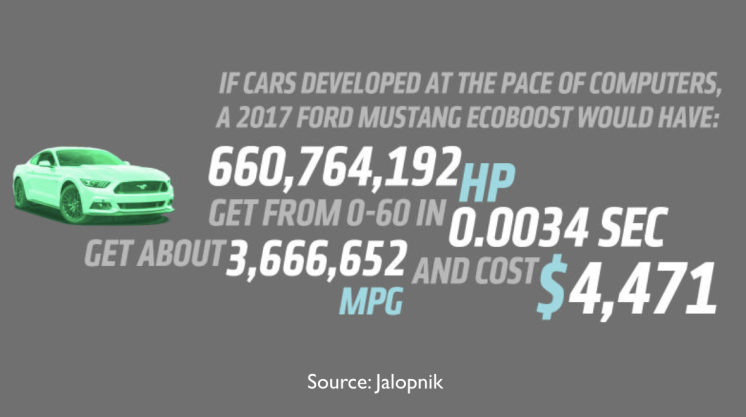
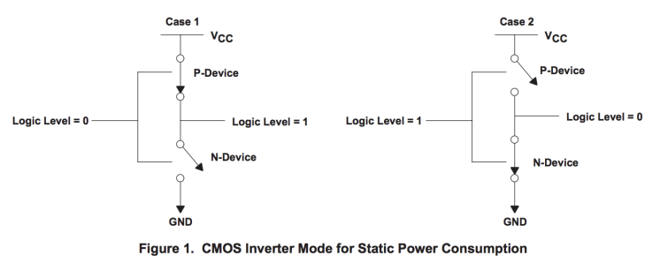
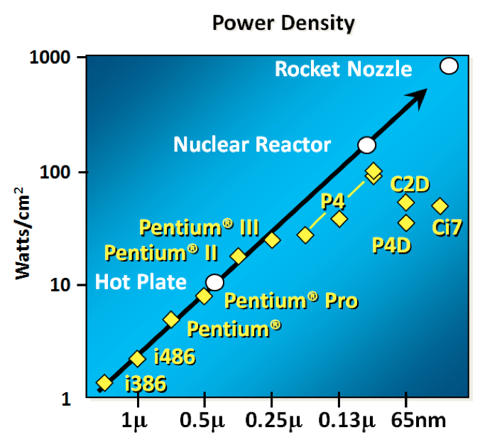
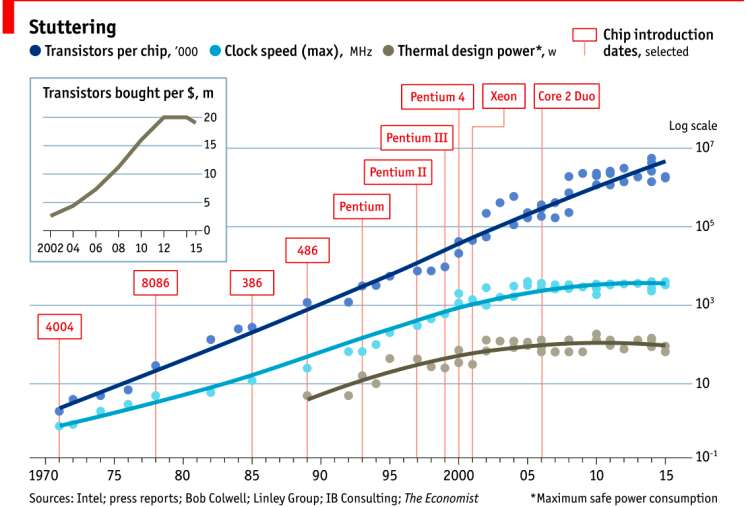
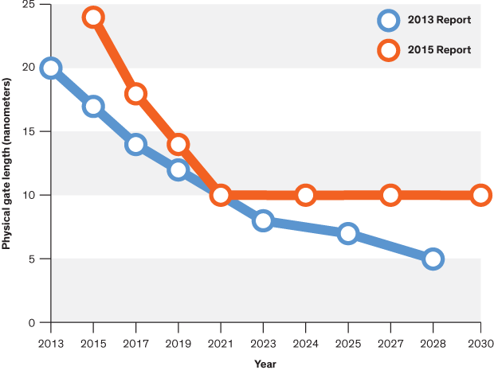
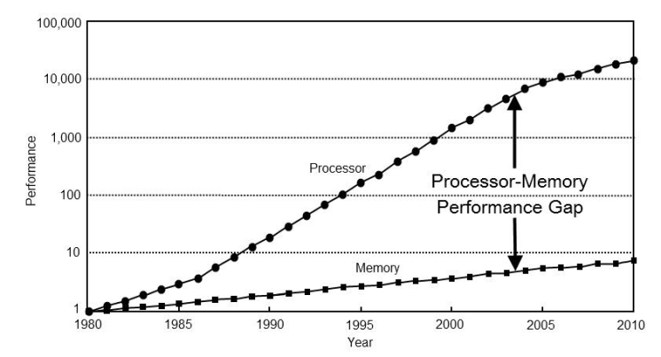
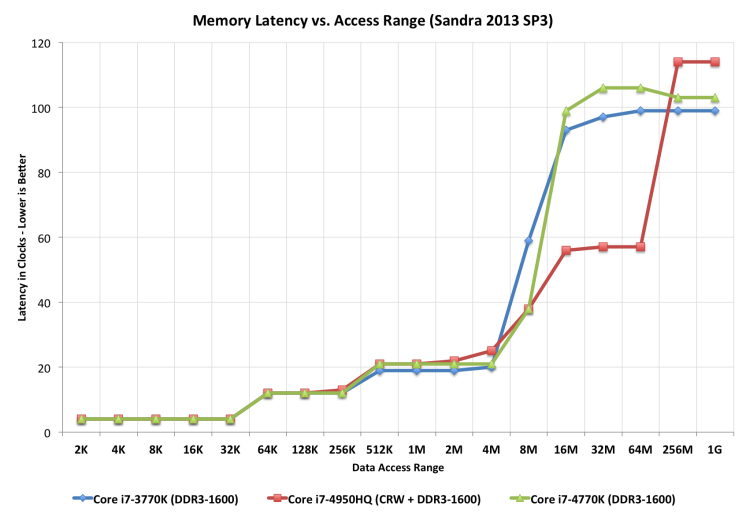
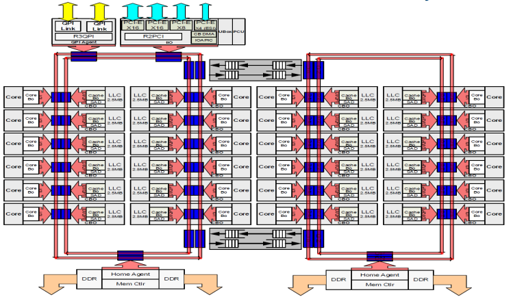

<!-- toc -->
[TOC]

High Performance Go Workshop（Part1）
===================================

老大拉我 review 整个项目，发现我 Golang 的相关工具都没用起来。推荐了一篇文章要我看下。觉得不错。就翻译出来给大家，希望自己和大家平时可以借助工具来使得工作/学习事半功倍。

  

  

Overview
--------

  

我们这个分享会的目标是为你提供检测 Go 应用程序中的性能问题并修复它们的工具。

  

在这一天中，我们将从学习如何编写基准开始，然后分析一小段代码。然后讨论执行跟踪程序、垃圾收集器和跟踪正在运行的应用程序。今天剩下的时间里，你将有机会提问，试验你自己的代码。

  

### 主讲人

  

*   Dave Cheney [dave@cheney.net](mailto:dave@cheney.net)

  

### 仓库

  

源码在 [https://github.com/davecheney/high-performance-go-workshop](https://github.com/davecheney/high-performance-go-workshop)

  

### 依赖版本

  

分享基于 Go 1.12

  

[Download Go 1.12](https://golang.org/dl/)

  

如果你已经升级到 Go 1.13，也木有问题。在小型 Go 发行版本之间优化选择会有一些小的变化，我将在分享的过程中指出这些变化。

  

### [Graphviz](https://dave.cheney.net/high-performance-go-workshop/dotgo-paris.html?hmsr=toutiao.io&utm_medium=toutiao.io&utm_source=toutiao.io#graphviz)

  

关于 pprof 部分需要提供 `graphviz`  工具附带的 `dot` 程序。

  

*   Linux:`[sudo] apt-get install graphviz`  
    
*   OSX:  
    
*   MacPorts:`sudo port install graphviz`  
    
*   Homebrew:`brew install graphviz`  
    
*   [Windows](https://graphviz.gitlab.io/download/#Windows) (untested)  
    

  

### [Google Chrome](https://dave.cheney.net/high-performance-go-workshop/dotgo-paris.html?hmsr=toutiao.io&utm_medium=toutiao.io&utm_source=toutiao.io#google_chrome)

执行跟踪程序部分需要 Google Chrome，不建议使用 Safari、Edge、Firefox或IE 。

  
[Download Google Chrome](https://www.google.com/chrome/)

  

  

1.微处理器性能的过去，现在和未来
-----------------

这是一个关于编写高性能代码的研讨会。在其他研讨会上，我讨论了解耦设计和可维护性，但我们今天在这里讨论性能。

  

今天我想从一个简短的演讲开始，谈谈我是如何看待计算机发展史的，以及为什么我认为编写高性能软件很重要。

  

实际上，软件是在硬件上运行的，所以要讨论编写高性能代码，首先我们需要讨论运行代码的硬件。

  

### 1.1. Mechanical Sympathy

  

  

  

现在流行一个词，你会听到像 Martin Thompson 和 Bill Kennedy  这样的人谈论“Mechanical Sympathy”。

  

“Mechanical Sympathy”这个词语来自伟大的赛车手 Jackie Stewart，他曾三次获得 F1 世界冠军。他相信最好的驾驶员是对机器的工作原理有足够了解的，这样他们才能与机器更好地工作。

  

要成为一名优秀的赛车手，你不需要成为一名优秀的机械师，但你需要对汽车的工作原理有一个粗略的了解。

  

我相信我们作为软件工程师也是如此。我不认为我们在座的任何人将是一个专业的CPU 设计者，但这并不意味着我们可以忽略 CPU 设计者面临的问题。

  

  

### 1.2. 六个数量级

  

有一个大家经常看到的的网图是这样的；

  

  
  

  

  

当然这是荒谬的，但它强调了计算机行业发生了多大的变化。

  

作为软件工程师，我们在座的所有人都受益于摩尔定律，40年来，每18个月芯片上可用晶体管的数量翻一番。没有哪个行业在他们的工具上发展过程中有过六个数量级的改进。

  

但这一切都在改变。

  

### 1.3. 计算机还在变得越来越快吗？

  

所以，最根本的问题是，面对像上图那样的统计数据，我们是否应该问这样一个问题：_计算机是否还在变得越来越快_？

  

如果计算机的速度仍在提高，那么也许我们不需要关心代码的性能，我们只需等硬件的发布，硬件制造商就会为我们解决性能问题。

  

#### 1.3.1. 让我们看一下数据

  

这是很经典的数据，你可以在由 John L. Hennessy 和 David A. Patterson 编写的《_Computer Architecture, A Quantitative Approach_》书中找到。这图摘自这本书的第5版。

  

  
 

在第五版中，Hennessey 和 Patterson 认为计算性能有三个时代

  

*   第一次是 20 世纪 70 年代和 80 年代初，那是计算机初步形成的时期。我们今天所知道的微处理器其实并不存在，计算机是由分立晶体管或小规模集成电路构成的。成本、尺寸和对材料科学理解的局限性是限制因素。

  

*   从80年代中期到2004年，趋势线很明显。计算机整体性能平均每年提高52%。计算机的功率每两年翻一番，因此人们把摩尔定律和计算机的性能混为一谈，摩尔定律是一个芯片上晶体管的数量翻一番。

  

*   然后我们进入了计算机性能的第三个时代。速度就慢慢下来了。每年总的变化率是22%。

  

  

上面这个图是2012年的, 但幸运的是在2012年 [Jeff Preshing](http://preshing.com/20120208/a-look-back-at-single-threaded-cpu-performance/) 编写了一个[工具](https://github.com/preshing/analyze-spec-benchmarks)来抓取 Spec 网站并构建自己的图表。

  

  
  

  

  

这是同样的图表，使用的是 1995 年到 2017 年的 spec 数据。

  

对我来说，与其说是我们在 2012 年数据中看到了变化，不如说是单核性能正在接近极限。这些数字对于浮点来说稍微好一点，但是对于我们写业务应用程序的人来说，这可能没有那么重要。

  

#### 1.3.2. 是的，计算机变得越来越慢

  

> _The first thing to remember about the ending of Moore’s law is something Gordon Moore told me. He said "All exponentials come to an end".  —  _[John Hennessy](https://www.youtube.com/watch?v=Azt8Nc-mtKM)

  

这是  Hennessy's 在 Google Next 18 及其图灵奖演讲中的引文。他的观点是肯定的，CPU性能仍在提高。但是，单线程整数性能仍在每年提高 2-3％左右。以这种速度，它将需要 20 年的复合增长才能使整数性能翻倍。相比之下，90 年代性能每两年翻一番。

  

为什么会这样?

  

### 1.4. 时钟速度

  

  

  

  

这张 2015 年的图表很好地证明了这一点。最上面一行显示一个芯片上的晶体管数量。自 20 世纪 70 年代以来，趋势图一直大致呈线性增长。由于这是一个 log/lin 关系图，因此这一线性序列代表指数增长。

  

然而，如果我们看中间这条线，我们看到时钟速度在十年内没有增加，而且 CPU 速度在 2004 年左右就停滞了。

  

下图显示的是散热功率，即电能转化为热量，遵循相同的模式——时钟速度和CPU散热是相关的。

  

### 1.5. Heat

  

为什么 CPU 会产生热量？这是一个固态设备，没有运动部件，所以像摩擦力这样的影响在这里没有(直接)关系。

  

这个[图表](http://www.ti.com/lit/an/scaa035b/scaa035b.pdf)取自 TI 公司的一份大数据表。在这个模型中，N 型器件中的开关被吸引到正电压上，P 型器件被排斥在正电压上。

  

  
  

  

CMOS 器件的功耗由三个因素共同构成，这个房间、办公桌上和口袋里的每个晶体管都由该器件构成。

  

1.  静态功率。当晶体管是静态的，也就是说，不改变它的状态时，会有少量的电流通过晶体管泄漏到地上。晶体管越小，泄漏就越多。泄漏量随温度升高而增加。当你有几十亿个晶体管时，即使一分钟的泄漏量也会增加！

  

2.  动态功率。当晶体管从一种状态过渡到另一种状态时，它必须对其连接到栅极的各种电容进行充放电。每个晶体管的动态功率是电压乘以电容和变化频率的平方。降低电压可以降低晶体管的功耗，但较低的电压会导致晶体管的开关速度变慢。

  

3.  短路电流。我们喜欢将晶体管视为数字设备，无论其处于开启状态还是处于原子状态，都占据一种状态或另一种状态。实际上，晶体管是模拟设备。作为开关，晶体管开始时大部分处于截止状态，然后转变或切换到通常处于导通状态。这种转换或切换时间非常快，在现代处理器中约为 pico秒，但是当从 Vcc 到地的电阻路径很低时，这仍然代表了一段时间。晶体管切换速度越快，其频率就越高，散热越多。

  

  

### 1.6. Dennard scaling 的终结

  

要理解接下来发生了什么，我们需要看看 [Robert H. Dennard](https://en.wikipedia.org/wiki/Robert_H._Dennard)  在1974年合著的一篇论文。Dennard's Scaling 定律大致说明，随着晶体管变小，它们的 [power density](https://en.wikipedia.org/wiki/Power_density)  保持不变。较小的晶体管可以在较低的电压下运行，具有较低的栅电容，开关速度更快，这有助于减少动态功率。

  

那么结果如何呢?

  

  

  

  

结果不是很理想。当晶体管的栅极长度接近几个硅原子的宽度时，晶体管的尺寸、电压和重要的泄漏之间的关系就破裂了。

  

1999年 micro-32 会议上曾假设，如果我们遵循时钟速度增加和晶体管尺寸缩小的趋势线，那么在处理器一代中，晶体管结将接近核反应堆核心的温度。显然这是疯了。奔腾4标志着单核、高频、消费型CPU 产品线的终结。

  

回到这个图表，我们看到时钟速度停滞的原因是因为CPU超出了我们冷却它们的能力。到2006年，减小晶体管的尺寸不再能提高其功率效率。

  

我们现在知道，CPU 特征尺寸的缩减主要是为了降低功耗。减少能源消耗不仅仅意味着“green”，比如循环利用，拯救地球。主要目标是保持功耗，从而散热，达到低于损坏CPU的水平。

  

  

  

  

但是，图中有一部分还在继续增长，那就是一个芯片上晶体管的数量。cpu 发展的特点是体积大，同一区域内晶体管数量多，既有好的一面，也有坏的一面。

  

而且，正如你在下图中看到的，每个晶体管的成本一直在下降，直到大约5年前，然后每晶体管的成本又开始回升。

  

  
  

  

  

不仅制造更小的晶体管越来越贵，而且越来越难。这份来自 2016 年的报告显示了芯片制造商对2013年将发生的事情的预测；两年后，他们错过了所有的预测，虽然我没有这一报告的更新版本，但没有迹象表明他们能够扭转这一趋势。

  

英特尔、台积电、AMD和三星的成本高达数十亿美元，因为它们必须建立新的晶圆厂，购买所有新的加工工具。因此，虽然每个芯片的晶体管数量继续增加，但它们的单位成本已经开始增加。

  

>   
> Even the term gate length, measured in nano meters, has become ambiguous. Various manufacturers measure the size of their transistors in different ways allowing them to demonstrate a smaller number than their competitors without perhaps delivering. This is the Non-GAAP Earning reporting model of CPU manufacturers.

  

> 甚至以纳米为单位的术语“gate length”也变得模棱两可。各种制造商以不同的方式测量其晶体管的尺寸，从而使它们在没有交付的情况下可以展示比竞争对手少的数量。这是CPU制造商的 Non-GAAP 收益报告模型。

  

  

  

### 1.7. 更多的核心

  

  

  

当温度和频率达到极限时，再也不可能使单个核心运行的速度提高两倍。但是，如果你添加另一个内核，你可以提供两倍的处理能力 —— 如果软件可以支持它。

  

事实上，CPU 的核心计数是由散热控制的。Dennard's Scaling 的结束意味着 cpu 的时钟速度是 1 到 4 Ghz 之间的任意数字，这取决于它有多热。我们将在讨论基准时会看到这一点。

  

### 1.8. Amdahl 定律

  

CPU 的速度并没有变快，但随着超线程和多核技术的发展，CPU 变得越来越宽。双核在移动部件上，四核在桌面部件上，几十核在服务器部件上。这将是计算机性能的未来吗？不幸的是这不是。

  

Amdahl 定律，是以 IBM/360 的设计师 Gene Amdahl 名字命名的，它是一个公式，理论上可以提高在固定工作负载下执行任务的延迟，而系统的资源得到了改进。

  

  
  

  

Amdahl 定律告诉我们，程序的最大加速受程序的顺序部分限制。如果你编写的程序 95% 的执行速度能够并行运行，即使有数千个处理器，程序执行的最大速度也限制在 20 倍。

  

想想你每天工作的程序，它们的执行有多少是可以并行的?

  

### 1.9. 动态优化

  

由于时钟速度停滞不前，加上通过向问题中添加额外的内核获得的优化有限，那么速度的提升又从何而来呢？它们来自芯片本身的架构改进。这些是五到七年的大项目，像 [Nehalem, Sandy Bridge, and Skylake](https://en.wikipedia.org/wiki/List_of_Intel_CPU_microarchitectures#Pentium_4_/_Core_Lines).

  

在过去二十年中，性能的改善主要来自于架构的改进:

  

#### 1.9.1. 无序执行

  

无序，也称为超标量体系结构，是一种从 CPU 执行的代码中提取所谓指令级并行性的方法。现代 cpu 在硬件级有效地执行 SSA，以识别操作之间的数据依赖关系，并在可能的情况下并行运行独立的指令。

  

然而，任何一段代码中固有的并行性数量都是有限制的。它消耗也特别大。大多数现代 cpu 已经确定每个核心有6个执行单元，因为在管道的每个阶段，将每个执行单元连接到所有其他执行单元的成本是 N 的平方。

  

#### 1.9.2. 推测性执行

  

除了最小的微控制器，所有 CPU 都使用指令管道在指令提取/解码/执行/提交周期中重叠部分。

  

  

  

指令管道的问题是分支指令，平均每 5-8 条指令发生一次。当 CPU 到达分支时，它不能从分支之外寻找要执行的额外指令，并且在知道程序计数器也将分支到何处之前，它不能开始填充它的管道。投机执行允许 CPU“guess”分支将采取的路径，而分支指令仍在处理中!

  

如果CPU正确地预测了分支，那么它就可以保持它的指令的流水线是满的。如果CPU不能预测正确的分支，那么当它意识到错误时，它必须回滚对其架构状态所做的任何更改。我们从幽灵漏洞中学习到，有时候，这种回滚并非如预期那样天衣无缝。

  

当分支预测率较低时，推测性执行消耗可能非常大。如果分支预测错误了，CPU不仅必须回溯到错误预测的起点，而且在错误分支上消耗的也会被浪费。

  

所有这些优化都带来了单线程性能的改进，但代价是大量的晶体管和 power。

  

> Cliff Click has a  [wonderful presentation](https://www.youtube.com/watch?v=OFgxAFdxYAQ) that argues out of order and speculative execution is most useful for starting cache misses early thereby reducing observed cache latency.

  

> Cliff Click有一个很棒的演示，它论证了无序和推测性执行对于早期启动缓存未命中非常有用，从而减少观察到的缓存延迟。

  

### 1.10. 现代 CPU 已针对批量操作进行了优化

  

> _Modern processors are a like nitro fuelled funny cars, they excel at the quarter mile. Unfortunately modern programming languages are like Monte Carlo, they are full of twists and turns. — David Ungar_

  

这是 David Ungar 的一句话，他是一位非常有影响力的计算机科学家，是 SELF 编程语言的开发者，我在网上找到的一份非常古老的演示文稿中提到了这一点。

  

因此，现代的CPU被优化为批量传输和批量操作。在每个级别上，操作的设置成本都会鼓励你批量工作。一些例子包括

  

*   内存不是按字节加载的，而是按多条高速缓存线路加载的，这就是为什么对齐的问题比以前的计算机要少。

  

*   像 MMX 和 SSE 这样的向量指令允许一条指令对多个数据项并发执行，前提是你的程序可以用这种形式表示。

  

  

### 1.11. 现代处理器受到内存延迟而不是内存容量的限制

  

如果 CPU 领域的情况还不够糟糕，那么来自内存方面的消息也好不到哪里去。

  

连接到服务器的物理内存呈几何级数增长。上世纪80年代，我的第一台电脑有千字节的内存。当我读高中的时候，我所有的论文都是在一台内存为 1.8 MB的 386 上写的。现在，找到拥有数十或数百GB运行内存的服务器已经是司空见惯的事情了，而云提供商正在向TB的运行内存进军。

  

  

  

然而，处理器速度和内存访问时间之间的差距继续扩大。

  

  

  

但是，在等待内存的处理器周期损失而言，物理内存仍然和以前一样遥远，因为内存跟不上CPU速度的增长。

  

因此，大多数现代处理器都受到内存延迟而不是容量的限制。

  

### 1.12. 缓存控制着我周围的一切

  

  

  

几十年来，处理器/内存上限的解决方案是添加一个缓存——一块位于CPU附近、现在直接集成到CPU上的小的快速内存。

  

但是

  

*   L1 几十年来一直停留在每个核心 32kb

  

*   在英特尔最大的部件上，L2 已缓慢攀升至 512KB

  

*   L3 现在在 4-32MB 范围内，但其访问时间是可变的

  

  

  

  

由于缓存的大小受到限制，因为它们在[CPU芯片的物理空间很大](www.itrs.net/Links/2000UpdateFinal/Design2000final.pdf)，消耗大量的资源。若要将缓存未命中率减半，必须将缓存大小翻两番。

  

  

### 1.13. 免费午餐结束了

  

在2005本书中，C++委员会的领导人 Sutter 写了一篇题为“免费午餐已经结束”的[文章](http://www.gotw.ca/publications/concurrency-ddj.htm)。Sutter 在他的文章中讨论了我提到的所有要点，并预言未来的程序员将不再能够依赖更快的硬件来修复速度很慢的程序或者速度很慢的编程语言。

  

十多年后的今天，毫无疑问，Sutter  是对的。内存太慢，缓存太小，CPU 时钟速度在倒退，单线程 CPU 的简单世界早已不复存在。

  

摩尔定律仍然有效，但对在座的所有人来说，免费午餐已经结束。

  

### 1.14. 结论

  

> _The numbers I would cite would be by 2010: 30GHz, 10billion transistors, and 1 tera-instruction per second. — _[Pat Gelsinger, Intel CTO, April 2002](https://www.cnet.com/news/intel-cto-chip-heat-becoming-critical-issue/)

  

很明显，如果没有在材料科学上的突破，CPU 性能恢复到 52% 的年增长率的可能性是微乎其微的。普遍的共识是，问题不在于材料科学本身，而在于晶体管的使用方式。用硅表示的顺序指令流的逻辑模型导致了这种昂贵的局面。

  

网上有很多演讲重新阐述了这一点。他们都有相同的预测——未来的计算机不会像今天那样被编程。有人认为，它看起来更像是带有数百个非常愚蠢、非常不连贯的处理器组成的显卡。另一些人则认为，超长指令字（VLIW）计算机将占主导地位。所有人都同意，我们目前的顺序编程语言将不兼容这些类型的处理器。

  

我的观点是，这些预测是正确的，硬件制造商此时拯救我们的前景是严峻的。然而，我们有很大的空间来优化我们今天现有的硬件编写的程序。Rick Hudson 在 2015年的Gophercon 大会上谈到了通过软件的“[virtuous cycle](https://talks.golang.org/2015/go-gc.pdf)”来重新设计软件，这种软件可以与我们现在的硬件一起工作，而不是与硬件无关。

  

从我之前展示的图表来看，从 2015 年到 2018 年，在整数性能最多提高 5-8% 的情况下，Go 团队将垃圾收集器暂停时间减少了两个数量级。Go 1.11 版本的程序的 GC 延迟明显好于使用 Go 1.6 版本在相同硬件上的相同程序。这些优化都不是来自硬件。

  

因此，为了在当今世界的硬件上获得最佳性能，你需要一种编程语言：

  

*   是编译的，而不是解释的，因为解释的编程语言与CPU分支预测和推测性执行的交互很差。

  

*   你需要一种语言，它允许高效的代码被编写，它需要能够有效地谈论位和字节，以及整数的长度，而不是假装每个数字都是一个理想的浮点数。

  

*   你需要一种语言，能让程序员有效地谈论内存，比如 struct 和 Java objects，因为所有的指针追逐都会给 CPU 高速缓存带来压力，而缓存未命中会消耗数百个周期。

  

*   随着应用程序性能的提高，一种可扩展到多核的编程语言取决于它使用缓存的效率以及它在多核上并行工作的效率。

  

很明显我们在这里是来讨论 Go 的，我相信 Go 符合了我刚才描述的许多特点。

  

#### 1.14.1. 这对我们意味着什么？

  

> There are only three optimizations: Do less. Do it less often. Do it faster.
> 
> The largest gains come from 1, but we spend all our time on 3. 
> 
> — [Michael Fromberger](https://twitter.com/creachadair/status/1039602865831010305)
> 
>   

  

这次研讨会的目的是要说明，当你谈论一个程序或系统的性能时，它的讨论范围是完全在软件层面中的。等待更快的硬件来拯救世界是徒劳的。

  

但是有一个好消息，我们可以在软件上做大量的改进，这就是我们今天要讨论的。

  

#### 1.14.2. 进一步阅读

  

*   [The Future of Microprocessors, Sophie Wilson](https://www.youtube.com/watch?v=zX4ZNfvw1cw)JuliaCon 2018

  

*   [50 Years of Computer Architecture: From Mainframe CPUs to DNN TPUs, David Patterson](https://www.youtube.com/watch?v=HnniEPtNs-4)

  

*   [The Future of Computing, John Hennessy](https://web.stanford.edu/~hennessy/Future%20of%20Computing.pdf)

  

*   [The future of computing: a conversation with John Hennessy](https://www.youtube.com/watch?v=Azt8Nc-mtKM) (Google I/O '18)

  

  