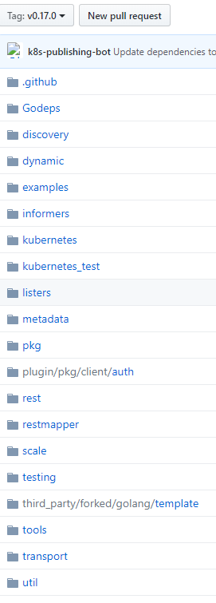
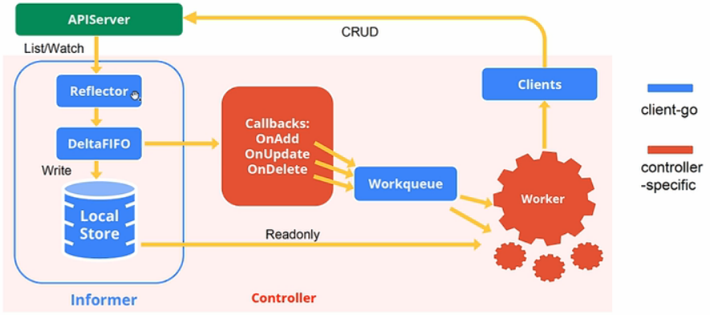
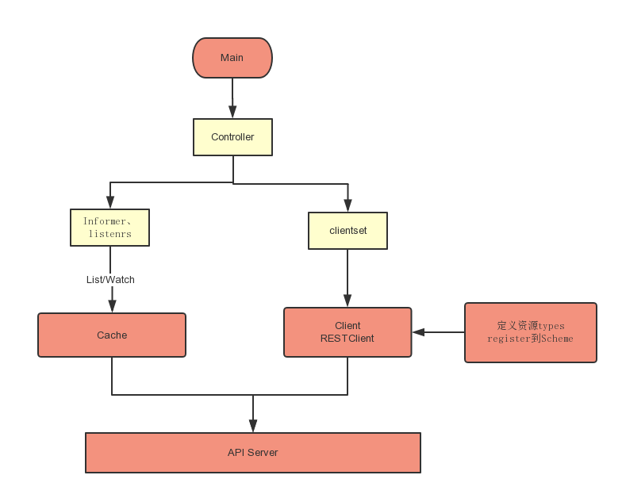
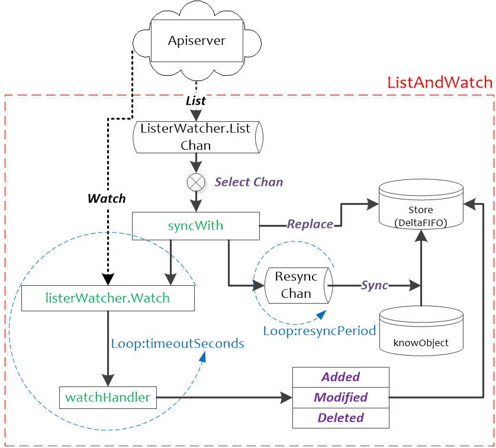
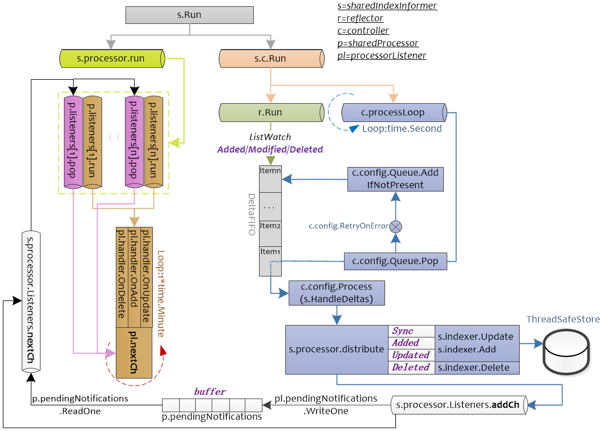
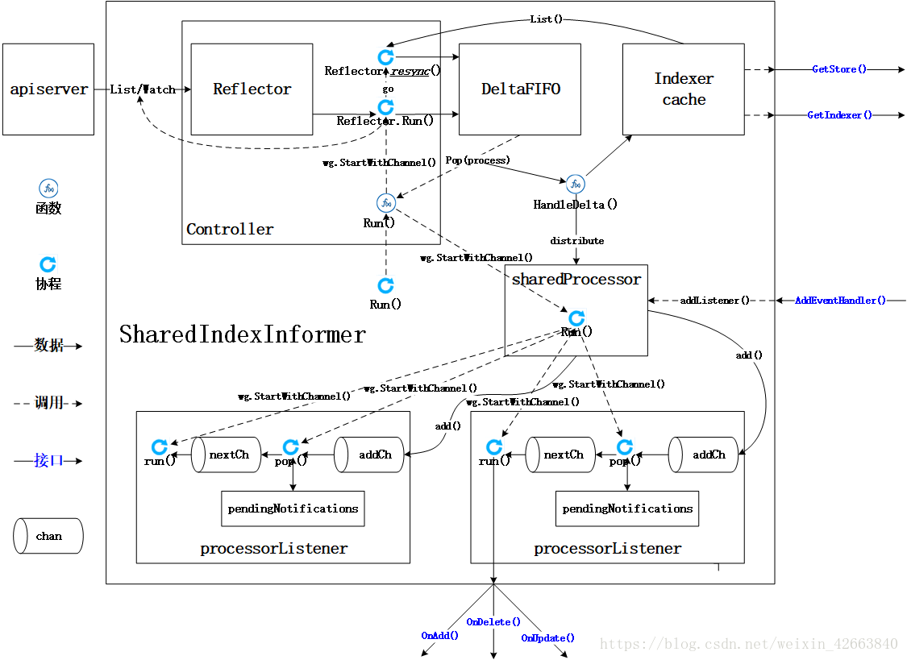
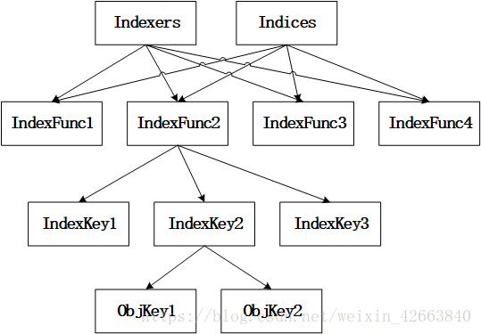
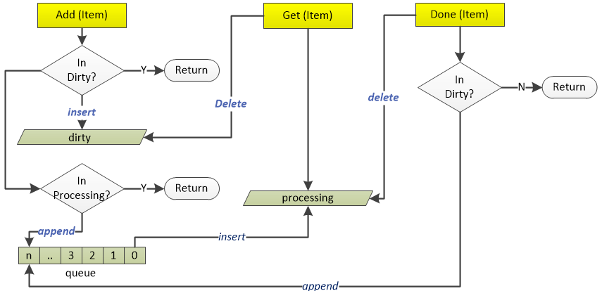
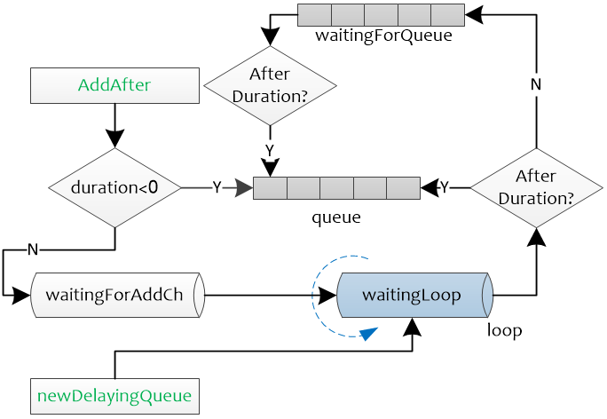

[TOC]

# client-go 简介
本次使用的版本为：
kubernetes-1.17.0/client-go v0.17.0(2019.12.08) 
不要直接`go get k8s.io/client-go`（以前发布过v12.0.0的版本）
使用`go get k8s.io/client-go@v0.17.0`

Kubernetes官方从2016年8月份开始，将Kubernetes资源操作相关的核心源码抽取出来，独立出来一个项目Client-go，作为官方提供的Go client。Kubernetes的部分代码也是基于这个client实现的，所以对这个client的质量、性能等方面还是非常有信心的。

client-go是一个调用kubernetes集群资源对象API的客户端，即通过client-go实现对kubernetes集群中资源对象（包括deployment、service、ingress、replicaSet、pod、namespace、node等）的增删改查等操作。大部分对kubernetes进行前置API封装的二次开发都通过client-go这个第三方包来实现。

## 源码简介
### 主要package

#### kubernetes： 访问 Kubernetes API的一系列的clientset
#### discovery：通过Kubernetes API 进行服务发现
#### dynamic：对任意Kubernetes对象执行通用操作的动态client
#### transport：启动连接和鉴权auth
#### tools/cache：controllers控制器

### Client结构

#### RESTClient
RESTClient是最基础的，相当于的底层基础结构，可以直接通过 是RESTClient提供的RESTful方法如Get()，Put()，Post()，Delete()进行交互

- 同时支持Json 和 protobuf
- 支持所有原生资源和CRDs
- 但是，一般而言，为了更为优雅的处理，需要进一步封装，通过Clientset封装RESTClient，然后再对外提供接口和服务

RESTClient 封装了指定资源URL的通用Kubernetes API的访问姿势

#### Clientset
Clientset是调用Kubernetes资源对象最常用的client，可以操作所有的资源对象，包含RESTClient。需要指定Group、指定Version，然后根据Resource获取

- 优雅的姿势是利用一个controller对象，再加上Informer

Clientset 是一系列的clients的group组合，注意每个group在一个Clientset中只包含一个版本。

Clientset包含了appsV1、coreV1，这中间包含了RESTClient，因此Clientset是基于RESTClient的。


#### DynamicClient
Dynamic client 是一种动态的 client，它能处理 kubernetes 所有的资源。不同于 clientset，dynamic client 返回的对象是一个 map[string]interface{}，如果一个 controller 中需要控制所有的 API，可以使用dynamic client，目前它在 garbage collector 和 namespace controller中被使用。

- 只支持JSON

dynamic client针对的是所有资源，但是只支持Json；
```go
# dynamic/interface.go

type ResourceInterface interface {
	Create(obj *unstructured.Unstructured, options metav1.CreateOptions, subresources ...string) (*unstructured.Unstructured, error)
	Update(obj *unstructured.Unstructured, options metav1.UpdateOptions, subresources ...string) (*unstructured.Unstructured, error)
	UpdateStatus(obj *unstructured.Unstructured, options metav1.UpdateOptions) (*unstructured.Unstructured, error)
	Delete(name string, options *metav1.DeleteOptions, subresources ...string) error
	DeleteCollection(options *metav1.DeleteOptions, listOptions metav1.ListOptions) error
	Get(name string, options metav1.GetOptions, subresources ...string) (*unstructured.Unstructured, error)
	List(opts metav1.ListOptions) (*unstructured.UnstructuredList, error)
	Watch(opts metav1.ListOptions) (watch.Interface, error)
	Patch(name string, pt types.PatchType, data []byte, options metav1.PatchOptions, subresources ...string) (*unstructured.Unstructured, error)
}
```
### 对象资源的操作接口
默认的每一种资源对象都有一个interface，封装了对象的CURD方法和list/watch方法

如 Deployment(kubernetes/typed/apps/v1/deployment.go)：
```go
// DeploymentInterface has methods to work with Deployment resources.
type DeploymentInterface interface {
	Create(*v1.Deployment) (*v1.Deployment, error)
	Update(*v1.Deployment) (*v1.Deployment, error)
	UpdateStatus(*v1.Deployment) (*v1.Deployment, error)
	Delete(name string, options *metav1.DeleteOptions) error
	DeleteCollection(options *metav1.DeleteOptions, listOptions metav1.ListOptions) error
	Get(name string, options metav1.GetOptions) (*v1.Deployment, error)
	List(opts metav1.ListOptions) (*v1.DeploymentList, error)
	Watch(opts metav1.ListOptions) (watch.Interface, error)
	Patch(name string, pt types.PatchType, data []byte, subresources ...string) (result *v1.Deployment, err error)
	GetScale(deploymentName string, options metav1.GetOptions) (*autoscalingv1.Scale, error)
	UpdateScale(deploymentName string, scale *autoscalingv1.Scale) (*autoscalingv1.Scale, error)

	DeploymentExpansion
}
```
在Kubernetes中，所有对象资源的操作方式都是统一的，有个interface当做虚基类，包含资源的所有操作方法，然后各个子类继承然后实现它们，子类中的实现定义会针对不同的资源有不同诠释


## [client-go架构图](https://github.com/kubernetes/sample-controller/blob/master/docs/images/client-go-controller-interaction.jpeg)



- List/Watch：List是列举apiserver中对象的接口，Watch是监控apiserver资源变化的接口；
- Reflector：我习惯成称之为反射器，实现对apiserver指定类型对象的监控，其中反射实现的就是把监控的结果实例化成具体的对象；
- DeltaIFIFO：将Reflector监控的变化的对象形成一个FIFO队列，此处的Delta就是变化，DeltaFIFO我们已经有文章详细介绍了；
- LocalStore：指的就是Indexer的实现cache，这里面缓存的就是apiserver中的对象(其中有一部分可能还在DeltaFIFO中)，此时使用者再查询对象的时候就直接从cache中查找，减少了apiserver的压力；
- Callbacks：通知回调函数，Infomer感知的所有对象变化都是通过回调函数通知使用者(Listener)；


自己结合源码的理解如下：


## client-go components

### Reflector（反射器）
在[包缓存内的类型reflector](https://github.com/kubernetes/client-go/blob/master/tools/cache/reflector.go)中定义的Reflector监视指定资源类型（kind）的Kubernetes API。执行此操作的函数是ListAndWatch。监视可以是内置资源，也可以是自定义资源。当反射器通过监视API接收关于新资源实例的存在的通知时，它使用相应的列表API获取新创建的对象并将其放入WETCHANDER函数内的Delta FIFO队列中。
#### Reflector 源码
reflector使用listerWatcher获取资源，并将其保存在store中，此处的store就是DeltaFIFO，Reflector核心处理函数为ListAndWatch(client-go/tools/cache/reflector.go)
```go
// client-go/tools/cache/reflector.go
type Reflector struct {
    // name identifies this reflector. By default it will be a file:line if possible.
    name string
    // metrics tracks basic metric information about the reflector
    metrics *reflectorMetrics// 但凡遇到metrics多半是用于做监控的，可以忽略

    // The type of object we expect to place in the store.
    expectedType reflect.Type// 反射的类型，也就是要监控的对象类型，比如Pod
    // The destination to sync up with the watch source
    store Store// 存储，就是DeltaFIFO，为什么，后面会有代码证明
    // listerWatcher is used to perform lists and watches.
    listerWatcher ListerWatcher// 这个是用来从apiserver获取资源用的
    // period controls timing between one watch ending and
    // the beginning of the next one.
    period       time.Duration// 反射器在List和Watch的时候理论上是死循环，只有出现错误才会退出
    //period这个变量用在出错后多长时间再执行List和Watch，默认值是1秒钟
    resyncPeriod time.Duration// 重新同步的周期，很多人肯定认为这个同步周期指的是从apiserver的同步周期
    // resyncPeriod其实这里面同步指的是shared_informer使用者需要定期同步全量对象
    ShouldResync func() bool// 如果需要同步，调用这个函数问一下，当然前提是该函数指针不为空
    // clock allows tests to manipulate time
    clock clock.Clock// 时钟
    // lastSyncResourceVersion is the resource version token last
    // observed when doing a sync with the underlying store
    // it is thread safe, but not synchronized with the underlying store
    lastSyncResourceVersion string// 最后一次同步的资源版本
    // lastSyncResourceVersionMutex guards read/write access to lastSyncResourceVersion
    lastSyncResourceVersionMutex sync.RWMutex// 还专门为最后一次同步的资源版本弄了个锁
    // WatchListPageSize is the requested chunk size of initial and resync watch lists.
    // Defaults to pager.PageSize.
    WatchListPageSize int64
}
```

- listerWatcher用于获取和监控资源，lister可以获取对象的全量，watcher可以获取对象的增量(变化)；
- 系统会周期性的执行list-watch的流程，一旦过程中失败就要重新执行流程，这个重新执行的周期就是period指定的；
- expectedType规定了监控对象的类型，非此类型的对象将会被忽略；
- 实例化后的expectedType类型的对象会被添加到store中；
- kubernetes资源在apiserver中都是有版本的，对象的任何除了修改(添加、删除、更新)都会造成资源版本更新，所以lastSyncResourceVersion就是指的这个版本；
- 如果使用者需要定期同步全量对象，那么Reflector就会定期产生全量对象的同步事件给DeltaFIFO;


ListAndWatch在Reflector.Run函数中启动，并以Reflector.period周期性进行调度。ListAndWatch使用resourceVersion来获取资源的增量变化：在List时会获取资源的首个resourceVersion值，在Watch的时候会使用List获取的resourceVersion来获取资源的增量变化，然后将获取到的资源的resourceVersion保存起来，作为下一次Watch的基线。
```go
// 代码源自client-go/tools/cache/reflector.go
func (r *Reflector) Run(stopCh <-chan struct{}) {
    // func Until(f func(), period time.Duration, stopCh <-chan struct{})是下面函数的声明
    // 这里面我们不用关心wait.Until是如何实现的，只要知道他调用函数f会被每period周期执行一次
    // 意思就是f()函数执行完毕再等period时间后在执行一次，也就是r.ListAndWatch()会被周期性的调用
    wait.Until(func() {
        if err := r.ListAndWatch(stopCh); err != nil {
            utilruntime.HandleError(err)
        }
    }, r.period, stopCh)
}

// 代码源自client-go/tools/cache/reflector.go
func (r *Reflector) ListAndWatch(stopCh <-chan struct{}) error {
    var resourceVersion string
    // 很多存储类的系统都是这样设计的，数据采用版本的方式记录，数据每变化(添加、删除、更新)都会触发版本更新，
    // 这样的做法可以避免全量数据访问。以apiserver资源监控为例，只要监控比缓存中资源版本大的对象就可以了，
    // 把变化的部分更新到缓存中就可以达到与apiserver一致的效果，一般资源的初始版本为0，从0版本开始列举就是全量的对象了
    options := metav1.ListOptions{ResourceVersion: "0"}
    // 与监控相关的内容不多解释
    r.metrics.numberOfLists.Inc()
    start := r.clock.Now()
    // 列举资源，这部分是apimachery相关的内容，读者感兴趣可以自己了解
    list, err := r.listerWatcher.List(options)
    if err != nil {
        return fmt.Errorf("%s: Failed to list %v: %v", r.name, r.expectedType, err)
    }
    // 还是监控相关的
    r.metrics.listDuration.Observe(time.Since(start).Seconds())
    // 下面的代码主要是利用apimachinery相关的函数实现，就是把列举返回的结果转换为对象数组
    // 下面的代码大部分来自apimachinery，此处不做过多说明，读者只要知道实现什么功能就行了
    listMetaInterface, err := meta.ListAccessor(list)
    if err != nil {
        return fmt.Errorf("%s: Unable to understand list result %#v: %v", r.name, list, err)
    }
    resourceVersion = listMetaInterface.GetResourceVersion()
    
    items, err := meta.ExtractList(list)
    if err != nil {
        return fmt.Errorf("%s: Unable to understand list result %#v (%v)", r.name, list, err)
    }
    // 和监控相关的内容
    r.metrics.numberOfItemsInList.Observe(float64(len(items)))
    // 以上部分都是对象实例化的过程，可以称之为反射，也是Reflector这个名字的主要来源，本文不是讲解反射原理的，
    // 而是作为SharedInformer的前端，所以我们重点介绍的是对象在SharedInformer中流转过程，所以反射原理部分不做为重点讲解
    // 这可是真正从apiserver同步过来的全量对象，所以要同步到DeltaFIFO中
    if err := r.syncWith(items, resourceVersion); err != nil {
        return fmt.Errorf("%s: Unable to sync list result: %v", r.name, err)
    }
    // 设置最新的同步的对象版本
    r.setLastSyncResourceVersion(resourceVersion)
    // 下面要启动一个后台协程实现定期的同步操作，这个同步就是将SharedInformer里面的对象全量以同步事件的方式通知使用者
    // 我们暂且称之为“后台同步协程”，Run()函数退出需要后台同步协程退出，所以下面的cancelCh就是干这个用的
    // 利用defer close(cancelCh)实现的，而resyncerrc是后台同步协程反向通知Run()函数的报错通道
    // 当后台同步协程出错，Run()函数接收到信号就可以退出了
    resyncerrc := make(chan error, 1)
    cancelCh := make(chan struct{})
    defer close(cancelCh)
    // 下面这个匿名函数就是后台同步协程的函数了
    go func() {
        // resyncCh返回的就是一个定时器，如果resyncPeriod这个为0那么就会返回一个永久定时器，cleanup函数是用来清理定时器的
        resyncCh, cleanup := r.resyncChan()
        defer func() {
            cleanup() 
        }()
        // 死循环等待各种信号
        for {
            // 只有定时器有信号才继续处理，其他的都会退出
            select {
            case <-resyncCh:
            case <-stopCh:
                return
            case <-cancelCh:
                return
            }
            // ShouldResync是个函数地址，创建反射器对象的时候传入，即便时间到了，也要通过函数问问是否需要同步
            if r.ShouldResync == nil || r.ShouldResync() {
                // 我们知道这个store是DeltaFIFO，DeltaFIFO.Resync()做了什么，读者自行温习相关的文章~
                // 就在这里实现了我们前面提到的同步，从这里看所谓的同步就是以全量对象同步事件的方式通知使用者
                if err := r.store.Resync(); err != nil {
                    resyncerrc <- err
                    return
                }
            }
            // 清理掉当前的计时器，获取下一个同步时间定时器
            cleanup()
            resyncCh, cleanup = r.resyncChan()
        }
    }()
 
    // 前面已经列举了全量对象，接下来就是watch的逻辑了
    for {
        // 如果有退出信号就立刻返回，否则就会往下走，因为有default.
        select {
        case <-stopCh:
            return nil
        default:
        }
 
        // 计算watch的超时时间
        timeoutSeconds := int64(minWatchTimeout.Seconds() * (rand.Float64() + 1.0))
        // 设置watch的选项，因为前期列举了全量对象，从这里只要监听最新版本以后的资源就可以了
        // 如果没有资源变化总不能一直挂着吧？也不知道是卡死了还是怎么了，所以有一个超时会好一点
        options = metav1.ListOptions{
            ResourceVersion: resourceVersion,
            TimeoutSeconds: &timeoutSeconds,
        }
        // 监控相关
        r.metrics.numberOfWatches.Inc()
        // 开始监控对象
        w, err := r.listerWatcher.Watch(options)
        // watch产生错误了，大部分错误就要退出函数然后再重新来一遍流程
        if err != nil {
            switch err {
            case io.EOF:
            case io.ErrUnexpectedEOF:
            default:
                utilruntime.HandleError(fmt.Errorf("%s: Failed to watch %v: %v", r.name, r.expectedType, err))
            }
            // 类似于网络拒绝连接的错误要等一会儿再试，因为可能网络繁忙
            if urlError, ok := err.(*url.Error); ok {
                if opError, ok := urlError.Err.(*net.OpError); ok {
                    if errno, ok := opError.Err.(syscall.Errno); ok && errno == syscall.ECONNREFUSED {
                        time.Sleep(time.Second)
                        continue
                    }
                }
            }
            return nil
        }
 
        // watch返回是流，apiserver会将变化的资源通过这个流发送出来，client-go最终通过chan实现的
        // 所以watchHandler()是一个需要持续从chan读取数据的流程，所以需要传入resyncerrc和stopCh
        // 用于异步通知退出或者后台同步协程错误
        if err := r.watchHandler(w, &resourceVersion, resyncerrc, stopCh); err != nil {
            if err != errorStopRequested {
                glog.Warningf("%s: watch of %v ended with: %v", r.name, r.expectedType, err)
            }
            return nil
        }
    }
}

上面的函数中，调用了两个私有函数，分别为syncWith()和watchHandler()。syncWith()用于实现一次从apiserver全量对象的同步，这里的同步和我们上面提到的同步不是一回事，这里指的是从apiserver的同步。watchHandler是实现监控apiserver资源变化的处理过程，主要就是把apiserver的资源变化转换为DeltaFIFO调用。我们接下来就看这两个函数的具体实现

接下来我们就要看看watchHandler做了什么？

// 代码源自client-go/tools/cache/reflector.go
// 实现apiserver全量对象的同步
func (r *Reflector) syncWith(items []runtime.Object, resourceVersion string) error {
    // 做一次slice类型转换
    found := make([]interface{}, 0, len(items))
    for _, item := range items {
        found = append(found, item)
    }
    // 直接调用了DeltaFIFO的Replace()接口，这个接口就是用于同步全量对象的
    return r.store.Replace(found, resourceVersion)
}
// 实现从watch返回的chan中持续读取变化的资源，并转换为DeltaFIFO相应的调用
func (r *Reflector) watchHandler(w watch.Interface, resourceVersion *string, errc chan error, stopCh <-chan struct{}) error {
    start := r.clock.Now()
    eventCount := 0
    // 监控相关
    defer func() {
        r.metrics.numberOfItemsInWatch.Observe(float64(eventCount))
        r.metrics.watchDuration.Observe(time.Since(start).Seconds())
    }()
 
    // 这里就开始无限循环的从chan中读取资源的变化，也可以理解为资源的增量变化，同时还要监控各种信号
loop:
    for {
        select {
        // 系统退出信号
        case <-stopCh:
            return errorStopRequested
        // 后台同步协程出错信号
        case err := <-errc:
            return err
        // watch函数返回的是一个chan，通过这个chan持续的读取对象
        case event, ok := <-w.ResultChan():
            // 如果不OK，说明chan关闭了，就要重新获取，这里面我们可以推测这个chan可能会运行过程中重新创建
            // 否则就应该退出而不是继续循环
            if !ok {
                break loop
            }
            // 看来event可以作为错误的返回值，挺有意思，而不是通过关闭chan，这种方式可以传递错误信息，关闭chan做不到
            if event.Type == watch.Error {
                return apierrs.FromObject(event.Object)
            }
            // 这里面就是利用反射实例化对象了，而且判断了对象类型是我们设定的类型
            if e, a := r.expectedType, reflect.TypeOf(event.Object); e != nil && e != a {
                utilruntime.HandleError(fmt.Errorf("%s: expected type %v, but watch event object had type %v", r.name, e, a))
                continue
            }
            // 和list操作相似，也要获取对象的版本，要更新缓存中的版本，下次watch就可以忽略这些资源了
            meta, err := meta.Accessor(event.Object)
            if err != nil {
                utilruntime.HandleError(fmt.Errorf("%s: unable to understand watch event %#v", r.name, event))
                continue
            }
            newResourceVersion := meta.GetResourceVersion()
            // 根据事件的类型做不同的DeltaFIFO的操作
            switch event.Type {
            // 向DeltaFIFO添加一个添加的Delta
            case watch.Added:
                err := r.store.Add(event.Object)
                if err != nil {
                    utilruntime.HandleError(fmt.Errorf("%s: unable to add watch event object (%#v) to store: %v", r.name, event.Object, err))
                }
            // 更新对象，向DeltaFIFO添加一个更新的Delta
            case watch.Modified:
                err := r.store.Update(event.Object)
                if err != nil {
                    utilruntime.HandleError(fmt.Errorf("%s: unable to update watch event object (%#v) to store: %v", r.name, event.Object, err))
            }
            // 删除对象，向DeltaFIFO添加一个删除的Delta
            case watch.Deleted:
                err := r.store.Delete(event.Object)
                if err != nil {
                    utilruntime.HandleError(fmt.Errorf("%s: unable to delete watch event object (%#v) from store: %v", r.name, event.Object, err))
            }
            // 其他类型就不知道干什么了，只能报错
            default:
            utilruntime.HandleError(fmt.Errorf("%s: unable to understand watch event %#v", r.name, event))
            }
            // 更新最新资源版本
            *resourceVersion = newResourceVersion
            r.setLastSyncResourceVersion(newResourceVersion)
            eventCount++
        }
    }
    // watch返回时间非常短而且没有任何事件要处理，这个属于异常现象，因为我们watch是设置了超时的
    watchDuration := r.clock.Now().Sub(start)
    if watchDuration < 1*time.Second && eventCount == 0 {
        r.metrics.numberOfShortWatches.Inc()
        return fmt.Errorf("very short watch: %s: Unexpected watch close - watch lasted less than a second and no items received", r.name)
    }
 
    return nil
}

// 代码源自client-go/tools/cache/reflector.go
func (r *Reflector) setLastSyncResourceVersion(v string) {
    // 设置已经获取到资源的最新版本
    r.lastSyncResourceVersionMutex.Lock()
    defer r.lastSyncResourceVersionMutex.Unlock()
    r.lastSyncResourceVersion = v
 
    rv, err := strconv.Atoi(v)
    if err == nil {
        r.metrics.lastResourceVersion.Set(float64(rv))
    }
}
 
// 获取resync定时器，叫定时器比较好理解，叫chan很难和定时关联起来
func (r *Reflector) resyncChan() (<-chan time.Time, func() bool) {
    // 如果resyncPeriod说明就不用定时同步，返回的是永久超时的定时器
    if r.resyncPeriod == 0 {
        return neverExitWatch, func() bool { return false }
    }
    // 构建定时起
    t := r.clock.NewTimer(r.resyncPeriod)
    return t.C(), t.Stop
}
```
如可以使用如下命令获取Pod的resourceVersion
```
kubectl get pod podname -o yaml|grep resourceVersion
```


上图中的Resync触发的Sync动作，其作用与Replace中的第三步相同，用于将knowObject中的对象与DeltaFIFO中同步。这种操作是有必要的

#### 总结
- Reflector利用apiserver的client列举全量对象(版本为0以后的对象全部列举出来)
- 将全量对象采用Replace()接口同步到DeltaFIFO中，并且更新资源的版本号，这个版本号后续会用到；
- 开启一个协程定时执行resync，如果没有设置定时同步则不会执行，同步就是把全量对象以同步事件的方式通知出去；
- 通过apiserver的client监控(watch)资源，监控的当前资源版本号以后的对象，因为之前的都已经获取到了；
- 一旦有对象发生变化，那么就会根据变化的类型(新增、更新、删除)调用DeltaFIFO的相应接口，产生一个相应的对象Delta，同时更新当前资源的版本；

---

通过Kubernetes API监控Kubernetes的资源类型

- 采用List、Watch机制
- 可以Watch任何资源包括CRD
- 添加object对象到FIFO队列，然后Informer会从队列里面取数据


### (非组件)DeltaFIFO 源码
DeltaFIFO的源码注释写的比较清楚，它是一个生产者-消费者队列(先入先出)，生产者为Reflector，消费者为Pop()函数，从架构图中可以看出DeltaFIFO的数据来源为Reflector，通过Pop操作消费数据，消费的数据一方面存储到Indexer中，另一方面可以通过informer的handler进行处理(见下文)。informer的handler处理的数据需要与存储在Indexer中的数据匹配。需要注意的是，Pop的单位是一个Deltas，而不是Delta。

DeltaFIFO同时实现了Queue和Store接口。DeltaFIFO使用Deltas保存了对象状态的变更(Add/Delete/Update)信息(如Pod的删除添加等)，Deltas缓存了针对相同对象的多个状态变更信息，如Pod的Deltas[0]可能更新了标签，Deltas[1]可能删除了该Pod。最老的状态变更信息为Newest()，最新的状态变更信息为Oldest()。使用中，获取DeltaFIFO中对象的key以及获取DeltaFIFO都以最新状态为准。

```go
# tools/cache/delta_fifo.go
// DeltaType is the type of a change (addition, deletion, etc)
type DeltaType string // Delta的类型用字符串表达

// Change type definition
const (
	Added   DeltaType = "Added"
	Updated DeltaType = "Updated"
	Deleted DeltaType = "Deleted"
	// The other types are obvious. You'll get Sync deltas when:
	//  * A watch expires/errors out and a new list/watch cycle is started.
	//  * You've turned on periodic syncs.
	// (Anything that trigger's DeltaFIFO's Replace() method.)
	Sync DeltaType = "Sync" // 同步
)

// Delta is the type stored by a DeltaFIFO. It tells you what change
// happened, and the object's state after* that change.
//
// [*] Unless the change is a deletion, and then you'll get the final
//     state of the object before it was deleted.
type Delta struct {
	Type   DeltaType // Delta类型，比如增、减，后面有详细说明
	Object interface{} // 对象，Delta的粒度是一个对象
}

// Deltas is a list of one or more 'Delta's to an individual object.
// The oldest delta is at index 0, the newest delta is the last one.
type Deltas []Delta // Delta数组
```
我们再说一说如下几个类型，因为他们定义在DeltaFIFO的文件中，而且在很多地方应用：
```go
# tools/cache/delta_fifo.go

// 这个接口类型就是下面面两个接口类型的组合了
// A KeyListerGetter is anything that knows how to list its keys and look up by key.
type KeyListerGetter interface {
	KeyLister
	KeyGetter
}
// 这是一个非常通用的接口类型，只定义了一个接口函数，就是返回所有的keys
// A KeyLister is anything that knows how to list its keys.
type KeyLister interface {
	ListKeys() []string
}
// 这也是一个非常通用的接口类型，只定义了一个接口函数，就是通过key获取对象
// A KeyGetter is anything that knows how to get the value stored under a given key.
type KeyGetter interface {
	GetByKey(key string) (interface{}, bool, error)
}
```
有没有发现上面两个接口在client-go.tools.cache.Store这个接口类型中也存在，也就是说实现了Store接口的类型同时也实现了上面三个接口

接下来再来认识一个类型：
```go
# tools/cache/fifo.go
// 这个才是FIFO的抽象，DeltaFIFO只是FIFO的一种实现。
// Queue is exactly like a Store, but has a Pop() method too.
type Queue interface {
	Store // 实现了存储接口,这个很好理解，FIFO也是一种存储
    // 在存储的基础上增加了Pop接口，用于弹出对象
	// Pop blocks until it has something to process.
	// It returns the object that was process and the result of processing.
	// The PopProcessFunc may return an ErrRequeue{...} to indicate the item
	// should be requeued before releasing the lock on the queue.
	Pop(PopProcessFunc) (interface{}, error)
    // 对象如果不在队列中就添加
	// AddIfNotPresent adds a value previously
	// returned by Pop back into the queue as long
	// as nothing else (presumably more recent)
	// has since been added.
	AddIfNotPresent(interface{}) error
    // 通过Replace()放入第一批对象到队列中并且已经被Pop()全部取走
	// HasSynced returns true if the first batch of items has been popped
	HasSynced() bool
    // 关闭队列
	// Close queue
	Close()
}

```

#### DeltaFIFO实现
我们先来看看DeltaFIFO的类型定义：
```go
# tools/cache/delta_fifo.go
// DeltaFIFO is like FIFO, but allows you to process deletes.
//
// DeltaFIFO is a producer-consumer queue, where a Reflector is
// intended to be the producer, and the consumer is whatever calls
// the Pop() method.
//
// DeltaFIFO solves this use case:
//  * You want to process every object change (delta) at most once.
//  * When you process an object, you want to see everything
//    that's happened to it since you last processed it.
//  * You want to process the deletion of objects.
//  * You might want to periodically reprocess objects.
//
// DeltaFIFO's Pop(), Get(), and GetByKey() methods return
// interface{} to satisfy the Store/Queue interfaces, but it
// will always return an object of type Deltas.
//
// A note on threading: If you call Pop() in parallel from multiple
// threads, you could end up with multiple threads processing slightly
// different versions of the same object.
//
// A note on the KeyLister used by the DeltaFIFO: It's main purpose is
// to list keys that are "known", for the purpose of figuring out which
// items have been deleted when Replace() or Delete() are called. The deleted
// object will be included in the DeleteFinalStateUnknown markers. These objects
// could be stale.
type DeltaFIFO struct {
	// lock/cond protects access to 'items' and 'queue'.
	lock sync.RWMutex// 读写锁，因为涉及到同时读写，读写锁性能要高
	cond sync.Cond// 给Pop()接口使用，在没有对象的时候可以阻塞，内部锁复用读写锁
    // 这个应该是Store的本质了，按照kv的方式存储对象，但是存储的是对象的Deltas数组
	// We depend on the property that items in the set are in
	// the queue and vice versa, and that all Deltas in this
	// map have at least one Delta.
	items map[string]Deltas
	queue []string// 这个是为先入先出实现的，存储的就是对象的键
    // 通过Replace()接口将第一批对象放入队列，或者第一次调用增、删、改接口时标记为true
	// populated is true if the first batch of items inserted by Replace() has been populated
	// or Delete/Add/Update was called first.
	populated bool
	// initialPopulationCount is the number of items inserted by the first call of Replace()
	initialPopulationCount int// 通过Replace()接口将第一批对象放入队列的对象数量

	// keyFunc is used to make the key used for queued item
	// insertion and retrieval, and should be deterministic.
	keyFunc KeyFunc// 对象键计算函数，在Indexer那篇文章介绍过
    // 前面介绍就是为了这是用，该对象指向的就是Indexer，
	// knownObjects list keys that are "known", for the
	// purpose of figuring out which items have been deleted
	// when Replace() or Delete() is called.
	knownObjects KeyListerGetter

	// Indication the queue is closed.
	// Used to indicate a queue is closed so a control loop can exit when a queue is empty.
	// Currently, not used to gate any of CRED operations.
	closed     bool// 是否已经关闭的标记
	closedLock sync.Mutex// 专为关闭设计的锁
}

var (
	_ = Queue(&DeltaFIFO{}) // DeltaFIFO is a Queue
)
```
queueActionLocked函数
```go
// 代码源自client-go/tools/cache/delta_fifo.go
// 从函数名称来看把“动作”放入队列中，这个动作就是DeltaType，而且已经加锁了
func (f *DeltaFIFO) queueActionLocked(actionType DeltaType, obj interface{}) error {
    // 前面提到的计算对象键的函数
    id, err := f.KeyOf(obj)
    if err != nil {
        return KeyError{obj, err}
    }
    // 如果是同步，并且对象未来会被删除，那么就直接返回，没必要记录这个动作了
    // 肯定有人会问为什么Add/Delete/Update这些动作可以，因为同步对于已经删除的对象是没有意义的
    // 已经删除的对象后续跟添加、更新有可能，因为同名的对象又被添加了，删除也是有可能
    // 删除有些复杂，后面会有说明
    if actionType == Sync && f.willObjectBeDeletedLocked(id) {
        return nil
    }
    // 同一个对象的多次操作，所以要追加到Deltas数组中
    newDeltas := append(f.items[id], Delta{actionType, obj})
    // 合并操作，去掉冗余的delta
    newDeltas = dedupDeltas(newDeltas)
    // 判断对象是否已经存在
    _, exists := f.items[id]
    // 合并后操作有可能变成没有Delta么？后面的代码分析来看应该不会，所以暂时不知道这个判断目的
    if len(newDeltas) > 0 {
        // 如果对象没有存在过，那就放入队列中，如果存在说明已经在queue中了，也就没必要再添加了
        if !exists {
            f.queue = append(f.queue, id)
        }
        // 更新Deltas数组，通知所有调用Pop()的人
        f.items[id] = newDeltas
        f.cond.Broadcast()
    } else if exists {
        // 直接把对象删除，这段代码我不知道什么条件会进来，因为dedupDeltas()肯定有返回结果的
        // 后面会有dedupDeltas()详细说明
        delete(f.items, id)
    }
    return nil
}
```
- DeltaFIFO生产者和消费者是异步的，如果同一个目标的频繁操作，前面操作还缓存在队列中的时候，那么队列就要缓冲对象的所有操作，那可以将多个操作合并么？这是下面讨论的了；
- 对于更新这种类型的操作在没有全量基础的情况下是没法合并的，同时我们还不知道具体是什么类型的对象，所以能合并的也就是有添加/删除，两个添加/删除操作其实可以视为一个；

合并操作的具体实现：

```go
// 代码源自client-go/tools/cache/delta_fifo.go
func dedupDeltas(deltas Deltas) Deltas {
    // 小于2个delta，那就是1个呗，没啥好合并的
    n := len(deltas)
    if n < 2 {
        return deltas
    }
    // 取出最后两个
    a := &deltas[n-1]
    b := &deltas[n-2]
    // 判断如果是重复的，那就删除这两个delta把合并后的追加到Deltas数组尾部
    if out := isDup(a, b); out != nil {
        d := append(Deltas{}, deltas[:n-2]...)
        return append(d, *out)
    }
    return deltas
}
// 判断两个Delta是否是重复的
func isDup(a, b *Delta) *Delta {
    // 只有一个判断，只能判断是否为删除类操作，和我们上面的判断相同
    // 这个函数的本意应该还可以判断多种类型的重复，当前来看只能有删除这一种能够合并
    if out := isDeletionDup(a, b); out != nil {
        return out
    }
	
    return nil
}
// 判断是否为删除类的重复
func isDeletionDup(a, b *Delta) *Delta {
    // 二者都是删除那肯定有一个是重复的
    if b.Type != Deleted || a.Type != Deleted {
        return nil
    }
    // 理论上返回最后一个比较好，但是对象已经不再系统监控范围，前一个删除状态是好的
    if _, ok := b.Object.(DeletedFinalStateUnknown); ok {
        return a
    }
    return b
}
```
因为系统对于删除的对象有DeletedFinalStateUnknown这个状态，所以会存在两次删除的情况，但是两次添加同一个对象由于apiserver可以保证对象的唯一性，所以处理中就没有考虑合并两次添加操作。

接下来我们来看看Replace()函数的实现，这个也是Store定义的接口：
```go
// 代码源自client-go/tools/cache/delta_fifo.go
func (f *DeltaFIFO) Replace(list []interface{}, resourceVersion string) error {
    f.lock.Lock()
    defer f.lock.Unlock()
    keys := make(sets.String, len(list))
    // 遍历所有的输入目标
    for _, item := range list {
        // 计算目标键
        key, err := f.KeyOf(item)
        if err != nil {
            return KeyError{item, err}
        }
        // 记录处理过的目标键，采用set存储，是为了后续快速查找
        keys.Insert(key)
        // 因为输入是目标全量，所以每个目标相当于重新同步了一次
        if err := f.queueActionLocked(Sync, item); err != nil {
            return fmt.Errorf("couldn't enqueue object: %v", err)
        }
    }
    // 如果没有存储的话，自己存储的就是所有的老对象，目的要看看那些老对象不在全量集合中，那么就是删除的对象了
    if f.knownObjects == nil {
        // 遍历所有的元素
        for k, oldItem := range f.items {
            // 这个目标在输入的对象中存在就可以忽略
            if keys.Has(k) {
                continue
            }
            // 输入对象中没有，说明对象已经被删除了。
            var deletedObj interface{}
            if n := oldItem.Newest(); n != nil {
                deletedObj = n.Object
            }
            // 终于看到哪里用到DeletedFinalStateUnknown了，队列中存储对象的Deltas数组中
            // 可能已经存在Delete了，避免重复，采用DeletedFinalStateUnknown这种类型
            if err := f.queueActionLocked(Deleted, DeletedFinalStateUnknown{k, deletedObj}); err != nil {
                return err
            }
        }
        
        // 如果populated还没有设置，说明是第一次并且还没有任何修改操作执行过
        if !f.populated {
            f.populated = true
            f.initialPopulationCount = len(list)  // 记录第一次通过来的对象数量
        }
 
        return nil
    }
    // 下面处理的就是检测某些目标删除但是Delta没有在队列中
    // 从存储中获取所有对象键
    knownKeys := f.knownObjects.ListKeys()
    queuedDeletions := 0
    for _, k := range knownKeys {
        // 对象还存在那就忽略
        if keys.Has(k) {
            continue
        }
        // 获取对象
        deletedObj, exists, err := f.knownObjects.GetByKey(k)
        if err != nil {
            deletedObj = nil
            glog.Errorf("Unexpected error %v during lookup of key %v, placing DeleteFinalStateUnknown marker without object", err, k)
        } else if !exists {
            deletedObj = nil
            glog.Infof("Key %v does not exist in known objects store, placing DeleteFinalStateUnknown marker without object", k)
        }
        // 累积删除的对象数量
        queuedDeletions++
        // 把对象删除的Delta放入队列
        if err := f.queueActionLocked(Deleted, DeletedFinalStateUnknown{k, deletedObj}); err != nil {
            return err
        }    
    }
    // 和上面的代码差不多，只是计算initialPopulationCount值的时候增加了删除对象的数量
    if !f.populated {
        f.populated = true
        f.initialPopulationCount = len(list) + queuedDeletions
    }
 
    return nil
}
```
从Replace()的实现来看，主要用于实现对象的全量更新。这个可以理解为DeltaFIFO在必要的时刻做一次全量更新，这个时刻可以是定期的，也可以是事件触发的。由于DeltaFIFO对外输出的就是所有目标的增量变化，所以每次全量更新都要判断对象是否已经删除，因为在全量更新前可能没有收到目标删除的请求。这一点与cache不同，cache的Replace()相当于重建，因为cache就是对象全量的一种内存映射，所以Replace()就等于重建。

那我来问题一个非常有水平的问题，为什么knownObjects为nil时需要对比队列和对象全量来判断对象是否删除，而knownObjects不为空的时候就不需要了？如果读者想判断自己是否已经全部理解可以不看下面自己想想。

我们前面说过，knownObjects就是Indexer(具体实现是cache)，而开篇的那副图已经非常明确的描述了二者以及使用之间的关系。也就是说knownObjects有的对象就是使用者知道的所有对象，此时即便队列(DeltaFIFO)中有相应的对象，在更新的全量对象中又被删除了，那就没必要通知使用者对象删除了，这种情况可以假想为系统短时间添加并删除了对象，对使用者来说等同于没有这个对象。

现在，我们来看看Queue相对于Stored扩展的Pop接口：

```go
// 代码源自client-go/tools/cache/delta_fifo.go
func (f *DeltaFIFO) Pop(process PopProcessFunc) (interface{}, error) {
    f.lock.Lock()
    defer f.lock.Unlock()
    for {
        // 队列中有数据么？
        for len(f.queue) == 0 {
            // 看来是先判断的是否有数据，后判断是否关闭，这个和chan像
            if f.IsClosed() {
                return nil, FIFOClosedError
            }
            // 没数据那就等待把
            f.cond.Wait()
        }
        // 取出第一个对象
        id := f.queue[0]
        // 数组缩小，相当于把数组中的第一个元素弹出去了，这个不多解释哈
        f.queue = f.queue[1:]
        // 取出对象，因为queue中存的是对象键
        item, ok := f.items[id]
        // 同步对象计数减一，当减到0就说明外部已经全部同步完毕了
        if f.initialPopulationCount > 0 {
            f.initialPopulationCount--
        }
        // 对象不存在，这个是什么情况？貌似我们在合并对象的时候代码上有这个逻辑，估计永远不会执行
        if !ok {
            continue
        }
        // 把对象删除
        delete(f.items, id)
        // Pop()需要传入一个回调函数，用于处理对象
        err := process(item)
        // 如果需要重新入队列，那就重新入队列
        if e, ok := err.(ErrRequeue); ok {
            f.addIfNotPresent(id, item)
            err = e.Err
        }
		
        return item, err
    }
}
```
上面分析的函数基本上就算是把DeltaFIFO核心逻辑分析完毕了，下面我们就把其他的接口函数简单过一下
```go
// 代码源自client-go/tools/cache/delta_fifo.go
func (f *DeltaFIFO) HasSynced() bool {
    f.lock.Lock()
    defer f.lock.Unlock()
    // 这里就比较明白了，一次同步全量对象后，并且全部Pop()出去才能算是同步完成
    // 其实这里所谓的同步就是全量内容已经进入Indexer，Indexer已经是系统中对象的全量快照了
    return f.populated && f.initialPopulationCount == 0
}
// 添加不存在的对象
func (f *DeltaFIFO) AddIfNotPresent(obj interface{}) error {
    // 这个要求放入的必须是Deltas数组，就是通过Pop（）弹出的对象
    deltas, ok := obj.(Deltas)
    if !ok {
        return fmt.Errorf("object must be of type deltas, but got: %#v", obj)
    }
    // 多个Delta都是一个对象，所以用最新的就可以了
    id, err := f.KeyOf(deltas.Newest().Object)
    if err != nil {
        return KeyError{obj, err}
    }
    // 后面有实现
    f.lock.Lock()
    defer f.lock.Unlock()
    f.addIfNotPresent(id, deltas)
    return nil
}
// 这个是添加不存在对象的实现
func (f *DeltaFIFO) addIfNotPresent(id string, deltas Deltas) {
    f.populated = true
    // 这里判断的对象是否存在
    if _, exists := f.items[id]; exists {
        return
    }
    // 放入队列中
    f.queue = append(f.queue, id)
    f.items[id] = deltas
    f.cond.Broadcast()
}
// 重新同步，这个在cache实现是空的，这里面有具体实现
func (f *DeltaFIFO) Resync() error {
    f.lock.Lock()
    defer f.lock.Unlock()
    // 如果没有Indexer那么重新同步是没有意义的，因为连同步了哪些对象都不知道
    if f.knownObjects == nil {
        return nil
    }
    // 列举Indexer里面所有的对象键
    keys := f.knownObjects.ListKeys()
    // 遍历对象键，为每个对象产生一个同步的Delta
    for _, k := range keys {
        // 具体实现后面有介绍
        if err := f.syncKeyLocked(k); err != nil {
            return err
        }
    }
    return nil
}
// 具体对象同步实现接口
func (f *DeltaFIFO) syncKeyLocked(key string) error {
    // 获取对象
    obj, exists, err := f.knownObjects.GetByKey(key)
    if err != nil {
        glog.Errorf("Unexpected error %v during lookup of key %v, unable to queue object for sync", err, key)
        return nil
    } else if !exists {
        glog.Infof("Key %v does not exist in known objects store, unable to queue object for sync", key)
        return nil
    }
    // 计算对象的键值，有人会问对象键不是已经传入了么？那个是存在Indexer里面的对象键，可能与这里的计算方式不同
    id, err := f.KeyOf(obj)
    if err != nil {
        return KeyError{obj, err}
    }
    // 对象已经在存在，说明后续会通知对象的新变化，所以再加更新也没意义
    if len(f.items[id]) > 0 {
        return nil
    }
    // 添加对象同步的这个Delta
    if err := f.queueActionLocked(Sync, obj); err != nil {
        return fmt.Errorf("couldn't queue object: %v", err)
    }
    return nil
}
```

#### 总结
- 判断是否已同步populated和initialPopulationCount这两个变量存在的目的是什么？我的理解是否已同步指的是第一次从apiserver获取全量对象是否已经全部通知到外部，也就是通过Pop()被取走。所谓的同步就是指apiserver的状态已经同步到缓存中了，也就是Indexer中；

- 接口AddIfNotPresent()存在的目的是什么，只有在Pop()函数中使用了一次，但是在调用这个接口的时候已经从map中删除了，所以肯定不存在。这个接口在我看来主要用来保险的，因为Pop()本身就存在重入队列的可能，外部如果判断返回错误重入队列就可能会重复；


DeltaFIFO结构中比较难以理解的是knownObjects，它的类型为KeyListerGetter。其接口中的方法ListKeys和GetByKey也是Store接口中的方法，因此knownObjects能够被赋值为实现了Store的类型指针；同样地，由于Indexer继承了Store方法，因此knownObjects能够被赋值为实现了Indexer的类型指针。

DeltaFIFO.knownObjects.GetByKey就是执行的store.go中的GetByKey函数，用于获取Indexer中的对象键。

initialPopulationCount用于表示是否完成全量同步，initialPopulationCount在Replace函数中增加，在Pop函数中减小，当initialPopulationCount为0且populated为true时表示Pop了所有Replace添加到DeltaFIFO中的对象，populated用于判断是DeltaFIFO中是否为初始化状态(即没有处理过任何对象)。

在NewSharedIndexInformer(client-go/tools/cache/shared_informer.go)函数中使用下面进行初始化一个sharedIndexInformer，即使用函数DeletionHandlingMetaNamespaceKeyFunc初始化indexer，并在sharedIndexInformer.Run中将该indexer作为knownObjects入参，最终初始化为一个DeltaFIFO。
```
NewIndexer(DeletionHandlingMetaNamespaceKeyFunc, indexers) //NewDeltaFIFO
---
fifo := NewDeltaFIFO(MetaNamespaceKeyFunc, s.indexer) //sharedIndexInformer.Run
```
knownObjects实际使用时为Indexer，它对应图中的localStore，DeltaFIFO根据其保存的对象状态变更消息处理(增/删/改/同步)knownObjects中相应的对象。其中同步(Sync)Detals中即将被删除的对象是没有意义的(参见willObjectBeDeletedLocked函数)。

ListWatch的list步骤中会调用Replace(client-go/tools/cache/delta_fifo.go)函数来对DeltaFIFO进行全量更新，包括3个步骤：

- Sync所有DeltaFIFO中的对象，将输入对象全部加入DeltaFIFO；
- 如果knownObjects为空，则删除DeltaFIFO中不存在于输入对象的对象，使DeltaFIFO中的有效对象(非DeletedFinalStateUnknown)等同于输入对象；
- 如果knownObjects非空，获取knownObjects中不存在于输入对象的对象，并在DeltaFIFO中删除这些对象。

第2步好理解，knownObjects为空，只需要更新DeltaFIFO即可。第3步中，当knownObjects非空时，需要以knowObjects为基准进行对象的删除，否则会造成indexer中的数据与apiserver的数据不一致，举个例子，比如knownObjects中的对象为{obj1, obj2, obj3}，而DeltaFIFO中待处理的对象为{obj2, obj3,obj4}，如果仅按照2步骤进行处理，会导致knownObjects中残留obj1，因此需要在DeltaFIFO中添加删除obj1变更消息。从下面ShareInformer章节的图中可以看出，knownObjects(即Indexer)的数据只能通过DeltaFIFO变更。


### 其它源码

#### ShareInformer源码
下图为SharedInformer的运行图。可以看出SharedInformer启动了controller，reflector，并将其与Indexer结合起来。

注：不同颜色表示不同的chan，相同颜色表示在同一个chan中的处理

SharedInformer.Run启动了两个chan，s.c.Run为controller的入口，s.c.Run函数中会Pop DeltaFIFO中的元素，并根据DeltaFIFO的元素的类型(Sync/Added/Updated/Deleted)进两类处理，一类会使用indexer.Update,indexer,Add,indexer.Delete对保存的在Store中的数据进行处理；另一类会根据DeltaFIFO的元素的类型将其封装为sharedInformer内部类型updateNotification，addNotification，deleteNotification，传递给s.processor.Listeners.addCh，后续给注册的pl.handler处理。

s.processor.run主要用于处理注册的handler，processorListener.run函数接受processorListener.nextCh中的值，将其作为参数传递给handler进行处理。而processorListener.pop负责将processorListener.addCh中的元素缓存到p.pendingNotifications，并读取p.pendingNotifications中的元素，将其传递到processorListener.nextCh。即processorListener.pop负责管理数据，processorListener.run负责使用processorListener.pop管理的数据进行处理。

```go
// client-go/tools/cache/controller.go
type ResourceEventHandler interface {
    OnAdd(obj interface{})
    OnUpdate(oldObj, newObj interface{})
    OnDelete(obj interface{})
}
```
sharedIndexInformer有3个状态：启动前，启动后，停止后，由started, stopped两个bool值表示。

stopped=true表示inforer不再运作且不能添加新的handler(因为即使添加了也不会运行)

informer启动前和停止后允许添加新的indexer(sharedIndexInformer.AddIndexers)，但不能在informer运行时添加，因为此时需要通过listwatch以及handler等一系列处理来操作sharedIndexInformer.inxder。如果允许同时使用sharedIndexInformer.AddIndexers，可能会造成数据不一致。

还有一个状态sharedProcessor.listenersStarted，用于表示是否所有的s.processor.Listeners都已经启动，如果已经启动，则在添加新的processorListener时，需要运行新添加的processorListener，否则仅仅添加即可(添加后同样会被sharedProcessor.run调度)


```go
// 代码源自client-go/tools/cache/shared_informer.go
type SharedInformer interface {
    // 添加资源事件处理器，关于ResourceEventHandler的定义在下面
    // 相当于注册回调函数，当有资源变化就会通过回调通知使用者，是不是能和上面介绍的Controller可以联系上了？
    // 为什么是Add不是Reg，说明可以支持多个handler
    AddEventHandler(handler ResourceEventHandler)
    // 上面添加的是不需要周期同步的处理器，下面的接口添加的是需要周期同步的处理器，周期同步上面提了好多遍了，不赘述
    AddEventHandlerWithResyncPeriod(handler ResourceEventHandler, resyncPeriod time.Duration)
    // Store这个有专门的文章介绍，这个函数就是获取Store的接口,说明SharedInformer内有Store对象
    GetStore() Store
    // Controller在上面的章节介绍了，说明SharedInformer内有Controller对象
    GetController() Controller
    // 这个应该是SharedInformer的核心逻辑实现的地方
    Run(stopCh <-chan struct{})
    // 因为有Store，这个函数就是告知使用者Store里面是否已经同步了apiserver的资源，这个接口很有用
    // 当创建完SharedInformer后，通过Reflector从apiserver同步全量对象，然后在通过DeltaFIFO一个一个的同志到cache
    // 这个接口就是告知使用者，全量的对象是不是已经同步到了cache，这样就可以从cache列举或者查询了
    HasSynced() bool
    // 最新同步资源的版本，这个就不多说了，通过Controller(Controller通过Reflector)实现
    LastSyncResourceVersion() string
}
// 扩展了SharedInformer类型，从类型名字上看共享的是Indexer，Indexer也是一种Store的实现
type SharedIndexInformer interface {
    // 继承了SharedInformer
    SharedInformer
    // 扩展了Indexer相关的接口
    AddIndexers(indexers Indexers) error
    GetIndexer() Indexer
}
// 代码源自client-go/tools/cache/controller.go，SharedInformer使用者如果需要处理资源的事件
// 那么就要自己实现相应的回调函数
type ResourceEventHandler interface {
    // 添加对象回调函数
    OnAdd(obj interface{})
    // 更新对象回调函数
    OnUpdate(oldObj, newObj interface{})
    // 删除对象回调函数
    OnDelete(obj interface{})
}

// 代码源自client-go/tools/cache/shared_informer.go
type sharedIndexInformer struct {
    // Indexer也是一种Store，这个我们知道的，Controller负责把Reflector和FIFO逻辑串联起来
    // 所以这两个变量就涵盖了开篇那张图里面的Reflector、DeltaFIFO和LocalStore(cache)
    indexer    Indexer
    controller Controller
    // sharedIndexInformer把上面提到的ResourceEventHandler进行了在层封装，并统一由sharedProcessor管理，后面章节专门介绍
    processor             *sharedProcessor
    // CacheMutationDetector其实没啥用，我理解是开发者自己实现的一个调试工具，用来发现对象突变的
    // 实现方法也比较简单，DeltaFIFO弹出的对象在处理前先备份(深度拷贝)一份，然后定期比对两个对象是否相同
    // 如果不同那就报警，说明处理过程中有人修改过对象，这个功能默认是关闭，所以我说没啥用
    cacheMutationDetector CacheMutationDetector
    // 这两个变量是给Reflector用的，我们知道Reflector是在Controller创建的
    listerWatcher ListerWatcher
    objectType    runtime.Object
    // 定期同步的周期，因为可能存在多个ResourceEventHandler，就有可能存在多个同步周期，sharedIndexInformer采用最小的周期
    // 这个周期值就存储在resyncCheckPeriod中，通过AddEventHandler()添加的处理器都采用defaultEventHandlerResyncPeriod
    resyncCheckPeriod time.Duration
    defaultEventHandlerResyncPeriod time.Duration
    // 时钟
    clock clock.Clock
    // 启动、停止标记，肯定有人会问为啥用两个变量，一个变量不就可以实现启动和停止了么？
    // 其实此处是三个状态，启动前，已启动和已停止，start表示了两个状态，而且为启动标记专门做了个锁
    // 说明启动前和启动后有互斥的资源操作
    started, stopped bool
    startedLock      sync.Mutex
 
    // 这个名字起的也是够了，因为DeltaFIFO每次Pop()的时候需要传入一个函数用来处理Deltas
    // 处理Deltas也就意味着要把消息通知给处理器，如果此时调用了AddEventHandler()
    // 就会存在崩溃的问题，所以要有这个锁，阻塞Deltas....细想名字也没毛病~
    blockDeltas sync.Mutex
}
```
##### CacheMutationDetector
CacheMutationDetector这个就是检测对象在过程中突变的，何所谓突变呢？突变就是莫名其妙的修改了，如何实现突变检测，也是比较简单的。CacheMutationDetector对所有的对象做了一次深度拷贝(DeepCopy)，然后定期比较两个对象是否一致，当发现有不同时说明对象突变了，然后就panic。我认为CacheMutationDetector是用来调试的，因为代码默认是关闭的：
```go
// 代码源自client-go/tools/cache/mutation_detector.go
// 默认关闭突变检测
var mutationDetectionEnabled = false
// 但是可以通过环境变量的KUBE_CACHE_MUTATION_DETECTOR开启
func init() {
    mutationDetectionEnabled, _ = strconv.ParseBool(os.Getenv("KUBE_CACHE_MUTATION_DETECTOR"))
}
 
// 这个是突变检测的类型抽象
type CacheMutationDetector interface {
    AddObject(obj interface{})  // 用于记录所有的对象
    Run(stopCh <-chan struct{}) // 开启协程定期比对
}
// 创建CacheMutationDetector对象
func NewCacheMutationDetector(name string) CacheMutationDetector {
    // 如果没有开启选项就构造一个什么都不做的对象
    if !mutationDetectionEnabled {
        return dummyMutationDetector{}
    }
    // 如果开启了选项，那么就构造一个默认的突变检测器
    glog.Warningln("Mutation detector is enabled, this will result in memory leakage.")
    return &defaultCacheMutationDetector{name: name, period: 1 * time.Second}
}
// 这就是什么都不做的突变检测器
type dummyMutationDetector struct{}
func (dummyMutationDetector) Run(stopCh <-chan struct{}) {
}
func (dummyMutationDetector) AddObject(obj interface{}) {
}
```
##### sharedProcessor
有没有感觉shared这个词被kubernetes玩儿坏了(继controller之后有一个背玩儿坏的单词)，sharedProcessor这又shared啥了？首先需要知道Processor的定义，这里定义的Processor就是处理事件的东西。什么事件，就是SharedInformer向外部通知的事件。因为官方代码没有注释，我猜是shared是同一个SharedInformer，有没有很绕嘴？还有更绕的在后面呢，我们还要了解一个新的类型，那就是processorListener，processor刚说完，又来了个Listener！

通过SharedInformer.AddEventHandler()添加的处理器最终就会封装成processorListener，然后通过sharedProcessor管理起来，通过processorListener的封装就可以达到所谓的有事处理，没事挂起。

##### processorListener
processorListener可以理解为两个核心功能，一个是processor，一个是listener，用一句话概括，有事做事没事挂起。先看看processorListener的定义：

```go
// 代码源自clien-go/tools/cache/shared_informer.go
type processorListener struct {
    // nextCh、addCh、handler、pendingNotifications的用法请参看我的《golang的chan有趣用法》里面有相关的例子
    // 总结这四个变量实现了事件的输入、缓冲、处理，事件就是apiserver资源的变化
    nextCh chan interface{}
    addCh  chan interface{}
    handler ResourceEventHandler
    pendingNotifications buffer.RingGrowing
    // 下面四个变量就是跟定时同步相关的了，requestedResyncPeriod是处理器设定的定时同步周期
    // resyncPeriod是跟sharedIndexInformer对齐的同步时间，因为sharedIndexInformer管理了多个处理器
    // 最终所有的处理器都会对齐到一个周期上，nextResync就是下一次同步的时间点
    requestedResyncPeriod time.Duration
    resyncPeriod time.Duration
    nextResync time.Time
    resyncLock sync.Mutex
}

// 代码源自client-go/tools/cache/shared_informer.go
// 对，就这么简单，通过addCh传入，这里面的notification就是我们所谓的事件
func (p *processorListener) add(notification interface{}) {
    p.addCh <- notification
}

// 代码源自client-go/tools/cache/shared_informer.go
// 这个函数是通过sharedProcessor利用wait.Group启动的，读者可以自行查看wait.Group
func (p *processorListener) pop() {
    defer utilruntime.HandleCrash()
    // nextCh是在这里，函数退出前析构的
    defer close(p.nextCh)
    // 临时变量，下面会用到
    var nextCh chan<- interface{}
    var notification interface{}
    // 进入死循环啦
    for {
        select {
        // 有两种情况，nextCh还没有初始化，这个语句就会被阻塞，这个我在《深入浅出golang之chan》说过
        // nextChan后面会赋值为p.nextCh，因为p.nextCh也是无缓冲的chan，数据不发送成功就阻塞                        
        case nextCh <- notification:
            // 如果发送成功了，那就从缓冲中再取一个事件出来
            var ok bool
            notification, ok = p.pendingNotifications.ReadOne()
            if !ok {
                // 如果没有事件，那就把nextCh再次设置为nil，接下来对于nextCh操作还会被阻塞
                nextCh = nil
            }
        // 从p.addCh读取一个事件出来，这回看到消费p.addCh的地方了
        case notificationToAdd, ok := <-p.addCh:
            // 说明p.addCh关闭了，只能退出
            if !ok {
                return
            }
            // notification为空说明当前还没发送任何事件给处理器
            if notification == nil {
                // 那就把刚刚获取的事件通过p.nextCh发送个处理器
                notification = notificationToAdd
                nextCh = p.nextCh
            } else {
                // 上一个事件还没有发送成功，那就先放到缓存中
                // pendingNotifications可以想象为一个slice，这样方便理解，是一个动态的缓存，
                p.pendingNotifications.WriteOne(notificationToAdd)
            }
        }
    }
}
pop()函数实现的非常巧妙，利用一个协程就把接收、缓冲、发送全部解决了。它充分的利用了golang的select可以同时操作多个chan的特性，同时从addChd读取数据从nextCh发送数据，这两个chan任何一个完成都可以激活协程。对于C/C++程序猿理解起来有点费劲，但这就是GO的魅力所在。接下来，我们看看从nextCh读取事件后是如何处理的：


// 代码源自client-go/tools/cache/shared_informer.go
// 这个也是sharedProcessor通过wait.Group启动的
func (p *processorListener) run() {
    // 因为wait.Until需要传入退出信号的chan
    stopCh := make(chan struct{})
    // wait.Until不多说了，我在前期不点的文章中说过了，只要没有收到退出信号就会周期的执行传入的函数
    wait.Until(func() {
        // wait.ExponentialBackoff()和wait.Until()类似，wait.Until()是无限循环
        // wait.ExponentialBackoff()是尝试几次，每次等待时间会以指数上涨
        err := wait.ExponentialBackoff(retry.DefaultRetry, func() (bool, error) {
            // 这也是chan的range用法，可以参看我的《深入浅出golang的chan》了解细节
            for next := range p.nextCh {
                // 判断事件类型，这里面的handler就是调用SharedInfomer.AddEventHandler()传入的
                // 理论上处理的不是Deltas么？怎么变成了其他类型，这是SharedInformer做的二次封装，后面会看到
                switch notification := next.(type) {
                case updateNotification:
                    p.handler.OnUpdate(notification.oldObj, notification.newObj)
                case addNotification:
                    p.handler.OnAdd(notification.newObj)
                case deleteNotification:
                    p.handler.OnDelete(notification.oldObj)
                default:
                    utilruntime.HandleError(fmt.Errorf("unrecognized notification: %#v", next))
                }
            }
 
            return true, nil
        })
 
        // 执行到这里只能是nextCh已经被关闭了，所以关闭stopCh,通知wait.Until()退出
        if err == nil {
            close(stopCh)
        }
    }, 1*time.Minute, stopCh)
}
```
因为processorListener其他函数没啥大用，上面两个函数就就已经把核心功能都实现了。processorListener就是实现了事件的缓冲和处理，此处的处理就是使用者传入的函数。在没有事件的时候可以阻塞处理器，当事件较多是可以把事件缓冲起来，实现了事件分发器与处理器的异步处理。

processorListener的run()和pop()函数是sharedProcessor启动的协程调用的，所以下面就要对sharedProcessor进行分析了。

##### sharedProcessor管理processorListener
sharedProcessor的定义如下：
```go
// client-go/tools/cache/shared_informer.go
// sharedProcessor是通过数组组织处理器的，只是分了需要定时同步和不需要要同步两类
type sharedProcessor struct {
    listenersStarted bool                 // 所有处理器是否已经启动的标识
    listenersLock    sync.RWMutex         // 读写锁
    listeners        []*processorListener // 通用的处理器
    syncingListeners []*processorListener // 需要定时同步的处理器
    clock            clock.Clock          // 时钟
    wg               wait.Group           // 前面讲过了processorListener每个需要两个协程，
                                          // 用wait.Group来管理所有处理器的携程，保证他们都能退出
}
// 代码源自client-go/tools/cache/shared_informer.go
// 添加处理器，sharedIndexInformer.AddEventHandler()就会调用这个函数实现处理器的添加
func (p *sharedProcessor) addListener(listener *processorListener) {
    // 加锁，这个很好理解
    p.listenersLock.Lock()
    defer p.listenersLock.Unlock()
    // 把处理器添加到数组中
    p.addListenerLocked(listener)
    // 通过wait.Group启动两个协程，做的事情我们在processorListener说过了，这里就是我们上面提到的启动两个协程的地方
    // 这个地方判断了listenersStarted，这说明sharedProcessor在启动前、后都可以添加处理器
    if p.listenersStarted {
        p.wg.Start(listener.run)
        p.wg.Start(listener.pop)
    }
}
// 把处理器添加到数组中
func (p *sharedProcessor) addListenerLocked(listener *processorListener) {
    // 两类(定时同步和不同步)的处理器数组都添加了，这是因为没有定时同步的也会用默认的时间，后面我们会看到
    // 那么问题来了，那还用两个数组干什么呢？
    p.listeners = append(p.listeners, listener)
    p.syncingListeners = append(p.syncingListeners, listener)
}

// 代码源自client-go/tools/cache/shared_informer.go
// 通过函数名称也能感觉到分发的感觉~sync表示obj对象是否为同步事件对象
func (p *sharedProcessor) distribute(obj interface{}, sync bool) {
    // 加锁没毛病
    p.listenersLock.RLock()
    defer p.listenersLock.RUnlock()
 
    // 无论是否为sync，添加处理器的代码中我们知道两个数组都会被添加，所以判断不判断没啥区别~
    // 所以我的猜测是代码以前实现的是明显区分两类的，但随着代码的更新二者的界限已经没那么明显了
    if sync {
        for _, listener := range p.syncingListeners {
            listener.add(obj)
        }
    } else {
        for _, listener := range p.listeners {
            listener.add(obj)
        }
    }
}
// 代码源自client-go/tools/cache/shared_informer.go
func (p *sharedProcessor) run(stopCh <-chan struct{}) {
    // 启动前、后对于添加处理器的逻辑是不同，启动前的处理器是不会立刻启动连个协程执行处理器的pop()和run()函数的
    // 而是在这里统一的启动
    func() {
        p.listenersLock.RLock()
        defer p.listenersLock.RUnlock()
        // 遍历所有的处理器，然后为处理器启动两个后台协程
        for _, listener := range p.listeners {
            p.wg.Start(listener.run)
            p.wg.Start(listener.pop)
        }
        p.listenersStarted = true
	}()
    // 等待退出信号
    <-stopCh
    p.listenersLock.RLock()
    defer p.listenersLock.RUnlock()
    // 关闭addCh，processorListener.pop()这个协程就会退出，不明白的可以再次回顾代码
    // 因为processorListener.pop()会关闭processorListener.nextCh，processorListener.run()就会退出
    // 所以这里只要关闭processorListener.addCh就可以自动实现两个协程的退出，不得不说设计的还是挺巧妙的
    for _, listener := range p.listeners {
        close(listener.addCh) 
    }
    // 等待所有的协程退出，这里指的所有协程就是所有处理器的那两个协程
    p.wg.Wait()
}
```
##### SharedInformer实现

```go
// 代码源自client-go/tools/cache/shared_informer.go
// lw:这个是apiserver客户端相关的，用于Reflector从apiserver获取资源，所以需要外部提供
// objType:这个SharedInformer监控的对象类型
// resyncPeriod:同步周期，SharedInformer需要多长时间给使用者发送一次全量对象的同步时间
func NewSharedInformer(lw ListerWatcher, objType runtime.Object, resyncPeriod time.Duration) SharedInformer {
    // 还是用SharedIndexInformer实现的
    return NewSharedIndexInformer(lw, objType, resyncPeriod, Indexers{})
}
// 创建SharedIndexInformer对象，其中大部分参数再上面的函数已经介绍了
// indexers:需要外部提供计算对象索引键的函数，也就是这里面的对象需要通过什么方式创建索引
func NewSharedIndexInformer(lw ListerWatcher, objType runtime.Object, defaultEventHandlerResyncPeriod time.Duration, indexers Indexers) SharedIndexInformer {
    realClock := &clock.RealClock{}
    sharedIndexInformer := &sharedIndexInformer{
        // 管理所有处理器用的，这个上面的章节解释了
        processor:                       &sharedProcessor{clock: realClock},
        // 其实就是在构造cache，读者可以自行查看NewIndexer()的实现，
        // 在cache中的对象用DeletionHandlingMetaNamespaceKeyFunc计算对象键，用indexers计算索引键
        // 可以想象成每个对象键是Namespace/Name，每个索引键是Namespace，即按照Namesapce分类
        // 因为objType决定了只有一种类型对象，所以Namesapce是最大的分类
        indexer:                         NewIndexer(DeletionHandlingMetaNamespaceKeyFunc, indexers),
        // 下面这两主要就是给Controller用，确切的说是给Reflector用的
        listerWatcher:                   lw,
        objectType:                      objType,
        // 无论是否需要定时同步，SharedInformer都提供了一个默认的同步时间，当然这个是外部设置的
        resyncCheckPeriod:               defaultEventHandlerResyncPeriod,
        defaultEventHandlerResyncPeriod: defaultEventHandlerResyncPeriod,
        // 默认没有开启的对象突变检测器，没啥用，也不多介绍
        cacheMutationDetector:           NewCacheMutationDetector(fmt.Sprintf("%T", objType)),
        clock: realClock,
    }
    return sharedIndexInformer
}
// 代码源自client-go/tools/cache/shared_informer.go
// 添加没有指定同步周期的事件处理器
func (s *sharedIndexInformer) AddEventHandler(handler ResourceEventHandler) {
    // defaultEventHandlerResyncPeriod是默认的同步周期，在创建SharedInformer的时候设置的
    s.AddEventHandlerWithResyncPeriod(handler, s.defaultEventHandlerResyncPeriod)
}
// 添加需要定期同步的事件处理器
func (s *sharedIndexInformer) AddEventHandlerWithResyncPeriod(handler ResourceEventHandler, resyncPeriod time.Duration) {
    // 因为是否已经开始对于添加事件处理器的方式不同，后面会有介绍，所以此处加了锁
    s.startedLock.Lock()
    defer s.startedLock.Unlock()
 
    // 如果已经结束了，那就可以直接返回了
    if s.stopped {
        return
    }
    // 如果有同步周期，==0就是永远不用同步
    if resyncPeriod > 0 {
        // 同步周期不能太短，太短对于系统来说反而是个负担，大量的无效计算浪费在这上面
        if resyncPeriod < minimumResyncPeriod {
            resyncPeriod = minimumResyncPeriod
        }
        // SharedInformer管理了很多处理器，每个处理器都有自己的同步周期，所以此处要统一成一个，称之为对齐
        // SharedInformer会选择所有处理器中最小的那个作为所有处理器的同步周期，称为对齐后的同步周期
        // 此处就要判断是不是比当前对齐后的同步周期还要小
        if resyncPeriod < s.resyncCheckPeriod {
            // 如果已经启动了，那么只能用和大家一样的周期
            if s.started {
                resyncPeriod = s.resyncCheckPeriod
            // 如果没启动，那就让大家都用最新的对齐同步周期
            } else {
                s.resyncCheckPeriod = resyncPeriod
                s.processor.resyncCheckPeriodChanged(resyncPeriod)
            }
        }
    }
    // 创建处理器，代码一直用listener,可能想强调没事件就挂起把，我反而想用处理器这个名词
    // determineResyncPeriod()这个函数读者自己分析把，非常简单，这里面只要知道创建了处理器就行了
    listener := newProcessListener(handler, resyncPeriod, determineResyncPeriod(resyncPeriod, s.resyncCheckPeriod), s.clock.Now(), initialBufferSize)
    // 如果没有启动，那么直接添加处理器就可以了
    if !s.started {
        s.processor.addListener(listener)
        return
    }
 
    // 这个锁就是暂停再想所有的处理器分发事件用的，因为这样会遍历所有的处理器，此时添加会有风险
    s.blockDeltas.Lock()
    defer s.blockDeltas.Unlock()
    // 添加处理器
    s.processor.addListener(listener)
    // 这里有意思啦，遍历缓冲中的所有对象，通知处理器，因为SharedInformer已经启动了，可能很多对象已经让其他的处理器处理过了，
    // 所以这些对象就不会再通知新添加的处理器，此处就是解决这个问题的
    for _, item := range s.indexer.List() {
        listener.add(addNotification{newObj: item})
    }
}
// 代码源自client-go/tools/cache/shared_informer.go
// sharedIndexInformer的核心逻辑函数
func (s *sharedIndexInformer) Run(stopCh <-chan struct{}) {
    defer utilruntime.HandleCrash()
    // 在此处构造的DeltaFIFO
    fifo := NewDeltaFIFO(MetaNamespaceKeyFunc, s.indexer)
    // 这里的Config是我们介绍Reflector时介绍的那个Config
    cfg := &Config{
        // 我前面一直在说Reflector输入到DeltaFIFO,这里算是直接证明了
        Queue:            fifo,            
        // 下面这些变量我们在Reflector都说了，这里赘述
        ListerWatcher:    s.listerWatcher, 
        ObjectType:       s.objectType,
        FullResyncPeriod: s.resyncCheckPeriod,
        RetryOnError:     false,
        ShouldResync:     s.processor.shouldResync,
        // 这个才是重点，Controller调用DeltaFIFO.Pop()接口传入的就是这个回调函数，也是我们后续重点介绍的
        Process: s.HandleDeltas,
    }
    // 创建Controller，这个不用多说了
    func() {
        s.startedLock.Lock()
        defer s.startedLock.Unlock()
 
        s.controller = New(cfg)
        s.controller.(*controller).clock = s.clock
        s.started = true
    }()
    // 这个processorStopCh 是给sharedProcessor和cacheMutationDetector传递退出信号的
    // 因为这里要创建两个协程运行sharedProcessor和cacheMutationDetector的核心函数
    processorStopCh := make(chan struct{})
    var wg wait.Group
    defer wg.Wait()              // Wait for Processor to stop
    defer close(processorStopCh) // Tell Processor to stop
    wg.StartWithChannel(processorStopCh, s.cacheMutationDetector.Run)
    wg.StartWithChannel(processorStopCh, s.processor.run)
 
    // Run()函数都退出了，也就应该设置结束的标识了
    defer func() {
        s.startedLock.Lock()
        defer s.startedLock.Unlock()
        s.stopped = true 
    }()
    // 启动Controller，Controller一旦运行，整个流程就开始启动了，所以叫Controller也不为过
    // 毕竟Controller是SharedInformer的发动机嘛
    s.controller.Run(stopCh)
}

sharedIndexInformer通过Run()函数启动了Controller和sharedProcess()，Controller通过DeltaFIFO.Pop()函数弹出Deltas，并调用函数处理，这个处理函数就是sharedIndexInformer.HandleDeltas()，这个函数是衔接Controller和sharedProcess的关键点，他把Deltas转换为sharedProcess需要的各种Notification类型。下面我们就对这个函数进行代码分析：

// 代码源自client-go/tools/cache/shared_informer.go
func (s *sharedIndexInformer) HandleDeltas(obj interface{}) error {
    // 看到这里就知道为啥起名为blockDeltas了，这是阻塞处理器Deltas啊~因为分发事件到处理器，所以要加锁
    s.blockDeltas.Lock()
    defer s.blockDeltas.Unlock()
 
    // Deltas里面包含了一个对象的多个增量操作，所以要从最老的Delta到最先的Delta遍历处理
    for _, d := range obj.(Deltas) {
        // 根据不同的Delta做不同的操作，但是大致分为对象添加、删除两大类操作
        // 所有的操作都要先同步到cache在通知处理器，这样保持处理器和cache的状态是一致的
        switch d.Type {
        // 同步、添加、更新都是对象添加类的造作，至于是否是更新还要看cache是否有这个对象
        case Sync, Added, Updated:
            // 看看对象是不是有定时同步产生的事件
            isSync := d.Type == Sync
            // 检测突变，没啥用
            s.cacheMutationDetector.AddObject(d.Object)
            // 如果cache中有的对象，一律看做是更新事件
            if old, exists, err := s.indexer.Get(d.Object); err == nil && exists {
                // 把对象更新到cache中
                if err := s.indexer.Update(d.Object); err != nil {
                    return err
                }
                // 通知处理器处理事件
                s.processor.distribute(updateNotification{oldObj: old, newObj: d.Object}, isSync)
            // cache中没有的对象，一律看做是新增事件
            } else {
                // 把对象添加到cache中
                if err := s.indexer.Add(d.Object); err != nil {
                    return err
                }
                // 通知处理器处理器事件
                s.processor.distribute(addNotification{newObj: d.Object}, isSync)
            }
        // 对象被删除
        case Deleted:
            // 从cache中删除对象
            if err := s.indexer.Delete(d.Object); err != nil {
                return err
            }
            // 通知所有的处理器对象被删除了
            s.processor.distribute(deleteNotification{oldObj: d.Object}, false)
        }
    }
    return nil
}
```
##### 总结
- 利用apiserver的api实现资源的列举和监控(Reflector实现)；

- 利用cache存储apiserver中的部分对象，通过对象类型进行制定，并在cache中采用Namespace做对象的索引

- 先通过apiserver的api将对象的全量列举出来存储在cache中，然后再watch资源，一旦有变化就更新cache中；

- 更新到cache中的过程通过DeltaFIFO实现的有顺序的更新，因为资源状态是通过全量+增量方式实现同步的，所以顺序错误会造成状态不一致；

- 使用者可以注册回调函数(类似挂钩子)，在更新到cache的同时通知使用者处理，为了保证回调处理不被某一个处理器阻塞，SharedInformer实现了processorListener异步缓冲处理；

- 整个过程是Controller是发动机，驱动整个流程运转；

用一幅图来总结SharedInformer（其中Reflector.resync()因为是个匿名函数，所以用斜体，其实是不存在这个函数的）


#### ListerWatcher
Lister用于获取某个资源(如Pod)的全量，Watcher用于获取某个资源的增量变化。实际使用中Lister和Watcher都从apiServer获取资源信息，Lister一般用于首次获取某资源(如Pod)的全量信息，而Watcher用于持续获取该资源的增量变化信息。Lister和Watcher的接口定义如下，使用NewListWatchFromClient函数来初始化ListerWatcher
```go
// client-go/tools/cache/listwatch.go
type Lister interface {
    // List should return a list type object; the Items field will be extracted, and the
    // ResourceVersion field will be used to start the watch in the right place.
    List(options metav1.ListOptions) (runtime.Object, error)
}

// Watcher is any object that knows how to start a watch on a resource.
type Watcher interface {
    // Watch should begin a watch at the specified version.
    Watch(options metav1.ListOptions) (watch.Interface, error)
}

// ListerWatcher is any object that knows how to perform an initial list and start a watch on a resource.
type ListerWatcher interface {
    Lister
    Watcher
}
```
在workqueue的例子中可以看到调用NewListWatchFromClient的地方，该例子会从clientset.CoreV1().RESTClient()获取"pods"的相关信息。

**ListerWatcher是针对某一类对象的，比如Pod，不是所有对象的，这个在构造ListerWatcher对象的时候由apiserver的client类型决定了。**
```go
// client-go/examples/workqueue/main.go
// create the pod watcher
podListWatcher := cache.NewListWatchFromClient(clientset.CoreV1().RESTClient(), "pods", v1.NamespaceDefault, fields.Everything())
```
cache.NewListWatchFromClient函数中的资源名称可以从types.go中获得
```go
/ k8s.io/api/core/v1/types.go
const (
    // Pods, number
    ResourcePods ResourceName = "pods"
    // Services, number
    ResourceServices ResourceName = "services"
    // ReplicationControllers, number
    ResourceReplicationControllers ResourceName = "replicationcontrollers"
    // ResourceQuotas, number
    ResourceQuotas ResourceName = "resourcequotas"
    // ResourceSecrets, number
    ResourceSecrets ResourceName = "secrets"
    // ResourceConfigMaps, number
    ResourceConfigMaps ResourceName = "configmaps"
    // ResourcePersistentVolumeClaims, number
    ResourcePersistentVolumeClaims ResourceName = "persistentvolumeclaims"
    // ResourceServicesNodePorts, number
    ResourceServicesNodePorts ResourceName = "services.nodeports"
    // ResourceServicesLoadBalancers, number
    ResourceServicesLoadBalancers ResourceName = "services.loadbalancers"
    // CPU request, in cores. (500m = .5 cores)
    ResourceRequestsCPU ResourceName = "requests.cpu"
    // Memory request, in bytes. (500Gi = 500GiB = 500 * 1024 * 1024 * 1024)
    ResourceRequestsMemory ResourceName = "requests.memory"
    // Storage request, in bytes
    ResourceRequestsStorage ResourceName = "requests.storage"
    // Local ephemeral storage request, in bytes. (500Gi = 500GiB = 500 * 1024 * 1024 * 1024)
    ResourceRequestsEphemeralStorage ResourceName = "requests.ephemeral-storage"
    // CPU limit, in cores. (500m = .5 cores)
    ResourceLimitsCPU ResourceName = "limits.cpu"
    // Memory limit, in bytes. (500Gi = 500GiB = 500 * 1024 * 1024 * 1024)
    ResourceLimitsMemory ResourceName = "limits.memory"
    // Local ephemeral storage limit, in bytes. (500Gi = 500GiB = 500 * 1024 * 1024 * 1024)
    ResourceLimitsEphemeralStorage ResourceName = "limits.ephemeral-storage"
)
```
除了可以从CoreV1版本的API group获取RESTClient信息外，还可以从下面Clientset结构体定义的API group中获取信息
```go
// client-go/kubernetes/clientset.go
type Clientset struct {
    *discovery.DiscoveryClient
    admissionregistrationV1beta1 *admissionregistrationv1beta1.AdmissionregistrationV1beta1Client
    appsV1                       *appsv1.AppsV1Client
    appsV1beta1                  *appsv1beta1.AppsV1beta1Client
    appsV1beta2                  *appsv1beta2.AppsV1beta2Client
    auditregistrationV1alpha1    *auditregistrationv1alpha1.AuditregistrationV1alpha1Client
    authenticationV1             *authenticationv1.AuthenticationV1Client
    authenticationV1beta1        *authenticationv1beta1.AuthenticationV1beta1Client
    authorizationV1              *authorizationv1.AuthorizationV1Client
    authorizationV1beta1         *authorizationv1beta1.AuthorizationV1beta1Client
    autoscalingV1                *autoscalingv1.AutoscalingV1Client
    autoscalingV2beta1           *autoscalingv2beta1.AutoscalingV2beta1Client
    autoscalingV2beta2           *autoscalingv2beta2.AutoscalingV2beta2Client
    batchV1                      *batchv1.BatchV1Client
    batchV1beta1                 *batchv1beta1.BatchV1beta1Client
    batchV2alpha1                *batchv2alpha1.BatchV2alpha1Client
    certificatesV1beta1          *certificatesv1beta1.CertificatesV1beta1Client
    coordinationV1beta1          *coordinationv1beta1.CoordinationV1beta1Client
    coordinationV1               *coordinationv1.CoordinationV1Client
    coreV1                       *corev1.CoreV1Client
    eventsV1beta1                *eventsv1beta1.EventsV1beta1Client
    extensionsV1beta1            *extensionsv1beta1.ExtensionsV1beta1Client
    networkingV1                 *networkingv1.NetworkingV1Client
    networkingV1beta1            *networkingv1beta1.NetworkingV1beta1Client
    nodeV1alpha1                 *nodev1alpha1.NodeV1alpha1Client
    nodeV1beta1                  *nodev1beta1.NodeV1beta1Client
    policyV1beta1                *policyv1beta1.PolicyV1beta1Client
    rbacV1                       *rbacv1.RbacV1Client
    rbacV1beta1                  *rbacv1beta1.RbacV1beta1Client
    rbacV1alpha1                 *rbacv1alpha1.RbacV1alpha1Client
    schedulingV1alpha1           *schedulingv1alpha1.SchedulingV1alpha1Client
    schedulingV1beta1            *schedulingv1beta1.SchedulingV1beta1Client
    schedulingV1                 *schedulingv1.SchedulingV1Client
    settingsV1alpha1             *settingsv1alpha1.SettingsV1alpha1Client
    storageV1beta1               *storagev1beta1.StorageV1beta1Client
    storageV1                    *storagev1.StorageV1Client
    storageV1alpha1              *storagev1alpha1.StorageV1alpha1Client
}
```
RESTClient()的返回值为Interface接口类型，该类型中包含如下对资源的操作方法，如Get()就封装了HTTP的Get方法。NewListWatchFromClient初始化ListWatch的时候使用了Get方法
```go
// client-go/rest/client.go
type Interface interface {
    GetRateLimiter() flowcontrol.RateLimiter
    Verb(verb string) *Request
    Post() *Request
    Put() *Request
    Patch(pt types.PatchType) *Request
    Get() *Request
    Delete() *Request
    APIVersion() schema.GroupVersion
}
```
#### Controller
controller的结构如下，其包含一个配置变量config，在注释中可以看到Config.Queue就是DeltaFIFO。controller定义了如何调度Reflector。

此controller非我们比较熟悉的controller-manager管理的各种各样的controller，kubernetes里面controller简直是泛滥啊。这里的controller定义在client-go/tools/cache/controller.go中，目的是用来把Reflector、DeltaFIFO组合起来形成一个相对固定的、标准的处理流程。理解了Controller，基本就算把SharedInfomer差不多搞懂了。话不多说，先上代码：
```go
// 代码源自client-go/tools/cache/controller.go
type Config struct {
    Queue                          // SharedInformer使用DeltaFIFO
    ListerWatcher                  // 这个用来构造Reflector
    Process ProcessFunc            // 这个在调用DeltaFIFO.Pop()使用，弹出对象要如何处理
    ObjectType runtime.Object      // 对象类型，这个肯定是Reflector使用
    FullResyncPeriod time.Duration // 全量同步周期，这个在Reflector使用
    ShouldResync ShouldResyncFunc  // Reflector在全量更新的时候会调用该函数询问
    RetryOnError bool              // 错误是否需要尝试
}


// 这是一个Controller的抽象
type Controller interface {
    Run(stopCh <-chan struct{})      // 核心流程函数
    HasSynced() bool                 // apiserver中的对象是否已经同步到了Store中
    LastSyncResourceVersion() string // 最新的资源版本号
}

// 代码源自client-go/tools/cache/controller.go
// controller是Controller的实现类型
type controller struct {
    config         Config       // 配置，上面有讲解
    reflector      *Reflector   // 反射器
    reflectorMutex sync.RWMutex // 反射器的锁
    clock          clock.Clock  // 时钟
}
// 核心业务逻辑实现
func (c *controller) Run(stopCh <-chan struct{}) {
    defer utilruntime.HandleCrash()
    // 创建一个协程，如果收到系统退出的信号就关闭队列，相当于在这里析构的队列
    go func() {
        <-stopCh
        c.config.Queue.Close()
    }()
    // 创建Reflector，传入的参数都是我们上一个章节解释过的，这里不赘述
    r := NewReflector(
        c.config.ListerWatcher,
        c.config.ObjectType,
        c.config.Queue,
        c.config.FullResyncPeriod,
    )
    // r.ShouldResync的存在就是为了以后使用少些一点代码？否则直接使用c.config.ShouldResync不就完了么？不明白用意
    r.ShouldResync = c.config.ShouldResync
    r.clock = c.clock
    // 记录反射器
    c.reflectorMutex.Lock()
    c.reflector = r
    c.reflectorMutex.Unlock()
    // wait.Group不是本章的讲解内容，只要把它理解为类似barrier就行了
    // 被他管理的所有的协程都退出后调用Wait()才会退出，否则就会被阻塞
    var wg wait.Group
    defer wg.Wait()
    // StartWithChannel()会启动协程执行Reflector.Run()，同时接收到stopCh信号就会退出协程
    wg.StartWithChannel(stopCh, r.Run)
    // wait.Until()在前面的章节讲过了，周期性的调用c.processLoop()，这里来看是1秒
    // 不用担心调用频率太高，正常情况下c.processLoop是不会返回的，除非遇到了解决不了的错误，因为他是个循环
    wait.Until(c.processLoop, time.Second, stopCh)
}

// 代码源自client-go/tools/cache/controller.go
func (c *controller) processLoop() {
    for {
        // 从队列中弹出一个对象，然后处理它,这才是最主要的部分，这个c.config.Process是构造Controller的时候通过Config传进来的
        // 所以这个读者要特别注意了，这个函数其实是ShareInformer传进来的，所以在分析SharedInformer的时候要重点分析的
        obj, err := c.config.Queue.Pop(PopProcessFunc(c.config.Process))
        if err != nil {
            // 如果FIFO关闭了那就退出
            if err == FIFOClosedError {
                return
            }
            // 如果错误可以再试试
            if c.config.RetryOnError {
                c.config.Queue.AddIfNotPresent(obj)
            }
        }
    }
}

// 代码源自client-go/tools/cache/controller.go
// HasSynced() 调用的就是DeltaFIFO.HasSynced()实现的
func (c *controller) HasSynced() bool {
    return c.config.Queue.HasSynced()
}
// LastSyncResourceVersion() 是利用Reflector实现的
func (c *controller) LastSyncResourceVersion() string {
    if c.reflector == nil {
        return ""
    }
    return c.reflector.LastSyncResourceVersion()
}
```
controller的框架比较简单它使用wg.StartWithChannel启动Reflector.Run，相当于启动了一个DeltaFIFO的生产者(wg.StartWithChannel(stopCh, r.Run)表示可以将r.Run放在独立的协程运行，并可以使用stopCh来停止r.Run)；使用wait.Until来启动一个消费者(wait.Until(c.processLoop, time.Second, stopCh)表示每秒会触发一次c.processLoop，但如果c.processLoop在1秒之内没有结束，则运行c.processLoop继续运行，不会结束其运行状态)

processLoop的框架也很简单，它运行了DeltaFIFO.Pop函数，用于消费DeltaFIFO中的对象，并在DeltaFIFO.Pop运行失败后可能重新处理该对象(AddIfNotPresent)


#### SharedInformerFactory 源码
##### 介绍
SharedInformerFactory就是构造各种Informer的地方,每个SharedInformer其实只负责一种对象，在构造SharedInformer的时候指定了对象类型。SharedInformerFactory可以构造Kubernetes里所有对象的Informer，而且主要用在controller-manager这个服务中。因为controller-manager负责管理绝大部分controller，每类controller不仅需要自己关注的对象的informer，同时也可能需要其他对象的Informer(比如ReplicationController也需要PodInformer,否则他无法感知Pod的启动和关闭，也就达不到监控的目的了)，所以一个SharedInformerFactory可以让所有的controller共享使用同一个类对象的Informer。


##### SharedInformerFactory使用
下面以(Core，v1，podInformer)为例结合client-go中提供的代码进行讲解。代码如下，在调用informers.Core().V1().Pods().Informer()的时候会同时调用informers.InformerFor注册到sharedInformerFactory，后续直接调用informers.Start启动注册的informer。
```go
// client-go/examples/fake-client/main_test.go
func TestFakeClient(t *testing.T) {
    ctx, cancel := context.WithCancel(context.Background())
    defer cancel()

    // Create the fake client.
    client := fake.NewSimpleClientset()

    // We will create an informer that writes added pods to a channel.
    pods := make(chan *v1.Pod, 1)
    informers := informers.NewSharedInformerFactory(client, 0)    //创建一个新的shareInformerFactory
    podInformer := informers.Core().V1().Pods().Informer()        //创建一个podInformer，并调用InformerFor函数进行注册
    podInformer.AddEventHandler(&cache.ResourceEventHandlerFuncs{
        AddFunc: func(obj interface{}) {
            pod := obj.(*v1.Pod)
            t.Logf("pod added: %s/%s", pod.Namespace, pod.Name)
            pods <- pod
        },
    })

    // Make sure informers are running.
    informers.Start(ctx.Done())                                   //启动所有的informer
    ...
```

### Informer(告密,通知)
[包缓存](https://github.com/kubernetes/client-go/blob/master/tools/cache/controller.go)中的基本控制器中定义的一个Informer从Delta Fifo队列中弹出对象。执行此操作的函数是processLoop。这个基本控制器的工作是保存对象以便以后检索，并调用我们的控制器将对象传递给它。

controller机制的基础
- 循环处理object对象
    - 从Reflector取出数据，然后将数据给到Indexer去缓存
- 提供对象事件的handler接口

---

Client-go包中一个相对较为高端的设计在于Informer的设计，我们知道我们可以直接通过Kubernetes API交互，但是考虑一点就是交互的形式，Informer设计为List/Watch的方式。Informer在初始化的时先通过List去从Kubernetes API中取出资源的全部object对象，并同时缓存，然后后面通过Watch的机制去监控资源，这样的话，通过Informer及其缓存，我们就可以直接和Informer交互而不是每次都和Kubernetes API交互。

Informer另外一块内容在于提供了事件handler机制，并会触发回调，这样上层应用如Controller就可以基于回调处理具体业务逻辑。因为Informer通过List、Watch机制可以监控到所有资源的所有事件，因此只要给Informer添加ResourceEventHandler 实例的回调函数实例取实现OnAdd(obj interface{}) OnUpdate(oldObj, newObj interface{}) 和 OnDelete(obj interface{})这三个方法，就可以处理好资源的创建、更新和删除操作

Kubernetes中都是各种controller的实现，各种controller都会用到Informer。
```go
# tools/cache/controller.go

type ResourceEventHandler interface {
	OnAdd(obj interface{})
	OnUpdate(oldObj, newObj interface{})
	OnDelete(obj interface{})
}

// ResourceEventHandlerFuncs is an adaptor to let you easily specify as many or
// as few of the notification functions as you want while still implementing
// ResourceEventHandler.
type ResourceEventHandlerFuncs struct {
	AddFunc    func(obj interface{})
	UpdateFunc func(oldObj, newObj interface{})
	DeleteFunc func(obj interface{})
}
```


### Indexer（索引器）
Indexer为对象提供索引功能。它是在[包缓存](https://github.com/kubernetes/client-go/blob/master/tools/cache/index.go)中的类型索引器中定义的。一个典型的索引用例是基于对象标签创建索引。索引器可以基于多个索引函数维护索引。索引器使用线程安全的数据存储来存储对象及其密钥。[包缓存](https://github.com/kubernetes/client-go/blob/master/tools/cache/store.go)中的类型存储中定义了一个名为MetaNamespaceKeyFunc的默认函数，该函数将对象的键生成为该对象的`<namespace>/<name>`组合。

提供object对象的索引，是线程安全的，缓存对象信息

#### Indexer源码
```go
# tools/cache/index.go
// 索引器是一个存储界面，使您可以使用多个索引功能列出对象。
// 这里有三种字符串。
// 一个是存储密钥，如存储界面中所定义。
// 另一种是索引的名称。
// 第三类字符串是“索引值”，它是由
// IndexFunc，可以是字段值或从对象计算出的任何其他字符串。
type Indexer interface {
	Store // 此处继承了Store这个interface，定义在cliet-go/tool/cache/store.go中
	// Index returns the stored objects whose set of indexed values
	// intersects the set of indexed values of the given object, for
	// the named index
	Index(indexName string, obj interface{}) ([]interface{}, error)
	// IndexKeys returns the storage keys of the stored objects whose
	// set of indexed values for the named index includes the given
	// indexed value
	IndexKeys(indexName, indexedValue string) ([]string, error)
	// ListIndexFuncValues returns all the indexed values of the given index
	ListIndexFuncValues(indexName string) []string
	// ByIndex returns the stored objects whose set of indexed values
	// for the named index includes the given indexed value
	ByIndex(indexName, indexedValue string) ([]interface{}, error)
	// GetIndexer return the indexers
	GetIndexers() Indexers

	// AddIndexers adds more indexers to this store.  If you call this after you already have data
	// in the store, the results are undefined.
	AddIndexers(newIndexers Indexers) error
}
// Indexer在Store基础上扩展了索引能力，那Indexer是如何实现索引的呢?让我们来看看几个非常关键的类型：
// IndexFunc知道如何计算对象的一组索引值。计算索引的函数，传入对象，输出字符串索引
type IndexFunc func(obj interface{}) ([]string, error)

// IndexFuncToKeyFuncAdapter adapts an indexFunc to a keyFunc.  This is only useful if your index function returns
// unique values for every object.  This conversion can create errors when more than one key is found.  You
// should prefer to make proper key and index functions.
func IndexFuncToKeyFuncAdapter(indexFunc IndexFunc) KeyFunc {
	return func(obj interface{}) (string, error) {
		indexKeys, err := indexFunc(obj)
		if err != nil {
			return "", err
		}
		if len(indexKeys) > 1 {
			return "", fmt.Errorf("too many keys: %v", indexKeys)
		}
		if len(indexKeys) == 0 {
			return "", fmt.Errorf("unexpected empty indexKeys")
		}
		return indexKeys[0], nil
	}
}

const (
	// NamespaceIndex is the lookup name for the most comment index function, which is to index by the namespace field.
	NamespaceIndex string = "namespace"
)

// MetaNamespaceIndexFunc is a default index function that indexes based on an object's namespace
func MetaNamespaceIndexFunc(obj interface{}) ([]string, error) {
	meta, err := meta.Accessor(obj)
	if err != nil {
		return []string{""}, fmt.Errorf("object has no meta: %v", err)
	}
	return []string{meta.GetNamespace()}, nil
}

// 每种计算索引的方式会输出多个索引(数组),而多个目标可能会算出相同索引，所以就有了这个类型
// Index maps the indexed value to a set of keys in the store that match on that value
type Index map[string]sets.String

// 计算索引的函数有很多，用名字分类
// Indexers maps a name to a IndexFunc
type Indexers map[string]IndexFunc

// 由于有多种计算索引的方式，那就又要按照计算索引的方式组织索引
// Indices maps a name to an Index
type Indices map[string]Index
```

定义这些类型的目的。何所谓索引，索引目的就是为了快速查找。比如，我们需要查找某个节点上的所有Pod，那就要Pod按照节点名称排序，对应上面的Index类型就是map[nodename]sets.podname。我们可能有很多种查找方式，这就是Indexers这个类型作用了。下面的图帮助读者理解，不代表真正实现：

Indexers和Indices都是按照IndexFunc(名字)分组， 每个IndexFunc输出多个IndexKey，产生相同IndexKey的多个对象存储在一个集合中。注意：上图中不代表Indexers和Indices都指向了同一个数据，只是示意都用相同的IndexFunc的名字。

为了方便后面内容的开展，我们先统一一些概念：
- IndexFunc1.....这些都是索引函数的名称，我们称之为索引类，大概意思就是把索引分类了；
- IndexKey1....这些是同一个对象在同一个索引类中的多个索引键值，我们称为索引键，切记索引键有多个；
- ObjKey1.....这些是对象键，每个对象都有唯一的名称；

有了上面的基础，我们再来看看Indexer与索引相关的接口都定义了哪些？
```go
    // indexName索引类，obj是对象，计算obj在indexName索引类中的索引键，通过索引键把所有的对象取出来
    // 基本就是获取符合obj特征的所有对象，所谓的特征就是对象在索引类中的索引键
    Index(indexName string, obj interface{}) ([]interface{}, error)
    // indexKey是indexName索引类中一个索引键，函数返回indexKey指定的所有对象键
    // 这个对象键是Indexer内唯一的，在添加的时候会计算，后面讲具体Indexer实例的会讲解
    IndexKeys(indexName, indexKey string) ([]string, error)
    // 获取indexName索引类中的所有索引键
    ListIndexFuncValues(indexName string) []string
    // 这个函数和Index类似，只是返回值不是对象键，而是所有对象
    ByIndex(indexName, indexKey string) ([]interface{}, error)
    // 返回Indexers
    GetIndexers() Indexers
    // 添加Indexers，就是增加更多的索引分类
    AddIndexers(newIndexers Indexers) error
```

我相信通过我的注释很多人已经对Indexer有了初步认识，我们再来看看Store这个interface有哪些接口：
```go
# tools/cache/store.go
// Store is a generic object storage interface. Reflector knows how to watch a server
// and update a store. A generic store is provided, which allows Reflector to be used
// as a local caching system, and an LRU store, which allows Reflector to work like a
// queue of items yet to be processed.
//
// Store makes no assumptions about stored object identity; it is the responsibility
// of a Store implementation to provide a mechanism to correctly key objects and to
// define the contract for obtaining objects by some arbitrary key type.
type Store interface {
	Add(obj interface{}) error// 添加对象
	Update(obj interface{}) error// 更新对象
	Delete(obj interface{}) error// 删除对象
	List() []interface{}// 列举对象
    ListKeys() []string// 列举对象键
    // 返回obj相同对象键的对象，对象键是通过对象计算出来的字符串
    Get(obj interface{}) (item interface{}, exists bool, err error)
    // 通过对象键获取对象
	GetByKey(key string) (item interface{}, exists bool, err error)

	// Replace will delete the contents of the store, using instead the
	// given list. Store takes ownership of the list, you should not reference
    // it after calling this function.
    // 用[]interface{}替换Store存储的所有对象，等同于删除全部原有对象在逐一添加新的对象
	Replace([]interface{}, string) error
	Resync() error// 重新同步
}
```
从Store的抽象来看，要求每个对象都要有唯一的键，至于键的计算方式就看具体实现了。我们看了半天的各种抽象，是时候讲解一波具体实现了

##### Indexer实现之cache
cache就是在ThreadSafeStore的再封装

cache是Indexer的一种非常经典的实现，所有的对象缓存在内存中，而且从cache这个类型的名称来看属于包内私有类型，外部无法直接使用，只能通过专用的函数创建。其实cache的定义非常简单，如下所以：

```go
# tools/cache/store.go
// KeyFunc knows how to make a key from an object. Implementations should be deterministic.
// 计算对象键的函数
type KeyFunc func(obj interface{}) (string, error)
...
// cache responsibilities are limited to:
//	1. Computing keys for objects via keyFunc
//  2. Invoking methods of a ThreadSafeStorage interface
type cache struct {
	// cacheStorage bears the burden of thread safety for the cache
	cacheStorage ThreadSafeStore// 线程安全的存储
	// keyFunc is used to make the key for objects stored in and retrieved from items, and
	// should be deterministic.
	keyFunc KeyFunc // 计算对象键的函数
}

var _ Store = &cache{}

```
这里可以看出来cache有一个计算对象键的函数，创建cache对象的时候就要指定这个函数了。

##### ThreadSafeStore
```go
# tools/cache/thread_safe_store.go
// ThreadSafeStore is an interface that allows concurrent access to a storage backend.
// TL;DR caveats: you must not modify anything returned by Get or List as it will break
// the indexing feature in addition to not being thread safe.
//
// The guarantees of thread safety provided by List/Get are only valid if the caller
// treats returned items as read-only. For example, a pointer inserted in the store
// through `Add` will be returned as is by `Get`. Multiple clients might invoke `Get`
// on the same key and modify the pointer in a non-thread-safe way. Also note that
// modifying objects stored by the indexers (if any) will *not* automatically lead
// to a re-index. So it's not a good idea to directly modify the objects returned by
// Get/List, in general.
type ThreadSafeStore interface {
	Add(key string, obj interface{})
	Update(key string, obj interface{})
	Delete(key string)
	Get(key string) (item interface{}, exists bool)
	List() []interface{}
	ListKeys() []string
	Replace(map[string]interface{}, string)
	Index(indexName string, obj interface{}) ([]interface{}, error)
	IndexKeys(indexName, indexKey string) ([]string, error)
	ListIndexFuncValues(name string) []string
	ByIndex(indexName, indexKey string) ([]interface{}, error)
	GetIndexers() Indexers

	// AddIndexers adds more indexers to this store.  If you call this after you already have data
	// in the store, the results are undefined.
	AddIndexers(newIndexers Indexers) error
	Resync() error
}

// threadSafeMap implements ThreadSafeStore
type threadSafeMap struct {
	lock  sync.RWMutex // 读写锁，毕竟读的多写的少，读写锁性能要更好
	items map[string]interface{} // 存储对象的map，对象键:对象

	// indexers maps a name to an IndexFunc
	indexers Indexers// 这个不用多解释了把，用于计算索引键的函数map
	// indices maps a name to an Index
	indices Indices// 快速索引表，通过索引可以快速找到对象键，然后再从items中取出对象
}

// 添加对象函数
func (c *threadSafeMap) Add(key string, obj interface{}) {
	c.lock.Lock()// 加锁，因为是写操作，所以是全部互斥的那种
    defer c.lock.Unlock()    
    // 把老的对象取出来
    oldObject := c.items[key]    
    // 写入新的对象
    c.items[key] = obj
    // 由于对象的添加就要更新索引
	c.updateIndices(oldObject, obj, key)
}
// 更新对象函数，和添加对象一模一样，所以就不解释了，为啥Add函数不直接调用Update呢？
func (c *threadSafeMap) Update(key string, obj interface{}) {
	c.lock.Lock()
	defer c.lock.Unlock()
	oldObject := c.items[key]
	c.items[key] = obj
	c.updateIndices(oldObject, obj, key)
}

// 删除对象
func (c *threadSafeMap) Delete(key string) {
	c.lock.Lock()// 加锁，因为是写操作，所以是全部互斥的那种
    defer c.lock.Unlock()
    // 判断对象是否存在？
	if obj, exists := c.items[key]; exists {
        // 删除对象的索引
        c.deleteFromIndices(obj, key)        
        // 删除对象本身
		delete(c.items, key)
	}
}

// 获取对象
func (c *threadSafeMap) Get(key string) (item interface{}, exists bool) {
	c.lock.RLock()// 此处只用了读锁
    defer c.lock.RUnlock()
    // 利用对象键取出对象
	item, exists = c.items[key]
	return item, exists
}
// 列举对象
func (c *threadSafeMap) List() []interface{} {
	c.lock.RLock()// 此处只用了读锁
    defer c.lock.RUnlock()
    // 直接遍历对象map就可以了
	list := make([]interface{}, 0, len(c.items))
	for _, item := range c.items {
		list = append(list, item)
	}
	return list
}

// 列举对象键
// ListKeys returns a list of all the keys of the objects currently
// in the threadSafeMap.
func (c *threadSafeMap) ListKeys() []string {
	c.lock.RLock()// 此处只用了读锁
    defer c.lock.RUnlock()
    // 同样是遍历对象map，但是只输出对象键
	list := make([]string, 0, len(c.items))
	for key := range c.items {
		list = append(list, key)
	}
	return list
}
// 取代所有对象，相当于重新构造了一遍threadSafeMap
func (c *threadSafeMap) Replace(items map[string]interface{}, resourceVersion string) {
	c.lock.Lock()// 此处必须要用全局锁，因为有写操作
    defer c.lock.Unlock()
    // 直接覆盖以前的对象
	c.items = items

	// rebuild any index
	c.indices = Indices{}// 重建索引
	for key, item := range c.items {
		c.updateIndices(nil, item, key)
    }
    // 发现没有，resourceVersion此处没有用到，估计是其他的Indexer实现有用
}

// 这个函数就是通过指定的索引函数计算对象的索引键，然后把索引键的对象全部取出来
// Index returns a list of items that match on the index function
// Index is thread-safe so long as you treat all items as immutable
func (c *threadSafeMap) Index(indexName string, obj interface{}) ([]interface{}, error) {
	c.lock.RLock()// 只读，所以用读锁
	defer c.lock.RUnlock()
// 取出indexName这个分类索引函数
	indexFunc := c.indexers[indexName]
	if indexFunc == nil {
		return nil, fmt.Errorf("Index with name %s does not exist", indexName)
	}

    // 计算对象的索引键
	indexKeys, err := indexFunc(obj)
	if err != nil {
		return nil, err
    }
    // 取出indexName这个分类所有索引
	index := c.indices[indexName]
    // 返回对象的对象键的集合
	var returnKeySet sets.String
	if len(indexKeys) == 1 {
		// In majority of cases, there is exactly one value matching.
		// Optimize the most common path - deduping is not needed here.
		returnKeySet = index[indexKeys[0]]
	} else {
		// Need to de-dupe the return list.
		// Since multiple keys are allowed, this can happen.
        returnKeySet = sets.String{}        
        // 遍历刚刚计算出来的所有索引键
		for _, indexKey := range indexKeys {            
            // 把所有的对象键输出到对象键的集合中
			for key := range index[indexKey] {
				returnKeySet.Insert(key)
			}
		}
	}
    // 通过对象键逐一的把对象取出
	list := make([]interface{}, 0, returnKeySet.Len())
	for absoluteKey := range returnKeySet {
		list = append(list, c.items[absoluteKey])
	}
	return list, nil
}

// 这个函数和上面的函数基本一样，只是索引键不用再计算了，使用者提供
// ByIndex returns a list of items that match an exact value on the index function
func (c *threadSafeMap) ByIndex(indexName, indexKey string) ([]interface{}, error) {
	c.lock.RLock()// 同样是读锁
	defer c.lock.RUnlock()
    // 判断indexName这个索引分类是否存在
	indexFunc := c.indexers[indexName]
	if indexFunc == nil {
		return nil, fmt.Errorf("Index with name %s does not exist", indexName)
	}
    // 取出索引分类的所有索引
	index := c.indices[indexName]
    // 再出去索引键的所有对象键
    set := index[indexKey]    
    // 遍历对象键输出
	list := make([]interface{}, 0, set.Len())
	for key := range set {
		list = append(list, c.items[key])
	}

	return list, nil
}

// 你会发现这个函数和ByIndex()基本一样，只是输出的是对象键
// IndexKeys returns a list of keys that match on the index function.
// IndexKeys is thread-safe so long as you treat all items as immutable.
func (c *threadSafeMap) IndexKeys(indexName, indexKey string) ([]string, error) {
	c.lock.RLock()// 同样是读锁
	defer c.lock.RUnlock()
    // 判断indexName这个索引分类是否存在
	indexFunc := c.indexers[indexName]
	if indexFunc == nil {
		return nil, fmt.Errorf("Index with name %s does not exist", indexName)
	}
    // 取出索引分类的所有索引
	index := c.indices[indexName]
    // 直接输出索引键内的所有对象键
	set := index[indexKey]
	return set.List(), nil
}

// 这个函数用来获取索引分类内的所有索引键的
func (c *threadSafeMap) ListIndexFuncValues(indexName string) []string {
	c.lock.RLock()// 依然是读锁
	defer c.lock.RUnlock()
    // 获取索引分类的所有索引
    index := c.indices[indexName]    
    // 直接遍历后输出索引键
	names := make([]string, 0, len(index))
	for key := range index {
		names = append(names, key)
	}
	return names
}

func (c *threadSafeMap) GetIndexers() Indexers {
	return c.indexers
}

func (c *threadSafeMap) AddIndexers(newIndexers Indexers) error {
	c.lock.Lock()
	defer c.lock.Unlock()

	if len(c.items) > 0 {
		return fmt.Errorf("cannot add indexers to running index")
	}

	oldKeys := sets.StringKeySet(c.indexers)
	newKeys := sets.StringKeySet(newIndexers)

	if oldKeys.HasAny(newKeys.List()...) {
		return fmt.Errorf("indexer conflict: %v", oldKeys.Intersection(newKeys))
	}

	for k, v := range newIndexers {
		c.indexers[k] = v
	}
	return nil
}

// 当有对象添加或者更新是，需要更新索引，因为代用该函数的函数已经加锁了，所以这个函数没有加锁操作
// updateIndices modifies the objects location in the managed indexes, if this is an update, you must provide an oldObj
// updateIndices must be called from a function that already has a lock on the cache
func (c *threadSafeMap) updateIndices(oldObj interface{}, newObj interface{}, key string) {
	// if we got an old object, we need to remove it before we add it again
    // 在添加和更新的时候都会获取老对象，如果存在老对象，那么就要删除老对象的索引，后面有说明
    if oldObj != nil {
		c.deleteFromIndices(oldObj, key)
    }
    // 遍历所有的索引函数，因为要为对象在所有的索引分类中创建索引键
	for name, indexFunc := range c.indexers {        
        // 计算索引键
		indexValues, err := indexFunc(newObj)
		if err != nil {
			panic(fmt.Errorf("unable to calculate an index entry for key %q on index %q: %v", key, name, err))
        }
        // 获取索引分类的所有索引
		index := c.indices[name]
		if index == nil {
            // 为空说明这个索引分类还没有任何索引
			index = Index{}
			c.indices[name] = index
		}
        // 遍历对象的索引键，上面刚刚用索引函数计算出来的
		for _, indexValue := range indexValues {
            // 找到索引键的对象集合
            set := index[indexValue]
            // 为空说明这个索引键下还没有对象
			if set == nil {
                // 创建对象键集合
				set = sets.String{}
				index[indexValue] = set
            }
            // 把对象键添加到集合中
			set.Insert(key)
		}
	}
}
// 这个函数用于删除对象的索引的
// deleteFromIndices removes the object from each of the managed indexes
// it is intended to be called from a function that already has a lock on the cache
func (c *threadSafeMap) deleteFromIndices(obj interface{}, key string) {
    // 遍历索引函数，也就是把所有索引分类
    for name, indexFunc := range c.indexers {
        // 计算对象的索引键
		indexValues, err := indexFunc(obj)
		if err != nil {
			panic(fmt.Errorf("unable to calculate an index entry for key %q on index %q: %v", key, name, err))
		}
        // 获取索引分类的所有索引
		index := c.indices[name]
		if index == nil {
			continue
        }
        // 遍历对象的索引键
		for _, indexValue := range indexValues {
            // 把对象从索引键指定对对象集合删除
			set := index[indexValue]
			if set != nil {
				set.Delete(key)

				// If we don't delete the set when zero, indices with high cardinality
				// short lived resources can cause memory to increase over time from
				// unused empty sets. See `kubernetes/kubernetes/issues/84959`.
				if len(set) == 0 {
					delete(index, indexValue)
				}
			}
		}
	}
}

func (c *threadSafeMap) Resync() error {
	// Nothing to do
	return nil
}
```
索引键(indexers)和对象键(indices)是两个重要概念，索引键是用于对象快速查找的，经过索引建在map中排序查找会更快；对象键是为对象在存储中的唯一命名的，对象是通过名字+对象的方式存储的。

Indexer保存了来自apiServer的资源。使用listWatch方式来维护资源的增量变化。通过这种方式可以减小对apiServer的访问，减轻apiServer端的压力

cache实现了Indexer接口，但cache是包内私有的(首字母小写)，只能通过包内封装的函数进行调用。

可以通过NewStore和NewIndexer初始化cache来返回一个Store或Indexer指针(cache实现了Store和Indexer接口)。NewStore和NewIndexer返回的Store和Indexer接口的数据载体为threadSafeMap，threadSafeMap通过NewThreadSafeStore函数初始化。
```go
// tools/cache/store.go
// NewStore returns a Store implemented simply with a map and a lock.
func NewStore(keyFunc KeyFunc) Store {
    return &cache{
        cacheStorage: NewThreadSafeStore(Indexers{}, Indices{}),
        keyFunc:      keyFunc,
    }
}

// NewIndexer returns an Indexer implemented simply with a map and a lock.
func NewIndexer(keyFunc KeyFunc, indexers Indexers) Indexer {
    return &cache{
        cacheStorage: NewThreadSafeStore(indexers, Indices{}),
        keyFunc:      keyFunc,
    }
}
```
index.go中给出了索引相关的操作(接口)；store.go中给出了与操作存储相关的接口，并提供了一个cache实现，当然也可以实现自行实现Store接口；thread_safe_store.go为cache的私有实现。

client-go的indexer实际操作的还是threadSafeMap中的方法和数据，调用关系如下：


可以通过下图理解threadSafeMap中各种索引之间的关系


以namespace作为索引类型为例来讲，首先从indexers获取计算namespace的indexFunc，然后使用该indexFunc计算出与入参对象相关的所有namespaces。indices中保存了所有namespaces下面的对象键，可以获取特定namespace下面的所有对象键，在items中输入特定的对象键就可以得出特定的对象。indexers用于找出与特定对象相关的资源，如找出某Pod相关的secrets。

默认的indexFunc如下，根据对象的namespace进行分类
```go
# tools/cache/index.go
func MetaNamespaceIndexFunc(obj interface{}) ([]string, error) {
    meta, err := meta.Accessor(obj)
    if err != nil {
        return []string{""}, fmt.Errorf("object has no meta: %v", err)
    }
    return []string{meta.GetNamespace()}, nil
}
```
cache结构中的keyFunc用于生成objectKey，下面是默认的keyFunc。
```go
# tools/cache/thread_safe_store.go
func MetaNamespaceKeyFunc(obj interface{}) (string, error) {
    if key, ok := obj.(ExplicitKey); ok {
        return string(key), nil
    }
    meta, err := meta.Accessor(obj)
    if err != nil {
        return "", fmt.Errorf("object has no meta: %v", err)
    }
    if len(meta.GetNamespace()) > 0 {
        return meta.GetNamespace() + "/" + meta.GetName(), nil
    }
    return meta.GetName(), nil
}
```
##### 总结
- indexer实际的对象存储在threadSafeMap结构中
- indexers划分了不同的索引类型(indexName，如namespace)，并按照索引类型进行索引(indexFunc，如MetaNamespaceIndexFunc)，得出符合该对象的索引键(indexKeys，如namespaces)，一个对象在一个索引类型中可能有多个索引键。
- indices按照索引类型保存了索引(index，如包含所有namespaces下面的obj)，进而可以按照索引键找出特定的对象键(keys，如某个namespace下面的对象键)，indices用于快速查找对象
- items按照对象键保存了实际的对象


## Custom Controller components

### Informer reference
这是对Informer实例的引用，该实例知道如何使用自定义资源对象。您的自定义控制器代码需要创建适当的Informer。

controller需要创建合适的Informer才能通过Informer reference操作资源对象

### Indexer reference 
这是对Indexer实例的引用，该实例知道如何使用自定义资源对象。您的自定义控制器代码需要创建它。您将使用此参考来检索对象以供以后处理。

controller创建Indexer reference然后去利用索引做相关处理


client-go中的基本控制器提供NewIndexerInformer函数来创建Informer和Indexer。在您的代码中，您可以[直接调用此函数](https://github.com/kubernetes/client-go/blob/master/examples/workqueue/main.go#L174)，也可以[使用工厂方法创建通知程序](https://github.com/kubernetes/sample-controller/blob/master/main.go#L61)。
```
# kubernetes/client-go/blob/master/examples/workqueue/main.go#L174
indexer, informer := cache.NewIndexerInformer(podListWatcher, &v1.Pod{}, 0, cache.ResourceEventHandlerFuncs{

# kubernetes/sample-controller/blob/master/main.go#L61
kubeInformerFactory := kubeinformers.NewSharedInformerFactory(kubeClient, time.Second*30)
	exampleInformerFactory := informers.NewSharedInformerFactory(exampleClient, time.Second*30)
```

### Resource Event Handlers
这些是回调函数，当Informer想要将一个对象传递到您的controller时，它将由Informer调用。编写这些功能的典型模式是获取调度对象的密钥，并将该密钥排入work queue以进行进一步处理。

Informer会回调这些handlers

### Work queue
这是您在控制器代码中创建的队列，用于将对象的交付与其处理分离。编写资源事件处理程序(Resource event handler)函数是为了提取交付的对象的键并将其添加到工作队列中。

Resource Event Handlers被回调后将key写到工作队列,这里的key相当于事件通知，后面根据取出事件后，做后续的处理

#### workqueue源码
indexer用于保存apiserver的资源信息，而workqueue用于保存informer中的handler处理之后的数据。

##### 通用队列
workqueue的接口定义如下： 
```go
// 代码源自client-go/util/workqueue/queue.go
// 这是一个interface类型，说明有其他的各种各样的实现
type Interface interface {
    Add(item interface{})                   // 向队列中添加一个元素，interface{}类型，说明可以添加任何类型的元素
    Len() int                               // 队列长度，就是元素的个数
    Get() (item interface{}, shutdown bool) // 从队列中获取一个元素，双返回值，这个和chan的<-很像，第二个返回值告知队列是否已经关闭了
    Done(item interface{})                  // 告知队列该元素已经处理完了
    ShutDown()                              // 关闭队列
    ShuttingDown() bool                     // 查询队列是否正在关闭
}
```

参见上图可以看到真正处理的元素来自queue，dirty和queue中的元素可能不一致，不一致点来自于当Get一个元素后且Done执行前，此时Get操作会删除dirty中的该元素，如果此时发生了Add正在处理的元素的操作，由于此时dirty中没有该元素且processing中存在该元素，会发生dirty中的元素大于queue中元素的情况。但对某一元素的不一致会在Done完成后消除，即Done函数中会判断该元素是否在dirty中，如果存在则会将该元素append到queue中。总之，dirty中的数据都会被append到queue中，后续queue中的数据会insert到processing中进行处理()
dType实现了Interface接口。包含下面几个变量：

- queue：使用数组顺序存储了待处理的元素；
- dirty：使用哈希表存储了需要处理的元素，它包含了queue中的所有元素，用于快速查找元素，dirty中可能包含queue中不存在的元素。dirty可以防止重复添加正在处理的元素；
- processing：使用哈希表保存了正在处理的元素，它不包含queue中的元素，但可能包含dirty中的元素
```go
// 代码源于client-go/util/workqueue/queue.go
type Type struct {
    queue []t              // 元素数组
    dirty set              // dirty的元素集合
    processing set         // 正在处理的元素集合
    cond *sync.Cond        // 与pthread_cond_t相同，条件同步
    shuttingDown bool      // 关闭标记
    metrics queueMetrics   // 这个metrics和prometheus的metrics概念相同，此处不做过多说明，知道功能就行
}
// 以下的这些类型定义也是够了，对于C/C++程序猿来说不能忍~
type empty struct{}        // 空类型，因为sizeof(struct{})=0
type t interface{}         // 元素类型是泛型
type set map[t]empty       // 用map实现的set，所有的value是空数据就行了


// 代码源自client-go/util/workqueue/queue.go
func (q *Type) Add(item interface{}) {
    // 和pthread_cond_t不同的是golang的cond自带了互斥锁
    q.cond.L.Lock()
    defer q.cond.L.Unlock()
    // 队列正在关闭，直接返回 
    if q.shuttingDown {
        return
    }
    // 已经标记为脏的数据，也直接返回，因为存储在了脏数据的集合中
    if q.dirty.has(item) {
        return
    }
    // 告知metrics添加了元素
    q.metrics.add(item)
    // 添加到脏数据集合中
    q.dirty.insert(item)
    // 元素刚被拿走处理，那就直接返回
    if q.processing.has(item) {
        return
    }
    // 追加到元素数组的尾部
    q.queue = append(q.queue, item)
    // 通知有新元素到了，此时有协程阻塞就会被唤醒
    q.cond.Signal()
}
1. 队列关闭了，所以不接受任何数据，上面代码也是这么实现的；
2. 队列中没有该元素，那就直接存储在队列中；
3. 队列中已经有了该元素，这个改如何判断？set类型肯定最快，数组需要遍历效率太低，这也是dirty存在的价值之一，上面的代码也通过dirty判断元素是否存在的；
4. 队列曾经存储过该元素，但是已经被拿走还没有调用Done()时，也就是正在处理中的元素，此时再添加当前的元素应该是最新鲜的，处理中的应该是过时的，也就是脏的，我认为dirty的来源就是这个吧~

// 代码源自client-go/util/workqueue/queue.go
func (q *Type) Get() (item interface{}, shutdown bool) {
    // 加锁解锁不解释
    q.cond.L.Lock()
    defer q.cond.L.Unlock()
    // 没有数据，阻塞协程
    for len(q.queue) == 0 && !q.shuttingDown {
        q.cond.Wait()
    }
    // 协程被激活但还没有数据，说明队列被关闭了，这个和chan一样
    if len(q.queue) == 0 {
        return nil, true
    }
 
    // 弹出第一个元素，我一直感觉golang的slice[1:]这种操作性能不太高~以后有时间看看代码实现
    item, q.queue = q.queue[0], q.queue[1:]
    // 通知metrics元素被取走了
    q.metrics.get(item)
    // 从dirty集合中移除，加入到processing集合，经过前面的分析这里就很好理解了
    q.processing.insert(item)
    q.dirty.delete(item)
 
    return item, false
}

// 代码源自client-go/util/workqueue/queue.go
func (q *Type) Done(item interface{}) {
    // 加锁解锁不解释
    q.cond.L.Lock()
    defer q.cond.L.Unlock()
    // 通知metrics元素处理完了
    q.metrics.done(item)
    // 从processing集合中删除
    q.processing.delete(item)
    // 重点来啦，此处判断脏元素集合，看看处理期间是不是又被添加，如果是那就在放到队列中，完全符合我们的分析
    if q.dirty.has(item) {
        q.queue = append(q.queue, item)
        q.cond.Signal()
    }
}
```
##### 延时队列
延时队列接口继承了queue的Interface接口，仅新增了一个AddAfter方法，它用于在duration时间之后将元素添加到queue中。

```go
// client-go/util/workqueue/delaying_queue.go
type DelayingInterface interface {
    Interface// 继承了通用队列所有接口 
    // AddAfter adds an item to the workqueue after the indicated duration has passed
    AddAfter(item interface{}, duration time.Duration)// 增加了延迟添加的接口
}
```
从延时队列的抽象来看，和通用队列基本一样，只是多了延迟添加的接口， 也就增加了一些机制实现元素的延迟添加，这一点可以从延时队列的实现类型上可以看出：
delayingType实现了DelayingInterface接口使用waitingForAddCh来传递需要添加到queue的元素，
```go
// 代码源自client-go/util/workqueue/delaying_queue.go
type delayingType struct {
    Interface                      // 这参数不出意外是通用队列的实现
    clock clock.Clock              // 时钟，用于获取时间
    stopCh chan struct{}           // 延时就意味着异步，就要有另一个协程处理，所以需要退出信号
    heartbeat clock.Ticker         // 定时器，在没有任何数据操作时可以定时的唤醒处理协程，定义为心跳没毛病
    waitingForAddCh chan *waitFor  // 所有延迟添加的元素封装成waitFor放到chan中
    metrics retryMetrics           // 和通用队列中的metrics功能类似
}
// 
type waitFor struct {
    data    t                      // 元素数据，这个t就是在通用队列中定义的类型interface{}
    readyAt time.Time              // 在什么时间添加到队列中
    index int                      // 这是个索引，后面会详细说明
}
```
delayingType.waitingForAddCh中的元素如果没有超过延时时间会添加到waitForPriorityQueue中，否则直接加入queue中。
```go
// 代码源自client-go/util/workqueue/delaying_queue.go
// waitFor的定义上面有，是需要延时添加的元素都要封装成这个类型
// waitForPriorityQueue就把需要延迟的元素形成了一个队列，队列按照元素的延时添加的时间(readyAt)从小到大排序
// 实现的策略就是实现了go/src/container/heap/heap.go中的Interface类型，读者可以自行了解heap
// 这里只需要知道waitForPriorityQueue这个数组是有序的，排序方式是按照时间从小到大
type waitForPriorityQueue []*waitFor
// heap需要实现的接口，告知队列长度
func (pq waitForPriorityQueue) Len() int {
    return len(pq)
}
// heap需要实现的接口，告知第i个元素是否比第j个元素小
func (pq waitForPriorityQueue) Less(i, j int) bool {
    return pq[i].readyAt.Before(pq[j].readyAt) // 此处对比的就是时间，所以排序按照时间排序
}
// heap需要实现的接口，实现第i和第j个元素换
func (pq waitForPriorityQueue) Swap(i, j int) {
    // 这种语法好牛逼，有没有，C/C++程序猿没法理解~
    pq[i], pq[j] = pq[j], pq[i]
    pq[i].index = i                            // 因为heap没有所以，所以需要自己记录索引，这也是为什么waitFor定义索引参数的原因
    pq[j].index = j
}
// heap需要实现的接口，用于向队列中添加数据
func (pq *waitForPriorityQueue) Push(x interface{}) {
    n := len(*pq)                       
    item := x.(*waitFor)
    item.index = n                             // 记录索引值
    *pq = append(*pq, item)                    // 放到了数组尾部
}
// heap需要实现的接口，用于从队列中弹出最后一个数据
func (pq *waitForPriorityQueue) Pop() interface{} {
    n := len(*pq)
    item := (*pq)[n-1]
    item.index = -1
    *pq = (*pq)[0:(n - 1)]                     // 缩小数组，去掉了最后一个元素
    return item
}
// 返回第一个元素
func (pq waitForPriorityQueue) Peek() interface{} {
    return pq[0]
}
```
因为延时队列利用waitForPriorityQueue管理所有延时添加的元素，所有的元素在waitForPriorityQueue中按照时间从小到大排序，对于延时队列的处理就会方便很多了。

延时队列实现逻辑比较简单，需要注意的是waitingForQueue是以heap方式实现的队列，队列的pop和push等操作使用的是heap.pop和heap.push

接下来我们就可以分析延时队列的实现了，因为延时队列集成通用队列，所以这里只对新增的函数做说明：
```go
// 代码源自client-go/util/workqueue/delaying_queue.go
func (q *delayingType) AddAfter(item interface{}, duration time.Duration) {
    // 如果队列关闭就直接退出
    if q.ShuttingDown() {
        return
    }
    // 记录metrics
    q.metrics.retry()
    // 不需要延迟，那就直接像通用队列一样添加
    if duration <= 0 {
        q.Add(item)
        return
    }
 
    // 把元素封装成waitFor传入chan，切记select没有default，所以可能会被阻塞
    // 这里面用到了stopChan，因为有阻塞的可能，所以用stopChan可以保证退出
    select {
    case <-q.stopCh:
    case q.waitingForAddCh <- &waitFor{data: item, readyAt: q.clock.Now().Add(duration)}:
    }
}

// 代码源自client-go/util/workqueue/delaying_queue.go
// 这部分就是演示队列的核心代码
func (q *delayingType) waitingLoop() {
    defer utilruntime.HandleCrash()
    // 这个变量后面会用到，当没有元素需要延时添加的时候利用这个变量实现长时间等待
    never := make(<-chan time.Time)
    // 构造我们上面提到的有序队列了，并且初始化
    waitingForQueue := &waitForPriorityQueue{}
    heap.Init(waitingForQueue)
    // 这个map是用来避免对象重复添加的，如果重复添加就只更新时间
    waitingEntryByData := map[t]*waitFor{}
    // 开始无限循环
    for {
        // 队列关闭了，就可以返回了
        if q.Interface.ShuttingDown() {
            return
        }
        // 获取当前时间
        now := q.clock.Now()
        // 有序队列中是否有元素，有人肯定会问还没向有序队列里添加呢判断啥啊？后面会有添加哈
        for waitingForQueue.Len() > 0 {
            // Peek函数我们前面注释了，获取第一个元素，注意：不会从队列中取出哦
            entry := waitingForQueue.Peek().(*waitFor)
            // 元素指定添加的时间过了么？如果没有过那就跳出循环
            if entry.readyAt.After(now) {
                break
            }
            // 既然时间已经过了，那就把它从有序队列拿出来放入通用队列中，这里面需要注意几点：
            // 1.heap.Pop()弹出的是第一个元素，waitingForQueue.Pop()弹出的是最后一个元素
            // 2.从有序队列把元素弹出，同时要把元素从上面提到的map删除，因为不用再判断重复添加了
            // 3.此处是唯一一个地方把元素从有序队列移到通用队列，后面主要是等待时间到过程
            entry = heap.Pop(waitingForQueue).(*waitFor)
            q.Add(entry.data)
            delete(waitingEntryByData, entry.data)
        }
 
        // 如果有序队列中没有元素，那就不用等一段时间了，也就是永久等下去
        // 如果有序队列中有元素，那就用第一个元素指定的时间减去当前时间作为等待时间，逻辑挺简单
        // 有序队列是用时间排序的，后面的元素需要等待的时间更长，所以先处理排序靠前面的元素
        nextReadyAt := never
        if waitingForQueue.Len() > 0 {
            entry := waitingForQueue.Peek().(*waitFor)
            nextReadyAt = q.clock.After(entry.readyAt.Sub(now))
        }
        // 进入各种等待
        select {
        // 有退出信号么？
        case <-q.stopCh:
            return
        // 定时器，没过一段时间没有任何数据，那就再执行一次大循环，从理论上讲这个没用，但是这个具备容错能力，避免BUG死等
        case <-q.heartbeat.C():
        // 这个就是有序队列里面需要等待时间信号了，时间到就会有信号
        case <-nextReadyAt:
        // 这里是从chan中获取元素的，AddAfter()放入chan中的元素
        case waitEntry := <-q.waitingForAddCh:
            // 如果时间已经过了就直接放入通用队列，没过就插入到有序队列
            if waitEntry.readyAt.After(q.clock.Now()) {
                insert(waitingForQueue, waitingEntryByData, waitEntry)
            } else {
                q.Add(waitEntry.data)
            }
            // 下面的代码看似有点多，目的就是把chan中的元素一口气全部取干净，注意用了default意味着chan中没有数据就会立刻停止
            drained := false
            for !drained {
                select {
                case waitEntry := <-q.waitingForAddCh:
                    if waitEntry.readyAt.After(q.clock.Now()) {
                        insert(waitingForQueue, waitingEntryByData, waitEntry)
                    } else {
                        q.Add(waitEntry.data)
                    }
                default:
                    drained = true
                }
            }
        }
    }
}
// 下面的代码是把元素插入有序队列的实现
func insert(q *waitForPriorityQueue, knownEntries map[t]*waitFor, entry *waitFor) {
    // 看看元素是不是被添加过？如果添加过看谁的时间靠后就用谁的时间
    existing, exists := knownEntries[entry.data]
    if exists {
        if existing.readyAt.After(entry.readyAt) {
            existing.readyAt = entry.readyAt
            heap.Fix(q, existing.index)
        }
 
        return
    }
    // 把元素放入有序队列中，并记录在map里面,这个map就是上面那个用于判断对象是否重复添加的map
    // 注意，这里面调用的是heap.Push，不是waitForPriorityQueue.Push
    heap.Push(q, entry)
    knownEntries[entry.data] = entry
}
```
到这里延时队列核心代码基本分析完了，其重要的一点就是golang的heap，他辅助实现了元素按时间先后进行排序，这样延时队列就可以一个一个的等待超时添加了。heap的排序算法实现非常有意思


##### 限速队列
限速队列应用非常广泛，比如我们做某些操作失败时希望重试几次，但是立刻重试很有可能还会失败，我们希望延迟一段时间在重试，而且失败次数越多延迟时间越长，这个时候就有限速的概念在里面了。在分析限速队列前，我们需要知道限速器。

限速队列实现了RateLimiter的3个接口，When用于返回元素的重试时间，Forget用于清除元素的重试记录，NumRequeues返回元素的重试次数
###### 限速器RateLimiter 
```go
// 代码源自client-go/util/workqueue/default_rate_limiter.go
type RateLimiter interface {
    When(item interface{}) time.Duration // 返回元素需要等待多长时间
    Forget(item interface{})             // 抛弃该元素，意味着该元素已经被处理了
    NumRequeues(item interface{}) int    // 元素放入队列多少次了
}
```

###### ItemExponentialFailureRateLimiter(default_rate_limiters)
他会根据元素错误次数逐渐累加等待时间，具体实现如下：

ItemExponentialFailureRateLimiter对使用指数退避的方式进行失败重试，当failures增加时，下次重试的时间就变为了baseDelay.Nanoseconds()) * math.Pow(2, float64(exp)，maxDelay用于限制重试时间的最大值，当计算的重试时间超过maxDelay时则采用maxDelay

```go
// 代码源自client-go/util/workqueue/default_rate_limiters.go
// 限速器的定义
type ItemExponentialFailureRateLimiter struct {
    failuresLock sync.Mutex           // 互斥锁
    failures     map[interface{}]int  // 记录每个元素错误次数，每调用一次When累加一次
 
    baseDelay time.Duration           // 元素延迟基数，算法后面会有说明
    maxDelay  time.Duration           // 元素最大的延迟时间
}
// 实现限速器的When接口
func (r *ItemExponentialFailureRateLimiter) When(item interface{}) time.Duration {
    r.failuresLock.Lock()
    defer r.failuresLock.Unlock()
    // 累加错误计数，比较好理解
    exp := r.failures[item]
    r.failures[item] = r.failures[item] + 1
 
    // 通过错误次数计算延迟时间，公式是2^i * baseDelay,按指数递增，符合Exponential名字
    backoff := float64(r.baseDelay.Nanoseconds()) * math.Pow(2, float64(exp))
    if backoff > math.MaxInt64 {
        return r.maxDelay
    }
    // 计算后的延迟值和最大延迟值二者取最小值
    calculated := time.Duration(backoff)
    if calculated > r.maxDelay {
        return r.maxDelay
    }
 
    return calculated
}
// 实现限速器的NumRequeues接口，很简单，没什么好说的
func (r *ItemExponentialFailureRateLimiter) NumRequeues(item interface{}) int {
    r.failuresLock.Lock()
    defer r.failuresLock.Unlock()
 
    return r.failures[item]
}
//  实现限速器的Forget接口，也很简单，没什么好说的
func (r *ItemExponentialFailureRateLimiter) Forget(item interface{}) {
    r.failuresLock.Lock()
    defer r.failuresLock.Unlock()
 
    delete(r.failures, item)
}
```
###### ItemFastSlowRateLimiter
ItemFastSlowRateLimiter针对失败次数采用不同的重试时间。当重试次数小于maxFastAttempts时，重试时间为fastDelay，否则我为slowDelay。
ItemFastSlowRateLimiter的限速策略是尝试次数超过阈值用长延迟，否则用短延迟。
```go
// 代码源自client-go/util/workqueue/default_rate_limiters.go
// 限速器定义
type ItemFastSlowRateLimiter struct {
    failuresLock sync.Mutex          // 互斥锁
    failures     map[interface{}]int // 错误次数计数
 
    maxFastAttempts int              // 错误尝试阈值
    fastDelay       time.Duration    // 短延迟时间
    slowDelay       time.Duration    // 长延迟时间
}
// 限速器实现When接口
func (r *ItemFastSlowRateLimiter) When(item interface{}) time.Duration {
    r.failuresLock.Lock()
    defer r.failuresLock.Unlock()
 
    // 累加错误计数
    r.failures[item] = r.failures[item] + 1
    // 错误次数超过阈值用长延迟，否则用短延迟
    if r.failures[item] <= r.maxFastAttempts {
        return r.fastDelay
    }
 
	return r.slowDelay
}
// 限速器实现NumRequeues接口，比较简单不多解释
func (r *ItemFastSlowRateLimiter) NumRequeues(item interface{}) int {
    r.failuresLock.Lock()
    defer r.failuresLock.Unlock()
 
    return r.failures[item]
}
// 限速器实现Forget接口，比较简单不多解释
func (r *ItemFastSlowRateLimiter) Forget(item interface{}) {
    r.failuresLock.Lock()
    defer r.failuresLock.Unlock()
 
    delete(r.failures, item)
}
```
###### MaxOfRateLimiter
MaxOfRateLimiter为一个限速队列列表，它的实现中返回列表中重试时间最长的限速队列的值。
MaxOfRateLimiter是一个非常有意思的限速器，他内部有多个限速器，每次返回最悲观的。何所谓最悲观的，比如内部有三个限速器，When()接口返回的就是三个限速器里面延迟最大的。让我们看看具体实现：
```go
// 代码源自client-go/util/workqueue/default_rate_limiters.go
type MaxOfRateLimiter struct {
    limiters []RateLimiter   // 限速器数组，创建该限速器需要提供一个限速器数组
}
// 限速器实现When接口
func (r *MaxOfRateLimiter) When(item interface{}) time.Duration {
    ret := time.Duration(0)
    // 这里在获取所有限速里面时间最大的
    for _, limiter := range r.limiters {
        curr := limiter.When(item)
        if curr > ret {
            ret = curr
        }
    }
 
    return ret
}
// 限速器实现NumRequeues接口
func (r *MaxOfRateLimiter) NumRequeues(item interface{}) int {
	ret := 0
    // Requeues也是取最大值
    for _, limiter := range r.limiters {
        curr := limiter.NumRequeues(item)
        if curr > ret {
            ret = curr
        }
    }
 
    return ret
}
// 限速器实现Forget接口
func (r *MaxOfRateLimiter) Forget(item interface{}) {
    // 逐一遍历Forget就行了，比较简单
    for _, limiter := range r.limiters {
        limiter.Forget(item)
    }
}
```
###### BucketRateLimiter
使用令牌桶实现一个固定速率的限速器
BucketRateLimiter是利用golang.org.x.time.rate.Limiter实现固定速率(qps)的限速器，至于golang.org.x.time.rate.Limiter的实现原理读者可以自行分析，此处只对BucketRateLimiter做说明。
```go
// 代码源自client-go/util/workqueue/default_rate_limiters.go
type BucketRateLimiter struct {
    *rate.Limiter                      // 这个就是golang.org.x.time.rate.Limiter
}
func (r *BucketRateLimiter) When(item interface{}) time.Duration {
    return r.Limiter.Reserve().Delay() // 获取延迟，这个延迟会是个相对固定的周期
}
func (r *BucketRateLimiter) NumRequeues(item interface{}) int {
    return 0                           // 因为固定频率的，也就不存在重试什么的了
}
func (r *BucketRateLimiter) Forget(item interface{}) {
}
```
##### 限速队列实现
所有的限速队列实际上就是根据不同的需求，最终提供一个延时时间，在延时时间到后通过AddAfter函数将元素添加添加到队列中。在queue.go中给出了workqueue的基本框架，delaying_queue.go扩展了workqueue的功能，提供了限速的功能，而default_rate_limiters.go提供了多种限速队列，用于给delaying_queue.go中的AddAfter提供延时参数，最后rate_limiting_queue.go给出了使用使用限速队列的入口。

```go
// 代码源自client-go/util/workqueue/rate_limiting_queue.go
type RateLimitingInterface interface {
    DelayingInterface                 // 继承了延时队列
    AddRateLimited(item interface{})  // 按照限速方式添加元素的接口
    Forget(item interface{})          // 丢弃指定元素
    NumRequeues(item interface{}) int // 查询元素放入队列的次数
}
// 这个是限速队列的实现
type rateLimitingType struct {
    DelayingInterface                 // 同样要继承延迟队列
    rateLimiter RateLimiter           // 哈哈，这就对了嘛，加一个限速器就可以了
}
// 代码源自client-go/util/workqueue/rate_limitting_queue.go
func (q *rateLimitingType) AddRateLimited(item interface{}) {
    // 通过限速器获取延迟时间，然后加入到延时队列
    q.DelayingInterface.AddAfter(item, q.rateLimiter.When(item))
}
func (q *rateLimitingType) NumRequeues(item interface{}) int {
    return q.rateLimiter.NumRequeues(item) // 太简单了，不解释了
}
func (q *rateLimitingType) Forget(item interface{}) {
    q.rateLimiter.Forget(item)             // 太简单了，不解释了
}
```
###### 限速队列的使用
- 使用NewItemExponentialFailureRateLimiter初始化一个限速器
- 使用NewRateLimitingQueue新建一个限速队列，并使用上一步的限速器进行初始化
- 后续就可以使用AddRateLimited添加元素
```go
// client-go/util/workqueue/rate_limiting_queue_test.go
func TestRateLimitingQueue(t *testing.T) {
    limiter := NewItemExponentialFailureRateLimiter(1*time.Millisecond, 1*time.Second)
    queue := NewRateLimitingQueue(limiter).(*rateLimitingType)
    fakeClock := clock.NewFakeClock(time.Now())
    delayingQueue := &delayingType{
        Interface:         New(),
        clock:             fakeClock,
        heartbeat:         fakeClock.NewTicker(maxWait),
        stopCh:            make(chan struct{}),
        waitingForAddCh:   make(chan *waitFor, 1000),
        metrics:           newRetryMetrics(""),
        deprecatedMetrics: newDeprecatedRetryMetrics(""),
    }
    queue.DelayingInterface = delayingQueue

    queue.AddRateLimited("one")
    waitEntry := <-delayingQueue.waitingForAddCh
    if e, a := 1*time.Millisecond, waitEntry.readyAt.Sub(fakeClock.Now()); e != a {
        t.Errorf("expected %v, got %v", e, a)
    }

    queue.Forget("one")
    if e, a := 0, queue.NumRequeues("one"); e != a {
        t.Errorf("expected %v, got %v", e, a)
    }
}
```


### Process Item
这是您在代码中创建的用于处理工作队列中项目的功能。可以有一个或多个其他函数进行实际处理。这些函数通常将使用[索引器引用(Indexer reference)](https://github.com/kubernetes/client-go/blob/master/examples/workqueue/main.go#L73)或列表包装器来检索与键相对应的对象。

从工作队列中取出key后进行后续处理，具体处理可以通过Indexer reference

```
# kubernetes/client-go/blob/master/examples/workqueue/main.go#L73
obj, exists, err := c.indexer.GetByKey(key)
```


[参考](https://so.csdn.net/so/search/s.do?q=%E6%B7%B1%E5%85%A5%E6%B5%85%E5%87%BAkubernetes%E4%B9%8Bclient-go&t=blog&u=weixin_42663840)

[参考](https://www.cnblogs.com/charlieroro/p/10330390.html)

[参考](https://github.com/stakater/Reloader)

[参考](https://github.com/kubernetes/sample-controller)

