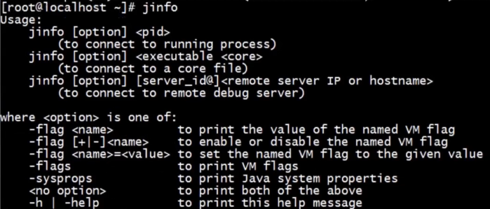
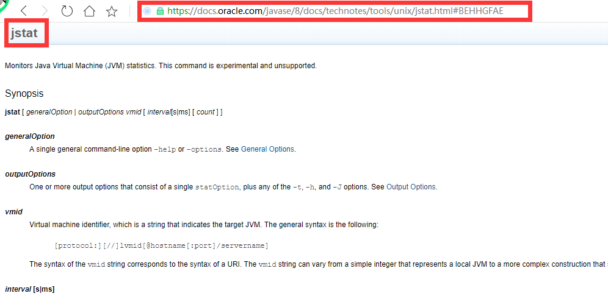

<!--toc-->
[TOC]

我们接着上一章节[[JVM教程与调优] JVM都有哪些参数类型？](https://mp.weixin.qq.com/s?__biz=MzIwMTg3NzYyOA==&mid=2247484247&idx=2&sn=a1f732611bab89f0db84d3ab162e8763&chksm=96e67244a191fb52a4d6b292112cc94c412d3c90a688bc6da533dec8cfe9cfa693af65b16dd5&token=89408735&lang=zh_CN#rd)的内容继续讲解，这章我们来介绍一下：如何查看JVM运行时参数。这一点十分重要，因为我们在进行JVM参数调优的时候，我们首先得知道目前系统运行的值是什么，然后相应的根据相关参数进行调优。

1.-XX:+PrintFlagsInitial（查看初始值）

2.-XX:+PrintFlagsFinal（查看最终值）

3.-XX:+UnlockExperimentalVMOptions（解锁实验参数）

4.-XX:+UnlockDiagnosticVMOptions（解锁诊断参数）

5.-XX:+PrintCommandLineFlags（打印命令行参数）

### PrintFlagsFinal

bool类型 属性名：UseG1GC 值：false

因此可以看出，并没有使用G1GC。

InitialHeapSize := 130023424

表示初始堆的值大小。

> 注意：
> 
> =表示默认值
> 
> :=被用户或者JVM修改后的值

#### 演示一下

可以看到有非常多的参数。有兴趣的小伙伴可以自己试试。

那么刚才我们看到的参数是哪个进程的呢？

答案是：通过执行`java -XX:+PrintFlagsFinal -version`这个命令时的进程参数值。

如果我们要查看一个在运行时的JVM参数值，那么如何查看呢？这就是我们后面讲到的[jinfo](https://docs.oracle.com/javase/8/docs/technotes/tools/unix/jinfo.html#BCGEBFDD),在此之前，我们先来看一下·jps·。

### jps

`jps`它就类似于Linux系统中的`ps`，也是用来查看系统进程的。不过它是专门用来查看java的进程。接下来我们来简单演示一下`jps`的使用

#### 如何使用？

更多`jps`的适用参数命令，可以去[这里](https://docs.oracle.com/javase/8/docs/technotes/tools/unix/jps.html#CHDCGECD)查看

### jinfo

那么我们如何去查看一个正在运行的JVM的参数值呢？

那么用`jinfo`就可以了。

再例如，我们如何查看tomcat的最大内存值是多少？那么我们首先得知道命令，然后找到对应的pid。

如图，其中23789就是`tomcat`的进程`pid`,查看对内存大小命令：`MaxHeapSize`。

可以看到最大堆内存大小为268435456

可以看到我们手动赋值的参数，也可以看到默认有的参数值。

- 查看最大内存

- 查看垃圾回收器

### jstat查看JVM统计信息

- 类装载
- 垃圾收集
- JIT编译

垃圾回收这块非常有用，因为我们能够非常清楚的看到内存结构里面每一块的大小是如何进行变化的。

#### 命令格式

> options：-class,-compiler,-gc,-printcompilation

我们来查看一下[jstat](https://docs.oracle.com/javase/8/docs/technotes/tools/unix/jstat.html#BEHHGFAE)文档。

我们来介绍一下几个命令。

#### 类装载

> jstat -class 3176 1000 10

后面的1000表示每隔1000ms,10表示一共输出10次

我们来看一下文档中是如何介绍-class命令。

分别表示什么含义呢？

- Loaded：类装载的个数
- Bytes：装载的kBs数
- Unloaded：卸载的个数
- Bytes：卸载的kBs数
- Time：所花费的装载和卸载的时间

### 垃圾收集

命令：-gc、-gcutil、-gccause、-gcnew、-gcold

输入：jstat -gc 3176 1000 3

同样，后面表示每隔1000ms,一共打印输出3次

我们同样来看一下文档中的-gc的命令

我们来总结一下-gc输出结果。

- S0C、S1C、S0U、S1U：S0和S1的总量与使用量
- EC、EU：Eden区总量与使用量
- OC、OU：Old区总量与使用量
- MC、MU：Metaspace区总量与使用量
- CCSC、CCSU：压缩类空间总量与使用量
- YGC、YGCT：YoungGC的次数与时间
- FGC、FGCT：FullGC的次数与时间
- GCT：总的GC时间

### JIT编译

命令：-compiler、-printcompilation

我们来演示一下JIT编译。

这些都表示什么含义呢？我们来看一下我们的文档。

- Compiled：表示完成了多少个编译任务
- Failed：表示失败的编译任务个数
- Invalid：表示无效的编译任务
- Time：执行编译任务所花的时间。
- FailedType：上次失败编译的编译类型。
- FailedMethod：上次编译失败的类名和方法。

小伙伴可以结合一下上方的演示图案，来理解一下是什么含义。

大家了解一下就可以，实际工作中作用并不是很大。

以上都是以**JDK1.8**进行介绍。这里小伙伴们先简单了解一下这一块，后续再详细介绍。小伙伴们可以自己在电脑上尝试一下使用命令，观察一下打印结果。

关于**JVM参数**的命令，在文档中还有更多的详细介绍。感兴趣的小伙伴，可以自行去查看。

传送门：[https://docs.oracle.com/javase/8/docs/technotes/tools/unix/jstat.html#BEHHGFAE](https://docs.oracle.com/javase/8/docs/technotes/tools/unix/jstat.html#BEHHGFAE)

下一章，我们将来学习一下**JVM的内存结构以及内存溢出**。感兴趣的小伙伴，可以关注一下~

## 推荐

- [[JVM教程与调优] 为什么要学习JVM虚拟机？](https://mp.weixin.qq.com/s?__biz=MzIwMTg3NzYyOA==&mid=2247484247&idx=1&sn=e41732e54d5b57534d312dc9f15f47f0&chksm=96e67244a191fb5287c35c278cff4810939bd70a76cd4190fe7636d06b3ccb07f6aca974ed62&token=89408735&lang=zh_CN#rd)
    
- [[JVM教程与调优] JVM都有哪些参数类型？](https://mp.weixin.qq.com/s?__biz=MzIwMTg3NzYyOA==&mid=2247484247&idx=2&sn=a1f732611bab89f0db84d3ab162e8763&chksm=96e67244a191fb52a4d6b292112cc94c412d3c90a688bc6da533dec8cfe9cfa693af65b16dd5&token=89408735&lang=zh_CN#rd)
    

## 文末

文章收录至

Github: [https://github.com/CoderMerlin/coder-programming](https://links.jianshu.com/go?to=https%3A%2F%2Fgithub.com%2FCoderMerlin%2Fcoder-programming)

Gitee: [https://gitee.com/573059382/coder-programming](https://links.jianshu.com/go?to=https%3A%2F%2Fgitee.com%2F573059382%2Fcoder-programming)

[原文](https://www.cnblogs.com/coder-programming/p/12604799.html)