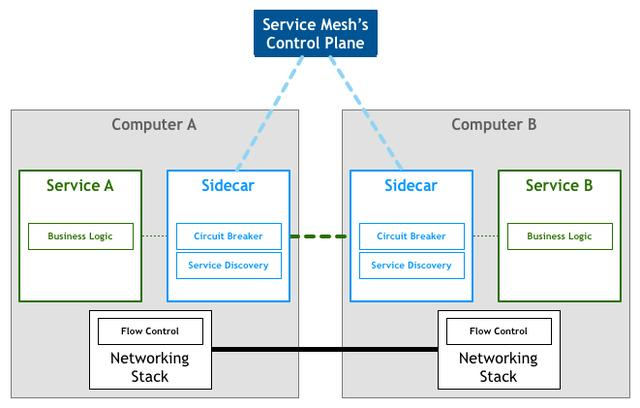
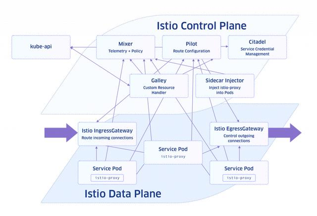
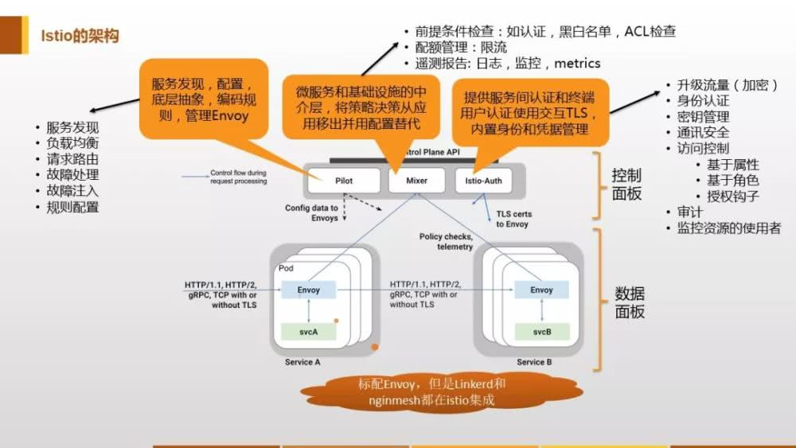
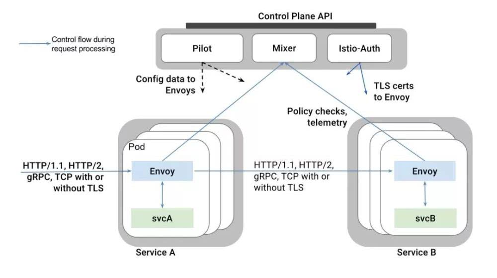

[TOC]

# 全方位详解Service Mesh（服务网格）

在数字化转型的旗帜下，IT界的一大变化是大型单体应用程序被分解为微服务架构，即小型、离散的功能单元，并且这些应用程序在容器中运行。包含所有服务代码以及依赖项的软件包被隔离起来，并且能轻松从一个服务器迁移到另一个。

像这样的容器化架构很容易在云中扩展和运行，并且能够快速迭代和推出每个微服务。然而，当应用程序越来越大并且在同一个服务上同时运行多个实例时，微服务之间通信将会变得愈发复杂。Service mesh的出现将解决这一问题，它是一个新兴的架构形式，旨在以减少管理和编程开销的形式来连接这些微服务。

## 什么是Service mesh？


关于Service mesh的定义，最为广泛接受的观点是：它是一种控制应用程序不同部分彼此共享数据的方式。这一描述包含了service mesh的方方面面。事实上，它听起来更像是大多数开发人员从客户端-服务器应用程序中熟悉的中间件。

Service mesh也有其独特之处：它能够适应分布式微服务环境的独特性质。在搭建在微服务中的大规模应用程序中，有许多既定的服务实例，它们跨本地和云服务器运行。所有这些移动部件显然使得各个微服务难以找到他们需要与之通信的其他服务。Service mesh可以在短时间内自动处理发现和连接服务，而无需开发人员以及各个微服务自行匹配。

我们可以将service mesh等同为软件定义网络（SDN）的OSI网络模型第7层。正如SDN创建一个抽象层后网络管理员不必处理物理网络连接，service mesh将解耦在抽象架构中的与你交互的应用程序的底层基础架构。

随着开发人员开始努力解决真正庞大的分布式架构的问题，service mesh的概念适时地出现了。这一领域的第一个项目是Linkerd，它一开始是Twitter内部项目的一个分支。Istio是另一个十分流行的service mesh项目，它起源于Lyft，现在这一项目获得了许多企业的支持。

## Service mesh负载均衡

Service mesh其中一个关键功能是负载均衡。我们常常将负载均衡视为网络功能——你想要防止服务器或网络链接被流量淹没，因此相应地你会路由你的数据包，而Service mesh在应用程序层面也在执行类似的事情。

本质上，Service mesh的工作之一是跟踪分布在基础设施上的各种微服务的哪些实例是“最健康的”。它可能对他们进行调查来查看它们如何工作的或跟踪哪些实例对服务请求响应缓慢并将后续请求发送到其他实例。此外，service mesh也会为网络路由做类似的工作，如果发现当消息需要很长时间才能送达，那么service mesh将会采用其他路由进行补偿。这些减速可能是由于底层硬件出现问题，或者仅仅是由于服务因请求过载或处理能力不足导致的。但没有关系，service mesh会找到另一个相同服务的实例，然后将其路由以替代响应缓慢的实例，高效利用了整个应用程序的资源。

## Service mesh vs Kubernetes

如果你稍微熟悉基于容器的架构，你可能会想Kubernetes这个流行的开源容器编排平台能否适合这种情况。毕竟，Kubernetes不就是管理着你的容器之间如何互相通信的吗？你可将Kubernetes“服务”资源视为非常基础的service mesh，因为它提供服务发现和请求的轮询调度均衡。但是完整的service mesh则提供更丰富的功能，如管理安全策略和加密、“断路”以暂停对缓慢响应的实例的请求以及如上所述的负载均衡等。

请记住，大多数service mesh确实需要像Kubernetes这样的编排系统。Service mesh只是提供扩展功能，而非替代编排平台。

## Service mesh vs API 网关

每个微服务都会提供一个API，它会作为其他服务与其通信的手段。这引发了service mesh与其他更传统的API管理形式（如API网关）之间的差异问题。API网关位于一组微服务和“外部”世界之间，它根据需要路由服务请求，以便请求者不需要知道它正在处理基于微服务的应用程序即可完成请求。而service mesh调解微服务应用程序内部的请求，各种组件完全了解其环境。

另一方面，service mesh用于优化集群内东西流量（server-server流量），API网关用于进出集群的南北流量（server-client流量）。但service mesh目前依旧处于早期阶段还在不断发展变化中。许多service mesh（包括Linkerd和Istio）现在已经可以提供南北功能。

## Service mesh 架构

Service mesh这一概念其实出现的时间并不长，并且已经有相当数量的不同的方法来解决“service mesh”的问题，如管理微服务通信。目前，确定了三种service mesh创建的通信层可能存在的位置：

*   每个微服务导入的library
*   在特定节点提供服务给所有容器的节点agent
*   与应用程序容器一起运行的sidecar容器

基于sidecar的模式目前是service mesh最受欢迎的模式之一，以至于它在某种程度上已经成为了service mesh的代名词。尽管这种说法并不严谨，但是sidecar已经引起了很大的关注，我们将在下文更详细地研究这一架构。



## Sidecar

Sidecar容器与你的应用程序容器一起运行意味着什么呢？在这类service mesh中每个微服务容器都有另一个proxy容器与之相对应。所有的服务间通信的需求都会被抽象出微服务之外并且放入sidecar。

这似乎很复杂，毕竟你有效地将应用程序中的容器数量增加了1倍。但你使用的这一种设计模式对于简化分布式应用程序至关重要。通过将所有的网络和通信代码放到单独的容器中，将其作为基础架构的一部分，并使开发人员无需将其作为应用程序的一部分实现。

本质上，你所留下的是一个聚焦于业务逻辑的微服务。这个微服务不需要知道如何在其运行的环境中与所有其他服务进行通信。它只需要知道如何与sidecar进行通信即可，剩下的将由sidecar完成。

  

## Service mesh明星项目：Linkerd、Envio、Istio、Consul

那么说了这么多，什么是可用的service mesh呢？目前，这一领域还没有出现完全现成的商业产品。大部分的service mesh只是开源项目，需要通过一定的操作步骤才能实现，现在比较知名的项目有：

*   Linkerd：2016年发布，是这些项目中最老的。Linkerd是从Twitter开发的library中分离出来的。在这一领域另一位重量型选手，Conduit，已经进入了Linkerd项目并构成了Linkerd 2.0的基础。

*   Envoy：由Lyft创建，为了能够提供完整的service mesh功能，Envoy占据“数据平面”的部分，与其进行匹配。

*   Istio：由Lyft、IBM与google联合开发，Istio可以在不修改微服务源代码的情况下，轻松为其加上如负载均衡、身份验证等功能，它可以通过控制Envoy等代理服务来控制所有的流量。此外，Istio提供容错、金丝雀部署、A/B测试、监控等功能，并且支持自定义的组件和集成。Rancher 2.3 Preview2版本上开始支持Istio，用户可以直接在UI界面中启动Istio并且可以为每个命名空间注入自动sidecar。Rancher内置了一个支持Kiali的仪表盘，简化Istio的安装和配置。这一切让部署和管理Istio变得简单而快速。

*   HashiCorp Consul：与Consul 1.2一起推出了一项名为Connect的功能，为HashiCorp的分布式系统添加了服务加密和基于身份的授权，可用于服务发现和配置。

哪个service mesh适合你？如果要进行一个全面的比较的话，超出了本文所涉及的范围。但上述的所有产品都已经在大型且严苛的环境中得到验证。目前，Linkerd和Istio包含最丰富的功能集，但一切都还在迅速发展中，现在下定论还为时过早。

# 入门了解Service Mesh + Istio

诸如容器、Kubernetes等云原生架构和技术的成熟推动了服务网格架构的极速增长以及广泛采用。尽管云原生环境可以为企业带来一系列好处，但是其复杂性也对负责开发维护这类系统的人员，如软件开发人员、网络运维人员、基础架构工程师以及CIO、CTO等带来了重大挑战。

服务网格框架能够为跨不同云原生环境的应用程序整合一致的服务和网络管理能力，它还极大地加快了DevOps实践的进程，正缘于此，服务网格近年来可谓是发展迅猛。云原生普及的加快，要求拥有云原生应用程序的工程团队必须熟悉服务网格功能，以判断该技术将来是否能为企业提供价值。

## 什么是服务网格？

服务网格可以连接、保护、控制以及监控在编排平台上的服务。“服务网格”这一术语本身用于分布式应用程序中服务之间的一组搭接网络连接，也适用于管理该组连接服务的一系列工具。如果你有两个通过网络连接进行交互的微服务，那就意味着你有了一个服务网格。下图是一个十分简单的示例，一个网格和两个服务：


更有可能的是，由于在环境中微服务的数量会继续增长，你的服务网格会如下图所示：


随着云环境扩展到混合云和多云部署，开发人员将会使用微服务来加速开发并且确保在多个容器和分布式云资源中的的可移植性。随着微服务生态系统的复杂性增长，我们需要高效且智能地管理它，并且深入了解微服务如何交互以及保护微服务之间的通信。

## 什么是Istio？

如果你已经听说了服务网格，那么你一定顺带听说了Istio。Istio是一个开源的服务网格，它可以部署在已有的云原生应用程序上。它还具有类似于平台的功能——可以将集成到日志平台、遥测或策略系统中。策略集成使得Istio在创建一个统一的方法来保护、连接以及监控既定环境中的微服务中扮演一个安全工具的角色。当泛指“Istio服务网格”时，通常是指Istio中的一系列工具，而特指“某个Istio 服务网格”时则表明由Istio安装管理的指定应用程序集群。Istio的许多CRD允许对应用程序网络层的行为进行编程配置（通过使用Kubernetes API），其中应用程序是相互依赖的微服务集。Istio在某种程度上可以称为当今云原生堆栈中服务网格的同义词，因为它的功能最丰富、最标准化。

## 我是否需要一个服务网格？

尽管服务网格的采用率可能会持续快速增长，特别是当功能设置和类似Istio的管理工具进一步完善之后，但并不是每个云原生环境都需要服务网格。所以你如何知道一个服务是否适合你的企业或者环境呢？如果你需要解决下面所描述的一个或多个需求或问题的方案，那么你应该考虑部署一个服务网格：

*   你在基于分布式微服务的应用程序中遇到性能问题
*   你需要为所有微服务收集并交付一致的请求和连接指标
*   你想直接默认在线加密设置，而无需直接管理TLS证书
*   你需要比Kubernetes网络策略提供的更细粒度的解决方案进行服务到服务的控制
*   你想使用金丝雀发布和应用程序API多版本支持进行自动release
*   你想无需修改应用程序就可以添加用户的身份验证和授权认证信息

另一方面，如果在你的堆栈中不需要服务网格，那么你需要做一些权衡。考虑到这些环境的复杂性，部署一个服务网格（包括Istio）需要大量的迁移工作和运维成本。如果你的微服务部署数量不会增长，或者如果有其他解决方案可以满足你内部的HTTP请求路由的需求，或者如果你已经有了一个可管理且高效的解决方案可以解决上述的关键需求，那么此刻服务网格对你来说真的不是一个最佳选择。

但是如果服务网格继续极速被广泛采用，为支持它而开发的功能生态系统将会继续扩展。这种增长将提升可管理性和功能性，以便将来DevOps团队可以更加轻松地访问更强大的服务网格工具，而不必担心将新的基础架构层部署到云原生堆栈中而出现棘手的问题或花费很高的成本。

## Istio工作原理

Istio组件被分为两部分——控制平面和数据平面。控制平面是指管理配置和监控数据平面的服务。数据平面由作为sidecar由在应用程序pod中的智能代理（proxy）组成，这是Kubernetes对象模型中最小的可部署对象。这些Istio proxy有助于控制和监控微服务间的网络连接。从控制平面接收路由和策略规则，然后数据平面报告回连接处理遥测。



通过创建Kubernetes资源来配置Istio服务网格。此外，有许多Kubernetes CRD可以映射到Istio各种功能上。接下来，我们会讨论更多关于控制和数据平面的作用，但在此之前我们先了解关于Istio的潜在能力，以及它的不足。

## 潜力与不足

Istio通过其可动态配置代理的网格提供了一系列用于处理和控制网络连接的特性。但这些功能配置繁重并且拥有陡峭的学习曲线。并且有时把已有的应用程序迁移到Istio架构时依旧会出现一些常见的问题，尽管这些架构已经是Kubernetes原生的微服务。

此外，Istio缺乏对如何将用户提供的配置转换为Envoy路由的了解。Envoy是作为服务网格中服务的入站和出站流量的中介开发的一种高性能的代理，是由来自共享出行服务公司Lyft的开发人员创建的，可以用于从单体架构转变为服务网格架构。其他在使用中的问题还包括部署和服务资源配置要求所需的学习曲线、在打开mTLS时中断Kubernetes readiness和liveness探针以及使用没有ClusterIP的Kubernetes服务或绕开Kubernetes服务发现流程的服务。

Istio的优势在于可以让你在不修改微服务源代码的情况之下，很轻松地给微服务加上诸如负载均衡、身份验证、监控等等的功能。而且目前它正在快速发展迭代，频繁发布新版本，并且积极征求用户反馈。尽管目前Envoy还有很多局限，但是随着Istio持续发展，它也会积极开发和完善自己的功能。

## 配置控制平面



在Kubernetes集群中，一个典型的Istio部署应该包含以下服务：

Pilot，在Istio网络自定义资源中集合流量管理规范配置，并将该配置交付到istio-proxy sidecar。

Mixer，用于处理由proxy sidecar生成的请求指标的遥测，并将其发送到已配置完成的后端，并执行授权策略。如果开启了策略检查（Istio 1.1中默认关闭），proxy sidecar将会连接到Mixer以确认连接是被允许的。但是，这个方法会稍微增加网络延迟。

Citadel，这个是Istio的公钥基础设施（PKI）服务，它可以生成、轮换和吊销用于身份验证的客户端TLS证书。

Galley，它是大多数Istio CRD的Kubernetes controller，使用户可以更改自定义资源并将内容分配到其他Istio服务中。

## 数据平面

可以认为数据平面是有状态的，也就是说组成数据平面的软件维护着应用状态。

数据平面由Envoy服务代理提供支持，该代理使用Istio扩展构建。Proxy会拦截到pod服务端口的传入流量，并默认拦截来自pod其他容器的所有创出TCP流量。在大部分情况下，无需更改应用程序代码，仅对应用程序的Kubernetes部署和服务资源规范进行较小的更改，proxy sidecar 就可以在pod中运行。Proxy sidecar的配置由在Istio 控制面板中的服务进行动态管理。

最终，也许会在某个时间点你需要部署服务网格以确保你的云原生环境完全正常运行并得到充分保护。因此，熟悉有关服务网格的基础只是将可以帮助你做出准确的判断——什么时候应该部署服务网格以及应该如何部署。如果你正在计划在Kubernetes和其他容器平台上进行扩展计划，那么你通过了解Istio的设计和功能以及它如何降低容器化微服务和云原生环境的固有复杂性，你可以知道Istio是一个功能强大且快速改进的解决方案并且正在积极增强弹性伸缩能力、安全性以及管理的简易性。

如果企业继续采用云原生和分布式架构，那么Istio的服务网格功能以及底层基础架构的网络控制和Kubernetes的安全实践将会极大程度解放DevOps团队在弹性伸缩和管理应用程序基础架构上的压力。

在10月9日GA的Rancher 2.3中，正式集成了Istio，极大简化了Istio的安装和配置。你只需要在UI中使用工具菜单，即可启动Istio。Rancher中现已内置支持：

*   用于流量和遥测可视化的Kiali仪表板
*   用于追踪的Jaeger
*   用于监控和可观察性的Prometheus和Grafana

# 使用K8s遇难题？Istio来帮您
如果你正在使用容器，特别是Kubernetes，那么你应该也听说过Istio。对于初学者来说，Istio是Kubernetes的服务网格（service mesh）。所谓服务网格，它是一个网络层，并且可以动态管理服务流量，然后以安全的方式进行管理。

如何充分使用Istio，这不是一篇博客文章能阐述清楚的。因此，在本文中我将介绍一些它的特性，更重要的是，你可以通过这篇文章，了解到一些方法来自动化解决某些实际问题。

Istio可以让你使用一组自定义Kubernetes资源来管理网络流量，并且可以帮助你保护和加密服务之间以及集群内外的网络流量。它全面集成了Kubernetes API，这意味着可以使用与其他Kubernetes配置完全相同的方式来定义和管理Istio设置。

## 权衡利弊,再做选择

如果要开始使用Istio，首先应该问自己为什么。Istio提供了一些非常有价值的功能，如金丝雀发布等，但是如果不增加一些复杂性，就无法使用它们。你还需要投入一定的时间来学习它。也就是说，如果你的情况合适使用它，你可以（并且应该）在自己的集群中谨慎且逐步地采用Istio的功能。

如果你要从头开始构建新环境，并且经过利弊权衡决定继续使用Istio，那么一定要从一开始就使用严格的相互TLS对其进行设置，并积极使用其强大的功能。具体操作请参考：

https://istio.io/docs/setup/install/kubernetes/#installation-steps

为了使一切都有价值并且具有一定的性价比，我们需要在实际应用程序的上下文中考虑Istio，但是如果没有快速免责声明的话，最好不要这样做。如果你只需要管理少量服务（且位于单个集群内），那么引入Istio的性价比相对而言没有那么高。

本文中的代码示例不一定能够完全帮助你解决你的问题，但是如果你需要所有的代码以及如何使用它的详细说明都可以在GitLab上找到：

https://gitlab.com/ContainerSolutions/k8s-deployment-mtl/

接下来是你在Cloud Native旅程中可能遇到的两个常见问题，以及如何使用Istio来解决这些问题。

## 问题1：我不相信我的测试
如果测试范围并没有完全涵盖你所更改的应用程序，那么你可能会很快采取行动进行新一轮测试，但也有可能应用程序无法正常运行了。

在理想状况下，我们都想要确保每个代码经过全面的测试，否则就不会将功能添加到应用程序中。但是现实总归是骨感的，我们常常被ddl追赶，可能还未编写或者更新测试，功能就得上传到项目中了。

## 解决方案：放慢速度
那么，如何确保我绝大多数用户不受代码中潜伏的任何错误的影响，又如何进行更改和部署新功能呢？答案是通过先将新版本部署到最少数量的用户来最大程度地减少这些小问题的辐射范围。

如果更改能够按照预期工作的话，你可以缓慢增加使用新版本的用户百分比。如果各项指标出现问题，你可以轻松回滚你的更改，然后重试。

在没有Istio的情况下可以在Kubernetes上运行金丝雀部署吗？当然没问题，但是如果要自动化这一过程，你需要完全将自己的精力放在web服务器代码和自定义自动化脚本方面。这样的操作方式性价比并不高。

Istio有一些十分优雅的流量分配解决方案，我们可以使用它们在恰当的时间为合适的版本提供适当的客户端服务，并且我们只需调整其中的1个或2个参数。

为了实现这一点，你需要设置一个网关入口（Ingress gateway）、一个虚拟服务（virtual service）和一个destination rule。这将位于一般的部署和服务之上，并为你分配流量。

```yaml
apiVersion: networking.istio.io/v1alpha3
kind: Gateway
metadata:
 name: http-gateway
spec:
 selector:
 istio: ingressgateway
 servers:
 - port:
 number: 80
 name: http
 protocol: HTTP
 hos
ts:
 - "*"
---
apiVersion: networking.istio.io/v1alpha3
kind: VirtualService
metadata:
 name: my-app
spec:
 hosts:
 - "*"
 gateways:
 - http-gateway
 http:
 - match:
 - uri:
 prefix: "/my-app"
 rewrite:
 uri: "/"
 route:
 - destination:
 host: my-app
 subset: v1
 port:
 number: 80
 weight: 90
 - destination:
 host: my-app
 subset: v2
 port:
 number: 80
 weight: 10
---
apiVersion: networking.istio.io/v1alpha3
kind: DestinationRule
metadata:
 name: my-app
spec:
 host: my-app
 subsets:
 - name: v1
 labels:
 version: v1.0.0
 - name: v2
 labels:
 version: v2.0.0 
```
从虚拟服务的权重字段中可以看到，Istio将根据指定的值在应用程序的两个版本之间分配流量。这些值的总和必须为100％，否则，API将拒绝应用该定义。

然后，你（或者理想情况下，在“持续集成/连续交付”流水线中手动执行一个或多个步骤）将调整权重，以将新版本推广给更多用户，直到所有请求由新版本满足为止，并且以前的版本可以停止维护。

通过使用Istio的故障注入功能来模拟网络中断和实际流量性能下降，还可以将Istio集成到您的集成测试策略中。

如果在生产中进行测试的想法给你留下了心理阴影，那一定是你的做法有所欠缺。例如，尝试在你的虚拟服务规范中添加以下代码片段以添加一些混乱，然后再找一篇文章来看看怎么用Istio解决这样的混乱。
```yaml
spec:
 hosts:
 - my-app
 http:
 - fault:
 delay:
 fixedDelay: 7s
 percent: 100
 route:
 - destination:
 host: ratings
 subset: v2
```
## 问题2：市场策略无法确定发布版本
通常，业务需要针对实际用户测试应用程序的多个版本。但是有时实在无法搞清楚是哪种营销策略可以带来最佳转化率，或者哪种设计选择可以带来最佳的客户留存率。

使用Kubernetes，你可以将流量分为两个版本，但是要想从练习中获得任何有价值的见解，则再次需要一大堆自定义代码来获取相关信息，并以非技术同事可以理解的方式对其进行处理。
## 解决方案：使用Istio进行A/B测试
Istio的流量分配规则可以再次解决这一问题，它与Prometheus和Grafana的紧密集成可以帮助你获取直观的A/B测试的结果。一般而言，根据传入数据包内容的某些部分，几乎有无数种方法来决定哪些用户可以获取你的应用程序的版本。

在这一示例中，我们将使用User-Agent字段为不同的浏览器提供不同的版本。
```
apiVersion: networking.istio.io/v1alpha3
kind: VirtualService
metadata:
 name: my-app
spec:
 hosts:
 - "*"
 gateways:
 - http-gateway
 http:
 - match:
 - headers:
 user-agent:
 regex: ".*Chrome.*"
 uri:
 prefix: "/my-app"
 rewrite:
 uri: "/"
 route:
 - destination:
 host: my-app
 subset: v1
 port:
 number: 80
 - match:
 - headers:
 user-agent:
 regex: ".*Mozilla.*"
 uri:
 prefix: "/my-app"
 rewrite:
 uri: "/"
 route:
 - destination:
 host: my-app
 subset: v2
 port:
 number: 80
```
从上面的代码中可以看到，使用Firefox的用户将获得应用程序的版本1，而Chrome用户将获得版本2。如果浏览器的“User-Agent”字段不包含“mozilla”或“chrome”，则他们都将不会获得任一版本。

要为其他客户提供服务，您需要添加一条默认路由，我将作为练习留给你。（嘿嘿）

如果你不想安装其他浏览器，只是想尝试一下，则可以使用带有头部标志的curl伪装成所需的任何浏览器，例如：
```
curl /my-app -H "User-Agent: Chrome"
```
通过更改user-agent的值，你可以从命令行测试所有不同的路由。

## 总 结
以上两种情况大概能让你体验到Istio强大功能的冰山一角。正如上文所说，如果没有Istio，你依然可以进行金丝雀部署和A/B测试，只是你必须自己实现流量分配。但这大大增加了开发部署的复杂性，实属性价比低之选。

我希望这篇文章可以让你对Istio的实际应用有很好的理解，并且十分期待你自己尝试一下。如果你想了解更多关于Istio的信息，可以访问它们的官网，上面有许多有用的资料：https://istio.io/

值得一提的是，Rancher 2.3 Preview2版本上开始支持Istio，用户可以直接在UI界面中启动Istio并且可以为每个命名空间注入自动sidecar。此外，Rancher简化Istio的安装和配置，内置了一个支持Kiali的仪表盘，用于流量和遥测的可视化，然后用Jaeger进行追踪，甚至还有自己的Prometheus和Grafana（与用于高级监控的实例不同）。这一切让部署和管理Istio变得简单而快速。

有关发行说明和安装步骤，请访问GitHub：

https://github.com/rancher/rancher/releases/tag/v2.3.0-alpha5

[原文](https://www.toutiao.com/i6735600850007228935)