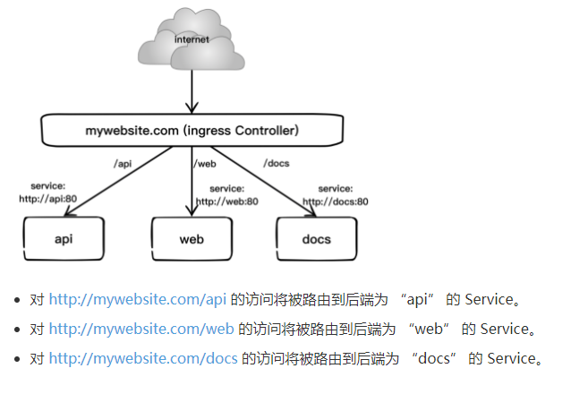

概念 |	含义
-|-
Cluster |	Cluster 是计算、存储和网络资源的集合，k8s利用这些资源运行各种基于容器的应用
Master |	负责调度，决定应用的运行位置。可以是物理机或虚拟机
Node	|运行容器应用，被 Master 管理， Node 定期汇报容器状态并接受 Master 的管理指令
Pod |	K8s 上的最小工作单元。每个 Pod 包含一个或多个容器。 Pod 中的容器会被作为整体被 Master 调度到某个 Node 上运行。
Controller |	K8s 通过 Controller 间接管理 Pod。Controller 决定 Pod 的部署特性(副本、Node等)。
Service |	定义外界访问特定 Pod 的方式。Service 有自己的 IP 和端口，为 Pod 提供负载均衡。

#### Pod 之间如何通信？

一个应用可以产生多个副本运行在多个 Pod 上，以实现高可用。这些 Pod 通过Service互相访问对方，而不是 IP，因为 Pod 频繁启停，IP 变化不定。

**K8s 通过Controller运行容器；通过Service访问容器**

#### K8s 提供的 Controller

Controller | 说明
-|-
ReplicationController | 副本控制器
ReplicaSet |	实现 Pod 的多副本管理。一般不直接使用，实际上，Deployment 就是通过 ReplicaSet 来管理 Pod 副本的。
Deployment |	最常用的Controller。管理 Pod 的多个副本，并确保 Pod 按照期望的状态运行
DaemonSet |	用于每个 Node 最多只运行一个 Pod 副本的场景
StatefulSet |	保证 Pod 在其生命周期中，名称是不变的。对于其他 Controller，Pod 重启后名称会发生变化。
Job,cron job |	用于运行结束就要删除的应用。其他 Controller 中的 Pod 持续运行


#### Services 一般有两种访问 对集群内部的访问， 集群外部的访问
[外部访问 kubernetes，知道这 3 种模式就够了](https://mp.weixin.qq.com/s?__biz=MzI1OTY2MzMxOQ==&mid=2247486903&idx=1&sn=6fa7aa2cffe22570032010ecf73ac418)
[浅谈Kubernetes Service负载均衡实现机制](https://xigang.github.io/2019/07/21/kubernetes-service/)
[Kubernetes之服务发现及负载Services](https://www.cnblogs.com/xzkzzz/p/9559362.html)
Service Type | 说明
-|-
ClusterIP  | 集群内部容器访问地址，会生成一个虚拟IP 与pod不在一个网段。只是给集群内部和pod之间访问的，外部无法访问，网段通过配置文件指定，在Node上kube-proxy通过设置的Iptables规则进行转发。ClusterIP也是Kubernetes service的默认类型。
NodePort  | 会在宿主机上映射一个端口，供外部应用访问模式。比如一个nginx应用需要能被外部访问，就需要配置类型为type=NodePort,并且需要配置下nodePort: 30002(指定固定端口)，这样的话外部使用http://ip:30002就可以访问这个应用了。
Headless CluserIP   | 无头模式，无serviceip，即把spec.clusterip设置为None 。
LoadBalancer   | 使用外部负载均衡。要配合支持公有云负载均衡使用比如GCE、AWS。其实也是NodePort，只不过会把<NodeIP>:<NodePort>自动添加到公有云的负载均衡当中，需要在spec.status.loadBalancer字段指定外部负载均衡器的IP地址，并同时定义nodePort和clusterIP，用于公有云环境。
ExternalName   |    创建一个dns别名指到service name上，主要是防止service name发生变化，要配合dns插件使用


#### 服务发现
Kubernetes 支持2种基本的服务发现模式 —— 环境变量和 DNS。

##### 环境变量
当 Pod 运行在 Node 上，kubelet 会为每个活跃的 Service 添加一组环境变量。 它同时支持 Docker links兼容 变量、简单的 {SVCNAME}_SERVICE_HOST 和 {SVCNAME}_SERVICE_PORT 变量，这里 Service 的名称需大写，横线被转换成下划线。
举个例子，一个名称为 "redis-master" 的 Service 暴露了 TCP 端口 6379，同时给它分配了 Cluster IP 地址 10.0.0.11，这个 Service 生成了如下环境变量：
```
REDIS_MASTER_SERVICE_HOST=10.0.0.11
REDIS_MASTER_SERVICE_PORT=6379
REDIS_MASTER_PORT=tcp://10.0.0.11:6379
REDIS_MASTER_PORT_6379_TCP=tcp://10.0.0.11:6379
REDIS_MASTER_PORT_6379_TCP_PROTO=tcp
REDIS_MASTER_PORT_6379_TCP_PORT=6379
REDIS_MASTER_PORT_6379_TCP_ADDR=10.0.0.11
```
这意味着需要有顺序的要求 —— Pod 想要访问的任何 Service 必须在 Pod 自己之前被创建，否则这些环境变量就不会被赋值。DNS 并没有这个限制。
##### DNS
一个强烈推荐的集群插件 是 DNS 服务器。 DNS 服务器监视着创建新 Service 的 Kubernetes API，从而为每一个 Service 创建一组 DNS 记录。 如果整个集群的 DNS 一直被启用，那么所有的 Pod 应该能够自动对 Service 进行名称解析。
例如，有一个名称为 "my-service" 的 Service，它在 Kubernetes 集群中名为 "my-ns" 的 Namespace 中，为 "my-service.my-ns" 创建了一条 DNS 记录。 在名称为 "my-ns" 的 Namespace 中的 Pod 应该能够简单地通过名称查询找到 "my-service"。 在另一个 Namespace 中的 Pod 必须限定名称为 "my-service.my-ns"。 这些名称查询的结果是 Cluster IP。
Kubernetes 也支持对端口名称的 DNS SRV（Service）记录。 如果名称为 "my-service.my-ns" 的 Service 有一个名为 "http" 的 TCP 端口，可以对 "_http._tcp.my-service.my-ns" 执行 DNS SRV 查询，得到 "http" 的端口号。
Kubernetes DNS 服务器是唯一的一种能够访问 ExternalName 类型的 Service 的方式。 更多信息可以查看DNS Pod 和 Service。
Kubernetes 从 1.3 版本起， DNS 是内置的服务，通过插件管理器 集群插件 自动被启动。Kubernetes DNS 在集群中调度 DNS Pod 和 Service ，配置 kubelet 以通知个别容器使用 DNS Service 的 IP 解析 DNS 名字。


### Ingress：HTTP 7层路由机制

从图中可以看出，Ingress Controller 收到请求，匹配 Ingress 转发规则，匹配到了就转发到后端 Service，而 Service 可能代表的后端 Pod 有多个，选出一个转发到那个 Pod，最终由那个 Pod 处理请求。

根据前面对Service的使用说明，我们知道Service的表现形式为IP:Port，即工作在TCP/IP层，而对于基于HTTP的服务来说，不同的URL地址经常对应到不同的后端服务或者虚拟服务器，这些应用层的转发机制仅通过kubernetes的Service机制是无法实现的。kubernetes v1.1版本中新增的Ingress资源对象将不同URL的访问请求转发到后端不同的Service，以实现HTTP层的业务路由机制。

使用 Ingress 进行负载分发时，Ingress Controller 将基于 Ingress 规则将客户端请求直接转发到 Service 对应的后端 Endpoint（即 Pod）上，这样会跳过 kube-proxy 的转发功能，kuber-proxy 不在起作用。如果 Ingress Controller 提供的是对外服务，则实际上实现的是边缘路由器的功能。

下图显示了一个典型的 HTTP 层路由的例子：

为使用Ingress，需要创建Ingress Controller（带一个默认backend服务）和Ingress策略设置来共同完成。
下面通过一个例子说明Ingress Controller和Ingress策略的配置方法和客户端如何访问Ingress提供的服务。

在定义 Ingress 策略之前，需要先部署 Ingress Controller，以实现为所有后端 Service 提供一个统一的入口。Ingress Controller 需要实现基于不同 HTTP URL 向后转发的负载分发规则，并可以灵活设置 7 层的负载分发策略。如果公有云服务商能够提供该类型的 HTTP 路由 LoadBalancer，则也可以设置其为 Ingress Controller。
在 Kubernetes 中，Ingress Controller 将以 Pod 的形式运行，监控 apiservice 的 /ingress 接口后端的 backend services，如果 service 发生变化，则 Ingress Controller 应自动更新其转发规则。


支持L4和L7负载均衡策略（目前只支持HTTP层的规则）。
支持更多类型的Ingress Controller，除了Nginx，还有kong、HAProxy、Linkerd、traefik、AWS Application Load Balancer Ingress Controller等已经实现了的Ingress Controller，详情可[参考](https://github.com/kubernetes/ingress-nginx/blob/master/docs/catalog.md)的说明。