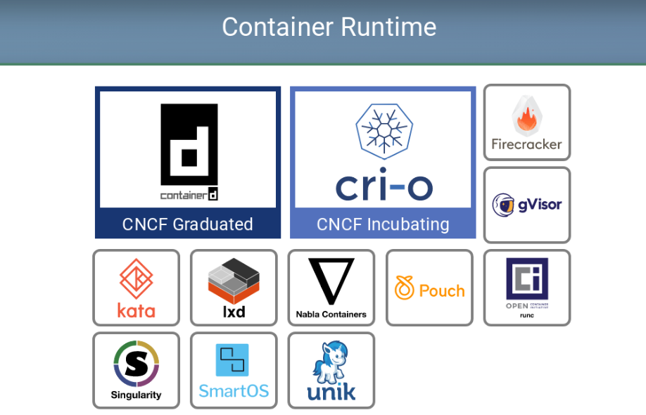
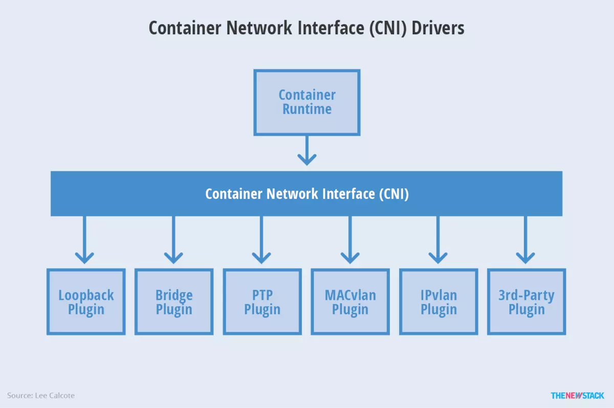
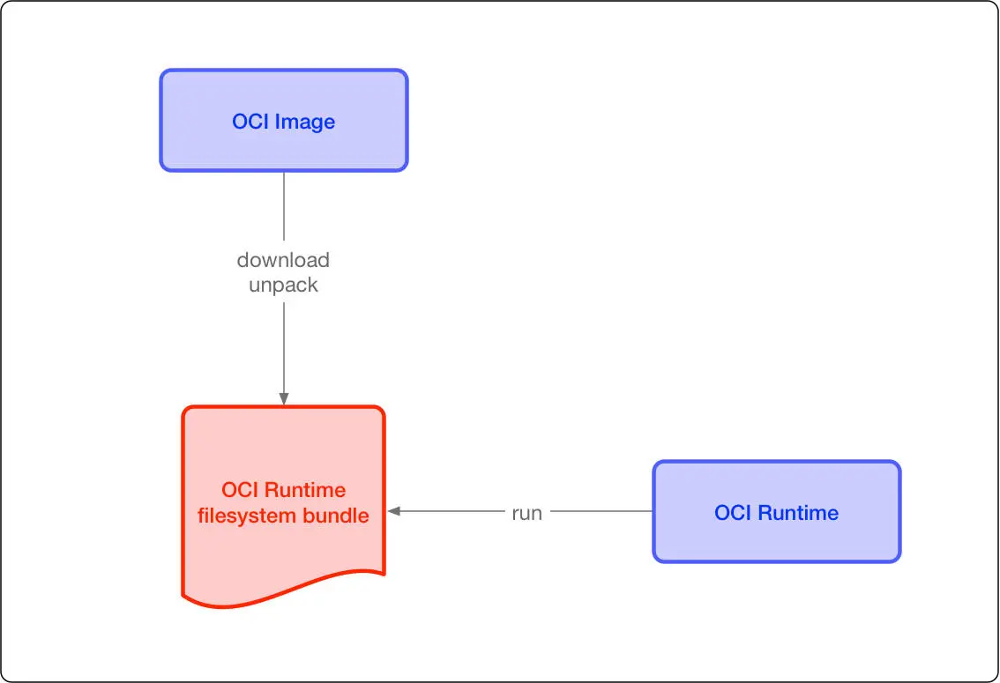
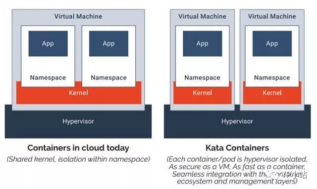

<!-- toc -->
[TOC]
# 谈谈kubernetes Runtime

## RuntimeClass与使用多容器运行时
http://dockone.io/article/9990


kubectl get pod -o custom-columns=NAME:metadata.name,STATUS:.status.phase,RUNTIME_CLASS:.spec.runtimeClassName

## 白话kubernetes Runtime
回想最开始接触 k8s 的时候, 经常搞不懂 CRI 和 OCI 的联系和区别, 也不知道为啥要垫那么多的 “shim”(尤其是 containerd-shim 和 dockershim 这两个完全没啥关联的东西还恰好都叫 shim). 所以嘛, 这篇就写一写 k8s 的 runtime 部分, 争取一篇文章把下面这张 Landscape 里的核心项目给白话明白


### CRI
CRI（Container Runtime Interface,容器运行时接口）是Kubernetes定义的一组与contianer runtime进行交互的接口，用于将Kubernetes平台与特定的容器实现解耦。在Kubernetes早期的版本中，对于容器环境的支持是通过hard code方式直接调用Docker API的,后来为了支持更多的容器运行时和更精简的容器运行时，Kubernetes提出了CRI。本人是Java程序员，对于CRI的理解可以类比的参考JDBC规范。

---


CRI中定义了容器和镜像的服务的接口，因为容器运行时与镜像的生命周期是彼此隔离的，因此需要定义两个服务，该接口使用Protocol Buffer，基于gRPC。

Container Runtime实现了CRI gRPC Server，包括**RuntimeService**和**ImageService**。该gRPC Server需要监听本地的Unix socket，而kubelet则作为gRPC Client运行


#### 启用CRI
除非集成了rktnetes，否则CRI都是被默认启用了，kubernetes1.7版本开始旧的预集成的docker CRI已经被移除。

要想启用CRI只需要在kubelet的启动参数重传入此参数：--container-runtime-endpoint远程运行时服务的端点。当前Linux上支持unix socket，windows上支持tcp。例如：unix:///var/run/dockershim.sock(socket)、 tcp://localhost:373(tcp)，默认是unix:///var/run/dockershim.sock，即默认使用本地的docker作为容器运行时.

配置实例：如使用cri-containerd作为CRI接口，使用kubeadm安装集群，10-kubelet.onf改动配置如下：

```
Environment="KUBELET_EXTRA_ARGS=--container-runtime=remote --runtime-request-timeout=15m --container-runtime-endpoint=unix:///run/containerd/containerd.sock"
```
```go
// Runtime service defines the public APIs for remote container runtimes
service RuntimeService {
    // Version returns the runtime name, runtime version, and runtime API version.
    rpc Version(VersionRequest) returns (VersionResponse) {}

    // RunPodSandbox creates and starts a pod-level sandbox. Runtimes must ensure
    // the sandbox is in the ready state on success.
    rpc RunPodSandbox(RunPodSandboxRequest) returns (RunPodSandboxResponse) {}
    // StopPodSandbox stops any running process that is part of the sandbox and
    // reclaims network resources (e.g., IP addresses) allocated to the sandbox.
    // If there are any running containers in the sandbox, they must be forcibly
    // terminated.
    // This call is idempotent, and must not return an error if all relevant
    // resources have already been reclaimed. kubelet will call StopPodSandbox
    // at least once before calling RemovePodSandbox. It will also attempt to
    // reclaim resources eagerly, as soon as a sandbox is not needed. Hence,
    // multiple StopPodSandbox calls are expected.
    rpc StopPodSandbox(StopPodSandboxRequest) returns (StopPodSandboxResponse) {}
    // RemovePodSandbox removes the sandbox. If there are any running containers
    // in the sandbox, they must be forcibly terminated and removed.
    // This call is idempotent, and must not return an error if the sandbox has
    // already been removed.
    rpc RemovePodSandbox(RemovePodSandboxRequest) returns (RemovePodSandboxResponse) {}
    // PodSandboxStatus returns the status of the PodSandbox. If the PodSandbox is not
    // present, returns an error.
    rpc PodSandboxStatus(PodSandboxStatusRequest) returns (PodSandboxStatusResponse) {}
    // ListPodSandbox returns a list of PodSandboxes.
    rpc ListPodSandbox(ListPodSandboxRequest) returns (ListPodSandboxResponse) {}

    // CreateContainer creates a new container in specified PodSandbox
    rpc CreateContainer(CreateContainerRequest) returns (CreateContainerResponse) {}
    // StartContainer starts the container.
    rpc StartContainer(StartContainerRequest) returns (StartContainerResponse) {}
    // StopContainer stops a running container with a grace period (i.e., timeout).
    // This call is idempotent, and must not return an error if the container has
    // already been stopped.
    // TODO: what must the runtime do after the grace period is reached?
    rpc StopContainer(StopContainerRequest) returns (StopContainerResponse) {}
    // RemoveContainer removes the container. If the container is running, the
    // container must be forcibly removed.
    // This call is idempotent, and must not return an error if the container has
    // already been removed.
    rpc RemoveContainer(RemoveContainerRequest) returns (RemoveContainerResponse) {}
    // ListContainers lists all containers by filters.
    rpc ListContainers(ListContainersRequest) returns (ListContainersResponse) {}
    // ContainerStatus returns status of the container. If the container is not
    // present, returns an error.
    rpc ContainerStatus(ContainerStatusRequest) returns (ContainerStatusResponse) {}
    // UpdateContainerResources updates ContainerConfig of the container.
    rpc UpdateContainerResources(UpdateContainerResourcesRequest) returns (UpdateContainerResourcesResponse) {}

    // ExecSync runs a command in a container synchronously.
    rpc ExecSync(ExecSyncRequest) returns (ExecSyncResponse) {}
    // Exec prepares a streaming endpoint to execute a command in the container.
    rpc Exec(ExecRequest) returns (ExecResponse) {}
    // Attach prepares a streaming endpoint to attach to a running container.
    rpc Attach(AttachRequest) returns (AttachResponse) {}
    // PortForward prepares a streaming endpoint to forward ports from a PodSandbox.
    rpc PortForward(PortForwardRequest) returns (PortForwardResponse) {}

    // ContainerStats returns stats of the container. If the container does not
    // exist, the call returns an error.
    rpc ContainerStats(ContainerStatsRequest) returns (ContainerStatsResponse) {}
    // ListContainerStats returns stats of all running containers.
    rpc ListContainerStats(ListContainerStatsRequest) returns (ListContainerStatsResponse) {}

    // UpdateRuntimeConfig updates the runtime configuration based on the given request.
    rpc UpdateRuntimeConfig(UpdateRuntimeConfigRequest) returns (UpdateRuntimeConfigResponse) {}

    // Status returns the status of the runtime.
    rpc Status(StatusRequest) returns (StatusResponse) {}
}

// ImageService defines the public APIs for managing images.
service ImageService {
    // ListImages lists existing images.
    rpc ListImages(ListImagesRequest) returns (ListImagesResponse) {}
    // ImageStatus returns the status of the image. If the image is not
    // present, returns a response with ImageStatusResponse.Image set to
    // nil.
    rpc ImageStatus(ImageStatusRequest) returns (ImageStatusResponse) {}
    // PullImage pulls an image with authentication config.
    rpc PullImage(PullImageRequest) returns (PullImageResponse) {}
    // RemoveImage removes the image.
    // This call is idempotent, and must not return an error if the image has
    // already been removed.
    rpc RemoveImage(RemoveImageRequest) returns (RemoveImageResponse) {}
    // ImageFSInfo returns information of the filesystem that is used to store images.
    rpc ImageFsInfo(ImageFsInfoRequest) returns (ImageFsInfoResponse) {}
}
```
这其中包含了两个gRPC服务：

RuntimeService：容器和Sandbox运行时管理
ImageService：提供了从镜像仓库拉取、查看、和移除镜像的RPC。

### CNI - Container Network Interface(容器网络接口)
CNI(Container Network Interface) 是 google 和 CoreOS 主导制定的容器网络标准，它本身并不是实现或者代码，可以理解成一个协议。这个标准是在 rkt 网络提议的基础上发展起来的，综合考虑了灵活性、扩展性、ip 分配、多网卡等因素.

这个协议连接了两个组件：容器管理系统和网络插件。它们之间通过 JSON 格式的文件进行通信，实现容器的网络功能。具体的事情都是插件来实现的，包括：创建容器网络空间（network namespace）、把网络接口（interface）放到对应的网络空间、给网络接口分配 IP 等等



接口定义
```go
type CNI interface {
    AddNetworkList(net *NetworkConfigList, rt *RuntimeConf) (types.Result, error)
    DelNetworkList(net *NetworkConfigList, rt *RuntimeConf) error

    AddNetwork(net *NetworkConfig, rt *RuntimeConf) (types.Result, error)
    DelNetwork(net *NetworkConfig, rt *RuntimeConf) error
}
```
该接口只有四个方法，添加网络、删除网络、添加网络列表、删除网络列表。

#### 设计考量
CNI设计的时候考虑了以下问题：

- 容器运行时必须在调用任何插件之前为容器创建一个新的网络命名空间。
- 运行时必须确定这个容器应属于哪个网络，并为每个网络确定哪些插件必须被执行。
- 网络配置采用JSON格式，可以很容易地存储在文件中。网络配置包括必填字段，如name和type以及插件（类型）。网络配置允许字段在调用之间改变值。为此，有一个可选的字段args，必须包含不同的信息。
- 容器运行时必须按顺序为每个网络执行相应的插件，将容器添加到每个网络中。
- 在完成容器生命周期后，运行时必须以相反的顺序执行插件（相对于执行添加容器的顺序）以将容器与网络断开连接。
- 容器运行时不能为同一容器调用并行操作，但可以为不同的容器调用并行操作。
- 容器运行时必须为容器订阅ADD和DEL操作，这样ADD后面总是跟着相应的DEL。 DEL可能跟着额外的DEL，但是，插件应该允许处理多个DEL（即插件DEL应该是幂等的）。
- 容器必须由ContainerID唯一标识。存储状态的插件应该使用（网络名称，容器ID）的主键来完成。
- 运行时不能调用同一个网络名称或容器ID执行两次ADD（没有相应的DEL）。换句话说，给定的容器ID必须只能添加到特定的网络一次。

#### CNI插件
CNI插件必须实现一个可执行文件，这个文件可以被容器管理系统（例如rkt或Kubernetes）调用。

CNI插件负责将网络接口插入容器网络命名空间（例如，veth对的一端），并在主机上进行任何必要的改变（例如将veth的另一端连接到网桥）。然后将IP分配给接口，并通过调用适当的IPAM插件来设置与“IP地址管理”部分一致的路由。

CNI插件必须实现容器网络添加，容器网络删除，IP分配等功能

#### 可用插件
Main：接口创建

- bridge：创建网桥，并添加主机和容器到该网桥
- ipvlan：在容器中添加一个ipvlan接口
- loopback：创建一个回环接口
- macvlan：创建一个新的MAC地址，将所有的流量转发到容器
- ptp：创建veth对
- vlan：分配一个vlan设备

IPAM：IP地址分配

- dhcp：在主机上运行守护程序，代表容器发出DHCP请求
- host-local：维护分配IP的本地数据库

Meta：其它插件

- flannel：根据flannel的配置文件创建接口
- tuning：调整现有接口的sysctl参数
- portmap：一个基于iptables的portmapping插件。将端口从主机的地址空间映射到容器。


### Container Runtime
容器运行时（Container Runtime）是 Kubernetes 最重要的组件之一，负责真正管理镜像和容器的生命周期。Kubelet 通过 Container Runtime Interface (CRI) 与容器运行时交互，以管理镜像和容器。
容器运行时接口(Container Runtime Interface (CRI)) 是 Kubelet 1.5 和 kubelet 1.6 中主要负责的一块项目，它重新定义了 Kubelet Container Runtime API，将原来完全面向 Pod 级别的 API 拆分成面向 Sandbox 和 Container 的 API，并分离镜像管理和容器引擎到不同的服务。
也就是说吗，容器运行时需要提供两个服务：镜像服务和容器引擎服务。
### OCI
Open Container Initiative，也就是常说的OCI，是由多家公司共同成立的项目，并由linux基金会进行管理，致力于container runtime的标准的制定和runc的开发等工作。


所谓container runtime，主要负责的是容器的生命周期的管理。oci的runtime spec标准中对于容器的状态描述，以及对于容器的创建、删除、查看等操作进行了定义。

runc，是对于OCI标准的一个参考实现，是一个可以用于创建和运行容器的CLI(command-line interface)工具。runc直接与容器所依赖的cgroup/linux kernel等进行交互，负责为容器配置cgroup/namespace等启动容器所需的环境，创建启动容器的相关进程。

为了兼容oci标准，docker也做了架构调整。将容器运行时相关的程序从docker daemon剥离出来，形成了containerd。Containerd向docker提供运行容器的API，二者通过grpc进行交互。containerd最后会通过runc来实际运行容器。

总结：OCI规范可以看做是Container Runtime的一个标准


---

Linux基金会于2015年6月成立OCI（Open Container Initiative）组织，旨在围绕容器格式和运行时制定一个开放的工业化标准，目前主要有两个标准文档：容器运行时标准 （runtime spec）和 容器镜像标准（image spec）

制定容器格式标准的宗旨概括来说就是不受上层结构的绑定，如特定的客户端、编排栈等，同时也不受特定的供应商或项目的绑定，即不限于某种特定操作系统、硬件、CPU架构、公有云等。

这两个协议通过 OCI runtime filesytem bundle 的标准格式连接在一起，OCI 镜像可以通过工具转换成 bundle，然后 OCI 容器引擎能够识别这个 bundle 来运行容器

#### 设计考量
- 操作标准化：容器的标准化操作包括使用标准容器创建、启动、停止容器，使用标准文件系统工具复制和创建容器快照，使用标准化网络工具进行下载和上传。
- 内容无关：内容无关指不管针对的具体容器内容是什么，容器标准操作执行后都能产生同样的效果。如容器可以用同样的方式上传、启动，不管是PHP应用还是MySQL数据库服务。
- 基础设施无关：无论是个人的笔记本电脑还是AWS S3，亦或是OpenStack，或者其它基础设施，都应该对支持容器的各项操作。
- 为自动化量身定制：制定容器统一标准，是的操作内容无关化、平台无关化的根本目的之一，就是为了可以使容器操作全平台自动化。
- 工业级交付：制定容器标准一大目标，就是使软件分发可以达到工业级交付成为现实

#### image spec（容器标准包）
OCI 容器镜像主要包括几块内容：

- 文件系统：以 layer 保存的文件系统，每个 layer 保存了和上层之间变化的部分，layer 应该保存哪些文件，怎么表示增加、修改和删除的文件等
- config 文件：保存了文件系统的层级信息（每个层级的 hash 值，以及历史信息），以及容器运行时需要的一些信息（比如环境变量、工作目录、命令参数、mount 列表），指定了镜像在某个特定平台和系统的配置。比较接近我们使用 docker inspect <image_id> 看到的内容
- manifest 文件：镜像的 config 文件索引，有哪些 layer，额外的 annotation 信息，manifest 文件中保存了很多和当前平台有关的信息
- index 文件：可选的文件，指向不同平台的 manifest 文件，这个文件能保证一个镜像可以跨平台使用，每个平台拥有不同的 manifest 文件，使用 index 作为索引

#### runtime spec（容器运行时和生命周期）
##### 容器运行时
容器标准格式也要求容器把自身运行时的状态持久化到磁盘中，这样便于外部的其它工具对此信息使用和演绎。该运行时状态以JSON格式编码存储。推荐把运行时状态的JSON文件存储在临时文件系统中以便系统重启后会自动移除。

基于Linux内核的操作系统，该信息应该统一地存储在/run/opencontainer/containers目录，该目录结构下以容器ID命名的文件夹（`/run/opencontainer/containers/<containerID>/state.json`）中存放容器的状态信息并实时更新。有了这样默认的容器状态信息存储位置以后，外部的应用程序就可以在系统上简便地找到所有运行着的容器了。

state.json文件中包含的具体信息需要有：

- 版本信息：存放OCI标准的具体版本号。
- 容器ID：通常是一个哈希值，也可以是一个易读的字符串。在state.json文件中加入容器ID是为了便于之前提到的运行时hooks只需载入state.json就- - 可以定位到容器，然后检测state.json，发现文件不见了就认为容器关停，再执行相应预定义的脚本操作。
- PID：容器中运行的首个进程在宿主机上的进程号。
- 容器文件目录：存放容器rootfs及相应配置的目录。外部程序只需读取state.json就可以定位到宿主机上的容器文件目录。
- 容器创建：创建包括文件系统、namespaces、cgroups、用户权限在内的各项内容。
- 容器进程的启动：运行容器进程，进程的可执行文件定义在的config.json中，args项。
- 容器暂停：容器实际上作为进程可以被外部程序关停（kill），然后容器标准规范应该包含对容器暂停信号的捕获，并做相应资源回收的处理，避免孤儿进程的出现。

##### 容器生命周期


- init 状态：这个是我自己添加的状态，并不在标准中，表示没有容器存在的初始状态
- creating：使用 create 命令创建容器，这个过程称为创建中。创建包括文件系统、namespaces、cgroups、用户权限在内的各项内容，
- created：容器创建出来，但是还没有运行，表示镜像和配置没有错误，容器能够运行在当前平台。进程的可执行文件定义在的config.json中，args项
- running：容器的运行状态，里面的进程处于 up 状态，正在执行用户设定的任务
- stopped：容器运行完成，或者运行出错，或者 stop 命令之后，容器处于暂停状态。这个状态，容器还有很多信息保存在平台中，并没有完全被删除

### CRI-O

当容器运行时（Container Runtime）的标准被提出以后，Red Hat 的一些人开始想他们可以构建一个更简单的运行时，而且这个运行时仅仅为 Kubernetes 所用。这样就有了 skunkworks项目，最后定名为 CRI-O， 它实现了一个最小的 CRI 接口。在 2017 Kubecon Austin 的一个演讲中， Walsh 解释说， ”CRI-O 被设计为比其他的方案都要小，遵从 Unix 只做一件事并把它做好的设计哲学，实现组件重用“。

根据 Red Hat 的 CRI-O 开发者 Mrunal Patel 在研究里面说的， 最开始 Red Hat 在 2016 年底为它的 OpenShift 平台启动了这个项目，同时项目也得到了 Intel 和 SUSE 的支持。CRI-O 与 CRI 规范兼容，并且与 OCI 和 Docker 镜像的格式也兼容。它也支持校验镜像的 GPG 签名。 它使用容器网络接口 Container Network Interface（CNI）处理网络，以便任何兼容 CNI 的网络插件可与该项目一起使用，OpenShift 也用它来做软件定义存储层。 它支持多个 CoW 文件系统，比如常见的 overlay，aufs，也支持不太常见的 Btrfs。

CRI-O 最出名的特点是它支持“受信容器”和“非受信容器”的混合工作负载。比如，CRI-O 可以使用 Clear Containers 做强隔离，这样在多租户配置或者运行非信任代码时很有用。这个功能如何集成进 Kubernetes 现在还不太清楚，Kubernetes 现在认为所有的后端都是一样的。

当 Kubernetes 需要运行容器时，它会与 CRI-O 进行通信，CRI-O 守护程序与 runc（或另一个符合 OCI 标准的运行时）一起启动容器。当 Kubernetes 需要停止容器时，CRI-O 会来处理，它只是在幕后管理 Linux 容器，以便用户不需要担心这个关键的容器编排。

- Kubernetes 通知 kubelet 启动一个 pod。
- kubelet 通过 CRI(Container runtime interface) 将请求转发给 CRI-O daemon。
- CRI-O 利用 containers/image 库从镜像仓库拉取镜像。
- 下载好的镜像被解压到容器的根文件系统中，并通过 containers/storage 库存储到 COW 文件系统中。
- 在为容器创建 rootfs 之后，CRI-O 通过 oci-runtime-tool 生成一个 OCI 运行时规范 json 文件，描述如何使用 OCI Generate tools 运行容器（runc 等container runtime会读取这个config.json，从这个文件中得知该如何启动容器）。
- 然后 CRI-O 使用规范启动一个兼容 CRI 的运行时来运行容器进程。默认的运行时是 runc。
- 每个容器都由一个独立的 conmon 进程监控，conmon 为容器中 pid 为 1 的进程提供一个 pty。同时它还负责处理容器的日志记录并记录容器进程的退出代码。
- 网络是通过 CNI 接口设置的，所以任何 CNI 插件都可以与 CRI-O 一起使用。
容器引擎
容器引擎，或者说容器平台，不仅包含对于容器的生命周期的管理，还包括了对于容器生态的管理，比如对于镜像等。现在的docker、rkt以及阿里推出的pouch均可属于此范畴。

### CRI OCI区别

Open Container Initiative，也就是常说的OCI，是由多家公司共同成立的项目，并由linux基金会进行管理，致力于container runtime的标准的制定和runc的开发等工作。所谓container runtime，主要负责的是容器的生命周期的管理。oci的runtime spec标准中对于容器的状态描述，以及对于容器的创建、删除、查看等操作进行了定义。

在k8s 1.5版本之后，kubernetes推出了自己的运行时接口api–CRI(container runtime interface)。cri接口的推出，隔离了各个容器引擎之间的差异，而通过统一的接口与各个容器引擎之间进行互动。

与oci不同，cri与kubernetes的概念更加贴合，并紧密绑定。cri不仅定义了容器的生命周期的管理，还引入了k8s中pod的概念，并定义了管理pod的生命周期。在kubernetes中，pod是由一组进行了资源限制的，在隔离环境中的容器组成。而这个隔离环境，称之为PodSandbox。在cri开始之初，主要是支持docker和rkt两种。其中kubelet是通过cri接口，调用docker-shim，并进一步调用docker api实现的。

后来，docker独立出来了containerd,kubernetes也顺应潮流，孵化了cri-containerd项目，用以将containerd接入到cri的标准中。

为了进一步与oci进行兼容，kubernetes还孵化了cri-o，成为了架设在cri和oci之间的一座桥梁。通过这种方式，可以方便更多符合oci标准的容器运行时，接入kubernetes进行集成使用。可以预见到，通过cri-o，kubernetes在使用的兼容性和广泛性上将会得到进一步加强

一张图说明一切咯！！！！！


## 典型的 Runtime 架构
我们从最常见的 runtime 方案 Docker 说起, 现在 Kubelet 和 Docker 的集成还是挺啰嗦的:


当 Kubelet 想要创建一个容器时, 有这么几步:

1. Kubelet 通过 CRI 接口(gRPC) 调用 dockershim, 请求创建一个容器. CRI 即容器运行时接口(Container Runtime Interface), 这一步中, Kubelet 可以视作一个简单的 CRI Client, 而 dockershim 就是接收请求的 Server. 目前 dockershim 的代码其实是内嵌在 Kubelet 中的, 所以接收调用的凑巧就是 Kubelet 进程;


2. dockershim 收到请求后, 转化成 Docker Daemon 能听懂的请求, 发到 Docker Daemon 上请求创建一个容器;

3. Docker Daemon 早在 1.12 版本中就已经将针对容器的操作移到另一个守护进程: containerd 中了, 因此 Docker Daemon 仍然不能帮我们创建容器, 而是要请求 containerd 创建一个容器;


4. containerd 收到请求后, 并不会自己直接去操作容器, 而是创建一个叫做 containerd-shim 的进程, 让 containerd-shim 去操作容器. 这是因为容器进程需要一个父进程来做诸如收集状态, 维持 stdin 以及 fd 打开等工作. 而假如这个父进程就是 containerd, 那每次 containerd 挂掉或升级, 整个宿主机上所有的容器都得退出了. 而引入了 containerd-shim 就规避了这个问题(containerd 和 shim 并不需要是父子进程关系, 当 containerd 退出或重启时, shim 会 re-parent 到 systemd 这样的 1 号进程上);

5. 我们知道创建容器需要做一些设置 namespaces 和 cgroups, 挂载 root filesystem 等等操作, 而这些事该怎么做已经有了公开的规范了, 那就是 OCI(Open Container Initiative, 开放容器标准). 它的一个参考实现叫做 runc. 于是, containerd-shim 在这一步需要调用 runc 这个命令行工具, 来启动容器;

6. runc 启动完容器后本身会直接退出, containerd-shim 则会成为容器进程的父进程, 负责收集容器进程的状态, 上报给 containerd, 并在容器中 pid 为 1 的进程退出后接管容器中的子进程进行清理, 确保不会出现僵尸进程; 

这个过程乍一看像是在搞我们: Docker Daemon 和 dockershim 看上去就是两个不干活躺在中间划水的啊, Kubelet 为啥不直接调用 containerd 呢?

当然是可以的, 不过咱们先不提那个, 先看看为什么现在的架构如此繁冗.

## 小插曲: 容器历史小叙(不负责任版)

其实 k8s 最开始的 Runtime 架构远没这么复杂: kubelet 想要创建容器直接跟 Docker Daemon 说一声就行, 而那时也不存在 containerd, Docker Daemon 自己调一下 libcontainer 这个库把容器跑起来, 整个过程就搞完了.

而熟悉容器和容器编排历史的读者老爷应该知道, 这之后就是容器圈的一系列政治斗争, 先是大佬们认为运行时标准不能被 Docker 一家公司控制, 于是就撺掇着搞了开放容器标准 OCI. Docker 则把 libcontainer 封装了一下, 变成 runC 捐献出来作为 OCI 的参考实现.

再接下来就是 rkt 想从 docker 那边分一杯羹, 希望 k8s 原生支持 rkt 作为运行时, 而且 PR 还真的合进去了. 维护过这块业务同时接两个需求方的读者老爷应该都知道类似的事情有多坑, k8s 中负责维护 kubelet 的小组 sig-node 也是被狠狠坑了一把.

大家一看这么搞可不行, 今天能有 rkt, 明天就能有更多幺蛾子出来, 这么搞下去我们小组也不用干活了, 整天搞兼容性的 bug 就够呛. 于是乎, k8s 1.5 推出了 CRI 机制, 即容器运行时接口(Container Runtime Interface), k8s 告诉大家, 你们想做 Runtime 可以啊, 我们也资瓷欢迎, 实现这个接口就成, 成功反客为主.

不过 CRI 本身只是 k8s 推的一个标准, 当时的 k8s 尚未达到如今这般武林盟主的地位, 容器运行时当然不能说我跟 k8s 绑死了只提供 CRI 接口, 于是就有了 shim(垫片) 这个说法, 一个 shim 的职责就是作为 Adapter 将各种容器运行时本身的接口适配到 k8s 的 CRI 接口上.

接下来就是 Docker 要搞 Swarm 进军 PaaS 市场, 于是做了个架构切分, 把容器操作都移动到一个单独的 Daemon 进程 containerd 中去, 让 Docker Daemon 专门负责上层的封装编排. 可惜 Swarm 在 k8s 面前实在是不够打, 惨败之后 Docker 公司就把 containerd 项目捐给 CNCF 缩回去安心搞 Docker 企业版了.

最后就是我们在上一张图里看到的这一坨东西了, 尽管现在已经有 CRI-O, containerd-plugin 这样更精简轻量的 Runtime 架构, dockershim 这一套作为经受了最多生产环境考验的方案, 迄今为止仍是 k8s 默认的 runtime 实现.

了解这些具体的架构有时能在 debug 时候帮我们一些忙, 但更重要的是它们能作为一个例子, 帮助我们更好地理解整个 k8s runtime 背后的设计逻辑, 我们这就言归正传.

## OCI, CRI 与被滥用的名词 “Runtime”
OCI, 也就是前文提到的”开放容器标准”其实就是一坨文档, 其中主要规定了两点:

1. 容器镜像要长啥样, 即 ImageSpec. 里面的大致规定就是你这个东西需要是一个压缩了的文件夹, 文件夹里以 xxx 结构放 xxx 文件;

2. 容器要需要能接收哪些指令, 这些指令的行为是什么, 即 RuntimeSpec. 这里面的大致内容就是”容器”要能够执行 “create”, “start”, “stop”, “delete” 这些命令, 并且行为要规范. runC 为啥叫参考实现呢, 就是它能按照标准将符合标准的容器镜像运行起来(当然, 这里为了易读性略去了很多细节, 要了解详情建议点前文的链接读文档)

标准的好处就是方便搞创新, 反正只要我符合标准, 生态圈里的其它工具都能和我一起愉快地工作(…当然 OCI 这个标准本身制订得不怎么样, 真正工程上还是要做一些 adapter 的), 那我的镜像就可以用任意的工具去构建, 我的”容器”就不一定非要用 namespace 和 cgroups 来做隔离. 这就让各种虚拟化容器可以更好地参与到游戏当中, 我们暂且不表.

而 CRI 更简单, 单纯是一组 gRPC 接口, 扫一眼 kubelet/apis/cri/services.go 就能归纳出几套核心接口:

- 一套针对容器操作的接口, 包括创建,启停容器等等;

- 一套针对镜像操作的接口, 包括拉取镜像删除镜像等;

- 还有一套针对 PodSandbox (容器沙箱环境) 的操作接口, 我们之后再说;现在我们可以找到很多符合 OCI 标准或兼容了 CRI 接口的项目, 而这些项目就大体构成了整个 Kuberentes 的 Runtime 生态:

- OCI Compatible: runC, Kata(以及它的前身 runV 和 Clear Containers), gVisor. 其它比较偏门的还有 Rust 写的 railcar

- CRI Compatible: Docker(借助 dockershim), containerd(借助 CRI-containerd), CRI-O, frakti, etc.

最开始 k8s 的时候我经常弄不清 OCI 和 CRI 的区别与联系, 其中一大原因就是社区里糟糕的命名: 这上面的项目统统可以称为容器运行时(Container Runtime), 彼此之间区分的办法就是给”容器运行时”这个词加上各种定语和从句来进行修饰. Dave Cheney 有条推说:

> Good naming is like a good joke. If you have to explain it, it’s not funny.

显然 Container Runtime 在这里就不是一个好名字了, 我们接下来换成一个在这篇文章的语境中更准确的说法: cri-runtime 和 oci-runtime. 通过这个粗略的分类, 我们其实可以总结出整个 runtime 架构万变不离其宗的三层抽象:

> Orchestration API -> Container API -> Kernel API

这其中 k8s 已经是 Orchestration API 的事实标准, 而在 k8s 中, Container API 的接口标准就是 CRI, 由 cri-runtime 实现, Kernel API 的规范是 OCI, 由 oci-runtime 实现.

根据这个思路, 我们就很容易理解下面这两种东西:

- 各种更为精简的 cri-runtime
- 各种”强隔离”容器方案

## containerd 和 CRI-O
我们在第一节就看到现在的 runtime 实在是有点复杂了, 而复杂是万恶之源, 于是就有了直接拿 containerd 做 oci-runtime 的方案. 当然, 除了 k8s 之外, containerd 还要接诸如 Swarm 等调度系统, 因此它不会去直接实现 CRI, 这个适配工作当然就要交给一个 shim 了.

containerd 1.0 中, 对 CRI 的适配通过一个单独的进程 CRI-containerd来完成:


containerd 1.1 中做的又更漂亮一点, 砍掉了 CRI-containerd 这个进程, 直接把适配逻辑作为插件放进了 containerd 主进程中:


但在 containerd 做这些事情之情, 社区就已经有了一个更为专注的 cri-runtime: CRI-O, 它非常纯粹, 就是兼容 CRI 和 OCI, 做一个 k8s 专用的运行时:


其中 conmon 就对应 containerd-shim, 大体意图是一样的.

CRI-O 和 (直接调用)containerd 的方案比起默认的 dockershim 确实简洁很多, 但没啥生产环境的验证案例, 我所知道的仅仅是 containerd 在 GKE 上是 beta 状态. 因此假如你对 docker 没有特殊的政治恨意, 大可不必把 dockershim 这套换掉.

## 强隔离容器: Kata, gVisor, firecracker

一直以来 k8s 都有一个被诟病的点: 难以实现真正的多租户.

为什么这么说呢, 我们先考虑一下什么样是理想的多租户状态:

> 理想来说, 平台的各个租户(tenant)之间应该无法感受到彼此的存在, 表现得就像每个租户独占这整个平台一样. 具体来说, 我不能看到其它租户的资源, 我的资源跑满了不能影响其它租户的资源使用, 我也无法从网络或内核上攻击其它租户.

k8s 当然做不到, 其中最大的两个原因是:

- kube-apiserver 是整个集群中的单例, 并且没有多租户概念

- 默认的 oci-runtime 是 runC, 而 runC 启动的容器是共享内核的 对于第二个问题, 一个典型的解决方案就是提供一个新的 OCI 实现, 用 VM 来跑容器, 实现内核上的硬隔离. runV 和 Clear Containers 都是这个思路. 因为这两个项目做得事情是很类似, 后来就合并成了一个项目 Kata Container. Kata 的一张图很好地解释了基于虚拟机的容器与基于 namespaces 和 cgroups 的容器间的区别:


> 当然, 没有系统是完全安全的, 假如 hypervisor 存在漏洞, 那么用户仍有可能攻破隔离. 但所有的事情都要对比而言, 在共享内核的情况下, 暴露的攻击面是非常大的, 做安全隔离的难度就像在美利坚和墨西哥之间修 The Great Wall, 而当内核隔离之后, 只要守住 hypervisor 这道关子就后顾无虞了

嗯, 一个 VM 里跑一个容器, 听上去隔离性很不错, 但不是说虚拟机又笨重又不好管理才切换到容器的吗, 怎么又要走回去了?

Kata 告诉你, 虚拟机没那么邪恶, 只是以前没玩好:

- 不好管理是因为没有遵循”不可变基础设施”, 大家都去虚拟机上这摸摸那碰碰, 这台装 Java 8 那台装 Java 6, Admin 是要 angry 的. Kata 则支持 OCI 镜像, 完全可以用上 Dockerfile + 镜像, 让不好管理成为了过去时;

- 笨重是因为之前要虚拟化整个系统, 现在我们只着眼于虚拟化应用, 那就可以裁剪掉很多功能, 把 VM 做得很轻量, 因此即便用虚拟机来做容器, Kata 还是可以将容器启动时间压缩得非常短, 启动后在内存上和IO 上的 overhead 也尽可能去优化; 不过话说回来, k8s 上的调度单位是 Pod, 是容器组啊, Kata 这样一个虚拟机里一个容器, 同一个 Pod 间的容器还怎么做 namespace 的共享?

这就要说回我们前面讲到的 CRI 中针对 PodSandbox (容器沙箱环境) 的操作接口了. 第一节中, 我们刻意简化了场景, 只考虑创建一个容器, 而没有讨论创建一个Pod. 大家都知道, 真正启动 Pod 里定义的容器之前, kubelet 会先启动一个 infra 容器, 并执行 /pause 让 infra 容器的主进程永远挂起. 这个容器存在的目的就是维持住整个 pod 的各种 namespace, 真正的业务容器只要加入 infra 容器的 network 等 namespace 就能实现对应 namespace 的共享. 而 infra 容器创造的这个共享环境则被抽象为 PodSandbox. 每次 kubelet 在创建 Pod 时, 就会先调用 CRI 的 RunPodSandbox 接口启动一个沙箱环境, 再调用 CreateContainer 在沙箱中创建容器.

这里就已经说出答案了, 对于 Kata Container 而言, 只要在 RunPodSandbox 调用中创建一个 VM, 之后再往 VM 中添加容器就可以了. 最后运行 Pod 的样子就是这样的:


说完了 Kata, 其实 gVisor 和 firecracker 都不言自明了, 大体上都是类似的, 只是:

- gVisor 并不会去创建一个完整的 VM, 而是实现了一个叫 “Sentry” 的用户态进程来处理容器的 syscall, 而拦截 syscall 并重定向到 Sentry 的过程则由 KVM 或 ptrace 实现.

- firecracker 称自己为 microVM, 即轻量级虚拟机, 它本身还是基于 KVM 的, 不过 KVM 通常使用 QEMU 来虚拟化除CPU和内存外的资源, 比如IO设备,网络设备. firecracker 则使用 rust 实现了最精简的设备虚拟化, 为的就是压榨虚拟化的开销, 越轻量越好.


## 安全容器与 Serverless

你可能觉得安全容器对自己而言没什么用: 大不了我给每个产品线都部署 k8s, 机器池也都隔离掉, 从基础设施的层面就隔离掉嘛.

这么做当然可以, 但同时也要知道, 这种做法最终其实是以 IaaS 的方式在卖资源, 是做不了真正的 PaaS 乃至 Serverless 的.

Serverless 要做到所有的用户容器或函数按需使用计算资源, 那必须满足两点:

- 多租户强隔离: 用户的容器或函数都是按需启动按秒计费, 我们可不能给每个用户预先分配一坨隔离的资源,因此我们要保证整个 Platform 是多租户强隔离的;

- 极度轻量: Serverless 的第一个特点是运行时沙箱会更频繁地创建和销毁, 第二个特点是切分的粒度会非常非常细, 细中细就是 FaaS, 一个函数就要一个沙箱. 因此就要求两点:

1. 沙箱启动删除必须飞快; 
2. 沙箱占用的资源越少越好.

这两点在 long-running, 粒度不大的容器运行环境下可能不明显, 但在 Serverless 环境下就会急剧被放大. 这时候去做MicroVM 的 ROI 就比以前要高很多. 想想, 用传统的 KVM 去跑 FaaS, 那还不得亏到姥姥家了?