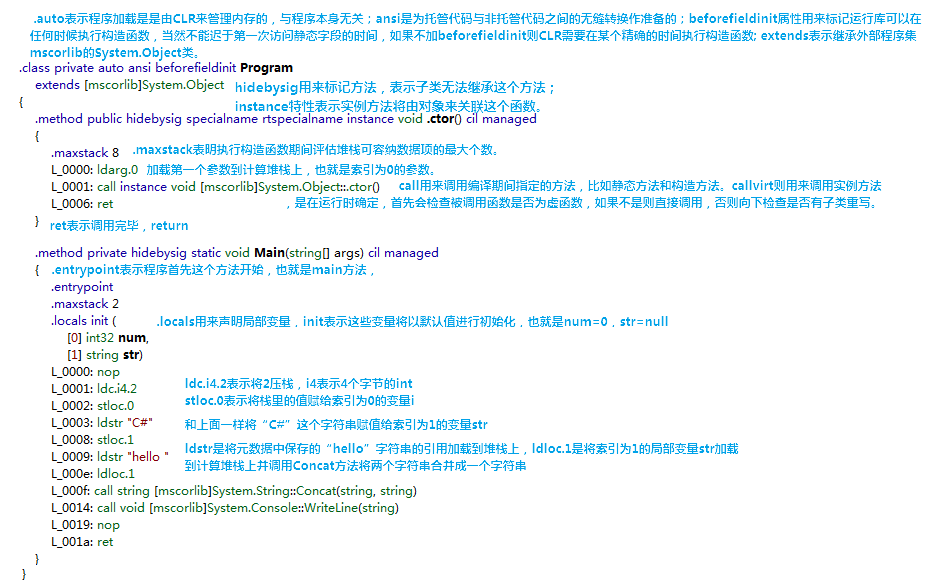
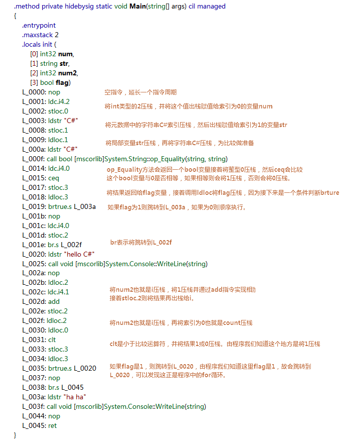
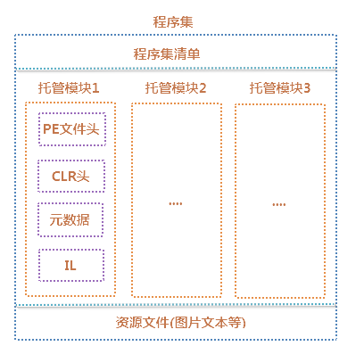
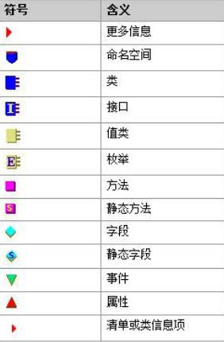
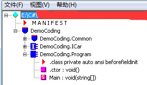

<!--toc-->
[TOC]
# IL


[Microsoft .net IL 汇编语言程序设计指南](../files/dotnet/Microsoft-net-IL-汇编语言程序设计指南.chm)

[汇编语言入门教程：汇编语言程序设计指南（精讲版）](http://c.biancheng.net/asm/)

## IL Linker
ASP.NET Core Blazor 链接器
https://docs.microsoft.com/zh-cn/aspnet/core/host-and-deploy/blazor/configure-linker?view=aspnetcore-3.1

https://github.com/mono/linker
https://github.com/dotnet/core/blob/master/samples/linker-instructions.md
https://www.cnblogs.com/linezero/p/7477233.html
https://github.com/dotnet/core/blob/master/samples/linker-instructions-advanced.md

IL链接程序扫描应用程序的IL，以检测实际需要哪些代码，并修剪未使用的框架库。 这可以大大减小某些应用程序的大小。 通常，像工具这样的小型控制台应用程序受益最大，因为它们倾向于使用框架的较小子集，并且通常更易于调整。 使用反射的应用程序可能无法与此方法一起使用。

默认情况下，链接器将以保守的模式运行，该模式将保留所有不属于框架的托管程序集（它们保持完整，并且链接器仅复制它们）。 这意味着对非框架代码的任何反射调用都应继续起作用。 如果删除了调用目标，则对框架中代码的反射调用可能会中断。 任何预计不会在运行时使用的框架程序集都将从发布输出中删除。 用过的框架组件将完全保留。

在.NET Core 3.0中，此软件包与SDK一起提供。

## IL基础
### 实例解析IL
```csharp
class Program
    {
        static void Main(string[] args)
        {
            int i = 2;
            string str= "C#";
            Console.WriteLine("hello "+str);
        }
    }
```


接下来要明确一个概念，**.NET运行时任何有意义的操作都是在堆栈上完成的，而不是直接操作寄存器**。这就为.NET跨平台打下了基础，通过设计不同的编译器编译相同的IL代码来实现跨平台。对于堆栈我们的操作无非就是压栈和出栈，在IL中压栈通常以ld开头，出栈则以st开头。知道这个后再看上面的指令感觉一下子就豁然开朗了，接下来继续学习的步伐，下面的表格是对于一些常见ld指令。st指令则是将ld指令换成st，功能有压栈变为出栈，有时候会看到在st或ld后加.s这表示只取一个字节。再来看看流程控制，知道压出栈和流程控制后，基本上看出IL的大概意思那就冒闷踢啦。流程控制主要就是循环和分支，下面我写了个有循环和分支的小程序。其中我们用到了加法和比较运算，为此得在这里介绍最基本的三种运算：算术运算(add、sub、mul乘法、div、rem求余)；比较运算(cgt大于、clt小于、ceq等于)；位运算(not、and、or、xor异或、左移shl、右移shr)。要注意在比较运算中，当执行完指令后会直接将结果1或0压栈，这个过程是自动完成的。对于流程控制，主要是br、brture和brfalse这3条指令，其中br是直接进行跳转，brture和brture则是进行判断再进行跳转。

指令 | 含义
---|---
ldarg	|加载成员的参数，如上面的ldarg.0
ldarga	|装载参数的地址，注意一般加个a表示取地址
ldc	|将数字常量压栈，如上面的ldc.i4.2
ldstr	|将字符串的引用压栈
ldloc/ldloca	|ldloc将一个局部变量压栈，加a表示将这个局部变量的地址压栈
Ldelem	|表示将数组元素压栈
ldlen	|将数组长度压栈
ldind	|将地址压栈，以地址来访问或操作数据内

```csharp
class Program
    {
        static void Main(string[] args)
        {
            int count = 2;
            string strName= "C#";
            if (strName == "C#")
            {
                for(int i=0;i<count;i++)
                    Console.WriteLine("hello C#");
            }
            else
                Console.WriteLine("ha ha");
        }
    }
```


### 面向对象的IL
有了前面的基础后，基本上看一般的IL代码不会那么方了。如果我们在程序中声明一个类并创建对象，则在IL中可以看到newobj、class、instance、static等关键字。看IL指令会发现外部是类，类里面有方法，虽然方法里面是指令不过这和C#代码的结构是很相似的。从上面的这些现象可以很明显的感受到IL并不是简单的指令，它是面向对象的。当我们在C#中使用new创建一个对象时则在IL中对应的是newobj，另外还有值类型也是可以通过new来创建的,不过在IL中它对应的则是initobj。newobj用来创建一个对象，首先会分配这个对象所需的内存，接着初始化对象附加成员同步索引块和类型对象指针然后再执行构造函数进行初始化并返回对象引用。initobj则是完成栈上已经分配好的内存的初始化工作，将值类型置0引用类型置null即可。另外string是引用类型，从上面的例子可以看到一般是使用ldstr来将元数据中的字符串引用加载到栈中而不是newobj。但是如果在代码中创建string变量不是直接赋值而是使用new关键字来得到string对象，那么在IL中将会看到newobj指令。当创建一维零基数组时还会看到newarr指令，它会创建数组并将首地址压栈。不过如果数组不是一维零基数组的话仍将还是会看到我们熟悉的newobj。

　　既然是面向对象的，那么继承中的虚方法或抽象方法在IL中肯定会有相应的指令去完成方法的调用。调用方法主要是call、callvirt、calli，call主要用来调用静态方法，callvirt则用来调用普通方法和需要运行时绑定的方法(也就是用instance标记的实例方法)，calli是通过函数指针来进行调用的。不过也存在特殊情况，那就是call去调用虚方法，比如在密封类中的虚方法因为一定不可能会被重写因此使用call可提高性能。为什么会提高性能呢？不知道你是否还记得创建一个对象去调用这个对象的方法时，我们经常会判断这个对象是否为null，如果这个对象为null时去调用方法则会报错。之所以出现这种情况是因为callvirt在调用方法时会进行类型检测，此外判断是否有子类方法覆盖的情况从而动态绑定方法，而采用call则直接去调用了。另外当调用基类的虚方法时，比如调用object.ToString方法就是采用call方法，如果采用callvirt的话因为有可能要查看子类(一直查看到最后一个继承父类的子类)是否有重写方法，从而降低了性能。不过说到底call用来调用静态方法，而callvirt调用与对象关联的动态方法的核心思想是可以肯定的，那些采用call的特殊情况都是因为在这种情况下根本不需要动态绑定方法而是可以直接使用的。calli的意思就是拿到一个指向函数的引用，通过这个引用去调用函数。

### IL的角色

大家都知道C#代码编译后就会生成元数据和IL，可是我们常见的exe这样的程序集是如何生成的呢，它与IL是什么关系呢？首先有一点是可以肯定的，那就是程序集中肯定会包含元数据和IL，因为这2样东西是程序集中的核心。下面是一个描述程序集和内部组成图，从图中可以看出一个程序集是有多个托管模块组成的，一个模块可以理解为一个类或者多个类一起编译后生成的程序集。程序集清单指的是描述程序集的相关信息，PE文件头描述PE文件的文件类型、创建时间等。CLR头描述CLR版本、CPU信息等，它告诉系统这是一个.NET程序集。然后最主要的就是每个托管模块中的元数据和IL了。元数据用来描述类、方法、参数、属性等数据，.NET中每个模块包含44个元数据表，主要包括定义表、引用表、指针表和堆。定义表包括类定义表、方法表等，引用表描述引用到类型或方法之间的映射记录，指针表里存放着方法指针、参数指针等。可以看到元数据表就相当于一个数据库，多张表之间有类似于主外键之间的关系。

由前面的知识可以总结出IL是独立于CPU且面向对象的指令集。.NET平台将其之上的语言全都编译成符合CLS(公共语言规范)的IL指令集，接着再由不同的编译器翻译成本地代码，比如我们常见的JIT编译器，如果在Mac上运行C#可通过Mac上的特定编译器来将IL翻译成Mac系统能够执行的机器码。也就是说IL正如它的名字一样是作为一种中间语言来执行动态程序，比如我们调用一个方法表中的方法，这个方法会指向一个触发JIT编译器地址和方法对应的IL地址，于是JIT编译器便将这个方法指向的IL编译成本地代码。生成本地代码后这个方法将会有一条引用指向本地代码首地址，这样下次调用这个方法的时候将直接执行指向的本地代码。


## IL DASM
// C:\Program Files (x86)\Microsoft SDKs\Windows\v10.0A\bin\NETFX 4.8 Tools\x64\ildasm.exe

图标含义


使用IL反编译出项目代码


MANIFEST：是一个附加信息列表，主要包含程序集的一些属性，如程序集名称、版本号、哈希算法等；
Democodeing：项目名称
Democodeing.Common：命名空间
Democodeing.ICar:接口
Democodeing.Program:类，主要查看存类下面的内容。

.class 类信息项代码：
```IL
.class private auto ansi beforefieldinit DemoCoding.Program
       extends [mscorlib]System.Object
{
} // end of class DemoCoding.Program
```

1）.class，表示Program是一个类。并且它继承自程序集—mscorlib的System.Object类；
2）private，表示访问权限；
3）auto，表示程序的内存加载全部由CLR来控制；
4）ansi，是为了在没有托管代码与托管代码之间实现无缝转换。这里主要指C、C++代码等；
5）beforefieldinit，是用来标记运行库（CLR）可以在静态字段方法生成后的任意时刻，来加载构造器（构造函数）;

.ctor 方法代码：
```IL
method public hidebysig specialname rtspecialname 
        instance void  .ctor() cil managed
{
  // 代码大小       7 (0x7)
  .maxstack  8
  IL_0000:  ldarg.0
  IL_0001:  call       instance void [mscorlib]System.Object::.ctor()
  IL_0006:  ret
} // end of method Program::.ctor
```
1）cil managed:表示其中为IL代码，指示编译器编译为托管代码；
2）.maxstack:表示调用构造函数.otor期间的评估堆栈(Evaluation Stack) ;
3)  IL_0000:标记代码行开头；
4）ldarg.0:表示转载第一个成员参数，在实例方法中指的是当前实例的引用；
5）call：call一般用于调用静态方法，因为静态方法是在编译期就确定的。而这里的构造函数.otor()也是在编译期就制定的。而另一指令callvirt则表示调用实例方法， 它是在运行时确定的，因为如前述，当调用方法的继承关系时，就要比较基类与派生类的同名函数的实现方法（virtual和new），以确定调用的函数所属的Method Table；
6）ret：表示执行完毕，返回；

Main() 静态方法代码：

```IL
.method private hidebysig static void  Main(string[] args) cil managed
{
  .entrypoint
  // 代码大小       19 (0x13)
  .maxstack  8
  IL_0000:  nop
  IL_0001:  ldstr      "Hello World"
  IL_0006:  call       void [mscorlib]System.Console::WriteLine(string)
  IL_000b:  nop
  IL_000c:  call       string [mscorlib]System.Console::ReadLine()
  IL_0011:  pop
  IL_0012:  ret
} // end of method Program::Main
```

1） hidebysig：表示当把此类作为基类，存在派生类时，此方法不被继承，同上构造函数；
2）.entrypoint：指令表示CLR加载程序时，是首先从.entrypoint开始的，即从Main方法作为程序的入口函数；
3）nop：为空该指令，主要给外部设备或者指令间隙准备时间；
4）ldstr：创建String对象变量"Hello World." ；
5）pop：取出栈顶的值。当我们不需要把值存入变量时使用；

### 使用IL DASM 修改EXE程序代码
1. 打开IL工具,选择所要修改的EXE程序。
2. 文件-->转储。确定后选择另存路径,会生成二个文件：*.il 和 *.res
3. 用记事本打开*.il修改里面的内容：
4. 把修改后的代码编译成EXE程序。
```
ilasm /exe /output=C:\CK.exe /Resource=C:\Users\Ck\Desktop\coding.res C:\Users\Ck\Desktop\coding.il
```