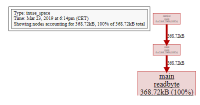
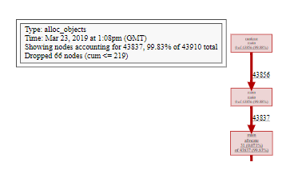
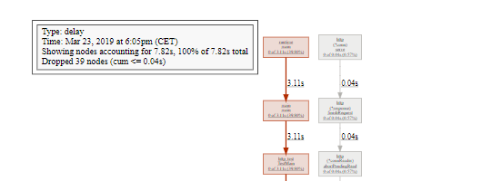

[TOC]

High Performance Go Workshop（Part3）
===================================

### 3\. 性能评估和分析

  

在上一节中，我们研究了对单个函数进行基准测试，这对你提前知道瓶颈在哪里很有用。但是，通常你会怀疑人生：

  

> 为什么该程序需要这么长时间才能运行？

  

分析整个程序，这对于回答诸如此类的高级问题很有用。在本部分中，我们将使用Go内置的性能分析工具从内部调查程序的运行情况。

  

  

### 3.1. pprof

  

今天我们要谈论的第一个工具是 pprof。 [pprof](https://github.com/google/pprof) 源自 [Google Perf Tools](https://github.com/gperftools/gperftools) 工具套件，自最早的公开发布以来就已集成到Go runtime中。

  

`pprof` 包含两个部分：

  

*   每个 Go 程序都内置了 runtime/pprof 包

  

*   go tool pprof 检查配置文件。

  

### 3.2. 配置文件类型

  

pprof 支持多种类型的分析，今天我们将讨论其中的三种：

  

  

*   CPU 性能分析  
    

  

*   内存性能分析

  

*   阻塞性能分析  
    

  

*   互斥性能分析

  

#### 3.2.1. CPU 性能分析

  

CPU 性能分析是最常见的性能分析，也是最明显的。

  

启用 CPU 性能分析后，运行时将每 10 毫秒中断一次，并记录当前正在运行的 goroutine 的堆栈跟踪。

  

分析完成后，我们可以对其进行分析，以确定最需要分析的代码模块。

  

函数在性能分析中出现的次数越多，代码模块占总运行时百分比的时间就越多。

  

  

#### 3.2.2. 内存性能分析

  

内存分析记录在堆分配时记录堆栈跟踪。

  

假定堆栈分配是空闲的，并且在内存分析文件中未跟踪。

  

内存分析，和 CPU 分析一样也是基于样本的，每 1000 个分配中的内存分析样本为1。这个比率可以改变。

  

因为内存分析是基于样本的，因为它跟踪不使用的分配，所以使用内存分析来确定应用程序的总内存使用是困难的。

  

_个人观点_：我不认为内存分析有助于发现内存泄漏。有更好的方法来确定你的应用程序使用了多少内存。稍后我们将在 PPT 中讨论这些问题。

  

#### 3.2.3. 阻塞分析

  

阻塞分析在 Go 中是非常独特的。

  

阻塞分析和 CPU 分析很像，但它记录 goroutine 花在等待共享资源上的时间。

  

这对于确定应用程序中的并发瓶颈可能是有用的。

  

阻塞分析可以显示大量 goroutine 何时可以取得结果，阻塞。阻塞包括：

  

*   在未缓冲信道上发送或接收。

  

*   发送数据到一个满了的信道，从一个空的信道接收数据。

  

*   试图给另一个 goroutine 锁住的 sync.mutex 的上锁。

  

阻塞分析是一种非常专业的工具，在你确信已经消除了所有 CPU 和内存使用瓶颈之前，不应该使用它。

  

#### 3.2.4. 互斥性能分析

  

互斥锁分析与阻塞分析类似，但只专门针对导致互斥锁争用导致延迟的操作上。

  

我对这种类型的分析没有很多经验，但是我搞了个 PPT 来演示它。我们将很快看到该示例。

  

  

  

### 3.3. 一次只有一个分析

  

性能分析不是免费的。

  

分析对程序性能有一定的影响，特别是如果增加分析的采样率。

  

大多数工具不会阻止你同时启用多个分析。

  

> 一次不要启用多次分析。
> 
>   
> 
> 如果你同时启用多个分析，他们将观察自己的相互作用并抛出你的结果。

  

### 3.4. 收集分析
 

Go 运行时的分析接口存在于 runtime/pprof 包中。runtime/pprof 是非常低级别的工具，由于历史原因，不同类型的分析的接口不统一。

  

正如我们在上一节中看到的，pprof profiling 是在 `testing`包中构建的，但有时它不方便，或者很难，将要分析的代码放在 testing.B 基准测试的上下文中，必须直接使用运行runtime/pprof API。

  

几年前，我编写了一个 [small package][0]，以便更容易地对现有应用程序进行分析。

  
```golang
import "github.com/pkg/profile" 
func main() {  
    defer profile.Start().Stop() 
    // ... 
}
```

  

在本节中，我们将使用 profile 包。晚些时候，我们将直接使用 runtime/pprof 接口。

  

### 3.5. 使用 pprof 分析

  

既然我们已经讨论了 pprof 可以测试些什么，以及如何生成分析报告，那么让我们讨论一下如何使用 pprof 来分析报告。

  

分析由 go pprof 命令驱动

  
```
go tool pprof /path/to/your/profile
```
  

该工具提供了分析数据的几种不同表现形式：文本、图形、甚至火焰图。

  

> 如果你使用 Go 已有一段时间，可能知道 `pprof`有两个参数。从 Go 1.9 开始，分析包含渲染配置文件所需的所有信息。你不再需要生成分析的二进制文件。 🎉

  

#### 3.5.1. 进一步阅读

                   

*   [Profiling Go programs](http://blog.golang.org/profiling-go-programs)(Go Blog)  
    
*   [Debugging performance issues in Go programs](https://software.intel.com/en-us/blogs/2014/05/10/debugging-performance-issues-in-go-programs)

  

#### 3.5.2. CPU 分析 （实践）

  

让我们编写一个计算单词数的程序：

  
```golang
package main 
import (  
    "fmt" 
    "io" 
    "log" 
    "os" 
    "unicode" 
    "github.com/pkg/profile" 
)   
func readbyte(r io.Reader) (rune, error) {  
    var buf [1]byte 
    _, err := r.Read(buf\[:\]) 
    return rune(buf\[0\]), err 
}   
func main() {  
    defer profile.Start().Stop()  
    f, err := os.Open(os.Args[1]) 
    if err != nil { 
        log.Fatalf("could not open file %q: %v", os.Args\[1\], err) 
    }  
    words := 0 
    inword := false  
    for { 
        r, err := readbyte(f) 
        if err == io.EOF { 
            break 
        } 
        if err != nil { 
            log.Fatalf("could not read file %q: %v", os.Args[1], err) 
        } 
        if unicode.IsSpace(r) && inword { 
            words++ 
            inword = false 
        } 
        inword = unicode.IsLetter(r) 
    } 
    fmt.Printf("%q: %d words\n", os.Args[1], words) 
}
```
  

让我们看看 Herman Melville 的经典  [Moby Dick](https://www.gutenberg.org/ebooks/2701)

  
```
% go build && time ./words moby.txt 
"moby.txt": 181275 words   
real    0m2.110s 
user    0m1.264s 
sys     0m0.944s
```
  

  

让我们将其与 unix 的 wc -w 进行比较

  
```
% time wc -w moby.txt 
215829 moby.txt   
real    0m0.012s 
user    0m0.009s 
sys     0m0.002s
```
  

  

结果是不一样的。wc 大约高出 19%，因为它所考虑的单词与我的简单程序所做的不同。这并不重要——两个程序都将整个文件作为输入，并在一次传递中计算从单词到非单词的转换次数。

  

让我们研究为什么使用 pprof  这些程序有不同的运行时间。

  

#### 3.5.3.  添加CPU分析

  

首先，编辑 main.go 并启用分析

  
```golang
import (  
    "github.com/pkg/profile" 
)   
func main() {  
    defer profile.Start().Stop() 
    // ...
```
  

现在，当我们运行程序时，将创建一个 cpu.pprof 文件

  
```
% go run main.go moby.txt 
2018/08/25 14:09:01 profile: cpu profiling enabled, /var/folders/by/3gf34\_z95zg05cyj744\_vhx40000gn/T/profile239941020/cpu.pprof 
"moby.txt": 181275 words 
2018/08/25 14:09:03 profile: cpu profiling disabled, /var/folders/by/3gf34\_z95zg05cyj744\_vhx40000gn/T/profile239941020/cpu.pprof
```
  

  

现在我们有了分析文件，可以使用 go tool pprof 去分析

  
```
% go tool pprof /var/folders/by/3gf34\_z95zg05cyj744\_vhx40000gn/T/profile239941020/cpu.pprof 
Type: cpu 
Time: Aug 25, 2018 at 2:09pm (AEST) 
Duration: 2.05s, Total samples = 1.36s (66.29%) 
Entering interactive mode (type "help" for commands, "o" for options) 
(pprof) top 
Showing nodes accounting for 1.42s, 100% of 1.42s total  
flat  flat%   sum%        cum   cum% 
1.41s 99.30% 99.30%      1.41s 99.30%  syscall.Syscall 
0.01s   0.7%   100%      1.42s   100%  main.readbyte 
0     0%   100%      1.41s 99.30%  internal/poll.(*FD).Read 
0     0%   100%      1.42s   100%  main.main 
0     0%   100%      1.41s 99.30%  os.(*File).Read 
0     0%   100%      1.41s 99.30%  os.(*File).read 
0     0%   100%      1.42s   100%  runtime.main 
0     0%   100%      1.41s 99.30%  syscall.Read 
0     0%   100%      1.41s 99.30%  syscall.read
```
  

  

`top` 命令是你将使用最多的命令。我们可以看到，此程序在 syscall.Syscall 上花费的时间有 99%。以及一小部分时间花在 main.readbyte 。

  

我们还可以使用 `web`命令可视化此调用。这将从配置文件数据生成定向图形。图像引擎使用来自 Graphviz 的 `dot`命令。

  

但是，在 Go 1.10（可能是 1.11）中，Go 附带了本地支持 http 服务器的 pprof 版本。

  
```
% go tool pprof -http=:8080 /var/folders/by/3gf34\_z95zg05cyj744\_vhx40000gn/T/profile239941020/cpu.pprof
```
  

将打开网络浏览器；

  

*   图形模式

  

*   火焰图模式

  

在图中，CPU 开销最大的方框是 sys call.Syscall，占程序中花费的总时间的 99.3%。导致 syscall.Syscall 的一串字符串代表了直接调用方-----如果多个代码路径在同一个函数上收敛，则可以不止一个。箭头的大小表示在一个方框中的子节点花了多少时间，我们看到从 main.readbyte 开始，它们占图臂中 1.41 秒，所花费的时间近 0。

  

_问题_：有人能猜到为什么我们的版本比 wc 慢得多吗？

  

#### 3.5.4. 改进我们的版本

  

我们的程序之所以慢不是因为 Go 的 syscall.Syscall 慢。这是因为 syscalls 一般都是开销很大的操作（而且随着 Spectre 家族越来越多的漏洞被发现，开销成本也越来越高）。

  

每次调用 `readbyte`都会导致 syscall.Read，缓冲区大小为1。所以程序执行的系统调用的数量等于输入的大小。我们可以看到在 pprof图中，读取输入的内容占主导地位。

  
```golang
func main() {  
    defer profile.Start(profile.MemProfile, profile.MemProfileRate(1)).Stop() 
    // defer profile.Start(profile.MemProfile).Stop()  
    f, err := os.Open(os.Args[1]) 
    if err != nil { 
        log.Fatalf("could not open file %q: %v", os.Args[1], err)
    }  
    b := bufio.NewReader(f) 
    words := 0 
    inword := false 
    for { 
        r, err := readbyte(b) 
        if err == io.EOF { break } 
        if err != nil { 
            log.Fatalf("could not read file %q: %v", os.Args[1], err) 
         } 
        if unicode.IsSpace(r) && inword { 
            words++ 
            inword = false 
        } 
        inword = unicode.IsLetter(r) 
    } 
    fmt.Printf("%q: %d words\n", os.Args[1], words) 
}
```
  

  

通过在输入文件和 `readbyte` 之间插入 bufio.Reader  

  

将修改后程序的时间与 wc 进行比较看看相差多远？ 来个性能测试，看看还有什么。

  

#### 3.5.5. 内存分析

  

新 `words`  性能分析表明，在 `readbyte`函数内分配了某些内容。我们可以用 pprof 来调查。

  
```
defer profile.Start(profile.MemProfile).Stop()
```
  

然后照常运行程序

  
```
% go run main2.go moby.txt 
2018/08/25 14:41:15 profile: memory profiling enabled (rate 4096), /var/folders/by/3gf34\_z95zg05cyj744\_vhx40000gn/T/profile312088211/mem.pprof 
"moby.txt": 181275 words 
2018/08/25 14:41:15 profile: memory profiling disabled, /var/folders/by/3gf34\_z95zg05cyj744\_vhx40000gn/T/profile312088211/mem.pprof
```

  

  

  

  

正如我们怀疑分配来自 `readbyte` - 这不是那么复杂，readbyte 是三行长：

  

使用 pprof 确定分配来自何处。

  
```golang
func readbyte(r io.Reader) (rune, error) {  
    var buf [1]byte 
    _, err := r.Read(buf[:]) 
    return rune(buf[0]), err 
}
```
  

  

1.  分配在第2行

  

我们将在下一节中更详细地讨论为什么会发生这种情况，但目前我们看到的每个对readbyte 的调用都是分配一个新的1字节长数组，并且该数组在堆上分配。

  

我们可以用什么方法避免这种情况？请尝试使用它们并使用 CPU 和内存分析来证明这一点。

  

##### Alloc objects vs. inuse objects

  

内存配置文件分为两种， go tool pprof 为命令行命令

  

  

*   `-alloc_objects` 报告进行每个分配的调用站点。
*   `-inuse_objects` 报告在分析末尾可到达的呼叫站点，如果可以进行分配。

  

为了演示这一点，这里有一个人为程序，它将以控制的方式分配一堆内存。

  
```golang
const count = 100000   
var y []byte   
func main() {  
    defer profile.Start(profile.MemProfile, profile.MemProfileRate(1)).Stop() 
    y = allocate() 
    runtime.GC() 
}   
// allocate allocates count byte slices and returns the first slice allocated. 
func allocate() []byte {  
    var x [][]byte 
    for i := 0; i < count; i++ { 
        x = append(x, makeByteSlice()) 
    } 
    return x[0] 
}   
// makeByteSlice returns a byte slice of a random length in the range \[0, 16384). 
func makeByteSlice() []byte {  
    return make([]byte, rand.Intn(2^14)) 
}
```
  

  

该程序是使用 `profile`包进行注释，我们将内存分析速率设置为 1，即记录每个分配的堆栈跟踪。这会减慢程序的速度，但你一分钟后就会明白原因。

  
```
% go run main.go 
2018/08/25 15:22:05 profile: memory profiling enabled (rate 1), /var/folders/by/3gf34\_z95zg05cyj744\_vhx40000gn/T/profile730812803/mem.pprof 
2018/08/25 15:22:05 profile: memory profiling disabled, /var/folders/by/3gf34\_z95zg05cyj744\_vhx40000gn/T/profile730812803/mem.pprof
```
  

让我们看一下已分配对象的图，这是默认值，并显示导致在分析期间分配每个对象的调用图。

  
```
% go tool pprof -http=:8080 /var/folders/by/3gf34\_z95zg05cyj744\_vhx40000gn/T/profile891268605/mem.pprof
```
  

  

  

  

毫不奇怪，超过99%的分配是在 makeByteSlice。现在，让我们使用 -inuse_objects 查看同一分析。

  
```
% go tool pprof -http=:8080 /var/folders/by/3gf34\_z95zg05cyj744\_vhx40000gn/T/profile891268605/mem.pprof
```
  

  

  

  

我们看到的不是在分析期间分配的对象，而是在采用分析时仍在使用的对象 ， 这忽略垃圾回收器回收的对象的堆栈跟踪。

  

  

#### 3.5.6. 阻塞分析

  

我们将查看的最后一个分析类型是阻塞分析。我们将使用来自 net/http 包的`ClientServer`基准。

  
```
% go test -run=XXX -bench=ClientServer$ -blockprofile=/tmp/block.p net/http 
% go tool pprof -http=:8080 /tmp/block.p
```
  

  

  

#### 3.5.7. 线程创建分析

  

Go 1.11 添加了对分析操作系统线程创建的支持。

  

向 `godoc`添加线程创建分析，并观察分析 godoc -http=:8080 -index  的结果。

  

  

#### 3.5.8. 帧指针

  

Go 1.7 已经发布，并且与 amd64 的新编译器一起发布的，编译器现在默认启用帧指针。

  

帧指针是始终指向当前堆栈帧顶部的寄存器。

  

帧指针使诸如 gdb(1) 和 perf(1)  等工具能够理解 Go 调用堆栈。

  

在本研讨会中，我们不会介绍这些工具，但你可以阅读和观看我关于介绍 Go 程序的七种不同方式的演示。

  

*   [Seven ways to profile a Go program](https://talks.godoc.org/github.com/davecheney/presentations/seven.slide)(slides)

  

*   [Seven ways to profile a Go program](https://www.youtube.com/watch?v=2h_NFBFrciI)(video, 30 mins)

  

*   [Seven ways to profile a Go program](https://www.bigmarker.com/remote-meetup-go/Seven-ways-to-profile-a-Go-program) (webcast, 60 mins)

  

  

#### 3.5.9. 练习

  

*   从你非常了解的代码段生成分析文件。如果没有代码示例，请尝试分析 `godoc`.

  
```
% go get golang.org/x/tools/cmd/godoc 
% cd $GOPATH/src/golang.org/x/tools/cmd/godoc
 % vim main.go
```
  

*   如果要在一台机器上生成分析文件并在另一台计算机上检查分析文件，你将如何操作？

 