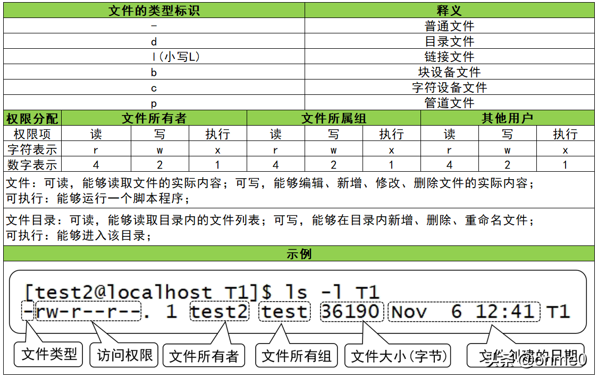

# Linux 之文件系统



`chmod +0`相当于没变化。
`chmod 0`那么就没人能访问这个文件（但root除外）。
## 一、文件系统特性

磁盘分区后还要进行格式化，操作系统才能使用这个文件系统。每个操作系统能识别和使用的文件系统不完全相同，如 Windows98 以前支持 FAT，Windows2000 后支持 NTFS。Linux 传统的操作系统是 ext2(Linux second Extended file system,ext2fs)。以前一个分区只能格式化为一个文件系统，而一些新的技术可以将一个分区格式化为多个文件系统（如 LVM 逻辑卷）。

较新的操作系统的文件会保存文件权限、文件所有者等信息，这些信息存放在 inode，实际的文件数据保存到数据区块。 另外有一个超级区块记录整个文件系统的整体信息，包括 inode 与数据区块的总量、使用量、剩余量等。

## 文件描述符
1、文件描述符
Linux系统预留可三个文件描述符：0、1和2，他们的意义如下所示：
0——标准输入（stdin）
1——标准输出（stdout）
2——标准错误（stderr）

fd0，fd1，fd2指向的文件默认情况下分别是/dev/stdin、/dev/stdout和/dev/stderr，这才是真正的标准输入，标准输出，错误输出

1. 重定向标准输出stdout, 123.txt文件存在
```
ls 123.txt 1> stdout.txt
```

2. 重定向标准错误stderr, 456.txt文件不存在
```
ls 456.txt 2> stderr.txt
```

3. 可以将stderr单独定向到一个文件，stdout重定向到另一个文件
```
cmd 2> stderr.txt 1>stdout.txt
```

4. 将错误重定向到标准输出, 然后标准输出到/dev/null(丢弃标准输出), 也就是所有的输出到/dev/null
```
ps aux | grep "xx"  2>&1 1>/dev/null
```

> /dev/null 伪设备，回收站.写该文件不会产生IO
> /dev/zero 伪设备，会产生空字符流，对它不会产生IO


- Linux中获取已后台运行进程的输出
`strace -p {pid} -ewrite`
这个命令可以将程序的输出打印出来，当然它输出了所有IO，为了过滤，可以这样：
`strace -p {pid} -ewrite | grep 'write(1,'`
这样就可以只过滤标准输出了，当然，并不完美，因为strace只是输出了一部分，如果文字比较多，它会截断

- 日志输出到文件
``./a.out > a.log`
或者使用tee同时将输出写入文件和标准输出：
`./a.out | tee a.log`
（末尾追加）：
`./a.out | tee -a a.log`

- 一个`>`与两个`>`的区别
如果文件已存在，则清空并写入当前的日志信息
`ls > test.log`
如果文件已存在，则在末尾追加日志信息
`ls >> test.log`

## 二、常用的本地文件系统

### 传统的文件系统，不带日志

#### ext

第一代扩展文件系统，于 1992 年 4 月发表，是为 Linux 核心所做的第一个文件系统。采用 Unix 文件系统（UFS）的元数据结构，以克服 MINIX 文件系统性能不佳的问题。

#### ext2

第二代扩展文件系统，LINUX 内核所用的文件系统。它开始由 Rémy Card 设计，用以代替 ext，于 1993 年 1 月加入 linux 核心支持之中。ext2 的经典实现为 Linux 内核中的 ext2fs 文件系统驱动，最大可支持 2TB 的文件系统，至 Linux 核心 2.6 版时，扩展到可支持 32TB。

#### Minix

早期 Linux 支持的文件系统，性能低下，没有时间标记，文件名最长 14 个字符。只能使用 64M 硬盘分区。

#### Xia

Minix 修订的文件系统，解决文件名和支持的硬盘大小的问题。

#### Msdos

微软 dos、windows 和一些 OS/2 系统支持的文件系统，文件名格式是 8.3。

#### umsdos

Linux 兼容 Msdos 使用的文件系统，支持长文件名、权限、所有者设置。

#### ISO 9660

标准的 CD-ROM 文件系统。此标准有不同的说明级别，一级，文件必须是 8.3 格式（文件名不得多于 8 个字符，后缀名不得多于 3 个字符），并且都得是大写字母。目录也不得多于 8 个字符。在二级和三级中，文件名可以达到 32 个字符。

#### FAT16 FAT32

Windows 较早支持的文件系统，以前软盘也一般使用 FAT 格式。 FAT16 只支持 2G 磁盘空间，FAT32 增加了管理能力。

### 日志文件系统

文件系统发生变化时，把相关信息写入一个日志区域，再把变化写入主文件系统。当文件系统发生故障时，日志文件辅助实现一致性，可以较快恢复。

#### ext3

EXT3 是第三代扩展文件系统（英语：Third extended filesystem，缩写为 ext3），是一个日志文件系统，常用于 Linux 操作系统，完全兼容 ext2 文件系统。它提供了高可用性、数据完整性、提高了文件系统的速度，支持多日志模式。

#### ext4

是 ext3 文件系统的后继版本。ext4 是由 ext3 的维护者 Theodore Tso 领导的开发团队实现的，并引入到 Linux2.6.19 内核中。其与 ext3 兼容（可能指令将 ext3 在线升级到 ext4）、支持无限数量的子目录。

#### VFAT

VFAT 是“扩展文件分配表系统”的意思,它对 FAT16 文件系统进行扩展，并提供支持长文件名，文件名可长达 255 个字符，VFAT 仍保留有扩展名，而且支持文件日期和时间属性，为每个文件保留了文件创建日期/时间、文件最近被修改的日期/时间和文件最近被打开的日期/时间这三个日期/时间。linux 处理的时候把 fat/vfat/fat32 的文件系统统一用 VFAT 来表示。

#### XFS

XFS 最初是由 Silicon Graphics，Inc. 于 90 年代初开发的。SGI 原有文件系统（existing filesystem，EFS）有一些缺陷，SGI 因此设计一种全新的高性能 64 位文件系统，并于 1994 年随 IRIX 5.3 的发布。它至今仍作为 SGI 基于 IRIX 的产品（从工作站到超级计算机）的底层文件系统来使用。现在，XFS 也可以用于 Linux。

#### reiserfs

Linux 内核支持最久的日志文件系统之一，支持海量磁盘和磁盘阵列，开发团队大部分是在俄罗斯国内。2006 年其作者被抓，2008 年判处 25 年监禁，此系统随后丧失了竞争力。

#### Btrfs

Oracle 于 2007 年写成在开发的文件系统，用以取代 ext3，其改善 ext3 的限制，特别是单一文件大小的限制、总文件系统大小限制以及加入文件校验和特性。

#### JFS

IBM 贡献到 Linux 内核，提供了基于日志的字节级文件系统，该文件系统是为面向事务的高性能系统而开发的。JFS 能够在几秒或几 分钟内就把文件系统恢复到一致状态。JFS 能够保证数据在任何意外宕机的情况下，不会造成磁盘数据的丢失与损坏。

#### HPFS

高性能文件系统 （High Performance File System ，HPFS），HPFS 是微软的 LAN Manager 中的文件系统，同时也是 IBM 的 LAN Server 和 OS/2 产品。在 OS/2 中，它就是 HPFS，但是在 LAN Manager 和 LAN Server 产品中，它是 HPFS386，这是 HPFS 的改进版本。HPFS 提供了 DOS 文件系统中的文件分配表(FAT)所没有的长文件名和性能增强特性。另外，HPSF 还能访问较大的硬盘驱动器，提供更多的组织特性并改善了文件系统的安全特性。HPFS386 增加了对 HPFS 文件系统的 32 位访问，另外还增加了容错和安全性功能。

## 三、网络文件系统

#### NFS

NFS（Network File System）即网络文件系统，是 FreeBSD 支持的文件系统中的一种，它允许网络中的计算机之间通过 TCP/IP 网络共享资源。在 NFS 的应用中，本地 NFS 的客户端应用可以透明地读写位于远端 NFS 服务器上的文件，就像访问本地文件一样。

#### SMB

方便是 windows 和 Unix 系统之间共享文件的一种协议，主要用于 Windows 和 Linux 下的文件共享、打印共享，可以实现匿名与本地用户文件的共享、支持多节点挂载。

## 四、其它文件系统

#### Swap 文件系统

swap（交互分区）一起就是把硬盘的一部分空间拿来作为内存使用，即虚拟内存。Linux 上交换分区需要使用专门的文件系统，使用 mkswap 创建，命令选项：

- -c 检测坏块
- -f 强制创建 swap 分区
- -L 指定卷标
- -p 指定分页大小 不经常使用
- -u 指定 UUID

通过 swapon 启用新的 swap 文件系统。

#### proc

文件系统是一个虚拟文件系统，通过它可以使用一种新的方法在 Linux 内核空间和用户间之间进行通信。

#### 虚拟文件系统 VFS

Linux 文件系统的抽象层，向上提供了统一的文件访问接口，向下兼容了不同的文件系统，让 Linux 复杂的文件系统建立关联关系。

## 五、对文件系统操作的常用命令

### fdisk

创建和维护分区表。必要参数：

- -l 列出素所有分区表
- -u 与-l 搭配使用，显示分区数目

选择参数：

- -s<分区编号> 指定分区
- -v 版本信息

菜单操作说明

- m ：显示菜单和帮助信息
- a ：活动分区标记/引导分区
- d ：删除分区
- l ：显示分区类型
- n ：新建分区
- p ：显示分区信息
- q ：退出不保存
- t ：设置分区号
- v ：进行分区检查
- w ：保存修改
- x ：扩展应用，高级功能

### mkfs格式化 用于在特定的分区上建立 linux 文件系统

命令格式： mkfs [-V] [-t fstype] [fs-options] filesys [blocks]

参数 ：

- device ： 预备检查的硬盘分区，例如：/dev/sda1
- -V : 详细显示模式
- -t : 给定档案系统的型式，Linux 的预设值为 ext2
- -c : 在制作档案系统前，检查该partition 是否有坏道
- -l bad_blocks_file : 将有坏轨的block资料加到 bad_blocks_file 里面
- block : 给定 block 的大小

> 在 /dev/hda5 上建一个 msdos 的文件系统，同时检查是否有坏道存在，并且将过程详细列出来 :`mkfs -V -t msdos -c /dev/hda5`

### mount挂载命令 挂载Linux系统外的文件

命令格式：
```
mount [-hV]
mount -a [-fFnrsvw] [-t vfstype]
mount [-fnrsvw] [-o options [,...]] device | dir
mount [-fnrsvw] [-t vfstype] [-o options] device dir
```

参数说明：

- -V：显示程序版本
- -h：显示辅助信息
- -v：显示较讯息，通常和 -f 用来除错。
- -a：将 /etc/fstab 中定义的所有档案系统挂上。
- -F：这个命令通常和 -a 一起使用，它会为每一个 mount 的动作产生一个行程负责执行。在系统需要挂上大量 NFS 档案系统时可以加快挂上的动作。
- -f：通常用在除错的用途。它会使 mount 并不执行实际挂上的动作，而是模拟整个挂上的过程。通常会和 -v 一起使用。
- -n：一般而言，mount 在挂上后会在 /etc/mtab 中写入一笔资料。但在系统中没有可写入档案系统存在的情况下可以用这个选项取消这个动作。
- -s-r：等于 -o ro
- -w：等于 -o rw
- -L：将含有特定标签的硬盘分割挂上。
- -U：将档案分割序号为 的档案系统挂下。-L 和 -U 必须在/proc/partition 这种档案存在时才有意义。
- -t：指定档案系统的形态，通常不必指定。mount 会自动选择正确的型态。
- -o async：打开非同步模式，所有的档案读写动作都会用非同步模式执行。
- -o sync：在同步模式下执行。
- -o atime、-o noatime：当 atime 打开时，系统会在每次读取档案时更新档案的『上一次调用时间』。当我们使用 flash 档案系统时可能会选择把这个选项关闭以减少写入的次数。
- -o auto、-o noauto：打开/关闭自动挂上模式。
- -o defaults:使用预设的选项 rw, suid, dev, exec, auto, nouser, and async.
- -o dev、-o nodev-o exec、-o noexec允许执行档被执行。
- -o suid、-o nosuid：允许执行档在 root 权限下执行。
- -o user、-o nouser：使用者可以执行 mount/umount 的动作。
- -o remount：将一个已经挂下的档案系统重新用不同的方式挂上。例如原先是唯读的系统，现在用可读写的模式重新挂上。
- -o ro：用唯读模式挂上。
- -o rw：用可读写模式挂上。
- -o loop=：使用 loop 模式用来将一个档案当成硬盘分割挂上系统。

> 将 /dev/hda1 挂在 /mnt 之下:`mount /dev/hda1 /mnt`


### unmount 卸载
```
# umount -v /dev/sda1          通过设备名卸载  
/dev/sda1 umounted  
# umount -v /mnt/mymount/      通过挂载点卸载  
/tmp/diskboot.img umounted 
```