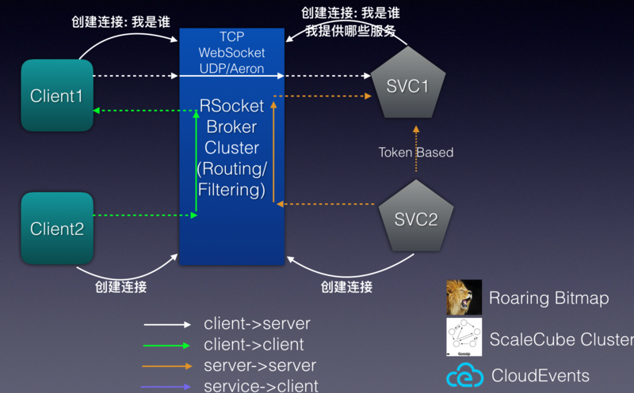

# RSocket

https://rsocket.io/
https://github.com/rsocket

## RSocket介绍0

RSocket RSocket是一个二进制的协议，以异步消息的方式提供4种对等的交互模型，以字节流的方式运行在TCP, WebSockets, Aeron等传输层之上。RSocket专门设计用于与Reactive风格应用配合使用，这些应用程序基本上是非阻塞的，并且通常（但不总是）与异步行为配对。它是传输无关的，支持 TCP、WebSocket和Aeron UDP协议，并支持无语义损失的混合传输协议——回压和流量控制仍然有效。
它还支持连接恢复。当你建立 RSocket 连接时，你可以指定前一个连接的 ID，如果流仍然在服务器的内存中，则你可以继续消费你的流。

- Netflix：RSocket同样诞生于微服务老祖Netflix，同样它家出品的微服务框架Spring现在已经集成了RSocket支持响应式的微服务编程

- Facebook：2017年上下开始在一些Facebook production案列中得到运用，今年开始了Thrit RPC和RSocket的集成工作。以后Facebook内部的Thrift会主要基于RSocket实现（于是Thrift也会支持streaming了）。

- 阿里巴巴：集成Dubbo RPC和RSocket，在IOT中运用RSocket Broker

- Netifi: 基于RSocket Broker做微服务的startup，（宣称基于RSocket broker的微服务架构比istio省钱10x）https://www.netifi.com/

- 其他：Pivotal, LightBend(原名Typesafe，Scala背后的公司)

[RSocket 基于消息传递的反应式应用层网络协议](https://zhuanlan.zhihu.com/p/100511637)

[Introduction to RSocket](https://www.baeldung.com/rsocket)

[从微服务治理的角度看RSocket、. Envoy和. Istio](https://my.oschina.net/yunqi/blog/3000351)

RSocket应用通过RSocket Broker联结而形成的Mesh
RSocket Service Mesh方案是通过一个中心化的Broker完成的
RSocket的主要障碍是应用程序之间必须要用RSocket通讯

关于RSocket Service Mesh的更多资料可以参考 The New Service Mesh with RSocket: https://www.netifi.com/solutions-servicemesh

[RSocket架构方案](http://rsocketbyexample.info/)

[Alibaba RSocket Broker](https://www.ctolib.com/alibaba-alibaba-rsocket-broker.html)

RSocket: http://rsocket.io/
RSocket Java SDK: https://github.com/rsocket/rsocket-java
Spring RSocket: https://docs.spring.io/spring/docs/current/spring-framework-reference/web-reactive.html#rsocket
Spring Boot RSocket Starter: https://docs.spring.io/spring-boot/docs/current/reference/htmlsingle/#boot-features-rsocket
Project Reactor: http://projectreactor.io/
Reactive Foundation: https://reactive.foundation/

## RSocket介绍1
RSocket 是一个 OSL 七层模型中 5/6 层的协议，是 TCP/IP(or UDP) 之上的应用层协议。RSocket 可以使用不同的底层传输层，包括 TCP、WebSocket 和 Aeron。RSocket 使用二进制格式，保证了传输的高效,它是一种基于Reactive Streams背压的双向，多路复用，基于消息的二进制协议.

RSocket 交互模式:
1. 请求-响应（request/response）
2. 请求-响应流（request/stream）
3. 发后不管（fire-and-forget）
4. 通道模式（channel）

## RSocket介绍2
传统的HTTP如果指的是HTTP/1.1，那么区别很大了。HTTP/1.1 连多路复用都不支持, 只有请求响应模式。等等等。如果指HTTP/2.0, 有区别但其实不算太大。

HTTP/2.0 虽然支持了链接复用，但仍然主要只支持request/response 模型。网上很多人说HTTP2支持stream，不对，HTTP2对用户来说没有stream这个概念。它只是通过multiplex实现高效的request/response。另外H2提供Server Push的功能，但是功能和应用场景很有限。相反RSocket 是一个真正的bi-directional。 当client 和server建立链接之后，就不存在谁请求谁的问题了。任何一方都可以是requester 或者responder。

不过需要说明，虽然HTTP/2.0 本身不支持bi-directional communication, 但是在此基础上加一些应用层的framing的话还是可以做到的。gRPC就是这么一个例子，在HTTP body 的基础上 做了gRPC 层的framing，最终还是达到了bi-directional 的作用。从这个角度来说，gRPC 和RSocket基本可以互相代替。Facebook内部使用的Thrift RPC之后也会主要以RSocket作为传输层协议，主要卖点之一就是可以支持streaming场景。

当然另外RSocket还有很多有意思的小功能， 比如基于credit的应用层flow control, 和RSocket level resumption。credit flow control，说白了就是requester 告诉responder，接下来你可以再给我n个item，多了不要，这样一方面防止requester积累太多buffer，一方面防止responder 过早执行一些没有必要的操作。 RSocket resumption就是假如说一个连接断了，在连接重新建立之后可以像什么事都没发生一样，之前在该connection上的所有stream继续正常工作。这个特性听起来很诱人，很适合在移动互联网和IOT场景使用，但是在实际操作中为了保持connection和stream的state machine，常常给服务器造成很大的内存压力。所以还是要根据具体场景判断适不适合用resumption

另外从传输层的角度，HTTP/2 就是基于TCP的，RSocket 没有规定底层传输层协议，所以可以玩很多花样，可以直接基于TCP，也可以像gRPC一样，基于HTTP/2 或者WebSocket。等QUIC和HTTP/3（H2 over QUIC)逐渐成熟，RSocket也会有基于QUIC的实现。（其实从特性上看，QUIC是最契合RSocket的底层协议）。（至于有人提到绕开内核，这是QUIC相比TCP的优势) 还有，RSocket不仅可以做点对点，也可以做multicast/broadcast 等其他pattern，因为它的核心理念是message passing。 HTTP应该不大好做。

网上还有些拿gRPC 和RSocket做性能比较的，但这俩没有太大比较的意义。真要比可以拿gRPC和RSocket-RPC去做比较，或者直接RSocket vs H2。我觉得大多数方面RSocket都强于HTTP2/gRPC，只是HTTP有那么多成熟的网络基础设施，而且无人不用，所以integration的确方便了很多罢了。

## 总结
1. Rsocket 是协议
2. 如果要用在web浏览器，需要websocket
3. http1.1 http2 http3(QUIC)  RSocket
4. 之前叫ReactiveSocket
4. RSocket 跟以下项目有一定的关系，或者说以下想都 实现、使用或遵循 RSocket
[Reactive Streams](http://www.reactive-streams.org/)
[Reactive Extensions](http://www.reactivex.io/)
[RxJava](https://github.com/ReactiveX/RxJava)
[RxJS](https://github.com/ReactiveX/RxJS)
[Reactive Manifesto](http://www.reactivemanifesto.org/)
所以 java开发可能会知道这个。

[抓包工具](https://github.com/rsocket/rsocket-wireshark)