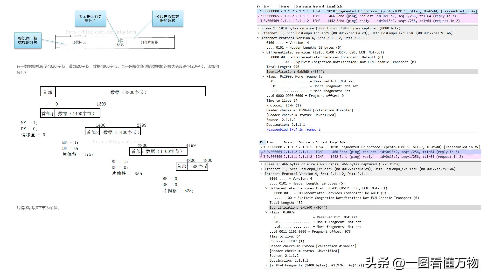
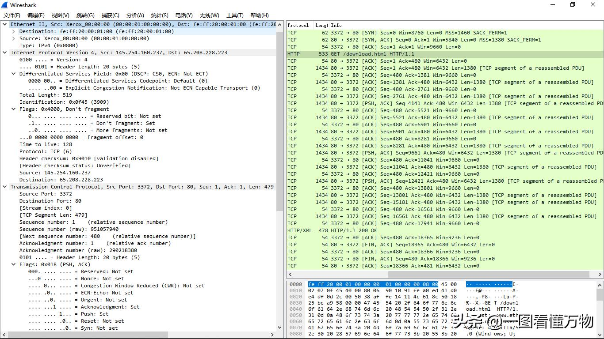

[TCP/IP协议详解（干货！）](https://blog.csdn.net/weixin_53186633/article/details/120514627)

[TCP/IP 协议](https://www.cnblogs.com/Liyuting/p/8805136.html)
[一篇文章带你熟悉 TCP/IP 协议（网络协议篇二）](https://juejin.im/post/5a069b6d51882509e5432656)
[通俗易懂-深入理解TCP协议（下）：RTT、滑动窗口、拥塞处理](http://www.52im.net/thread-515-1-1.html)
[tcp/ip 卷一 读书笔记（3）为什么既要有IP地址又要有MAC地址](https://www.cnblogs.com/zhangyufei/p/5565646.html)

[从tcpdump抓包看TCP/IP协议](https://segmentfault.com/a/1190000015044878)

[wireshark报文](https://wiki.wireshark.org/SampleCaptures)

[科来网络通讯协议图2019版](../files/tcp/科来网络通讯协议图2019版.pdf)


[接地气讲解TCP协议和网络程序设计（深度好文）](https://cloud.tencent.com/developer/article/1535959)

[接地气讲解UDP协议和网络程序设计（深度好文）](https://cloud.tencent.com/developer/article/1535962)

[3000字讲讲TCP协议，握手挥手不是你想的那么简单](https://www.toutiao.com/a6773950320000107016)

[TCP/IP、UDP、HTTP、MQTT、CoAP这五种物联网协议概述](https://www.toutiao.com/a6748413680527884813)


### OSI七层模型
七层模型，亦称OSI（Open System Interconnection）。参考模型是国际标准化组织（ISO）制定的一个用于计算机或通信系统间互联的标准体系，一般称为OSI参考模型或七层模型。

#### 1. 物理层
建立、维护、断开物理连接。（由底层网络定义协议）机械、电子、定时接口通信信道上的原始比特流传输TCP/IP 层级模型结构，应用层之间的协议通过逐级调用传输层（Transport layer）、网络层（Network Layer）和物理数据链路层（Physical Data Link）而可以实现应用层的应用程序通信互联。
#### 2. 数据链路层
建立逻辑连接、进行硬件地址寻址、差错校验 等功能。（由底层网络定义协议）将比特组合成字节进而组合成帧，用MAC地址访问介质，错误发现但不能纠正。物理寻址、同时将原始比特流转变为逻辑传输线路地址解析协议：ARP、PARP（反向地址转换协议）
#### 3. 网络层
进行逻辑地址寻址，实现不同网络之间的路径选择。控制子网的运行，如逻辑编址、分组传输、路由选择协议有：ICMP（互联网控制信息协议） IGMP（组管理协议） IP（IPV4 IPV6）（互联网协议）安全协议、路由协议（vrrp虚拟路由冗余）
#### 4. 传输层
定义传输数据的协议端口号，以及流控和差错校验。接受上一层数据，在必要的时候把数据进行切割，并将这些数据交给网络层，并保证这些数据段有效到达对端协议有：TCP UDP，数据包一旦离开网卡即进入网络传输层
#### 5. 会话层
建立、管理、终止会话。（在五层模型里面已经合并到了应用层）不同机器上的用户之间建立及管理会话对应主机进程，指本地主机与远程主机正在进行的会话安全协议：SSL（安全套接字层协议）、TLS（安全传输层协议）
#### 6. 表示层
数据的表示、安全、压缩。（在五层模型里面已经合并到了应用层）信息的语法语义以及他们的关联，如加密解密、转换翻译、压缩解压格式有，JPEG、ASCll、EBCDIC、加密格式等 [2]
如LPP（轻量级表示协议）
#### 7. 应用层
网络服务与最终用户的一个接口各种应用程序协议,协议有：HTTP(超文本传输协议) FTP（文本传输协议） TFTP（简单文件传输协议） SMTP（简单邮件传输协议） SNMP（简单网络管理协议） DNS（域名系统） TELNET（远程终端协议） HTTPS（超文本传输安全协议） POP3（邮局协议版本3 ） DHCP（动态主机配置协议）


### TCP/IP四层模型
TCP/IP（Transmission Control Protocol/Internet Protocol，传输控制协议/网际协议）是指能够在多个不同网络间实现信息传输的协议簇。TCP/IP协议不仅仅指的是TCP 和IP两个协议，而是指一个由FTP、SMTP、TCP、UDP、IP等协议构成的协议簇， 只是因为在TCP/IP协议中TCP协议和IP协议最具代表性，所以被称为TCP/IP协议






## KCP
TCP保证数据准确交付，UDP保证数据快速到达，KCP则是两种协议的一个折中。

KCP的设计目标是为了解决在网络拥堵的情况下TCP传输速度慢的问题。

KCP是一种网络传输协议(A Fast and Reliable ARQ Protocol)，可以视它为TCP的代替品，但是它运行于用户空间，它不管底层的发送与接收，只是个纯算法实现可靠传输，它的特点是牺牲带宽来降低延迟。

> KCP是一个快速可靠协议，能以比 TCP浪费10%-20%的带宽的代价，换取平均延迟降低 30%-40%，且最大延迟降低三倍的传输效果。纯算法实现，并不负责底层协议（如UDP）的收发，需要使用者自己定义下层数据的发送方式，以 callback的方式提供给 KCP。连时钟都需要外部传递进来，内部不会有任何一次系统调用。
TCP是为流量设计的（每秒内可以传输多少KB的数据），讲究的是充分利用带宽。而 KCP是为流速设计的（单个数据从一端发送到一端需要多少时间），以10%-20%带宽浪费的代价换取了比 TCP快30%-40%的传输速度。


## 调优

[有赞TCP网络编程最佳实践](https://tech.youzan.com/you-zan-tcpwang-luo-bian-cheng-zui-jia-shi-jian/)

### too many open files
查看单个进程能够打开最大的文件句柄数量`ulimit -n`, 表示单个进程同时最多只能维持 n 个网络 (例如 TCP) 连接。
1. 临时调整: `ulimit -HSn 1048576`
2. 永久性设置,修改配置文件 /etc/security/limits.conf:
```
sudo vim /etc/security/limits.conf

# 追加如下内容 (例如支持百万连接)
# 重启永久生效

# 单个进程可以打开的最大进程数量
#   表示可以针对不同用户配置不同的值
#   当然实际情况中，网络应用一般会独享整个主机/容器所有资源
# 调整文件描述符限制
# 注意: 实际生效时会以两者中的较小值为准 (所以最好的方法就是保持两个值相同)
* soft nofile 1048576
* hard nofile 1048576
root soft nofile 1048576
root hard nofile 1048576
```


```
$ sudo vim /etc/sysctl.conf

# 操作系统所有进程一共可以打开的文件数量
# 增加/修改以下内容
# 注意: 该设置只对非 root 用户进行限制, root 不受影响
fs.file-max = 16777216

# 进程级别可以打开的文件数量
# 或者可以设置为一个比 soft nofile 和 hard nofile 略大的值
fs.nr_open = 16777216
```
运行 `sysctl -p` 命令生效，重启之后仍然有效。
`cat /proc/sys/fs/file-nr`
`cat /proc/sys/fs/file-max`

/etc/sysctl.conf其它内核参数调优[/etc/sysctl.conf](../linux/etc/sysctl.conf)
```
# 设置系统的 TCP TIME_WAIT 数量，如果超过该值
# 不需要等待 2MSL，直接关闭
net.ipv4.tcp_max_tw_buckets = 1048576

# 将处于 TIME_WAIT 状态的套接字重用于新的连接
# 如果新连接的时间戳 大于 旧连接的最新时间戳
# 重用该状态下的现有 TIME_WAIT 连接，这两个参数主要针对接收方 (服务端)
# 对于发送方 (客户端) ，这两个参数没有任何作用
net.ipv4.tcp_tw_reuse = 1
# 必须配合使用
net.ipv4.tcp_timestamps = 1

# 启用快速回收 TIME_WAIT 资源
# net.ipv4.tcp_tw_recycle = 1
# 能够更快地回收 TIME_WAIT 套接字
# 此选项会导致处于 NAT 网络的客户端超时，建议设置为 0
# 因为当来自同一公网 IP 地址的不同主机尝试与服务器建立连接时，服务器会因为时间戳的不匹配而拒绝新的连接
# 这是因为内核会认为这些连接是旧连接的重传
# 该配置会在 Linux/4.12 被移除
# 在之后的版本中查看/设置会提示 "cannot stat /proc/sys/net/ipv4/tcp_tw_recycle"
# net.ipv4.tcp_tw_recycle = 0

# 缩短 Keepalive 探测失败后，连接失效之前发送的保活探测包数量
net.ipv4.tcp_keepalive_probes = 3

# 缩短发送 Keepalive 探测包的间隔时间
net.ipv4.tcp_keepalive_intvl = 15

# 缩短最后一次数据包到 Keepalive 探测包的间隔时间

# 减小 TCP 连接保活时间
# 决定了 TCP 连接在没有数据传输时，多久发送一次保活探测包，以确保连接的另一端仍然存在
# 默认为 7200 秒
net.ipv4.tcp_keepalive_time = 600

# 控制 TCP 的超时重传次数，决定了在 TCP 连接丢失或没有响应的情况下，内核重传数据包的最大次数
# 如果超过这个次数仍未收到对方的确认包，TCP 连接将被终止
net.ipv4.tcp_retries2 = 10

# 缩短处于 TIME_WAIT 状态的超时时间
# 决定了在发送 FIN（Finish）包之后，TCP 连接保持在 FIN-WAIT-2 状态的时间 (对 FIN-WAIT-1 状态无效)
# 主要作用是在 TCP 连接关闭时，为了等待对方关闭连接而保留资源的时间
# 如果超过这个时间仍未收到 FIN 包，连接将被关闭
# 更快地检测和释放无响应的连接，释放资源
net.ipv4.tcp_fin_timeout = 15

# 调整 TCP 接收和发送窗口的大小，以提高吞吐量
# 三个数值分别是 min，default，max，系统会根据这些设置，自动调整 TCP 接收 / 发送缓冲区的大小
net.ipv4.tcp_mem = 8388608 12582912 16777216
net.ipv4.tcp_rmem = 8192 87380 16777216
net.ipv4.tcp_wmem = 8192 65535 16777216

# 定义了系统中每一个端口监听队列的最大长度
net.core.somaxconn = 65535

# 增加半连接队列容量
# 除了系统参数外 (net.core.somaxconn, net.ipv4.tcp_max_syn_backlog)
# 程序设置的 backlog 参数也会影响，以三者中的较小值为准
net.ipv4.tcp_max_syn_backlog = 65535

# 全连接队列已满后，如何处理新到连接 ?
# 如果设置为 0 (默认情况)
#   客户端发送的 ACK 报文会被直接丢掉，然后服务端重新发送 SYN+ACK (重传) 报文
#       如果客户端设置的连接超时时间比较短，很容易在这里就超时了，返回 connection timeout 错误，自然也就没有下文了
#       如果客户端设置的连接超时时间比较长，收到服务端的 SYN+ACK (重传) 报文之后，会认为之前的 ACK 报文丢包了
#       于是再次发送 ACK 报文，也许可以等到服务端全连接队列有空闲之后，建立连接完成
#   当服务端重试次数到达上限 (tcp_synack_retries) 之后，发送 RST 报文给客户端
#       默认情况下，tcp_synack_retries 参数等于 5, 而且采用指数退避算法
#       也就是说，5 次的重试时间间隔为 1s, 2s, 4s, 8s, 16s, 总共 31s
#       第 5 次重试发出后还要等 32s 才能知道第 5 次重试也超时了，所以总共需要等待 1s + 2s + 4s+ 8s+ 16s + 32s = 63s
# 如果设置为 1
#   服务端直接发送 RST 报文给客户端，返回 connection reset by peer
#   设置为 1, 可以避免服务端给客户端发送 SYN+ACK
#   但是会带来另外一个问题: 客户端无法根据 RST 报文判断出，服务端拒绝的具体原因:
#   因为对应的端口没有应用程序监听，还是全队列满了
# 除了系统参数外 (net.core.somaxconn)
# 程序设置的 backlog 参数也会影响，以两者中的较小值为准
# 所以全连接队列大小 = min(backlog, somaxconn)
net.ipv4.tcp_abort_on_overflow = 1

# 增大每个套接字的缓冲区大小
net.core.optmem_max = 81920
# 增大套接字接收缓冲区大小
net.core.rmem_max = 16777216
# 增大套接字发送缓冲区大小
net.core.wmem_max = 16777216

# 增加网络接口队列长度，可以避免在高负载情况下丢包
# 在每个网络接口接收数据包的速率比内核处理这些包的速率快时，允许送到队列的数据包的最大数量
net.core.netdev_max_backlog = 65535

# 增加连接追踪表的大小，可以支持更多的并发连接
# 注意：如果防火墙没开则会提示 error: "net.netfilter.nf_conntrack_max" is an unknown key，忽略即可
net.netfilter.nf_conntrack_max = 1048576

# 缩短连接追踪表中处于 TIME_WAIT 状态连接的超时时间
net.netfilter.nf_conntrack_tcp_timeout_time_wait = 30
```

临时端口范围设置
```
# 查询系统配置的临时端口号范围
$ sysctl net.ipv4.ip_local_port_range

# 增加系统配置的临时端口号范围
$ sysctl -w net.ipv4.ip_local_port_range="10000 65535"
```