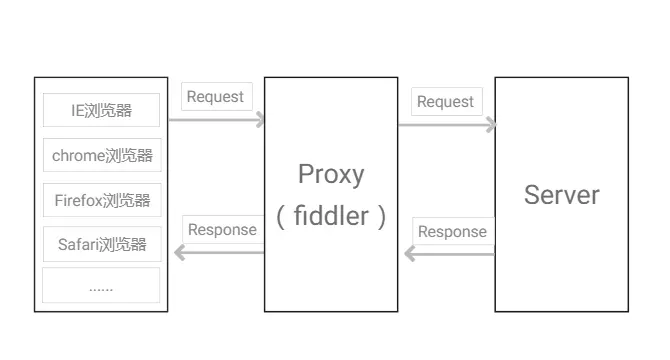
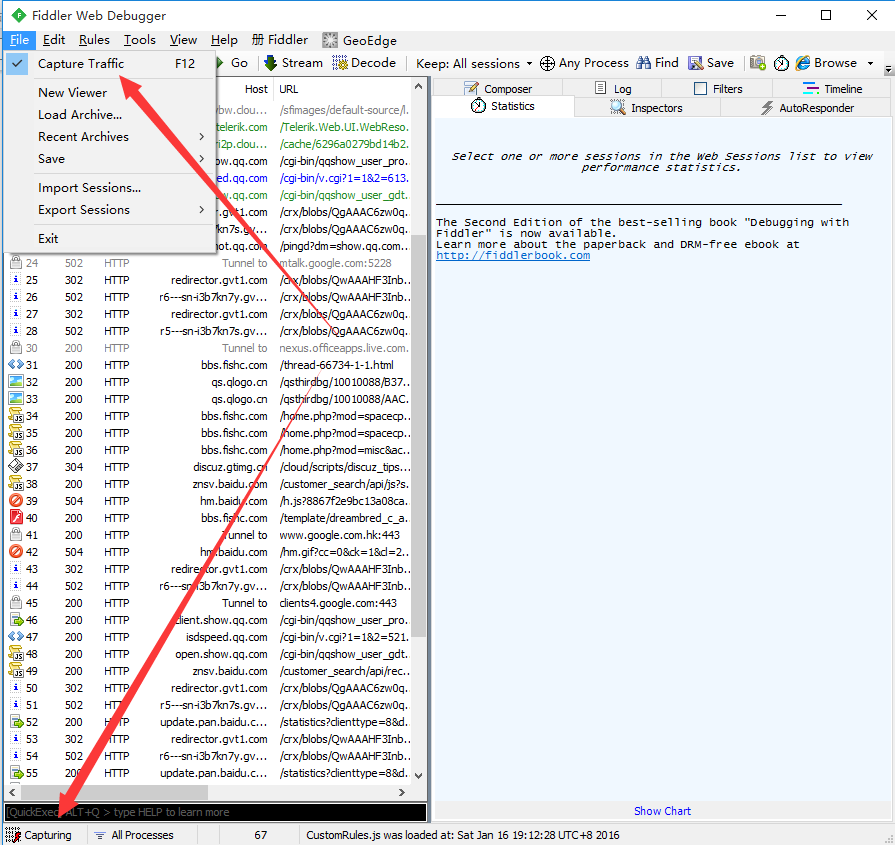
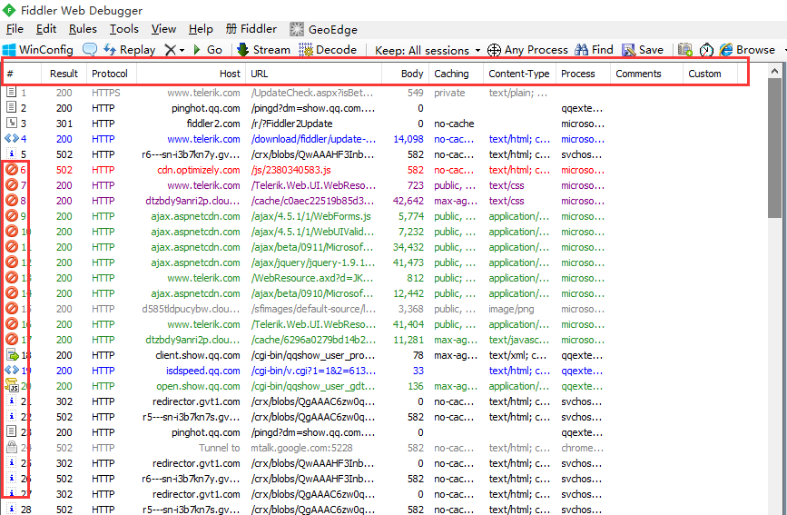
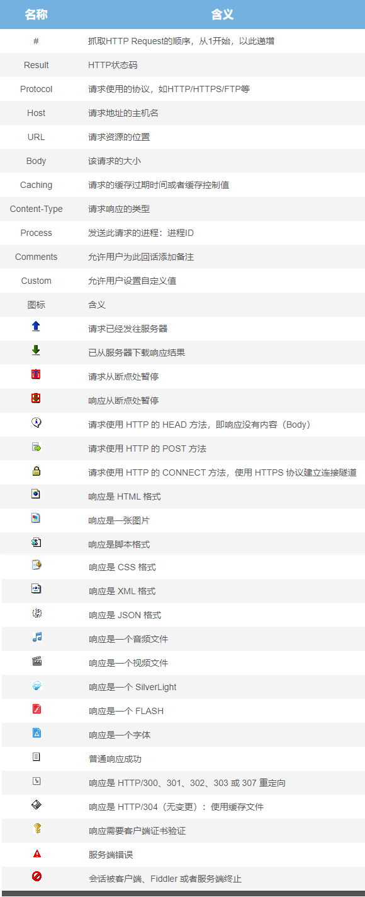
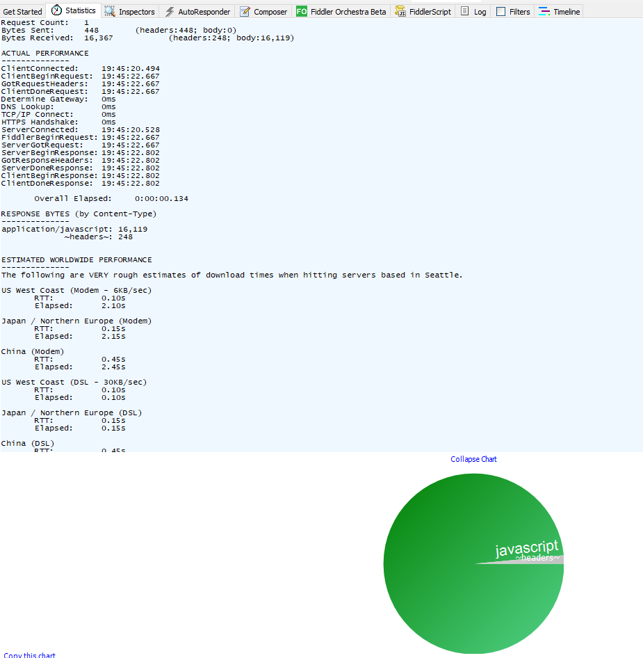
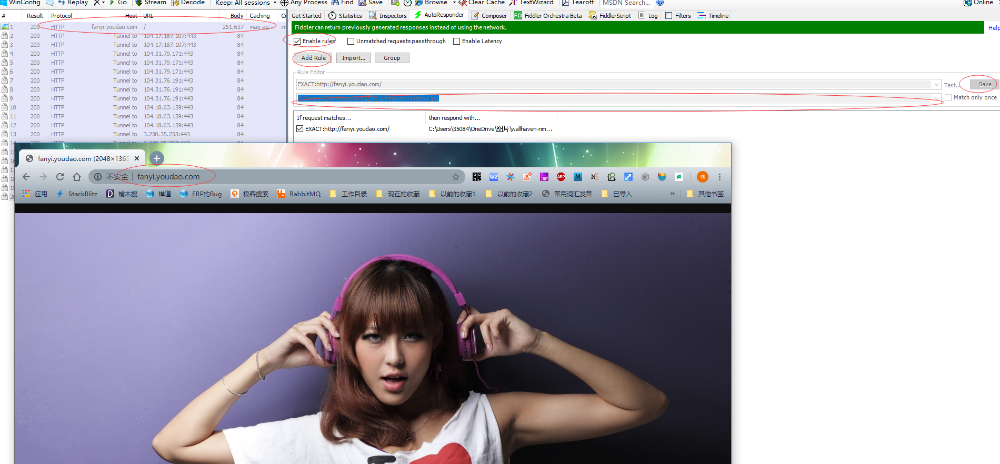
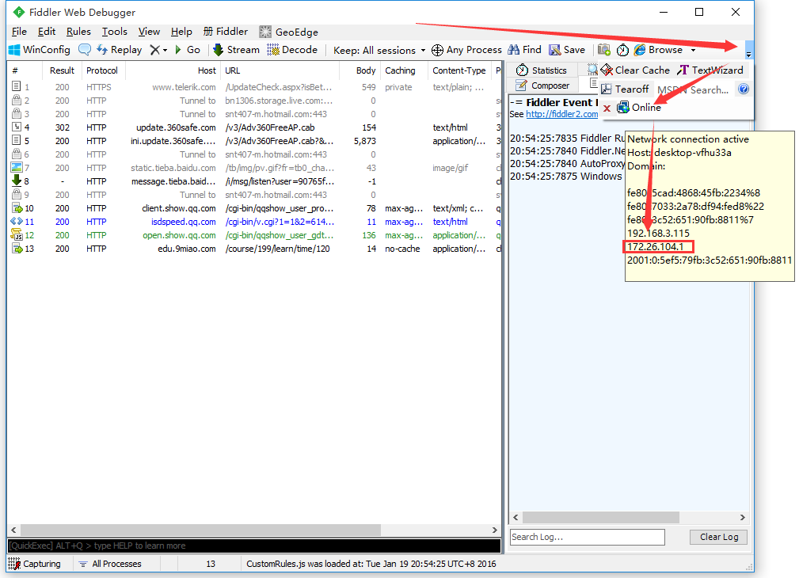
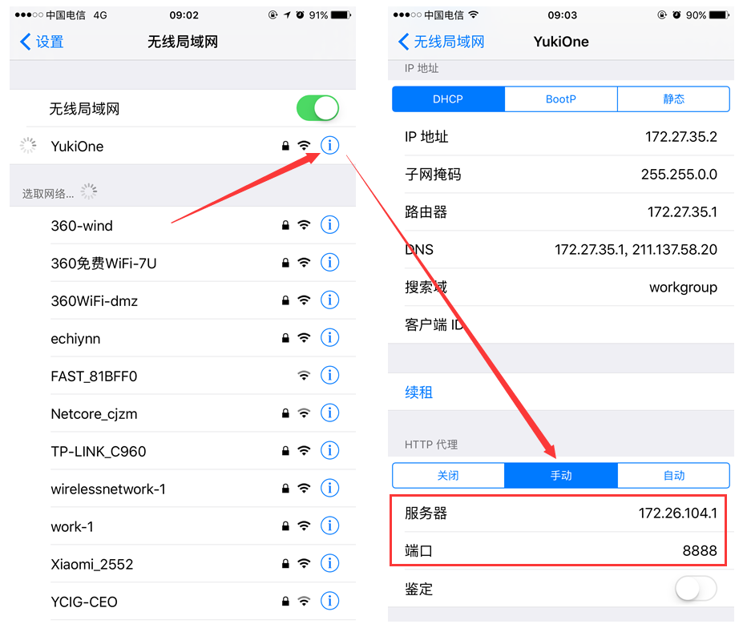

<!--toc-->
[TOC]
# Fiddler
Fiddler 是Telerik公司用C#写出来的,它包含一个简单却功能强大的基于JScript .NET 事件脚本子系统，它的灵活性非常棒，可以支持众多的http调试任务，并且能够使用.net框架语言进行扩展。

同类的工具有: httpwatch, firebug, wireshark, charles。

## Telerik
Telerik 和 DevExpress 都是.net UI的专家

## FiddlerCore（收费）
Fiddler 开放了他的FiddlerCoreAPI  提供给开发者调用，来处理所有的http请求

## 其它工具
### 代理抓包工具 Charles
Charles是一个HTTP代理/ HTTP监视器/反向代理，它使开发人员能够查看他们的机器和Internet之间的所有HTTP和SSL / HTTPS通信。这包括请求、响应和HTTP头(其中包含cookie和缓存信息)。
### Arkime（以前叫做Moloch）
最新版本的Arkime可以通过PolarProxy接收抓包并解密HTTPS流。
### AnyProxy
一个完全可配置的http/https代理在NodeJS

## Fiddler简介
Fiddler是比较好用的web代理调试工具之一，它能记录并检查所有客户端与服务端的HTTP/HTTPS请求，能够设置断点，篡改及伪造Request/Response的数据，修改hosts，限制网速，http请求性能统计，简单并发，接口测试，辅助自动化测试，等等。现在抓包工具成为测试人员的必备使用工具，开发人员也在普遍使用，进行问题的定位分析，是非常有助于工作的一款工具。

## Fiddler工作原理
Fiddler是通过改写HTTP代理，让数据从它那通过，来监控并且截取到数据。在打开它的那一瞬间，它就已经设置好了浏览器的代理了。当你关闭的时候，它又帮你把代理还原了

Fiddler工作于七层中的应用层，在client与webserver之间以代理服务器的形式存在，启动fiddler后会监听本地127.0.0.1的8888端口（默认端口），IE/Chrome浏览器会自动设置局域网代理（Firefox代理是独立的，需要单独设置）

此时，fiddler就作为代理服务器，浏览器访问87testing.com的流程：浏览器给webserver发送一个Request，代理服务器fiddler接收到Request，fiddler将Request发送到webserver，webserver接收到Request后进行处理，Response到代理服务器fiddler，Fiddler将Response返回到浏览器，如图：




## UI功能介绍


Fiddler想要抓到数据包，要确保Capture Traffic是开启，在File –> Capture Traffic。开启后再左下角会有显示，当然也可以直接点击左下角的图标来关闭/开启抓包功能。





### Statistics 请求的性能数据分析
还可以点击 下方的Show Chart


**先解释下字节byte**

1B（byte，字节）= 8 bit(位)
1KB=1024B
1MB=1024KB=1024×1024B

```
Request Count 请求次数:   1   
Bytes Sent 发送字节数:      448		(headers:448; body:0)
Bytes Received 接受字节数:  16,367		(headers:248; body:16,119)

ACTUAL PERFORMANCE 实际 表现
--------------
ClientConnected 连接时间:	19:45:20.494
ClientBeginRequest 开始接收时间:	19:45:22.667
GotRequestHeaders 得到请求头的时间:	19:45:22.667
ClientDoneRequest 完成请求的时间:	19:45:22.667
Determine Gateway 确定网关:	0ms 应该是与Fiddler代理相关的（https://www.telerik.com/forums/stats-determine-gateway-where-does-it-fit）
DNS Lookup 域名解析耗时: 		0ms
TCP/IP Connect TCP/IP连接耗时:	0ms
HTTPS Handshake HTTPS握手:	0ms
ServerConnected 服务连接的时间:	19:45:20.528
FiddlerBeginRequest Fiddler开始接收的时间:	19:45:22.667
ServerGotRequest 服务得到请求的时间:	19:45:22.667
ServerBeginResponse 服务开始响应的时间:	19:45:22.802
GotResponseHeaders 得到响应头的时间:	19:45:22.802
ServerDoneResponse 服务完成响应的时间:	19:45:22.802
ClientBeginResponse Client开始响应:	19:45:22.802
ClientDoneResponse Client完成响应:	19:45:22.802

	Overall Elapsed 总共耗时（ClientDoneRequest - ClientDoneResponse）:	0:00:00.134

RESPONSE BYTES (by Content-Type)
--------------
application/javascript: 16,119
             ~headers~: 248


ESTIMATED WORLDWIDE PERFORMANCE 估计全球性能
--------------
The following are VERY rough estimates of download times when hitting servers based in Seattle.

US West Coast (Modem - 6KB/sec)
	RTT:		0.10s
	Elapsed:	2.10s

Japan / Northern Europe (Modem)
	RTT:		0.15s
	Elapsed:	2.15s

China (Modem)
	RTT:		0.45s
	Elapsed:	2.45s

US West Coast (DSL - 30KB/sec)
	RTT:		0.10s
	Elapsed:	0.10s

Japan / Northern Europe (DSL)
	RTT:		0.15s
	Elapsed:	0.15s

China (DSL)
	RTT:		0.45s
	Elapsed:	0.45s


________________
Learn more about HTTP performance at http://fiddler2.com/r/?HTTPPERF
```
其它个人解释
```
说明：

1、request count：请求数，表示该session总共发起了多少个请求。

2、Bytes sent：发送请求的字节数（包括请求头和请求体）

3、Bytes received：接收到的字节数（包括响应头和响应体）

------------------------

4、clientconnected：客户端连接的时间；

5、clientbeginrequest：客户端开始发送请求的时间；

6、gotrequestheaders：获得请求头文件的时间；

7、clientdonerequest：客户端完成请求的时间；

8、determine gateway：确定网关使用的时间；

9、dns lookup：查看dns使用的时间；

10、tcp/ip connect：tcp/ip 连接使用的时间；

11、https handshake：https握手使用的时间；

12、serverconnected：服务连接发生的时间；

13、fiddlerbeginrequest：fiddler开始请求的时间；

14、servergotrequest：服务器得到请求的时间；

15、serverbeginresponse：服务器开始响应的时间；

16、gotresponseheaders：得到响应头文件的时间；

17、serverdoneresponse：服务器完成响应的时间；

18、clientbeginresponse：客户端开始响应的时间；

19、clientdoneresponse：客户端完成响应的时间；

20、overall elapsed：全部花掉的时间（使用客户端完成响应的时间-客户端开始请求的时间）

--------------------------------

response bytes（by content-type）--响应的字节（内容格式）

------

estimated worldwide performance

（世界其他地方的性能--即其他地方访问该网站需要的时间）
```


### Inspectors 查看数据内容
Inspectors（检查员）是用于查看会话的内容，上半部分是请求的内容，下半部分是响应的内容：


- Raw 未经处理的 原始内容
- Headers 头部
- SyntaxView 综合视图
- HexView 十六进制
- Auth 认证信息
- Cookies 
- Caching 缓存


### AutoResponder 允许拦截指定规则的请求
AutoResponder允许你拦截指定规则的求情，并返回本地资源或Fiddler资源，从而代替服务器响应。

我将“baidu”这个关键字与我电脑“f:\Users\YukiO\Pictures\boy.jpeg”这张图片绑定了，点击Save保存后勾选Enable rules，再访问baidu，就会被劫持。




#### 匹配规则
1. 字符串匹配（默认）：只要包含指定字符串（不区分大小写），全部认为是匹配

字符串匹配（baidu） |	是否匹配
---|---
http://www.baidu.com |	匹配
http://pan.baidu.com |	匹配
http://tieba.baidu.com |	匹配

2. 正则表达式匹配：以`regex:`开头，使用正则表达式来匹配，这个是区分大小写的

字符串匹配（`regex:.+.(jpg | gif | bmp ) $`）	|是否匹配
---|---
http://bbs.fishc.com/Path1/query=foo.bmp&bar	|不匹配
http://bbs.fishc.com/Path1/query=example.gif	|匹配
http://bbs.fishc.com/Path1/query=example.bmp	|匹配
http://bbs.fishc.com/Path1/query=example.Gif	|不匹配


### Composer 自定义请求发送服务器
Composer允许自定义请求发送到服务器，可以手动创建一个新的请求，也可以在会话表中，拖拽一个现有的请求

Parsed模式下你只需要提供简单的URLS地址  点击右边的 Execute按钮执行请求

可以代替Postman


### Filters 请求过滤规则
Fiters 是过滤请求用的，左边的窗口不断的更新，当你想看你系统的请求的时候，你刷新一下浏览器，一大片不知道哪来请求，看着碍眼，它还一直刷新你的屏幕。这个时候通过过滤规则来过滤掉那些不想看到的请求。

勾选左上角的Use Filters开启过滤器，这里有两个最常用的过滤条件：Zone和Host

1、Zone 指定只显示内网（Intranet）或互联网（Internet）的内容：
2、Host 指定显示某个域名下的会话：
如果框框为黄色（如图），表示修改未生效，点击红圈里的文字即可


### Timeline 请求响应时间
在左侧会话窗口点击一个或多个（同时按下 Ctrl 键），Timeline 便会显示指定内容从服务端传输到客户端的时间：

## Fiddler 设置解密HTTPS的网络数据

Tools--->Options--->HTTPS，
勾选CaptureHTTPS CONNECTs、Decrypt HTTPS traffic 有弹框就选择YES

也可以勾选ignore server certificate errors(unsafe) 忽略证书错误(不安全)，点击OK，会弹出证书直接确认即可。


## Fiddler 抓取Iphone / Android数据包

这时需要手机连接PC开启的热点(比如360wifi)

打开Fidder，点击菜单栏中的 Tools –> Options -> Connections 
设置代理端口是8888， 勾选 Allow remote computers to connect， 点击OK

这时在 Fiddler 可以看到自己本机无线网卡的IP了（要是没有的话，重启Fiddler，或者可以在cmd中ipconfig找到自己的网卡IP）


在手机端连接PC的wifi，并且设置代理IP与端口（代理IP就是上图的IP，端口是Fiddler的代理端口8888）


访问网页输入代理IP和端口，下载Fiddler的证书，点击FiddlerRoot certificate

> 注意：如果打开浏览器碰到类似下面的报错，请打开Fiddler的证书解密模式（Fiddler 设置解密HTTPS的网络数据）
No root certificate was found. Have you enabled HTTPS traffic decryption in Fiddler yet?


安装完了证书，可以用手机访问应用，就可以看到截取到的数据包了

## Fiddler自带方便的编码工具：TextWizard


## 修改电脑系统hosts
Tools -> Host

## 简单并发测试
选中请求  shift+u 可以设置无条件地重新发出此请求多少次

## 慢网络测试（限制网速）
Rules -> Customize Rules 搜索m_SimulateModem
```
在如下脚本中修改上传及下载延时毫秒数即可：

if (m_SimulateModem) {

        // Delay sends by 300ms per KB uploaded.

        oSession["request-trickle-delay"] = "300";

        // Delay receives by 150ms per KB downloaded.

        oSession["response-trickle-delay"] = "150";

    }

修改完成后，重启下fiddler，Rules---->Performance---->Simulate Modem Speeds，选中即可生效。
```

## 显示出服务器IP方法
Fiddler默认配置中是看不到服务器IP的，接下来简单介绍下在fiddler上也能够看到请求的服务器IP：

1、Fiddler---》Rules---》Customize Rules ，

2、在CustomRules.js里搜索找到：static function Main() ，

3、添加如下一行脚本：

FiddlerObject.UI.lvSessions.AddBoundColumn("Server IP", 120, "X-HostIP");`

完整js代码如下：
```
static function Main() { 

var today: Date = new Date(); 

FiddlerObject.StatusText = " CustomRules.js was loaded at: " + today; 

// Uncomment to add a "Server" column containing the response "Server" header, if present 

FiddlerObject.UI.lvSessions.AddBoundColumn("Server IP", 120, "X-HostIP"); 

}
```
添加完成后，重启下fiddler，就可以显示出请求的服务器ip。


## Fiddler 内置命令与断点

FIddler断点功能就是将请求截获下来，但是不发送，这个时候你可以干很多事情，比如说，把包改了，再发送给服务器


设置断点，篡改和伪造数据，在测试中使用的也较频繁，给大家举个一个真实的案例：比如使用支付宝购买虚拟商品，往支付宝跳转时，篡改了小的金额，结果购买虚拟商品成功了。（原本10元的商品，0.01元就搞定了）。多么可怕的一个bug啊，当然这个问题可能对于一个做过支付有过经验的测试朋友来说，可能会想：哎呀，这个问题都发现不了，还做什么测试？是的，问题是很简单，对于一个刚入职场的测试朋友或者没有支付相关经验的测试朋友来说，很有可能会忽略。


前面讲过fiddler作为代理服务器时的请求流程图，请求时，可被篡改的两个点：Before Requests、After Responses。


### 断点方法一
比如修改Requests方法：
点击 Rules---->Automatic Breakpoints---->Before Requests
此时请求被fiddler拦截掉，将右侧requests body里面的字段message内容前新增内容：“篡改requests数据成功！”，然后点击Run to Completion，先关闭掉拦截Rules---->Automatic Breakpoints---->Disabled，其他请求都放过，点击工具栏中的“Go”


### 断点方法二

在命令行中中断某一个域名的方式，如中断www.87testing.com，在命令行输入命令：bpu www.87testing.com,这样就可以拦截www.87testing.com的请求了，取消拦截输入命令：bpu

修改Responses方法：
点击Rules---->Automatic Breakpoints---->After Responses，方法跟修改Requests类似，无非修改的内容变成了Response。


### 命令行

常用命令，其它命令输入help
命令|对应请求项|介绍|示例
---|---|---|---
? | All | 问号后边跟一个字符串，可以匹配出包含这个字符串的请求 | ?google
> | Body | 大于号后面跟一个数字，可以匹配出请求大小，大于这个数字请求 |	>1000
< |	Body |	小于号跟大于号相反，匹配出请求大小，小于这个数字的请求	 |	<100
= |	Result |	等于号后面跟数字，可以匹配HTTP返回码 |	=200
@ |	Host |	@后面跟Host，可以匹配域名 |	@www.baidu.com
select |	Content-Type |	select后面跟响应类型，可以匹配到相关的类型 |	select image
cls |	All |	清空当前所有请求 |	cls
dump |	All |	将所有请求打包成saz压缩包，保存到“我的文档\Fiddler2\Captures”目录下	 |	dump
start |	All |	开始监听请求	 |	start
stop |	All |	停止监听请求	 |	stop
help |	All |	打开quickexec帮助文档	 |	help
bpafter  |	All |	bpafter后边跟一个字符串，表示中断所有包含该字符串的请求	 |	bpafter baidu（输入bpafter解除断点）
bpu |	All |	跟bpafter差不多，只不过这个是收到请求了，中断响应	 |	bpu baidu（输入bpu解除断点）
bps |	Result |	后面跟状态吗，表示中断所有是这个状态码的请求	 |	bps 200（输入bps解除断点）
bpv / bpm  |	HTTP方法 |	只中断HTTP方法的命令，HTTP方法如POST、GET	 |	bpv get（输入bpv解除断点）
g / go |	All |	放行所有中断下来的请求	 |	g


## 参考
[Fiddler的功能面板](https://www.cnblogs.com/poloyy/p/12129172.html)

[fiddler](https://www.jianshu.com/p/e810f52fa71e)
[Fiddler抓包工具总结](https://www.cnblogs.com/yyhh/p/5140852.html)